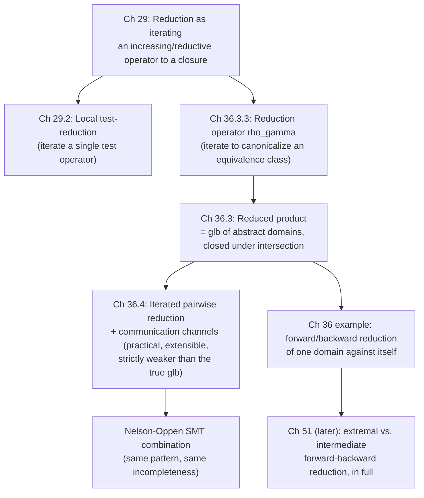

# Combining and Refining Abstract Domains

[[book-guidelines|↩ Back to guidelines]]

## Why one abstract domain is rarely enough

Every abstract domain you've met so far — signs, parity, intervals, congruences — is a lossy lens on the concrete semantics. Each lens is good at exactly one kind of question and useless for others: a sign domain can tell you a variable is positive but not that it's odd; a parity domain can tell you a variable is odd but not that it's positive. If you run these two analyses *separately* — sign analysis on one hand, parity analysis on the other — and just conjoin their answers at the end, you get an abstract domain that is exactly as precise as the weaker of the two lenses on any single fact and no more. Concretely: separate analyses of a loop like

```
x = 1;
while (x < n) { x = x + 2; }
```

give you "$x \geqslant 0$" from signs and "$x$ is odd" from parity, and conjoining them at the exit gives "$x \geqslant 0 \wedge \text{odd}$." But odd and nonnegative integers can never be $0$ — so the *true* best combined answer is "$x > 0 \wedge \text{odd}$." The extra precision (excluding $0$) only exists at the *intersection* of the two domains; neither domain alone can see it, and neither can a naive conjunction performed after the fact. To recover it, the two analyses have to talk to each other *during* the analysis, not just have their final answers ANDed together.

This chapter (spanning Chapter 29, "Reduction," and Chapter 36, "Reduced Product," in the book) is about the machinery for making abstract domains talk to each other: how to define an operator that improves one domain's answer using another's, how to iterate that operator safely to a fixpoint, and how to combine many domains at once without redesigning the whole analyzer every time you add a new one. This is precisely the mechanism behind the "meaning-preserving reduction" that lets a real static analyzer bolt together an interval domain, a congruence domain, and a linear-equality domain and get results none of them could produce alone — and, as you'll see, it's also *exactly* what SMT solvers do when they combine decision procedures for different theories (the Nelson–Oppen algorithm).

## Part 1 — Reduction as iterating an operator to a closure (Chapter 29)

### The idea, before the symbols

Suppose you have some abstract property $x$ and an operator $g$ that, given $x$, produces a *refinement* of it — some new piece of information consistent with $x$ but possibly adding constraints. If $g$ is well-behaved (it never contradicts what it's given, and it never loses information you already had), then applying $g$ once might not extract everything there is to extract: the refined property might itself admit further refinement by $g$. So you iterate: $x, g(x), g(g(x)), \ldots$ until it stops changing. What do you get at the end?

The book's answer is precise and elegant: you get a *closure operator* — specifically, the *smallest* closure operator that is everywhere at least as strong as $g$. This is worth pausing on, because it explains why "reduction" is the right word for this whole chapter's topic: reducing a property means finding its canonical, most-refined representative, and the way you compute that representative is by iterating a local refinement step until it saturates.

### The two flavors: extensive (upper) and reductive (lower)

The book actually needs *two* versions of this idea, because refinement can go in two directions depending on how the abstract domain is ordered.

**Upper reduction.** Let $g$ be an *increasing* (monotone) and *extensive* operator on a complete lattice $\langle L, \sqsubseteq, \bot, \top, \sqcap, \sqcup \rangle$ — extensive meaning $x \sqsubseteq g(x)$ for all $x$, i.e. $g$ only ever adds information that pushes $x$ *up* the lattice. Define the *upper reduction*

$$\hat\rho(x) \triangleq \mathrm{lfp}_x^{\sqsubseteq} g$$

the least fixpoint of $g$ that is $\sqsupseteq x$ (Lemma 29.1, [239]). Then $\hat\rho$ is the *smallest* upper closure operator (increasing, extensive, idempotent) that dominates $g$ pointwise: $g \mathrel{\dot\sqsubseteq} \hat\rho$, and any other closure operator $\rho'$ with $g \mathrel{\dot\sqsubseteq} \rho'$ satisfies $\hat\rho \mathrel{\dot\sqsubseteq} \rho'$. Concretely, $\hat\rho(x) = \sqcap\{y \mid g(y) \sqsubseteq y \wedge x \sqsubseteq y\}$ — the least fixpoint above $x$, obtained as the meet of all fixpoints-or-better above $x$. The proof that this is idempotent is a short, satisfying chase: $\hat\rho(x)$ is itself a fixpoint of $g$, so applying $\hat\rho$ again can't move it any further.

**Lower reduction.** The dual: if $g$ is increasing and *reductive* ($g(x) \sqsubseteq x$ — it only ever removes information, refining *downward*), and it relates to a Galois connection $\langle C, \preccurlyeq \rangle \xrightleftharpoons[\alpha]{\gamma} \langle A, \sqsubseteq \rangle$ with $f$ a lower closure operator on $C$ such that $\alpha \circ f \circ \gamma \mathrel{\dot\sqsubseteq} g$, then the *lower reduction*

$$\check\rho(x) \triangleq \mathrm{gfp}_x^{\sqsubseteq} g$$

(the greatest fixpoint below $x$) satisfies $\alpha \circ f \circ \gamma \mathrel{\dot\sqsubseteq} \check\rho \mathrel{\dot\sqsubseteq} g$ (Theorem 29.2), and by the dual of Lemma 29.1, $\check\rho$ is the *largest* lower closure operator pointwise $\leqslant g$. Iterating this idea $n$ times, $g^n$, gives Corollary 29.3: $\alpha \circ f \circ \gamma \mathrel{\dot\sqsubseteq} g^{n+1} \mathrel{\dot\sqsubseteq} g^n \mathrel{\dot\sqsubseteq} \check\rho$ — each iterate is sandwiched, getting monotonically closer to the true reduction.

Why does this matter more than "it's a nice mathematical fact"? Because it tells you *when it's safe to just iterate a local improvement step to convergence*: as long as your step is increasing and reductive (or extensive), the fixpoint you land on is automatically idempotent and extremal (nothing you already have stops being true, and applying the step again is a no-op) — you're not at risk of the iteration "overshooting" into an unsound or unstable result. If the lattice has infinite strictly descending chains, plain iteration to the exact fixpoint might not terminate — the book notes this is where a *narrowing* (stopping the iteration early, soundly) becomes necessary, the same convergence-forcing device used elsewhere for descending iterations.

```rust
// The shape of "iterate an increasing, reductive operator to its closure"
// is exactly a worklist/saturation loop — the same pattern behind
// union-find path compression or Datalog seminaive evaluation.
trait Lattice: PartialEq + Clone {
    fn meet(&self, other: &Self) -> Self;
}

fn iterate_reduction<T: Lattice>(mut x: T, g: impl Fn(&T) -> T) -> T {
    loop {
        let gx = g(&x);       // g is reductive: gx should be <= x
        if gx == x { return x; }   // fixpoint reached: this IS rho-hat/rho-check
        x = gx;
    }
}
```

In Lean, the closure-operator characterization is worth stating as a structure with its defining laws as fields, because that's exactly what the book proves about $\hat\rho$ and $\check\rho$:

```lean
structure UpperClosure (L : Type) [Lattice L] (g : L → L) where
  rho : L → L
  extensive  : ∀ x, x ≤ rho x
  increasing : ∀ x y, x ≤ y → rho x ≤ rho y
  idempotent : ∀ x, rho (rho x) = rho x
  dominates  : ∀ x, g x ≤ rho x
  smallest   : ∀ (rho' : L → L), (∀ x, g x ≤ rho' x) →
                 (∀ x, x ≤ rho' x) → (∀ x y, x ≤ y → rho' x ≤ rho' y) →
                 (∀ x, rho' (rho' x) = rho' x) → ∀ x, rho x ≤ rho' x
```

`lfp_x g` is literally `Order.leastFixedPoint` restricted to the up-set above `x` — the book's construction is the mathlib-style least-fixpoint-above-a-point idiom, phrased concretely.

### Applying it: local iterations for test reduction (§29.2)

The motivating application is *test reduction*. Recall (from the [[Cartesian-Abstraction|Cartesian abstraction]] chapter) that $\overline{\mathrm{test}}^\times\llbracket B \rrbracket$ — the Cartesian abstraction of "restrict the state to where Boolean expression $B$ holds" — is a lower closure operator, and (by an earlier exercise) it is also increasing and reductive. That means Corollary 29.3 applies directly: you can *iterate* $\overline{\mathrm{test}}^\times\llbracket B \rrbracket$ and each iterate gets more precise while staying sound, converging to the greatest fixpoint (or, if the domain has infinite descending chains, converging under a narrowing).

Why would iterating a *single* test operator ever produce new information on a second pass? Because a Cartesian domain analyzes each variable independently, and a compound test like `(x == z) nand (y == z)` constrains a *relationship* between variables that the first pass can only partially exploit — propagating what's learned about `z` back into what's known about `x` and `y` can, in turn, refine what's known about `z` again. This is the worked example the book gives, for the program:

```
l1: [x:e; y:e; z:e]  y = 1;
if l2: (z < 0) [x:e; y:o; z:e]
    l3: [x:e; y:o; z:e]  z = x;
else
    l4: [x:e; y:o; z:e]  z = y;
if l5: ((x == z) nand (y == z)) [x:e; y:o; z:T]
    l6: [x:e; y:o; z:T]  x = 1;
else
    l7: [x:e; y:o; z:_|_]  y = 2;
l8: [x:T; y:T; z:T]
```

(parities: `e` = even, `o` = odd, `T` = unknown/top, `_|_` = bottom/unreachable). Without local iteration, the `else` branch of `l5` gives up entirely on parity (`z:T`) because a single pass through a Boolean-combination test with `nand` can't cleanly split parity information across the components. With local iteration — repeatedly propagating the test's parity implications between $x$, $y$, and $z$ until nothing changes — the same branch tightens to `z:_|_` (this branch is in fact unreachable, since `z` cannot be both even and odd), and the loop's final state at `l8` sharpens from `[x:T; y:T; z:T]` to `[x:o; y:o; z:T]`. That's a strictly more precise, still sound, result obtained purely by *iterating a test operator against itself*, no new domain required.

The book is candid about the cost/benefit trade-off here: local iterations for tests help most when the domain is Cartesian (non-relational) and the Boolean structure of the test is what's hiding cross-variable information; for *relational* domains that already track variable correlations directly, or when Boolean operators are handled precisely some other way, the precision gain may not be worth the extra iteration cost — the book notes the Astrée analyzer specifically opts *not* to use local test iteration for this reason.

## Part 2 — Direct product versus reduced product (Chapter 36, §36.1–36.2)

### Two ways to run two analyses at once

If you have two abstract domains $\mathbb{D}_1$ and $\mathbb{D}_2$ (say, signs and parity), there are two very different things "running both" can mean.

**Direct product.** Run them side by side, completely independently: the abstract state is a pair $\langle P_1, P_2 \rangle$, the concretization is the *conjunction* $\gamma_1(P_1) \sqcap \gamma_2(P_2)$, and every operation — join, meet, [[Forward-Reachability-Semantics#Assignment|assignment]], test — is applied *componentwise*, with zero communication between components (Definition 36.1). This is simultaneous but *independent* analysis. Its result is provably identical to running the two analyses separately and conjoining their final answers — no more, no less. This is exactly what produces the "$x \geqslant 0 \wedge \text{odd}$" result from the introduction, missing the fact that $x > 0$.

**Reduced product.** Run them *dependently*: at every step, information discovered by one component is used to sharpen the other, on the fly (§36.2). The book's worked example (Example 36.3) continues the sign/parity loop: run separately, the exit invariant is $\geqslant 0$ for signs and $o$ (odd) for parity — conjoined, $\geqslant 0 \wedge o$. Run as a reduced product, the *on-the-fly* reduction step turns $\langle \geqslant 0, o\rangle$ into $\langle {>}0, o\rangle$ *during* the analysis — because a domain-crossing fact ("nonnegative and odd" $\Rightarrow$ "positive") gets folded back in immediately, before the next assignment ($x = x - 1$) is even processed. The next assignment then propagates from the *already-improved* precondition, so the final result is strictly more precise than what conjoining two separately-computed analyses could ever produce, no matter how you combine them after the fact. This is the qualitative leap: reduction *during* the analysis beats conjunction *after* the analysis, because information compounds across steps.

A weak special case worth naming: the **smash product**, where any component hitting $\bot$ (its "no reachable state" bottom) collapses *every* component to $\bot$ — because if $\gamma(\bot) = \varnothing$, one impossible component means the whole state is impossible. It's a reduction (it does improve on the direct product) but a very coarse one, propagating only "is this state possible at all," not any finer cross-domain fact.

## Part 3 — The reduced product, formally, and why it's the glb (§36.3)

### Definition (I): equivalence classes of the direct product

Formally (Definition 36.7), given abstract domains $\mathbb{D}_i = \langle \overline{\mathbb{P}}_i, \sqsubseteq_i, \ldots\rangle$, $i \in \Delta$, each abstracting the same concrete domain via $\gamma_i$, form their direct product $\mathbb{D}^\times$ with concretization $\gamma^\times(\langle P_i\rangle_{i\in\Delta}) \triangleq \sqcap_{i\in\Delta}\gamma_i(P_i)$. The **reduced product** $\mathbb{D}^\otimes$ is the quotient of $\mathbb{D}^\times$ by the equivalence relation "same concretization": $\vec P \equiv^\otimes \vec Q \iff \gamma^\times(\vec P) = \gamma^\times(\vec Q)$. Every operation of $\mathbb{D}^\times$ lifts to the equivalence classes, well-definedly, because the definitions don't depend on which representative you pick.

Why quotient rather than just picking a smarter direct product? Because many *syntactically different* tuples in the direct product denote the *exact same concrete property* — e.g. in Example 36.16, an abstract domain with both a "$+1$" and a "$+$" property, both concretizing to $\{z \in \mathbb{Z} \mid z \geqslant 0\}$, are equivalent encodings, but *composing transformers* on them can diverge: $f_1$ applied three times to $0$ stabilizes at $+$, while an equivalent-in-the-concrete transformer $f_2$ applied three times overshoots to $\top$. That's the practical hazard reduction is designed to close off: without collapsing equivalent representatives to a canonical one, iterating transformers can silently lose precision purely from *which* equivalent syntactic form you happened to be carrying around — not from any real loss of concrete information.

### Precision order and definition (II): the greatest lower bound

To say "reduced product is the *most precise combination*" needs a precise notion of *precision*. Definition 36.10 gives it: for abstract properties $\overline{\mathbb{P}}_1, \overline{\mathbb{P}}_2$ over the same concrete lattice $\langle \mathbb{P}, \sqsubseteq \rangle$ with concretizations $\gamma_1, \gamma_2$, say $\overline{\mathbb{P}}_2$ is *less precise* than $\overline{\mathbb{P}}_1$ (written $\overline{\mathbb{P}}_1 \lessapprox \overline{\mathbb{P}}_2$) whenever $\gamma_2(\overline{\mathbb{P}}_2) \subseteq \gamma_1(\overline{\mathbb{P}}_1)$ — domain 1 can express (at least) every concrete property domain 2 can express. This turns "the set of all abstract domains over a fixed concrete lattice, quotiented by equal-expressiveness" into a poset — in fact (Ward's theorem) a complete lattice, the *lattice of abstractions/abstract interpretations*, with the coarsest domain $\{\bullet\}$ (a single property meaning "true") at the top and the most precise domain $\wp(\mathbb{P})$ itself at the bottom.

**Theorem 36.14** is the payoff: the reduced product $\langle \mathbb{P}^\times/_{\equiv^\otimes}, \sqsubseteq^\otimes\rangle$ is the *greatest lower bound* — the glb, written $(a) \otimes (c)$ in the book's running lattice-of-abstractions picture — of the component domains $\langle \overline{\mathbb{P}}_i, \sqsubseteq_i\rangle$, $i \in \Delta$, *in that poset*: it is more precise than every component domain, and less precise than *any* other domain that is itself more precise than every component. That "any other domain" clause is where a subtlety hides: uniqueness of this glb (up to equivalence) requires the component domains to be **closed under finite intersection** (Definition 36.12: for any two properties $P, Q$ representable in the domain, there's a representable $R$ whose concretization is exactly $\gamma(P) \sqcap \gamma(Q)$). Without that closure property, several inequivalent domains could all sit "at the bottom" of what's more-precise-than-everything, so there'd be no single canonical glb — closure under intersection is exactly what pins the answer down to one domain, unique up to $\overline{\equiv}$.

### Definition (III): reduced product as reduction of the direct product

The third, most *constructive* characterization (Theorem 36.19, 36.22, 36.24) is what actually gets implemented. Given a Galois connection $\langle \mathbb{P}, \sqsubseteq\rangle \xrightleftharpoons[\alpha]{\gamma} \langle \overline{\mathbb{P}}, \sqsubseteq\rangle$ into a complete lattice, define the **reduction operator**

$$\rho_\gamma(a) \triangleq \sqcap \{a' \in \overline{\mathbb{P}} \mid \gamma(a) \sqsubseteq \gamma(a')\}$$

— literally, "the most precise representative that still concretizes to (at least) what $a$ concretizes to," i.e. the canonical, minimal representative of $a$'s equivalence class. Theorem 36.19 proves $\rho_\gamma$ is a **lower closure operator** (reductive, increasing, idempotent) — the same closure-operator vocabulary from Chapter 29, now instantiated concretely — and Theorem 36.22 proves it is **meaning-preserving**: $\gamma \circ \rho_\gamma = \gamma$, so canonicalizing never throws away concrete information, it only strips *redundant* abstract encodings of the same fact. Applying this construction to the direct product itself (Theorem 36.24, with $\vec\rho(\vec P) \triangleq \sqcap\{\vec P' \mid \gamma^\times(\vec P) \sqsubseteq \gamma^\times(\vec P')\}$) shows $\langle \vec\rho(\mathbb{P}^\times), \sqsubseteq^\times\rangle$ *is* the reduced product — the third definition collapses back onto the first two.

This is exactly a canonicalize-to-smallest-representative operation, which is a pattern every systems programmer already has muscle memory for:

```rust
// rho_gamma canonicalizes an abstract value to the *unique minimal*
// representative that concretizes to the same set — the same shape
// as normalizing a union-find root, or interning a hash-consed term.
trait AbstractDomain: Eq {
    type Concrete;
    fn gamma(&self) -> Self::Concrete;                 // concretization
    fn more_precise_or_eq(&self, other: &Self) -> bool; // a <= a' in the abstract order
}

fn canonicalize<D: AbstractDomain + Clone>(a: &D, candidates: &[D]) -> D
where D::Concrete: PartialOrd
{
    // rho_gamma(a) = meet { a' | gamma(a) <= gamma(a') } over all a' expressible
    candidates.iter()
        .filter(|a2| a.gamma() <= a2.gamma())
        .fold(a.clone(), |acc, a2| if a2.more_precise_or_eq(&acc) { a2.clone() } else { acc })
}
```

## Part 4 — Iterated pairwise reduction and communication channels (§36.4)

### Why not just build the full reduction every time?

The reduction operators $\rho_\gamma$ and $\vec\rho$ above are *strong*: they consider all abstract domains in the product simultaneously. That's precise, but it's a nightmare for engineering an extensible analyzer — every time you add a new domain (say, adding a congruence domain to an existing interval + sign analyzer), you would in principle have to redesign the reduction between *all* domains, together, from scratch.

The book's practical answer is **pairwise reduction** (Definition 36.25): design meaning-preserving reductions $\rho_{ij}$ between just *two* domains at a time, leaving all other components untouched, and *compose* them (Definition 36.27, equation 36.28):

$$\vec\rho \triangleq \bigcirc_{i,j \in \Delta} \vec\rho_{ij}$$

(function composition in some order). Since each $\rho_{ij}$ is individually meaning-preserving, and the composition of finitely many meaning-preserving reductions is again meaning-preserving (Lemma 36.21), $\vec\rho$ is safe to apply. And because a single pass of pairwise reductions might miss information that only surfaces after *another* domain has already been refined, you **iterate**: $\vec\rho^0 = \mathrm{id}$, $\vec\rho^{n+1} = \vec\rho \circ \vec\rho^n$ (Definition 36.29). Theorem 36.30 confirms the iterates form a descending chain, each one more precise than the last (up to the *n*-th iterate always $\sqsupseteq^\otimes$ the true glb-based reduction, and $\sqsupseteq^\otimes \rho_{ij}$ pairwise, and $\sqsupseteq^\otimes \vec P$), and every iterate stays meaning-preserving — exactly the Chapter 29 machinery (iterating an increasing, reductive operator to a closure) reapplied at the level of whole abstract domains instead of single lattice elements.

### The catch: iterated pairwise reduction is not always the full reduced product

This is not a free lunch, and the book is explicit about the gap. **Example 36.31** constructs three abstract domains over $\wp(\{a,b,c\})$ whose true reduced product minimum is $\{a\}$, but where every pairwise reduction $\rho_{ij}$ is already a no-op on the tuple $\langle \top, \{a,b\}, \{a,c\}\rangle$ — so the iterated pairwise reduction gets *stuck* at that tuple forever, never discovering the sharper $\{a\}$ that the *true* $n$-ary reduced product would find. Pairwise reduction only sees what two domains can tell each other; it's blind to constraints that only emerge from combining *three or more* simultaneously.

**Example 36.32 — the Nelson–Oppen algorithm** — is the sharpest illustration, and it connects directly outward: the Nelson–Oppen procedure for combining SMT decision procedures across background theories (equality, linear arithmetic, arrays, uninterpreted functions, …) *is* an instance of iterated pairwise reduction — propagating equalities and disequalities discovered by one theory's decision procedure into all the others, repeated to a fixpoint. And it inherits exactly this weakness: it is *incomplete* in general. The book's example is crisp — a theory of signs derives $x \geqslant 0$, a theory of parity derives "$x$ is odd," but neither theory can derive $x \neq 0$ on its own (it isn't phrased as an inequality between *variables*, which is the only vocabulary the pairwise interface exchanges), so $x \geqslant 0$ never gets sharpened to $x > 0$ by the iterated pairwise process — even though the *true* reduced product would get there immediately. Nelson–Oppen recovers completeness only under restrictive conditions (e.g. the component theories sharing no symbols), conditions the book notes are largely moot for program verification anyway, since verification is undecidable by Rice's theorem regardless.

If you are building a verifier that combines several decision procedures or abstract domains — the SMT/interval/congruence/linear-equality combination named directly in the standing learning goals — this is the concrete trade-off you are signing up for: pairwise reduction is what's implementable and incrementally extensible; the true reduced product is what's maximally precise; and the gap between them is a real, sometimes surprising, precision loss, not just a theoretical nicety.

### Communication channels: the practical architecture (§36.4.6)

To make pairwise reduction genuinely *pluggable* — so that adding a new domain never requires touching the internals of existing ones — the book proposes a **communication channel** $\mathbb{Cc}$ with its own concretization $\gamma_{\mathbb{Cc}}$, representing exactly the information domains are willing to share. Each domain $\overline{\mathbb{P}}_i$ is then extended with two primitives:

- $\mathsf{send} \in \overline{\mathbb{P}}_i \times \mathbb{Cc} \to \mathbb{Cc}$ — publish what domain $i$ currently knows into the shared channel, soundly: $\gamma_i(\overline P) \sqcap \gamma_{\mathbb{Cc}}(\overline Q) \sqsubseteq \gamma_{\mathbb{Cc}}(\mathsf{send}(\overline P, \overline Q))$.
- $\mathsf{receive} \in \overline{\mathbb{P}}_i \times \mathbb{Cc} \to \overline{\mathbb{P}}_i$ — pull information out of the channel to sharpen domain $i$'s own value, soundly, by the dual inequality.

A **scheduler** then orchestrates which pairwise communications to run, and in what order, once per new domain added — and, since the full fixpoint of iterated reduction can be expensive, it's entirely legitimate (Definition 36.29's iterates can be *stopped early*) to run only a partial reduction, trading a bounded amount of precision for a bounded cost. This is a genuinely elegant answer to the extensibility problem: it lets you write each abstract domain once against a narrow `send`/`receive` interface, never touching its peers, which is precisely the shape of a good trait-object plugin architecture:

```rust
trait AbstractDomainChannel {
    type Channel;
    // publish this domain's current knowledge into the shared channel
    fn send(&self, channel: &Self::Channel) -> Self::Channel;
    // absorb information from the channel to sharpen this domain
    fn receive(&mut self, channel: &Self::Channel);
}

fn iterated_pairwise_reduction<C>(
    domains: &mut [Box<dyn AbstractDomainChannel<Channel = C>>],
    mut channel: C,
    max_rounds: usize,
) {
    for _ in 0..max_rounds {                 // bounded: full fixpoint not required
        for d in domains.iter() { channel = d.send(&channel); }
        for d in domains.iter_mut() { d.receive(&channel); }
        // (a real scheduler would detect a no-op round and stop early)
    }
}
```

Note the caveat the book flags in §36.4.5: componentwise widening/narrowing on a reduced product is what normally guarantees termination of the analysis, but reduction interacting with widening can *break* that termination guarantee — the zone and octagon domains (closure, i.e. reduction, followed by widening) are the book's cited examples where this needs explicit care, either weakening the reduction or strengthening the widening.

## Part 5 — Forward and backward reduction interacting

The pairwise-reduction machinery above isn't limited to combining *different* domains — it also applies to combining a domain's own **forward** and **backward** propagation of the *same* fact. Example 36.37 in the book works through exactly this: consider a reduced product of equality tracking and sign analysis, and the assignment `a := sqrt(b) + a`. Propagating $\langle a = b, \top\rangle$ *forward* through this assignment gives $\langle \top, b \geqslant 0\rangle$ (with a runtime error assumed to stop execution if $b < 0$, since `sqrt` is undefined there) — but propagating the *same* precondition *backward* from that postcondition yields the sharper precondition $\langle a = b, b \geqslant 0 \wedge a \geqslant 0\rangle$, because knowing $a = b$ *and* $b \geqslant 0$ backward-implies $a \geqslant 0$ too. Feeding that sharpened precondition *forward* again gives the strictly better postcondition $\langle \top, a \geqslant 0 \wedge b \geqslant 0\rangle$ — strictly more precise than the plain forward pass alone, obtained purely by alternating forward and backward propagation and reducing between them.

This forward/backward interplay is the seed of a distinction the book develops in full generality much later (in the chapter on reduced forward–backward analysis): should you apply this kind of forward-backward reduction only at the **extremal** points of a computation — its initial and final states — or at **every intermediate program point**? Extremal reduction is cheaper (you reduce once, at the boundary) but strictly less precise, because information discovered deep inside a computation never gets the chance to sharpen the states around it; intermediate reduction reduces at every program point and is correspondingly more precise but more expensive, since it requires rerunning the reduction step throughout the whole control-flow graph rather than just at the entry and exit. The mechanism making either version sound is the same one already established here: iterating a meaning-preserving, reductive operator (this time built from a forward analysis and a backward analysis feeding each other) via the dual chaotic-iteration theorem, with a narrowing invoked if the domain lacks the descending-chain condition needed for termination.

## Where this leads



Everything in this article is one specialization of the single idea from Chapter 29: *iterating a suitably-behaved (increasing, extensive-or-reductive) operator produces a closure, safely*. Chapter 36 spends its whole length applying that one idea at a higher level of organization — not to a single abstract value, but to whole abstract domains being combined — and ends up needing exactly the same soundness argument (Lemma 36.21, Theorem 36.30) that Chapter 29 already proved in the small.

For the standing goals of building a Rust verifier and a metaprogramming elaborator, this chapter is close to load-bearing rather than incidental: any checker that combines more than one kind of reasoning — an interval domain plus a congruence domain plus a linear-equality solver, or several SMT theories behind a Hoare-triple checker — *is* an iterated pairwise reduction whether you name it that or not, and the communication-channel interface is a genuinely reusable design for keeping such a system's components decoupled. The Nelson–Oppen connection (Example 36.32) is worth remembering by name: it is the standard justification that a combination of decision procedures is sound, and the standard warning about exactly where such a combination can be *incomplete* — a limitation your own elaborator's unifier or your verifier's constraint solver will hit in the same shape, for the same underlying reason (information expressible only *across* two theories' shared vocabulary, not within either one alone).
