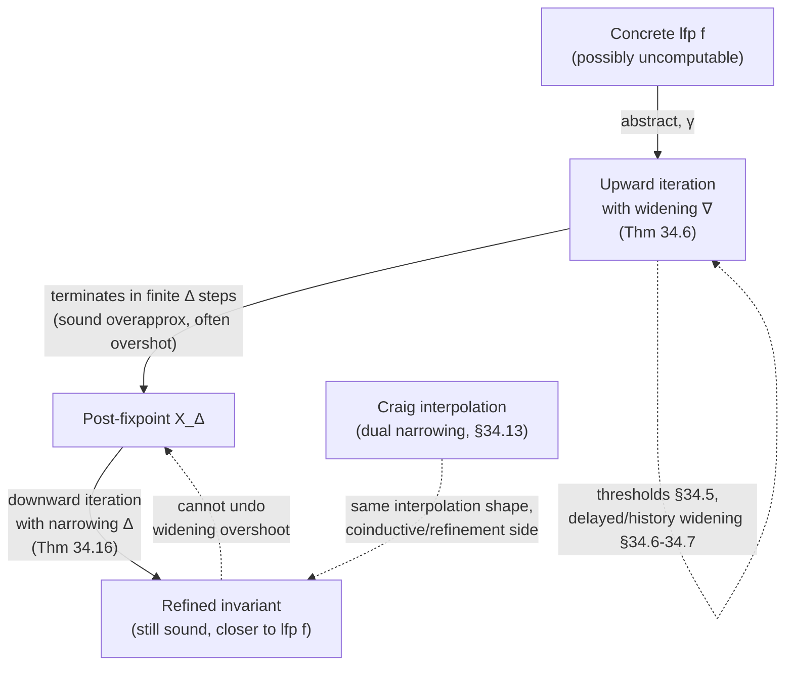

# Convergence Acceleration by Widening and Narrowing

[[book-guidelines|↩ Back to guidelines]]

## The problem: fixpoint computation doesn't terminate for free

Every static analysis in the abstract-interpretation framework reduces to computing (an overapproximation of) a least fixpoint: the least invariant closed under one step of the program's abstract transformer. When the concrete semantics is defined by Kleene iteration — start at $\bot$, keep applying $f$, take the limit — the natural instinct for a *static* analyzer is to do the same thing in the abstract domain: iterate the abstract transformer $\widehat{f}$ from $\widehat{\bot}$ until it stabilizes.

This works when the abstract domain satisfies the **ascending chain condition (ACC)**: every strictly increasing sequence of abstract elements is finite. Sign analysis, parity analysis, constancy analysis on a fixed finite variable set — all Noetherian, all guaranteed to stabilize in finitely many steps. But the moment you want an abstract domain expressive enough to say "$x$ is between 0 and 1001" rather than just "$x$ is nonnegative," you generally lose that guarantee. **Intervals** are the canonical example, and it's the one the book uses throughout chapter 34 to ground the general theory: the abstract domain $\langle \widehat{L}, \sqsubseteq \rangle$ of intervals over $\mathbb{Z}$ (or $\mathbb{R}$) has infinite strictly increasing chains, e.g. $[0,0] \sqsubset [0,1] \sqsubset [0,2] \sqsubset \cdots$, so naive Kleene iteration over intervals need not terminate — and even when it does, it can take arbitrarily long.

Chapter 33 walks through exactly this failure mode with a running example:

```
x = 0;
while (x < 1001) x = x + 1;
```

Interval-abstract iteration on this loop produces $[0,0], [0,1], [0,2], \ldots$ — an infinite ascending chain that would need 1002 iterations just to reach the true invariant $[0,1001]$, and for the unbounded family of programs $P_n \equiv \texttt{while (x<n) x=x+1;}$, no fixed number of iterations suffices at all. The book (section 33.4) names four ways out:

1. **Restrict to Noetherian (finitary) domains** — sacrifices expressiveness (more on why this fails structurally, not just practically, in the "Finitary versus infinitary" section below).
2. **Ask a human for the invariant** — sound but not automatic (this is what a Hoare-logic verifier does; see [[Invariance-Verification-and-Hoare-Logic]]).
3. **Soundly accelerate convergence** — the subject of this chapter: widening and narrowing.
4. **Unsoundly cap the number of iterations** — rejected outright; capping iterations without a widening throws away soundness, since the analysis would simply *guess* that the loop has converged.

Widening and narrowing are the book's answer to option 3, and chapter 34 generalizes the interval-specific mechanics of chapter 33 into a theory that applies to *any* non-Noetherian abstract domain.

## Iteration and convergence, formalized

Before defining widening, the book pins down what "iterate" and "converge" even mean over a domain that might not stabilize in finitely many steps. It extends $\langle \mathbb{N}, \leqslant \rangle$ to $\langle \mathbb{N}_\omega, \leqslant \rangle$ by adjoining a limit ordinal $\omega$ with $\forall n \in \mathbb{N}.\ n < \omega \leqslant \omega$ — this lets "the limit of the iterates" be indexed uniformly alongside the finite iterates rather than treated as a separate case.

**Definition 34.1 (iteration).** The iterates of $f \in L \to L$ from $a \in L$ on a poset $\langle L, \sqsubseteq, \sqcup \rangle$ are $\langle f^n, n \in \mathbb{N}_\omega \rangle$ such that
$$f^0 = a, \qquad f^{n+1} = f(f^n), \qquad f^\omega = \bigsqcup_{n<\omega} f^n$$
(the last equation assumes the least upper bound exists — true for CPOs when the iterates are increasing).

**Definition 34.2 (convergence).** The iterates converge to $\ell \in L$ at $\varepsilon \in \mathbb{N}_\omega$ iff $\forall n \geqslant \varepsilon.\ f^n = \ell$ — they are *ultimately stationary*.

In general the iterates don't converge, and there's no free lunch for computing the limit directly: if $L$ is a logic with quantifiers and each $f^n$ is expressible as a formula, the limit $f^\omega \triangleq \exists n.\ f^n$ is exactly quantifier elimination — which, per Tarski–Seidenberg, is *possible* for first-order real arithmetic but prohibitively expensive in practice. Widening exists precisely because exact quantifier elimination isn't a viable general strategy.

## Extrapolation by widening

### The intuition first

The idea, in plain terms: when two successive abstract iterates $x^n$ and $x^{n+1}$ disagree, instead of computing their join (which might again disagree with the next iterate, forever), **jump past both of them to a value you're confident is stable** — extrapolate the trend to its limit. For intervals, the book's example is literally derivative-based extrapolation, "as in Newton–Raphson" (footnote to chapter 33): if the lower bound is stable but the upper bound keeps growing, push the upper bound straight to $+\infty$ rather than incrementing it one step at a time. You trade precision (an interval like $[0,\infty]$ says much less than $[0,1001]$) for a *guarantee* that the trade only has to be paid once.

That specific rule is the **interval widening**:
$$[\ell_1, h_1] \mathbin{\nabla^i} [\ell_2, h_2] \;=\; \big[\, (\ell_2 < \ell_1 \;?\; -\infty : \ell_1),\ \ (h_2 > h_1 \;?\; +\infty : h_1) \,\big]$$
— keep a bound if it's stable, blow it out to infinity the moment it moves. Applied to the running loop example, $x^n = [0,0] \nabla^i [0,1] = [0,\infty]$ **in one step**, instead of the infinite unstable climb.

### The formal definition

**Definition 34.3 (widening).** Let $\langle L, \sqsubseteq \rangle$ and $\langle \widehat{L}, \widehat{\sqsubseteq} \rangle$ be concrete and abstract posets with increasing concretization $\gamma \in \widehat{L} \to L$.

- A **limit widening** $\nabla \in \wp(\widehat{L}) \to \widehat{L}$ is *sound* iff it's an abstract upper bound: $\bigsqcup \{ \gamma(x) \mid x \in S \} \sqsubseteq \gamma(\nabla S)$.
- A **successor widening** $\nabla \in \widehat{L} \times \widehat{L} \to \widehat{L}$ is *sound* iff $x \sqsubseteq x \mathbin{\nabla} y$ and $y \sqsubseteq x \mathbin{\nabla} y$ (the widened value is an upper bound of both operands, in the abstract order).

**Definition 34.4 (iteration with widening).** The upward iterates of $\widehat{f} \in \widehat{L} \to \widehat{L}$ from $a \in \widehat{L}$ with widening $\nabla$ are $X^0 = a$, and
$$X^{n+1} = \begin{cases} X^n & \text{if } \widehat{f}(X^n) \sqsubseteq X^n \\ X^n \mathbin{\nabla} \widehat{f}(X^n) & \text{otherwise} \end{cases} \qquad X^\omega = \nabla\{X^n \mid n < \omega\}$$

Crucially, the successor widening only depends on the *previous* iterate $X^n$ and the *new* candidate $\widehat{f}(X^n)$ — it's memoryless by default (this restriction is loosened later by history widening).

**Definition 34.5 (terminating widening).** A successor widening $\nabla$ is *terminating* iff for any increasing sequence $\langle x_n \rangle$ and any sequence $\langle y_n \rangle$ (not necessarily increasing, but each $y_n \sqsupseteq$-comparable to $x_n$ in the sense of overapproximating it) such that $x_{n+1} = x_n \nabla y_n$, the sequence $\langle x_n \rangle$ converges — there exists $\varepsilon$ with $x_{\varepsilon+1} = x_\varepsilon$.

### The soundness-and-termination theorem

**Theorem 34.6 (upward iteration with [terminating] widening).** Let $f$ be upper continuous on a CPO $\langle L, \sqsubseteq, \bot \rangle$, and $\widehat{f}$ semicommute with $f$ (i.e. $f \circ \gamma \sqsubseteq \gamma \circ \widehat{f}$). Then the widened iterates $X^n$:

1. **overapproximate** the concrete iterates: $\forall n \in \mathbb{N}_\omega.\ f^n \sqsubseteq \gamma(X^n)$;
2. are **increasing**: $X^n \mathbin{\widehat{\sqsubseteq}} X^{n+1}$;
3. **overapproximate the fixpoint**: $\exists \Delta \in \mathbb{N}_\omega.\ \mathrm{lfp}^\sqsubseteq f \sqsubseteq \gamma(X_\Delta)$;
4. and if $\nabla$ is **terminating**, then $\Delta \in \mathbb{N}$ (finite!) and $X_\Delta = X_{\Delta+1}$.

This is the whole payoff in one theorem: soundness is unconditional (you never need the widening to be terminating to get a correct overapproximation of the least fixpoint at *some* — possibly transfinite — ordinal), but *termination in finitely many steps* is exactly what a terminating widening buys you. Note what the theorem does **not** require: $\widehat{L}$ need not have lubs, even for chains, and $\widehat{f}$ need not be increasing. Only $f$ (the concrete transformer) has to be increasing — which, the book notes, is basically automatic, since "more possible interactions with the execution environment yield more possible program executions" (§34.3).

### The subtlety that trips people up: terminating widenings cannot be increasing

This is the fact the guidelines flag explicitly as "key and often misunderstood," and it's worth sitting with because it cuts against intuition. You'd think a *better* (more monotone, better-behaved) widening operator would be one that's increasing in its first argument — i.e. $x \sqsubseteq x' \Rightarrow x \nabla y \sqsubseteq x' \nabla y$. **It can't be, if it terminates.**

**Theorem 34.8.** Suppose $\widehat{f}$ has an infinite nonconverging increasing iteration $\langle X_n \rangle$ under some widening $\nabla$. Define $\nabla' (x, y) \triangleq x \nabla (x \sqcup y)$, so that the same iteration is realized as $X_{n+1} = \nabla'(X_n, \widehat{f}(X_n))$. If $\nabla'$ happens to be $\sqsubseteq$-increasing in its first argument, you can show $\nabla'$ reproduces the exact same non-converging sequence — contradiction. So no widening that's increasing in its first argument can enforce termination.

Concretely: $[0,0] \mathbin{\nabla^i} [0,1] = [0,\infty]$, and $[0,0] \sqsubseteq [0,1]$, but $[0,1] \mathbin{\nabla^i} [0,1] = [0,1] \not\sqsupseteq [0,\infty]$. The widening operator is deliberately *non-monotone* — the whole mechanism by which it forces termination is that it treats a *stable-looking* first argument differently from an *unstable-looking* one, which is inherently a non-monotone distinction. The book flags that this fact is misunderstood in at least one piece of published literature (§34.14): treating interval analysis as an instance of the "monotone data flow analysis framework" (which assumes increasing transformers) is simply inconsistent with what widening does, so conclusions drawn under that framing don't hold.

### More precise domains don't imply more precise analyses

Section 34.4 makes a second counterintuitive point: **a strictly more precise abstract domain can produce a strictly less precise analysis**, because precision of the *domain* (via its Galois connection, see [[Galois-Connections-and-Abstraction]]) says nothing about precision of its *widening*. The book's example: sign analysis says $x \geqslant 0$ on a loop where interval analysis — despite intervals being uniformly more precise than signs — says only $x \in [-\infty, 1]$, because $[1,1] \mathbin{\nabla^i} [0,1] = [-\infty,1]$ blows out a bound that the (widening-free, ACC-satisfying) sign join would never have touched. To guarantee interval analysis dominates sign analysis, you need the *widening itself* to be at least as precise as the sign join, not just the domain's join — precision has to be checked operator-by-operator, not just domain-by-domain.

## Refining widening without losing termination

### Thresholds

The interval widening's blunt "jump to $\pm\infty$" is improvable indefinitely, and section 34.5 shows how: pick a strictly increasing sequence of **thresholds** $T = \langle -\infty, t_1, \ldots, t_k, +\infty \rangle \subseteq \mathbb{Z} \cup \{\pm\infty\}$, and instead of jumping straight to infinity, jump only to the nearest threshold that bounds the growth. With $T = \langle -\infty, -1, 0, 1, \infty \rangle$ you recover $\nabla^i$; with $T = \langle -\infty, 1001, \infty \rangle$ applied to the running loop example, the widening converges *directly* to $[0,1001]$ — no narrowing needed at all (exercise 34.12). **Terminating widenings can always be refined further this way** — there's no fixed "best" widening, only an indefinitely improvable family, which is itself a fact worth internalizing: precision engineering in a real analyzer (e.g. Astrée, mentioned later in the book) is substantially about discovering good thresholds.

### Delayed widening

A cruder but common refinement: don't widen on the *first* time a loop-head value grows — take the plain join $\sqcup$ for the first $k$ iterations after entering the loop (or after a new path is discovered), *then* switch to $\nabla$. This buys the honest fixpoint a few unhindered steps to reveal itself before the widening starts truncating precision.

### History widening

Delayed widening is a special case of a more general move: let the widening depend on the **entire history** of past iterates, not just the immediately preceding one. Formally, replace the successor-widening step with $X^{n+1} = \widehat{\nabla}(\langle X_\delta, \delta \leqslant n \rangle, \widehat{f}(X_n))$ for a history widening $\widehat{\nabla}$. The ordinary successor widening is the special case where the history is abstracted down to just its last element. History widening matters operationally in domains where the *representation* isn't unique — the book flags (and works out in detail in the zone/octagon chapter, §40.1.8) the case where normalizing a value (e.g. by all-pairs shortest paths on a difference-bound-matrix) can silently **reintroduce a constraint that a previous widening step had already eliminated**, defeating termination even though each individual widening step looked sound. History widening fixes this by explicitly recording which constraints were previously widened away and refusing to let normalization bring them back.

## Interpolation by narrowing

### The intuition

Widening buys termination at a real precision cost — for the loop example, $x = [0,\infty]$ overshoots the true $[0,1001]$ by an unbounded margin. The natural next move: having reached *some* sound (if overshot) fixpoint overapproximation, iterate the transformer **downward** from there, refining rather than growing, and hope to converge back closer to the least fixpoint. This is **narrowing** — the book calls it *interpolation* by analogy with widening-as-extrapolation.

The interval narrowing only tightens bounds that were widened to infinity, leaving finite (already-trusted) bounds untouched:
$$[\ell_1,h_1] \mathbin{\Delta^i} [\ell_2,h_2] = \big[\, (\ell_1 = -\infty \;?\; \ell_2 : \ell_1),\ \ (h_1 = +\infty \;?\; h_2 : h_1) \,\big]$$

### The formal definitions

**Definition 34.14 (narrowing).** A successor narrowing $\Delta \in L \times L \to L$ is sound iff $\forall x,y.\ (y \sqsubseteq x) \Rightarrow (y \sqsubseteq x \mathbin{\Delta} y \sqsubseteq x)$ — the narrowed value stays sandwiched between the (presumably-overshot) previous value and the tighter candidate.

**Definition 34.15 (downward iteration with narrowing).** From $b$ with $\widehat{f}(b) \sqsubseteq b$ (i.e. $b$ is already a sound post-fixpoint, e.g. the output of the widening phase), iterate downward: $Y^0 = b$, $Y^{n+1} = Y^n$ if $\widehat{f}(Y^n) = Y^n$, else $Y^n \mathbin{\Delta} \widehat{f}(Y^n)$.

**Theorem 34.16.** The downward iterates are **decreasing**, always sound ($\mathrm{lfp}^\sqsubseteq f \sqsubseteq \gamma(Y^n)$ for every $n$ — narrowing never loses soundness, unlike widening it doesn't need a termination guarantee to remain correct at every step), and — if $\widehat{f}$ is increasing and the sequence converges to a limit $\ell$ — that limit **is a fixpoint** of $\widehat{f}$.

**Remark 34.17 (trivial narrowing).** $x \mathbin{\Delta} y = y$ satisfies definition 34.14 trivially, and theorem 34.16 shows it's sound to just **stop the downward iteration at any arbitrary rank** — this formalizes the intuition that "if you're out of budget, just quit; you're still sound" (this is a very different situation from *upward* iteration, where quitting early without a widening is unsound, since you'd be guessing you've reached a fixpoint when you haven't).

### The combined recipe, and what narrowing *can't* fix

Section 34.9 spells out the standard real-world recipe: **upward with widening, then downward with narrowing**. But narrowing is fundamentally limited — it can only refine values *already reached*, it cannot undo information already discarded. The running example shows this starkly: widening overshoots to $\widehat{x} = [0,\infty]$, $\widehat{y} = [1001,\infty]$; downward narrowing with $\Delta^i$ recovers $\widehat{x} = [0,1001]$ but is stuck leaving $\widehat{y} = [1001,\infty]$ — "frustrating," in the book's own words, because $[0,1001]$ for $x$ *was* recoverable but a tighter bound on $y$ was not, purely because narrowing only touches infinite bounds. Worse: **if the widening overshoots past a fixpoint that isn't the least one**, the downward narrowing iteration gets *blocked at that fixpoint* — it converges to something sound but strictly weaker than $\mathrm{lfp}\, f$, with no way to escape, because by construction narrowing only decreases and the spurious fixpoint is itself a fixed point of $\widehat{f}$.

This is why thresholds (an *upward*-side fix) and narrowing (a *downward*-side fix) are complementary rather than substitutes: a good threshold avoids the overshoot in the first place; narrowing only ever cleans up overshoot that's still recoverable after the fact.

## Where widening actually gets inserted: chaotic and asynchronous iteration

Section 34.10 is a short but practically important point. In the *structural* abstract interpreter of chapter 21 (built by induction on program syntax — see [[Fixpoint-Based-Verification-Proof-Methods]] and [[Chaotic-Iteration-and-Equational-Semantics]]), the widening only needs to be applied once, at loop heads — the recursive structure tells you exactly where the potentially-nonterminating fixpoint computations live. In the *unstructured*, equational-semantics style (a system of abstract equations solved by chaotic or asynchronous iteration, where at each step some subset of equations gets updated, possibly out of order or in parallel), there's no syntactic "loop head" to hang the widening on — you instead need a **dependency analysis of the equation system** to find the cycles, and insert widening at (a subset of) the edges that break those cycles. Get this placement wrong and you either widen too often (losing precision unnecessarily) or too rarely (failing to terminate).

## Finitary versus infinitary abstract domains: why Noetherian domains alone don't suffice

This is the chapter's deepest argument, and it directly answers "why not just avoid widening altogether by restricting to domains that always terminate?" The naive rebuttal is practical (Noetherian domains are less expressive), but the book gives a *structural* argument that's stronger.

Take the parametrized family of programs
$$P_n \;\equiv\; \texttt{x = 0; while (x < n) x = x + 1;} \qquad (n \in \mathbb{N})$$
Interval analysis with widening/narrowing (as worked out above for $n=1001$) yields the exact loop invariant $[0,n]$ **for every** $n$, uniformly, using the *same* analyzer. But these invariants $[0,0], [0,1], [0,2], \ldots$ form an **infinite strictly increasing chain** in the interval lattice. Any single Noetherian abstract domain — by definition — cannot contain an infinite strictly increasing chain, so it **cannot represent all of these invariants simultaneously**. A "safe" finitary domain, chosen once and used for every program, is therefore guaranteed to fail (produce a useless or diverging analysis) on infinitely many members of this family, even though a single infinitary domain equipped with widening/narrowing succeeds on *all* of them with one mechanism.

The obvious dodge — "just pick a domain per-program, tailored to that program's needed invariants" — is circular: **discovering** which invariants a program needs is exactly what the analysis is supposed to compute. You can't precompute the right finite domain without already having solved the analysis. This is why widening/narrowing on infinitary (non-Noetherian) domains isn't a stopgap or an engineering convenience — it's structurally necessary for any analyzer that has to handle an open-ended class of programs with a single, fixed abstract domain and transformer.

(A related but distinct footnote from chapter 33 is worth remembering here: a domain that looks infinite in principle — e.g. constancy analysis over an unbounded variable universe $\mathbb{V}$ — is actually *finite for any one program* once you restrict $\mathbb{V}$ to the program's own finitely many variables. Confusing "infinite in the abstract" with "infinite for this program" is a common source of claiming widening is unnecessary when it's actually just been implicitly restricted to a finite instance.)

## Hidden widenings, and the Craig interpolation connection

Section 34.12 makes a point that resonates directly with the "abductive reasoning / Craig interpolation" thread this workbench tracks across books: widening doesn't only show up where it's *labeled* "widening." **Robin Milner's polymorphic type inference algorithm** (Algorithm W, used for Hindley–Milner type systems) contains a hidden widening to handle recursive definitions — generalizing a type scheme at a `let`-binding is, structurally, exactly a widening step: it jumps from "the type inferred so far" to a *generalized* upper bound that's guaranteed not to keep growing on repeated recursive calls, trading precision (you lose the specific instantiation) for guaranteed termination of the inference procedure. If your target elaborator ever needs to handle recursive `let`-polymorphism, this is the widening-shaped part of that problem.

Symmetrically, narrowing can be hidden too — $x \mathbin{\Delta} y = y$ (the trivial narrowing, remark 34.17) is sound by construction, so "just stop after $k$ downward iterations" is a hidden narrowing wherever it appears.

And then there's the duality (§34.13) that matters most for the abductive-reasoning thread: **widenings and narrowings are not dual to each other**, but each has its own dual, usable to accelerate *coinductive* (greatest-fixpoint) iteration rather than inductive (least-fixpoint) iteration. The book's example of a dual narrowing is **Craig interpolation** in the abstract domain of first-order formulas — explicitly *not itself a widening* (it doesn't force termination the way $\nabla$ does), but structurally playing the interpolation role on the descending/coinductive side. This is a genuinely useful thing to carry into verification-condition work: when you're using a Craig interpolant to refine an overapproximate abstraction (the classic CEGAR-style refinement loop), you are, in this book's vocabulary, running a *dual-narrowing* step — sound tightening of a candidate invariant guided by a spurious counterexample, structurally the same shape as narrowing minus the termination guarantee.

## Grounding the mechanism

### Rust — the shape a real analyzer's fixpoint solver takes

This maps almost directly onto the invariant-inference core of a verifier. The soundness contract (widen produces an upper bound; narrow stays sandwiched) is exactly the kind of thing worth encoding as a trait so every abstract domain you add later inherits the same fixpoint-solving loop:

```rust
trait AbstractDomain: PartialOrd + Clone {
    fn bottom() -> Self;
    fn join(&self, other: &Self) -> Self;
    /// Sound: self ⊑ self.widen(other) and other ⊑ self.widen(other).
    fn widen(&self, other: &Self) -> Self;
    /// Sound: if other ⊑ self then other ⊑ self.narrow(other) ⊑ self.
    fn narrow(&self, other: &Self) -> Self;
}

#[derive(Clone, Copy, PartialEq)]
enum Bound { NegInf, Fin(i64), PosInf }

#[derive(Clone, PartialEq)]
struct Interval { lo: Bound, hi: Bound } // ⊥ represented separately, or as an empty flag

impl Interval {
    fn widen_thresholds(&self, other: &Interval, thresholds: &[i64]) -> Interval {
        // §34.5: jump to the nearest threshold that still bounds the growth,
        // instead of straight to ±∞.
        let lo = if other.lo < self.lo {
            thresholds.iter().rev().find(|&&t| Bound::Fin(t) <= other.lo)
                .map_or(Bound::NegInf, |&t| Bound::Fin(t))
        } else { self.lo };
        let hi = if other.hi > self.hi {
            thresholds.iter().find(|&&t| Bound::Fin(t) >= other.hi)
                .map_or(Bound::PosInf, |&t| Bound::Fin(t))
        } else { self.hi };
        Interval { lo, hi }
    }
}

/// Theorem 34.6's upward iteration, generic over any AbstractDomain.
fn analyze_upward<D: AbstractDomain>(f: impl Fn(&D) -> D, max_steps: usize) -> D {
    let mut x = D::bottom();
    for _ in 0..max_steps {
        let fx = f(&x);
        if fx <= x { return x; }        // definition 34.4: already a post-fixpoint
        x = x.widen(&fx);               // extrapolate
    }
    x // if we get here without a *terminating* widening, this loop never was guaranteed to stop
}

/// Theorem 34.16's downward refinement, run after analyze_upward.
fn refine_downward<D: AbstractDomain>(f: impl Fn(&D) -> D, start: D, steps: usize) -> D {
    let mut y = start;
    for _ in 0..steps {
        let fy = f(&y);
        if fy == y { return y; }        // converged to an actual fixpoint (theorem 34.16)
        y = y.narrow(&fy);
    }
    y // remark 34.17: sound to stop anywhere, even mid-narrowing
}
```

The point of writing it this way is that `analyze_upward` terminates *only because* `widen` is assumed terminating — that assumption is a proof obligation on each `AbstractDomain` impl, not something the generic solver can check. That's precisely theorem 34.6's hypothesis structure: soundness is unconditional, termination is conditional on a property of `widen` the type system can't express but a Lean proof can.

### Lean — encoding the proof obligations that Rust's type system can't

Where Rust can only *assert* (via a doc comment) that `widen` is sound and terminating, Lean can make it a first-class field you have to actually discharge:

```lean
structure Widening (L : Type) [Preorder L] where
  widen : L → L → L
  sound_left  : ∀ x y, x ≤ widen x y
  sound_right : ∀ x y, y ≤ widen x y

-- Definition 34.5, transliterated: no infinite strictly-growing widened
-- sequence can avoid stabilizing.
def Terminating {L : Type} [Preorder L] (∇ : Widening L) : Prop :=
  ∀ (x y : ℕ → L), (∀ n, x n ≤ x (n+1)) →
    (∀ n, x (n+1) = ∇.widen (x n) (y n)) →
    ∃ ε, x (ε+1) = x ε

-- Theorem 34.8, as a Lean statement worth having on file even before proving it:
-- a terminating widening cannot be monotone in its first argument.
theorem terminating_not_monotone {L : Type} [Preorder L] (∇ : Widening L)
    (hterm : Terminating ∇) (hnontrivial : ∃ y, ¬ ∃ ε, True) :
    ¬ ∀ x x' y, x ≤ x' → ∇.widen x y ≤ ∇.widen x' y := by
  sorry -- the book's proof: monotonicity + a nonconverging chain reproduces itself under ∇'
```

This is exactly the kind of "state the theorem, prove the easy direction, `sorry` the hard one until later" workflow that's useful when building toward a from-scratch theorem prover: theorem 34.8 is a genuine, nontrivial, checkable mathematical fact about your solver's widening operator, and having it as a Lean obligation rather than a comment is what would catch a broken widening implementation (e.g. accidentally writing a monotone one) at proof-development time instead of via a hung analyzer.

### Python — the interval widening/narrowing rules, minimal

```python
from math import inf

def widen_interval(x, y):          # (l1,h1) ∇ (l2,h2), definition from §33.5
    (l1, h1), (l2, h2) = x, y
    return (l1 if l2 >= l1 else -inf, h1 if h2 <= h1 else inf)

def narrow_interval(x, y):          # (l1,h1) Δ (l2,h2), definition from §33.6
    (l1, h1), (l2, h2) = x, y
    return (l2 if l1 == -inf else l1, h2 if h1 == inf else h1)

x = (0, 0)
for _ in range(2000):
    nxt = (x[0], x[1] + 1)          # x = x + 1 in the loop body, unconditionally increasing
    if nxt[1] <= x[1]: break
    x = widen_interval(x, nxt)      # jumps straight to (0, inf) after one unstable step
print(x)                             # (0, inf) — overshoot, as the book's example shows
```

## Where this leads

Widening and narrowing are the load-bearing mechanism that makes automatic static analysis *possible at all* on any domain rich enough to be interesting — everything downstream in the book that introduces a genuinely non-Noetherian domain (intervals in ch. 33, congruences in ch. 31, zones and octagons in ch. 40, and the affine-equality domain of ch. 38 as the interesting *counterexample* that needs neither) has to say explicitly how it instantiates $\nabla$ and $\Delta$, and the zone/octagon chapter's *history widening* is a direct, concrete application of §34.7's generalization. Chapter 35 (fixpoint checking) builds directly on top of theorem 34.6, using a target specification $P$ to *constrain* the widened iteration and reduce overshoot — a precision refinement on the widening machinery itself, not a replacement for it.



For the standing verifier/elaborator project: this chapter *is* the mechanism your invariant-inference engine will run, every time it hits a loop or a recursive call over an unbounded domain. And the duality with Craig interpolation (§34.13) is the direct bridge to the CEGAR-style refinement loop this workbench is tracking separately — narrowing-after-widening on the induction side, interpolation-guided refinement on the counterexample side, are the same "interpolate to recover precision, but never past what's structurally recoverable" pattern wearing two names.
