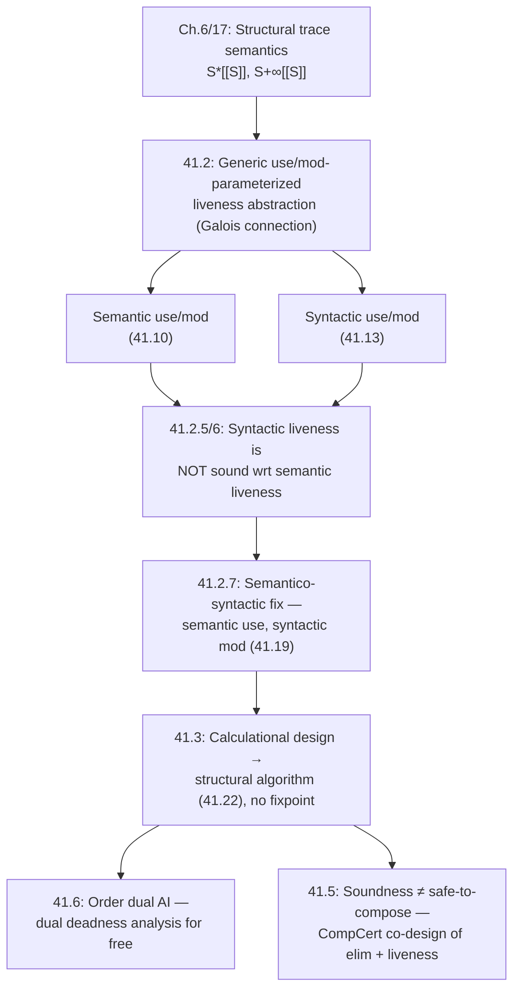

[[book-guidelines|↩ Back to guidelines]]

# Dataflow Analysis as Abstract Interpretation

## Why this chapter exists

Live-variable analysis — "will this variable's current value still be read before it gets overwritten?" — is one of the oldest static analyses in compiler construction. Frances Allen and John Cocke used it for register allocation decades before abstract interpretation existed as a theory, and their algorithm was *postulated*: a set of local equations over a flowchart, justified informally by appeal to "the merge over all paths." It works, compilers still use it, but nobody had pinned down precisely *what property of the program's actual execution* the algorithm was soundly approximating. Cousot's chapter does that pinning-down — and the result is uncomfortable: the classic definition of "syntactic liveness" you'll find in every compilers textbook is not, in general, a sound overapproximation of the intuitive semantic notion of liveness. It can be wrong in both directions.

This matters for two reasons that go beyond historical tidiness. First, an analysis whose soundness statement is fuzzy is an analysis whose bugs are hard to locate — and the chapter walks through an actual class of soundness bugs (mishandled dead-code elimination composed with register allocation) that arises precisely because of this fuzziness, with CompCert's fix as the payoff example. Second, once liveness is reformulated as an honest Galois-connection abstraction of trace semantics, its "calculational design" collapses the traditional two-pass, fixpoint-iterating dataflow framework into a single structural recursion over the syntax tree — no fixpoint needed at all. That's a striking result: the complexity people associate with dataflow analysis (iterate-to-a-fixpoint over a flowchart) turns out to be an artifact of the flowchart presentation, not of liveness itself.

## 1. Potential versus definite liveness (and deadness)

**The problem straight-line code doesn't have.** Consider a sequence of assignments with no branches. There's exactly one execution path, so "is $x$ used before being reassigned" has an unambiguous yes/no answer at every program point. The book's Example 41.1 walks a five-statement block this way: at each label $\ell_i$, you can just read off liveness by tracing forward from $\ell_i$ to the end and asking, along *the* execution, whether $x$ (or $y$) is read before written.

**What breaks with branches.** As soon as the program has a conditional or a loop, there can be several execution paths from a given point, and they can disagree. A variable might be used on some paths and not others. This forces a choice of *how* to merge the per-path answers into a single verdict at each point:

- **Potential liveness**: live if the variable is used-before-modified on *at least one* path (join/union over paths).
- **Definite liveness**: live if it's used-before-modified on *all* paths (meet/intersection over paths).

Register allocation cares about potential liveness — you must keep a variable's value around if *any* execution might still need it, since you don't know at compile time which path will actually run. Definite deadness (its dual — "modified before use on every path") is the property that licenses safely discarding a register: you need "no matter what happens, this value is dead" before you overwrite it. The two are De Morgan duals of each other, which is why the book's formal definitions are stated once, generically, and then instantiated four ways: potential liveness, definite liveness, potential deadness, definite deadness.

**The book's generic definition.** Rather than write down four separate recursive definitions, the chapter parameterizes a single definition by two abstract operations: $use$ (what variables does executing this action *read*?) and $mod$ (what variables does it *write*?). The live-variables-at-a-point predicate is defined by backward induction along a trace $\pi$:

$$
\alpha^{l}_{use,mod}\llbracket S \rrbracket\, L_b, L_e \langle \pi_0, \ell \rangle \triangleq \{x \in \mathbb{V} \mid (\ell = \mathsf{after}\llbracket S\rrbracket \wedge x \in L_e) \vee (\mathsf{escape}\llbracket S \rrbracket \wedge \ell = \mathsf{break\text{-}to}\llbracket S\rrbracket \wedge x \in L_b)\}
$$
$$
\alpha^{l}_{use,mod}\llbracket S \rrbracket\, L_b, L_e \langle \pi_0, \ell \xrightarrow{a} \ell' \pi_1 \rangle \triangleq \{x \in \mathbb{V} \mid x \in use\llbracket a \rrbracket \varrho(\pi_0) \vee (x \notin mod\llbracket a \rrbracket \varrho(\pi_0) \wedge x \in \alpha^{l}_{use,mod}\llbracket S \rrbracket\, L_b, L_e \langle \pi_0 \frown \ell \xrightarrow{a} \ell', \ell'\pi_1 \rangle)\}
$$

Read this the way you'd read a backward dataflow recurrence in a compiler: liveness at the *exit* label is seeded by $L_e$ (variables the caller says are live on normal exit) or $L_b$ (variables live if control leaves via a `break`); liveness one step earlier than a live point propagates backward unless the intervening action kills ($mod$s) the variable, in which case the earlier use of that action's own $use$ set is what matters instead. Then potential/definite liveness for the *whole trace set* $\mathcal{S}$ of a component (not just one trace) is the union/intersection over all traces starting the same way:

$$
\alpha^{\exists l}_{use,mod}\llbracket S \rrbracket\, \mathcal{S}\, L_b, L_e \triangleq \bigcup_{\langle\pi_0,\pi\rangle \in \mathcal{S}} \alpha^{l}_{use,mod}\llbracket S \rrbracket\, L_b, L_e \langle \pi_0, \pi \rangle \quad \text{(41.3, potential)}
$$
$$
\alpha^{\forall l}_{use,mod}\llbracket S \rrbracket\, \mathcal{S}\, L_b, L_e \triangleq \bigcap_{\langle\pi_0,\pi\rangle \in \mathcal{S}} \alpha^{l}_{use,mod}\llbracket S \rrbracket\, L_b, L_e \langle \pi_0, \pi \rangle \quad \text{(41.4, definite)}
$$

and deadness is defined dually by negation: $\alpha^{\exists d}_{use,mod}\llbracket S\rrbracket\, \mathcal{S}\, D_b, D_e \triangleq \neg\alpha^{\forall l}_{use,mod}\llbracket S\rrbracket\, \mathcal{S}\, \neg D_b, \neg D_e$.

Everything here is an *abstraction* of the trace semantics $\mathcal{S}^{+\infty}\llbracket S \rrbracket$ (the set of maximal traces of $S$) — it's literally the same "merge over all paths" idea compiler courses gesture at, made rigorous as a join/meet-abstraction of a set of traces. Nothing in the definition yet says *what* $use$ and $mod$ mean; that's the next section's job, and it's exactly where the trouble starts.

```rust
// The generic shape, made concrete: liveness is a backward fold over a trace,
// parameterized by how you decide "used" and "modified" for one action.
trait LivenessOracle {
    fn used(&self, action: &Action, env: &Env) -> HashSet<Var>;
    fn modified(&self, action: &Action, env: &Env) -> HashSet<Var>;
}

// Potential liveness at a point = fold backward over the remaining trace,
// unioning uses and killing on modifications — this is (41.2) unrolled.
fn live_before(
    oracle: &dyn LivenessOracle,
    trace: &[(Action, Env)], // remaining suffix from this point to exit
    live_at_exit: &HashSet<Var>,
) -> HashSet<Var> {
    trace.iter().rev().fold(live_at_exit.clone(), |live_after, (a, env)| {
        let used = oracle.used(a, env);
        let modified = oracle.modified(a, env);
        used.union(&(&live_after - &modified)).cloned().collect()
    })
}
```

## 2. Semantic versus syntactic use and modification

This is the crux of the chapter, and it's worth sitting with the two candidate definitions of $use$ side by side.

**Semantic use/modification.** An action *semantically uses* $y$ in environment $\rho$ if changing $y$'s value *could* change the observable effect of executing the action — formally, there exists some alternative value $\nu$ for $y$ such that re-evaluating the action's expression under $\rho[y \leftarrow \nu]$ gives a different result:

$$
use\llbracket x = A \rrbracket\, \rho \triangleq \{y \mid \exists \nu \in \mathbb{V}.\ \mathcal{A}\llbracket A \rrbracket \rho \neq \mathcal{A}\llbracket A \rrbracket \rho[y \leftarrow \nu] \wedge \rho(x) \neq \mathcal{A}\llbracket A \rrbracket \rho\}
$$
$$
mod\llbracket a \rrbracket\, \rho \triangleq \{x \mid a = (x = A) \wedge \rho(x) \neq \mathcal{A}\llbracket A \rrbracket \rho\}
$$

Notice the extra clause in $use$: $\rho(x) \neq \mathcal{A}\llbracket A \rrbracket \rho$. It says $x$ isn't semantically "used" in its own [[Forward-Reachability-Semantics#Assignment|assignment]] if the assignment is a no-op — this is what makes $x \notin use\llbracket x = x \rrbracket\, \rho$ and, more subtly, $y \notin use\llbracket x = y - y \rrbracket\, \rho$: even though $y$ *textually* appears on the right-hand side, its value doesn't affect anything, since $y - y = 0$ regardless of what $y$ is. Semantic use asks "does this value matter," not "does this identifier appear."

**Syntactic use/modification.** Classic dataflow analysis instead reads the abstract syntax tree and reports every identifier that *textually occurs*:

$$
\mathtt{use}\llbracket x = A \rrbracket\, \rho \triangleq \mathtt{vars}\llbracket A \rrbracket \qquad \mathtt{mod}\llbracket x = A \rrbracket\, \rho \triangleq \{x\}
$$

This is cheap (a syntax traversal, no evaluation needed) and it's what every compiler actually runs. The chapter's central claim is that you'd naturally *expect* $\mathtt{use}/\mathtt{mod}$-based liveness to be a sound overapproximation of $use/mod$-based liveness — syntax sees a superset of what semantics sees, so syntactic liveness should never miss a variable that's really live. Two examples show this expectation fails in both directions.

### What breaks without semantic precision

**Example 41.15 (syntactic liveness is too coarse — a false positive).** Take `if (x == 0) x = x - x;` with $x$ dead on exit. Syntactically, $x$ is live at both program points (it's read in the test and in the subtraction). Semantically, though: if control reaches the assignment at all, the test guarantees $x = 0$ there, so `x = x - x` computes `0 - 0 = 0` — a no-op. $x$ is semantically dead at that point. The syntactic answer is only *conservatively* wrong here (an overapproximation, still sound in the usual sense) — but it shows syntactic liveness isn't preserved by program transformation: a constancy-analysis-aware compiler that simplifies `x = x - x` to `x = 0` and then to `skip` ends up with a program where $x$ is *not* live at the entry, even though the "equivalent" unoptimized program said it was.

**Example 41.16 (syntactic liveness is unsound — a false negative, the actually alarming case).** Take `x = y - y;` with $x$ live on exit. Syntactically, $\mathtt{use}\llbracket x = y-y\rrbracket = \{y\}$ and $\mathtt{mod} = \{x\}$, so the syntactic analysis reports $y$ live before the assignment (it appears in the RHS) and doesn't even ask about $x$'s status before, since $x$ gets overwritten. But semantically, $use\llbracket x = y-y \rrbracket\, \rho = \emptyset$ ($y-y$ is always $0$, so $y$'s value never actually matters) and $mod\llbracket x=y-y \rrbracket\, \rho = \{x \mid \rho(x) \neq 0\}$ — so if $x$ is already $0$, the assignment is a no-op and doesn't modify $x$ at all. Given $x$ live on exit, the *semantic* backward analysis correctly propagates: $x$ live before (since the assignment might not overwrite it). The *syntactic* backward analysis instead reports $y$ live before and says nothing about $x$ — it has silently dropped a variable ($x$) that is genuinely live. That's a real unsoundness, not just imprecision: $\mathcal{S}^{\exists l}\llbracket S \rrbracket \not\subseteq \hat{\mathcal{S}}^{\exists l}\llbracket S \rrbracket$.

The book pins the root cause down to one asymmetric fact (41.17): semantic use is monotone in a sense syntactic modification isn't —

$$
\exists \rho \in \mathbb{E}_V.\ y \in use\llbracket a \rrbracket \rho \implies \forall \rho \in \mathbb{E}_V.\ y \in \mathtt{use}\llbracket a \rrbracket \rho
$$

("if *some* environment makes $a$ semantically use $y$, then $y$ syntactically occurs, period" — this direction is fine) but the *converse fails for $mod$*: syntactic modification ($x$ is assigned to) does **not** imply semantic modification (the assignment might be a no-op in this environment) — example 41.16 is exactly a witness of $\exists \rho.\ x \in mod\llbracket a \rrbracket \rho \wedge x \notin \mathtt{mod}\llbracket a \rrbracket$'s complement case, i.e., syntactic $mod$ overclaims relative to what actually happens semantically, and that overclaim is what corrupts liveness propagation for the *other* variables.

```python
# A tiny illustration of the gap: syntactic use/mod vs. a semantic oracle
# that actually evaluates the RHS.
def syntactic_use(rhs_vars):        # reads the AST only
    return set(rhs_vars)

def semantic_use(expr, env, free_vars):
    # y is semantically used iff perturbing y changes expr's value
    base = eval_expr(expr, env)
    return {y for y in free_vars
            if any(eval_expr(expr, {**env, y: v}) != base for v in sample_values())}

# x = y - y:  syntactic_use -> {y}   (wrong: y never matters)
# semantic_use with env={y: 3} -> {} (correct: y - y is always 0)
```

## 3. Unsoundness of classic syntactic liveness and its repair

Given the unsoundness just shown, the chapter faces a genuine dilemma. You could try to fix it by changing the *syntactic* $use/mod$ used by the classic algorithm — but that algorithm is what every compiler runs, precision-tuned over decades; replacing it isn't on the table. So instead the fix changes the *target*: instead of demanding syntactic liveness overapproximate the fully semantic notion (41.12), the chapter defines a hybrid, "semantico-syntactic" notion where **use stays semantic but modification becomes syntactic**:

$$
\text{Semantico-syntactic potential liveness: } \mathcal{S}^{\exists l\shortmid}\llbracket S \rrbracket \triangleq \alpha^{\exists l}_{use,\mathtt{mod}}\llbracket S \rrbracket (\mathcal{S}^{+\infty}\llbracket S \rrbracket) \tag{41.19}
$$

The load-bearing result making this legitimate is **Lemma 41.18**:
$$
\alpha^{\exists l}_{use,\mathtt{mod}}(\mathcal{S}^{+\infty}\llbracket S\rrbracket) \sqsubseteq \alpha^{\exists l}_{\mathtt{use},\mathtt{mod}}\llbracket S \rrbracket (\mathcal{S}^{+\infty}\llbracket S \rrbracket)
$$
— i.e., liveness computed with *semantic use but syntactic mod* is itself pointwise below liveness computed with *fully syntactic use and mod*. The proof is a bi-induction over the trace (needed because traces can be infinite): at the base case, both sides agree trivially at the exit label; at the induction step, semantic use is a subset of syntactic use (that's fact 41.17, proved by contraposition — an unused-by-semantics variable simply doesn't occur syntactically, checked case by case on `skip`, `break`, assignment, and tests), and syntactic mod is used consistently on both sides, so the inductive hypothesis carries through.

This lets the chapter state the honest soundness criterion for the classic algorithm — **Definition 41.20**: a potential-live-variable algorithm $\hat{\mathcal{S}}^{\exists l}$ is sound iff $\mathcal{S}^{\exists l\shortmid}\llbracket S \rrbracket \sqsubseteq \hat{\mathcal{S}}^{\exists l}\llbracket S \rrbracket$ — measured against the *semantico-syntactic* baseline (41.19), not the fully semantic one (41.12). And **Theorem 41.21** chains this through Lemma 41.18: if an algorithm overapproximates the semantico-syntactic definition, it automatically overapproximates the fully semantic one too, so proving soundness against the weaker (easier-to-reach) target is enough to recover the informal, stronger guarantee everyone actually wants.

The English-language version of this fix, worth remembering on its own: **"a variable is live if it's not used before being (syntactically) assigned to"** — where "not used" is checked semantically (values matter) but "assigned to" is checked syntactically (any occurrence on the LHS counts, whether or not the assignment is a no-op). This one clause substitution — syntactic mod, semantic use — is the entire repair. It doesn't change the classic algorithm's *output* at all; it changes what claim you're licensed to make about that output.

**The cost of the repair.** The chapter flags explicitly that this criterion is not free: "the program transformations that preserve use and mod but not $\mathtt{mod}$ may not preserve liveness." Because soundness is stated relative to the *syntactic* structure of assignments, a semantics-preserving transformation that changes which variables textually appear on the left of `=` can invalidate a liveness fact that was true of the original program. Section 4 below is a worked example of exactly this trap.

## 4. Structural liveness analysis without fixpoint iteration

Given Theorem 41.21, designing a sound algorithm reduces to finding *any* $\hat{\mathcal{S}}^{\exists l}\llbracket S\rrbracket$ satisfying $\alpha^{\exists l}_{use,\mathtt{mod}}\llbracket S \rrbracket(\mathcal{S}^*\llbracket S\rrbracket) \sqsubseteq \hat{\mathcal{S}}^{\exists l}\llbracket S\rrbracket$. Rather than solving equations over a flowchart (the classic approach — build a control-flow graph, write one equation per node, iterate to a fixpoint), the book does **calculational design**: start from the semantic definition applied to the (structural, syntax-directed) prefix trace semantics $\mathcal{S}^*\llbracket S\rrbracket$, and algebraically simplify the expression $\alpha^{\exists l}_{use,\mathtt{mod}}\llbracket S\rrbracket(\mathcal{S}^*\llbracket S\rrbracket)$ case by case on the syntax of $S$. Because $\mathcal{S}^*\llbracket S\rrbracket$ is itself defined structurally (each syntax constructor gets its own semantic equation, no recursion needed except the one already implicit in the syntax tree), the simplification is also structural — one clause of the resulting algorithm per syntax constructor, each referring only to the liveness of its immediate substatements. The result (**41.22**):

$$
\begin{aligned}
\hat{\mathcal{S}}^{\exists l}\llbracket \mathtt{S}l\,\ell \rrbracket\, L_e &\triangleq \hat{\mathcal{S}}^{\exists l}\llbracket \mathtt{S}l\,\ell \rrbracket\, \emptyset, L_e \\
\hat{\mathcal{S}}^{\exists l}\llbracket x = E; \rrbracket\, L_b, L_e &\triangleq \mathtt{use}\llbracket x = E \rrbracket \cup (L_e \setminus \mathtt{mod}\llbracket x = E \rrbracket) \\
\hat{\mathcal{S}}^{\exists l}\llbracket ; \rrbracket\, L_b, L_e &\triangleq L_e \\
\hat{\mathcal{S}}^{\exists l}\llbracket Sl' \, S \rrbracket\, L_b, L_e &\triangleq \hat{\mathcal{S}}^{\exists l}\llbracket Sl' \rrbracket\, L_b, (\hat{\mathcal{S}}^{\exists l}\llbracket S \rrbracket\, L_b, L_e) \\
\hat{\mathcal{S}}^{\exists l}\llbracket \epsilon \rrbracket\, L_b, L_e &\triangleq L_e \\
\hat{\mathcal{S}}^{\exists l}\llbracket \mathtt{if}(B)\,S_t \rrbracket\, L_b, L_e &\triangleq \mathtt{use}\llbracket B \rrbracket \cup L_e \cup \hat{\mathcal{S}}^{\exists l}\llbracket S_t \rrbracket\, L_b, L_e \\
\hat{\mathcal{S}}^{\exists l}\llbracket \mathtt{if}(B)\,S_t\,\mathtt{else}\,S_f \rrbracket\, L_b, L_e &\triangleq \mathtt{use}\llbracket B \rrbracket \cup \hat{\mathcal{S}}^{\exists l}\llbracket S_t \rrbracket\, L_b, L_e \cup \hat{\mathcal{S}}^{\exists l}\llbracket S_f \rrbracket\, L_b, L_e \\
\hat{\mathcal{S}}^{\exists l}\llbracket \mathtt{while}(B)\,S_b \rrbracket\, L_b, L_e &\triangleq \mathtt{use}\llbracket B \rrbracket \cup L_e \cup \hat{\mathcal{S}}^{\exists l}\llbracket S_b \rrbracket\, L_b, L_e \\
\hat{\mathcal{S}}^{\exists l}\llbracket \mathtt{break}; \rrbracket\, L_b, L_e &\triangleq L_b \\
\hat{\mathcal{S}}^{\exists l}\llbracket \{Sl\} \rrbracket\, L_b, L_e &\triangleq \hat{\mathcal{S}}^{\exists l}\llbracket Sl \rrbracket\, L_b, L_e
\end{aligned}
$$

Look closely at the `while` clause: $\mathtt{use}\llbracket B\rrbracket \cup L_e \cup \hat{\mathcal{S}}^{\exists l}\llbracket S_b\rrbracket\, L_b, L_e$. There is no iteration to a fixpoint here at all — even though executing a `while` loop can run its body arbitrarily many times, *liveness of that body's live-set is computed once*, because the recursive call $\hat{\mathcal{S}}^{\exists l}\llbracket S_b \rrbracket$ is parameterized by the *same* $L_e$ that's live after the whole loop. The book derives this by applying a fixpoint-approximation lemma (from exercise 18.19, applied to (17.4)'s definition of the prefix trace semantics of iteration) that shows the semicommutation condition needed to collapse the loop's fixpoint into a single non-recursive equation. Concretely: because $\mathtt{use}/\mathtt{mod}$ don't change across loop iterations (they're purely syntactic, hence iteration-invariant), you don't need to *find* a least fixpoint over increasingly-precise approximations the way the classic worklist algorithm does — you can just write down the answer directly as a function of the loop's own live-out set.

Also worth noting explicitly: **the semantics is forward (a trace flows from entry to exit) but the analysis is backward** (as seen in the statement-list clause: $S$'s live-out feeds $Sl'$'s computation as its live-out, i.e., information flows right-to-left through the sequence). This is exactly the classic intuition ("liveness propagates backward from use-sites") but now derived, not postulated — a mechanical consequence of the fact that $L_e$/$L_b$ are *given at the end* and each clause peels off one syntax constructor while threading them backward through the recursive structure.

The proof of Theorem 41.24 (soundness of 41.22 by structural induction) is a direct algebraic unfolding for the assignment case: start from $\alpha^{\exists l}_{use,\mathtt{mod}}\llbracket S\rrbracket(\mathcal{S}^*\llbracket S\rrbracket)\, L_b, L_e$ for $S ::= {}^{\ell}x = E;$, substitute the (41.2) recurrences for a two-transition trace set, and the terms collapse exactly to $\mathtt{use}\llbracket x=E\rrbracket \cup (L_e \setminus \mathtt{mod}\llbracket x=E\rrbracket)$ — matching (41.22) verbatim. The other cases (statement list, iteration, conditional) follow the same pattern; the book offloads the routine ones to its companion repository and works the semicommutation argument for iteration in full, since that's the one genuinely subtle case. Exercise 41.23 (structural definite liveness) and the dual **structural syntactic definite deadness analysis** — the version compilers actually consume for register reuse — are obtained the same way, by duality.

```rust
// (41.22) transcribed directly: a backward, structural, fixpoint-free
// liveness pass over an AST. No worklist, no CFG, no iteration-to-convergence.
use std::collections::HashSet as VarSet;

enum Stmt {
    Assign { lhs: Var, rhs: Expr },
    Seq(Box<Stmt>, Box<Stmt>),
    If { cond: Expr, then_: Box<Stmt> },
    IfElse { cond: Expr, then_: Box<Stmt>, else_: Box<Stmt> },
    While { cond: Expr, body: Box<Stmt> },
    Break,
    Skip,
}

// live_before(S, L_b, L_e) = the syntactic potential-live set on entry to S,
// given L_b (live on break) and L_e (live on normal exit).
fn live_before(s: &Stmt, l_b: &VarSet<Var>, l_e: &VarSet<Var>) -> VarSet<Var> {
    match s {
        Stmt::Skip => l_e.clone(),
        Stmt::Break => l_b.clone(),
        Stmt::Assign { lhs, rhs } => {
            let used = vars_of(rhs);                       // use[x=E]
            let killed: VarSet<Var> = [lhs.clone()].into(); // mod[x=E]
            used.union(&(l_e - &killed)).cloned().collect()
        }
        Stmt::Seq(s1, s2) => {
            let live_between = live_before(s2, l_b, l_e); // no fixpoint: one pass
            live_before(s1, l_b, &live_between)
        }
        Stmt::If { cond, then_ } => {
            let mut r = vars_of(cond);
            r.extend(l_e.iter().cloned());
            r.extend(live_before(then_, l_b, l_e));
            r
        }
        Stmt::IfElse { cond, then_, else_ } => {
            let mut r = vars_of(cond);
            r.extend(live_before(then_, l_b, l_e));
            r.extend(live_before(else_, l_b, l_e));
            r
        }
        Stmt::While { cond, body } => {
            // Crucially: body's live set uses the SAME l_e — no iterate-to-fixpoint.
            let mut r = vars_of(cond);
            r.extend(l_e.iter().cloned());
            r.extend(live_before(body, l_b, l_e));
            r
        }
    }
}
```

The Lean side of this is worth spelling out because it makes the "no fixpoint" claim load-bearing in a checker: `live_before` above is a plain structural recursion on `Stmt`, which Lean's termination checker accepts immediately (decreasing on subterms) — contrast with a classic worklist liveness pass, which needs an explicit well-founded argument (decreasing distance to a fixpoint on a finite-height lattice) to even typecheck as terminating. If you're building a verifier that needs to *prove* its own analyses terminate, structural dataflow definitions in this style are dramatically cheaper to certify than equation-based ones.

```lean
-- Sketch: (41.22) as a total, structurally-recursive Lean function.
-- Because it's structural recursion on `Stmt`, Lean's termination checker
-- accepts it with no decreasing-measure obligation — unlike a worklist
-- fixpoint solver, which needs an explicit well-founded recursion argument.
def liveBefore (s : Stmt) (Lb Le : Finset Var) : Finset Var :=
  match s with
  | .skip => Le
  | .brk => Lb
  | .assign x e => (usedIn e) ∪ (Le \ {x})
  | .seq s1 s2 => liveBefore s1 Lb (liveBefore s2 Lb Le)
  | .ifThen b st => (usedIn b) ∪ Le ∪ liveBefore st Lb Le
  | .ifElse b st sf => (usedIn b) ∪ liveBefore st Lb Le ∪ liveBefore sf Lb Le
  | .whileLoop b sb => (usedIn b) ∪ Le ∪ liveBefore sb Lb Le
```

## 5. A cautionary tale: when "sound" liveness still produces a compiler bug

Section 41.5 is the chapter's reality check on Definition 41.20's soundness claim. The scenario: a compiler runs (1) syntactic liveness analysis, (2) dead-code elimination — removing assignments to variables dead-after (2.a), or assignments that provably don't change the variable's value via constancy analysis (2.b) — then (3) register allocation, which reuses a register holding a *dead* variable's value rather than spilling it.

Take a program where `x` is never actually modified before its final use (so it's semantically live throughout) but is *syntactically dead* early on, because a later redundant reassignment (caught by constancy analysis, 2.b) makes it look like `x` gets overwritten before that final use. Liveness analysis (correctly, per Definition 41.20 — the classic algorithm) reports `x` syntactically dead early. Register allocation, trusting that verdict, reuses `x`'s register for something else *without saving x to memory* (that's the whole point of knowing a variable is dead: you can clobber its register for free). Then the redundant assignment gets eliminated by (2.b) — but the liveness analysis was never rerun after that elimination. The result: `x`'s value is lost by the time the final use executes. A genuine miscompilation, and Definition 41.20's soundness statement did not prevent it, because that definition is about the analysis's *relationship to the semantics of the original program*, not about its validity *after a transformation based on it has already been applied to that program*.

The fix isn't to weaken Definition 41.20 further; it's procedural. Either (a) run the value-preserving simplification (2.b) *before* liveness analysis, so liveness sees the final program, or (b) rerun liveness after every transformation that could invalidate it, or (c) — CompCert's actual approach — co-design dead-code elimination and liveness analysis as a single simultaneous pass, with the liveness analysis specified and proved correct with respect to the *optimized* program's execution, not the original's. The chapter's broader moral: soundness of a static analysis is not, by itself, a license to use its output arbitrarily inside a pipeline of transformations — each *use site* of the analysis's output needs its own soundness argument relative to what's actually being done with that information.

## 6. Order dual abstract interpretation

A small but conceptually important closing observation: classic dataflow analysis conventionally works with an "upside-down" lattice. Where abstract interpretation usually orients its lattice with $\bot$ at the bottom (least information) and $\sqcup$ (join) as the imprecision-increasing operation used at merge points, dataflow frameworks for *definite* properties (like definite deadness, or "must" analyses generally) are often presented the other way up — with $\top$ at the bottom of the page and $\sqcap$ (meet) doing the work you'd expect join to do.

Cousot formalizes this as **order-dual abstract interpretation**: given a complete lattice $\langle D, \sqsubseteq, \bot, \sqcup \rangle$, its order dual $\langle D, \sqsupseteq, \top, \sqcap \rangle$ is related to the original by a **dualizing Galois isomorphism** $\delta$ that is

- **decreasing**: $x \sqsubseteq y \implies \delta(y) \sqsupseteq \delta(x)$, and
- **involutive** (period two): $\delta(\delta(x)) = x$.

Under $\delta$: $\bot$ becomes $\top = \delta(\bot)$; joins become meets by the De Morgan identity $x \sqcap y = \delta(\delta(x) \sqcup \delta(y))$; and — crucially for [[Fixpoint-Theory|fixpoint theory]] — least fixpoints become greatest fixpoints. This is not a new theory: it's a bookkeeping device that lets you reuse every theorem already proved about join-based (least-fixpoint) abstract interpretation for the meet-based (greatest-fixpoint) formulations that dataflow analysis traditionally prefers, without having to re-derive Tarski/Kleene-style fixpoint results from scratch in the "upside-down" setting. It's the formal justification for why definite deadness — dual to potential liveness by literal negation, as seen in (41.5)/(41.6) above — inherits all the machinery (Galois connections, calculational design, soundness proofs) developed for the "right-side-up" potential liveness case, for free.

```rust
// Order duality as a trait-level pattern: any analysis defined for a
// join-semilattice (least fixpoints) gets a "must"-style dual for free
// via a decreasing, involutive isomorphism.
trait Lattice {
    fn join(&self, other: &Self) -> Self;
    fn bottom() -> Self;
}

trait OrderDual: Lattice {
    fn dualize(&self) -> Self;              // δ: decreasing, involutive
    fn meet(&self, other: &Self) -> Self {   // x ⊓ y = δ(δ(x) ⊔ δ(y))
        self.dualize().join(&other.dualize()).dualize()
    }
    fn top() -> Self { Self::bottom().dualize() } // ⊤ = δ(⊥)
}
```

## Where this leads



This chapter is a template the book reuses elsewhere: take a static analysis everyone already trusts empirically, express it as a Galois-connection abstraction of the trace semantics developed in Part II, discover exactly where the informal justification breaks down, patch the soundness statement (not the algorithm), then re-derive the algorithm by calculational design to see what complexity was essential versus incidental. Chapter 30 ([[Flow-Sensitivity-and-Insensitivity|Flow Sensitivity and Insensitivity]]) and Chapter 31 (Points-To Analysis) both build directly on the generic use/mod machinery introduced here.

For the standing project of building a Rust verifier with embedded proof search: this chapter's move — soundness stated relative to a syntactic surrogate ($\mathtt{mod}$) for a semantic property (actual modification), justified by an inequality (Lemma 41.18) rather than an equality — is the same pattern needed whenever a checker approximates a semantic side condition (e.g., "this substitution doesn't capture a variable," or "this term doesn't actually depend on this hypothesis") with a cheap syntactic check. The chapter is a fully worked example of how to state that kind of approximation's soundness honestly, and of the trap (section 5) of silently invalidating that soundness statement by composing the analysis with a transformation it wasn't proved sound against.
