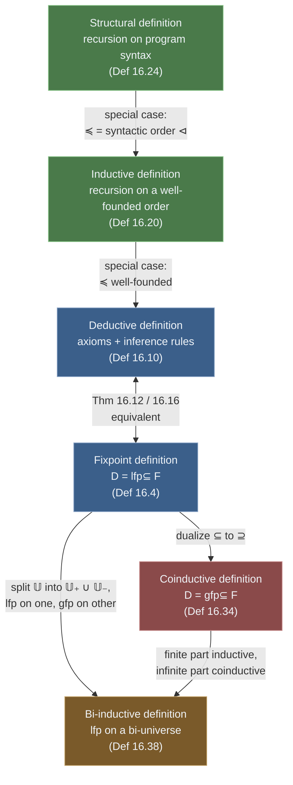

# Deductive, Inductive, and Coinductive Definitions

[[book-guidelines|↩ Back to guidelines]]

## The problem: how do you actually pin down an infinite set?

Every semantics in this book — the set of odd numbers, the set of valid proofs, the set of terminating traces of a program — is, formally, just a subset $D \in \wp(\mathbb{U})$ of some universe $\mathbb{U}$. That sounds trivial until you ask: *how do you write down that subset* when it's infinite and you can't enumerate it?

You've already met one answer in chapter 15: define $D$ as the least fixpoint of an increasing function, $D \triangleq \mathrm{lfp}^{\subseteq} F$. That's clean and it composes beautifully with Galois connections. But it's not how anyone *actually* specifies "the odd numbers" or "a well-typed expression" or "a valid parse." In practice you write:

> $1$ is odd. If $n$ is odd, then $n+2$ is odd.

That's a deductive definition — an axiom plus an inference rule — and it's how type systems, grammars, operational semantics, and program logics are conventionally presented in the literature (and in this book's own chapter 6 trace semantics). The chapter's payload is a single, load-bearing fact: **these are not two different kinds of definition that happen to agree on examples — they are provably the same thing**, and once you know that, you get to use whichever presentation is more convenient at each point in the book (deductive rules for readability, fixpoints for calculating soundness of abstractions in chapter 18) without ever worrying you've silently changed what you're defining.

The chapter then generalizes twice more: inductive definitions handle recursion on any well-founded order (not just $\mathbb{N}$), structural definitions specialize that to program syntax, and coinductive/bi-inductive definitions extend the whole toolkit to infinite objects — which is exactly what you need once traces can run forever.



## Fixpoint definitions, recapped

Because $\langle \wp(\mathbb{U}), \subseteq, \emptyset, \mathbb{U}, \cup, \cap \rangle$ is a complete lattice, Tarski's theorem (15.6) guarantees that any $\subseteq$-increasing $F \in \wp(\mathbb{U}) \to \wp(\mathbb{U})$ has a least fixpoint, and:

$$\textbf{Definition 16.4 (fixpoint definition).}\quad D \triangleq \mathrm{lfp}^{\subseteq} F$$

Cousot's running example: the odd numbers, $\mathbb{Od} \triangleq \mathrm{lfp}^{\subseteq} F$ where $F(X) \triangleq \{1\} \cup \{n+2 \mid n \in X\}$. Unrolling by Kleene iteration (theorem 15.21) gives $\emptyset \to \{1\} \to \{1,3\} \to \cdots \to \{1,3,\dots,2k+1\} \to \cdots$, and the limit is exactly the odd numbers. Well-definedness (theorem 16.5) is immediate — it's just Tarski's theorem again.

This is precise, but notice what it *doesn't* look like: nobody writes number theory this way. Nobody says "the odd numbers are the least fixpoint of the successor-by-two operator." They say "1 is odd; adding 2 to an odd number gives an odd number." That's the deductive style, and it's what the rest of the chapter reconciles with the fixpoint style.

## Deductive definitions: axioms and inference rules

A **deductive definition** specifies $D$ by a set of *inference rules* of the form

$$\frac{P_i}{c_i}$$

read "if every element of the finite premise set $P_i \in \wp_f(\mathbb{U})$ is already in $D$, then the conclusion $c_i \in \mathbb{U}$ is in $D$ too." When $P_i = \emptyset$ the rule is an **axiom** — an unconditional membership fact. The whole collection $R$ of rules is called a **deductive system** (or Hilbert system).

For the odd numbers: $1 \in \mathbb{Od}$ is an axiom, and $\dfrac{n \in \mathbb{Od}}{n+2 \in \mathbb{Od}}$ is a rule schema, instantiated for every $n \in \mathbb{N}$.

What does it mean for $D$ to be *defined by* these rules? You need the notion of a **proof**:

$$\textbf{Definition 16.7 (proof).}\quad \mathrm{is\text{-}provable}(p, R) \triangleq \exists\, t_0 \cdots t_n \in \mathbb{U}^{n+1} .\; t_n = p \;\wedge\; \forall i \in [0,n].\; t_i \text{ is the conclusion of some rule in } R \text{ whose premises are among } t_0,\dots,t_{i-1}$$

— a finite sequence where each step is licensed by some rule applied to earlier steps. The proof that 5 is odd is the sequence $1, 3, 5$ (axiom, then the rule twice). To show 4 is *not* odd, you trace backward: proving 4 odd needs 2 odd, which needs 0 odd, and there is no rule with 0 as a conclusion — the backward search dead-ends, so no proof exists. This backward/forward duality (build a proof forward, refute by backward search) is exactly the shape of a Prolog-style resolution engine or a typechecker's rule-elaboration.

$$\textbf{Definition 16.10 (deductive definition).}\quad D \triangleq \{p \in \mathbb{U} \mid \mathrm{is\text{-}provable}(p, R)\}$$

**What breaks without the finiteness of premises:** the definition requires $P_i$ finite for every rule. Exercise 16.14 flags that the fixpoint/deductive equivalence below can fail for rules with infinite premises — a proof, being a *finite* sequence, cannot use an infinitary rule application. This is the same finiteness discipline that shows up whenever you build a proof search engine: only finitely-branching, finitely-deep derivations are actually constructible objects.

### Grounding: deductive systems as data

A deductive system is naturally an enum of rule shapes plus a proof-search procedure. In Rust, this is essentially what a small resolution/typechecking engine's rule table looks like:

```rust
// A judgment we might want to prove, e.g. "n is odd"
#[derive(Clone, PartialEq, Eq, Hash)]
enum Judgment {
    Odd(i64),
}

// A rule: some finite set of premises entails a conclusion.
struct Rule {
    premises: Vec<Judgment>,
    conclusion: fn(&[i64]) -> Judgment, // simplified: a builder
}

// is-provable(p, R): does a finite proof of p exist, given already-proved facts?
fn is_provable(target: &Judgment, proved: &mut Vec<Judgment>, rules: &[(Vec<Judgment>, Judgment)]) -> bool {
    if proved.contains(target) {
        return true;
    }
    for (premises, conclusion) in rules {
        if conclusion == target && premises.iter().all(|p| proved.contains(p) || is_provable(p, proved, rules)) {
            proved.push(target.clone());
            return true;
        }
    }
    false
}
```

This is a *forward-chaining* proof search over a deductive system exactly in the book's sense — and it is precisely the mechanism a bidirectional typechecker's rule interpreter runs when it decides whether a typing judgment `Γ ⊢ e : τ` holds: try each typing rule whose conclusion shape matches, recursively discharge its premises.

In Lean, a deductive system in Definition 16.10's sense *is* an `inductive Prop`:

```lean
inductive IsOdd : Nat → Prop
  | base : IsOdd 1
  | step : ∀ n, IsOdd n → IsOdd (n + 2)
```

`IsOdd.base` is the axiom, `IsOdd.step` is the inference rule schema, and a term of type `IsOdd 5` (built as `IsOdd.step 3 (IsOdd.step 1 IsOdd.base)`) *is* a proof in exactly definition 16.7's sense — a finite sequence of rule applications, reified as a proof tree instead of a flat sequence. This is not an analogy; Lean's `inductive` keyword generates *the least fixpoint of the rules' consequence operator*, which is exactly the content of the next section.

## Equivalence of the least fixpoint and deductive definition methods

This is the chapter's central theorem, and it is what licenses using "axioms and inference rules" and "least fixpoint" interchangeably everywhere else in the book.

**Deductive → fixpoint (§16.3.1).** Given rules $R$, define the **consequence operator**

$$F_R(X) \triangleq \{c_i \mid \langle P_i, c_i \rangle \in R \wedge P_i \subseteq X\}$$

— "the set of conclusions you can derive in one more step, given that $X$ is already proved." Then:

$$\textbf{Theorem 16.12.}\quad \{p \in \mathbb{U} \mid \mathrm{is\text{-}provable}(p,R)\} = \mathrm{lfp}^{\subseteq} F_R$$

The proof is a two-sided induction on proof length: the $n$-th Kleene iterate $F_R^n(\emptyset)$ is shown (by ordinary recurrence on $n$) to contain exactly the elements with a proof of length $\le n$, so the union over all $n$ — which is $\mathrm{lfp}^{\subseteq} F_R$ by theorem 15.21, since $F_R$ is increasing — is exactly the deductively provable set. The only subtlety worth flagging (exercise 16.13): $F_R$ is increasing but need **not** preserve joins — $F_R(\{a\}) \cup F_R(\{b\})$ can be a strict subset of $F_R(\{a,b\})$ whenever some rule's premise set genuinely needs both $a$ and $b$ together. This matters later (chapter 18) because join-preservation, not mere monotonicity, is what buys you *exact* [[Fixpoint-Abstraction|fixpoint abstraction]].

**Fixpoint → deductive (§16.3.2).** Conversely, given a fixpoint definition $\mathrm{lfp}^{\subseteq} F$, define the rule set $R \triangleq \{ \langle P, F(P) \text{'s witnessing element} \rangle \mid \dots \}$ turning each application of $F$ into a (possibly infinite-branching, if $F$ isn't finitary) inference rule; theorem 16.16 shows $F = F_R$, so the two least fixpoints coincide. Well-definedness of deductive definitions (theorem 16.17) then falls out for free: $D = \mathrm{lfp}^{\subseteq} F_R$ is well defined because $F_R$ is increasing, by Tarski's theorem — the same machine as always, just wearing rule-based clothing.

**Why this matters for the book's method:** you get to *write* semantics as intuitive, readable inference rules (as in chapter 6's trace semantics) while *reasoning* about them with the full fixpoint toolkit (monotonicity, continuity, Galois-connection abstraction). Chapter 17 immediately exploits exactly this: it recasts the deductive prefix-trace semantics of chapter 6 as a fixpoint $\mathrm{lfp}^{\subseteq} \mathcal{F}^*\llbracket S \rrbracket$, purely by invoking this equivalence.

## Inductive definitions on well-founded orders

Deductive definitions still generalize recursive *programs* like the factorial, $f(0) = 1$, $f(n) = n \cdot f(n-1)$. The key structural feature of a well-formed recursive definition — the one that keeps it from being circular nonsense — is that every recursive call is on a *strictly smaller* argument, where "smaller" needs to bottom out. That's formalized as a well-founded relation:

$$\textbf{Definition 16.18 (well founded relation).}\quad \preccurlyeq\, \in \wp(S \times S) \text{ is well founded iff there is no infinite strictly-decreasing chain } x_0 \succ x_1 \succ x_2 \succ \cdots$$

Given one, you get a proof principle that generalizes both ordinary induction on $\mathbb{N}$ and structural induction:

$$\textbf{Theorem 16.19 (inductive proof).}\quad \big(\forall x \in S.\, (\forall y \prec x.\, P(y)) \Rightarrow P(x)\big) \;\Rightarrow\; \forall x \in S.\, P(x)$$

The proof is a clean reductio: if some $x_0$ fails $P$, the hypothesis forces some strictly-smaller $x_1$ also failing $P$, and so on — building an infinite descending chain, contradicting well-foundedness. This is the **Noetherian induction principle**, and it subsumes strong induction on $\mathbb{N}$ (take $\preccurlyeq = \le$) as a special case.

With that principle in hand:

$$\textbf{Definition 16.20 (inductive definition).}\quad D \in S \to \mathbb{U} \text{ where } \langle S,\preccurlyeq\rangle \text{ is well founded:}$$
$$\text{(1) } D(m) \triangleq D_m \text{ for minimal } m \in S \text{ (no } s \prec m\text{)}; \qquad \text{(2) otherwise, } D(s) \triangleq F_s(\langle D(s'), s' \prec s\rangle)$$

Case (1) fixes base values on the minimal elements; case (2) computes every other value from a function $F_s$ of *all* the strictly-smaller previously-computed values — not just "the previous one," which is what makes this a genuine generalization of ordinary recursion (you can recurse on an arbitrarily-shaped smaller sub-structure, not just $n-1$). Well-definedness (theorem 16.21) is theorem 16.19 applied to the property "$D(s)$ is well defined."

**What breaks without well-foundedness:** if $\preccurlyeq$ admits an infinite descending chain, case (2)'s recursive computation of $D(s)$ can depend on $D(s')$ which depends on $D(s'')$ forever, and there's no base case to ground the recursion in — exactly a program that doesn't terminate. The C-integer remark in the book (finite `INT_MIN..INT_MAX`, not all of $\mathbb{Z}$) is a nice concrete reminder that "the mathematical universe is well-founded" and "the machine representation actually terminates" are related but distinct concerns.

### Grounding: well-founded recursion

Rust's ordinary recursion doesn't check well-foundedness for you — a badly-structured recursive function just blows the stack. Lean, by contrast, makes definition 16.20 a *first-class, checked* feature: every recursive definition must supply (or infer) a well-founded relation and prove each recursive call strictly decreases under it.

```lean
-- Rose trees: the "previously computed values" of definition 16.20(2)
-- are literally the recursive results on each strictly-smaller child.
inductive Tree where
  | leaf : Tree
  | node : List Tree → Tree

def size : Tree → Nat
  | .leaf => 1
  | .node children => 1 + (children.map size).sum
-- Lean auto-derives a well-founded relation (structural: List.sizeOf on children)
-- and discharges the "each child is a strict subcomponent" obligation itself.
```

For genuinely non-structural recursion, Lean requires you to name a `termination_by` measure and Lean checks it decreases — which is a machine-checked instance of exhibiting the well-founded $\preccurlyeq$ from definition 16.18 by hand. This is precisely the mechanism your own elaborator/kernel will need if it does substitution- or size-driven recursive normalization: you cannot get away with "trust me, it terminates" the way an untyped Rust recursive function implicitly does; you need an explicit decreasing measure, exactly as theorem 16.19 demands.

## Structural definitions: induction on program syntax

A **structural definition** is simply definition 16.20 specialized to the case where $\preccurlyeq$ is the **strict syntactic subcomponent order** on programs:

$$\textbf{Definition 16.24 (structural definition).}\quad \text{an inductive definition for the well-founded order } \preccurlyeq \,=\, \lhd \text{ (S } \lhd S' \text{ iff } S \text{ is a strict syntactic component of } S')$$

Example 16.25 spells out the family of related orders used throughout the book: $\unlhd \triangleq \lhd \vee {=}$ (reflexive), $\lhd^+$ (transitive closure of $\lhd$), $\lhd^*$ (reflexive-transitive closure). Well-foundedness of $\lhd$ (exercise 16.27) is essentially free: a program has a finite abstract syntax tree, and each strict syntactic component has strictly fewer nodes.

This is exactly how chapter 6's trace semantics is actually built: the base case (definition 16.20's case 1) is given by the axioms for empty statement lists, [[Forward-Reachability-Semantics#Assignment|assignment]], skip, and break; the inductive case (case 2) is given by one rule per remaining grammar production — sequencing, conditional, iteration, compound statements — each computing the trace set of a compound statement from the (already-defined) trace sets of its immediate syntactic parts.

$$\textbf{Corollary 16.31 (structural proof).}\quad \text{if } \forall S.\, (\forall S' \lhd S.\, P(S')) \Rightarrow P(S), \text{ then } \forall S \lhd^* P.\, P(S)$$

— the structural induction principle you already know from ordinary AST recursion, now formally justified as an instance of theorem 16.19 rather than assumed as a primitive. (Historically due to Rod Burstall, credited in the text.)

### Grounding: structural definitions as AST recursion

This is the one construct in the chapter every programmer already writes without thinking of it as induction on a well-founded order:

```rust
enum Stmt {
    Assign(String, Expr),
    Seq(Box<Stmt>, Box<Stmt>),
    If(Expr, Box<Stmt>, Box<Stmt>),
    While(Expr, Box<Stmt>),
}

// A structural definition in the book's exact sense: base case on Assign,
// inductive case on Seq/If/While computed from the (already-computed)
// values on strictly-smaller syntactic children.
fn labels_at(s: &Stmt) -> Label {
    match s {
        Stmt::Assign(_, _) => Label::fresh(),          // Definition 16.20(1): base case
        Stmt::Seq(s1, _) => labels_at(s1),              // Definition 16.20(2): F_s of labels_at(s1)
        Stmt::If(_, s1, _) => labels_at(s1),
        Stmt::While(_, _) => Label::fresh(),
    }
}
```

The reason to make this connection explicit rather than leave it as "obviously the same thing programmers already do": your Rust `match`-recursion on an AST enum is only *guaranteed* to terminate because Rust's `enum`s are (like Lean's `inductive`s) structurally well-founded by construction — you cannot build a cyclic `Box<Stmt>` value, so `⊲` on your own AST type is automatically well founded, and every structurally-recursive function over it automatically satisfies theorem 16.19 without you ever invoking it by name. This is why "structural recursion" needs no extra termination proof in most languages: the type system's own well-foundedness (no infinite-depth values) does the work theorem 16.19 asks for.

## Coinductive definitions: greatest fixpoints for infinite objects

Everything so far builds *up* from base cases — you can only reach an element of $D$ by a finite proof. That's exactly wrong for infinite objects: an infinite string, an infinitely-running trace, a non-terminating computation has no finite derivation to bottom out on. The fix is to flip the fixpoint:

$$\textbf{Definition 16.34 (coinductive definition).}\quad D \triangleq \mathrm{gfp}^{\subseteq} F_R$$

— same consequence operator $F_R$ as before, but now the *greatest* fixpoint, dualizing theorems 16.12/16.16 exactly the way chapter 15's dual results (Park's conjugate fixpoint theorem) dualize $\mathrm{lfp}$ results to $\mathrm{gfp}$.

Example 16.35 makes [[Convergence-Acceleration-by-Widening-and-Narrowing#The intuition|the intuition]] concrete: let $\mathbb{U}$ be infinite strings over $\{a,b\}$, with the rule "if $\sigma \in D$ then $a\sigma \in D$." As a *least* fixpoint this rule alone defines almost nothing (there's no axiom, so no finite proof ever gets started — $\mathrm{lfp} = \emptyset$). As a *greatest* fixpoint, $D$ is the largest set closed under "removing a leading $a$" — which turns out to be exactly $a^\omega$, the single infinite string of all $a$'s. The intuitive reading: **an element survives in a greatest fixpoint iff it survives arbitrarily deep unfolding of the rules** — you're not asking "can I finitely build this," you're asking "can this infinitely resist being ruled out." Any string containing a single $b$ eventually gets excluded once you unfold far enough to reach that $b$; only the string with no $b$ anywhere survives every unfolding, forever.

**What breaks without coinduction:** if you tried to characterize "the set of infinite traces of a non-terminating loop" the way chapter 6 characterizes finite traces (build up from a base case by a finite number of rule applications), you'd get the empty set — no infinite object has a *finite* derivation. Chapter 7 sidestepped this by defining infinite traces as *limits* of finite prefixes instead. Coinduction is the more general and more directly rule-based alternative to that limit construction, and it's the one that generalizes cleanly to bi-induction below.

### Grounding: coinduction as "infinite unfolding," not "infinite building"

Lean has a genuine coinductive-type mechanism (built on its `CoInductive`/`QPF` machinery) precisely for defining infinite/lazy structures by *what survives unfolding*, dual to `inductive`'s *what can be finitely built*:

```lean
-- Conceptually: an infinite stream is defined coinductively by its
-- one-step unfolding (head, tail), not by finite constructors.
structure Stream' (α : Type) where
  head : α
  tail : Unit → Stream' α   -- lazily produces the "rest"

-- The a-string of example 16.35, expressed as the unique coinductive
-- fixpoint of "unfold to (a, more of the same)":
def allAs : Stream' Char := { head := 'a', tail := fun _ => allAs }
```

The proof principle dual to structural induction is **coinduction/bisimulation**: to show two infinite objects are equal (or that an object belongs to a coinductively-defined set), you don't do a finite induction — you exhibit a relation closed under one-step unfolding that both objects belong to. That is the direct proof-theoretic shadow of $\mathrm{gfp}^{\subseteq} F_R$ being the *largest* set closed under the rules, rather than the smallest.

In Rust there is no built-in coinductive type, but the everyday analogue is a lazy, self-referential iterator — a value defined by its unfolding rule rather than by finite construction:

```rust
// A conceptual analogue of example 16.35: an infinite stream defined by
// "unfold one step at a time," never fully constructed, only ever
// partially observed — the operational shadow of a greatest fixpoint.
struct AllAs;
impl Iterator for AllAs {
    type Item = char;
    fn next(&mut self) -> Option<char> { Some('a') } // unfolds forever
}
```

## Bi-inductive definitions: induction and coinduction, uniformly

The book's own trace semantics needs *both*: finite traces should be built up (induction — "here's a base trace, here's how to extend it"), while infinite traces should survive unfolding (coinduction — "this trace is valid iff every finite prefix of its unfolding is still valid"). Exercise 16.36 shows you technically *can* define both with a single coinductive (greatest-fixpoint) definition, but that's often inconvenient: it's more natural, and — the book flags this explicitly — more useful later for fixpoint *abstraction* (chapter 18) to build finite traces by least fixpoint (getting longer and longer) while eliminating bad infinite traces by greatest fixpoint (getting shorter and shorter, i.e. more refined), simultaneously, in one definition.

The trick is to split the universe and combine the two orders into one:

$$\textbf{Lemma 16.37.}\quad \mathbb{U} = \mathbb{U}_+ \cup \mathbb{U}_-,\ \mathbb{U}_+ \cap \mathbb{U}_- = \emptyset. \quad X_+ \triangleq X \cap \mathbb{U}_+,\ X_- \triangleq X \cap \mathbb{U}_-.$$
$$X \sqsubseteq_\mp Y \triangleq X_+ \subseteq Y_+ \;\wedge\; X_- \supseteq Y_-$$

— the **bi-order**: ordinary $\subseteq$ on the "+" (finite/inductive) part, but *reversed* $\supseteq$ on the "−" (infinite/coinductive) part. This is exactly what you'd expect if you want a single lattice on which "grow the inductive part" and "shrink the coinductive part" are both, simultaneously, *increasing* moves toward the fixpoint — $\langle \wp(\mathbb{U}), \sqsubseteq_\mp, \mathbb{U}_-, \mathbb{U}_+, \sqcup_\mp, \sqcap_\mp \rangle$ is itself a complete lattice (proved via the Galois isomorphism between $\wp(\mathbb{U})$ under $\sqsubseteq_\mp$ and $\wp(\mathbb{U}_+) \times \wp(\mathbb{U}_-)$ under the product order, using the join-preservation lemma 11.38 from chapter 11).

$$\textbf{Definition 16.38 (bi-inductive definition).}\quad D \triangleq \mathrm{lfp}^{\sqsubseteq_\mp} F_R \text{ where } R = R_+ \cup R_- \text{: inductive rules } \tfrac{P}{c},\, P \subseteq \mathbb{U}_+, c \in \mathbb{U}_+ \text{ and coinductive rules on } \mathbb{U}_-$$

Note the elegant sleight of hand: on the bi-order $\sqsubseteq_\mp$, a *single* least fixpoint computation simultaneously behaves like a least fixpoint on the "+" part (because $\sqsubseteq_\mp$ agrees with $\subseteq$ there) and like a *greatest* fixpoint on the "−" part (because $\sqsubseteq_\mp$ reverses $\subseteq$ there). Example 16.39 continues the $a/b$-string case: with $\mathbb{U}_+$ the finite strings and $\mathbb{U}_-$ the infinite strings, the rule $\dfrac{}{a \in \mathbb{U}_+} \quad \dfrac{\sigma}{a\sigma}$ (interpreted inductively on the finite side, coinductively on the infinite side) builds up finite prefixes of $a$'s while simultaneously narrowing down which infinite strings survive — recovering both $\{a^n \mid n \in \mathbb{N}^+\}$ and $\{a^\omega\}$ from *one* fixpoint computation, rather than two separate ones glued together afterward.

**Why this is worth the extra machinery** (the guidelines' second key question, and worth answering directly): chapter 7 already gets you finite-and-infinite trace semantics via limits of prefixes, and exercise 16.36 already shows plain coinduction alone can do it too. The payoff for bi-induction specifically shows up two chapters later, in chapter 18's fixpoint *abstraction* theory: soundly abstracting a least-fixpoint computation and soundly abstracting a greatest-fixpoint computation are different theorems with different hypotheses (continuity conditions point in opposite directions for lfp vs. gfp). If finite and infinite traces are two separate fixpoints, you need to abstract them separately and then argue the results compose. If they are *one* bi-inductive fixpoint on one bi-ordered lattice, you abstract once, with one set of hypotheses, and both the finite and infinite parts of the semantics come out sound together — exactly the sort of "uniform treatment reduces the number of separate soundness arguments you owe" move that motivates most of this book's architecture.

## Synthesis: where this leads

The six notions in this chapter are not a menu of unrelated options — they are one underlying fixpoint construction viewed through progressively more specialized lenses:

- **fixpoint** is the general engine (chapter 15's machinery);
- **deductive** is the same engine wearing rule-based notation (theorems 16.12/16.16 prove the equivalence);
- **inductive** is a deductive definition restricted to a well-founded recursion structure (definition 16.20, licensed by theorem 16.19);
- **structural** is an inductive definition specialized to the syntactic order on programs (definition 16.24) — this is *why* chapter 6's trace semantics, written as inference rules per grammar production, is automatically a well-defined structural fixpoint, and chapter 17 cashes that out explicitly;
- **coinductive** dualizes the whole picture (gfp instead of lfp) to handle objects, like infinite traces, that have no finite derivation;
- **bi-inductive** fuses inductive and coinductive treatment into one fixpoint on a bi-ordered lattice, which is what lets chapter 18 abstract finite-and-infinite program semantics uniformly instead of case-splitting the soundness argument.

For the compiler/verifier and elaborator projects this chapter is directly load-bearing in two places. First, definition 16.20's well-founded recursion, together with theorem 16.19's proof principle, is *exactly* the discipline a Hoare-triple soundness proof or a substitution lemma needs whenever the recursion isn't simple structural recursion on one syntax tree (e.g. recursion on a decreasing fuel/step-count, or on the size of a derivation) — this is the general form of "termination measure" your verifier's proof search must supply whenever Lean-style structural recursion doesn't apply directly. Second, the deductive/fixpoint equivalence (theorems 16.12/16.16) is the precise justification for treating a typing-rule presentation and a "set of well-typed terms defined as a least fixpoint" presentation as interchangeable — which is exactly the move made implicitly whenever a type checker is described as "closing rules under derivability" versus "computing a fixpoint," and it is worth having the equivalence theorem by name the next time that move needs to be defended rather than just assumed.

Chapter 17 immediately puts the inductive/structural/fixpoint equivalence to work, recasting chapters 6 and 7's deductive trace semantics as structural fixpoints; chapter 18 then builds the general theory of soundly and exactly abstracting *all* of these definition styles (deductive, inductive, structural — including, via bi-induction, the finite/infinite split) under a Galois connection, which is the technical heart connecting this chapter's definitional bookkeeping to everything the book calls "calculational design."
