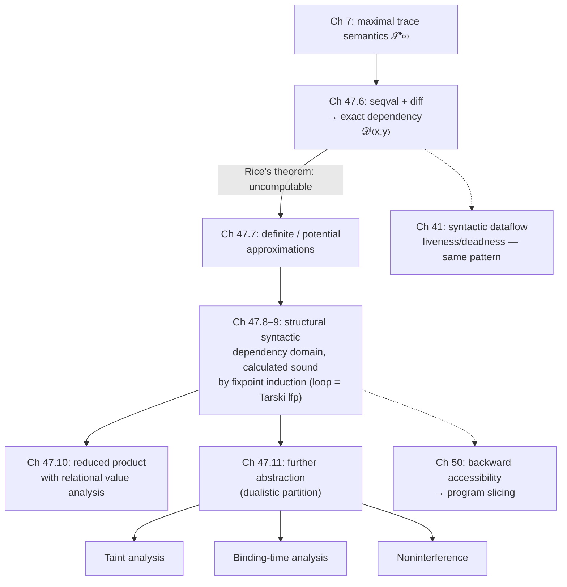

[[book-guidelines|↩ Back to guidelines]]

## Why "depends on" needs a real definition

Every programmer has an intuition for "`y` depends on `x`." Say it out loud about `y = x + 1;` and nobody argues. But intuition breaks fast:

- Does `y` depend on `x` in `y = x - x;`? Syntactically, yes — `x` appears twice on the right-hand side. Semantically, no — the result is always `0`, no matter what `x` is.
- Does `y` depend on `x` in `if (x == 1) { y = 1; } else { y = 1; }`? Syntactically, `x` gates the branch that assigns `y`. Semantically, `y` is `1` either way.
- Does `y` depend on `x` in a loop whose *number of iterations* is controlled by `x`, even if the values `y` takes never change?

Cousot's answer, in Chapter 47, is that "dependency" is not one notion but a family, and almost every existing definition in the literature — Denning's information flow, Goguen–Meseguer noninterference, Weiser's program slicing, taint analysis, binding-time analysis — is a different *abstraction of the same underlying semantic object*. The chapter's real contribution isn't "here is dependency," it's "here is the one rigorous semantic definition that all these classic definitions turn out to be projections of." That's the throughline worth holding onto: this chapter is a worked instance of the whole book's method — define the concrete semantic property first, then recover every classic analysis as a further abstraction of it, by calculational design rather than by postulation.

## 1. Syntactic dependency is cheap and wrong

The traditional approach (dataflow analysis, §41 in this book) computes dependency by walking the control-flow graph and the syntax of expressions: "`y` depends on `x`" if `x` occurs syntactically in an expression assigned to `y`, propagated along control edges. It's cheap, and it's *unsound-feeling* in exactly the way `y = x - x;` demonstrates — it can't see that the syntactic occurrence is semantically inert. Cousot's diagnosis (§47.1): such definitions are *postulated* (no derivation, just asserted) and *imprecise* (syntax approximates semantics very roughly). You can still prove a syntactic analysis sound after the fact (as the book does for liveness/deadness in Chapter 41) — but that soundness proof has to bottom out in a semantic definition of dependency anyway. So the chapter does the semantic definition first, properly, and syntactic dependency analysis becomes just one more *abstraction* of it, recovered at the end (§47.8.1) rather than assumed at the start.

**What breaks without this:** if dependency is defined syntactically from day one, you have no yardstick to ask "is this analysis missing dependencies, or inventing false ones?" There's nothing to be sound *with respect to*. A semantic definition gives you that yardstick — everything downstream (taint tracking, noninterference, slicing) inherits a real soundness theorem instead of folklore.

## 2. The simplest case: functional dependency

Before touching programs, Cousot pins down dependency for pure mathematical functions (§47.3), because it's the cleanest intuition to formalize: *changing a parameter changes the result*.

For $f(x, y) = x + 1$, changing $x$ changes $f$; changing $y$ doesn't. For $f(x, y) = (x-x) + (y-y)$, changing *neither* parameter changes anything — $f$ is constant, and no syntactic analysis can see that. This gives the shape of the eventual definition: dependency is a statement about *two executions that differ in one input and are compared on their output*.

```rust
// The book's f(x, y) = (x - x) + (y - y): syntactically depends on both,
// semantically depends on neither. A syntactic pass can't tell.
fn f(x: i64, y: i64) -> i64 {
    (x - x) + (y - y)   // always 0
}

// "f depends on parameter i" == changing that parameter can change the result,
// for *some* choice of the other parameters.
fn depends_on_x(f: impl Fn(i64, i64) -> i64) -> bool {
    (-5..5).any(|y| {
        let base = f(0, y);
        (-5..5).any(|x| f(x, y) != base)
    })
}
```

This existential-witness shape — *there exist two runs differing only in the input of interest, whose outputs differ* — is exactly the shape the chapter reuses for full program dependency, just with "output" generalized from "return value" to "sequence of values a variable takes at a program point."

## 3. Noninterference: the security-flavored special case

§47.4 specializes the same idea to security. Partition variables into **low** $L$ (public/trusted) and **high** $H$ (private/untrusted). **Noninterference** $\mathcal{N}i(L, H)$ holds of a semantic property when: *if two executions start with equal low data, then whenever/if they finish, their low data are still equal.* Changing only the high inputs cannot move the low outputs.

$$
\mathcal{N}i(L, H) \triangleq \{ \Pi \in \wp(\wp(\mathbb{T}^+ \times \mathbb{T}^\infty)) \mid \forall \langle \pi_0, \pi\rangle, \langle \pi_0', \pi'\rangle \in \Pi \cap (\mathbb{T}^+ \times \mathbb{T}^+).\;
(\forall x \in L.\ \varrho(\pi_0)x = \varrho(\pi_0')x) \Rightarrow (\forall x \in L.\ \varrho(\pi_0 \frown \pi)x = \varrho(\pi_0' \frown \pi')x) \}
$$

The maximal trace semantics $\mathcal{S}^{+\infty}\llbracket S \rrbracket$ *has* this noninterference property iff $\mathcal{S}^{+\infty}\llbracket S \rrbracket \in \mathcal{N}i(L,H)$, i.e. (as a set-implication) $\{\mathcal{S}^{+\infty}\llbracket S \rrbracket\} \subseteq \mathcal{N}i(L,H)$.

Two things to notice, both load-bearing for the rest of the chapter:

1. **This is a *relational* (input/output) definition, not a local, per-program-point one** — it only compares initial and *final* states, and (per [421, 422], which the book follows) it deliberately ignores interference during execution or between infinite runs. That's a real limitation the book is about to lift.
2. Noninterference literally **cannot** be phrased as a trace property in $\wp(\mathbb{T}^+ \times \mathbb{T}^\infty)$ (Exercise 47.3) — it inherently needs to talk about *two* traces at once. This is the first hint that "dependency" as a semantic property lives one level up from ordinary trace properties: it's a property of *pairs* of executions, i.e. a **hyperproperty**-shaped object, even though Cousot avoids that vocabulary (§47.12 explicitly notes the definition needs no extra hyperproperty machinery — the "compare two executions" idea is baked directly into the definition instead).

**What breaks without generalizing noninterference:** it only ever tells you about entry/exit. It says nothing about *where in the program* the flow happens, doesn't handle nontermination gracefully, and gives you no local, per-program-point notion you could hang a dataflow-style analysis off of. The rest of the chapter builds exactly that local, per-point generalization.

## 4. Six examples that pin down what "dependency" should mean

Before formalizing, §47.5 runs a gauntlet of examples that fix the target definition by elimination — deciding what counts as dependency and what doesn't. This is worth walking through in Rust, because each example rules out a plausible-but-wrong definition.

**Explicit dependency** (Example 47.4). In `ℓ₁ y = x; ℓ₂`, at entry point $\ell_1$, $y$ depends on its own initial value $y_0$ (nothing has changed it yet) but not on $x_0$. At exit point $\ell_2$, $y$ depends on $x_0$ but not $y_0$ (its old value was overwritten). Denning calls this *explicit* because it doesn't route through control flow — the dependency is a direct data [[Forward-Reachability-Semantics#Assignment|assignment]].

**Implicit dependency** (Example 47.5). Consider `if (x != 0) { ℓ₄ y = 0; } ℓ₅` vs. an `if/else` where the two branches assign different constants to `y`. If the assigned value is always `0` regardless of which branch is taken, $y$ at $\ell_4$ does *not* depend on $x_0$, even though $x$ controlled whether $\ell_4$ was reached at all. But if the branches assign *different* constants, $y$ at $\ell_5$ (after the join) *does* depend on $x_0$ — the dependency routes through the *test*, not through a direct assignment. Denning calls this *implicit*, and — this is the chapter's polemical point — Denning's classic theory treats implicit and explicit flow as fundamentally different mechanisms requiring separate rules. Cousot's semantic definition (§47.6) will make **no such distinction**: both are just "changing $x_0$ changes $y$'s value at $\ell$," full stop.

```rust
// Implicit dependency: the *value* assigned doesn't mention x, but which
// branch runs does. y depends on x0 here even with no `y = ...x...` anywhere.
fn implicit_dep(x0: i64) -> i64 {
    let y;
    if x0 != 0 { y = 1; } else { y = 0; }
    y   // depends on x0, purely through control flow
}
```

**Timely dependency** (Example 47.6). In a loop, comparing *one* value of `y` at a program point isn't enough — you may need the *whole sequence* of values `y` takes across iterations to detect a dependency (e.g. the loop counter). This is why the eventual definition compares *sequences* of values, not single snapshots.

**Value dependency** (Example 47.7). Two executions can produce sequences of `y`-values that share a common prefix and only diverge later (e.g. after a loop guarded by `x0 > 0` kicks in). The definition has to be sensitive to values differing *anywhere* in the sequence, not just at the first position.

**Timing channels are excluded, deliberately** (Example 47.8). Consider `int x, y; ℓ x = x - 1;` where changing $x_0$ changes *how many times* $y$'s value is observed (the sequence's *length*) but never *which* values appear. Traditionally (and here), this is **not** counted as a dependency — it's a covert/timing channel, explicitly out of scope. This is a real design decision, not an oversight: timing channels matter for real-time or side-channel security work, but including them would break the elegant "prefix trace ≡ maximal trace" equivalence the chapter relies on (Lemma 47.23) and would require an entirely different mathematical apparatus.

**Empty observations are a judgment call** (Example 47.9). If `y` is only ever observed at a program point reachable through one branch of a test, is that a dependency on the test variable? The book allows this to go either way depending on the application (security wants "yes," compiler optimization wants "no") — but fixes one convention (no empty observations count) for its formal definition, `diff` requiring both compared sequences to be nonempty.

## 5. The formal definition

Now the payoff: turning those six examples into one definition.

**Step 1 — the sequence of values a variable takes at a point.** Given an initialization trace $\pi_0$ continuing into a trace $\pi$, define $\mathsf{seqval}\llbracket y \rrbracket^\ell(\pi_0, \pi)$ as the sequence of values $y$ has, each time execution passes through program point $\ell$, along $\pi$:

$$
\mathsf{seqval}\llbracket y \rrbracket^\ell(\pi_0, \ell) \triangleq \varrho(\pi_0)y \qquad
\mathsf{seqval}\llbracket y \rrbracket^\ell(\pi_0, \ell \xrightarrow{a} \ell''\pi) \triangleq \varrho(\pi_0)y \cdot \mathsf{seqval}\llbracket y \rrbracket^\ell(\pi_0 \frown \ell \xrightarrow{a} \ell'', \ell''\pi)
$$

with the empty sequence $\backepsilon$ when $\ell$ never occurs. This is exactly the "abstraction of the future" needed to compare two executions: it throws away *when* (execution-step count) each value was observed, keeping only the ordered sequence of values seen at that one program point.

**Step 2 — when do two such sequences "differ"?** Not just "unequal" — they must share a common prefix and then diverge at a *value*, both staying nonempty past that point (this is exactly what rules out the timing-channel case, where sequences differ only in *length*):

$$
\mathsf{diff}(\omega, \omega') \triangleq \exists \omega_0, \omega_1, \omega_1', \nu, \nu'.\ \omega = \omega_0 \cdot \nu \cdot \omega_1 \wedge \omega' = \omega_0 \cdot \nu' \cdot \omega_1' \wedge \nu \neq \nu'
$$

```rust
// diff(ω, ω'): common prefix, then a *value* mismatch at the same position,
// both sequences still nonempty at that point. Length-only differences
// (timing channels) don't count, matching example 47.8.
fn diff(w: &[i64], w2: &[i64]) -> bool {
    let common = w.iter().zip(w2.iter()).take_while(|(a, b)| a == b).count();
    common < w.len() && common < w2.len() && w[common] != w2[common]
}
```

**Step 3 — the dependency relation itself.** $y$ depends on the initial value of $x$ at $\ell$, written $x \rightsquigarrow_P^\ell y$, iff there are two initialization/continuation pairs $\langle \pi_0, \pi_1\rangle, \langle \pi_0', \pi_1'\rangle$ agreeing on every variable *except possibly* $x$, whose `seqval` sequences of $y$ at $\ell$ differ:

$$
\mathcal{D}^\ell\langle x, y\rangle \triangleq \{ \Pi \in \wp(\mathbb{T}^+ \times \mathbb{T}^{+\infty}) \mid \exists \langle \pi_0,\pi_1\rangle, \langle\pi_0',\pi_1'\rangle \in \Pi.\ (\forall z \in \mathbb{V}\setminus\{x\}.\ \varrho(\pi_0)z = \varrho(\pi_0')z) \wedge \mathsf{diff}(\mathsf{seqval}\llbracket y \rrbracket^\ell(\pi_0,\pi_1), \mathsf{seqval}\llbracket y \rrbracket^\ell(\pi_0',\pi_1'))\}
$$

$$
x \rightsquigarrow_P^\ell y \triangleq (\mathcal{S}^{+\infty}\llbracket P \rrbracket \in \mathcal{D}^\ell\langle x, y\rangle)
$$

Notice: it does **not** require $x$'s initial value to actually *differ* between the two runs (only that all *other* variables agree) — for a deterministic language this is harmless, because if $x_0$ were also equal the two runs would coincide entirely (Exercise 17.13/17.21).

This is the general recipe the whole chapter — and, per the book's closing remark (§47.12), a great deal of the *dependency-analysis literature in general* — instantiates: **(a)** abstract the past (here: initial variable values), **(b)** abstract the future (`seqval`), **(c)** define when two pasts differ (all variables but $x$ agree), **(d)** define when two futures differ (`diff`). Dependency-of-future-on-past then just means: *there exist two executions with different (c)-different pasts and (d)-different futures.* Swap out what counts as "the past" and "the future" and you get noninterference, taint tracking, binding-time analysis, or side-channel mitigation as different instantiations of the same scheme.

A useful robustness result: because timing channels are excluded by `diff`, using the *prefix* trace semantics $\mathcal{S}^*\llbracket P \rrbracket$ or the *maximal* trace semantics $\mathcal{S}^{+\infty}\llbracket P \rrbracket$ gives the identical dependency relation (**Lemma 47.23**) — you don't have to worry about non-terminating executions being handled inconsistently.

## 6. Exact, definite, and potential dependency — and why you can't compute the exact one

The **exact** dependency semantics $\mathcal{S}^{\mathrm{d}}\llbracket S \rrbracket$ abstracts the collecting trace semantics via the Galois connection

$$
\langle \wp(\wp(\mathbb{T}^+ \times \mathbb{T}^{+\infty})), \subseteq\rangle \xrightleftharpoons[\alpha^{\mathrm{d}}]{\gamma^{\mathrm{d}}} \langle \mathbb{P}^{\mathrm{d}}, \supseteq^{\mathrm{d}}\rangle, \qquad
\gamma^{\mathrm{d}}(\mathbf{D}) \triangleq \bigcap_{\ell \in \mathbb{L}} \bigcap_{\langle x,y\rangle \in \mathbf{D}(\ell)} \mathcal{D}^\ell\langle x,y\rangle
$$

(Lemma 47.26) — the more semantics have some property, the *fewer* dependencies you can safely claim, since a dependency has to hold for *all* semantics with that property; this is the abstract, lattice-theoretic flavor the workbench keeps coming back to: dependency itself is being defined as a **Galois-connection abstraction** of the collecting semantics, exactly like every other analysis in the book.

But $\mathcal{S}^{\mathrm{d}}\llbracket S \rrbracket \triangleq \alpha^{\mathrm{d}}(\{\mathcal{S}^{+\infty}\llbracket S \rrbracket\})$ is **not computable** — dependency is a nontrivial semantic property, so Rice's theorem (9.12) applies directly. Worse, Example 47.37 shows it can't even be given an equivalent *structural* (syntax-directed) definition, because whether $y$ at a point depends on $x$ can hinge on the actual *values* variables take, not just the syntax. So static analysis has exactly two honest options:

- **Definite** dependency $\overline{\mathcal{S}}^{\forall}_{\mathrm{diff}}$: an *underapproximation*, $\overline{\mathcal{S}}^{\forall}_{\mathrm{diff}}\llbracket S \rrbracket \subseteq \alpha^{\mathrm{d}}(\{\mathcal{S}^{+\infty}\llbracket S\rrbracket\})$ — $\emptyset$ is a trivially correct (if useless) answer. Used when you need to be *sure* a dependency exists (e.g. to prove independence/parallelizability).
- **Potential** dependency $\overline{\mathcal{S}}^{\exists}_{\mathrm{diff}}$: an *overapproximation*, $\alpha^{\mathrm{d}}(\{\mathcal{S}^{+\infty}\llbracket S\rrbracket\}) \subseteq \overline{\mathcal{S}}^{\exists}_{\mathrm{diff}}\llbracket S \rrbracket$ — $\mathbb{V} \times \mathbb{V}$ is trivially correct. Used when you need to be sure you *haven't missed* a dependency (compilation, taint tracking, security).

The chapter focuses on **potential** dependency: for compilation and security you want to err on the side of *claiming more dependencies than there really are*, never fewer.

## 7. Calculating a structural, sound potential-dependency analysis

This is the heart of the chapter's calculational-design method (§47.8–47.9). The goal: derive, by structural induction on program syntax, an abstract dependency semantics $\overline{\overline{\mathcal{S}}}^{\exists}_{\mathrm{diff}}\llbracket S \rrbracket$ that is provably sound (**Theorem 47.40**) with respect to the semantic definition — not postulated and checked after the fact, but calculated so soundness is automatic.

First, fix the target *domain*: a **syntactic dependency property** $D \in \mathbb{L} \to \wp(\mathbb{V} \times \mathbb{V})$ attaches to each program point $\ell$ a set of pairs $\langle x, y \rangle$ meaning "$y$ at $\ell$ may depend on the initial value of $x$." Values of variables are abstracted away entirely — that's the source of imprecision the whole rest of the section is trying to manage. This forms a finite complete lattice, ordered pointwise by $\subseteq$.

The rules, walked through with their intuition:

- **Statement entry** — variables depend only on themselves: $D(\mathrm{at}\llbracket S \rrbracket) = 1_{\mathbb{V}} \triangleq \{\langle x, x\rangle \mid x \in \mathbb{V}\}$.
- **Outside the statement** — no dependency, because execution never gets there.
- **Assignment** `x = A;` — every unmodified variable $y \neq x$ still depends only on itself; the assigned variable $x$ depends on whatever variables the expression $A$ depends on, over-approximated syntactically by $\mathsf{vars}\llbracket A \rrbracket$ (the set of variables occurring in $A$) — trivially imprecise for something like `x - x`, exactly the case that motivated the whole chapter.
- **Conditional** `if (B) St else Sf` — the interesting rule. It compares three cases: both compared executions take the true branch, both take the false branch, or they take *different* branches. The last case is where syntactic dependency does something clever: it uses $\mathrm{nondet}(B_1, B_2)$, the variables for which the tests $B_1, B_2$ (here both instances of $B$ or $\neg B$) can genuinely evaluate differently, to *prune away* spurious dependencies on variables that provably can't change which branch is taken. This recovers Example 47.51's key result: in `L = H;` (assigning a *constant*, not the value of `H`, to `L`) at test `H`, $L$ does **not** depend on `H`, because the test outcome is the same regardless — sharper than classic control-dependence tracking [42, 312], which conservatively assumes any surrounding test contaminates everything inside it.
- **Sequential composition** `ℓ₀ S; ℓ' S'` — dependency composes *relationally*: $y$ at a point in $S'$ depends on $x$ on entry to $S$ iff there's some intermediate variable $z$, live at the seam $\mathrm{after}\llbracket S \rrbracket = \mathrm{at}\llbracket S' \rrbracket$, such that $z$ depends on $x$ (from $S$'s side) and $y$ depends on $z$ (from $S'$'s side) — literally relation composition $\mathrel{;}$ (**Lemma 47.59**).
- **Iteration** `while (B) Sb` — the one genuinely fixpoint-shaped rule. Dependencies at loop entry accumulate across iterations as the least solution to $X = 1_{\mathbb{V}} \cup (X \mathrel{;} F(X))\!\upharpoonright\!\mathrm{nondet}(B,B)$, where $F$ is the per-body dependency step. Because the abstract domain is a finite complete lattice and $F$ is monotone, **[[Fixpoint-Theory#Tarski's fixpoint theorem|Tarski's fixpoint theorem]]** guarantees a least fixpoint exists, and because the domain is finite, **Tarski–Kantorovich** iteration converges in finitely many steps — computable via chaotic iteration (Theorem 22.4), exactly the machinery Chapters 11–22 built up generically. This is the clearest place in the chapter where "dependency analysis" is visibly *just another instance* of the book's generic abstract-interpreter recipe: a monotone transformer on a finite lattice, solved by iterating to a fixpoint.

Here is the shape of that calculation as an actual small Rust structural interpreter — a direct executable analogue of rules (47.41)–(47.63), including the loop's chaotic-iteration fixpoint:

```rust
use std::collections::HashSet;

type Var = String;
type Dep = HashSet<(Var, Var)>; // {(x, y)} meaning "y may depend on init x"

fn identity(vars: &HashSet<Var>) -> Dep {
    vars.iter().map(|v| (v.clone(), v.clone())).collect()
}

// Relational composition: (x, z) in out iff (x, y) in d1 and (y, z) in d2 for some y.
// This is exactly (47.59)/(47.60)'s ⨟ for sequential composition.
fn compose(d1: &Dep, d2: &Dep) -> Dep {
    d1.iter()
      .flat_map(|(x, y)| d2.iter().filter(move |(y2, _)| y2 == y)
                              .map(move |(_, z)| (x.clone(), z.clone())))
      .collect()
}

// Assignment x = A: x depends on vars(A); every other y keeps depending on itself.
// vars_of(A) is a syntactic over-approximation — this is where x - x loses precision.
fn dep_assign(vars: &HashSet<Var>, x: &str, vars_of_a: &HashSet<Var>) -> Dep {
    let mut d: Dep = vars.iter().filter(|v| *v != x).map(|v| (v.clone(), v.clone())).collect();
    d.extend(vars_of_a.iter().map(|z| (z.clone(), x.to_string())));
    d
}

// Iteration: least fixpoint of X ↦ identity ∪ (X ; body(X)), via chaotic (Kleene) iteration —
// the executable form of theorem 22.4 applied to (47.63).
fn dep_loop(vars: &HashSet<Var>, body: impl Fn(&Dep) -> Dep) -> Dep {
    let mut x = identity(vars); // (47.63.a): loop never entered
    loop {
        let stepped = compose(&x, &body(&x));
        let next: Dep = x.union(&stepped).cloned().collect();
        if next == x { return x; } // reached the least fixpoint (finite lattice ⇒ terminates)
        x = next;
    }
}
```

**What breaks without the structural, syntax-abstracted design:** the exact semantics (§6) is neither computable nor structural — you cannot write an interpreter for it at all. Going structural is what buys you an actual, terminating algorithm, at the calculated cost of provable-but-bounded imprecision (Theorem 47.40 states exactly *that* trade: sound, but necessarily incomplete by Rice's theorem).

## 8. Recovering precision: reduced product with a value analysis

Because the syntactic dependency domain throws values away entirely, it's needlessly imprecise on cases like `if (H) L=X; else L=X;` — plain syntactic dependency analysis sees `H` gating an assignment to `L` and (conservatively) reports a dependency, when in fact both branches assign the *same* value `X` so `L` doesn't depend on `H` at all. §47.10 fixes this the way the book fixes every such gap: **reduced product** (Chapter 36) with a relational value analysis. The relational abstraction

$$
\rho^\sharp\llbracket S \rrbracket^\ell \triangleq \{\langle \varrho(\pi_0), \varrho(\pi_0 \frown \pi)\rangle \mid \langle \pi_0, \pi\rangle \in \mathcal{S}^*\llbracket S \rrbracket, \pi \text{ reaches } \ell\}
$$

tells you which environments are actually *reachable* at $\ell$, which sharpens exactly the two places syntactic dependency was forced to over-approximate: the imprecise $\mathsf{vars}\llbracket A \rrbracket$ term in assignment (e.g. proving `A1 - A2` is constant via constant propagation or a zone/octagon analysis), and the imprecise $\mathrm{nondet}(B_1, B_2)$ term in conditionals and loops. This mirrors the general moral of the book's Part on domain combination: don't build one enormous precise-but-unmaintainable analysis — compose small sound analyses and let reduced product do the sharpening.

## 9. Taint tracking, binding-time analysis, and noninterference are one recipe, twice abstracted

§47.11 is the payoff for the generality of the definition: every other classic dependency-flavored analysis falls out as a further abstraction of $\mathcal{D}^\ell\langle x, y\rangle$, not as a separately-invented technique.

**Dualistic abstraction.** Partition variables into **positive** $\mathbb{P}$ and **negative** $\mathbb{N}$ ($\mathbb{V} = \mathbb{P} \cup \mathbb{N}$, disjoint). The dualistic abstraction collapses full dependency down to a one-bit-per-variable question at each point — "does $y$ depend on *any* positive variable at all?":

$$
\alpha^{\delta}(\mathbf{D})^\ell \triangleq \{y \mid \exists x \in \mathbb{P}.\ \langle x, y\rangle \in \mathbf{D}(\ell)\}
$$

**Tracking analysis** is the identical construction with $\mathbb{V} = \mathbb{T} \cup \mathbb{U}$ (tracked/untracked) instead of positive/negative, and **taint analysis** is the identical construction again with $\mathbb{V} = \mathbb{T} \cup \mathbb{U}$ read as tainted/untainted:

$$
\alpha^\tau(\mathbf{D})^\ell \triangleq \{y \mid \exists x \in \mathbb{T}.\ \langle x,y\rangle \in \mathbf{D}(\ell)\}, \qquad \mathcal{S}^\tau\llbracket S \rrbracket \triangleq \alpha^\tau(\alpha^{\mathrm{d}}(\{\mathcal{S}^{+\infty}\llbracket S \rrbracket\}))
$$

The point isn't that these three formulas look alike — it's that they *are* the same abstraction, applied to differently-labeled partitions of variables:

| Application | positive/tracked/tainted means | negative/untracked/untainted means |
|---|---|---|
| Taint analysis (privacy/security) | tainted (user input, network data) | untainted |
| Binding-time analysis (partial evaluation) | dynamic | static |
| Noninterference / absence of interference | high (private/untrusted) | low (public/trusted) |

An overapproximating taint (or dualistic, or tracking) *analysis* is any sound overapproximation of this abstract semantics; because it's derived from the same Galois-connection machinery as everything else in the chapter, Exercise 47.68 asks you to show $\alpha^\tau$ itself forms a Galois connection and to design a structural taint analysis in the style of the syntactic dataflow analyses of §41.3–41.4 — i.e., taint tracking is just dependency analysis with the two-color partition baked in, not a different theory.

Cousot is explicit (§47.11.5, "Dye Dependency Analysis") that the tempting alternative — decorate initial values with colors and simulate their diffusion through an *instrumented* semantics — is a trap unless the instrumentation is proved sound against the real (uninstrumented) semantics, in which case it's redundant with what you already have. **What breaks without deriving taint/dualistic/tracking analyses this way:** you end up maintaining several structurally-identical-but-independently-justified analyses (one for security, one for partial evaluation, one for information flow) instead of recognizing they're one parameterized abstraction — and any soundness bug you find in one silently exists, unnoticed, in the other two.

## Where this leads



Structurally, this chapter is a template you'll meet again anywhere the book (or your own tooling) needs a **local, per-program-point, sound static property derived from a global semantic definition by Galois connection, then made computable by going structural and using fixpoint iteration on a finite lattice**. That's not incidental to dependency analysis — it's the book's entire method, instantiated once more.

Two places this connects directly to the compiler/verifier and elaborator projects behind these notes:

- The chapter is a clean, self-contained worked example of the "define concrete property → Galois-connection-abstract it → prove uncomputable via Rice → design a structural sound (necessarily incomplete) analysis → solve by chaotic iteration to a least fixpoint" pipeline. If your verifier ever needs a *reachability-flavored* fact ("can this guard's truth value be influenced by that input?" — directly relevant to path coverage and satisfiability of verification conditions), the machinery here — $\mathrm{nondet}(B_1,B_2)$ pruning false dependencies through provably-constant tests — is the same shape as pruning infeasible paths in symbolic execution or in Craig-interpolation-based refinement: you're using a cheap relational fact (a test can't distinguish two values) to discharge an obligation the naive over-approximation would have kept.
- The reduced-product move in §47.10 — sharpening one abstract domain's imprecision using facts proved by *another* domain in the product — is the general Galois-connection-composition/domain-combination idea (Chapter 36) doing real work on a concrete example, worth keeping as a template whenever your own analyses (constraint propagation, abstract domain refinement, abductive clause generation) need the same kind of cross-domain sharpening rather than one monolithic precise-but-unmaintainable domain.

The chapter doesn't bear directly on unification or elaboration — there's no metavariable-resolution or definitional-equality machinery here — so no forced connection to that side of the project; its real payoff is as a second, fully worked instance (after reachability/invariance in earlier chapters) of exactly the abstraction-and-fixpoint discipline that underlies everything else in this book.
