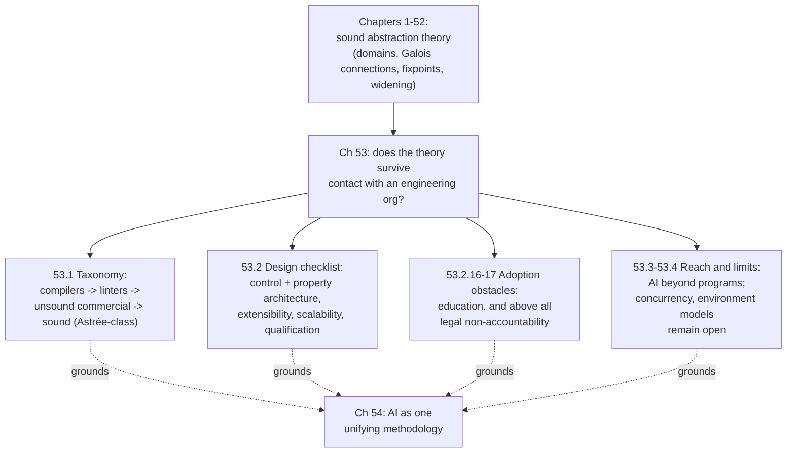

# Engineering and Adoption of Static Analysis Tools

[[book-guidelines|↩ Back to guidelines]]

## Why this chapter exists

Every previous chapter of the book is about getting the *math* right: constructing sound abstractions, proving fixpoint transfer theorems, showing that an abstract interpreter never lies. Chapter 53 steps back and asks a completely different question: given a mathematically correct construction, why does it so rarely become a tool that real engineers actually use? The answer the chapter gives is blunt — soundness is necessary but nowhere near sufficient. A tool also has to survive contact with millions of lines of legacy C, with engineers who have five minutes and no patience for a formal-methods lecture, with procurement processes, with a market where "good enough and fast" reliably beats "correct and slow." This chapter is the book's reality check: it takes the theory built across 52 chapters and asks what stands between it and a shrink-wrapped product.

**What breaks without this chapter:** without it, you'd walk away from the book believing that a sound abstract interpreter is basically done once you've proved the Galois connection and picked a widening. In practice, Astrée — the book's running example of an industrial-grade sound analyzer — took *decades* of engineering beyond its mathematical foundations. The theory is the easy 10%.

---

## 53.1 A taxonomy of static analysis tools

The chapter organizes the entire industry into four levels, ordered by how much they promise and how much rigor backs the promise up.

1. **Compilers** (e.g. Clang, OCaml). These are static analyzers by accident — every compiler with type checking already rejects some programs statically. Their checks are narrow (mismatched parameter types, obviously undefined names) but universally trusted, because every programmer already runs one.
2. **Linters** (e.g. Unix `lint`, Roslyn, Semmle/LGTM). One level up: they catch unused variables, use-before-initialization, unreachable code, some type mismatches beyond what the compiler enforces. They work mostly by *pattern matching* on syntax, occasionally backed by lightweight dataflow analysis. Crucially, they're **extensible** — teams can bolt on their own style rules — which is why they're popular with junior engineers who need scaffolding rather than a verdict.
3. **Wide-scope commercial scanners** (e.g. Coverity, CBMC). These chase breadth: "21 languages and 70+ frameworks" is a real marketing claim the chapter quotes. To hit that breadth at usable speed, they give up soundness — Coverity, for instance, analyzes loops by looking at only the first few iterations; CBMC unrolls loops a bounded number of times. They're empirically useful bug-finders, but they can silently miss real bugs, so **they provide no guarantee and are unfit for certification**. Their real selling point is UX: ranked alarms, plain-English explanations, fix suggestions — the things that make professional programmers actually want to run them.
4. **Semantics-based sound and precise analyzers** (e.g. Astrée). This is the top of the taxonomy and the category this entire book has been building toward. These tools ground their checks in a mathematically justified abstraction of the program's semantics, they never miss a bug in the class they target (e.g. runtime errors) under stated hypotheses, but they demand real parameterization (word size, endianness, etc.) and can take minutes to hours on an industrial codebase. They are not built for the "type, get instant red squiggle" workflow — they're built for engineers who need the highest achievable assurance and are willing to pay for it in setup and runtime.

The taxonomy is not a strict partition — the chapter is explicit that most real tools mix characteristics from several levels, which is exactly why evaluating them "objectively and precisely, in particular for soundness" is so hard. Notice the pattern across the four levels: as you move up, *precision and guarantee strength go up while user-friendliness and breadth go down*. That trade curve is the chapter's real subject, and everything in 53.2 is about how to manage that curve deliberately rather than stumbling into it.

**Grounding (Rust).** Think of this taxonomy as a stack of increasingly expensive `Result`-returning passes over the same AST:

```rust
// Level 1 — the compiler's own type/borrow checker: cheap, mandatory, narrow.
fn typecheck(ast: &Ast) -> Result<TypedAst, TypeError> { /* ... */ }

// Level 2 — a linter pass: syntactic, pattern-based, extensible rule set.
trait LintRule {
    fn check(&self, ast: &TypedAst) -> Vec<Warning>;
}

// Level 3 — a bounded, unsound scanner: fast, wide coverage, no promises.
fn scan_for_bugs(ast: &TypedAst, unroll_bound: usize) -> Vec<PossibleBug> { /* ... */ }

// Level 4 — a sound abstract interpreter: expensive, narrow domain, real guarantee.
fn analyze_soundly(ast: &TypedAst, params: MachineParams) -> AbstractState {
    // never returns "no error" for a program that can actually error
    // at runtime under `params` — that's the whole point.
    todo!()
}
```

The levels aren't alternative implementations of the same function — they trade off completely different guarantees, and a real engineering org typically runs several of them simultaneously (a linter in the editor, a sound analyzer in nightly CI) rather than picking just one.

---

## 53.2 Control architecture and property architecture of analyzers

This is the chapter's most load-bearing engineering distinction, and it's a direct instance of "mechanism, not just theory" — this is where the book tells you *how* a static analyzer is actually built, not just what it computes.

### Control architecture: structural vs. intermediate-language

Two designs dominate the industry:

- **Intermediate-language (IL) based.** The overwhelming majority of tools (the chapter's example: Clousot for .NET's CIL) compile every source language down to one shared IL and run a single analysis engine over that IL. This *looks* efficient — write the hard analysis once, reuse it across languages.
- **Structural.** The minority approach — the one this entire book has been teaching — analyzes the program's own syntax tree directly, language by language, mirroring how a compiler's frontend already works.

The chapter's argument for structural over IL-based is sharper than "purity for its own sake." A compiler frontend is, empirically, *the easiest and best-understood part of a compiler* — so the effort "saved" by funneling everything through one IL is small. Meanwhile IL-based designs pay real, recurring costs: they must map every alarm back to source locations across a translation boundary, they lose language-specific structure that the analysis needs (e.g. a segmentation or partitioning concept that's natural on the source AST but awkward to reconstruct after IL lowering), and — if you ever *do* need IL-level information — you can just add it to the structural program representation, so the IL doesn't even buy you something structural design can't get another way.

This connects directly to why **control architecture determines how induction is performed**: the whole machinery of widening/narrowing (Ch. 43ff.) needs *some* well-founded structure to induct over — loop headers, call sites, recursive positions. In more complex situations that structure isn't fixed in advance and has to be discovered *during* the analysis itself (the chapter cites dynamic segmentation as an example). A structural architecture keeps that structure visible and manipulable; an IL erases and has to be re-derived.

### Property architecture: abstract domains + functors vs. monolithic logic

The second early design decision is *how properties are represented internally*. The book's own answer, exemplified by Astrée: **abstract domains combined via functors** — the reduced product being the canonical example — which decomposes a hard analysis problem into smaller, separately-masterable subproblems. Each abstract domain (intervals, octagons, congruences, …) is its own module with its own well-defined operations (⊔, ⊑, widening), and functors compose them.

The chapter's counterexample is Infer, where properties are represented as raw logical formulas and operations like widening are *implicit*, scattered through the codebase rather than factored into a named, swappable component. The consequence, stated plainly: even when Infer's code is public, "the kernel is left inextricable." This is a direct, concrete instance of the extensibility argument in 53.2.6 below — a property architecture without modular structure can't be safely extended by anyone who isn't already deep inside the codebase.

**Grounding (Rust) — property architecture as a trait hierarchy.** The abstract-domains-plus-functors design maps almost literally onto Rust traits and generic composition, which is exactly the shape a "domain functor" takes in an implementation:

```rust
trait AbstractDomain {
    type Concrete;
    fn join(&self, other: &Self) -> Self;
    fn widen(&self, other: &Self) -> Self;      // named, not implicit
    fn leq(&self, other: &Self) -> bool;
}

// A functor: builds a new domain out of two existing ones (reduced product).
struct ReducedProduct<A: AbstractDomain, B: AbstractDomain> {
    left: A,
    right: B,
}

impl<A: AbstractDomain, B: AbstractDomain> AbstractDomain for ReducedProduct<A, B> {
    type Concrete = (A::Concrete, B::Concrete);
    fn join(&self, other: &Self) -> Self {
        ReducedProduct { left: self.left.join(&other.left), right: self.right.join(&other.right) }
        // + a reduction step exchanging information between left and right
    }
    fn widen(&self, other: &Self) -> Self { /* delegate + reduce */ todo!() }
    fn leq(&self, other: &Self) -> bool { self.left.leq(&other.left) && self.right.leq(&other.right) }
}
```

`widen` is a named trait method here — it can never become "implicit and distributed all over the code" the way the chapter criticizes Infer for, because the type system forces every domain to expose it as a first-class, swappable operation. This is precisely the kind of "how you'd implement it" reading the theory-vs-mechanism split calls for: the reduced-product functor from earlier chapters ([[Combining-and-Refining-Abstract-Domains|Combining and Refining Abstract Domains]]) isn't just a lattice construction, it's a concrete generic-composition pattern you'd reach for when building a real analyzer.

---

## Extensibility, scalability, and qualification

Sections 53.2.6–53.2.14 read like an engineering checklist, and the skill's "what breaks without this" framing applies to nearly every item — each is a place where a mathematically sound analyzer can still fail as a product.

- **Extensibility (53.2.6).** You cannot predict in advance which inductive properties a given codebase will need — this is *why* the abstract-domain/functor architecture exists at all, not an afterthought bolted on later. Plug-in systems (the chapter cites Frama-C's Eva plug-in) let you add new domains; what's much harder is letting a plug-in *combine* cleanly with the domains already present, since the reduction step in a reduced product is exactly the part that's hard to make generic. Astrée, notably, was designed for extensibility from day one — retrofitting it later is described as far harder than building it in.
- **Scalability (53.2.7).** Most industrial software isn't decomposable into small, independently analyzable, purely functional units — it's millions of lines sharing a large, mutable global state. So scalability isn't a late-stage optimization pass, it's a day-one architectural constraint. Astrée's own answer is telling: it does *not* use a literal reduced product (too expensive at scale) but a carefully engineered *overapproximation* of one — trading a little precision for the ability to scale to tens of millions of lines of C.
- **Qualification (53.2.10).** This is the chapter's sharpest technical-meets-legal point. Standards like DO-333 (the static-analysis supplement to DO-178C, avionics software certification) require that *if a program has a bug in the category the tool claims to check, the tool must flag it*. That's exactly the definition of soundness from earlier chapters, now recast as a regulatory requirement: **an unsound analyzer cannot be qualified, but an imprecise one can** — false alarms are legally tolerable, missed real bugs are not. Astrée being DO-333 qualified is presented as a genuine competitive advantage, since it removes redundant manual testing that would otherwise be mandated.
- **Human resources (53.2.15) and industrialization (53.2.14).** The chapter is candid that a sound, scalable analyzer takes *decades*, not the weeks or months of an academic prototype, and needs a rare combination of deep theoretical background and hands-on practical experience. Industrialization — documentation, UI, adaptation to domain-specific standards — "most often requires more work than the analyzer itself," and is described as something that "can hardly be done outside an industrial context."

**Grounding (Python) — a quick illustrative sketch of the qualification constraint**, not meant to be load-bearing, just to make the soundness-vs-precision asymmetry concrete:

```python
# A "qualifiable" checker: may over-report, must never under-report.
def check_division_by_zero(program, hypotheses):
    alarms = analyze(program, hypotheses)      # sound abstract analysis
    # Every real division-by-zero bug is guaranteed to appear in `alarms`.
    # Some entries in `alarms` may be false positives — that's fine for DO-333.
    return alarms

# An "unqualifiable" checker, however fast or well-reviewed:
def check_division_by_zero_heuristic(program):
    return pattern_match_common_cases(program)  # can silently miss real bugs
    # No amount of empirical testing turns this into a DO-333-qualifiable tool.
```

---

## Obstacles to industrial adoption of sound analyzers

Section 53.2.16–53.2.17 name the two obstacles the chapter considers most decisive, and they are explicitly *not* technical.

- **Education.** Most software engineers have, in the chapter's words, "a fuzzy understanding of static analysis." Type checking is the one static analysis every programmer already accepts, because it's baked into their education from day one; nothing comparably rigorous is. Educational tooling and educational licenses of professional analyzers exist but are underused. The chapter's implication: adoption is bottlenecked as much by what programmers were *taught to expect* from tools as by what the tools can deliver.
- **Responsibility — the chapter's stated primary obstacle.** This is the sharpest claim in the chapter, worth quoting the structure of: software engineers are, in practice, granted something like professional immunity for defects, on the premise that rigorous verification is "beyond best practice." Compare this to civil or aerospace engineering, where certified analysis is *mandatory* precisely because practitioners are held accountable for failures. The chapter's causal claim is that this asymmetry — no accountability, therefore no obligation to use a tool that could have caught the bug — is a *bigger* barrier to sound-analyzer adoption than any remaining gap in scalability or precision. Its proposed remedy — making the use of qualified tools mandatory in "best practice," so that at least "definite" (i.e. provably real) bugs become attributable — reframes tool adoption as a liability question, not a tooling-maturity question.

This is the chapter's answer to Key Question 2 from the guidelines: the primary obstacle is social/legal, not technical, and the chapter argues explicitly that fixing it would matter more than further narrowing the soundness-precision-scalability trade triangle.

---

## Beyond program static analysis, and remaining open problems

Section 53.3 is a fast survey of how far the abstract-interpretation *methodology* — not any specific tool — has traveled beyond program verification: controller synthesis, program synthesis, fuzz testing, biological signaling networks, neural-network robustness and fairness auditing, SMT solving, hybrid/cyber-physical systems, Simulink/Lustre models, games, energy consumption, climate models, even quantum computing. The point isn't that these are static-analysis-tools in the 53.1 taxonomy sense — it's that the abstraction recipe (concrete domain → property of interest → sound abstract domain → concretization) generalizes past "does this C program have a runtime error," which foreshadows Chapter 54's closing claim that abstract interpretation is best understood as a *unifying methodology*, not a single tool category.

Section 53.4 closes with the honest limits: complex data structures, hardware/memory models, concurrency, distributed and real-time systems remain immature targets; and there's a harder shift on the horizon from analyzing a program in isolation to analyzing a program *together with a model of its environment* (the cyber-physical "closing the loop" example — proving stability and robustness of the whole system, not just input/output correctness of the code). The chapter's very last line names the permanent tension the whole book has been navigating: undecidability forces a perpetual trade-off between soundness, precision, and scalability, and that trade-off "will remain an interesting challenge, forever."

---

## Structural synthesis



This chapter is a direct prerequisite for two of the standing project's targets. First, the control/property architecture split is exactly the design choice a Rust-based verifier will have to make on day one: structural (per-AST-node) analysis over a shared IL, and abstract domains-as-traits-with-functors over an implicit logic-formula soup. The chapter's argument for the former — that frontend cost is small and IL erases structure the widening/narrowing machinery needs — is a strong prior for how to architect that verifier's core analysis engine. Second, the qualification distinction (53.2.10) is a precise, reusable definition worth carrying forward: a checker used to *justify* correctness claims (Hoare-triple soundness) must never under-report — false positives are a UX cost, false negatives are a correctness failure of the checker itself. That's the same asymmetry DO-333 legislates, and it's the right bar for judging whether a homegrown theorem prover's output can be trusted as a real guarantee rather than a heuristic hint.

## Where this leads

Chapter 53 is the practical bridge between the theory (Chapters 1–52) and Chapter 54's closing synthesis, which restates the entire book's abstraction recipe as a single unifying principle and reflects on what remains genuinely open — chiefly, that *finding* good abstractions stays an art, not an automated science.
