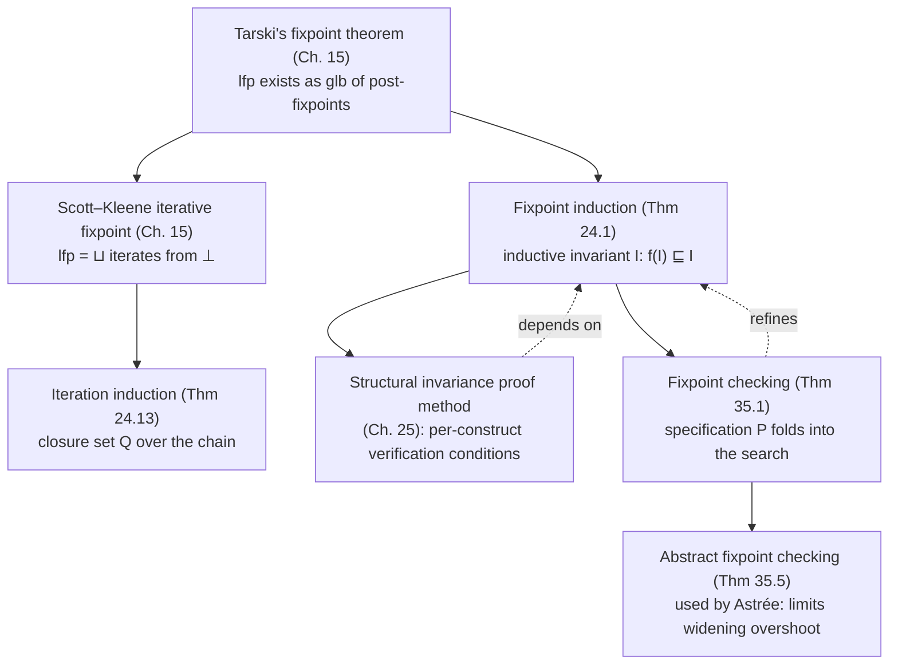

[[book-guidelines|↩ Back to guidelines]]

## The problem: your semantics *is* a fixpoint, so how do you reason about it?

By this point in the book, the trace semantics or reachability semantics of a program has been recast as the *least fixpoint* of a transformer $f$ on a complete lattice: $\mathrm{lfp}^{\sqsubseteq} f$. That's elegant, but it creates an immediate practical problem. A least fixpoint is defined as the meet of all the post-fixpoints — $\mathrm{lfp}^\sqsubseteq f = \sqcap\{x \mid f(x) \sqsubseteq x\}$ (Tarski, Theorem 15.6) — or, dually, as the limit of the ascending Kleene chain $\bot, f(\bot), f(f(\bot)), \dots$. Neither definition is something you can *compute with* directly when the lattice is infinite (e.g. the set of all reachable program states). You can't literally enumerate the chain to infinity, and "the meet of everything above the fixpoint" isn't an algorithm.

So verification needs a way to prove a property of the form
$$\mathrm{lfp}^{\sqsubseteq} f \sqsubseteq P$$
— "the least fixpoint (the program's actual behavior) satisfies specification $P$" — **without ever computing the fixpoint itself.** This is exactly the situation a Rust borrow-checker or a Hoare-logic verifier is in: you never enumerate all program executions, you find a *finite, checkable certificate* that stands in for the infinite computation. That certificate is called an **invariant**, and the two chapters covered here — Chapter 24 (Fixpoint Induction) and Chapter 35 (Fixpoint Checking) — are the theory of how to build and check such certificates.

## Invariant vs. inductive invariant: the distinction that makes verification possible

Start with the naive definition. $I$ is an **invariant** of $f$ if
$$\mathrm{lfp}^\sqsubseteq f \sqsubseteq I.$$
This just says "$I$ over-approximates everything the program can actually do." It's true by construction if $I = \mathrm{lfp}^\sqsubseteq f$ itself, but that's circular — to *check* that some candidate $I$ is an invariant, you'd already need to know $\mathrm{lfp}^\sqsubseteq f$, which is the thing you were trying to avoid computing.

The fix is to demand something *stronger but locally checkable*: $I$ is an **inductive invariant** of $f$ when
$$f(I) \sqsubseteq I.$$
This says nothing about the (unknown) least fixpoint at all. It's a statement purely about $I$ and one application of $f$ — the kind of thing you can check mechanically, one program construct at a time, without ever touching an infinite object. [[Safety-and-Liveness-Properties#What breaks without this distinction|What breaks without this distinction]]: if you only require "$I$ is an invariant," verifying it is exactly as hard as computing the fixpoint, so you've solved nothing. Inductiveness is what turns "prove a property of an infinite object" into "check a single finite algebraic condition."

Every inductive invariant is an invariant (this is essentially what Tarski's theorem gives you for free), but not every invariant is inductive — the book flags this explicitly (Exercise 24.5): you can have $\mathrm{lfp}^\sqsubseteq f \sqsubseteq I$ hold while $f(I) \sqsubseteq I$ fails, if $I$ happens to bound the fixpoint from above without being closed under one more step of $f$. This is the crux of practical verification difficulty: a *true* specification $P$ might not itself be inductive, so you often need to search for a *strictly stronger* $I \sqsubseteq P$ that is.

**Rust grounding.** This is precisely the shape of a loop invariant in a Hoare-style verifier. If a Rust `while` loop's body is a transformer `f: State -> State`, an inductive invariant is a predicate `inv: State -> bool` such that:

```rust
// inductive invariant check — no execution required, purely local:
fn is_inductive_invariant(pre: &State, inv: impl Fn(&State) -> bool, f: impl Fn(&State) -> State) -> bool {
    // f(I) ⊑ I, checked symbolically/structurally, not by running f to convergence
    inv(pre) && inv(&f(pre))   // schematically: check closure under one step
}
```
A verifier never runs the loop to convergence (that's the least fixpoint) — it checks that the *candidate* invariant is closed under one application of the loop body, plus that it's implied at entry and implies the postcondition. That per-step, non-iterative check is exactly $f(I) \sqsubseteq I$.

## Fixpoint induction: soundness *and* completeness, both at once

The formal engine behind "checking $f(I) \sqsubseteq I$ suffices" is **Theorem 24.1 (fixpoint induction I)**. Let $f \in \mathscr{L} \xrightarrow{\;\nearrow\;} \mathscr{L}$ be an increasing function on a complete lattice $\langle \mathscr{L}, \sqsubseteq, \bot, \top, \sqcap, \sqcup \rangle$ and $P \in \mathscr{L}$. Then:

$$\mathrm{lfp}^\sqsubseteq f \sqsubseteq P \iff \exists I \in \mathscr{L}.\ \underbrace{f(I) \sqsubseteq I}_{(a)} \ \wedge\ \underbrace{I \sqsubseteq P}_{(b)}$$

Read left to right: to prove the property $P$ holds of the least fixpoint, it suffices to *exhibit* an inductive invariant $I$ that implies $P$. Read right to left (this is the "complete" direction, and it's what makes the theorem worth stating as an iff rather than just an implication): if $\mathrm{lfp}^\sqsubseteq f \sqsubseteq P$ is *actually true*, such an $I$ is guaranteed to exist — namely $I = \mathrm{lfp}^\sqsubseteq f$ itself, since $f(\mathrm{lfp}^\sqsubseteq f) = \mathrm{lfp}^\sqsubseteq f$ (a fixpoint trivially satisfies $f(I) \sqsubseteq I$ by reflexivity).

The book's proof is short precisely because it reduces directly to Tarski: since $\mathrm{lfp}^\sqsubseteq f = \sqcap\{x \mid f(x) \sqsubseteq x\}$, any $I$ satisfying $f(I) \sqsubseteq I$ is a member of that set, so it sits above the meet: $\mathrm{lfp}^\sqsubseteq f \sqsubseteq I \sqsubseteq P$. That's it — the whole soundness argument is "glb is a lower bound of every set member." The book notes (Exercise 24.11) this equivalence runs *both* ways: fixpoint induction can also be used to re-derive Tarski's theorem, so the two results are interchangeable foundations for the same fact.

**Soundness vs. completeness, made concrete.** The book states this crisply: *soundness* means "if the proof method succeeds, the statement is true" — you can trust a proof it produces. *Completeness* means "if the statement is true, the proof method can always succeed" — the method never fails you on a true fact for lack of expressive power (it may still fail practically, because *finding* $I$ is undecidable in general — more on that below). A proof method with only soundness is safe but might be permanently stuck on true facts it can't certify. A proof method with only completeness might "prove" false things. Fixpoint induction gives you both, which is why it underlies essentially every subsequent invariance/verification technique in the book (Chapter 25 builds the classical Turing/Naur/Floyd structural proof method directly on top of it).

**Worked example (24.3, reconstructed).** Let $f \in \wp(\mathbb{Z}) \to \wp(\mathbb{Z})$ with $f(X) = \{0\} \cup \{z+4 \mid z \in X\}$, and take $P = \{2k \mid k \in \mathbb{N}\}$ (the even naturals doubled, i.e. multiples of 2 that are $\geq 0$ — really "nonnegative even integers"). We want $\mathrm{lfp}^\subseteq f \subseteq P$. Guess $I = \{4k \mid k \in \mathbb{N}\}$ (multiples of 4). Check inductiveness directly:
$$f(I) = \{0\} \cup \{z + 4 \mid z \in \{4k \mid k \in \mathbb{N}\}\} = \{4k \mid k \in \{0\}\} \cup \{4k \mid k \in \mathbb{N}^+\} = \{4k \mid k \in \mathbb{N}\} = I,$$
so $f(I) \subseteq I$ trivially (equality), and $I \subseteq P$ since every multiple of 4 is even. By Theorem 24.1, $\mathrm{lfp}^\subseteq f \subseteq P$ — proved without ever unrolling the iteration $\{0\}, \{0,4\}, \{0,4,8\}, \dots$

```python
# The same certificate, checked mechanically instead of by iterating to a limit:
def f(X):        return {0} | {z + 4 for z in X}
def is_inductive(I): return f(I) <= I          # f(I) subset-or-equal I, on a finite window
I = {4 * k for k in range(0, 25)}              # finite stand-in for the infinite set {4k | k in N}
assert I <= {2 * k for k in range(0, 50)}      # I ⊆ P
# is_inductive(I) would need a symbolic/parametric check for the true infinite I;
# this finite slice only illustrates the shape of the certificate.
```

## Iteration induction: the dual method, reasoning from *below*

Fixpoint induction reasons about *post-fixpoints above* $\mathrm{lfp}^\sqsubseteq f$ — a "top-down" certificate. There's a dual, "bottom-up" method that reasons about the *iterates* of $f$ starting from $\bot$ directly: $F^0(\bot) = \bot,\ F^{i+1}(\bot) = F(F^i(\bot))$. This connects to the **Scott–Kleene fixpoint theorem** (15.26): on a CPO, $\mathrm{lfp}^\sqsubseteq f = \bigsqcup_{i \in \mathbb{N}} f^i(\bot)$, the limit of this ascending chain.

**Theorem 24.13 (iteration induction).** Let $F \in \mathscr{L} \xrightarrow{uc} \mathscr{L}$ (upper-continuous) on a CPO $\langle \mathscr{L}, \sqsubseteq, \bot, \sqcup \rangle$, and $\mathcal{P} \in \wp(\mathscr{L})$. Then:

$$\mathrm{lfp}^\sqsubseteq F \in \mathcal{P} \iff \exists \mathcal{Q} \in \wp(\mathscr{L}).\ \bot \in \mathcal{Q}\ \ (a)\ \wedge\ \forall x \in \mathcal{Q}.\ F(x) \in \mathcal{Q}\ \ (b)\ \wedge \left[\text{for any } F\text{-maximally}\sqsubseteq\text{-increasing chain } \langle x_i, i \in \mathbb{N}\rangle \text{ in } \mathcal{Q},\ \bigsqcup_{i \in \mathbb{N}} x_i \in \mathcal{P}\right]\ \ (c)$$

[[Convergence-Acceleration-by-Widening-and-Narrowing#The intuition|The intuition]]: instead of certifying a single $I$ that dominates the whole fixpoint at once, you certify a *set* $\mathcal{Q}$ that (a) contains the starting point $\bot$, (b) is closed under one step of $F$ — so every finite iterate stays inside $\mathcal{Q}$ — and (c) whose *limits* (suprema of increasing chains built by iterating $F$) all land in the target property $\mathcal{P}$. This is structural induction on the iteration sequence itself, rather than a single algebraic closure condition. It's the fixpoint-theory analogue of proving a loop-invariant by induction on the number of iterations executed, as opposed to a purely static closure argument.

**When is one more natural than the other?** Fixpoint induction (24.1) is more natural when you can *guess* a closed-form invariant directly from the problem's structure — you don't need to think about the iteration process at all, just check one algebraic condition. Iteration induction (24.13) is more natural when the property depends on facts that only hold *in the limit* of a chain (e.g. termination-style properties, or invariants that are naturally indexed by "how many unrollings have happened so far," as in the factorial example below) — reasoning about individual iterates gives you leverage that a single static $I$ doesn't.

**Worked example (24.14, continuing 24.3).** With the same $f$, take $\mathcal{P} = \wp(\{2k \mid k \in \mathbb{N}\})$ and define $\mathcal{Q} = \{x_i \mid i \in \mathbb{N}\}$ where $x_i = \{4k \mid 0 \le k < i\}$ — literally the sequence of partial results as the iteration unrolls. Each $x_i$ satisfies the closure conditions by direct calculation, and the supremum of the chain is $\bigcup_i x_i = \{4k \mid k \in \mathbb{N}\} \subseteq P$. Theorem 24.13 concludes $\mathrm{lfp}^\subseteq f \in \mathcal{P}$.

Exercise 24.15's *factorial termination* example is the sharpest illustration of why iteration induction earns its keep: proving $\forall n.\ \exists y.\ \langle n,y\rangle \in \mathrm{lfp}^\subseteq F_!$ (i.e., the factorial relation is *total*) genuinely requires reasoning about "after $i$ iterations, results are defined for inputs $0,\dots,i-1$" — a fact about the *iterates*, not a single static invariant on the whole relation. No single inductive $I$ captures "eventually every natural number gets a value" as cleanly as the chain-indexed argument does.

**Lean grounding.** Iteration induction is structurally identical to well-founded / strong induction over `Nat`, applied to a monotone `Nat → α` sequence:

```lean
-- schematic: proving a limit property by proving it holds at every finite stage
theorem iterate_limit_mem (F : α → α) (P : Set α) (Q : Set α)
    (hbot : (⊥ : α) ∈ Q)
    (hstep : ∀ x ∈ Q, F x ∈ Q)
    (hlimit : ∀ (c : ℕ → α), (∀ i, c i ∈ Q) → Monotone c → ⨆ i, c i ∈ P) :
    (⨆ i, F^[i] ⊥) ∈ P := by
  apply hlimit (fun i => F^[i] ⊥)
  · intro i; induction i with
    | zero => exact hbot
    | succ n ih => exact hstep _ ih
  · exact monotone_nat_of_le_succ (fun n => sorry) -- F increasing ⇒ chain increasing
```
This is exactly the shape of proving a recursive function total by strong induction on the unrolling depth — familiar territory if you've proven Lean recursors terminate.

## Fixpoint checking: using the specification to sharpen the invariant search

Chapter 35 revisits fixpoint induction with one twist that matters enormously in practice. In Theorem 24.1, the invariant $I$ is found *independently* of the target specification $P$ — you search blind, then check $I \sqsubseteq P$ as an afterthought. **Theorem 35.1 (concrete fixpoint checking)** lets you use $P$ *during* the search:

$$\mathrm{lfp}^\sqsubseteq f \sqsubseteq P \iff \exists I \in \mathscr{L}.\ (f(I) \sqcap P) \sqsubseteq I\ \wedge\ f(I) \sqsubseteq P$$

Compare the two closure conditions side by side. Fixpoint induction demands $f(I) \sqsubseteq I$ — "one full step of $f$, unconstrained, stays inside $I$." Fixpoint checking only demands $(f(I) \sqcap P) \sqsubseteq I$ — "one step of $f$, *intersected with what the specification already guarantees*, stays inside $I$." Since $f(I) \sqcap P \sqsubseteq f(I)$, the checking condition is easier to satisfy — you're allowed to *assume* $P$ holds while computing what $I$ needs to absorb, then separately verify that assumption was justified via $f(I) \sqsubseteq P$.

The book's proof of Theorem 35.1 is worth walking through because it shows exactly where the extra leverage comes from:

- **Soundness ($\Leftarrow$):** from $(f(I) \sqcap P) \sqsubseteq I \wedge f(I) \sqsubseteq P$, substitute $f(I) \sqcap P = f(I)$ (since $f(I) \sqsubseteq P$ already) to get $f(I) \sqsubseteq I \wedge f(I) \sqsubseteq P$ — this collapses back to ordinary fixpoint induction's hypothesis, giving $\mathrm{lfp}^\sqsubseteq f \sqsubseteq I$, and then $\mathrm{lfp}^\sqsubseteq f = f(\mathrm{lfp}^\sqsubseteq f) \sqsubseteq f(I) \sqsubseteq P$ by transitivity.
- **Completeness ($\Rightarrow$):** take $I = \mathrm{lfp}^\sqsubseteq f$ again. Then $f(I) \sqcap P = I \sqcap P = I$ (since $I \sqsubseteq P$ by hypothesis), so $(f(I) \sqcap P) \sqsubseteq I$ holds by reflexivity, and $f(I) \sqsubseteq P$ holds because $f(I) = I \sqsubseteq P$.

**Why this matters for static analysis (the "what breaks without this" case):** widening operators — used to force convergence of an analysis on infinite-height lattices — deliberately over-approximate to guarantee termination, and that overshoot is the single biggest source of imprecision in real analyzers. Ordinary fixpoint induction gives you no lever against this: you search for *some* inductive $I$, period. Fixpoint checking lets the search target $\mathrm{lfp}^\sqsubseteq x.\ f(x) \sqcap P$ instead of the plain $\mathrm{lfp}^\sqsubseteq f$ — every iterate is clipped against $P$ *during* the computation, so a widening step that would otherwise overshoot wildly gets reined in by the known specification at each step, not just at the end. This is stated explicitly as the industrial motivation: the abstract analogue (**Theorem 35.5**, using a possibly non-monotone abstract transformer $\widehat{f}$ satisfying $f \circ \gamma \sqsubseteq \gamma \circ \widehat{f}$, "semicommutation," rather than requiring exact commutation) is the mechanism behind the **Astrée** analyzer's two-phase approach: first analyze *assuming* the specification holds, then verify that assumption was sound.

**Rust grounding.** This maps directly onto assume/assert-style verification workflows and to the difference between unconstrained abstract interpretation and specification-guided abstract interpretation:

```rust
// Ordinary fixpoint induction: search for I blind, then check I ⊑ P.
fn verify_blind(f: impl Fn(&Domain) -> Domain, spec: &Domain) -> Option<Domain> {
    let i = infer_invariant(f);         // no knowledge of `spec` used here
    (i.leq(spec)).then_some(i)
}

// Fixpoint checking: fold `spec` into the search itself, clipping every step.
fn verify_checked(f: impl Fn(&Domain) -> Domain, spec: &Domain) -> Option<Domain> {
    let i = infer_invariant(|x| f(x).meet(spec));   // widen against f(x) ⊓ P, not f(x)
    (f(&i).leq(spec)).then_some(i)                   // still must confirm f(I) ⊑ P
}
```
The second version is strictly more precise for the same widening strategy, because every intermediate iterate is prevented from drifting outside `spec` before it ever gets a chance to widen further off course.

**The limits (Section 35.3 — "abstract invariants may not help enough").** Two distinct failure modes, and it's worth keeping them separate because they call for different fixes: (1) if the specification $P$ is naturally stated in the *concrete* domain, abstracting it into $P^\sharp$ can lose exactly the information that would have made the check succeed — the abstraction itself is where precision leaks, not the checking method; (2) if $P$ is stated directly in the *abstract* domain, it might simply fail to be inductive there regardless of technique — no search strategy fixes an abstract domain that's structurally too coarse to express the needed invariant (this is the same inexpressivity problem flagged in Chapter 25, e.g. Presburger arithmetic's inability to state multiplicative invariants). Crucially, **neither failure mode threatens soundness** — fixpoint checking never certifies something false — they only threaten *usefulness*: the method may simply come back unable to confirm a true specification.

## Why undecidability doesn't sink any of this

All three theorems (24.1, 24.13, 35.1) are constructive existence statements — "an $I$ (or $\mathcal{Q}$) exists iff the property holds" — not algorithms. *Finding* $I$ is, in general, undecidable: by Rice's theorem, deciding semantic properties of programs is undecidable, and the space of possible invariants over any expressive lattice is generally infinite. This is precisely why the book frames these as "sound and complete but undecidable" methods (Chapter 25's framing, inherited by the fixpoint-checking refinement): completeness guarantees a certificate *exists* whenever the fact is true, but says nothing about how to search for it efficiently, or in bounded time. That's the entire practical research program of the rest of the book — widening/narrowing to force termination of the search, abstract domains to make the search space finite/tractable, and (as covered here) using the specification itself to steer the search rather than leaving it unconstrained.

## Where this leads



Both chapters sit at the theoretical hinge of the whole book: everything from Chapter 25's structural Floyd-style proof method onward, through reduced products, widening/narrowing refinements, and industrial analyzers like Astrée, is a specialization or engineering elaboration of "find a checkable, inductive certificate instead of computing the fixpoint." For the verifier-and-elaborator project this vault is building toward, these two theorems *are* the mechanism your Rust verifier needs: a loop-invariant checker is a direct implementation of Theorem 24.1's condition $f(I) \sqsubseteq I$, and once you add Hoare-triple postconditions to guide invariant inference (rather than inferring blind and checking after), you're implementing Theorem 35.1's refinement — using the target contract to sharpen the invariant search itself, exactly as Astrée does with widening.
