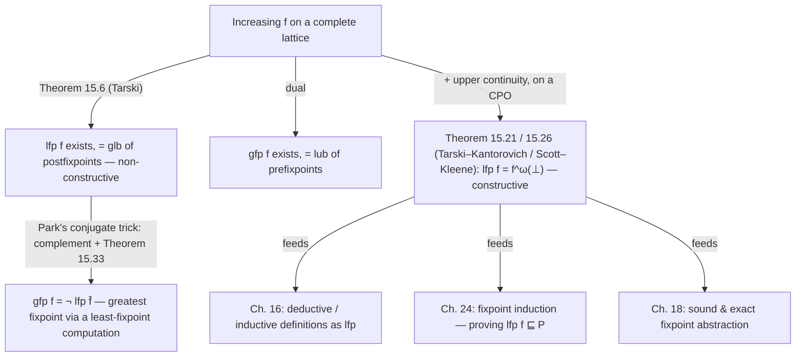

# Fixpoint Theory

[[book-guidelines|↩ Back to guidelines]]

## Why fixpoints, and why here

Every static analyzer, every type checker, every operational semantics eventually has to answer the same question: *what does this recursive thing mean?* A `while` loop, a recursively defined data type, the "reachable states" of a transition system, the typing judgment for a recursive function — all of these are defined in terms of themselves. You can't unfold a recursive definition finitely many times and call it done; you need a notion of "the thing this self-referential equation is talking about" that doesn't depend on picking a number of unfoldings.

That's a fixpoint. If $f$ is a function from a set to itself, a fixpoint of $f$ is an $x$ such that $f(x) = x$ — a point the equation "solves itself" at. Cousot's chapter 15 opens with exactly the operational picture: iterate $f$ from some starting point $a$, i.e. $f^0 \triangleq a$, $f^{n+1} \triangleq f(f^n)$, and one of three things happens — you land on a fixpoint, you fall into a cycle and loop forever, or (only possible on an infinite set) you wander through infinitely many distinct elements and never repeat. The chapter's entire agenda is: *what properties of $S$, $f$, and $a$ guarantee you land on a fixpoint, and moreover the "smallest" or "largest" one in some order?*

This matters for the book (and for you) because from chapter 16 onward, *every* semantics in the book — deductive rule systems, structural definitions, prefix-trace and maximal-trace semantics, and the abstract interpretations built on top of them — gets recast as a fixpoint of some transformer on a lattice. Fixpoint theory is the load-bearing wall; everything downstream leans on it.

## 15.1 Fixpoint theorems

### The problem: existence

A function on an arbitrary set can have no fixpoint (Cousot's own warm-up, exercise 15.1: $f(x) = x+1$ on $\mathbb{Z}$), exactly one ($f(x) = -x$, fixed only at $0$), or infinitely many ($f(x) = x$, fixed everywhere). Nothing about "being a function" forces a fixpoint to exist. So the first job is finding a hypothesis on $f$ and on the space it lives on that *does* force one.

The hypothesis on $f$ is **monotonicity**, which the book calls "increasing": on a poset $\langle S, \sqsubseteq \rangle$, $f$ is increasing (written $f \in S \xrightarrow{\text{incr}} S$) iff $\forall x, y \in S.\ (x \sqsubseteq y) \Rightarrow (f(x) \sqsubseteq f(y))$ — order in, order-or-better out. The hypothesis on the space is **completeness**: a complete lattice $\langle L, \sqsubseteq, \bot, \top, \sqcap, \sqcup \rangle$ has *every* subset's greatest lower bound ($\sqcap$) and least upper bound ($\sqcup$), not just finite ones.

**What breaks without completeness:** if $L$ is merely a lattice (finite meets/joins guaranteed, but not infinite ones), the set of "candidate lower bounds" used in Tarski's construction below might not have a greatest lower bound at all, and the whole existence argument collapses. Completeness is exactly the closure property that makes an infinite intersection of a set of "safe" candidates itself a well-defined element of the space — which is precisely what an abstract interpreter needs when it's implicitly quantifying over infinitely many program states.

### Tarski's fixpoint theorem

> **Theorem 15.6 (Tarski's fixpoint theorem).** An increasing function $f \in L \xrightarrow{\text{incr}} L$ on a complete lattice $\langle L, \sqsubseteq, \bot, \top, \sqcap, \sqcup \rangle$ has a least fixpoint
> $$\mathrm{lfp}^{\sqsubseteq} f = \sqcap\{x \in L \mid f(x) \sqsubseteq x\}.$$

Read the formula before the proof: it says the least fixpoint is the *meet of all the postfixpoints* — all the $x$ that $f$ maps to something no bigger than $x$ itself ($f(x) \sqsubseteq x$). Why would the meet of "everything $f$ doesn't push upward" land exactly on the smallest true fixpoint? Two directions:

1. **It's a fixpoint.** Let $a = \sqcap\{x \mid f(x) \sqsubseteq x\}$. Since $a$ is below every postfixpoint $x$, and $f$ is increasing, $f(a) \sqsubseteq f(x) \sqsubseteq x$ for every postfixpoint $x$ — so $f(a)$ is itself a lower bound of all postfixpoints, hence $f(a) \sqsubseteq a$. But $a$ being a postfixpoint means $a$ is itself in the set being met, and applying $f$'s monotonicity again closes the loop to give $a \sqsubseteq f(a)$ too. Antisymmetry: $a = f(a)$.
2. **It's the least one.** Any actual fixpoint $x = f(x)$ trivially satisfies $f(x) \sqsubseteq x$ (equality implies it), so it's a member of the set being met, and therefore $a \sqsubseteq x$ by definition of greatest lower bound.

This is a striking proof style worth naming explicitly: it constructs the fixpoint as the solution to an **optimization problem** (Remark 15.7) — minimize $x$ subject to the constraint $f(x) \sqsubseteq x$ — rather than by literally iterating $f$. That's what makes it apply even when $L$ is uncountable and iteration "from $\bot$, $\omega$ times" wouldn't obviously converge. By the dual argument (exercise 15.14), $f$ also has a **greatest fixpoint** $\mathrm{gfp}^{\sqsubseteq} f = \sqcup\{x \in L \mid x \sqsubseteq f(x)\}$ — the join of all *pre*fixpoints. And in fact (exercise 15.15) the *entire set* of fixpoints of $f$, ordered by $\sqsubseteq$, is itself a complete lattice sandwiched between $\mathrm{lfp}\, f$ and $\mathrm{gfp}\, f$ — though not necessarily a sublattice, since the fixpoint set's own joins/meets can differ from $L$'s.

Two named specializations are worth flagging because you'll see them cited elsewhere in the book: **Knaster–Tarski's theorem** (exercise 15.17) is the powerset special case — $f \in \wp(S) \xrightarrow{\text{incr}} \wp(S)$, and if $f(A) \subseteq A$ then some $D \subseteq A$ has $f(D) = D$ — historically Knaster proved this weaker version first, which is why the general lattice theorem often carries both names. **Bekić–Leszczyłowski's theorem** (exercise 15.18) handles *simultaneous* fixpoints — solving a system $\langle X, Y \rangle = F\langle X, Y \rangle$ by nested single-variable fixpoints (fix $X$ treating $Y$ as a parameter, substitute the *resolvant* back, then fix $Y$) — the fixpoint analogue of solving a system of mutually recursive equations one variable at a time. This is exactly the tool you reach for when two syntactic categories are defined by mutual recursion.

## 15.2 Iterative fixpoint theorems

Tarski's theorem tells you the least fixpoint *exists* and gives a closed-form characterization, but says nothing about *computing* it — and $\sqcap\{x \mid f(x) \sqsubseteq x\}$ quantifies over the whole lattice, which is useless as an algorithm. Section 15.2 answers the constructive question instead: under what conditions does the naive iteration $f^0 = \bot, f^{n+1} = f(f^n), \dots$ actually converge to $\mathrm{lfp}\, f$?

**Definition 15.20 (iterates).** For $f \in P \to P$ on a poset $\langle P, \sqsubseteq, \bot, \sqcup \rangle$, the iterates from $a$ are $\langle f_n, n \in \mathbb{N} \cup \{\omega\} \rangle$ with $f_0 \triangleq a$, $f_{n+1} \triangleq f(f_n)$, and $f_\omega \triangleq \sqcup\{f_n \mid n \in \mathbb{N}\}$ — extending the naturals with a limit ordinal $\omega$ to name "the join of all the finite iterates." By default $a = \bot$.

If $f$ is increasing and $a \sqsubseteq f(a)$ (in particular, $a = \bot$), the iterates form an increasing chain — antisymmetry rules out ever cycling back, which is why "reach a cycle" from the three-way split in the chapter's opening paragraph is impossible for monotone iteration from the bottom. What's left is: does the chain have a limit, and is that limit a fixpoint?

> **Theorem 15.21 (Tarski–Kantorovich's iterative fixpoint theorem).** Let $f$ be increasing on a poset with $\bot$ and joins. If $f_\omega = \sqcup\{f_n \mid n \in \mathbb{N}\}$ exists **and** $f(f_\omega) = \sqcup\{f(f_n) \mid n \in \mathbb{N}\}$ (i.e. $f$ commutes with this particular join), then $\langle f_n \rangle$ is an increasing chain and $\mathrm{lfp}^{\sqsubseteq} f = \sqcup\{f_n \mid n \in \mathbb{N}\}$.

The proof is a clean two-step: (1) $f(f_\omega) = f(\sqcup\{f_n\}) = \sqcup\{f(f_n)\} = \sqcup\{f_{n+1}\} = \sqcup\{f_n\} = f_\omega$ shows $f_\omega$ is a fixpoint (this is exactly where the join-commutation hypothesis gets used); (2) any other fixpoint $x$ dominates every $f_n$ by induction ($f_0 = \bot \sqsubseteq x$; $f_{n+1} = f(f_n) \sqsubseteq f(x) = x$ by monotonicity), hence dominates their join too.

The commutation hypothesis is the crux, so the book names it: $f$ is **(nonempty) join preserving** iff for any nonempty $\{x_i\}$ with a lub, $f(\sqcup\{x_i\}) = \sqcup\{f(x_i)\}$; **strictly/arbitrarily join preserving** additionally requires $f(\bot) = \bot$. Weakening this from "all joins" to just "joins of *enumerable increasing chains*" gives:

> **Definition 15.22 (upper continuity).** $f \in P \xrightarrow{\text{cont}} P$ is upper continuous iff for every enumerable increasing chain $\{x_i \mid i \in \mathbb{N}\}$ with a lub, $f(\sqcup\{x_i\}) = \sqcup\{f(x_i)\}$.

Join preservation implies upper continuity (it's the stronger condition specialized to chains); upper continuity in turn implies increasing (exercise 15.24) but *not* conversely — there exist monotone functions that aren't continuous, which is exactly the gap Scott–Kleene's theorem below needs continuity to close, not mere monotonicity. This is the theorem you actually reach for when programming a fixpoint computation, because it's stated over a **CPO** (complete partial order: a poset with $\bot$ where every increasing chain — not necessarily every subset — has a lub), which is a weaker, more common structural assumption than "complete lattice":

> **Theorem 15.26 (Scott–Kleene's iterative fixpoint theorem).** If $f \in L \xrightarrow{\text{cont}} L$ is upper continuous on a CPO $\langle L, \sqsubseteq, \bot, \sqcup \rangle$, then $f$ has a least fixpoint $\mathrm{lfp}^{\sqsubseteq} f = f^\omega(\bot)$.

This is the theorem behind every dataflow / worklist fixpoint algorithm you've ever run: start at $\bot$ (the most-refined, empty-information element — e.g. "unreachable," "empty set of possible values"), repeatedly apply the transformer, and if the transformer is upper continuous, the (possibly transfinite, but for finite-height lattices actually finite) limit *is* the answer — not an approximation of it.

**What breaks without continuity:** monotonicity alone guarantees the iterates $f_0 \sqsubseteq f_1 \sqsubseteq \dots$ form a chain and (on a CPO) that chain has *some* limit $f_\omega$ — but without continuity, $f(f_\omega)$ need not equal $f_\omega$. The chain can stabilize at a value that is *not yet a fixpoint*, and getting to the actual $\mathrm{lfp}\, f$ requires continuing the iteration past $\omega$ into the transfinite ordinals. Continuity is precisely what rules this out and guarantees a fixpoint is reached in $\omega$ steps — countably many, i.e. actually enumerable by a program.

## 15.3 Park's conjugate fixpoint theorem

Tarski's theorem gives both $\mathrm{lfp}$ and $\mathrm{gfp}$ existence, but the *constructive* Scott–Kleene iteration only naturally builds $\mathrm{lfp}$ (climbing from $\bot$). What if what you actually need is a greatest fixpoint — e.g. the largest invariant contained in a safety region, or a coinductively defined set? Rather than re-deriving a dual "iterate down from $\top$" theorem from scratch, Park's theorem lets you reuse the least-fixpoint machinery by flipping the whole problem through complementation:

> **Theorem 15.33 (Park's conjugate fixpoint theorem).** Let $f \in \wp(S) \xrightarrow{\text{incr}} \wp(S)$ on the complete lattice $\langle \wp(S), \subseteq, \emptyset, S, \cap, \cup \rangle$. With $\neg X \triangleq S \setminus X$ and the **conjugate** $\bar{f}(X) \triangleq \neg f(\neg X)$,
> $$\mathrm{gfp}^{\subseteq} f = \neg\, \mathrm{lfp}^{\subseteq} \bar{f}.$$

[[Convergence-Acceleration-by-Widening-and-Narrowing#The intuition|The intuition]]: complementation is an order-reversing bijection ($\wp(S), \subseteq$) $\to$ ($\wp(S), \supseteq$). Conjugating $f$ by complementation on both sides — $\bar{f}$ "does what $f$ does, but working on the complement and reporting back the complement" — turns it back into an order-*preserving* map on the same lattice, and turns "greatest fixpoint of $f$" into "least fixpoint of $\bar{f}$, complemented back." So instead of building a separate greatest-fixpoint iteration theory, you get $\mathrm{gfp}\, f$ for free by running the *same* least-fixpoint algorithm on $\bar f$ and complementing the answer. Two immediate corollaries make the disjointness/exhaustiveness relationship between $\mathrm{lfp}$ and $\mathrm{gfp}$ of the *conjugate pair* precise: $\mathrm{lfp}^{\subseteq} f \cap \mathrm{lfp}^{\subseteq} \bar f = \emptyset$ always (exercise 15.34), and $\mathrm{lfp}^{\subseteq} f \cup \mathrm{lfp}^{\subseteq} \bar f = S$ exactly when $f$ has a *unique* fixpoint (exercise 15.35).

## Least/greatest fixpoints and continuity, side by side

It's worth collecting the two axes of this chapter into one picture, since the book develops them somewhat interleaved:

| | via Tarski (existence, non-constructive) | via iteration (constructive) |
|---|---|---|
| **least fixpoint** | $\mathrm{lfp}^{\sqsubseteq} f = \sqcap\{x \mid f(x) \sqsubseteq x\}$ — needs only: complete lattice, $f$ increasing | $\mathrm{lfp}^{\sqsubseteq} f = f^\omega(\bot) = \sqcup\{f_n \mid n \in \mathbb{N}\}$ — needs: CPO, $f$ **upper continuous** |
| **greatest fixpoint** | $\mathrm{gfp}^{\sqsubseteq} f = \sqcup\{x \mid x \sqsubseteq f(x)\}$ — dual, same hypotheses | via Park: $\mathrm{gfp}^{\subseteq} f = \neg \mathrm{lfp}^{\subseteq} \bar f$, or directly by the **lower-continuous**, dual iteration from $\top$ |

Lower continuity is exactly upper continuity with every inequality and every "increasing chain" flipped: $f$ is lower continuous iff it commutes with lubs of *decreasing* chains, and it's the hypothesis you'd invoke for a direct (non-Park) construction of $\mathrm{gfp}\, f$ as $f^\omega(\top)$.



## Grounding the mechanism

### Rust: the Scott–Kleene iteration as a worklist algorithm

This is the theorem you already implement every time you write a dataflow analysis. Model the lattice as a trait, and the fixpoint loop is Scott–Kleene, literally:

```rust
trait Lattice: PartialEq + Clone {
    fn bottom() -> Self;
    fn join(&self, other: &Self) -> Self;
}

// f must be increasing (monotone) w.r.t. the lattice order for this to be
// correct — that's the hypothesis Theorem 15.26 requires.
fn least_fixpoint<L: Lattice>(f: impl Fn(&L) -> L) -> L {
    let mut current = L::bottom();       // f_0 = ⊥
    loop {
        let next = f(&current);          // f_{n+1} = f(f_n)
        if next == current {
            return current;              // stabilized: f_n = f_ω = lfp f
        }
        current = current.join(&next);   // stay on the increasing chain
    }
}
```

Termination isn't magic here — it relies on the lattice having **finite height** (no infinite ascending chains), which is what turns "$f^\omega(\bot)$, possibly after countably many steps" into "after finitely many, checkable, steps." That finite-height assumption is precisely why real static analyzers need *widening* the moment the abstract domain has infinite chains (e.g. intervals) — a topic the book takes up later, but the reason widening is *necessary at all* is written right here: Scott–Kleene promises convergence at $\omega$, not before it, and $\omega$ isn't a number your loop can reach if the chain is genuinely infinite.

### Lean: `lfp` as literally Theorem 15.6

Mathlib's order theory library has `OrderHom.lfp` for exactly this — an increasing (bundled as an `OrderHom`, i.e. monotone map) endofunction on a `CompleteLattice`:

```lean
-- f : L →o L is a monotone (increasing) function on a complete lattice L
-- OrderHom.lfp f is *defined* as the meet of the postfixpoints — this is
-- Theorem 15.6's formula, not an approximation of it.
example {L : Type*} [CompleteLattice L] (f : L →o L) :
    f.lfp = sInf {x | f x ≤ x} := rfl

-- and the theorem that it's actually a fixpoint:
example {L : Type*} [CompleteLattice L] (f : L →o L) :
    f (f.lfp) = f.lfp :=
  OrderHom.map_lfp f
```

`OrderHom.lfp` is defined by `sInf {x | f x ≤ x}` — the postfixpoint meet, `rfl`-equal to the definition, and `OrderHom.map_lfp` is the proof that this meet actually is a fixpoint — i.e. Mathlib's kernel is carrying out exactly the two-step antisymmetry argument from the walkthrough above, just formalized. This matters beyond a cute correspondence: the reason Lean (and any dependently-typed kernel) is even *allowed* to accept a recursive/inductive definition as well-defined is ultimately a fixpoint-existence argument of this shape — chapter 16's "every fixpoint definition is a deductive definition, and vice versa" is the general form of the fact that a recursively-defined inductive type in Lean is well-defined *because* its defining functor has a least fixpoint. When you eventually build the smaller, purpose-built prover from your stated goals, this — not the syntax of `inductive` — is the actual thing making your inductive definitions sound.

### Python: the worklist, minus the type ceremony

```python
def least_fixpoint(f, bottom, join, eq=lambda a, b: a == b):
    x = bottom
    while True:
        fx = f(x)
        if eq(fx, x):
            return x
        x = join(x, fx)
```

Nothing new here beyond the Rust version — it's included only because the five-line version makes the *shape* of Scott–Kleene iteration (start at $\bot$, apply, join, repeat until stable) unmistakable without any trait plumbing in the way.

## Where this leads

Fixpoint theory is the hinge the rest of *Principles of Abstract Interpretation* turns on:

- **Chapter 16** shows deductive/inductive/coinductive definitions are exactly least/greatest fixpoints in disguise — the "$D \triangleq \mathrm{lfp}^{\subseteq} F$" pattern is well-defined precisely *because* of Theorem 15.6.
- **Chapter 17** rebuilds trace semantics (both prefix and maximal traces) as fixpoints of a transformer, replacing the deductive-system presentation from earlier in the book.
- **Chapter 18 ([[Fixpoint-Abstraction|Fixpoint Abstraction]])** is where abstract interpretation proper begins: soundly and exactly abstracting a concrete $\mathrm{lfp}\, f$ into an abstract $\mathrm{lfp}\, \dot f$ — and its theorems (18.7–18.27) are direct generalizations of the monotonicity/continuity machinery built here.
- **Chapter 24 (Fixpoint Induction)** proves $\mathrm{lfp}^{\sqsubseteq} f \sqsubseteq P$ via inductive invariants ($f(I) \sqsubseteq I \Rightarrow I \sqsubseteq P$), and is explicitly noted in the book to be *equivalent to* Tarski's theorem — the proof technique and the existence theorem are two faces of the same fact.

For your own two projects: a Rust verifier computing Hoare-triple validity by dataflow-style fixpoint iteration is running Scott–Kleene's theorem as its execution engine, with the finite-height/widening caveat above as the practical wrinkle you'll hit immediately on any domain richer than booleans. And on the elaborator side, well-founded/structural recursion — the mechanism your unifier's search and your kernel's reduction both lean on — is only sound because the recursive equations it compiles down to have a *provably unique* least fixpoint; Park's conjugate trick is the same move you'll reach for anytime you need a "largest correct approximation" (coinductive, greatest-fixpoint) reading of a definition instead of a least one, without re-deriving convergence from scratch.
