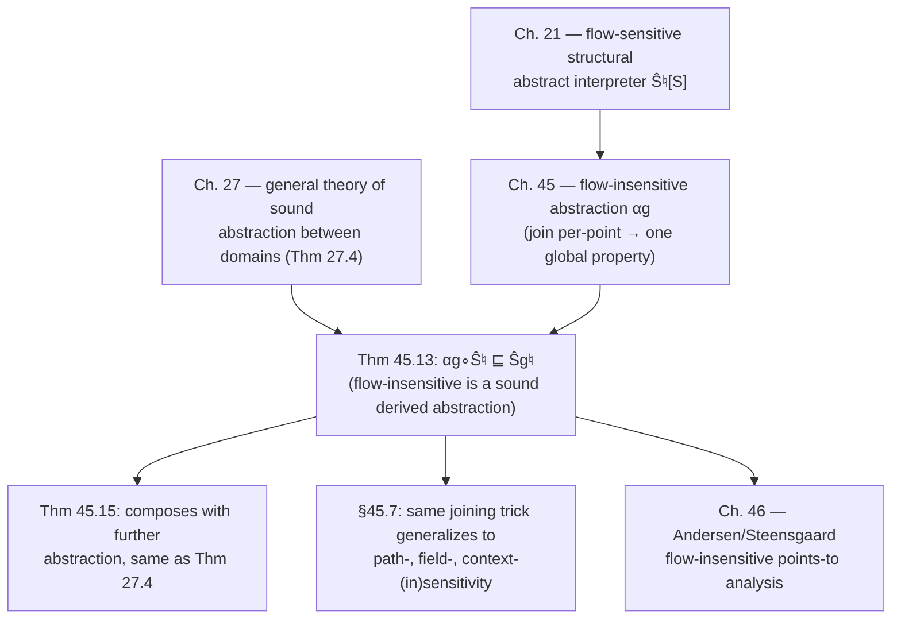

# Flow Sensitivity and Insensitivity

## The problem: per-point information is expensive to keep

Every abstract interpreter built in earlier chapters of the book (chapter 21's generic structural interpreter, in particular) is **flow-sensitive**: it computes a *different* abstract property $\hat{\mathcal{S}}^\natural[\![S]\!] \in \mathbb{P}^\natural \to (\mathsf{labx}[\![S]\!] \to \mathbb{P}^\natural)$ for every program point (every label $\ell \in \mathsf{labx}[\![S]\!]$). That's precise — the analysis knows that `x` is `1` right after `y = x;` and `2` right after the next [[Forward-Reachability-Semantics#Assignment|assignment]] — but it also means the analysis has to store and propagate one abstract value *per label*, which is where most of an analyzer's memory and iteration cost comes from.

The classic response is to stop tracking information per program point and instead maintain **one global abstract property, shared by every point in the program**. This is flow-*insensitive* analysis — the thing C compilers' symbol tables effectively do when they store "the type of `x`" once, globally, rather than "the type of `x` at this specific point in the control-flow graph."

The chapter's real contribution isn't the idea of "track one global fact instead of many local facts" — that's folklore. It's showing, by calculus, that flow-insensitive analysis is not a *different kind of analysis* you have to design and prove sound from scratch. It is **provably nothing but a further sound abstraction of the flow-sensitive interpreter**, obtained by joining all the per-point properties into one. Once you see that, flow-insensitivity slots into the same Galois-connection machinery as everything else in the book — soundness, well-definedness, and composability with still further abstractions all come for free from the general theorems, instead of needing bespoke proofs.

## 1. The abstraction: join every point into one

Fix a well-defined abstract domain $\mathbb{D}^\natural \triangleq \langle \mathbb{P}^\natural, \sqsubseteq^\natural, \bot^\natural, \sqcup^\natural, \mathsf{assign}^\natural[\![x,A]\!], \mathsf{test}^\natural[\![B]\!], \overline{\mathsf{test}}^\natural[\![B]\!]\rangle$ (definition 21.1) — this is the same domain the flow-sensitive interpreter $\hat{\mathcal{S}}^\natural$ of section 21.2 was built on.

The **flow-insensitive abstraction** $\alpha_{\mathsf g}$ takes a function assigning a property to each label and joins all of them into a single property:

$$
\alpha_{\mathsf g} \in (\mathsf{labx}[\![S]\!] \to \mathbb{P}^\natural) \to \mathbb{P}^\natural
\qquad
\alpha_{\mathsf g}(P) \triangleq \bigsqcup^\natural_{\ell \in \mathsf{labx}[\![S]\!]} P(\ell)
$$

and this lifts pointwise to interpreters — $\dot\alpha_{\mathsf g}$ turns any per-point-returning interpreter $\boldsymbol{\mathcal S}$ into a single-property-returning one by post-composing with $\alpha_{\mathsf g}$:

$$
\dot\alpha_{\mathsf g} \in (\mathbb{P}^\natural \to (\mathsf{labx}[\![S]\!]\to\mathbb{P}^\natural)) \to (\mathbb{P}^\natural\to\mathbb{P}^\natural)
\qquad
\dot\alpha_{\mathsf g}(\boldsymbol{\mathcal S}) \triangleq P \mapsto \alpha_{\mathsf g}(\boldsymbol{\mathcal S}(P))
$$

Crucially, this abstraction is a **Galois retraction**, not merely a Galois connection:

$$
\langle \mathsf{labx}[\![S]\!]\to\mathbb{P}^\natural,\ \dot\sqsubseteq^\natural\rangle \xrightleftharpoons[\alpha_{\mathsf g}]{\gamma_{\mathsf g}} \langle \mathbb{P}^\natural,\ \sqsubseteq^\natural\rangle
$$

A retraction means $\alpha_{\mathsf g} \circ \gamma_{\mathsf g} = \mathrm{id}$: if you start from a single global property, broadcast it to every point ($\gamma_{\mathsf g}$, the constant function), and then join it back down ($\alpha_{\mathsf g}$), you get exactly what you started with, no loss. The loss only happens in the other direction — collapsing genuinely different per-point information into one join necessarily forgets something (unless all points already agreed).

**What breaks without the join being *sound* (rather than, say, an intersection or an arbitrary pick):** the whole point of an abstract property is that it must safely over-approximate every concrete behavior that could occur at *any* point sharing that global slot. If you joined by intersection instead of union/join, you'd get a property that some point's actual behavior might not satisfy — unsoundness. The join is the least element that stays $\sqsupseteq^\natural$ every per-point property, i.e. the least-loss sound merge.

## 2. The structural flow-insensitive interpreter itself

Instead of deriving $\hat{\mathcal{S}}_{\mathsf g}^\natural[\![S]\!] \in \mathbb{P}^\natural \to \mathbb{P}^\natural$ by literally applying $\dot\alpha_{\mathsf g}$ to $\hat{\mathcal{S}}^\natural$ at every step (which would be correct but circuitous), the book gives it directly, structurally, on the syntax — one equation per language construct, exactly mirroring the shape of the flow-sensitive interpreter of chapter 21 but operating on a single $\overline P \in \mathbb{P}^\natural$ instead of a labeled family. The equations (45.2)–(45.11), condensed:

| Construct | Flow-insensitive semantics |
|---|---|
| Program $\mathrm{P} ::= \mathrm{Sl}\ \ell'$ | $\hat{\mathcal S}_{\mathsf g}^\natural[\![\mathrm P]\!]\,\overline P = \hat{\mathcal S}_{\mathsf g}^\natural[\![\mathrm{Sl}]\!]\,\overline P$ |
| Statement list $\mathrm{Sl} ::= \mathrm{Sl}'\,\mathrm S$ | $\hat{\mathcal S}_{\mathsf g}^\natural[\![\mathrm{Sl}]\!]\,\overline P = \hat{\mathcal S}_{\mathsf g}^\natural[\![\mathrm{Sl}']\!]\,\overline P \sqcup^\natural \hat{\mathcal S}_{\mathsf g}^\natural[\![\mathrm S]\!]\,\overline P$ |
| Empty list $\varepsilon$, skip `;`, break | $\hat{\mathcal S}_{\mathsf g}^\natural[\![\mathrm S]\!]\,\overline P = \overline P$ (identity) |
| Assignment `x = A;` | $\hat{\mathcal S}_{\mathsf g}^\natural[\![\mathrm S]\!]\,\overline P = \overline P \sqcup^\natural \mathsf{assign}^\natural[\![x,A]\!]\,\overline P$ |
| `if (B) St` | $\overline P \sqcup^\natural \hat{\mathcal S}_{\mathsf g}^\natural[\![\mathrm{St}]\!]\,(\mathsf{test}^\natural[\![B]\!]\,\overline P)$ |
| `if (B) St else Sf` | $\overline P \sqcup^\natural \hat{\mathcal S}_{\mathsf g}^\natural[\![\mathrm{St}]\!]\,(\mathsf{test}^\natural[\![B]\!]\,\overline P) \sqcup^\natural \hat{\mathcal S}_{\mathsf g}^\natural[\![\mathrm{Sf}]\!]\,(\overline{\mathsf{test}}^\natural[\![B]\!]\,\overline P)$ |
| `while ℓ (B) Sb` | $\mathrm{lfp}^{\sqsubseteq^\natural}\big(\mathcal F_{\mathsf g}^\natural[\![\text{while}\ \ell\,(B)\,\mathrm{Sb}]\!]\,\overline P\big)$, with $\mathcal F_{\mathsf g}^\natural[\![\dots]\!]\,\overline P\,X = \overline P \sqcup^\natural \hat{\mathcal S}_{\mathsf g}^\natural[\![\mathrm S]\!]\,(\mathsf{test}^\natural[\![B]\!]\,X)$ |
| Compound `{ Sl }` | $\hat{\mathcal S}_{\mathsf g}^\natural[\![\mathrm S]\!]\,\overline P = \hat{\mathcal S}_{\mathsf g}^\natural[\![\mathrm{Sl}]\!]\,\overline P$ |

**The one detail that actually matters, and is easy to miss:** look at the assignment rule again. It's $\overline P \sqcup^\natural \mathsf{assign}^\natural[\![x,A]\!]\,\overline P$ — a *join with the old global state*, not a replacement of it. In the flow-sensitive semantics, the property *at the point right after* the assignment simply *is* $\mathsf{assign}^\natural[\![x,A]\!]$ applied to the property *at the point right before* — a clean overwrite, because "before" and "after" are different points. In the flow-insensitive semantics there is only one point, shared by the whole program, so the new contribution has nowhere to go except to be joined into everything that was already known to hold "somewhere." This is exactly *why* flow-insensitive analysis loses precision, made completely explicit at the level of the transfer function rather than left as a vague intuition.

**What breaks without flow order — a worked example.** Consider:

```c
x = 1;
y = x;   // (only ever reaches here with x = 1)
x = 2;
z = x;   // (only ever reaches here with x = 2)
```

A flow-sensitive interval analysis correctly infers $y \in [1,1]$ and $z \in [2,2]$, because it tracks a separate property before/after each statement and the assignment rule *overwrites*. A flow-insensitive analysis over the same domain computes one global property for `x`: by the rule above, the global state accumulates $\{1\} \sqcup \{2\} = [1,2]$ (both assignments join into the same slot), and *every* read of `x` — including `y = x` and `z = x` — sees $x \in [1,2]$. The analysis has soundly, but uselessly, forgotten which assignment happened first.

## 3. Soundness: flow-insensitive is a *derived*, not an independent, analysis

**Theorem 45.13.** $\dot\alpha_{\mathsf g}\big(\hat{\mathcal S}^\natural[\![S]\!]\big) \sqsubseteq^\natural \hat{\mathcal S}_{\mathsf g}^\natural[\![S]\!]$.

In words: if you run the *flow-sensitive* interpreter and then join all its per-point results together after the fact, you get something that is *at least as precise as* (below, in the approximation order) running the structural flow-insensitive interpreter directly. The two coincide up to soundness — the structural definition of §2 is a faithful, calculationally-derived shortcut for "run flow-sensitive, then join," not a separately-invented algorithm that happens to resemble it.

The proof is by structural calculational design, the same pattern used for theorem 27.4 (general abstraction soundness) elsewhere in the book. Two representative cases:

- **Assignment.** Unfolding definitions: $\dot\alpha_{\mathsf g}(\hat{\mathcal S}^\natural[\![x{=}A;]\!])\,\overline P = \alpha_{\mathsf g}\big([\ell{=}\mathsf{at}[\![S]\!] \mathrel{?} \overline P \mathrel{[\!]} \ell{=}\mathsf{after}[\![S]\!] \mathrel{?} \mathsf{assign}^\natural[\![x,A]\!]\,\overline P \mathrel{:} \bot^\natural]\big) = \overline P \sqcup^\natural \mathsf{assign}^\natural[\![x,A]\!]\,\overline P$, which is *exactly* (45.5) — the flow-sensitive-then-join route and the direct structural rule agree exactly (equality, not just $\sqsubseteq$) for this construct, because $\mathsf{labx}[\![S]\!]$ has only the two points `at` and `after`.
- **Iteration.** The `while` case needs corollary 18.16 (fixpoint approximation): you must exhibit a transformer $\mathcal F_{\mathsf g}^\natural[\![\text{while}\dots]\!]\,\overline P$ that *semicommutes* with the flow-sensitive loop transformer $\mathcal F^\natural[\![\text{while}\dots]\!]\,\overline P$ under $\alpha_{\mathsf g}$ — i.e. $\alpha_{\mathsf g}(\mathcal F^\natural\,\overline P\,X) \sqsubseteq^\natural \mathcal F_{\mathsf g}^\natural\,\overline P\,\alpha_{\mathsf g}(X)$. The book grinds this out explicitly: unfolding $\alpha_{\mathsf g}$ over the three flavors of label in $\mathsf{labx}[\![S_b]\!]$ (loop head, interior points, break-targets) and using $\mathsf{labx}[\![S_b]\!] = \mathsf{in}[\![S_b]\!]\cup\{\ell\}$, several terms collapse and cancel, leaving exactly $\overline P \sqcup^\natural \alpha_{\mathsf g}\big(\hat{\mathcal S}^\natural[\![S_b]\!]\,(\mathsf{test}^\natural[\![B]\!]\,X(\ell))\big) \sqsubseteq^\natural \overline P \sqcup^\natural \hat{\mathcal S}_{\mathsf g}^\natural[\![S_b]\!]\,(\mathsf{test}^\natural[\![B]\!]\,\alpha_{\mathsf g}(X))$ — inequality this time (not equality), because joining *before* propagating around the loop body can only lose precision relative to joining *after*. Corollary 18.16 then lifts this one-step semicommutation to full soundness of the least fixpoints.

**Theorem 45.14 (well-definedness)** and **Theorem 45.15 (soundness under further abstraction)** are, by contrast, nearly free. Well-definedness ($\hat{\mathcal S}_{\mathsf g}^\natural$ is itself a legitimate instance of definition 21.1's well-definedness conditions) follows by plain structural induction. And soundness composes: if $\mathbb{D}^\sharp$ is a further approximate abstraction of $\mathbb{D}^\natural$ (definition 27.1-I — the general "an abstract domain can itself be abstracted again" machinery from earlier in the book), then

$$
\hat{\mathcal S}_{\mathsf g}^\natural[\![S]\!]\big(\gamma(\overline P)\big) \;\dot{\sqsubseteq}^\natural\; \gamma\big(\hat{\mathcal S}_{\mathsf g}^\sharp[\![S]\!](\overline P)\big)
$$

exactly mirroring theorem 27.4's general result. This is the payoff of treating flow-insensitivity as *just another abstraction in the lattice of abstractions*: it automatically inherits "you can abstract further and it's still sound," the same guarantee every other abstraction in the book gets, with no bespoke proof needed.

## 4. Rust, Lean, Python grounding

**Rust — the crucial `join` vs. `overwrite` distinction, made structural.** This is the cleanest place to see why flow-sensitivity is a *design decision in the transfer function*, not a property of the abstract domain itself:

```rust
use std::collections::HashMap;

#[derive(Clone, Copy, PartialEq, Eq, Debug)]
struct Interval { lo: i64, hi: i64 }

impl Interval {
    fn join(self, other: Interval) -> Interval {
        Interval { lo: self.lo.min(other.lo), hi: self.hi.max(other.hi) }
    }
}

type Label = usize;
type AbstractState = HashMap<String, Interval>;

// Flow-sensitive: one state PER program point. Assignment *replaces*
// the entry for `x` at the successor point.
fn assign_flow_sensitive(
    states: &mut HashMap<Label, AbstractState>,
    before: Label,
    after: Label,
    var: &str,
    value: Interval,
) {
    let mut next = states[&before].clone();
    next.insert(var.to_string(), value); // overwrite
    states.insert(after, next);
}

// Flow-insensitive: ONE state for the whole program. Assignment
// *joins* into whatever was already recorded for `x` anywhere else.
fn assign_flow_insensitive(global: &mut AbstractState, var: &str, value: Interval) {
    global
        .entry(var.to_string())
        .and_modify(|old| *old = old.join(value)) // join, per eq. (45.5)
        .or_insert(value);
}
```

The type signature alone tells the story the chapter is making calculationally: `HashMap<Label, AbstractState>` vs. a single `AbstractState` is exactly the $\mathsf{labx}[\![S]\!] \to \mathbb{P}^\natural$ vs. $\mathbb{P}^\natural$ distinction of $\alpha_{\mathsf g}$'s domain and codomain, and `and_modify(|old| *old = old.join(value))` vs. plain `insert` is exactly $\overline P \sqcup^\natural \mathsf{assign}^\natural[\![x,A]\!]\,\overline P$ vs. a flow-sensitive overwrite.

**Lean — the retraction as a structure, tying into Galois-connection machinery you'll reuse for domain abstraction generally.** The $\alpha_{\mathsf g}\dashv\gamma_{\mathsf g}$ retraction is a specialization of the general Galois-connection pattern this book uses everywhere (and that shows up again, structurally identically, whenever you build an abstract domain for a verifier: soundness of an interval or points-to domain is *always* "does my join/abstraction map form a retraction/connection with the concrete semantics"):

```lean
structure GaloisRetraction (C : Type) (A : Type) [Lattice C] [Lattice A] where
  α : C → A
  γ : A → C
  monotone_α : Monotone α
  monotone_γ : Monotone γ
  retraction  : ∀ a : A, α (γ a) = a          -- α ∘ γ = id : no loss going A → C → A
  galois      : ∀ c a, α c ≤ a ↔ c ≤ γ a       -- the connection itself

-- Instantiated at C := (Label → P), A := P, with γ_g the constant broadcast
-- and α_g the join over all labels — (45.1)'s ⟨labx[S] → P♮, ⊑̇♮⟩ ⇄ ⟨P♮, ⊑♮⟩.
```

The `retraction` field is the reason the book calls this specifically a *Galois retraction* rather than a plain Galois connection: it's the formal statement that "broadcast a global fact to every point, then re-join it, changes nothing" — a strictly stronger guarantee than a general Galois connection gives you, and worth encoding as its own obligation if your own domain framework ever needs to distinguish the two (e.g. when deciding whether a widening operator that discards per-point context is safe to iterate).

**Python — a five-line sketch of the precision gap itself**, reusing the worked example from §2:

```python
# flow-sensitive: state is a dict PER point; assignment overwrites.
# flow-insensitive: state is ONE dict; assignment joins (here: set union).
def join(a, b): return a | b

fi_x = set()
for value in ({1}, {2}):           # two assignments to x, in program order
    fi_x = join(fi_x, value)       # (45.5): x_global = x_global ⊔ {value}
# fi_x == {1, 2} at every read site — precision lost relative to
# the flow-sensitive reading of {1} then {2} at their respective points.
```

## 5. Beyond flow: the same trick, other axes

Section 45.7 generalizes the pattern explicitly: flow-(in)sensitivity is one instance of a much more general move — *joining away a dimension of context you'd otherwise keep separate*:

- **Path-(in)sensitivity** joins per-*path* properties into the flow-sensitive per-*point* properties already used everywhere else in the book (this is literally how the reachability semantics of chapter 19 is built).
- **Field-(in)sensitivity** joins the properties attached to each field of a data structure into one property for the whole structure.
- **Context-(in)sensitivity** joins the preconditions from every call site of a procedure into a single, call-site-independent precondition.

Every one of these is "take a more refined index set (paths, fields, call contexts), and abstract it away by joining" — the exact same $\alpha_{\mathsf g}$-shaped move, just choosing a different thing to quotient over. Once you've internalized the flow case's calculational pattern (structural definition + theorem-27.4-style soundness + free well-definedness and further-abstraction), you get all three of these "for free" by analogy rather than needing four separate theories.

## 6. The chapter's actual verdict: is this trade-off worth it?

The chapter closes by pushing back on flow-insensitivity's usual justification. The argument for it is "keeping information at every program point is expensive." Cousot's counter: **in a structural (fixpoint-based) analysis, you never needed to keep information at every point anyway.** You only need to *store* information at loop heads (to test fixpoint convergence and drive extrapolation/interpolation widenings); everywhere else, one more pass of forward propagation after convergence hands you the pertinent information at any point you actually want it, on demand. This is precisely the approach taken in the Astrée analyzer. So the memory savings flow-insensitivity is supposed to buy you are largely illusory against a well-implemented structural analysis — what you actually lose is precision (the worked example in §2) and sometimes even *convergence speed*, since fixpoints computed over one shared global lattice slot have to climb higher before stabilizing than fixpoints computed independently per point.

## Where this leads



This chapter is the load-bearing template for chapter 46's points-to analyses: Andersen's flow-insensitive analysis and Steensgaard's (further widened) variant are both derived exactly this way — not postulated constraint-solving algorithms, but instances of $\hat{\mathcal S}_{\mathsf g}^\natural$ composed with the Cartesian/reachability abstraction, sound by the same theorem-45.13/45.15 machinery rather than by a separate proof.

For the standing project threads: this is a direct worked example of the **Galois connection / abstract lattice** thread — specifically the *retraction* special case, worth remembering the next time a domain design needs to decide whether discarding context (a call stack, a path condition, a per-field slot) is safe to do via an idempotent join rather than an arbitrary heuristic merge. It's less directly about SMT/Hoare-triple checking, but the underlying discipline — "before you invent a new analysis, ask whether it's really just an existing sound semantics composed with a joining abstraction" — is exactly the move you'd want when deciding, say, whether a context-insensitive summary for a called procedure's contract is a sound over-approximation of its context-sensitive one.

---
[[book-guidelines|↩ Back to guidelines]]
