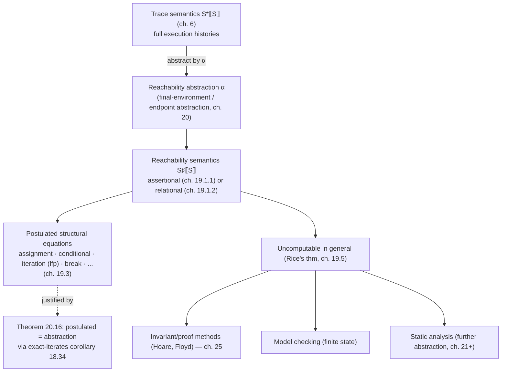

# Forward Reachability Semantics

[[book-guidelines|↩ Back to guidelines]]

## The problem: traces know too much

The trace semantics built in earlier chapters ($\mathcal{S}^*\llbracket S \rrbracket$, $\mathcal{S}^{+\infty}\llbracket S \rrbracket$) records *everything*: the exact sequence of program points visited, in order, with every intermediate action. That is precise, but it is precise about the wrong thing for most purposes. If you want to prove a program never divides by zero, or that an array index stays in bounds, you don't care about the *order* in which states occur or how many times a loop spun — you care about *which states are ever reachable at a given program point*, full stop.

This is the same move the book has been making since chapter 8: take the maximal, most-informative semantics, and abstract away the information a given question doesn't need. Here the question is "what environments (variable-value assignments) can exist when control reaches label $\ell$, no matter which execution got it there, and no matter what happens afterward?" The answer is the **forward reachability semantics** — an *invariant* of the program at each program point, and, not coincidentally, exactly the object underlying Floyd/Hoare/Naur-style proof methods (assertions at program points) and model checking.

Two chapters build this idea. Chapter 19 *postulates* the reachability semantics directly, construct by construct, the way an engineer might just write it down. Chapter 20 goes back and proves that this postulated definition is not an arbitrary design choice but the unique, exact result of abstracting the prefix trace semantics via a Galois connection — the calculational design promised since chapter 3. Presenting the definition first and the derivation second is a deliberate pedagogical choice by Cousot: understand the "what" before the "why."

## What breaks without reachability semantics

If all you have is the trace semantics, proving "$x \geq 0$ always holds at label $\ell_3$" requires reasoning about the (possibly infinite) set of *all* traces reaching $\ell_3$ — sequences of configurations, not just states. Any proof method built directly on traces has to wade through that irrelevant sequencing information every time. Reachability semantics factors that work out once: it *is* the collecting semantics restricted to "which states occur here," so any later proof method (Hoare logic, invariant checking) gets to work purely with sets/relations of environments, never with traces again. This is why chapter 19's conclusion calls it "the most abstract of the abstract semantics that are precise enough to express reachability/invariance properties" — anything less abstract wastes effort, anything more abstract loses information the proof methods need.

## Assertional vs. relational reachability

The book gives two flavors of the same idea, unified later by a parameter $\sharp \in \{\flat, \natural\}$.

**Assertional reachability semantics.** Given a set $\mathcal{P}_0$ of initial environments, the assertional semantics
$$
\mathcal{S}^\flat\llbracket S \rrbracket \in \wp(\mathrm{Ev}) \to (\mathbb{L} \to \wp(\mathrm{Ev}))
$$
maps $\mathcal{P}_0$ to, for each label $\ell$ in the statement, the *set of environments* that can be observed there. This is what you'd write as a "local invariant" comment at a program point — the plain, ordinary meaning of "what can $x$ be here." For the running example $P = \mathtt{while}^{\ell_1}(x<10)\ \ell_2\ x = x+1\,;\ \ell_3$ starting from $x=0$: at $\ell_1$, $0 \le x \le 10$; at $\ell_2$, $0 \le x < 10$; at $\ell_3$, $x = 10$.

**Relational reachability semantics.** The variant $\mathcal{S}^\natural\llbracket S \rrbracket \in \wp(\mathrm{Ev} \times \mathrm{Ev}) \to (\mathbb{L} \to \wp(\mathrm{Ev} \times \mathrm{Ev}))$ instead relates the *current* environment at $\ell$ to the *initial* environment $\rho_0$ the execution started with. For the same loop, starting from an unspecified initial value $x_0$: at $\ell_1$, $(10 \le x_0 = x) \lor (x_0 \le x \le 10)$; at $\ell_2$, $x_0 \le x < 10$; at $\ell_3$, $(10 \le x_0 = x) \lor (x_0 < 10 \land x = 10)$.

The relational version is strictly more informative — you can always recover the assertional version from it by forgetting the initial-environment coordinate — and, per Remark 19.4, it can even be *simulated* by the assertional semantics on a rewritten program that introduces an explicit auxiliary variable $x_0 \leftarrow x$ before the loop. This is a general trick worth internalizing: relational reasoning about "before vs. after" can always be encoded as plain reachability if you're willing to duplicate state into fresh ghost variables. This is precisely the technique a Hoare-triple-checking verifier uses to reason about postconditions in terms of preconditions — introduce `old(x)` bindings, then it's just an assertional invariant problem.

Cousot writes both together as $\mathcal{S}^\sharp\llbracket S \rrbracket$, letting $\sharp$ range over $\flat$/$\natural$ so that every equation below states one law that specializes to both readings — a small notational discipline worth copying whenever two constructions differ only in "with or without the initial-state coordinate."

**Rust grounding.** This maps directly onto how you'd represent invariant sets in a verifier:

```rust
// Assertional: a map from program point to the set of reachable environments.
// In practice this is a *symbolic* predicate over variables, not a literal set.
struct Assertional {
    reachable: HashMap<Label, Predicate>, // Predicate over Env
}

// Relational: predicate over (initial_env, current_env) pairs, keyed by label.
struct Relational {
    reachable: HashMap<Label, Predicate>, // Predicate over (Env, Env)
}
```

A real verifier almost always keeps the relational form (or its ghost-variable-encoded assertional equivalent) precisely because postconditions are naturally stated relative to preconditions ("the array is sorted *and* is a permutation of its input").

## Reachability of assignments, conditionals, and iterations

### Assignment

First the plumbing: environment update $\rho[x \leftarrow v]$ sets $x$ to $v$ and leaves every other variable as $\rho$ had it. For $S ::= x = A\,;$ with entry label $\ell_1$ and exit label $\ell_2$, the reachability semantics is simple and total: the entry environments pass through unchanged to $\ell_1$, and the exit environments at $\ell_2$ are those entry environments updated by evaluating $A$:
$$
\mathcal{S}^\sharp\llbracket x = A\,; \rrbracket \mathcal{P}_0\, \ell =
\begin{cases}
\mathcal{P}_0 & \text{if } \ell = \mathrm{at}\llbracket S \rrbracket \\
\{\rho[x \leftarrow \mathcal{A}\llbracket A \rrbracket \rho] \mid \rho \in \mathcal{P}_0\} & \text{if } \ell = \mathrm{after}\llbracket S \rrbracket \\
\emptyset & \text{otherwise}
\end{cases}
$$
No fixpoints needed — this is a one-shot structural transformer. In elaborator/typechecker terms, this is exactly the shape of a substitution step: apply the update, propagate forward, done.

### Iteration — where the real content is

The reachability of `while` is the first genuinely interesting case, because "reachable after the loop" is not a syntactic function of "reachable before the loop" — it depends on *how many times* the loop might run, which is unbounded. Chapter 19 builds [[Convergence-Acceleration-by-Widening-and-Narrowing#The intuition|the intuition]] by hand on the running example before stating the general law.

Let $X_n$ be the values of $x$ reachable at $\ell_1$ after *at most* $n$ iterations. Then $X_0 = \{0\}$ (just the initial value, before any iteration completes), and inductively
$$
X_{n+1} = X_0 \cup \{v+1 \mid v \in X_n \land v < 10\}.
$$
This is a **Kleene iteration**: start from the empty approximation (or, here, from the base case $X_0$), repeatedly apply "take what you had, plus one more step through the loop body from states that pass the guard," and the sequence $X_0 \subseteq X_1 \subseteq X_2 \subseteq \cdots$ increases monotonically. Concretely $X_1 = \{0,1\}$, …, $X_{10} = \{0,\dots,9\}$, and from $X_{11}$ onward the set stabilizes at $\{0,\dots,10\}$ — the loop terminates, so the chain becomes stationary and its limit *is* its least fixpoint.

The general law, for $S ::= \mathtt{while}^\ell(B)\ S_b$:
$$
\mathcal{S}^\sharp\llbracket \mathtt{while}^\ell(B)\ S_b \rrbracket \mathcal{P}_0 = \mathrm{lfp}^{\subseteq} F, \qquad
F(X) \triangleq \lambda \ell'.\ \begin{cases}
\mathcal{P}_0 \cup \mathcal{S}^\sharp\llbracket S_b \rrbracket(\mathrm{test}\llbracket B \rrbracket X(\ell))(\ell') & \ell' = \ell \\
\mathcal{S}^\sharp\llbracket S_b \rrbracket(\mathrm{test}\llbracket B \rrbracket X(\ell))(\ell') & \ell' \in \mathrm{in}\llbracket S_b \rrbracket \\
(\mathrm{test}\llbracket \neg B \rrbracket X(\ell)) \cup (\text{break environments}) & \ell' = \mathrm{after}\llbracket S \rrbracket
\end{cases}
$$
Read as prose: *the reachable environments at the loop entry are the initial environments, or the environments reached after one more pass through the body starting from a state that passed the test; the reachable environments after the loop are those that fail the test, or that reach a* `break` *from within the body.* $F$ is applied to a family $X$ indexed by every label in the loop simultaneously (loop entry, every point inside the body, loop exit) — the fixpoint is computed on the whole vector at once, not label-by-label.

Theorem 19.36 is the structural fact that makes all of this well-behaved: **the reachability transformer of every program construct preserves arbitrary joins** — $\mathcal{S}^\sharp\llbracket S \rrbracket(\bigcup_i P_i) = \bigcup_i \mathcal{S}^\sharp\llbracket S \rrbracket(P_i)$ — proved by structural induction, checking assignment, conditional, break, and iteration each in turn (the iteration case reduces to a Scott–Kleene argument that pointwise joins of iterate sequences commute with the least-fixpoint construction). Join-preservation is exactly what licenses computing the loop's reachability as a Kleene iteration in the first place, and — as the learning-goals thread on Galois connections would emphasize — it is also precisely the property a lower adjoint of a Galois connection must have (Lemma 11.38): the reachability transformer *is* a lower adjoint, which is what chapter 20 exploits.

**What breaks without join-preservation.** If the reachability transformer of the loop body didn't distribute over unions, you could not decompose "reachable states after $n{+}1$ iterations" into "reachable after $n$ iterations, unioned with one more step from each of those states individually." You'd be forced to treat the whole growing state space as one atomic blob every iteration, which is both computationally worse and — more importantly — it's what would make the Kleene-iteration argument (and hence Scott–Kleene's fixpoint theorem, chapter 15) inapplicable, since that theorem needs exactly this kind of monotone, join-compatible transformer.

### Conditionals, sequencing, break, skip, compound — the rest of the structural recursion

The remaining constructs are compositional and don't need fixpoints:

- **Conditional (no else), $S ::= \mathtt{if}(B)\ S_t$:** reachable environments *inside* $S_t$ are those of the entry environments that pass the test, fed through $S_t$'s own reachability semantics; reachable environments *after* the conditional are the union of ($S_t$'s exit environments) and (entry environments that failed the test, since the conditional is skipped).
- **Conditional with else, $S ::= \mathtt{if}(B)\ S_t\ \mathtt{else}\ S_f$:** symmetric — $S_t$ gets the test-true entries, $S_f$ gets the test-false entries, and the exit is the union of both branches' exits. No "skip" case, since one branch always executes.
- **Statement list, $S\!\ell ::= S\!\ell' \; S$:** the reachable environments of the whole list are those reachable in the prefix $S\!\ell'$, together with those reachable in $S$ once fed the exit environments of $S\!\ell'$ — ordinary sequential composition of transformers, glued at the shared label $\mathrm{after}\llbracket S\!\ell' \rrbracket = \mathrm{at}\llbracket S \rrbracket$.
- **Empty list / skip:** both are identity transformers — the reachable environments equal the initial environments, unchanged.
- **`break`:** control jumps to $\mathrm{break\text{-}to}\llbracket S \rrbracket$, so *no* label inside or after the break statement itself is reachable from it (the break's contribution shows up instead in the enclosing loop's exit case, as seen above).
- **Compound $\{S\!\ell\}$:** reachability of the block is just that of its statement list.

This is a textbook example of *structural/denotational* definition (chapter 3's method, generalized): one equation per grammar production, each equation referring only to the reachability semantics of immediate syntactic subcomponents — everything except iteration is compositional in the strictest sense.

```rust
// A structural interpreter sketch: reachability by recursion on the AST.
// Env = symbolic/abstract representation of variable bindings; in a real
// verifier this would carry a predicate, not a literal HashSet.
fn reachable(stmt: &Stmt, entry: EnvSet) -> HashMap<Label, EnvSet> {
    match stmt {
        Stmt::Assign { x, expr, at, after } => {
            let mut m = HashMap::new();
            m.insert(*at, entry.clone());
            m.insert(*after, entry.iter().map(|rho| rho.update(x, eval(expr, rho))).collect());
            m
        }
        Stmt::If { cond, then_branch, at, after } => {
            let (t, f) = entry.partition(|rho| eval_bool(cond, rho));
            let mut m = reachable(then_branch, t);
            m.entry(*after).or_default().extend(f); // union with test-false skip case
            m
        }
        Stmt::While { cond, body, at, after } => {
            // Kleene iteration: repeatedly apply F until the map stops growing.
            let mut x: HashMap<Label, EnvSet> = HashMap::new();
            loop {
                let next = step_while(cond, body, &entry, &x, *at, *after);
                if next == x { break; }
                x = next;
            }
            x
        }
        // Seq, Skip, Break, Block cases follow the same structural recursion.
        _ => unimplemented!(),
    }
}
```

The `while` branch is the only place a genuine fixpoint loop appears — the rest of the interpreter is a direct structural walk, exactly mirroring the equations above.

## Uncomputability of the reachability semantics

Section 19.5 states plainly what Rice's theorem (chapter 9) already forces: *exact* reachability is, in general, **uncomputable**. Reachability is a nontrivial, extensional semantic property of programs (it distinguishes some programs from others based purely on behavior, and it's neither always-true nor always-false), so Rice's theorem applies directly — no algorithm can decide, for every program and every label, exactly which environments are reachable there.

This is not a defect to be engineered around eventually; it is a hard limit, and the book is explicit that any workaround must fail on infinitely many programs (Corollary 9.6). Three lesser-evil strategies are named:

1. **Restrict to a finite state space** (e.g., only Boolean variables, or a bounded $\mathbb{V}$) so $\wp(\mathrm{Ev})$ has finite computer representations and the fixpoint can actually be iterated to termination. This is exactly what **model checking** does — enumerative or symbolic — and its Achilles' heel is state explosion, visible even on trivial examples.
2. **Ask the programmer for the invariant** (or an inductive over-approximation of it) and *check* it with a proof method (chapter 25) — a theorem prover or proof assistant verifies the human-supplied guess rather than computing it from scratch. This is the Floyd/Hoare paradigm, and it's exactly the shape of Hoare-triple verification: the invariant is a specification input, not a derived output.
3. **Abstract the semantics** (the subject of the rest of the book from chapter 21 onward) — replace exact reachability with a sound over-approximation in a simpler abstract domain, computable by construction. This is static analysis.

For the compiler/verifier project this article's learning goals target, this is the load-bearing fork in the road: option 2 (inductive-invariant-plus-proof-checking) is the direct ancestor of a Hoare-triple checker that trusts a user-supplied loop invariant and discharges verification conditions; option 3 (abstraction) is the direct ancestor of an automated static analyzer that infers something weaker but computable. Both descend from the same uncomputable ideal object defined in this chapter.

## Sound, complete, and exact structural abstract semantics

Section 19.6 gives vocabulary the rest of the book (and any project grounded in it) needs constantly. Given a structural (concrete) semantics $\mathcal{S}\llbracket S \rrbracket$ and a candidate structural *abstract* semantics $\dot{\mathcal{S}}\llbracket S \rrbracket$ obtained by replacing every concrete domain with an abstract one and every concrete operation with an abstract counterpart:

- **Sound**: $\forall S.\ \mathcal{S}\llbracket S \rrbracket \sqsubseteq \dot{\mathcal{S}}\llbracket S \rrbracket$ — the abstract semantics never under-claims; every concrete behavior is covered (in the reachability instance, $\sqsubseteq$ is set inclusion, so soundness means the abstract analysis over-approximates: it may claim reachability of states that are not actually reachable, but never misses a genuinely reachable one).
- **Complete**: the reverse inequality — the abstract semantics never over-claims.
- **Exact**: both at once, i.e., equality — the abstract semantics captures the concrete truth precisely, with no information loss from the abstraction step.

The reachability semantics of chapter 19 is *exact* with respect to the trace semantics (proved as Theorem 20.16 in chapter 20) — it loses no invariance-relevant information, it just discards trace-ordering information that invariance properties never needed in the first place. Contrast this with the sign semantics of chapter 3: $\mathcal{S}_\pm\llbracket 2-1 \rrbracket = \alpha_\pm(\{1\}) = ({>}0)$, but computing sign-by-sign, $\pm\llbracket 2 \rrbracket - \pm\llbracket 1 \rrbracket = ({>}0) - ({>}0) = \top_\pm$ — a strictly weaker answer, because subtracting two positive signs abstractly can't rule out zero or negative results. The sign semantics is sound but *not* exact: it necessarily throws away information the exact computation had.

This distinction matters a great deal for a verifier: an exact structural abstraction can be trusted to prove *and* refute a claim; a merely sound one can only ever be trusted to prove one direction (over-approximate reachability rules out unreachability claims, but a reported "possibly reachable" alarm may be a false positive).

## Calculational design: deriving reachability from trace semantics

Chapter 19's equations were *postulated* — plausible, matching hand-worked examples, but not derived from anything. Chapter 20 closes that gap by doing what chapter 3 first demonstrated on expressions: define the reachability semantics as an explicit **abstraction** ($\alpha$) of the prefix trace semantics $\mathcal{S}^*\llbracket S \rrbracket$ from chapter 6, then *calculate* — not guess — the structural equations from that abstraction, proving Theorem 20.16: the postulated $\mathcal{S}^\sharp\llbracket S \rrbracket$ of chapter 19 equals the reachability abstraction of $\mathcal{S}^*\llbracket S \rrbracket$.

**The assertional abstraction.** Given the prefix trace semantics $\mathcal{S}^*\llbracket S \rrbracket$ and initial environments $\mathcal{P}_0$, the assertional reachability abstraction collects, at each label $\ell$, the final environment $\varrho(\pi)$ of every trace $\pi$ ending at $\ell$ whose initial environment satisfies $\mathcal{P}_0$:
$$
\mathcal{S}^\flat\llbracket S \rrbracket \mathcal{P}_0\, \ell \triangleq \{\varrho(\pi_0\ell_0\pi_1\ell) \mid \pi_0\ell_0\pi_1\ell \in \mathcal{S}^*\llbracket S \rrbracket(\pi_0\ell_0) \wedge \varrho(\pi_0\ell_0) \in \mathcal{P}_0\}.
$$
This is precisely the abstraction $\alpha_\varrho$ that forgets everything about a trace except its endpoint — an instance of the general "final-value abstraction" pattern (Remark 20.8 identifies it as a homomorphic/partitioning abstraction in the sense of chapter 11's Galois-connection composition machinery, obtained by composing the endpoint-extraction abstraction with pointwise extension over all labels via Theorem 11.78). **The relational abstraction** is the same idea without discarding the initial environment — it collects $\langle \rho_0, \varrho(\pi) \rangle$ pairs instead of bare $\varrho(\pi)$ — and Definition 20.12/Exercise 20.13 show the assertional semantics is recoverable as a further abstraction of the relational one (forgetting the initial-environment coordinate), matching the informal claim in chapter 19 that the relational form is strictly more informative.

**Why the assertional form is exact.** Because the label-indexed final-environment abstraction preserves *arbitrary* unions and is a straightforward image/homomorphism-style map, it composes cleanly with the trace semantics' own structural (union-of-cases) equations — there is no lossy squeeze anywhere in the composition, which is exactly what makes the abstraction exact rather than merely sound.

**The construct-by-construct derivation.** With the abstraction fixed, Theorem 20.16 is proved the same way every calculational-design result in this book is proved: structural induction on $S$, checking that $\alpha$ applied to the trace-semantics equation for each construct *equals* (not just bounds) the corresponding postulated equation from chapter 19 — program, statement list, empty list, skip, assignment, conditional (both forms), break, compound, and iteration, each addressed in turn.

The interesting case is iteration, and it's where the machinery from earlier chapters pays for itself. The trace semantics of a loop is itself given as a least fixpoint (chapter 17, section 17.1). To show that *abstracting a fixpoint* equals *the fixpoint of the abstracted transformer* — i.e., that $\alpha(\mathrm{lfp}\, F) = \mathrm{lfp}\, \dot F$ rather than merely $\alpha(\mathrm{lfp}\, F) \sqsubseteq \mathrm{lfp}\, \dot F$ — you need more than an arbitrary Galois connection; you need the **exact iterates abstraction** result, Corollary 18.34 from the fixpoint-abstraction chapter, which gives sufficient conditions (essentially: the abstraction commutes with the transformer at every Kleene iterate, not just in the limit) for a [[Fixpoint-Abstraction|fixpoint abstraction]] to be exact rather than merely sound. This is the calculational-design payoff in miniature: chapter 18 built exactly the tool chapter 20 needed, and using it here is what upgrades "the reachability semantics of a loop is *a* sound over-approximation of its trace semantics" to "the reachability semantics of a loop is *the* precise reachability content of its trace semantics, nothing more, nothing less."

```rust
// The shape of the exactness argument, stated as a commutation obligation:
//   alpha(lfp(concrete_transformer)) == lfp(abstract_transformer)
// which corollary 18.34 licenses when `alpha` commutes with the transformer
// at every finite iterate (not just at the fixpoint itself).
trait ExactFixpointAbstraction<Concrete, Abstract> {
    fn alpha(c: &Concrete) -> Abstract;
    fn concrete_step(prev: &Concrete) -> Concrete;
    fn abstract_step(prev: &Abstract) -> Abstract;
    // Obligation: alpha(concrete_step(c)) == abstract_step(alpha(c)) for all c
    // reachable as a Kleene iterate — proved once, reused for every loop.
}
```

This is the same commutation discipline a Rust verifier would need to prove once and for all when it replaces a general fixpoint solver with a specialized abstract-domain solver: show the abstraction commutes step-by-step with the concrete iteration, and exactness (or at least soundness) of the final answer follows for free, without re-proving anything per-program.

## Structure at a glance



## Where this leads

The reachability semantics is exact but uncomputable — that tension *is* the organizing problem for the rest of the book. Chapter 21 generalizes the pattern seen here (a poset of properties, joins, and per-construct primitive operations `assign`/`test`/`test-negation`) into the **generic abstract interpreter**, parameterized by an arbitrary abstract domain — with the reachability semantics itself recovered as one particular (exact, but infinitary) instance, per Corollary 21.17. Chapters 24–26 build the invariant/inductive-invariant proof methods (Hoare logic, Floyd-style verification conditions) directly on top of the assertional reachability semantics defined here. And the finitary abstract domains of the rest of Part IV (signs, intervals, congruences, zones, points-to, dependency, types) are all instances of "option 3" from section 19.5 — sound-but-not-exact approximations of exactly this uncomputable object, purpose-built so that the resulting fixpoint computation actually terminates.

For the compiler/verifier and elaborator projects this note is written against: this chapter is the precise dividing line between the two implementation strategies available to a verification tool. A checker that trusts programmer-supplied loop invariants and discharges verification conditions (option 2) is implementing Hoare logic on top of the assertional reachability semantics defined here — directly, with no further abstraction. A checker that infers invariants automatically (option 3) is implementing an instance of [[The-Generic-Abstract-Interpreter|the generic abstract interpreter]] of chapter 21, trading exactness for computability by construction. Both are answers to the same uncomputable question this chapter poses and precisely characterizes.
