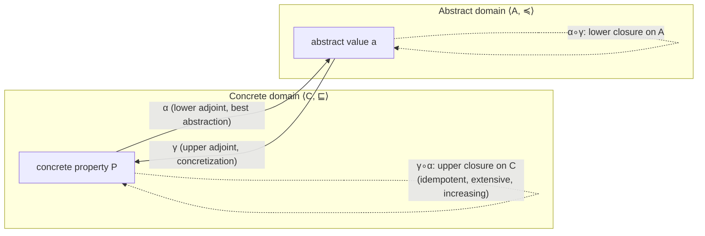

# Galois Connections and Abstraction

[[book-guidelines|↩ Back to guidelines]]

## Why you need more than a concretization function

Every abstract interpretation starts the same way: you have some concrete space of properties ($\mathcal{C}$, ordered by implication $\sqsubseteq$), you invent an abstract space ($\mathcal{A}$, ordered by $\preccurlyeq$) that's cheaper to compute with, and you need a way to move between them. The move from abstract to concrete — "what does this abstract fact actually claim about the concrete world?" — is easy to state: a **concretization function** $\gamma \in \mathcal{A} \to \mathcal{C}$. Given an abstract value $a$, $\gamma(a)$ tells you the concrete property it stands for.

The move the other way is where things get dangerous. Given a concrete property $P$, what abstract value should represent it? You could pick *any* $a$ such that $P \sqsubseteq \gamma(a)$ — that's what it means for $a$ to be a **sound** overapproximation. But "any sound $a$" is a design smell. Consider the concrete property $\{0\} \subseteq \mathbb{Z}$ abstracted into the sign domain $\mathbb{P}_\pm = \{\bot_\pm, {<}0, {=}0, {>}0, {\le}0, {\ne}0, {\ge}0, \top_\pm\}$ from chapter 3. Both ${\le}0$ and ${\ge}0$ are sound: $\{0\} \subseteq \gamma_\pm({\le}0) = \{z \mid z \le 0\}$ and $\{0\} \subseteq \gamma_\pm({\ge}0) = \{z \mid z \ge 0\}$. Neither is more precise than the other — they're incomparable in $\sqsubseteq_\pm$. If your analyzer's abstract transformer is free to return either one depending on how it happens to be coded, you no longer have *a* static analysis, you have a family of analyses of unpredictable, uncompared precision, and no way to argue that one abstract computation is "the right one" versus merely "a sound one."

**What breaks without a best abstraction:** without a canonical, most-precise choice, every design decision in the analyzer becomes a fresh proof obligation. You cannot compose abstract operations predictably (composing two "some sound choice" abstractions doesn't give you "the best sound abstraction of the composition"), you cannot compare two implementations of the same analysis for precision, and — critically for calculational design, the book's whole methodology — you cannot *derive* the abstract semantics from the concrete one by a mechanical calculation, because there's no unique target to calculate toward.

A **Galois connection** is the extra structure that guarantees a best choice always exists, and hands you the formula for it. This chapter is the book's central formal tool: everything from chapter 12 onward (relational semantics, safety/liveness, [[Fixpoint-Abstraction|fixpoint abstraction]], [[The-Generic-Abstract-Interpreter|the generic abstract interpreter]], and every concrete domain in Part III) is *stated* as a Galois connection between some semantics and its abstraction.

## The definition, and what it buys you

**Definition 11.1 (Galois connection).** Given posets $\langle \mathcal{C}, \sqsubseteq \rangle$ (the concrete domain) and $\langle \mathcal{A}, \preccurlyeq \rangle$ (the abstract domain), a pair $\langle \alpha, \gamma \rangle$ with $\alpha \in \mathcal{C} \to \mathcal{A}$ (the **lower adjoint**, or **abstraction**) and $\gamma \in \mathcal{A} \to \mathcal{C}$ (the **upper adjoint**, or **concretization**) is a Galois connection, written

$$\langle \mathcal{C}, \sqsubseteq \rangle \xrightleftharpoons[\gamma]{\alpha} \langle \mathcal{A}, \preccurlyeq \rangle$$

if and only if for all $P \in \mathcal{C}$ and $a \in \mathcal{A}$:

$$\alpha(P) \preccurlyeq a \iff P \sqsubseteq \gamma(a).$$

Read the two directions of this biconditional separately, because each one is doing a different job (this is exactly how Cousot motivates it in section 11.1):

- ($\Leftarrow$, taking $a = \alpha(P)$) $P \sqsubseteq \gamma(\alpha(P))$ — **$\alpha(P)$ is a sound overapproximation of $P$.**
- ($\Rightarrow$) for *any* sound overapproximation $a$ of $P$ (any $a$ with $P \sqsubseteq \gamma(a)$), $\alpha(P) \preccurlyeq a$ — **$\alpha(P)$ is at least as precise as every other sound choice.**

Put together: $\alpha(P)$ is not merely *a* sound abstraction, it is *the* best one — the strongest abstract property still implied by $P$. This is proved formally later as **Theorem 11.72 (best abstraction)**, but the definition already contains it; the theorem just names it. Symbolically,

$$\alpha(P) = \bigsqcap \{a \mid P \sqsubseteq \gamma(a)\}.$$

Compare with $\{0\}$ again: because $\langle \wp(\mathbb{Z}), \subseteq \rangle$ and $\langle \mathbb{P}_\pm, \sqsubseteq_\pm \rangle$ do *not* form a Galois connection (there is no meet of $\{{\le}0, {\ge}0\}$ in the sign lattice below both — the book proves this by contraposition of Theorem 11.72, Example 11.74), the sign domain's "best" abstraction of $\{0\}$ genuinely doesn't exist as a *single* answer via naive $\subseteq$-comparison, whereas $\{1, 42\}$ *does* have a well-defined best abstraction ($\ge 0$), because the sign lattice is set up so every reachable concrete property does have a meet-based best representative. The moral: whether a best abstraction exists is a real, checkable mathematical property of your chosen abstract domain, not a hope.

**Why the definition is stated with $\preccurlyeq$ on the abstract side rather than assuming it mirrors $\subseteq$:** the abstract domain doesn't have to *look like* a powerset at all — it can be an interval lattice, a graph of congruence classes, anything with a partial order. This is exactly what "abstracting the implication $\subseteq$ into an arbitrary $\sqsubseteq$" (chapter 10's motivating question) was building toward. A Galois connection is the general recipe that makes any such poset usable as an abstract domain, as long as you can supply an $\alpha$/$\gamma$ pair satisfying the biconditional.

### Consequences you get for free

Once $\langle \alpha, \gamma \rangle$ is a Galois connection, several structural facts fall out immediately (Lemma 11.33, Lemma 11.38, Lemma 11.42):

- **Both adjoints are increasing** (monotone). This is what makes "reasoning in the abstract" sound in the first place: if $a_1 \preccurlyeq a_2 \preccurlyeq \cdots \preccurlyeq a_n$ is a chain of abstract facts, then $\gamma(a_1) \sqsubseteq \gamma(a_2) \sqsubseteq \cdots \sqsubseteq \gamma(a_n)$ in the concrete — an abstract proof step never contradicts what it means concretely.
- **$\alpha$ preserves every join that exists** in $\mathcal{C}$: $\alpha(\bigsqcup S) = \bigvee \{\alpha(e) \mid e \in S\}$. This is the theorem that licenses "compute the abstract join instead of the abstract-of-the-concrete-join" — indispensable once you get to chapter 15's generic abstract interpreter, which literally computes with abstract joins at control-flow merge points.
- **One adjoint uniquely determines the other**: $\gamma(a) = \bigsqcup \{P \mid \alpha(P) \preccurlyeq a\}$ and dually $\alpha(P) = \bigsqcap \{a \mid P \sqsubseteq \gamma(a)\}$ (Lemma 11.42). Practically: if you only have time to design $\gamma$ (often easier — you know what an abstract interval *means*), $\alpha$ is not a free design choice, it's already fixed by that $\gamma$, whether or not you ever write it down.

**What breaks without checking these:** it's tempting to write down a $\gamma$ you like, informally sketch an $\alpha$, and call it a day. But Exercises 11.40–11.41 in the book are explicitly there to show concretization functions that *look* reasonable but admit no matching Galois connection at all (they fail to preserve meets). If $\gamma$ doesn't have a genuine $\alpha$ satisfying the biconditional, "best abstraction" claims about your analyzer are simply false, even if each individual abstract operation was sanity-checked by hand.

### Grounding: a Galois connection as a Rust trait

A Rust abstract-interpretation framework typically encodes exactly this adjoint pair as a trait boundary between a concrete collecting-semantics type and an abstract domain type:

```rust
/// A poset with a meet, standing in for <A, ≼, ⊓>.
trait Lattice: PartialOrd + Sized {
    fn meet(&self, other: &Self) -> Self;
    fn join(&self, other: &Self) -> Self;
}

/// A Galois connection <C, ⊑> ⇄ <A, ≼> between a concrete
/// property type C and an abstract domain A.
trait GaloisConnection<C> {
    type Abstract: Lattice;

    /// α: best (strongest) sound abstraction of a concrete property.
    fn alpha(concrete: &C) -> Self::Abstract;

    /// γ: concrete meaning of an abstract value.
    fn gamma(abstract_val: &Self::Abstract) -> C;

    // Law (not checkable by the type system, must hold by construction):
    //   alpha(p) ≼ a  <=>  p ⊑ gamma(a)   for all p: C, a: Self::Abstract
}
```

The type system cannot enforce the biconditional — that's a proof obligation you discharge once, on paper, exactly the way the book does for the sign domain in chapter 3. But encoding `alpha`/`gamma` as a matched pair (rather than, say, only ever writing an ad hoc "widen this interval" function with no declared `gamma`) is what turns "I sanity-checked this analysis" into "I can state precisely what this analysis is sound with respect to."

### Grounding: Lean's `GaloisConnection`

This correspondence is not just an analogy — Lean's mathlib has a structure literally named `GaloisConnection`, defined for `Preorder`s, with `l` (lower adjoint) and `u` (upper adjoint) satisfying `l a ≤ b ↔ a ≤ u b`, the exact biconditional of Definition 11.1. Mathlib further defines `GaloisInsertion` for the case where the lower adjoint is surjective — precisely the book's **Galois retraction** (section 11.6, below). If your target elaborator or verifier ever needs to reason about abstract domains formally (e.g. proving a static analysis pass sound inside the checker itself), this is the vocabulary and the lemma library that already exists for it; you are not inventing new foundations, you're instantiating a known structure.

## Galois retraction: when the abstract domain has no redundancy

A Galois connection says nothing about whether $\alpha$ is *surjective*. If it isn't, some abstract elements are never the best abstraction of anything — they're purely redundant. **Example 11.49** makes this concrete: if two abstract values $a$ and $b$ concretize to the same set, and $a \preccurlyeq b$, then $b$ is useless — any concrete property overapproximated (non-optimally) by $b$ is overapproximated *more precisely* by $a$, and both mean the same thing, so $b$ can simply be deleted from the abstract domain without losing any expressiveness.

A Galois connection where $\alpha$ *is* surjective is called a **Galois retraction** (also Galois surjection, insertion, or reflexion), written $\langle \mathcal{C}, \sqsubseteq \rangle \xrightarrow{\ \gamma\ } \langle \mathcal{A}, \preccurlyeq \rangle$ (section 11.6). Exercise 11.50 characterizes it four equivalent ways: $\alpha$ surjective $\iff$ $\gamma$ injective $\iff$ $\alpha \circ \gamma = 1_\mathcal{A}$ $\iff$ $\gamma(a) = \max\{P \mid \alpha(P) = a\}$. In practice this is the design target: an abstract domain engineered so that *every* abstract value is somebody's best abstraction — no dead weight, no two abstract elements meaning the same thing.

## Closure operators: studying the abstraction without leaving the concrete

Here is one of the chapter's most useful moves. Given a Galois connection $\langle \mathcal{C}, \sqsubseteq \rangle \xrightleftharpoons[\gamma]{\alpha} \langle \mathcal{A}, \preccurlyeq \rangle$, the composite $\gamma \circ \alpha : \mathcal{C} \to \mathcal{C}$ turns out to be an **upper closure operator** on $\mathcal{C}$ (Exercise 11.57):

- **increasing**: $P \sqsubseteq Q \implies \gamma(\alpha(P)) \sqsubseteq \gamma(\alpha(Q))$
- **extensive**: $P \sqsubseteq \gamma(\alpha(P))$ (round-tripping through the abstraction never loses concrete information you didn't already lose)
- **idempotent**: $\gamma(\alpha(\gamma(\alpha(P)))) = \gamma(\alpha(P))$ (abstracting an already-abstracted-and-concretized value changes nothing further)

Dually, $\alpha \circ \gamma$ is a **lower closure operator** on $\mathcal{A}$.

Why does this matter beyond bookkeeping? Because **Theorem 11.86** proves a closure operator is *fully determined by its set of closed elements* (the fixpoints $\rho(x) = x$). This means the entire abstract domain — every design choice you'd otherwise have to specify by hand-writing $\alpha$ and $\gamma$ — is equivalently just *a choice of subset of the concrete domain*: the subset you decide counts as "expressible" abstract properties, viewed as concrete properties in their own right. You never need to invent a new abstract representation at all; you can do abstract interpretation entirely inside $\mathcal{C}$, restricted to the closed elements $\gamma(\alpha(\mathcal{C}))$. This is what section 11.15 calls the **hierarchy of abstractions**: instead of comparing abstract *domains* (which might use wildly different representations, incomparable at a glance), you compare *closure operators on the same concrete lattice*, which are literally sets ordered by inclusion.

**Theorem 11.90 (Ward's theorem)** clinches this: the set $\mathrm{Uco}(L)$ of *all* upper closure operators on a complete lattice $L$ is itself a complete lattice, ordered pointwise. This is what "the hierarchy of abstractions" means concretely — every possible sound, best-abstraction-preserving way to abstract your concrete semantics lives inside one big lattice, with the identity closure ($\rho = 1_L$, i.e. "no abstraction, full precision") at the top and the trivial closure ($\rho(x) = \top$ for all $x \ne \bot$, "abstract everything to don't-know") near the bottom. Chapter 21's product and reduced-product domain combinators, and chapter 19's comparisons between abstract domains of different design, are literally navigating this lattice.

### What breaks without treating closures as first-class

If you instead hand-design abstract domain #1 and abstract domain #2 independently (different data representations, different $\alpha$/$\gamma$ pairs written from scratch), comparing their precision requires re-deriving a common ground each time. Framing both as closure operators $\rho_1, \rho_2$ on the *same* concrete lattice makes "domain 1 is more precise than domain 2" a one-line inclusion check: $\rho_1(L) \supseteq \rho_2(L)$ iff $\rho_1 \sqsubseteq \rho_2$ pointwise. This is exactly the comparison machinery chapter 21 needs to justify that a *reduced product* of two domains is strictly more precise than either alone.

## Moore families: the practical recipe for building an abstraction

Theorem 11.88 shows the image $\rho(L)$ of a complete lattice under a closure operator is closed under arbitrary meets (though generally *not* under the original joins — joins in the image are recomputed by re-closing: $\bigsqcup{}^{\rho}(X) = \rho(\bigsqcup X)$, as in Theorem 11.90's proof). Section 11.16 turns this observation around into a **construction recipe**:

> A subset $\mathcal{M} \subseteq \mathcal{P}$ of a poset closed under arbitrary meets is a **Moore family**. Every Moore family determines a unique upper closure operator ($\rho(x) = \bigsqcap \{y \in \mathcal{M} \mid x \sqsubseteq y\}$, Exercise 11.89), and every closure operator's image is a Moore family. The two notions are interchangeable.

This is the single most practically useful fact in the chapter for actually *designing* an abstract domain, and it's worth stating as the recipe it is:

1. Pick, informally, the concrete properties you care about being able to express exactly — e.g., "$x = 0$", "$x > 0$", "$x$ is even". You don't need to be exhaustive or careful about closure.
2. Close this set under arbitrary meets (add every intersection of every subfamily, including the empty meet $\top$).
3. What you now have is a Moore family, and it *automatically* is the image of a well-defined closure operator — you never had to separately verify monotonicity, idempotence, or extensivity by hand. Those come free from the meet-closure construction.

This is exactly how interval, sign, congruence, and polyhedral domains (Parts II–III of the book) get engineered: start from "the properties I can name," close under meet, and you have a legitimate abstract domain with a canonical best abstraction, no separate soundness proof for $\alpha$ required beyond the meet-closure argument itself.

### Grounding: Moore-family construction in Rust

```rust
// Concrete domain: sets of integers, ordered by ⊆.
// "Interesting" properties we start from (not closed under meet yet):
//   { z | z = 0 }, { z | z > 0 }, { z | z is even }
// Closing under arbitrary intersection (including the empty one, giving ℤ)
// is exactly what builds a legitimate abstract domain out of a wishlist.

#[derive(Clone, PartialEq, Eq, PartialOrd, Ord)]
enum SignParity {
    Bottom,        // ⊓ of everything below — empty set
    ZeroEven,      // {0}            = "=0" ⊓ "even"
    PosEven,       // {2,4,6,...}    = ">0" ⊓ "even"
    Zero,          // {0}
    Positive,      // {1,2,3,...}
    Even,          // {...,-2,0,2,...}
    Top,           // ℤ — the empty meet
}
// Every element here is a meet of the "interesting" starting properties;
// the Moore-family closure guarantees this set is already a complete
// lattice under set inclusion, with no further soundness work needed.
```

The point of this sketch isn't the (fairly crude) sign/parity domain itself — it's that once you commit to "close my wishlist under meet," the resulting `enum`'s ordering *is* a legitimate Galois-retraction target, by Exercise 11.89, without a bespoke proof for this particular domain.

## Logical relations and soundness relations: the same idea, restated

Section 11.14 gives two more formalizations, both provably equivalent to a Galois connection between complete lattices (**Theorem 11.83**):

- A **soundness relation** $P \Vdash a \triangleq (P \sqsubseteq \gamma(a))$ — equivalently $\alpha(P) \preccurlyeq a$ — is just the "is $a$ a sound abstraction of $P$" relation, made into a first-class object rather than derived from $\gamma$.
- A **logical relation** $\Vdash \in \wp(\mathcal{C} \times \mathcal{A})$ is a relation satisfying closure conditions (Definition 11.80) that make it behave compatibly with the lattice structure on both sides, without ever naming an explicit $\alpha$ or $\gamma$ function.

Why does the book bother with these if they're mathematically the same content? Because **logical relations compose more easily across structured types** — Theorem 11.75 (pairing) and Theorem 11.78 (function spaces) show how to build a logical relation on tuples or on function types straight from the components' relations, which is exactly the shape you need when your concrete/abstract domains are themselves built from products and function spaces (as most real program semantics are). Cousot's own verdict (section 11.17, and reiterated as one of the book's two Key Questions for this chapter): logical/soundness relations are convenient for proving **soundness**, but Galois connections remain the tool of choice because they make $\alpha$ **explicit**, which is what you need to reason about **completeness** — you can't ask "is this the best abstraction?" without an $\alpha$ to name it.

**Load-bearing connection to your target systems:** this is precisely the "soundness relation between what's true in the abstract and what's true in the concrete" pattern that recurs, under different names, as the semantic backbone of a Hoare-triple verifier (chapter 18 derives Hoare logic's inference rules as an abstract interpretation via exactly this machinery) and, more distantly, as the pattern an SMT-style abstract-domain propagation layer uses to justify that pruning a search branch via interval/congruence reasoning doesn't discard a satisfying [[Forward-Reachability-Semantics#Assignment|assignment]].

## The chapter's picture, end to end



Reading the whole chapter as one arc:

1. **Definition 11.1** sets up the adjoint pair and its biconditional.
2. That biconditional immediately implies **Theorem 11.72**: $\alpha(P)$ is the *best* sound abstraction, not merely *a* sound one — this is the payoff that makes calculational design possible.
3. **Galois retraction** (11.6) is the refinement where the abstract domain has been trimmed of redundant elements.
4. **Closure operators** (11.7) let you study the whole abstraction purely inside the concrete domain, as a closed subset $\gamma(\alpha(\mathcal{C}))$.
5. **Ward's theorem** (11.15, Theorem 11.90) organizes *all* possible abstractions of a fixed concrete lattice into one complete lattice — the hierarchy of abstractions.
6. **Moore families** (11.16) give the constructive recipe: pick a wishlist, close under meet, and Ward's machinery guarantees you a legitimate point in that hierarchy.
7. **Logical/soundness relations** (11.14) restate everything relationally, trading away the explicit best-abstraction witness for easier compositionality across product and function-space constructions.

## Where this leads

Everything downstream in the book is a Galois connection instantiated at a specific pair of domains: chapter 12 abstracts trace semantics into relational/predicate-transformer semantics (postimage, preimage, weakest precondition) exactly this way; chapter 13's fixpoint abstraction asks when an abstract fixpoint computed via $\alpha$/$\gamma$ soundly (or even exactly) approximates a concrete one; chapter 18 derives Hoare logic's proof rules as a Galois connection from the invariance semantics; and every concrete abstract domain in Parts II–III (signs, intervals, congruences, zones, points-to, typing) is presented as a specific Moore family or closure operator on some collecting semantics, precisely as constructed here.

For the standing projects this vault is tracking: this chapter *is* the shared mathematical spine behind "abstract lattices and domain propagation" for a Rust static-analysis/verifier pass — any interval, sign, or congruence propagator you write is, whether stated this way or not, a Moore family closed under meet with a best-abstraction guarantee it needs to actually possess to be trustworthy. It's a looser but real connection to the elaborator/unification thread too: a soundness relation between "what the metavariable store currently proves" and "what's actually true of the term" is structurally the same adjoint-pair pattern, just instantiated at type-inference judgments instead of numeric properties — worth remembering the next time an elaboration soundness argument feels like it's reinventing this chapter from scratch.
