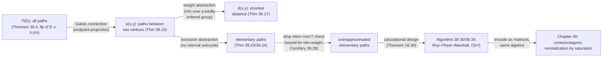

[[book-guidelines|↩ Back to guidelines]]

## Why a book on abstract interpretation needs a chapter on graphs

Here's the puzzle the chapter opens with, if you squint at it from the outside: reachability analysis, shortest-path computation, transitive closure, and dozens of other "path problems" on graphs have *independently* been solved by algorithms that all look suspiciously alike — a triple loop over vertices, a `min` or a `union` in the inner body, an update rule of the shape `d(x,y) := d(x,y) ⊕ d(x,z) ⊗ d(z,y)`. Practitioners noticed this family resemblance decades ago and treated it as a happy coincidence of "algebraic path problems." Cousot's move in this chapter is to show it isn't a coincidence at all: it is the exact same phenomenon this book has been building toward since chapter 18 ([[Fixpoint-Abstraction|fixpoint abstraction]]) — a single concrete fixpoint, abstracted through a Galois connection, "for free" inherits a sound (here, exact) abstract fixpoint. Once you see *the set of all paths of a graph* as one concrete object with a least-fixpoint definition, every path problem — "is there a path from x to y," "what's the shortest path," "list the simple paths" — becomes an *instance* of abstracting that one fixpoint, not a bespoke algorithm you invent from scratch. The chapter's payoff is that the classical Roy–Floyd–Warshall shortest-path algorithm, normally just handed to you as a clever `O(n³)` trick, gets *derived*, step by calculational step, as one specific abstraction in this family.

This chapter also isn't a detour. Chapter 40 (zones and octagons — difference-bound-matrix numerical domains used in real analyzers like Astrée) encodes numeric constraints as weighted graphs and reuses this exact algorithm for domain normalization. So everything here is load-bearing machinery, not background trivia.

## 1. Graphs, paths, and cycles — fixing the vocabulary

A **directed graph** $G = \langle V, E \rangle$ is just a set of vertices $V$ and a set of edges $E \subseteq V \times V$. Nothing exotic — but notice the book treats $E$ as a plain binary relation on $V$ (section 2.2.2's relations), which is the first hint that graph theory here is going to be developed with the same order-theoretic vocabulary as everything else in the book (joins, fixpoints, Galois connections) rather than as a separate discipline.

A **path** $\pi$ from $y$ to $z$ is a finite sequence of vertices $\pi = x_1 \ldots x_n \in V^n$, $n > 1$, with $x_1 = y$, $x_n = z$, and consecutive vertices linked by edges: $\langle x_i, x_{i+1}\rangle \in E$ for all $i \in [1, n[$. The book deliberately excludes $n = 1$ (a "path" of a single vertex with no edges) — a path must contain at least one edge. Its **length** $|\pi| = n - 1$. The set of *all* paths of $G$ is written $\Pi(G) \subseteq \wp(V^{>1})$.

A **cycle** is a path $x_1 \ldots x_n$ with $x_n = x_1$; a self-loop $\langle x, x \rangle \in E$ already gives you the length-1 cycle $xx$.

The one definition to hold onto for everything that follows: the **concatenation of sets of finite paths**,

$$
P \odot Q \;\triangleq\; \{x_1 \ldots x_n y_2 \ldots y_m \mid x_1 \ldots x_n \in P \;\wedge\; y_1 y_2 \ldots y_m \in Q \;\wedge\; x_n = y_1\}.
$$

Read this as: glue every path in $P$ to every path in $Q$ that starts where it ends, fusing the shared vertex. This one operator, together with $\cup$, is the entire algebraic vocabulary the rest of the chapter is built from.

**Grounding (Rust, primary).** The book's graph is exactly what you'd reach for as an adjacency-list structure, and path-sets are naturally `HashSet<Vec<V>>` (or, for the efficient algorithms later, something denser):

```rust
use std::collections::{HashMap, HashSet};

#[derive(Clone, Eq, PartialEq, Hash)]
struct Edge<V> { from: V, to: V }

struct Graph<V: Eq + std::hash::Hash + Clone> {
    vertices: HashSet<V>,
    edges: HashSet<Edge<V>>,
}

type Path<V> = Vec<V>; // x1, ..., xn, n > 1

/// P ⊙ Q: concatenate every path in P ending where a path in Q starts.
fn concat<V: Eq + Clone + std::hash::Hash>(
    p: &HashSet<Path<V>>,
    q: &HashSet<Path<V>>,
) -> HashSet<Path<V>> {
    let mut out = HashSet::new();
    for px in p {
        for qy in q {
            if px.last() == qy.first() {
                let mut glued = px.clone();
                glued.extend(qy.iter().skip(1).cloned());
                out.insert(glued);
            }
        }
    }
    out
}
```

This `concat` is a direct transliteration of (39.3) — keep it in mind, because the entire chapter is just this function (or a lazier variant of it) iterated to a fixpoint.

## 2. Fixpoint characterization of the paths of a graph

**What breaks without this.** If you tried to define $\Pi(G)$ "directly" — by cases on path length — you'd need an infinite union over all lengths $n = 2, 3, 4, \ldots$, and any algorithm built on that definition has no natural stopping point for graphs with cycles (paths of unbounded length exist the moment there's a cycle). A *fixpoint* definition sidesteps this: it characterizes $\Pi(G)$ as the smallest set closed under "start from an edge, or extend by one more edge-glued-on-through-concatenation," and then Tarski's theorem hands you existence and computability (via iteration) for free.

**Theorem 39.4 (fixpoint characterization of the paths of a graph).** $\Pi(G)$ is the *least fixpoint* of a transformer built purely from $E$, $\cup$, and $\odot$ — the book gives four equivalent formulations:

$$
\Pi(G) = \mathrm{lfp}^{\subseteq}\, \overrightarrow{\mathcal F}_\Pi, \qquad \overrightarrow{\mathcal F}_\Pi(X) \triangleq E \cup (X \odot E) \tag{39.4.a}
$$
$$
= \mathrm{lfp}^{\subseteq}\, \overleftarrow{\mathcal F}_\Pi, \qquad \overleftarrow{\mathcal F}_\Pi(X) \triangleq E \cup (E \odot X) \tag{39.4.b}
$$
$$
= \mathrm{lfp}^{\subseteq}\, \overleftrightarrow{\mathcal F}_\Pi, \qquad \overleftrightarrow{\mathcal F}_\Pi(X) \triangleq E \cup (X \odot X) \tag{39.4.c}
$$
$$
= \mathrm{lfp}^{\subseteq}_{E}\, \widehat{\mathcal F}_\Pi, \qquad \widehat{\mathcal F}_\Pi(X) \triangleq X \cup (X \odot X) \tag{39.4.d}
$$

Forms (a) and (b) grow paths one edge at a time from either end (like appending to a list); form (c) grows them by self-concatenation (doubling); form (d) is the same idea but starts the iteration *from* $E$ rather than from $\emptyset$. All four converge to the same set — this is the graph-theoretic analogue of "you can compute the transitive closure by BFS layers, or by repeated squaring, and get the same answer," and the proof is literally an induction showing each is upper continuous (preserves nonempty joins), so Scott–Kleene's theorem (15.26) guarantees the least fixpoint exists and equals $\bigcup_{k} F^k(\emptyset)$.

The self-concatenation form (39.4.c) is the elegant one: the $k$-th iterate $\overleftrightarrow{\mathcal F}_\Pi^{\,k}$ contains exactly the paths of length $\le 2^{k-1}$ — each iteration *doubles* the reachable path length, the same "repeated squaring" trick behind fast matrix exponentiation and fast transitive-closure algorithms. Concretely: $\overleftrightarrow{\mathcal F}_\Pi^{\,0} = \emptyset$, $\overleftrightarrow{\mathcal F}_\Pi^{\,1} = E$ (paths of length 1), and each subsequent step glues the current iterate to itself, roughly doubling the covered length each round.

**Grounding (Python, quick illustration).** The doubling behavior is easiest to see as a five-line loop over path *sets* rather than committing to Rust ceremony yet:

```python
def concat(P, Q):
    return {p + q[1:] for p in P for q in Q if p[-1] == q[0]}

def all_paths_fixpoint(E):
    X = set()
    while True:
        X_next = E | concat(X, X)
        if X_next == X:
            return X
        X = X_next
```

For a finite graph without infinite paths this terminates, and the number of iterations is roughly $\log_2$ of the longest path length, not the length itself — exactly what (39.4.c) predicts.

## 3. Abstraction of path problems by Galois connection

This is the conceptual center of the chapter, and it's the part that should feel most familiar if you've internalized chapter 18's fixpoint-abstraction machinery: it's that machinery applied, verbatim, to $\Pi(G)$.

**A path problem** is: given a Galois connection

$$
\langle \wp(V^{>1}), \subseteq, \cup \rangle \;\xrightleftharpoons[\alpha]{\gamma}\; \langle A, \sqsubseteq, \sqcup \rangle,
$$

specify/compute the abstraction $\alpha(\Pi(G))$ of the full path set. "Is $x$ reachable from $y$?", "what's the shortest path?", "list the simple paths" are all path problems in this sense — each one is a *different* choice of $\alpha$.

**Theorem 39.6 (fixpoint characterization of a path problem).** If your abstraction $\alpha$ satisfies the commutation condition $\alpha(X) \sqcup \alpha(Y) = \alpha(X \cup Y)$ — i.e. $\alpha$ turns unions into joins exactly, no approximation — then $\alpha(\Pi(G))$ has an **exact** abstract fixpoint characterization, obtained by literally replacing $E, \cup, \odot$ in theorem 39.4 with their abstract counterparts $\alpha(E), \sqcup, \overline{\odot}$ (where $\alpha(X)\,\overline{\odot}\,\alpha(Y) \triangleq \alpha(X \odot Y)$ — a *commutation* requirement on the concatenation operator too):

$$
\alpha(\Pi(G)) = \mathrm{lfp}^{\sqsubseteq}\, \overleftrightarrow{\mathcal F}_\Pi^{\sharp}, \qquad \overleftrightarrow{\mathcal F}_\Pi^{\sharp}(X) \triangleq \alpha(E) \sqcup \big(X \,\overline{\odot}\, X\big). \tag{39.6.c}
$$

The proof is a short equational calculation — $\alpha(\overleftrightarrow{\mathcal F}_\Pi(X)) = \alpha(E \cup X \odot X) = \alpha(E) \sqcup \alpha(X \odot X) = \alpha(E) \sqcup \alpha(X)\,\overline{\odot}\,\alpha(X)$ — that then invokes the *exact* least-fixpoint abstraction theorem 18.23 from earlier in the book to conclude $\alpha(\mathrm{lfp}\ \overleftrightarrow{\mathcal F}_\Pi) = \mathrm{lfp}\ \overleftrightarrow{\mathcal F}_\Pi^\sharp$.

This is the theorem that *explains* the empirical folklore: many path algorithms share the same triple-nested-loop shape because they are all instances of one abstract transformer $\alpha(E) \sqcup X\,\overline{\odot}\,X$, differing only in which concrete $\alpha$, $\sqcup$, and $\overline{\odot}$ you plug in. Reachability plugs in Boolean $\sqcup = \vee$ and $\overline{\odot} = \wedge$-then-$\exists$; shortest distance plugs in $\sqcup = \min$ and $\overline{\odot} = +$; you'll see both instantiated below.

**Why this matters for a verifier/elaborator project.** This is the same commuting-square pattern that underwrites soundness of *every* abstract domain operation in a program analyzer — assign, test, join, all need to commute with $\alpha/\gamma$ the same way $\overline{\odot}$ needs to commute with $\odot$ here. Graphs are just a domain simple enough to see the pattern with no distractions.

**Grounding (Lean, secondary — this is exactly a Galois-connection commutation proof).** Lean's structure/typeclass machinery is a very literal way to state "any $\alpha$ satisfying the commutation hypothesis gets the abstract fixpoint for free," because it forces you to carry the hypothesis as an explicit proof obligation rather than an informal side-condition:

```lean
structure PathAbstraction (V A : Type) [Lattice A] where
  α : Set (List V) → A
  γ : A → Set (List V)
  galois : ∀ x a, α x ≤ a ↔ x ⊆ γ a
  -- α(X) ⊔ α(Y) = α(X ∪ Y), the commutation hypothesis of theorem 39.6
  commutesUnion : ∀ X Y, α X ⊔ α Y = α (X ∪ Y)

-- Given such a PathAbstraction, theorem 39.6 says the abstract transformer
-- α(E) ⊔ (X ⊙̄ X) computes α(Π G) as its least fixpoint — the abstract
-- analogue of Theorem 39.4, obtainable generically from `commutesUnion`
-- plus the exact-lfp-abstraction theorem, without re-deriving it per α.
```

The point of writing it this way isn't to build out graph theory in Lean — it's that this `commutesUnion` field is *precisely* the shape of proof obligation your own domain-propagation code will carry every time you claim an abstract operation is exact rather than merely sound.

## 4. Paths between any two vertices

The first concrete instance: abstract $\Pi(G)$ by *indexing paths by their endpoints*. Define $\mathsf p \triangleq \alpha^{\leadsto}(\Pi(G))$ via the projection

$$
\alpha^{\leadsto}(X) \triangleq (x, y) \mapsto \{\pi \in X \mid \pi \text{ starts at } x \text{ and ends at } y\},
$$

so $\mathsf p(x, y)$ is the set of all paths from $x$ to $y$. This is a *pointwise* Galois connection (products of Galois connections, one per vertex pair), and its induced concatenation is the natural one: glue through an intermediate vertex $z$,

$$
X \,\overline{\overline{\odot}}\, Y \triangleq (x, y) \mapsto \bigcup_{z \in V} X(x, z) \odot Y(z, y).
$$

**Theorem 39.10** then hands you, as a direct instance of 39.6, the fixpoint characterization

$$
\mathsf p = \mathrm{lfp}^{\subseteq}_{\dot E}\, \widehat{\mathcal F}_\Pi, \qquad \widehat{\mathcal F}_\Pi(\mathsf p) \triangleq \mathsf p \cup \big(\mathsf p \,\overline{\overline{\odot}}\, \mathsf p\big), \tag{39.10.d}
$$

with $\dot E \triangleq (x,y) \mapsto (E \cap \{\langle x,y\rangle\})$ the "edge matrix." Notice the shape: it's a triple sum ($x, y$, and the intermediate $z$ hidden inside $\overline{\overline\odot}$) building up reachability by relaxing through more and more intermediate vertices. This is already recognizably the *skeleton* of Floyd–Warshall, just still operating on full path sets rather than distances.

## 5. Weighted graphs and totally ordered groups

Now equip edges with weights so "shortest path" is meaningful. A **group** $\langle \mathbb G, 0, + \rangle$ needs no surprises (identity, associativity, inverses); a **weighted graph** $G = \langle V, E, \omega \rangle$ adds $\omega \in E \to \mathbb G$. A **totally ordered group** $\langle \mathbb G, \le, 0, + \rangle$ adds a total order compatible with $+$ (so you can compare weights and the order respects addition — this compatibility is exactly what makes "shortest path" well-behaved under concatenation).

Two extensions matter for what follows: `min` and `max` over $\mathbb G$ are extended to always exist by adjoining $-\infty$ and $\infty$ (empty infimum/supremum), and the **weight of a path** is the sum of its edge weights (0 for a length-$\le 1$ "path," i.e. a single vertex is free). The **weight of a set of paths** is the *minimal* weight in the set — and this minimum-of-a-set operator is itself a Galois connection

$$
\langle \wp(\Pi), \supseteq \rangle \xrightleftharpoons{\ } \langle \mathbb G \cup \{-\infty, \infty\}, \ge \rangle
$$

between path-sets (ordered by *reverse* inclusion — more paths is a lower concrete element) and weights (ordered by $\ge$, since a smaller weight is a "bigger," more precise abstraction — negation of order is the standard trick for turning a min-abstraction into a join-preserving one).

**The distance** $d(x,y)$ between $x$ and $y$ is the weight of the shortest path, $d(x,y) = \dot\omega(\mathsf p(x,y))$, and by composing this weight-abstraction with the "paths between two vertices" abstraction of §4 (via theorem 39.6 again), you get:

**Theorem 39.17.** The distances between any two vertices satisfy an exact fixpoint characterization derived purely by abstraction — no separate algorithm needed, it falls out of the same machine.

**What breaks without the no-negative-cycle assumption.** If the graph has a cycle of strictly negative total weight, you can keep looping around it to make a path's weight arbitrarily small — the minimal weight between the cycle's vertices is genuinely $-\infty$, and the greatest fixpoint in theorem 39.17 diverges (it's the limit of an infinite iteration, not reached in finitely many steps). Concretely: if the cycle $x \to y \to x$ has weight $-1$, then going around it $k$ times gives a path of weight $-k$, so $d(x, y) \to -\infty$. This isn't a computational nuisance to patch around — it's a real semantic fact ("shortest path" is undefined) that the algorithm needs to detect, not paper over. Roy–Floyd–Warshall assumes it away (no negative-weight cycles) precisely to keep distances finite and computable.

## 6. Elementary paths and cycles

Direct iteration of theorem 39.17 for a finite graph with $n$ vertices is $O(n^4)$: $n^2$ vertex pairs, and for each pair the fixpoint iteration needs up to $n$ rounds (one per potential intermediate vertex) considering all paths. The chapter's route to something faster runs through **elementary paths**.

A path is **elementary** iff it has no internal subcycle — no vertex repeats except possibly the two endpoints (which, if equal, makes it an elementary *cycle*). Example: in a graph on $x,y,z$, both $xyz$ and $xz$ are elementary; $xyx$ is an elementary cycle; $xyzay$ (repeats $y$ internally) is not elementary.

**Lemma 39.20** gives a syntactic characterization of elementarity (no two distinct positions hold the same vertex, except possibly the endpoints when they coincide). **Lemma 39.21** answers the harder question: *when does concatenating two elementary paths stay elementary?* — precisely when they don't share vertices in a way that would create an internal cycle (formally, `elem-conc?`, a disjointness-of-interiors condition depending on whether the endpoints coincide). This condition is expensive to check — it's a set-intersection test, not a constant-time comparison — and that expense is exactly the obstacle the Roy–Floyd–Warshall derivation has to route around.

**Theorem 39.23/39.24** then give an *exact* fixpoint and a *finite iterative* characterization of elementary paths — but getting the iterative form requires theorem 18.36 (exact-iterates-multiabstraction), because unlike the previous fixpoints, **a different abstract transformer is needed at each iteration rank** $k$: at round $k$, you restrict attention to elementary paths whose *interior* vertices lie only in $\{z_1, \ldots, z_k\}$ (a fixed enumeration of $V$). This is the "process one candidate intermediate vertex at a time, freeze the rest" idea that will become the outer loop of Roy–Floyd–Warshall. For a finite graph of $n$ vertices, elementary paths have length at most $n+1$, so this iteration provably converges in at most $n+2$ rounds — a crucial finiteness guarantee the earlier, cruder fixpoints didn't give you for free.

## 7. Calculational design of the Roy–Floyd–Warshall algorithm

Here's the last and sharpest move. Section §6's exact elementary-path iteration is *still* too expensive, because each step needs the costly `elem-conc?` check. The key insight, stated as:

**Corollary 39.28 (overapproximation).** Drop the `elem-conc?` check — allow the iteration to concatenate through an intermediate vertex even when the result *isn't* elementary. This obviously *overapproximates* the true elementary-path set. But — and this is the soundness argument that makes the whole algorithm legitimate rather than just "a plausible heuristic" — it is **still exact for shortest distances specifically**, because:

1. the overapproximated set still *contains* every elementary path (you never lose one — you only ever add extra, non-elementary ones), and
2. with no negative-weight edges, non-elementary paths are never shorter than the elementary path between the same endpoints (padding a path with extra cycles-through-repeated-vertices can only add non-negative weight).

So the minimum weight computed over the *bigger, sloppier* path set equals the minimum weight over the true elementary-path set. This is why the derivation is careful to say the overapproximation is sound "for computing shortest distances specifically, but not for other path problems" (e.g. it would be wrong for *counting* elementary paths, or for the longest-elementary-path problem — Exercise 39.37 explicitly flags this). Dropping a correctness check is usually a red flag; here it's justified by a clean two-line argument that only holds for this specific abstraction (min-weight) under this specific assumption (no negative cycles).

Applying theorem 18.36 to this overapproximated fixpoint (39.28.d) produces, by calculational design, **Algorithm 39.30**:

```text
for x, y ∈ V do
    p(x, y) := E ∩ {⟨x, y⟩}
done;
for z ∈ V do
    for x, y ∈ V \ {z} do
        p(x, y) := p(x, y) ∪ p(x, z) ⊙ p(z, y)
    done
done
```

— and applying the same derivation to the *distance*-valued version (composing with the weight abstraction of §5) produces **Theorem 39.33** and **Algorithm 39.34**, the classical Roy–Floyd–Warshall shortest-distance algorithm:

```text
for x, y ∈ V do
    d(x, y) := if ⟨x, y⟩ ∈ E then ω(x, y) else ∞
done;
for z ∈ V do
    for x, y ∈ V do
        d(x, y) := min(d(x, y), d(x, z) + d(z, y))
    done
done.
```

This is, quite literally, the algorithm every algorithms textbook hands you as a black box — but here it's the *end product of a chain of exact abstractions*: all paths → paths between two vertices → shortest distance → elementary paths (needed for the $O(n^3)$ bound) → overapproximated elementary paths (dropping the expensive check, corollary 39.28) → the triple loop. Nothing was postulated; every line of the pseudocode traces back to a specific abstraction step. One implementation subtlety the proof flags: the algorithm reuses the *most recently updated* $d(x,z)$ and $d(z,y)$ within a $z$-round rather than the previous round's values (Gauss–Seidel-style chaotic iteration, justified by corollary 22.6), rather than freshly computing everything from the prior iterate (Jacobi-style) — this is what makes the in-place, single-array implementation correct rather than merely a common optimization.

Complexity: $n^2$ vertex pairs, $n$ choices of intermediate $z$, constant work per cell $\Rightarrow$ $O(n^3)$, versus the naive $O(n^4)$ from §5.

**Grounding (Rust, primary — the full derived algorithm).**

```rust
const INF: f64 = f64::INFINITY;

/// Algorithm 39.34: Roy–Floyd–Warshall shortest distances,
/// requires no cycle of strictly negative total weight.
fn roy_floyd_warshall(n: usize, weight: &[Vec<f64>]) -> Vec<Vec<f64>> {
    // weight[x][y] = ω(x,y) if ⟨x,y⟩ ∈ E, else INF; weight[x][x] = 0.
    let mut d = weight.to_vec();
    for z in 0..n {
        for x in 0..n {
            for y in 0..n {
                // Gauss-Seidel: reads d[x][z], d[z][y] as already
                // updated in this or an earlier z-round — the reuse
                // the proof of Algorithm 39.34 relies on.
                let through_z = d[x][z] + d[z][y];
                if through_z < d[x][y] {
                    d[x][y] = through_z;
                }
            }
        }
    }
    d
}

/// Detects the case theorem 39.33's assumption rules out:
/// a strictly negative cycle, witnessed by d[x][x] < 0.
fn has_negative_cycle(d: &[Vec<f64>]) -> bool {
    (0..d.len()).any(|x| d[x][x] < 0.0)
}
```

This is exactly Algorithm 39.34 — the derivation doesn't just motivate the classic algorithm, it *is* the classic algorithm, down to the loop order ($z$ outermost).

## 8. Adjacency matrix — the same structure, one level more compressed

Section 39.18 closes the chapter by noting that representing a graph as a **Boolean adjacency matrix** ($E$ encoded as a $0/1$ matrix) or, for weighted graphs, a **weight matrix**, is itself just another instance of the same abstraction pattern: there's a Galois isomorphism between path-set functions and matrices, and the algebraic structure ($\cup/\sqcup$ becoming matrix "addition," $\odot/\overline\odot$ becoming matrix "multiplication" in the appropriate semiring — Boolean $\langle \vee, \wedge\rangle$ for reachability, tropical $\langle \min, +\rangle$ for shortest distance) is preserved under this further abstraction. This is the observation that lets zone and octagon analysis (chapter 40) represent numeric constraints as a **difference-bound matrix** and reuse Roy–Floyd–Warshall verbatim for "normalization by saturation."



## Where this leads

Every arrow in the diagram above is a Galois-connection abstraction of the *same* underlying fixpoint (theorem 39.4), instantiated with a different $\langle \alpha, \sqcup, \overline\odot\rangle$ — reachability, distance, and simple-path enumeration are not three different algorithms but three readings of one theorem (39.6). That's the chapter's real content, and it's a template, not a one-off: any time you find yourself with a least-fixpoint definition over a concrete domain and a Galois connection into something coarser that commutes with the transformer's primitives, you get an *exact* abstract algorithm for free — no separate correctness proof needed beyond checking the commutation condition once.

This chapter is also a direct rehearsal for the standing project threads on reachability analysis and Galois-connection domain propagation: the $\alpha(E) \sqcup X\,\overline{\odot}\,X$ pattern here is the same shape as CFG reachability computations that feed into verification-condition generation and constraint propagation in an abstract-interpretation-based verifier — a fixpoint over "paths" is, under a different reading of $V$ and $E$, a fixpoint over program states and transitions. And concretely: chapter 40's zone/octagon numeric domains, which are central to real relational static analyzers, encode their constraints as weighted graphs and normalize them by literally re-running the Roy–Floyd–Warshall algorithm derived here — so this chapter is a direct prerequisite, not background reading, for that one.
