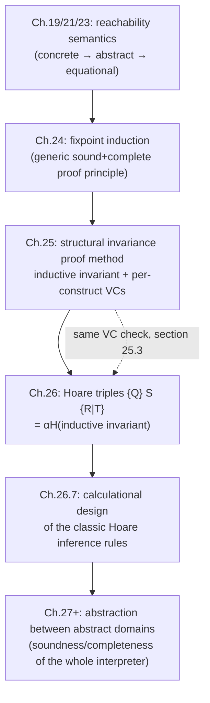

# Invariance Verification and Hoare Logic

[[book-guidelines|↩ Back to guidelines]]

## The problem this chapter actually solves

Chapter 24 gave you fixpoint induction: to prove $\mathrm{lfp}^{\sqsubseteq} f \sqsubseteq P$, it suffices to exhibit an $I$ with $f(I) \sqsubseteq I$ and $I \sqsubseteq P$. That theorem is *true* and it is *complete* (a suitable $I$ always exists), but it is useless as a checking procedure in the form it's stated: $f$ is a whole-program transformer, and "exhibit $I$" gives you a single monolithic object to invent for the entire program at once. Nobody writes a correctness proof that way, and no tool could check one efficiently that way either.

What chapters 25 and 26 do is turn that one global fixpoint-induction obligation into a *syntax-directed* checking procedure — one verification condition per program point, each referring only to its immediate neighbors in the syntax tree. This is the same move a type checker makes: instead of asking "does this whole program have type $\tau$?" as one opaque global question, you break it into one local judgment per AST node and let structural recursion assemble them. Chapter 25 does this for a bare invariant (an environment-property attached to each label); chapter 26 repackages the exact same machinery as Hoare triples $\{Q\}\,S\,\{R\}$, because that's the notation the verification literature actually uses, and because doing so exposes something the chapter treats as a real theorem rather than folklore: **Hoare logic's inference rules are not axioms someone made up — they are the calculationally-derived abstraction, under a specific Galois connection, of exactly this invariance machinery.**

If you're building a Rust verifier that checks Hoare-style contracts, this pair of chapters *is* the spec for your verification-condition generator (VCGen) and for why the rules you'd hard-code are the only sound-and-complete choice, not an arbitrary design decision.

## Reachability specifications: attaching properties to program points

Start with the simplest possible object: a function from program points to properties.

> **Definition 25.1 (reachability specification).** $\mathcal{S}^\sharp\llbracket S \rrbracket \in \mathrm{labs}\llbracket S \rrbracket \to \wp(\mathbb{E}\mathrm{v}^\sharp)$ attaches an environment property $\mathcal{S}^\sharp\llbracket S \rrbracket_\ell$ to each program point $\ell$ of a statement $S$.

This is deliberately weak — it's just a labeling, with no claim yet that it's *true* of anything. A specification becomes meaningful once you say it's **invariant**:

$$\widehat{\mathcal{S}}^\sharp\llbracket S \rrbracket\, \mathcal{P}_0 \sqsubseteq^\sharp \mathcal{S}^\sharp\llbracket S \rrbracket$$

i.e., the actual reachability semantics from precondition $\mathcal{P}_0$ (everything really reachable at each point) is contained in what the specification claims. The book's example 25.2 is worth sitting with:

```
ℓ1 /* x ≥ 0 */  x = x - 1;
ℓ2 /* x < 0 */
```

This specification is *false* — starting from $x = 1 \ge 0$, execution reaches $\ell_2$ with $x = 0$, which does not satisfy $x < 0$. Either the annotation is wrong or the code doesn't do what you think; the point is that "invariant" is a real, falsifiable claim, exactly like a type judgment being false for an ill-typed term.

**What breaks without this framing:** if you conflate "the property I wrote at $\ell$" with "the property that's actually true at $\ell$," you cannot even *state* what a verification bug is — you need the specification and the semantics as two separate things related by an inclusion, so a bug shows up as a specific inclusion failing.

## Inductive invariants: the step that makes checking local

Here is the crux of the whole chapter. Definition 25.5's plain "invariant" ($\mathcal{P}_0 \sqsubseteq^\sharp \mathcal{S}^\sharp\llbracket S \rrbracket$) is a *global* statement about the whole reachability semantics — checking it directly still requires computing the fixpoint. What you actually want is something checkable **one computation step at a time**:

> **Definition 25.9 (inductive invariant).** $\mathcal{I}^\sharp\llbracket S \rrbracket$ is stronger than the specification ($\mathcal{I}^\sharp \sqsubseteq^\sharp \mathcal{S}^\sharp$) and provable by induction on $S$'s computation steps: it holds on entry, and if it holds at a point and a step executes, it holds at the next point.

The book immediately shows these are *not* the same thing (example 25.10):

| point | noninductive spec | inductive invariant |
|---|---|---|
| $\mathcal{P}_0$ | $\mathbb{E}\mathrm{v}$ | $\mathbb{E}\mathrm{v}$ |
| $\ell_1$ (`x = 1;`) | $\mathbb{E}\mathrm{v}$ | $\mathbb{E}\mathrm{v}$ |
| $\ell_2$ (loop test `x>0`) | $\mathbb{E}\mathrm{v}$ | $\{\rho \mid \rho(\mathtt{x}) > 0\}$ |
| $\ell_3$ (`x=x+1;`) | $\mathbb{E}\mathrm{v}$ | $\{\rho \mid \rho(\mathtt{x}) > 0\}$ |
| after | $\mathrm{ff}$ | $\mathrm{ff}$ |

The specification "this loop never terminates" is *true* (an invariant, in the sense of definition 25.5) but not *inductive*: you cannot verify "the loop test failing implies false" locally, because at $\ell_2$ the specification says nothing at all about $x$ ($\mathbb{E}\mathrm{v}$, the whole environment set), so a passing test tells you nothing that contradicts $\mathrm{ff}$ at the exit. You have to *strengthen* the specification — add "$x > 0$" — before the local step-by-step check goes through. This is exactly analogous to strengthening an induction hypothesis in a recurrence proof: sometimes the statement you actually want isn't strong enough to carry its own induction step, and you must prove something stronger to make the induction close.

**What breaks without inductive strengthening:** and it can be a genuine dead end, not just extra work. The book notes that if your specification logic is $\{\mathrm{tt}, \mathrm{ff}\}$ — Booleans, no quantifiers, no arithmetic — you can *state* "this loop never terminates" but you cannot *express* the inductive invariant "$x > 0$" needed to prove it, because that logic has no way to talk about the value of $x$ at all. Section 25.4 gives the sharper, practically important version of this: Presburger arithmetic (integers with $+$, $=$, but *no* multiplication) can express every verification condition for a program computing $x \times y$ by repeated addition — except the specification "$p = x \times y$" and the loop invariant "$p = x \times i$" themselves, because neither contains a $\times$. Adding $\times$ to fix this gets you Peano arithmetic, which buys expressivity at the cost of decidability (Gödel). This is a recurring tension your abstract domain choice will always face: more expressive enough to state your invariants, but that same expressivity is what makes checking them potentially undecidable.

## The verification conditions: one clause per grammar production

Theorem 25.11 makes the promise precise: checking $\widehat{\mathcal{S}}^\sharp\llbracket S \rrbracket\, \mathcal{P}_0 \sqsubseteq^\sharp \mathcal{S}^\sharp\llbracket S \rrbracket$ is **equivalent** to finding an $\mathcal{I}$ that (a) is stronger than the specification and (b) satisfies a batch of Boolean verification conditions $\widehat{\mathcal{V}}^\sharp\llbracket S \rrbracket\, \mathcal{P}_0\, \mathcal{I}$, defined by structural induction on $S$ — one clause per grammar production, derived (not postulated) from the equational semantics of chapter 23 via fixpoint induction (theorem 24.1). This derivation is what "calculational design" means throughout the book: you don't write down rules and prove them sound after the fact; you start from $\widehat{\mathcal{V}}^\sharp\llbracket S \rrbracket \triangleq \mathrm{E}\llbracket S \rrbracket\, \mathcal{P}_0(\mathcal{I}) \sqsubseteq^\sharp \mathcal{I}$ and simplify by structural induction until each construct's own clause pops out.

The full table (25.12)–(25.21), with $\mathcal{I}_{\mathrm{at}\llbracket S \rrbracket}$ abbreviated $\mathcal{I}_{\mathrm{at}}$ etc.:

- **Program** $P ::= \mathrm{Sl}^{\ell'}$: $\widehat{\mathcal{V}}^\sharp\llbracket P \rrbracket = \widehat{\mathcal{V}}^\sharp\llbracket \mathrm{Sl} \rrbracket$ — no new obligation, just delegate.
- **Skip** $S ::= \texttt{;}$: $\mathcal{P}_0 \sqsubseteq^\sharp \mathcal{I}_{\mathrm{at}}\ \wedge\ \mathcal{I}_{\mathrm{at}} \sqsubseteq^\sharp \mathcal{I}_{\mathrm{after}}$ — the invariant just passes through unchanged.
- **[[Forward-Reachability-Semantics#Assignment|Assignment]]** $S ::= \texttt{x=E;}$: $\mathcal{P}_0 \sqsubseteq^\sharp \mathcal{I}_{\mathrm{at}}\ \wedge\ \mathsf{assign}^\sharp\llbracket \mathtt{x}, \mathtt{E} \rrbracket\, \mathcal{I}_{\mathrm{at}} \sqsubseteq^\sharp \mathcal{I}_{\mathrm{after}}$ — the abstract post-assignment transformer applied to the entry invariant must be covered by the exit invariant. This clause is the one that actually touches your concrete abstract domain's primitives.
- **Conditional (one-armed)** $S ::= \texttt{if(B)}\,S_t$: entry condition, plus $\widehat{\mathcal{V}}^\sharp\llbracket S_t \rrbracket\, (\mathsf{test}^\sharp\llbracket B \rrbracket\, \mathcal{I}_{\mathrm{at}})\, \mathcal{I}$ (recursively verify the branch, seeded with the *filtered* invariant), plus $\overline{\mathsf{test}}^\sharp\llbracket B \rrbracket\, \mathcal{I}_{\mathrm{at}} \sqsubseteq^\sharp \mathcal{I}_{\mathrm{after}}$ (the false branch, which does nothing, must still land in the exit invariant).
- **Two-armed conditional**: symmetric — both $\mathsf{test}^\sharp\llbracket B \rrbracket$ and $\overline{\mathsf{test}}^\sharp\llbracket B \rrbracket$ seed a recursive verification of $S_t$ and $S_f$ respectively.
- **Statement lists**: $\varepsilon$ just requires $\mathcal{P}_0 \sqsubseteq^\sharp \mathcal{I}_{\mathrm{at}}$; $\mathrm{Sl}' \, S$ recursively verifies $\mathrm{Sl}'$ and then $S$, threading $\mathcal{I}_{\mathrm{at}\llbracket S \rrbracket}$ as the handoff.
- **Iteration** $S ::= \texttt{while}\,\ell\,\texttt{(B)}\,S_b$: entry condition; $\widehat{\mathcal{V}}^\sharp\llbracket S_b \rrbracket\, (\mathsf{test}^\sharp\llbracket B \rrbracket\, \mathcal{I}_{\mathrm{at}})\, \mathcal{I}$ (loop body verified from the filtered-true invariant); $\overline{\mathsf{test}}^\sharp\llbracket B \rrbracket\, \mathcal{I}_{\mathrm{at}} \sqsubseteq^\sharp \mathcal{I}_{\mathrm{after}}$ (loop exit from the filtered-false invariant); and, distinctively, $\forall \ell \in \mathrm{breaks\text{-}of}\llbracket S_b \rrbracket.\ \mathcal{I}_\ell \sqsubseteq^\sharp \mathcal{I}_{\mathrm{after}\llbracket S \rrbracket}$ — **every break inside the body must also land in the loop's exit invariant.**
- **Break** $S ::= \ell\,\texttt{break;}$: just $\mathcal{P}_0 \sqsubseteq^\sharp \mathcal{I}_{\mathrm{at}}$ — a break statement contributes no local obligation of its own; its consequence is entirely discharged by the enclosing loop's fourth clause.
- **Compound** $S ::= \{\mathrm{Sl}\}$: delegates to $\mathrm{Sl}$, same as the program rule.

Remark 25.23 rewrites the break clause slightly: since each label $\ell \in \mathrm{breaks\text{-}of}\llbracket S_b \rrbracket$ corresponds to an actual `break;` statement whose own $\mathrm{break\text{-}to}\llbracket S \rrbracket$ is $\mathrm{after}\llbracket S \rrbracket$, the condition distributes to $\mathcal{I}_{\mathrm{at}\llbracket S \rrbracket} \sqsubseteq^\sharp \mathcal{I}_{\mathrm{break\text{-}to}\llbracket S \rrbracket}$ per break statement — which is exactly what makes the Hoare-triple "escape" component in chapter 26 fall out so cleanly.

**Why this is sound *and* complete, not just sound:** because it's a faithful structural transcription of fixpoint induction (theorem 24.1) applied to the equational semantics (theorem 23.20), which is itself exactly equivalent to [[Fixpoint-Theory#Tarski's fixpoint theorem|Tarski's fixpoint theorem]]. Soundness and completeness aren't separately-argued properties bolted onto the VC generator — they're inherited, for free, from the [[Fixpoint-Theory|fixpoint theory]] two chapters back. What you *don't* get for free is decidability: by Rice's theorem, checking any single implication $\mathcal{I}_x \sqsubseteq^\sharp \mathcal{I}_y$ in an expressive-enough domain is undecidable — that's section 25.4's subject.

## Why automating this is genuinely hard (not just "run a solver")

Section 25.4 is refreshingly honest about where automation breaks down, and separates three *distinct* failure modes that require different fixes:

1. **The theorem prover can't discharge a valid implication.** Fix: restrict $\mathbb{D}^\sharp$ to a reduced product of decidable theories (SMT-friendly), accepting a loss of expressivity in exchange for a terminating decision procedure — though "terminating" doesn't mean "fast": these are often doubly-exponential decision procedures (Presburger, real closed fields).
2. **The invariant the user supplied is too weak.** For decidable theories the SMT solver hands back a counterexample you can use to strengthen it; for undecidable ones, the prover just fails, and a human has to recognize *why* and supply a stronger invariant by hand.
3. **The abstract domain can't express the needed invariant at all**, as in the Presburger/multiplication example above. There's no algorithmic fix here — only "pick a more expressive (and likely less decidable) domain," which reopens failure mode 1.

Separately, if $\mathbb{D}^\sharp$ is a fully general logic — first-order arithmetic, as used by Isabelle, PVS, or ACL2 — the implication check is undecidable by Gödel's incompleteness theorems, full stop, and you're into "help the prover" territory (hint tactics, lemma libraries) or hand-written proofs checked by a proof assistant like Coq. The book's closing observation is worth internalizing for a verifier project: *the invariant is usually as complex as the program, and the proof an order of magnitude more complex than the invariant* — and all three have to be co-maintained under program changes.

## From bare invariants to Hoare triples: why `break` needs a third slot

Chapter 26 takes the exact same machinery and repackages it in the notation actually used in the verification literature. The classic Hoare triple $\{Q\}\,S\,\{R\}$ says: if $S$ starts in a state satisfying $Q$ and terminates, the final state satisfies $R$. Note immediately that this is **partial correctness** — termination itself is abstracted away, so $\{Q\}\,S\,\{\mathrm{ff}\}$ is a legitimate (and sometimes true) way to *express* "$S$ never terminates," which is exactly why the triple-checking problem is undecidable (it would let you decide the halting problem).

Now add `break`. A classic two-slot triple has nowhere to put "what holds if $S$ exits via a `break` to *outside* $S$" — and that's a real gap, not a cosmetic one, because a loop body that can `break` genuinely has two distinct exit channels with two distinct postconditions. The book's fix is definitional, not a hack: extend the triple to $\{Q\}\,S\,\{R \mid T\}$, where $R$ is the normal-termination postcondition (attached to $\mathrm{after}\llbracket S \rrbracket$) and $T$ is the postcondition that holds upon an escaping `break` (attached to $\mathrm{break\text{-}to}\llbracket S \rrbracket$). When $S$ has no `break` that escapes it, $T$ is meaningless and can be anything — by convention $\mathrm{ff}$ — and $\{Q\}\,S\,\{R\}$ is literally notation for $\{Q\}\,S\,\{R \mid \mathrm{ff}\}$. Formally (26.1):

$$\{Q\}\,S\,\{R \mid T\} \triangleq \{\langle Q, R, \mathrm{escape}\llbracket S \rrbracket\ ?\ T : U\rangle \mid U \in \overline{\mathbb{P}}^\sharp\}$$

— i.e., when $S$ can't escape by a `break` at all, the third component is irrelevant and ranges over everything, so the triple denotes a whole *family* collapsing on $Q, R$ alone. This is precisely the kind of "make the undefined case genuinely don't-care rather than silently wrong" move you want in a Rust verifier's IR — it's the difference between an `Option<Postcondition>` that's `None` when irrelevant, and a sentinel value someone eventually checks by accident.

## Hoare logic *is* an abstract interpretation of the invariance semantics

This is the chapter's headline claim, and it's worth being precise about what "is an abstract interpretation of" means here rather than treating it as a slogan.

A Hoare triple is defined as the **abstraction of an inductive invariant** — literally a function $\alpha_H\llbracket S \rrbracket$ from invariants to triples:

$$\alpha_H\llbracket S \rrbracket(\mathcal{I}) \triangleq \{\mathcal{I}(\mathrm{at}\llbracket S \rrbracket)\}\ S\ \{\mathcal{I}(\mathrm{after}\llbracket S \rrbracket) \mid \mathcal{I}(\mathrm{break\text{-}to}\llbracket S \rrbracket)\}$$

It just projects out the invariant's value at three specific points and forgets everything in between. A triple is **valid** exactly when it's the projection of an *inductive* invariant (checked, per section 25.3, by the very same $\widehat{\mathcal{V}}^\sharp\llbracket S \rrbracket$ verification conditions from chapter 25):

$$\widehat{\mathrm{H}}^\sharp\llbracket S \rrbracket \triangleq \{\alpha_H\llbracket S \rrbracket(\mathcal{I}) \mid \widehat{\mathcal{J}}^\sharp\llbracket S \rrbracket\, \mathcal{I}\}$$

Remark 26.4 makes the abstraction relationship fully formal via a **Galois isomorphism**: represent a checking predicate $\widehat{\mathcal{J}}^\sharp\llbracket S \rrbracket \in (\mathbb{L} \to \mathbb{P}^\sharp) \to \mathbb{B}$ (a Boolean test over invariants) by its characteristic *set* of invariants via $\gamma_{\mathbb{1}}(S) \triangleq x \mapsto (x \in S)$ / $\alpha_{\mathbb{1}}(I) \triangleq \{x \mid I(x)\}$. Composing that isomorphism with the projection $\alpha_H\llbracket S \rrbracket$ gives a *homomorphic/partitioning* abstraction

$$\alpha_{\mathbb{Ht}}\llbracket S \rrbracket(I) \triangleq \{\alpha_H\llbracket S \rrbracket(\mathcal{I}) \mid \mathcal{I} \in I\}$$

of a *set* of inductive invariants into the *set of all valid Hoare triples*, and under this abstraction $\widehat{\mathrm{H}}^\sharp\llbracket S \rrbracket = \alpha_{\mathbb{Ht}}\llbracket S \rrbracket(\widehat{\mathcal{J}}^\sharp\llbracket S \rrbracket)$ exactly — Hoare logic is what you get by pushing the *set of all inductive invariants of* $S$ through this concretely-defined abstraction function. This is a genuine, checkable instance of the book's general Galois-connection abstraction pattern from chapter 11 — not a metaphor, and not something Hoare himself needed to reach for, since he was postulating the rules directly rather than deriving them from an underlying semantics.

## Calculational design: deriving the rules instead of postulating them

Since $\widehat{\mathrm{H}}^\sharp\llbracket S \rrbracket \triangleq \alpha_{\mathbb{Ht}}\llbracket S \rrbracket(\widehat{\mathcal{J}}^\sharp\llbracket S \rrbracket)$, and $\widehat{\mathcal{J}}^\sharp$ was already given a structural (per-grammar-production) definition in chapter 25, you can *calculate* — substitute definitions and simplify, construct by construct — what $\widehat{\mathrm{H}}^\sharp\llbracket S \rrbracket$ must look like for each syntactic form, then read off the result as a structural inference-rule system. This is the method, not just a claim about the outcome: two steps, (1) calculate $\widehat{\mathrm{H}}^\sharp\llbracket S \rrbracket$ as a function of the sub-triples $\widehat{\mathrm{H}}^\sharp\llbracket S' \rrbracket$ for $S' \lhd S$, by unfolding (26.3)+(26.2)+(26.1) and the chapter-25 verification conditions and simplifying; (2) re-express that as premise/conclusion inference rules (following the general structural rule-based definitions of §16.24). The resulting rules, each numbered and each with a machine-checkable derivation in the book:

- **Assignment** (26.10): $\dfrac{\mathsf{assign}^\sharp\llbracket x, E \rrbracket\, Q \sqsubseteq^\sharp R}{\{Q\}\ \texttt{x=E;}\ \{R \mid T\}}$ — the workhorse rule; note $T$ is unconstrained, since assignment can't `break`.
- **Skip** (26.11): $\dfrac{Q \sqsubseteq^\sharp R}{\{Q\}\ \texttt{;}\ \{R \mid T\}}$.
- **Conditional, one-armed** (26.12): $\dfrac{\mathsf{test}^\sharp\llbracket B \rrbracket\, Q \sqsubseteq^\sharp Q',\ \ \{Q'\}\, S_t\, \{R\mid T\},\ \ \overline{\mathsf{test}}^\sharp\llbracket B \rrbracket\, Q \sqsubseteq^\sharp R}{\{Q\}\ \texttt{if(B)}\ S_t\ \{R\mid T\}}$.
- **Conditional, two-armed** (26.13): both branches verified from their respective filtered preconditions, both required to reach the *same* $R$ and (if applicable) $T$.
- **Iteration** (26.14) — the rule that carries the whole `break`-extension payoff: $\dfrac{\mathsf{test}^\sharp\llbracket B \rrbracket\, Q \sqsubseteq^\sharp Q_b,\ \ \{Q_b\}\, S_b\, \{Q \mid R\},\ \ \overline{\mathsf{test}}^\sharp\llbracket B \rrbracket\, Q \sqsubseteq^\sharp R}{\{Q\}\ \texttt{while(B)}\ S_b\ \{R \mid T\}}$. Read the body's triple carefully: $\{Q_b\}\, S_b\, \{Q \mid R\}$ — the loop body's *normal* postcondition is $Q$ (loops back into the invariant, exactly as you'd expect), but its *escape* postcondition is $R$, the postcondition of the **whole loop**. A `break` inside the body directly establishes the loop's own exit condition. When $S_b$ has no escaping break, this specializes to exactly Hoare's textbook while-rule with $Q$ as the loop invariant and $T = \mathrm{ff}$ — the book gets Hoare's original rule as a *corollary* of the general derivation, not as a starting axiom.
- **Break** (26.16): $\dfrac{Q \sqsubseteq^\sharp T}{\{Q\}\ \texttt{break;}\ \{R \mid T\}}$ — deliberately the mirror image of skip: instead of flowing into $R$, the precondition must flow into the escape slot $T$. $R$ is unconstrained (a break never reaches "after" directly).
- **Statement list / compound / program** (26.7–26.9, 26.17): pure structural glue — sequencing threads an intermediate assertion between the sub-triples of $\mathrm{Sl}'$ and $S$; compound and program just delegate to their body.

The point of walking through the *proofs*, not just the rule statements, is that every single one of these is a two-line unfolding of (26.1)–(26.3) plus the corresponding chapter-25 verification condition — there is no step where the book has to "notice" a clever rule; the rule falls out of substitution and simplification. That is the calculational-design promise made concrete.

## Grounding: building this as a Rust VCGen

Because this material is exactly judgment-form/typing-rule-shaped, it maps almost mechanically onto a compiler pass. This is the part of the book most directly load-bearing for a Rust program verifier: the AST, the per-construct VC, and the inference rules above are literally the specification of your VCGen's cases.

```rust
// A minimal AST mirroring the book's grammar for statements.
enum Stmt {
    Assign { x: String, e: Expr },
    Skip,
    If { b: Expr, then: Box<Stmt> },
    IfElse { b: Expr, then: Box<Stmt>, els: Box<Stmt> },
    While { b: Expr, body: Box<Stmt> },
    Break,
    Seq(Vec<Stmt>),
}

// An abstract domain primitive, matching definition 21.1 / 26.3's D#.
trait AbstractDomain {
    type Prop: Clone + PartialEq;
    fn leq(&self, a: &Self::Prop, b: &Self::Prop) -> bool;       // ⊑#
    fn assign(&self, x: &str, e: &Expr, q: &Self::Prop) -> Self::Prop; // assign#
    fn test(&self, b: &Expr, q: &Self::Prop) -> Self::Prop;      // test#
    fn test_not(&self, b: &Expr, q: &Self::Prop) -> Self::Prop;  // test-bar#
}

// A Hoare triple extended with the escape component T (chapter 26.2/26.3).
struct Triple<P> { q: P, r: P, t: P }

// One proof obligation the checker must discharge — corresponds to a
// single VC clause (25.13)-(25.21), e.g. `assign# [x,E] Q ⊑# R`.
struct Obligation<P> { lhs: P, rhs: P }

// The VCGen: given a precondition Q and a program, emits the Hoare
// triple it establishes AND the side-condition obligations that must
// hold for the derivation to be valid — directly transcribing rules
// (26.10)-(26.17).
fn vcgen<D: AbstractDomain>(
    dom: &D,
    s: &Stmt,
    q: D::Prop,
) -> (Triple<D::Prop>, Vec<Obligation<D::Prop>>) {
    match s {
        Stmt::Assign { x, e } => {
            let r = dom.assign(x, e, &q);          // rule (26.10)'s conclusion
            (Triple { q: q.clone(), r, t: q },      // T unconstrained: reuse q as a placeholder
             vec![])                                 // the assign-obligation is discharged by construction
        }
        Stmt::Skip => (Triple { r: q.clone(), t: q.clone(), q }, vec![]),
        Stmt::While { b, body } => {
            let q_b = dom.test(b, &q);
            let (body_triple, mut obls) = vcgen(dom, body, q_b.clone());
            let r = dom.test_not(b, &q);
            // rule (26.14): body's normal postcondition must reestablish Q,
            // body's escape postcondition must already BE the loop's R.
            obls.push(Obligation { lhs: body_triple.r, rhs: q.clone() });
            obls.push(Obligation { lhs: body_triple.t, rhs: r.clone() });
            (Triple { q: q.clone(), r, t: q }, obls)
        }
        Stmt::Break => {
            // rule (26.16): Q ⊑# T. Caller (the enclosing While) supplies T
            // via the escape channel; here we just propagate Q as the
            // candidate escape condition for the caller to check.
            (Triple { q: q.clone(), r: q.clone(), t: q.clone() }, vec![])
        }
        // If/IfElse/Seq: structural composition, each spawning a recursive
        // vcgen call and collecting obligations, exactly mirroring (26.12)/(26.13)/(26.8).
        _ => unimplemented!(),
    }
}
```

The `Vec<Obligation<D::Prop>>` returned alongside each triple is exactly the book's $\widehat{\mathcal{V}}^\sharp\llbracket S \rrbracket\, \mathcal{P}_0\, \mathcal{I}$: a list of $\sqsubseteq^\sharp$ implications, which your backend then discharges against a concrete `AbstractDomain` (an SMT theory, an interval domain, whatever) — and section 25.4's three failure modes (undecidable implication / weak invariant / inexpressive domain) are precisely the three ways this discharge step can fail in practice.

## Grounding: Lean as the "this is what the proof looks like" view

Where Rust gives you the *mechanism* (a checker that emits obligations), Lean is the more honest rendering of what the calculational-design proofs in this chapter actually are: structural inductions over an inductively-defined relation, exactly the shape of `isDefEq` or a typing-judgment soundness proof.

```lean
-- A relation mirroring the extended Hoare triple {Q} S {R | T}.
-- `Prop'` stands in for the abstract domain's property type ℙ#.
inductive Hoare {Prop' : Type} (leq : Prop' → Prop' → Prop)
    (assign : String → Expr → Prop' → Prop')
    (test testNot : Expr → Prop' → Prop') : Stmt → Prop' → Prop' → Prop' → Prop
  | assign {x e q r t} :
      leq (assign x e q) r → Hoare leq assign test testNot (.assign x e) q r t
  | skip {q r t} :
      leq q r → Hoare leq assign test testNot .skip q r t
  | whileLoop {b body q qb r t} :
      leq (test b q) qb →
      Hoare leq assign test testNot body qb q r →   -- body's escape = loop's R
      leq (testNot b q) r →
      Hoare leq assign test testNot (.while b body) q r t
  | brk {q r t} :
      leq q t → Hoare leq assign test testNot .break q r t
  -- ... seq, if, ifElse cases mirror (26.8), (26.12), (26.13)
```

The value of writing it this way isn't stylistic. It makes `Hoare` a genuine inductively-defined judgment, so a **soundness theorem** — "every derivable `Hoare ... s q r t` triple is a valid abstraction of an inductive invariant, i.e. corresponds to an actual $\mathcal{I}$ satisfying $\widehat{\mathcal{V}}^\sharp$" — is provable by `induction` on the `Hoare` derivation itself, one case per constructor, each case discharged by exactly the substitution argument the book carries out in the "Proof of (26.1X)" sections. That correspondence (inductive relation ↔ structural induction proof) is precisely the elaborator-and-kernel-unifier pattern from your broader project: a judgment form defined by rules, checked/elaborated by recursion on syntax, soundness established by induction on derivations rather than on syntax directly.

## Grounding: a five-line Python sketch of the VC walk

For a quick illustration without any type-system ceremony, here's the shape of "collect one obligation per assignment/while-escape, walking the tree" as a pure function over a tiny AST — useful for prototyping a domain before committing to the Rust trait design above:

```python
def vcgen(stmt, q, dom):
    # dom: an object with .assign(x,e,q), .test(b,q), .test_not(b,q), .leq(a,b)
    if stmt.kind == "assign":
        r = dom.assign(stmt.x, stmt.e, q)
        return {"Q": q, "R": r, "T": q}, []
    if stmt.kind == "while":
        qb = dom.test(stmt.b, q)
        body, obls = vcgen(stmt.body, qb, dom)
        r = dom.test_not(stmt.b, q)
        obls += [("leq", body["R"], q), ("leq", body["T"], r)]
        return {"Q": q, "R": r, "T": q}, obls
    # ... skip / if / seq / break follow the same shape
```

## Where this leads

The two chapters close a loop the book opened back in chapter 8, when the invariance/reachability semantics was first introduced as one rung in the hierarchy of program-property abstractions. Chapters 19/21/23 built the reachability semantics up (concretely, then abstractly, then equationally); chapter 24 gave the generic tool (fixpoint induction) for proving anything about a least fixpoint; chapter 25 specialized that tool into a structural, per-construct checking procedure; and chapter 26 showed that *renaming* that procedure's output as Hoare triples, plus a genuine Galois-connection abstraction, recovers — as a derived corollary rather than a postulate — the exact inference rules Hoare published in 1969.



For the standing project: this is as load-bearing as this book gets for a Rust verifier. The verification-condition table (25.12)–(25.21) is a literal VCGen specification; the escape-extended Hoare triple is the right IR shape for `break`/early-return/exception control flow (and the book cites [911] as extending the same idea to `return`, `throw`, and `continue` — worth chasing if the target language needs those); and the calculational-design method is the discipline to apply whenever you add a new statement form to your language: don't invent a rule and prove it sound after the fact — derive it from the invariance semantics the way this chapter does, so soundness is inherited rather than separately argued. The undecidability discussion in 25.4 is also the honest answer to "why can't my verifier just always succeed automatically" — worth keeping in view before promising full automation to any future user of the tool.
