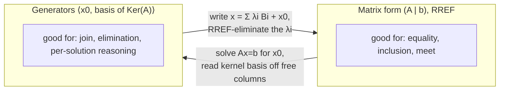

[[book-guidelines|↩ Back to guidelines]]

## Why a static analyzer needs linear algebra

Every abstract domain covered up to this part of the book (intervals, signs,
congruences, …) is *non-relational*, or "Cartesian": it tracks each program
variable independently, as a separate abstract value with no memory of how
variables relate to each other. Cousot opens chapter 38 with the example
that breaks this:

```
x = 0; y = 0;
while (x < 10) { x = x + 1; y = y + 2; }
```

An interval or sign analysis, run one variable at a time, can bound `x`
(`0 ≤ x ≤ 10`) but has no way to bound `y` — it can't see that `y` is always
exactly `2x`, and therefore that `x ≤ 10` forces `y ≤ 20`. The invariant that
actually holds at the loop head is a *relation between variables*:
$2x - y = 0$. To infer relations like this automatically, the analysis needs
a representation for "the set of points satisfying a system of linear
equations" and an algebra for manipulating that representation soundly
through assignments and tests. That representation is exactly what
19th-century linear algebra provides, and chapter 37 builds it from scratch
before chapter 38 turns it into an abstract domain (the domain introduced by
Michael Karr in 1976).

The two chapters have a clean division of labor: chapter 37 is pure math
(fields, vector spaces, systems of linear equations, affine spaces — no
programs in sight), and chapter 38 is the one-page translation of that math
into a Galois-connection-based abstract domain, its lattice operations, and
its abstract transformers for [[Forward-Reachability-Semantics#Assignment|assignment]] and test. This article follows that
same arc.

## Fields and vector spaces: what scalars and vectors need to satisfy

**What breaks without a field.** Gauss–Jordan elimination needs to *divide*
by a pivot to normalize a row. If your scalars are integers ($\mathbb{Z}$),
you don't generally have multiplicative inverses (there's no integer $k$
with $3k = 1$), so elimination gets stuck or forces you to work with
non-canonical scaled rows. That's why the book insists on a **field**
$\langle \mathbb{F}, +, -, \times, / \rangle$ — a set of scalars closed under
addition, subtraction, multiplication, and division (except by zero) obeying
the usual associativity/commutativity/distributivity laws. $\mathbb{Q}$ and
$\mathbb{R}$ are fields; $\mathbb{Z}$ is not (it lacks multiplicative
inverses). In program analysis $\mathbb{F}$ is essentially always
$\mathbb{Q}$, precisely to sidestep integer division and rounding.

A **vector space** $\langle X, \langle \mathbb{F}, +,-,\times,/\rangle,
+,-,\times,/\rangle$ over a field of scalars is a set of vectors $X$ closed
under vector addition/subtraction and scalar multiplication/division, with
a distinguished null vector $\vec{0}$ acting as the additive identity. A
**subspace** is a nonempty subset closed under those same operations — it's
automatically a vector space in its own right.

Three derived notions matter for everything downstream:

- **Span**: given a family of vectors $\langle e_i, i \in \Delta \rangle$,
  $\mathrm{Span}$ is the set of *all* their linear combinations
  $\sum_i a_i e_i$. It's always a subspace.
- **Linear independence**: a family is *free* iff the only linear
  combination summing to $\vec{0}$ is the trivial one (all coefficients
  zero). Otherwise some vector is redundant — expressible from the others.
- **Basis and dimension**: a basis is a free family that spans the whole
  space. Every basis of a given vector space has the same size, called the
  **dimension**. Any vector then has a *unique* decomposition into
  coordinates relative to that basis.

For program analysis, the vector space that matters is the **coordinate
space** $\mathbb{F}^n$ — an $n$-tuple of field values, one per program
variable, with componentwise addition and scaling, dimension exactly $n$,
and the standard basis $\vec{e}_1, \dots, \vec{e}_n$. An element
$\langle v_1, \dots, v_n \rangle \in \mathbb{F}^n$ *is* an environment: the
vector of current values $\rho(x_1), \dots, \rho(x_n)$ of the $n$ program
variables.

**Grounding (Rust).** A vector space is exactly the algebraic shape captured
by a trait hierarchy — this is a place where Rust's trait system reads
almost as a direct transliteration of the book's structure:

```rust
trait Field:
    Copy + PartialEq
    + std::ops::Add<Output = Self>
    + std::ops::Sub<Output = Self>
    + std::ops::Mul<Output = Self>
    + std::ops::Div<Output = Self>
{
    const ZERO: Self;
    const ONE: Self;
}

impl Field for f64 {
    const ZERO: f64 = 0.0;
    const ONE: f64 = 1.0;
}
// A rational-number Field impl is the honest choice for an analyzer —
// f64 rounding silently breaks the "reduced row echelon form is unique"
// property the whole domain relies on (see the RREF section below).

/// A vector in the coordinate space F^n, i.e. one abstract "environment".
#[derive(Clone, PartialEq)]
struct Vector<F: Field> { coords: Vec<F> }

impl<F: Field> Vector<F> {
    fn add(&self, other: &Self) -> Self {
        Vector { coords: self.coords.iter().zip(&other.coords)
                     .map(|(a, b)| *a + *b).collect() }
    }
    fn scale(&self, s: F) -> Self {
        Vector { coords: self.coords.iter().map(|c| *c * s).collect() }
    }
}
```

**Grounding (Lean).** The book's axioms are, almost verbatim, Mathlib's
`Field` and `Module`/`VectorSpace` typeclasses:

```lean
-- Mathlib already has this; shown here to make the correspondence explicit.
-- Field 𝔽  ≈  Mathlib's `Field 𝔽`
-- VectorSpace X over 𝔽  ≈  `Module 𝔽 X` (+ `𝔽` a field, giving a vector space)

example (𝔽 : Type) [Field 𝔽] (X : Type) [AddCommGroup X] [Module 𝔽 X]
    (a : 𝔽) (u v : X) : a • (u + v) = a • u + a • v :=
  smul_add a u v   -- exactly the distributivity law the book states as an axiom
```

The reason Lean's kernel is worth citing here specifically: `Span`, "linear
independence," and "basis" in the book are *definitions*, not primitives —
in Lean these are also definitions (`Submodule.span`, `LinearIndependent`),
so an analyzer's own `span`/`is_free`/`basis` functions in Rust are, in a
precise sense, computable shadows of Mathlib's already-formalized versions.

## Systems of linear equations and Gauss–Jordan elimination

A system of $m$ equations in $n$ unknowns, $A\vec{x} = \vec{b}$ (Cayley's
matrix notation for $\sum_j a_{ij} x_j = b_i$, $i \in [1,m]$), is understood
as a *conjunction* of linear constraints. Chapter 38's whole reason for
existing is that the *solution set* of such a system,
$\llbracket A\vec{x} = \vec{b} \rrbracket$, is precisely the shape of
invariant a linear-equality analysis wants to infer and propagate.

**What breaks without a canonical form.** A system can be transformed by row
operations (swap two rows, scale a row by a nonzero scalar, add a multiple
of one row to another — none of which change the solution set) into many
different equivalent systems. If the abstract domain's equality test just
compared raw matrices, `⟨2x - y = 0⟩` and `⟨4x - 2y = 0⟩` would look like
different abstract elements when they denote the same set of environments.
The domain needs a *unique* representative per solution set — otherwise
`⊑` and `=` on the abstract domain aren't decidable by simple structural
comparison.

**Row echelon form (Gauss)**: after row operations, every nonzero row's
leading ("pivot") entry is $1$ and strictly right of the pivot above it; all
zero rows sink to the bottom. This isn't unique, but it's solvable by
backward substitution.

**Reduced row echelon form, RREF (Jordan)**: additionally, every pivot
column has *only* that one nonzero entry (zeros above and below, not just
below). This form *is* unique — it's the canonical representative the Karr
domain uses for equality and inclusion tests.

**Theorem 37.9** (existence of solutions): after eliminating zero rows, a
system in RREF has a solution *iff* no row is of the contradictory form
$0 = b$ with $b \neq 0$. The proof is short and mechanical: a zero row with
$b = 0$ is vacuous and droppable; a zero row with $b \neq 0$ is
unsatisfiable; otherwise every row starts with a pivot, pivots strictly
increase in column index row over row, so there are necessarily at most as
many rows as columns.

**Grounding (Rust).** The Gauss–Jordan algorithm as the book states it
(section 37.4.4) is a direct three-line inner loop once you commit to
`Vec<Vec<F>>` for the augmented matrix — this is the piece the book itself
assigns as a project (Exercise 37.6):

```rust
/// In-place Gauss–Jordan elimination of augmented matrix `aug`
/// (n rows, m columns, last column is `b`). Produces reduced row echelon
/// form. Returns the pivot column for each row that has one.
fn gauss_jordan<F: Field>(aug: &mut Vec<Vec<F>>) -> Vec<Option<usize>> {
    let (n, m) = (aug.len(), aug[0].len());
    let mut pivots = vec![None; n];
    let mut row = 0;
    for col in 0..m - 1 {                 // don't pivot on the `b` column
        // 1. find a nonzero entry at or below `row` in this column
        let Some(k) = (row..n).find(|&k| aug[k][col] != F::ZERO) else { continue };
        // 2. swap it into place
        aug.swap(row, k);
        // 3. normalize the pivot to 1
        let pivot = aug[row][col];
        for c in 0..m { aug[row][c] = aug[row][c] / pivot; }
        // 4. clear the column above AND below the pivot (this is the
        //    "Jordan" step beyond plain Gauss elimination)
        for r in 0..n {
            if r != row && aug[r][col] != F::ZERO {
                let factor = aug[r][col];
                for c in 0..m { aug[r][c] = aug[r][c] - factor * aug[row][c]; }
            }
        }
        pivots[row] = Some(col);
        row += 1;
        if row == n { break; }
    }
    pivots
}
```

The `F: Field` bound is not decoration — using `f64` here is exactly the
"what breaks" case above: floating-point rounding means two mathematically
equal RREF matrices can come out bit-different, silently breaking the
domain's `=` test. A real implementation uses exact rationals (the book's
footnote points at OCaml's `Zarith`; the Rust analogue is a `BigRational`
type from a crate like `num-rational`).

## Two dual representations of an affine subspace

Solving $A\vec{x} = \vec{b}$ doesn't just give *a* solution — chapter 37.5
characterizes the *entire* solution set. The **kernel** $\mathrm{Ker}(A)$ is
the solution set of the associated *homogeneous* system $A\vec{x} =
\vec{0}$; it's always a vector subspace. Then:

$$
\textbf{Lemma 37.14: } \quad \llbracket A\vec x = \vec b\rrbracket \;=\; \vec x_0 + \mathrm{Ker}(A)
\quad \text{for any one solution } \vec x_0.
$$

In words: the whole solution set is one particular solution, translated by
every vector in the kernel. This is the seed of the **affine space**
concept in section 37.6: an affine space forgets which point is "the
origin." Given any point $A$ and vector $\vec v$, translation
$A \dot{+} \vec v$ gives a new point, and every point of the affine space is
reachable this way from any other — the origin is arbitrary, unlike in a
vector space where $\vec 0$ is a fixed, meaningful anchor. A solution set of
linear equations is exactly an affine subspace: the point $\vec x_0$ plus
translations by the kernel.

This gives **two equivalent representations**, and the whole rest of the
chapter is about converting between them, because each is convenient for a
different operation:

1. **Matrix form** $(A \mid \vec b)$ in RREF — good for testing equality,
   inclusion, and conjunction (meet).
2. **System of generators** (a "frame") $\langle \vec x_0, \mathrm{basis \ of\
   } \mathrm{Ker}(A)\rangle$ — a point plus a basis of the associated vector
   subspace — good for computing joins and for reasoning about individual
   solutions.

To go from matrix to generators: find one particular solution $\vec x_0$,
then read a basis of $\mathrm{Ker}(A)$ directly off the RREF's **free
columns** (columns without a pivot — Lemma 37.12). Concretely: pick a free
variable, set it to $1$ and every other free variable to $0$, solve for the
pivot variables — that's one basis vector; repeat per free variable. Example
37.11 works this through directly: with two free columns $x_4, x_5$, the
kernel is $\mathrm{Span}(\langle \vec e_4', \vec e_5' \rangle)$, and every
solution is $\vec x_0 + a\vec e_4' + b\vec e_5'$ for arbitrary
$a, b \in \mathbb{F}$.

To go from generators back to a matrix: a point $\vec x$ is in
$\vec x_0 \dotplus \mathrm{Span}(B)$ iff $\vec x = \lambda_1 \vec B_1 +
\dots + \lambda_n \vec B_n + \vec x_0$ for some $\lambda_i$ — write this as
a linear system in the $\lambda_i$'s, eliminate them via RREF, and the rows
left with all-zero $\lambda$-coefficients are exactly the constraints on
$\vec x$ that define $(A \mid \vec b)$.



**Grounding (Python — quick sketch).** Because this is pure bookkeeping
around the `gauss_jordan` core, a short Python sketch makes the
free-column-to-basis-vector step legible without Rust's ceremony:

```python
def kernel_basis(rref, pivot_cols, n_vars):
    """rref: matrix in reduced row echelon form (list of rows, no zero rows).
    pivot_cols: pivot column index for each row (as produced by Gauss-Jordan).
    Returns a basis of Ker(A) as one vector per free column."""
    free_cols = [j for j in range(n_vars) if j not in pivot_cols]
    basis = []
    for free in free_cols:
        v = [0] * n_vars
        v[free] = 1
        for row_idx, piv in enumerate(pivot_cols):
            v[piv] = -rref[row_idx][free]   # solve pivot var from the free one
        basis.append(v)
    return basis
```

## The Karr abstract domain

Chapter 38 assembles all of the above into a genuine abstract-interpretation
domain. Recall the setup: a program property is a set of environments
$P \in \wp(\mathbb{V} \to \mathbb{F})$, and — up to the isomorphism
$\rho \leftrightarrow \vec x$ — that's a subset of $\mathbb{F}^m$ for
$m = |\mathbb{V}|$. The **affine abstraction** restricts attention to those
$P$ that are affine subspaces:

$$
\alpha_{\mathbb{A}}(P) \;=\; \bigcap \{ Q \in \mathcal{A} \mid P \subseteq Q \}
$$

— the *least* affine subspace containing $P$ (the smallest set of linear
equalities consistent with every point in $P$). Because affine subspaces
are closed under intersection (Exercise 37.2), this is a well-defined upper
closure operator on a Moore family, so $\langle \mathcal{A}, \subseteq
\rangle$ is a complete lattice — the standard abstract-interpretation
recipe (Galois connection from concrete sets to their affine-hull
abstraction) applies directly.

The **lattice operations**, using the two representations from the previous
section:

| Operation | Representation used | How |
|---|---|---|
| $\bot$ (infimum) | matrix | any unsatisfiable system, e.g. $0 = 1$ |
| $\top$ (supremum) | matrix | the empty matrix $(0 \mid \vec 0)$, $n = 0$ rows |
| $=$ | matrix, RREF | structural equality of the RREF matrices (unique canonical form!) |
| $\sqsubseteq$ (inclusion) | matrix | $P \sqsubseteq P'$ iff $P \subseteq P'$ as solution sets |
| $\sqcap$ (meet) | matrix | stack the two systems' rows, re-reduce to RREF — this is exactly *conjoining* the two equality constraints |
| $\sqcup$ (join) | generators | $\langle \vec x_0, B\rangle$ and $\langle \vec x_0', B'\rangle$ join to $\langle \vec x_0, (B, B', \vec x_0' - \vec x_0)\rangle$ |

The join is the one operation that genuinely needs the generator
representation: geometrically, the join of two affine subspaces is the
smallest affine subspace containing both, which is spanned by *both* their
direction bases *plus* the vector connecting their two base points
($\vec x_0' - \vec x_0$) — you're not just union-ing constraints, you're
finding the affine hull, which typically has *more* freedom (a bigger
kernel, i.e. fewer equalities) than either operand alone. This mismatch —
meet wants the matrix form, join wants generators — is exactly why a real
implementation (as the book notes) keeps *both* representations and
lazily converts between them only when the next operation demands the other
one.

**Fixpoint computation needs no widening.** Because affine subspaces of a
fixed finite dimension $m$ have *no infinite ascending or descending
chains* (each strict inclusion of affine subspaces strictly drops the
dimension, and dimension is bounded by $m$), Kleene iteration on this domain
terminates on its own — a genuinely pleasant property this domain has that
interval analysis, for instance, does not.

### The affine abstract assignment: invertible vs. non-invertible

An affine assignment `x_i = A;` has the linear form
$x_i \leftarrow v_1 x_1 + \dots + v_m x_m + v_{m+1}$. Given the pre-state
affine relation $(A' \mid \vec b')$, we need the post-state relation
$(A \mid \vec b)$. The key case split is on whether $v_i \neq 0$ — whether
the assignment can be *algebraically inverted*.

**Invertible ($v_i \neq 0$).** Solve for the *old* value of $x_i$ in terms
of the *new* one:

$$
x_i' \;=\; \frac{1}{v_i}\Big( x_i - \sum_{j \neq i} v_j x_j - v_{m+1} \Big)
$$

Then substitute this expression for $x_i'$ into every row of the pre-state
system $A'\vec x' = \vec b'$ (every other variable is unchanged,
$x_j = x_j'$ for $j \neq i$), regroup coefficients per post-state variable,
and you have $A\vec x = \vec b$ exactly — a **precise, information-preserving
substitution**, not an approximation. This is the forward propagation of an
equality constraint through a reversible linear update — mechanically the
same move as substituting a defined variable out of a system in ordinary
algebra.

**Non-invertible ($v_i = 0$).** There is now *no* relationship between the
new value of $x_i$ and its old value — the assignment genuinely destroys
information about $x_i$. The procedure is:

1. **Eliminate** $x_i$ from the pre-state relation (Lemma 37.19): this
   projects the affine subspace onto the hyperplane where $x_i$ is free,
   which — worked in terms of generators — means adding the unit vector
   $\vec e_i$ to the basis (widening the space of solutions in exactly the
   $x_i$ dimension, forgetting whatever equality involving $x_i$ used to
   hold).
2. **Add back** the new defining constraint
   $x_i = v_1 x_1 + \dots + v_{i-1}x_{i-1} + v_{i+1}x_{i+1} + \dots +
   v_m x_m + v_{m+1}$ as a fresh equality.

This is the abstract-interpretation analogue of a very concrete compiler
operation: eliminating a variable is *exactly* what a compiler does when it
forgets a dead SSA definition or a shadowed binding, and re-adding the
constraint is what happens when a `let` rebinds a name. If the assignment's
right-hand side isn't already linear (e.g. `x = y * z` where the analysis
doesn't statically know either factor is constant), section 38.4.3
describes an **abstraction step first**: try to linearize the expression
(e.g. if the analysis already knows `x` is the scalar constant `c`,
`x * y` linearizes to `c·y`); if that's impossible, fall back to $\top$ for
the expression, which forces the non-invertible (elimination) case — a
sound but coarser approximation.

**Grounding (Rust) — the invertible/non-invertible split as a typestate.**
Encoding the split as an enum match makes the two branches (and the fact
that they're mutually exclusive and jointly exhaustive) visible in the type
signature, closer to how a real analyzer would dispatch:

```rust
struct AffineAssign<F: Field> { coeffs: Vec<F>, constant: F, target: usize }

enum AssignKind { Invertible, NonInvertible }

fn classify<F: Field>(a: &AffineAssign<F>) -> AssignKind {
    if a.coeffs[a.target] != F::ZERO { AssignKind::Invertible }
    else { AssignKind::NonInvertible }
}

fn abstract_assign<F: Field>(
    pre: &AffineDomain<F>,      // (A' | b') in RREF
    a: &AffineAssign<F>,
) -> AffineDomain<F> {
    match classify(a) {
        // substitute x_i's old value (solved from the new one) into every
        // row of pre — a precise linear substitution
        AssignKind::Invertible => substitute_and_reduce(pre, a),
        // forget x_i (widen in that dimension), then re-add the new
        // defining equality as a fresh constraint
        AssignKind::NonInvertible => {
            let projected = eliminate_variable(pre, a.target); // Lemma 37.19
            add_equality_constraint(projected, a)
        }
    }
}
```

### The affine abstract test

A test `B` is handled by first linearizing it into the form
$a_1 x_1 + \dots + a_m x_m = b$ (same linearization machinery as
assignment's right-hand side), then simply **conjoining** it with the
current relation via the meet $\sqcap$ — i.e., stacking it as one more row
and re-reducing to RREF. `test⟦B⟧⊥ = ⊥` trivially (there's nothing to
refine from an already-unsatisfiable state).

## Where this leads

**Structurally**, this pair of chapters is the load-bearing prerequisite for
chapter 40's **zone and octagon domains** — those are *inequality* analyses
built on graph theory (chapter 39) the same way the equality analysis here
is built on linear algebra; the book explicitly parallels the two ("the
linear equality analysis is based on linear algebra… the zone/octagon
inequality analyses are based on graphs"). It also sits under the general
theory of **reduced products** (chapter 36): Example 36.38 in this same part
of the book runs the equality domain in a reduced product with sign
analysis, and the general "communication channel" mechanism for combining
domains (section 36.4.6) is exactly what lets a real analyzer improve, say,
interval bounds using an equality the Karr domain just derived, or vice
versa.

**For your projects specifically**: this is a genuinely load-bearing
mechanism, not background color. Karr's domain is a working example of
*exact, finite-dimension linear constraint propagation* through program
assignment and test — precisely the mechanical core a Hoare-triple checker
needs when a loop invariant or postcondition involves linear arithmetic over
program variables, and precisely the shape of reasoning that SMT solvers'
linear-arithmetic theory (and Nelson–Oppen theory combination, which the
book notes in the reduced-product chapter *is* a reduced product of abstract
domains) automates at a lower level. The invertible-assignment substitution
rule is also a clean, concrete instance of "forward propagate a definitional
equality through a reversible update" — the same shape of reasoning (though
over a different equality theory) as substitution in your elaborator's
`isDefEq`-style checking, and the eliminate-then-reintroduce move for
non-invertible assignment is the affine-domain analogue of the fresh
existential/metavariable introduction pattern you'll want for unification
under a destructive update. If you build a constraint-propagation layer for
verification conditions, Karr's domain (or its more modern, more efficient
successor cited in section 38.7) is a reasonable first relational domain to
implement, precisely because — unlike zones or polyhedra — it needs no
widening at all.
