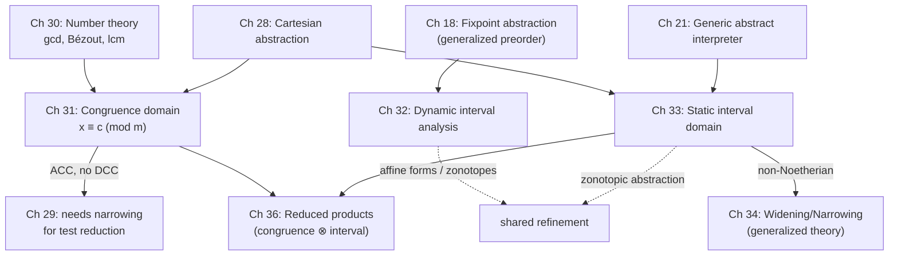

# Number-Theoretic and Interval Abstract Domains

[[book-guidelines|↩ Back to guidelines]]

## Why sign, parity, and constancy aren't enough

Chapter 28's Cartesian value domains — sign, parity, constancy — all share one property: they're *finite-height* lattices, or close to it. `is-even`, `is-positive`, `equals-7` are cheap facts with a small number of possible values. But two entire classes of real static-analysis questions don't fit that mold:

1. **"Is this value aligned?"** — `x` is a multiple of 4 (a pointer alignment fact), or `x % 3 == 1` (a hash-bucket invariant). This isn't parity generalized a little; it's genuinely modular arithmetic, and answering "what's the most precise congruence compatible with *both* of two facts?" requires solving a linear Diophantine equation.
2. **"How far can this value be?"** — `x` is somewhere in `[-3, 1000000]`. Interval bounds are unboundedly many (there's no finite lattice of intervals over the integers), and once you introduce floating point, you also inherit rounding error: the computed float interval must still soundly enclose every possible real value.

Chapters 30–33 build the machinery for both. Chapter 30 is a self-contained number-theory toolkit — Euclidean division, congruences, gcd, and the Bachet–Bézout identity — that chapter 31 needs to define a *congruence abstract domain*: the lattice join and meet of two modular facts literally cannot be computed without Bézout's identity. Chapters 32 and 33 then build interval arithmetic twice — once as a *dynamic* analysis (Ramon Moore's classical use, bounding rounding error one execution at a time) and once as a *static* analysis (compile-time range/box analysis over all executions) — closing with affine arithmetic and zonotopes, a shared refinement that recovers correlations plain intervals throw away.

The throughline across all four chapters is the same abstraction recipe from chapter 3: pick a concrete property, pick an abstraction function with a Galois connection, then *calculate* the abstract operations so they're sound by construction rather than inventing them and checking soundness after the fact. What differs, chapter to chapter, is how much extra mathematical infrastructure that calculation needs.



## Part I — Number theory as an abstraction toolkit (Chapter 30)

The chapter is deliberately a refresher: Cousot recalls Euclidean division, congruences, gcd, and the Bachet–Bézout identity purely because chapter 31 needs them as *load-bearing lemmas*, not as independent mathematics.

**Euclidean division.** For $n \in \mathbb{Z}$ and $d \in \mathbb{Z} \setminus \{0\}$, there is a unique pair $\langle q, r\rangle$ with $n = qd + r$ and $0 \le r < |d|$. If $r = 0$, $d$ divides $n$, written $d \mid n$.

**Congruence classes.** $c + m\mathbb{Z} \triangleq \{z \in \mathbb{Z} \mid \exists k \in \mathbb{Z}.\, z = c + km\}$ — all integers equal to $c$ modulo $m$. The same class can be written with different residues and moduli (e.g. $2 + 4\mathbb{Z} = 6 + (-4)\mathbb{Z}$), so the book fixes a **canonical form**: $m \ge 0$, and if $m \ne 0$, $0 \le c < m$. The set of all canonical congruences (plus $\emptyset$) is written $\mathbb{P}_\equiv$.

**gcd and the Bachet–Bézout identity.** The greatest common divisor is the usual thing, with $\gcd(0,0) \triangleq 0$ by convention. The identity that makes the congruence domain computable is:

$$
\textbf{Theorem 30.7 (Bachet–Bézout).}\quad \exists\, x, y \in \mathbb{Z}.\ ax + by = a \gcd b,
$$

and $a \gcd b$ is the *smallest positive* integer expressible as $ax + by$; every integer of that form is a multiple of $a \gcd b$. The proof is a nice example of well-founded induction doing real work: let $S = \{ax + by \in \mathbb{N}_+ \mid x, y \in \mathbb{Z}\}$, note $S$ is nonempty and well-founded so has a minimum $m = au + bv$, then show by contradiction (via Euclidean division of $a$ by $m$) that $m$ divides both $a$ and $b$ — hence $m \le a \gcd b$ — while $a \gcd b$, dividing both, must divide $m$ too, giving $m = a \gcd b$ by antisymmetry.

**Extended Euclidean division** computes explicit Bézout coefficients by running Euclid's algorithm and tracking, alongside each remainder $r_k$, coefficients $x_k, y_k$ such that $r_k = ax_k + by_k$ — the coefficients "come along for the ride" as the remainder sequence descends to $\gcd(a,b)$.

**lcm.** $(x \gcd y)(x \operatorname{lcm} y) = |xy|$ (lemma 30.11), proved via the same Bézout coefficients.

**What breaks without this.** Chapter 31's congruence *meet* — combining "$x \equiv c \pmod m$" and "$x \equiv c' \pmod {m'}$" into the single congruence class describing values satisfying both — is exactly the classical Chinese-Remainder-style problem of solving $xm + ym' = m \gcd m'$ for integer $x, y$. Without Bézout, you'd have no constructive way to build the combined residue; you'd only know that a solution exists.

A nice teaser exercise (30.14) already previews the whole book's method: "casting out nines" — checking `a * b = c` by verifying the check digits mod 9 — is itself an abstract interpretation, with $\alpha_9(n) \triangleq \sum_i d_i \pmod 9$ for a decimal digit sequence $d_k \ldots d_0$, sound (a real mismatch always shows) but incomplete (agreement doesn't guarantee correctness).

```rust
/// Extended Euclidean algorithm: returns (gcd, x, y) with a*x + b*y == gcd.
fn ext_gcd(a: i64, b: i64) -> (i64, i64, i64) {
    if b == 0 {
        (a, 1, 0)
    } else {
        let (g, x1, y1) = ext_gcd(b, a % b);
        (g, y1, x1 - (a / b) * y1)
    }
}
```

Lean's `Mathlib` carries this exact theorem as `Nat.gcd_eq_gcd_ab` / `Int.gcd_eq_gcd_ab`, computing Bézout coefficients via `Int.xgcd`. If you were formalizing chapter 31's lattice operations, this is precisely the lemma you'd reach for — the book's Theorem 30.7 *is* `Int.gcd_eq_gcd_ab` in different notation.

## Part II — The Cartesian congruence domain (Chapter 31)

The congruence domain discovers facts of the form $x = a \pmod b$ where *both* $a$ and $b$ are inferred automatically. It strictly generalizes constancy ($x \equiv c \pmod 0$, meaning "always $c$") and parity ($x \equiv p \pmod 2$).

**A worked trace.** Example 31.2 walks a small loop where `x` accumulates by 6 or resets, and `y` toggles by parity. Tracking congruence classes through the loop body and joining at the loop head, the analysis discovers — after two widening-free iterations, since the domain has no infinite ascending chains — that `x` stabilizes at $0 + 3\mathbb{Z}$ (congruent to 0 mod 3) while `y` becomes $\top$ (unconstrained). This is the payoff: a fact ("x is a multiple of 3") that neither sign, parity, nor constancy analysis could ever express, discovered automatically.

**Abstraction and Galois connection.** The abstraction $\alpha_\equiv$ maps a set of integers to its canonical congruence class; Theorem 31.6 establishes the Galois connection
$$
\langle \wp(\mathbb{Z}), \subseteq \rangle \xrightleftharpoons[\gamma_\equiv]{\alpha_\equiv} \langle \mathbb{P}_\equiv, \sqsubseteq_\equiv \rangle,
$$
and because $\alpha_\equiv$ is surjective (every canonical class is hit), Corollary 31.8 gives a genuine **complete lattice** structure on $\mathbb{P}_\equiv$ — pictured as an infinite tree in Figure 31.9, with $\emptyset$ at the bottom and $0 + 1\mathbb{Z} = \mathbb{Z}$ (the "everything" congruence, since mod 1 every integer is congruent) at the top.

**Join, disjointness, meet — the number theory paying off directly.**

$$
\textbf{Theorem 31.10 (join).}\quad (c + m\mathbb{Z}) \sqcup_\equiv (c' + m'\mathbb{Z}) = c + (m \gcd m' \gcd |c - c'|)\,\mathbb{Z}
$$

The join has to find the *coarsest* congruence consistent with both facts — the gcd of the two moduli and their residue gap. Concretely, $1 + 4\mathbb{Z} \sqcup_\equiv 3 + 6\mathbb{Z} = 1 + (4 \gcd 6 \gcd |1-3|)\mathbb{Z} = 1 + 2\mathbb{Z}$ — losing precision down to "odd."

$$
\textbf{Theorem 31.12 (disjointness).}\quad (c+m\mathbb{Z}) \sqcap_\equiv (c'+m'\mathbb{Z}) \ne \emptyset \iff c \equiv c' \pmod{m \gcd m'}
$$

This is what a Boolean test `x == y` needs: two congruence classes can only possibly agree if their residues match modulo their shared factor.

$$
\textbf{Theorem 31.14 (meet).}\quad (c+m\mathbb{Z}) \sqcap_\equiv (c'+m'\mathbb{Z}) = c'' + (m \operatorname{lcm} m')\mathbb{Z} \ \text{ if } c \equiv c' \!\!\pmod{m \gcd m'},\ \text{else } \emptyset
$$

with $c'' \equiv c + \dfrac{c'-c}{m \gcd m'}\, x\, m \pmod{m \operatorname{lcm} m'}$, where $x, y$ are **exactly the Bézout coefficients** of $xm + ym' = m \gcd m'$. This is the moment the two chapters fuse: you cannot state, let alone compute, the congruence meet without Theorem 30.7.

**Abstract arithmetic.** Negation, addition, subtraction, and multiplication all have closed forms — e.g. Theorem 31.19: $(c+m\mathbb{Z}) \oplus_\equiv (c'+m'\mathbb{Z}) = (c+c') + (m \gcd m')\mathbb{Z}$, again derived by calculational design (best-abstraction of the concrete sumset, simplified via Bézout).

**Ascending but not descending.** Theorem 31.25: $\langle \mathbb{P}_\equiv, \sqsubseteq_\equiv\rangle$ has **no infinite strictly increasing chain** (any strictly coarser class at least halves the modulus, so a chain has at most $1 + \log_2 m$ elements) — upward iteration during fixpoint computation always terminates. But it **does** have infinite strictly *decreasing* chains (e.g. $0 + 2\mathbb{Z} \sqsupset_\equiv 0 + 4\mathbb{Z} \sqsupset_\equiv 0 + 8\mathbb{Z} \sqsupset_\equiv \cdots$), so *test reduction* (chapter 29's local iteration that repeatedly narrows both operands of an equality test) is not guaranteed to terminate on its own and needs a narrowing to force convergence — a preview of the widening/narrowing machinery chapters 33–34 formalize in full.

```rust
#[derive(Clone, Copy, PartialEq, Eq, Debug)]
enum Congruence {
    Bottom,                 // ∅
    Class { c: i64, m: u64 }, // canonical: m == 0 means constant c; 0 <= c < m otherwise
}

fn ext_gcd(a: i64, b: i64) -> (i64, i64, i64) { /* as above */ unimplemented!() }

impl Congruence {
    fn join(self, other: Self) -> Self {
        use Congruence::*;
        match (self, other) {
            (Bottom, x) | (x, Bottom) => x,
            (Class { c: c1, m: m1 }, Class { c: c2, m: m2 }) => {
                let g = gcd(gcd(m1, m2), (c1 - c2).unsigned_abs());
                Class { c: c1.rem_euclid(g as i64), m: g }
            }
        }
    }
    fn meet(self, other: Self) -> Self {
        use Congruence::*;
        match (self, other) {
            (Bottom, _) | (_, Bottom) => Bottom,
            (Class { c: c1, m: m1 }, Class { c: c2, m: m2 }) => {
                let g = gcd(m1, m2);
                if (c1 - c2).rem_euclid(g as i64) != 0 { return Bottom; }
                // solve via extended Euclid — Bézout coefficients drive the CRT-style combination
                let (_, x, _) = ext_gcd(m1 as i64, m2 as i64);
                let l = lcm(m1, m2);
                let c = (c1 as i128 + (c2 - c1) as i128 / g as i128 * x as i128 * m1 as i128)
                    .rem_euclid(l as i128) as i64;
                Class { c, m: l }
            }
        }
    }
}
fn gcd(a: u64, b: u64) -> u64 { if b == 0 { a } else { gcd(b, a % b) } }
fn lcm(a: u64, b: u64) -> u64 { a / gcd(a, b) * b }
```

This is not a toy analogy — it's essentially what a real verifier's alignment/modular-arithmetic reasoning does, and it's the same combining move an SMT solver's linear-integer-arithmetic theory or a constraint propagator over modular constraints performs when tightening two `x ≡ · (mod ·)` facts into one.

Astrée, the book notes, uses this exact congruence domain in production to verify that data structures are aligned to word boundaries.

## Part III — Dynamic interval arithmetic (Chapter 32)

Ramon Moore's classical interval arithmetic was invented to *bound rounding error* in floating-point computation: instead of tracking one uncertain float $x$, track an enclosing pair $[\underline{x}, \overline{x}]$ guaranteed to contain the true real value. Cousot's reading: this is an abstract interpretation of the *real* trace semantics, where each real trace is overapproximated by one interval trace, computed at runtime, one execution at a time.

**Soundness contract.** For a function $f \in \mathbb{I}^n \to \mathbb{I}$ (over integers, machine integers, rationals, floats, or reals), the interval computation must satisfy
$$
\{f(x,y,\dots) \mid x \in [\underline{x},\overline{x}] \land y \in [\underline{y},\overline{y}] \land \dots\} \subseteq [\underline{f}, \overline{f}].
$$

**The abstraction.** $\alpha_i(S) \triangleq [\min S, \max S]$, $\gamma_i([\underline{x},\overline{x}]) \triangleq \{z \mid \underline{x} \le z \le \overline{x}\}$, forming a Galois connection $\langle \wp(\mathbb{I}), \subseteq\rangle \rightleftarrows \langle \mathbb{P}^i_{\mathbb{I}}, \sqsubseteq^i\rangle$.

**Arithmetic, derived by calculation, not guessed.**
$$
[\underline{x},\overline{x}] \oplus^i [\underline{y},\overline{y}] = [\underline{x}+\underline{y}, \overline{x}+\overline{y}], \qquad
[\underline{x},\overline{x}] \otimes^i [\underline{y},\overline{y}] = [\min(\underline{xy},\underline{x}\,\overline{y},\overline{x}\,\underline{y},\overline{xy}),\ \max(\cdots)]
$$
with reciprocal $[1,1] \oslash^i [\underline{x},\overline{x}] = [1/\overline{x}, 1/\underline{x}]$ when $0 \notin [\underline x,\overline x]$, else $[-\infty,\infty]$. Every algebraic identity you'd expect holds — associativity, commutativity, neutral elements — **except distributivity**, which only holds one-directionally:
$$
x \otimes^i (y \oplus^i z) \ \sqsubseteq^i\ (x \otimes^i y) \oplus^i (x \otimes^i z) \quad \text{(subdistributivity)}.
$$
This subdistributivity is the formal signature of interval arithmetic's central weakness: it forgets that two occurrences of the same variable are *the same value*. Concretely, if $x \in [1,4]$, then $x - x$ is computed as $[1,4] \ominus^i [1,4] = [1-4, 4-1] = [-3,3]$ instead of the exact $[0,0]$ — because the two operand intervals are evaluated independently, oblivious to their shared origin.

**Boolean tests have side effects — a genuine surprise.** For plain reals or floats, testing `x < y` never changes the value of `x` or `y`. But testing an interval-valued `x < y` narrows both operands' intervals to the sub-ranges consistent with the test outcome — e.g. if $x \in [-0.1, 0.1]$ and the test `x >= 0` succeeds, the interval of `x` narrows to $[0, 0.1]$. This forces the book to *change the underlying stateless trace semantics itself*: Boolean actions must now record the post-test environment ($B = \rho$, $\neg(B) = \rho$ rather than a side-effect-free Boolean), and the formula recovering a variable's value from trace history must be adjusted to pick up this narrowing. The soundness proof correspondingly can't use the ordinary fixpoint-abstraction machinery (subset ordering $\subseteq$) — it needs the more general **approximation preorder** $\lesssim$ (distinct from the computational/fixpoint order) and Theorem 18.21's generalized fixpoint-abstraction theorem, one of the rare places in the book that machinery is actually needed.

**Combinatorial branching.** Because a real execution takes exactly one branch of a conditional but an interval can straddle the test boundary, interval evaluation may have to explore *both* branches — worst case, exponentially many interval sub-traces for a single real execution. This is precisely why dynamic interval analysis, unlike the static version in chapter 33, remains computationally tractable only because it processes one concrete trace's worth of splitting at a time rather than all program paths simultaneously.

```rust
#[derive(Clone, Copy, Debug)]
struct Interval { lo: f64, hi: f64 } // lo = -inf, hi = +inf encode unbounded ends

impl Interval {
    fn add(self, o: Interval) -> Interval { Interval { lo: self.lo + o.lo, hi: self.hi + o.hi } }
    fn sub(self, o: Interval) -> Interval { Interval { lo: self.lo - o.hi, hi: self.hi - o.lo } }
    fn mul(self, o: Interval) -> Interval {
        let cands = [self.lo*o.lo, self.lo*o.hi, self.hi*o.lo, self.hi*o.hi];
        Interval { lo: cands.iter().cloned().fold(f64::INFINITY, f64::min),
                   hi: cands.iter().cloned().fold(f64::NEG_INFINITY, f64::max) }
    }
    /// Narrowing produced by a passed `x >= bound` test — the side effect chapter 32.5.5 formalizes.
    fn narrow_ge(self, bound: f64) -> Interval { Interval { lo: self.lo.max(bound), hi: self.hi } }
}
```

## Part IV — Affine arithmetic and zonotopes (§32.7, §33.10)

The $x - x \ne [0,0]$ failure above is the general symptom of [[Cartesian-Abstraction|Cartesian abstraction]]: variables are abstracted independently, so any correlation between them (including a variable's correlation *with itself* across an expression) is lost. **Affine arithmetic** repairs this locally by representing an interval as
$$
x = a_0 + a_1\varepsilon_1 + a_2\varepsilon_2 + \cdots + a_n\varepsilon_n, \qquad \varepsilon_i \in [-1,1],
$$
where each *noise symbol* $\varepsilon_i$ is shared across every affine form that depends on the same underlying source of uncertainty. Now $x - x = (a_0 + a_1\varepsilon_x) - (a_0 + a_1\varepsilon_x) = 0 + 0\varepsilon_x$ — exact, because both occurrences reference the *same* $\varepsilon_x$ rather than being independently re-abstracted. The concrete range recoverable from an affine form is $x \in [a_0 - d, a_0 + d]$ with total deviation $d = \sum_i |a_i|$ — the tightest interval consistent with each $\varepsilon_i$ ranging independently over $[-1,1]$.

For $m$ tracked variables, the joint affine constraints carve out a **zonotope** — a centrally symmetric convex polytope in $\mathbb{R}^m$ (a generalized parallelepiped) whose faces are themselves centrally symmetric. Zonotopes appear twice in this pair of chapters: chapter 32.7 uses them to sharpen *dynamic* rounding-error tracking, and chapter 33.10 notes the identical construction improving the precision of *static* interval reachability analysis — the same correlation problem, same fix, in both the runtime and compile-time settings.

## Part V — Static interval / range analysis (Chapter 33)

Where dynamic interval analysis abstracts *one* execution trace at runtime, static interval (a.k.a. range, or box) analysis is a **Cartesian abstraction of the reachability semantics** (chapter 19) — it must soundly cover *every* possible execution, in finite time, at compile time. Same basic arithmetic operators as chapter 32; a genuinely different problem to solve.

**The interval lattice, precisely.** $\mathbb{D}^i \triangleq \langle \mathbb{P}^i, \sqsubseteq^i, \bot^i, \top^i, \sqcup^i, \sqcap^i\rangle$, with $\bot^i = \emptyset$, $\top^i = [-\infty,\infty]$,
$$
\bigsqcup^i_{k\in\Delta}[\ell_k,h_k] = \Big[\min_{k}(\ell_k),\ \max_{k}(h_k)\Big], \qquad
\bigsqcap^i_{k\in\Delta}[\ell_k,h_k] = \Big[\max_{k}(\ell_k),\ \min_{k}(h_k)\Big].
$$
This is a genuine complete lattice (Figure 33.1 draws the layered Hasse diagram of nested integer intervals), instantiating the generic Cartesian abstract interpreter of chapters 21/28 with the interval value domain.

**Divergence — the central obstacle.** Consider a trivial diverging loop incrementing `x`. The fixpoint computation reduces to solving $x = \mathcal{F}^i(x)$ where $\mathcal{F}^i(x) = [0,0] \sqcup^i (x \oplus^i [1,1])$, whose iterates are $[0,0], [0,1], [0,2], \ldots$ — an infinite ascending chain that never stabilizes by ordinary Kleene iteration. Cousot lists the four standard responses: restrict to finitary domains (loses expressiveness), ask a human for the inductive invariant (costly, brittle under program edits), *soundly automate* convergence via widening/narrowing (this chapter's answer, at the cost of precision), or unsoundly cap the iteration count (rejected — "no convincing scientific justification").

**Widening — extrapolation.**
$$
\bot^i \nabla^i x = x \nabla^i \bot^i = x, \qquad
[\ell_1,h_1] \nabla^i [\ell_2,h_2] = \big[(\ell_2 < \ell_1 \,{?}\, {-\infty} : \ell_1),\ (h_2 > h_1 \,{?}\, \infty : h_1)\big].
$$
Any bound that keeps moving gets pushed straight to infinity. Running this on the diverging example: $\hat{x}^0 = \bot^i$, $\hat{x}^1 = [0,0]$, $\hat{x}^2 = [0,0] \nabla^i [0,1] = [0,\infty]$, and the sequence stabilizes there — sound, terminating, but already looser than necessary.

**Narrowing — interpolation, recovering only what it can.** On the classic example (`while (x < 1001) x = x + 1;`), widening alone overshoots to $\hat x = [0,\infty]$, $\hat y = [1001, \infty]$ even though the *true* answer is $x \in [0,1001]$, $y = [1001,1001]$. The fix is a **downward** narrowing pass after widening stabilizes:
$$
\bot^i \Delta^i x = x \Delta^i \bot^i = \bot^i, \qquad
[\ell_1,h_1] \Delta^i [\ell_2,h_2] = \big[(\ell_1 = {-\infty} \,{?}\, \ell_2 : \ell_1),\ (h_1 = \infty \,{?}\, h_2 : h_1)\big],
$$
which only tightens bounds that are *already infinite* — a conservative interpolation, never an arbitrary shrink. Iterating narrowing on the diverging example does recover the tight $x = [0,1001]$. But narrowing is not a universal cure: it cannot recover information lost purely by the interval abstraction itself (e.g. parity information gets flattened away regardless, only recoverable by a reduced product with a parity or congruence domain — chapter 36), nor can it always recover precision the widening itself threw away arbitrarily.

**Test reduction meets narrowing.** The interval domain satisfies the ascending chain condition but *not* the descending one, so local test-reduction iteration (chapter 29) over intervals can run for very many steps — e.g. a test like `x < y && y < x` shrinking bounds by 1 each round until reaching $\bot^i$. A narrowing bounds this cost, at a precision loss, which is why implementations typically allow a small threshold of pure (unnarrowed) iterations before switching to narrowing.

**Modular interval analysis.** Real machines have bounded integer types. Two semantics are possible: overflow-as-error (handled by treating $-\infty, \infty$ as `min_int`/`max_int` directly in the widening/narrowing) or wraparound/modular semantics (`min_int - 1 = max_int`), which needs care in the interval domain to remain sound under wraparound.

**Constancy revisited.** The constancy domain of chapter 28 satisfies the ascending chain condition — but *only* if the underlying variable-value set is finite. Restricted to a program's actual (finite) variable set, no extrapolation is ever needed; only "symbolic constancy" over an unbounded universe of symbolic values would reintroduce the need for a widening.

**Zonotopic abstraction, again.** Section 33.10 closes the loop with Part IV: the same zonotope construction that sharpens dynamic rounding-error bounds also sharpens static interval reachability, recovering variable correlations a plain Cartesian interval domain cannot express.

```rust
#[derive(Clone, Copy, Debug)]
struct StaticInterval { lo: f64, hi: f64 } // -inf/+inf represent unbounded ends; lo > hi encodes ⊥

impl StaticInterval {
    fn widen(self, next: Self) -> Self {
        StaticInterval {
            lo: if next.lo < self.lo { f64::NEG_INFINITY } else { self.lo },
            hi: if next.hi > self.hi { f64::INFINITY } else { self.hi },
        }
    }
    fn narrow(self, refined: Self) -> Self {
        StaticInterval {
            lo: if self.lo == f64::NEG_INFINITY { refined.lo } else { self.lo },
            hi: if self.hi == f64::INFINITY { refined.hi } else { self.hi },
        }
    }
}
```

## Where this leads

This quartet of chapters closes the "value domains beyond sign/parity" arc opened in chapter 28, and sets up two threads that resurface repeatedly later in the book:

- **Widening and narrowing, generalized.** Chapter 33's interval-specific $\nabla^i / \Delta^i$ are the motivating instance of the fully general theory of chapter 34 — soundness and termination conditions for widenings and narrowings on *any* non-Noetherian abstract domain, and the theorem that a genuinely terminating widening cannot be increasing in its first argument. If you're building a fixpoint engine for a Rust-based verifier over an unbounded abstract domain (intervals, polyhedra, whatever), this chapter's worked examples are the concrete instance to keep in mind while implementing chapter 34's general widening/narrowing interface.
- **Reduced products.** Both the congruence domain (loses which value within a range) and the interval domain (loses which residue class) are individually weak in ways the *other* domain complements — the book explicitly flags that combining interval and congruence/parity analysis via a reduced product (chapter 36) recovers precision neither has alone (e.g. recovering that a loop variable is even *and* bounded, when interval analysis alone only gets the bound).
- **This is literally SMT/CP machinery.** The congruence domain's join/meet computation is the same operation a linear-integer-arithmetic theory solver performs when tightening modular constraints; interval widening/narrowing is structurally identical to bound propagation in interval constraint-programming solvers, right down to needing an extrapolation step to guarantee termination over unbounded domains. If your target is a Hoare-triple verifier with an embedded constraint solver, these four chapters are close to a direct blueprint for the numeric-domain layer: a `Congruence` type and an `Interval` type, each a complete lattice with sound join/meet/arithmetic, composed via reduced product, driven to a fixpoint by widening-then-narrowing.
- **Bézout's identity as a recurring tool.** Beyond the congruence meet, Bézout-style reasoning (solving $ax + by = \gcd(a,b)$) is the standard device anywhere Diophantine constraints need combining — worth keeping in your toolkit for any modular or linear-arithmetic constraint layer, independent of this specific domain.
