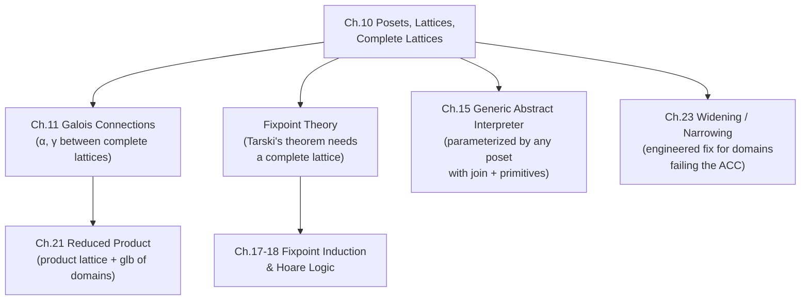

[[book-guidelines|↩ Back to guidelines]]

## Why the book needs a chapter about $\subseteq$ before it can talk about abstraction

Look back at what chapters 3 and 8 already did without ever saying the word "poset." Chapter 3 built an abstract sign domain $\mathbb{P}_\pm = \{\bot_\pm, {<}0, {=}0, {>}0, \dots, \top_\pm\}$ and ordered it by "more precise than" ($\sqsubseteq_\pm$). Chapter 8 built a hierarchy of program properties — collecting semantics, trace properties, invariance properties — each one a coarsening of the one before it, related by $\subseteq$. Both chapters were quietly relying on the same structural fact: **"is at least as precise as" behaves like set inclusion**, even when the things being compared aren't literally sets of program states anymore (they're abstract tokens like `<0` or `>0`).

That's the problem this chapter solves. If every abstract domain in the book had to be *literally* a family of sets ordered by $\subseteq$, you'd lose most of the freedom that makes abstract interpretation useful — you couldn't use a finite lattice of signs, a numeric interval $[a,b]$, a congruence class, or a DFA state as an abstract property, because none of those are naturally "sets of something" in the way $\wp(\mathbb{Z})$ is. What you actually need is *whatever it is about $\subseteq$ that made the earlier arguments work* — reflexivity, antisymmetry, transitivity — stripped out and generalized. That generalization is a **partial order** $\sqsubseteq$, and a set equipped with one is a **poset**. Cousot puts it directly at the top of the chapter (p. 142): *"Partial order theory is an abstraction of set theory in which $\in$ is expressed in terms of $\subseteq$, and $\subseteq$ is abstracted as a partial order $\sqsubseteq$."* This is itself the book's very first worked example of abstract interpretation as a method — you take a concrete structure ($\wp(S), \subseteq$), keep only the algebraic properties you actually use, and get a more general structure that fits many more encodings.

**What breaks without this generalization:** every abstract domain the book builds later — signs, intervals, congruences, points-to graphs, type lattices, DBMs for zones and octagons — would need an ad-hoc proof that its own comparison relation "behaves like inclusion." Chapter 10 proves the relevant facts (existence of bounds, duality, fixpoints on chains) once, for *any* poset, so every later chapter just has to check three axioms and inherit everything else for free.

## Posets: keeping only what $\subseteq$ is really made of

**Definition (poset, p. 142).** A poset $\langle \mathbb{P}, \sqsubseteq \rangle$ is a set $\mathbb{P}$ equipped with a relation $\sqsubseteq$ that is:

$$
\begin{aligned}
&\textbf{Reflexive:} && \forall x \in \mathbb{P}.\ x \sqsubseteq x \\
&\textbf{Antisymmetric:} && \forall x,y \in \mathbb{P}.\ (x \sqsubseteq y \wedge y \sqsubseteq x) \Rightarrow x = y \\
&\textbf{Transitive:} && \forall x,y,z \in \mathbb{P}.\ (x \sqsubseteq y \wedge y \sqsubseteq z) \Rightarrow x \sqsubseteq z
\end{aligned}
$$

Two elements $x, y$ are **comparable** if $x \sqsubseteq y$ or $y \sqsubseteq x$, and **incomparable** otherwise — this is the crucial thing $\subseteq$-on-sets already exhibits (e.g. $\{1\}$ and $\{2\}$ are incomparable under $\subseteq$) and which order theory keeps as a first-class possibility rather than an edge case. A **total order** additionally requires every pair to be comparable. The book also records two neighboring notions worth naming precisely because they recur later:

- A **strict partial order** $\sqsubset$ is irreflexive and transitive; every $\sqsubseteq$ induces one via $x \sqsubset y \triangleq x \sqsubseteq y \wedge x \neq y$, and vice versa ($x \sqsubseteq y \triangleq x \sqsubset y \vee x = y$).
- A **preorder** $\preccurlyeq$ drops antisymmetry (reflexive + transitive only). This matters because a preorder is what you naturally get when two distinct elements can be "equally precise" without being *equal* — e.g. two syntactically different but logically equivalent formulas. The book shows (p. 143) that you always recover a genuine partial order by quotienting: define $x \equiv y \triangleq x \preccurlyeq y \wedge y \preccurlyeq x$ (an equivalence relation), take the quotient set $\mathbb{P}/{\equiv}$, and $\preccurlyeq$ descends to a partial order on the equivalence classes. This is a pattern you'll see again: whenever a "natural" comparison relation isn't quite antisymmetric, quotienting by mutual comparability repairs it.

**What breaks without allowing incomparability:** if the book had insisted every abstract domain be totally ordered, most useful domains would be excluded outright — the sign domain has incomparable elements ($<0$ and $>0$), interval endpoints don't linearize cleanly against congruences, and type lattices are essentially never total. Partial order is the right generality precisely because "more precise than" is not always decidable between two arbitrary abstract elements.

### Grounding: posets as a trait, and as a quotient

In **Rust**, a poset is naturally a partial order, and Rust's standard library already draws exactly this distinction: `PartialOrd` (reflexive, antisymmetric, transitive, but `partial_cmp` can return `None` for incomparable pairs) versus `Ord` (a total order, `cmp` never fails). This is not a coincidence — it's literally the poset/total-order distinction from the book, and it's why you cannot always sort a `Vec` of abstract domain elements without first deciding what to do with incomparable pairs.

```rust
#[derive(Clone, Copy, PartialEq, Debug)]
enum Sign { Bottom, Neg, Zero, Pos, NonPos, NonZero, NonNeg, Top }

use Sign::*;

impl PartialOrd for Sign {
    fn partial_cmp(&self, other: &Self) -> Option<std::cmp::Ordering> {
        use std::cmp::Ordering::*;
        match (self, other) {
            (a, b) if a == b => Some(Equal),
            (Bottom, _) | (_, Top) => Some(Less),
            (_, Bottom) | (Top, _) => Some(Greater),
            (Neg, NonPos) | (Neg, NonZero) => Some(Less),
            (Zero, NonPos) | (Zero, NonNeg) => Some(Less),
            (Pos, NonZero) | (Pos, NonNeg) => Some(Less),
            (NonPos, Neg) | (NonZero, Neg) => Some(Greater),
            (NonPos, Zero) | (NonNeg, Zero) => Some(Greater),
            (NonZero, Pos) | (NonNeg, Pos) => Some(Greater),
            _ => None, // incomparable, e.g. Neg vs Pos, or NonPos vs NonNeg
        }
    }
}
```

That `None` arm *is* the poset structure doing its job: `Sign::Neg` and `Sign::Pos` genuinely have no precision relationship, and forcing a total order here (as `Ord` would) would silently misrepresent the domain.

In **Lean**, the same distinction exists as `Preorder`, `PartialOrder`, and `LinearOrder` in Mathlib, built exactly by adding axioms on top of each other the way the book does:

```lean
class MyPreorder (α : Type) extends LE α where
  le_refl : ∀ a : α, a ≤ a
  le_trans : ∀ a b c : α, a ≤ b → b ≤ c → a ≤ c

class MyPartialOrder (α : Type) extends MyPreorder α where
  le_antisymm : ∀ a b : α, a ≤ b → b ≤ a → a = b
```

Mathlib's actual `PartialOrder` is defined exactly this way (as a `Preorder` plus `le_antisymm`), and the quotient construction the book describes on p. 143 — turning a preorder into a partial order by quotienting by $\equiv$ — is precisely `Quotient` applied to the `AntisymmRel` of a preorder in Mathlib. If you ever need "definitional equality up to the preorder," this is the formal mechanism.

## Hasse diagrams: drawing $\sqsubseteq$ without redundancy

A poset's full relation $\sqsubseteq$ is redundant to draw — reflexivity and transitivity mean most pairs $x \sqsubseteq y$ are implied by a much smaller set of *direct* relationships. The book defines the **covering relation** (p. 143):

$$
x \lessdot y \ \triangleq\ x \sqsubset y \wedge \nexists z \in \mathbb{P}.\ x \sqsubset z \wedge z \sqsubset y
$$

("$y$ covers $x$": $x \sqsubset y$ with nothing strictly in between.) A **Hasse diagram** places one point $p_x$ per element, draws $p_x$ strictly below $p_y$ whenever $x \sqsubset y$, and draws a line segment between $p_x$ and $p_y$ only when $x \lessdot y$. The full order $\sqsubseteq$ is recovered by taking the reflexive-transitive closure of the drawn edges; two unconnected points (with no path of rising segments between them) are incomparable. Below is the sign lattice from chapter 3, redrawn this way — one of the diagrams the book itself points back to (section 3.12):

<svg viewBox="0 0 420 260" xmlns="http://www.w3.org/2000/svg" font-family="sans-serif" font-size="15">
  <style>
    .node { fill: #4a90d9; stroke: #2c5a8a; stroke-width: 1.5; }
    .edge { stroke: #888888; stroke-width: 1.5; }
    .lbl { fill: #333333; }
  </style>
  <line class="edge" x1="210" y1="30" x2="120" y2="90"/>
  <line class="edge" x1="210" y1="30" x2="210" y2="90"/>
  <line class="edge" x1="210" y1="30" x2="300" y2="90"/>
  <line class="edge" x1="120" y1="90" x2="60" y2="150"/>
  <line class="edge" x1="120" y1="90" x2="180" y2="150"/>
  <line class="edge" x1="210" y1="90" x2="60" y2="150"/>
  <line class="edge" x1="210" y1="90" x2="240" y2="150"/>
  <line class="edge" x1="300" y1="90" x2="180" y2="150"/>
  <line class="edge" x1="300" y1="90" x2="240" y2="150"/>
  <line class="edge" x1="60" y1="150" x2="150" y2="210"/>
  <line class="edge" x1="180" y1="150" x2="150" y2="210"/>
  <line class="edge" x1="240" y1="150" x2="150" y2="210"/>
  <circle class="node" cx="210" cy="30" r="6"/>
  <text class="lbl" x="222" y="35">⊤ (any value)</text>
  <circle class="node" cx="120" cy="90" r="6"/>
  <text class="lbl" x="30" y="82">≤0</text>
  <circle class="node" cx="210" cy="90" r="6"/>
  <text class="lbl" x="222" y="95">≠0</text>
  <circle class="node" cx="300" cy="90" r="6"/>
  <text class="lbl" x="312" y="95">≥0</text>
  <circle class="node" cx="60" cy="150" r="6"/>
  <text class="lbl" x="18" y="145">&lt;0</text>
  <circle class="node" cx="180" cy="150" r="6"/>
  <text class="lbl" x="192" y="145">=0</text>
  <circle class="node" cx="240" cy="150" r="6"/>
  <text class="lbl" x="252" y="145">&gt;0</text>
  <circle class="node" cx="150" cy="210" r="6"/>
  <text class="lbl" x="162" y="215">⊥ (unreachable)</text>
</svg>

Note what's *missing*: there is no segment directly from $\top$ to $\bot$, or from $\top$ to `<0` — those relationships hold ($\bot \sqsubseteq \top$ certainly) but are implied by transitivity through intermediate nodes, so a Hasse diagram omits them to stay readable. `<0` and `>0` are unconnected by any rising path — they're incomparable, exactly matching the `None` arm in the Rust `partial_cmp` above.

**What breaks without the covering relation:** if you drew every pair $x \sqsubseteq y$ as an edge, a lattice with $n$ elements could need up to $O(n^2)$ edges, most of them logically redundant; the covering relation is the minimal generating set from which $\sqsubseteq$ is reconstructible, which is both a readability property (for humans drawing diagrams) and a computational one (for implementations wanting a compact "immediate successor" representation of an abstract domain, e.g. widening operators that walk one covering step at a time).

## Bounds: upper bound, lub, maximum, supremum

For a poset $\langle \mathbb{P}, \sqsubseteq \rangle$ and a subset $S \subseteq \mathbb{P}$, the book distinguishes four progressively stronger notions (p. 144):

| Notion | Definition | Guaranteed unique? |
|---|---|---|
| Upper bound $u$ | $u \in \mathbb{P} \wedge \forall x \in S.\ x \sqsubseteq u$ | No — there can be many |
| Least upper bound $\sqcup S$ (join) | an upper bound $\sqsubseteq$ every other upper bound | Yes, if it exists |
| Maximum $M$ | $M = \sqcup S \in S$ (the lub happens to *be* a member of $S$) | Yes, if it exists |
| Supremum $\top$ | $\top = \sqcup \mathbb{P} \in \mathbb{P}$ (lub of the *whole* poset) | Yes, if it exists |

The binary case $\sqcup\{x,y\}$ gets the familiar infix notation $x \sqcup y$. This four-tier distinction matters precisely because in general posets, upper bounds are cheap (many can exist) but a *least* upper bound is not guaranteed to exist at all — that non-guarantee is exactly what separates a mere poset from a lattice, below.

**What breaks without distinguishing "an upper bound" from "the least upper bound":** abstract interpretation needs the *most precise* sound overapproximation, not just *some* sound overapproximation — otherwise you could always cheat by returning $\top$ (the useless "could be anything" answer) and call it sound. The whole notion of *best abstraction* that chapter 11's Galois connections formalize presupposes that lubs — least, not just any — are well-defined operations you can calculate with.

### Grounding: bounds as a fold, join as `Option` merge

```rust
// A join that may not exist (incomparable elements have no lub in a bare poset)
fn upper_bounds<'a, T: PartialOrd + Copy>(pool: &'a [T], s: &[T]) -> Vec<T> {
    pool.iter().copied()
        .filter(|&u| s.iter().all(|&x| x.partial_cmp(&u)
            .map_or(false, |o| o != std::cmp::Ordering::Greater)))
        .collect()
}
```

In a genuine lattice (next section) the join is total and you'd instead implement `fn join(&self, other: &Self) -> Self` directly — exactly the shape of the sign-lattice's `⊔` operator that chapter 3's abstract interpreter calls at every control-flow merge point.

## The duality principle: get the other half of every theorem for free

**Definition (p. 145).** The **order dual** of a statement is obtained by swapping $\sqsubseteq \leftrightarrow \sqsupseteq$, upper $\leftrightarrow$ lower, least $\leftrightarrow$ greatest, $\sqcup \leftrightarrow \sqcap$, join $\leftrightarrow$ meet, maximum $\leftrightarrow$ minimum. The **duality principle**: *any statement true for all posets remains true, in its dualized form, for all posets* — because "poset" itself is a self-dual notion (reversing $\sqsubseteq$ to $\sqsupseteq$ produces another poset satisfying the same three axioms).

This is not a minor bookkeeping trick — it's a genuine proof-effort halver. Every theorem the book proves about $\sqcup$ (joins, upper bounds, suprema) it gets to *assert without reproof* about $\sqcap$ (meets, lower bounds, infima). Example 10.2 makes a subtlety explicit: dualizing "$f$ is increasing" (w.r.t. *both* orders $\le$ and $\sqsubseteq$ at once) still gives "$f$ is increasing" — the property is self-dual — whereas dualizing only *one* of the two orders turns "increasing" into "decreasing." Getting this precise (full duality vs. semi-duality on one argument) matters later: [[Cartesian-Abstraction|Cartesian abstraction]] and reduced products (chapters 20–21) and order-dual analyses like liveness (chapter 27, explicitly named "order dual abstract interpretation" in the topic list) are exactly instances of applying duality to only part of a construction.

**What breaks without stating duality as a principle:** you'd end up manually re-deriving every glb/meet/infimum fact by mimicking the lub/join/supremum proof line by line — which is exactly the kind of redundant, error-prone bookkeeping the calculational method (chapter 3's whole selling point) is designed to eliminate.

## Lattices: when finite joins and meets always exist

A poset is a:

- **Join semilattice** if $\forall x,y \in \mathbb{P}.\ x \sqcup y$ exists in $\mathbb{P}$;
- **Meet semilattice** if $\forall x,y \in \mathbb{P}.\ x \sqcap y$ exists in $\mathbb{P}$;
- **Lattice** if both hold — every pair has both a join and a meet, hence (by induction via associativity) every *nonempty finite* subset does too.

Example 10.3 (p. 145, reproduced in the diagram above and below) is instructive precisely because it shows the failure modes: a bare poset (two disconnected 2-chains, neither joins nor meets across the gap), a meet-lattice shaped like $\vee$ (two incomparable tops share a meet at the bottom but have no common upper bound — no join), a join-lattice shaped like $\wedge$ (dually), and a genuine lattice shaped like a diamond $\diamond$ (both exist). $\langle \mathbb{N}, \le \rangle$ is a lattice with meet $=\min$ and join $=\max$ on finite subsets.

Exercise 10.5 records the equational characterization worth internalizing because it's the version most programming-language treatments of lattices actually use: $\sqcup, \sqcap$ are idempotent, commutative, associative, and satisfy **absorption** ($(x \sqcap y) \sqcup x = x$ and $(x \sqcup y) \sqcap x = x$) — and conversely, any two such operations *define* a lattice order via $x \sqsubseteq y \triangleq x \sqcap y = x$. This is the route most type-class libraries take: define `join`/`meet` algebraically, derive the order, rather than the other way around.

A **sublattice** $\langle S, \sqsubseteq, \sqcup, \sqcap \rangle$ of $L$ requires $S$ to be *closed* under $L$'s own join and meet ($\forall x,y \in S.\ x \sqcup y \in S \wedge x \sqcap y \in S$) — Exercise 10.6 flags that a subset can happen to be a lattice under the restricted order *without* being a sublattice, if its own joins/meets disagree with $L$'s.

**What breaks without lattices:** finite semilattices are exactly what let a static analyzer combine information at control-flow merge points (`if`/`while` join points) with a single well-defined operator, rather than a case-by-case merge policy. Without the join existing for *every* pair, "merge the analysis results from both branches of an `if`" would sometimes have no answer.

### Grounding: a `Lattice` trait, and Lean's `Lattice` class

```rust
trait Lattice: PartialOrd + Sized {
    fn join(&self, other: &Self) -> Self; // ⊔, the least upper bound
    fn meet(&self, other: &Self) -> Self; // ⊓, the greatest lower bound
}

// Absorption as a property-based test, mirroring exercise 10.5:
fn check_absorption<L: Lattice + PartialEq + Clone>(x: &L, y: &L) -> bool {
    x.meet(y).join(x) == *x && x.join(y).meet(x) == *x
}
```

This trait shape is exactly the interface chapter 15's "generic abstract interpreter" parameterizes over: any abstract domain that implements `join` (and, dually, `meet` for reductions in chapter 21) can be plugged into the same fixpoint-iteration machinery, regardless of whether it's signs, intervals, or points-to sets underneath.

In **Lean**, Mathlib's `Lattice` class is built the same way, as a `PartialOrder` plus `sup`/`inf` (⊔/⊓) satisfying exactly the Galois-connection-flavored characterization `a ⊔ b ≤ c ↔ a ≤ c ∧ b ≤ c` (dually for `inf`) — which is provably equivalent to the book's upper/lower-bound definition and to the absorption-law definition. If you're building a bidirectional type checker with subtyping, the join of two types (their least common supertype) and meet (greatest common subtype) are literally lattice operations in this exact sense — this is not an analogy, it's the same mathematical object your elaborator's subtyping-join/meet computation will need when unifying or generalizing types.

## Complete lattices: when *every* subset — not just finite ones — has a join

A **complete lattice** (p. 146) is a poset $\langle \mathbb{P}, \sqsubseteq \rangle$ in which *every* subset $S \in \wp(\mathbb{P})$ — not only finite ones — has a lub $\sqcup S$. Two consequences drop out immediately:

- Taking $S = \mathbb{P}$ gives a **supremum** $\top = \sqcup \mathbb{P}$.
- Taking $S = \emptyset$ gives an **infimum** $\bot = \sqcup \emptyset$ — because *every* element $x$ is vacuously an upper bound of $\emptyset$ ($\forall y \in \emptyset.\ y \sqsubseteq x$ holds trivially), so the *least* upper bound of $\emptyset$ is the least element of the whole poset.

That $\bot = \sqcup \emptyset$ derivation is worth sitting with — it's a clean example of how far you can push a definition by taking it fully literally rather than special-casing the empty set, and it recurs constantly in the book's later [[Fixpoint-Theory|fixpoint theory]] (an empty iteration sequence's "join so far" is $\bot$, which is exactly the right base case for least-fixpoint iteration).

$\langle \mathbb{N}, \le \rangle$ is a lattice but **not** complete ($\mathbb{N}$ itself has no lub — there's no largest natural number). Adjoining a point at infinity fixes this: $\langle \mathbb{N} \cup \{\infty\}, \le \rangle$ with $\forall n \in \mathbb{N}.\ n < \infty \le \infty$ is complete, with $\top = \infty, \bot = 0$. The book's canonical complete lattice is the powerset: $\langle \wp(S), \subseteq, \emptyset, S, \cup, \cap \rangle$ — which is precisely the concrete side of *every* Galois connection the book builds before it introduces general complete lattices as abstract targets.

Exercises 10.7–10.9 establish three structural facts the rest of the book leans on constantly without restating: a complete lattice automatically has arbitrary **glbs** too (via $\sqcap S = \sqcup \{x \in \mathbb{P} \mid \forall y \in S.\ x \sqsubseteq y\}$, the set of lower bounds); $\sqcup$ is **monotone** ($X \subseteq Y \Rightarrow \sqcup X \sqsubseteq \sqcup Y$); and a **Cartesian product** of (complete) lattices is again a (complete) lattice under the componentwise order $\langle x,y \rangle \le_\times \langle x',y' \rangle \Leftrightarrow x \le x' \wedge y \sqsubseteq y'$ — this last fact is exactly what licenses building a combined abstract domain (e.g. sign $\times$ interval) as a product lattice, which chapter 21's "reduced product" then refines.

**What breaks without completeness:** [[Fixpoint-Theory#Tarski's fixpoint theorem|Tarski's fixpoint theorem]] (chapter 11, foreshadowed here) — the fact that *every* monotone function on a complete lattice has a least fixpoint, unconditionally — requires arbitrary joins to exist, not just finite ones, because the least fixpoint is constructed as the join of a (possibly infinite, possibly transfinite) iteration sequence. A merely-finite lattice wouldn't support this without extra hypotheses.

### Grounding: powerset as the paradigm complete lattice, in Rust and Lean

```rust
use std::collections::BTreeSet;

// ⟨℘(S), ⊆, ∅, S, ∪, ∩⟩ — the paradigm complete lattice
fn join_all<T: Ord + Clone>(sets: &[BTreeSet<T>]) -> BTreeSet<T> {
    sets.iter().fold(BTreeSet::new(), |acc, s| acc.union(s).cloned().collect())
}
// join_all(&[]) == ∅ == ⊥ : the empty join is the bottom element, exactly per p.146
```

In **Lean**, `CompleteLattice` is a `Lattice` plus `sSup`/`sInf` over arbitrary `Set α`, and `Set α` itself is registered as a `CompleteLattice` instance precisely by mirroring $\langle \wp(S), \subseteq, \emptyset, S, \cup, \cap \rangle$ — so `sSup (∅ : Set (Set α)) = ∅` is Lean proving the book's $\sqcup \emptyset = \bot$ fact definitionally. This is also the type of structure Lean's own `CompleteLattice` instance for `Set (Metavariable → Term)` (or similar) would sit on if you were formalizing a constraint-propagation domain for a unification engine — abstract domains in your compiler/verifier project are, structurally, exactly instances of this class.

## Pointwise extension: lifting an order to functions

Given a poset $\langle \mathbb{P}, \sqsubseteq \rangle$ and any set $S$, the **pointwise extension** (p. 147) orders the function space $S \to \mathbb{P}$ by $f \mathrel{\dot\sqsubseteq} g \Leftrightarrow \forall x \in S.\ f(x) \sqsubseteq g(x)$, with pointwise join $(f \mathrel{\dot\sqcup} g)(x) \triangleq f(x) \sqcup g(x)$ and dually for meet. Exercise 10.10 confirms the extension preserves the source structure exactly: poset stays poset, (complete) lattice stays (complete) lattice. Exercise 10.11 sharpens this for a complete lattice $\mathbb{P}$: the *increasing* functions $\mathbb{P} \to \mathbb{P}$, the *arbitrary-join-preserving* functions, and the *arbitrary-meet-preserving* functions each form a complete lattice under the pointwise order.

This is exactly why an **environment**, $\rho \in \mathbb{V} \to \mathbb{Z}$ in chapter 3's terms, or more generally an abstract environment $\mathbb{V} \to \mathbb{P}_\pm$, inherits a well-defined order and join "for free" the moment the value domain has one — the analysis never has to separately define what it means for one variable-[[Forward-Reachability-Semantics#Assignment|assignment]] map to be "more precise than" another.

## Chains and the ascending chain condition: when iteration is guaranteed to stop

A **chain** $C \subseteq \mathbb{P}$ is a *totally ordered* subset: $\forall x,y \in C.\ x \sqsubseteq y \vee y \sqsubseteq x$ (p. 148). A denumerable **ascending chain** is a sequence $x_0 \sqsubseteq x_1 \sqsubseteq \dots \sqsubseteq x_n \sqsubseteq x_{n+1} \sqsubseteq \dots$; it is **ultimately stationary** if $\exists \ell.\ \forall i \ge \ell.\ x_i = x_\ell$ — the sequence eventually stops changing. A poset is **Noetherian** (satisfies the **ascending chain condition**, ACC) if *every* increasing chain is ultimately stationary, equivalently every strictly ascending chain is finite. The **descending chain condition** (DCC) is the order dual — and note that duality (section 10.4) hands you DCC's entire theory for free the moment ACC's is proved.

This condition is the single most consequential idea in the chapter for anything you'll actually *implement*: **an analysis that iterates by repeatedly applying a monotone transformer and taking joins is only guaranteed to terminate if the abstract domain satisfies the ACC.** The sign lattice is finite, hence trivially Noetherian — iteration there always halts. The interval domain (chapter 22) is *not* Noetherian — $[0,0] \sqsubset [0,1] \sqsubset [0,2] \sqsubset \dots$ is an infinite strictly ascending chain — which is exactly why chapter 23 has to introduce widening operators: a deliberate, engineered violation of naive fixpoint iteration's termination argument, replaced with an extrapolation guaranteed to converge even without the ACC.

Exercise 10.13 states a fact worth remembering as a shortcut: **any Noetherian lattice is automatically a complete lattice** — finiteness of every ascending chain is enough to promote finite joins to arbitrary ones.

**What breaks without the ACC:** without it, "iterate the abstract transformer until the result stops changing" is not an algorithm — it's a possibly-nonterminating procedure with no termination argument at all. The entire calculational-design promise of chapter 3 (derive a *terminating* static analyzer by construction) is contingent on either working in a Noetherian domain, or explicitly engineering around the lack of one (widening).

### Grounding: ACC as a loop-termination proof obligation

```rust
// Fixpoint iteration only terminates as an algorithm if the domain is Noetherian
// (or a widening ▽ is used instead of plain ⊔ — see chapter 23).
fn least_fixpoint<L: Lattice + PartialEq + Clone>(bottom: L, f: impl Fn(&L) -> L) -> L {
    let mut x = bottom;
    loop {
        let next = x.join(&f(&x));
        if next == x { return x; } // relies on ACC to guarantee this line is ever reached
        x = next;
    }
}
```

If `L` is the sign lattice, this loop provably halts (finite domain, trivially Noetherian). If `L` were the interval domain with no widening, this same code could run forever on a loop like `while (x < 100) x = x + 1` — the abstract interval keeps strictly growing, $[0,0], [0,1], [0,2], \dots$, and never stabilizes. This is precisely the load-bearing failure mode chapter 23's widening operator ▽ is designed to intercept.

## CPOs: the minimal completeness that iteration actually needs

A **complete partial order (CPO)**, p. 149, is a poset $\langle \mathbb{P}, \sqsubseteq, \bot, \sqcup \rangle$ with an infimum $\bot$ such that *every denumerable ascending chain* $\langle x_i, i \in \mathbb{N} \rangle$ has a lub $\bigsqcup_{i \in \mathbb{N}} x_i \in \mathbb{P}$. This is strictly weaker than "complete lattice" — a CPO only needs *countable chains* to have joins, not *arbitrary subsets*. That's exactly the right amount of completeness for iterative fixpoint computation: least-fixpoint iteration only ever needs to take the join of a countable increasing sequence (the iterates $\bot, f(\bot), f(f(\bot)), \dots$), never the join of an arbitrary subset.

Exercise 10.14's **flat domain** is the canonical CPO used throughout denotational semantics: take any set $\mathbb{P}$, adjoin a fresh bottom element $\bot \notin \mathbb{P}$, and order it by $\bot \sqsubseteq \bot \sqsubseteq x$ for all $x \in \mathbb{P}$ (i.e. $\bot$ below everything, all elements of $\mathbb{P}$ mutually incomparable). Exercise 10.15's **prefix order on traces** is the CPO the book will actually use: $\pi \lessdot \pi' \triangleq \exists \pi''.\ \pi \cdot \pi'' = \pi'$, whose ascending-chain limits are exactly how chapter 7's infinite trace semantics was defined as a limit of finite prefixes. Exercise 10.17 is a cautionary result: an *extensive* operator on a CPO ($x \sqsubseteq f(x)$ for all $x$) can have a fixpoint yet fail to have a *minimal* one — completeness alone doesn't hand you existence of a *least* fixpoint; that stronger guarantee needs Tarski's theorem in chapter 11, which requires *monotonicity*, not just extensiveness.

**What breaks without CPOs specifically (as distinct from complete lattices):** many natural semantic domains — trace sets under prefix order, partial functions under the "more defined than" order — are CPOs but not complete lattices (they may lack a top element, or lack joins of non-chain subsets). Insisting on full completeness would exclude these domains from the fixpoint machinery entirely, even though iterative construction only ever needed countable-chain joins in the first place.

### Grounding: `Option<T>` as the simplest possible CPO

```rust
// The flat domain of exercise 10.14, specialized: Option<T> with None as ⊥
// None ⊑ None, None ⊑ Some(x), Some(x) ⊑ Some(x); Some(x), Some(y) incomparable for x ≠ y
fn flat_leq<T: PartialEq>(a: &Option<T>, b: &Option<T>) -> bool {
    match (a, b) {
        (None, _) => true,
        (Some(x), Some(y)) => x == y,
        _ => false,
    }
}
```

`Option<T>` under this order is literally exercise 10.14's flat CPO, and it is exactly the shape of a metavariable's assignment state in a unification engine: `None` (unassigned, $\bot$) $\sqsubseteq$ `Some(t)` (assigned to term $t$) for every $t$, with two different assignments `Some(x)` and `Some(y)` incomparable — you cannot refine one into the other, you can only detect a *conflict* and fail. This is the order-theoretic skeleton underneath a substitution/unification data structure: "more defined than" on partial metavariable assignments is a flat CPO join, and the occurs-check plus conflict detection in a unifier is exactly what happens when you try to compute $\mathtt{Some}(x) \sqcup \mathtt{Some}(y)$ for $x \ne y$ and discover no upper bound exists.

## Where this leads



Everything downstream of chapter 8's "abstraction of program properties by Galois connections" was quietly assuming this chapter's vocabulary already existed. Chapter 11 formalizes a Galois connection $\langle \mathcal{C}, \sqsubseteq \rangle \xrightleftharpoons[\gamma]{\alpha} \langle \mathcal{A}, \preccurlyeq \rangle$ as a pair of adjoint maps between two posets — the "best abstraction" theorem it proves is stated *entirely* in the vocabulary of lubs and monotonicity introduced here. Tarski's fixpoint theorem needs completeness in exactly this chapter's sense (arbitrary joins) to guarantee a least fixpoint exists at all; the iterative fixpoint theorems (Kleene, Tarski-Kantorovich) need the ACC or a CPO's countable-chain completeness to guarantee that iteration *reaches* it in a bounded (or at least well-founded) number of steps. And the entire tension the book keeps returning to — precision versus termination — is really just the tension between wanting a *rich* abstract domain and needing it to satisfy the ACC (or supplying a widening when it doesn't).

For your own compiler/verifier project, this chapter is the specification for the trait boundary between "any abstract domain" and "the fixpoint engine that runs over it": a domain only has to provide a poset (or lattice) structure, and the engine only has to assume ACC-or-widening for termination. That separation of concerns — generic order-theoretic machinery on one side, domain-specific `join`/`meet`/`widen` on the other — is precisely what lets one fixpoint solver in a real analyzer serve arbitrarily many concrete abstract domains, exactly as chapter 15's "generic abstract interpreter" does.
