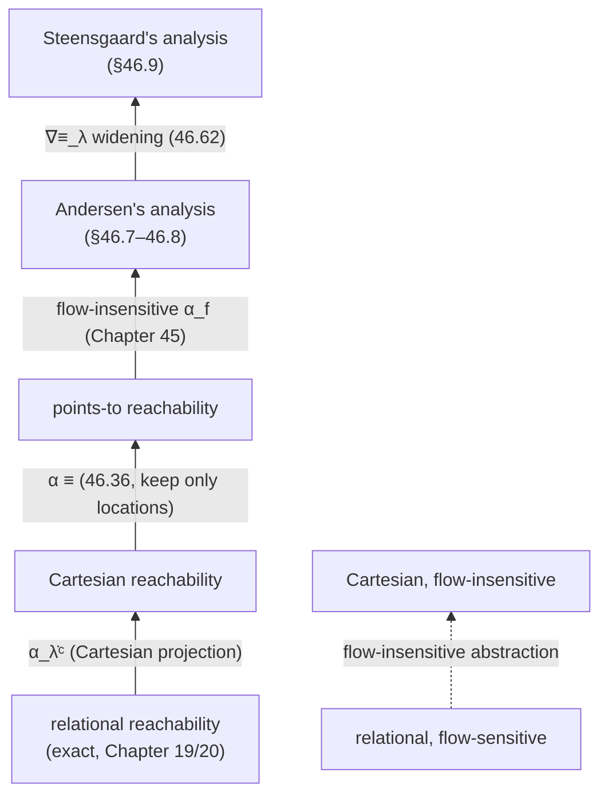

[[book-guidelines|↩ Back to guidelines]]

## Why pointers need their own chapter

Every static analysis so far in the book has worked over *environments*: a variable `x` maps directly to its value. That model quietly assumes something that stops being true the moment a language has pointers — that the only way to change `x`'s value is to write to `x` by name. Once a program can write `*p = A;`, the compiler (and the analyzer) can no longer tell, just by reading the [[Forward-Reachability-Semantics#Assignment|assignment]] statement, *which* variable is being written. If `p` might hold the address of `x`, then `*p = A;` might be a disguised assignment to `x` — and the analysis has to account for that possibility everywhere `x` is used afterward, even though `x` never appears syntactically in the statement.

This is the aliasing problem, and it is why points-to analysis is usually the *first* analysis a real static analyzer runs: nearly every later analysis (numeric intervals, dependency, type checking) needs to know, for every dereference and indirect assignment in the program, which set of memory locations it might touch. Get points-to analysis wrong (unsound) and every analysis built on top of it inherits the unsoundness invisibly.

**What breaks without it:** if you skip points-to analysis and just track `x` and `*p` as unrelated facts, then after `*p = 42;` you have no principled way to invalidate whatever you thought you knew about `x` — you either drop *all* prior knowledge about *every* variable (sound but useless) or silently keep stale facts about `x` (fast but unsound). Points-to analysis is precisely the machinery that lets you invalidate *only* the variables `p` could actually be pointing at.

Chapter 46's real thesis, though, is not "here is how to build a points-to analysis" — it's that the two classic points-to analyses from the literature, **Andersen's** (1994) and **Steensgaard's** (1996), which are usually taught as two independent constraint-solving algorithms, are in fact *the same calculationally-derived Cartesian abstract interpreter*, differing only in whether a specific widening is applied. That reframing is the payoff of everything the book built in Chapters 21 (flow-sensitive interpreter), 27 (abstraction), 28 (Cartesian semantics), and 45 (flow-insensitive analysis) — this chapter is where those pieces get reused rather than re-derived.

## 1. A language with pointers, and where its values live

### 1.1 Syntax

Section 46.1 extends the book's toy imperative language with the operations you'd expect from C-style pointers:

$$
\begin{aligned}
\mathsf{A} &::= \dots \mid \mathsf{x} \mid \texttt{NULL} \mid \&\mathsf{x} \mid \texttt{*p} & \text{(arithmetic/pointer expressions)}\\
\mathsf{B} &::= \dots \mid \mathsf{x} == \mathsf{y} \mid \mathsf{p} == \texttt{NULL} & \text{(tests, including pointer equality)}\\
\mathsf{S} &::= \dots \mid \mathsf{x} = \mathsf{A}\texttt{;} \mid \texttt{*p} = \mathsf{A}\texttt{;} & \text{(direct and indirect assignment)}
\end{aligned}
$$

`&x` takes the address of `x`; `*p` dereferences `p`; `*p = A;` writes through a pointer. This is deliberately the C model, not the Rust one — and that gap is worth sitting with for a moment, because it's exactly the gap a Rust-style borrow checker exists to close statically (more on this below).

### 1.2 Semantic domains — separating *where* a variable lives from *what* is stored there

The chapter's central move, and the one that makes everything downstream tractable, is splitting what used to be one flat environment into two layers:

$$
\begin{aligned}
\lambda &\in \mathbb{L}_\mathbb{V} \triangleq \mathbb{V} \to \mathbb{L} & \text{memory allocation: injective, fixes each variable's address}\\
\mu &\in \mathbb{M}_\lambda \triangleq \mathbb{L}_\lambda \to \mathbb{V}_\lambda & \text{memory: maps locations to their current contents}
\end{aligned}
$$

$\lambda$ is **injective** ($\mathsf{x} \neq \mathsf{y} \Rightarrow \lambda_\mathsf{x} \neq \lambda_\mathsf{y}$): two distinct variables never share an address. It is fixed once and for all at compile/link time and never changes during execution — this chapter only handles *static* memory allocation, where the compiler, linker, and loader hand out addresses up front (as opposed to `malloc`, which is deferred to an exercise, 46.58). $\mu$, by contrast, is exactly what you'd expect from a real machine's memory: it *does* change as the program runs, and it's what the analysis is actually trying to approximate.

A value is now `nil ∪ ℤ ∪ 𝕃` (null, integers, or locations), and errors are explicit and terminal:

$$
\Omega \notin \mathbb{V}, \qquad \nu \in \mathbb{V}_\Omega \triangleq \mathbb{V} \cup \{\Omega\}
$$

Dereferencing a null pointer, or an integer treated as a pointer, produces $\Omega$, and — this is a real semantic decision, not an incidental detail — **the book stipulates that execution stops immediately on error**. This differs from real C, where such behavior is *undefined* rather than a clean halt; section 46.12 comes back to exactly how the soundness result is stated to survive that gap.

**What breaks without the two-layer split:** if locations and values live in the same namespace as before ($\rho: \mathbb{V} \to \mathbb{V}$, one environment), there is nowhere to put "the address of `x`" as a first-class value distinct from "the contents of `x`" — `&x` and `x` would have to be conflated, and you could never express that `p` and `q` are two *different* pointer variables that happen to hold the *same* address. The $\lambda/\mu$ split is what makes aliasing expressible at all.

**Rust grounding.** This split is precisely `&x` (a `*const T` / reference, i.e. a location) versus the `T` value stored there — Rust's type system tags them differently at compile time, which is exactly why Rust *doesn't need* Andersen's analysis to reject the aliasing bugs it prevents; the borrow checker enforces a syntactic discipline (at most one mutable alias, or many immutable ones) so that the may-alias sets this chapter computes are, for safe Rust, mostly singletons or statically known by construction. Points-to analysis becomes essential again the moment you cross into `unsafe` code, raw pointers, or you're writing the verifier itself and need to model what a *checked* program's memory can look like before you've proved the invariants that make it safe:

```rust
// The chapter's two-layer split, made concrete.
#[derive(Clone, Copy, PartialEq, Eq, Hash, Debug)]
struct Location(u32);              // λ: an address, distinct from any value

enum Value {
    Int(i64),
    Loc(Location),                 // a pointer value IS a location
    Nil,
}

struct Memory {                    // μ: 𝕃 → 𝕍, mutated during execution
    cells: std::collections::HashMap<Location, Value>,
}
// λ itself (which var lives at which address) is fixed once, at "compile time",
// and is never touched by `Memory` — mirroring λ's immutability during execution.
```

**Lean grounding.** The abstraction/concretization pairs this chapter builds are, as throughout the book, Galois connections — Mathlib's `GaloisConnection` structure applies unchanged:

```lean
structure GaloisConnection (C A : Type) [Preorder C] [Preorder A] where
  alpha : C → A
  gamma : A → C
  adjoint : ∀ (c : C) (a : A), alpha c ≤ a ↔ c ≤ gamma a
```

Every abstraction defined below — the Cartesian pointer domain (46.16), the points-to domain (46.36) — is an instance of exactly this structure; the chapter's work is choosing `alpha`/`gamma` pairs and discharging the `adjoint` (soundness) obligation.

## 2. Reachability semantics for memories, and why errors truncate it

Rather than re-derive a trace semantics from scratch, section 46.3–46.4 reuses the book's [[Forward-Reachability-Semantics|forward reachability semantics]] (Chapter 19) but replaces environments $\rho \in \mathbb{V} \to \mathbb{V}$ with memories $\mu \in \mathbb{M}_\lambda$, and reads a variable's value as $\mu(\lambda_\mathsf{x})$ instead of $\rho(\mathsf{x})$ — one extra level of indirection through $\lambda$. Dereference `*p` adds a second level: $\mu(\mu(\lambda_\mathsf{p}))$, which is a runtime error if $\mu(\lambda_\mathsf{p})$ is not itself a location.

The consequence that matters for soundness later is: **the fatal error $\Omega$ is never itself a reachable state.** By construction, whenever an expression evaluation yields $\Omega$, the reachability semantics of the enclosing statement yields the empty postcondition $\emptyset$ — there is no "successor state after the crash" to reason about, execution simply has no continuation. This single design choice is what lets Theorem 46.10 (well-definedness) carry over unchanged from Chapter 21's abstract interpreter: extending the language with pointers doesn't break anything already proved, it just adds two new structurally-recursive cases (assignment through `&`/`*`, and pointer tests) that stop propagating on error exactly like every other construct in the language already does.

**What breaks without "errors halt execution":** if instead you let execution continue with unpredictable memory contents after, say, a null dereference (which is what C actually permits), then *any* invariant you'd proven about the rest of the program becomes worthless past that point — there is no semantics left to be sound *with respect to*. The book sidesteps this by fiat here (§46.3–46.11), then in §46.12 states precisely what soundness guarantee survives when you apply the analysis to a language, like real C, that doesn't make this promise.

## 3. Cartesian abstraction, extended to pointers

[[Cartesian-Abstraction|Chapter 28's Cartesian abstraction]] — track each variable independently rather than relations between variables — is the backbone almost every points-to analyzer in the literature actually uses. A Cartesian pointer analysis can conclude "`x` and `y` may each point only to `u` or `v`," but *cannot* express "`x` and `y` always point to the *same* one of `u` or `v`" — that would require a relation between `x` and `y`, which Cartesian abstraction throws away by design.

Section 46.6 does the bookkeeping to extend Chapter 28's machinery — abstract a value domain $\langle \wp(\mathbb{V}_\lambda), \subseteq\rangle \rightleftarrows \langle \mathbb{P}^\natural_\lambda, \sqsubseteq^\natural_\lambda \rangle$, lift it pointwise over locations to get an abstraction of *memories*:

$$
\langle \wp(\mathbb{L}_\lambda \to \mathbb{V}_\lambda),\, \subseteq \rangle \;\rightleftarrows\; \langle \dot{\mathbb{P}}^\natural_\lambda,\, \dot\sqsubseteq^\natural \rangle, \qquad \dot{\mathbb{P}}^\natural_\lambda \triangleq \mathbb{L}_\lambda \to \mathbb{P}^\natural_\lambda \tag{46.16–46.18}
$$

— and add abstract counterparts of `&`, `*`, and `NULL` to the generic Cartesian domain $\mathbb{D}^\natural$ from (28.42), yielding the pointer-aware $\mathbb{D}^\natural_\lambda$. Theorems 46.23/46.24 (assignment), 46.27/46.29 (accessibility), 46.32/46.33 (tests), and the capstone **Theorem 46.34** (well-definedness and soundness) are the pointer-language analogues of Chapter 28's four core theorems, proved the same way: by structural induction, handling the two or three new pointer-specific cases and falling back to Chapter 28's existing proof for everything else. This is dense proof machinery in the source and mostly re-establishes results you already trust from Chapter 28 in a slightly bigger language — the payoff is that once Theorem 46.34 is in hand, *any* Cartesian value domain over locations $\mathbb{P}^\natural_\lambda$ automatically yields a sound points-to analyzer, for free. Section 46.7 makes exactly one specific, well-chosen choice of $\mathbb{P}^\natural_\lambda$.

## 4. Andersen's analysis as one specific Cartesian domain

### 4.1 The points-to abstraction

Lars Ole Andersen's classic analysis collects, for every pointer variable, the *set of locations it might point to* — nothing more, and nothing relational. Section 46.7 derives this as an instance of the Cartesian framework above by choosing the value abstraction

$$
\alpha^{\equiv}(V) \triangleq V \cap \mathbb{L}, \qquad \gamma^{\equiv}(\overline{P}) \triangleq \overline{P} \cup \{\texttt{nil}\} \cup \mathbb{Z} \tag{46.36}
$$

In words: the abstraction throws away everything except the *locations* a value could be (keeping only $V \cap \mathbb{L}$), and the concretization reads a set of locations back as "any of these locations, or possibly null, or possibly an integer" — because a pointer *analysis* deliberately doesn't try to also track integer or null-ness precision; that's someone else's abstract domain (Exercise 46.38 shows how to extend $\alpha^{\equiv}$ to also track nullity if you want it). Lifted pointwise over locations exactly as in (46.16), this gives the **Cartesian pointer abstraction**:

$$
\langle \wp(\mathbb{L}_\lambda \to \mathbb{V}_\lambda),\, \subseteq \rangle \;\rightleftarrows\; \langle \mathbb{L}_\lambda \to \mathbb{P}^{\equiv}_\lambda,\, \dot\subseteq \rangle, \qquad \mathbb{P}^{\equiv}_\lambda \triangleq \wp(\mathbb{L}) \tag{46.37}
$$

### 4.2 The abstract domain

The points-to abstract domain is simply

$$
\mathbb{D}^{\equiv}_\lambda \triangleq \langle \mathbb{P}^{\equiv}_\lambda,\, \subseteq,\, \emptyset,\, \mathbb{L},\, \cup,\, \cap,\, \dots \rangle \tag{46.39}
$$

An abstract property $\overline{P} \in \mathbb{L} \to \wp(\mathbb{L})$ maps each location to the set of locations it *may* point to (a null or integer value is implicit — not represented — since $\gamma^{\equiv}$ already accounts for it). This is a **potential** (may-point-to) analysis: it accumulates possibilities, never asserts a *definite*, must-point-to fact. Remark 46.40 flags a subtlety worth remembering if you ever implement this: the textbook-standard presentation of Andersen's domain is $\wp(\mathbb{V})$ — pointer variables mapped directly to sets of *variables* they may point to, conflating a variable with its own location. The book deliberately keeps $\mathbb{V}$ and $\mathbb{L}$ distinct, because in languages with visibility scoping a variable `x` can go out of scope while its location $\lambda_\mathsf{x}$ remains a perfectly live address that some outstanding pointer still points into (think: returning a reference to a local — the classic dangling-pointer bug, which is precisely what Rust's lifetime system exists to reject statically).

### 4.3 What `*p` means in the abstract, and the two assignment rules

The abstract evaluation of pointer primitives (46.41) is what actually makes the domain executable — the two load rules matter most:

$$
\overline{\boldsymbol\lambda}^{\equiv}_\lambda\llbracket \mathsf{x} \rrbracket \triangleq \{\lambda_\mathsf{x}\}, \qquad \overline{\star}^{\equiv}_\lambda\llbracket \mathsf{p} \rrbracket \overline{P} \triangleq \bigcup_{l \in \overline{P}(\lambda_\mathsf{p})} \overline{P}(l)
$$

$\&\mathsf{x}$ abstracts to the singleton $\{\lambda_\mathsf{x}\}$ — no imprecision there, an address is always known exactly. $\star \llbracket \mathsf{p} \rrbracket$ (reading through `p`) is the interesting one: it takes the *union over every location `p` might point to* of what's stored there. This union is exactly the price of not knowing, at analysis time, which one of `p`'s possible targets is the real one at runtime — the analysis has to be sound for all of them simultaneously.

Section 46.8 instantiates the flow-insensitive interpreter (Chapter 45) with this domain, giving Andersen's analysis, $\widehat{\boldsymbol S}^{\equiv}_{\mathrm{d}}$. Two structural rules carry all the interesting content:

$$
\widehat{\boldsymbol S}^{\equiv}_{\mathrm d}\llbracket \mathsf{x=A;} \rrbracket \lambda\,\overline{P} = \overline{P}\big[\lambda_\mathsf{x} \leftarrow \overline{P}(\lambda_\mathsf{x}) \cup \mathscr{A}^{\equiv}_\lambda\llbracket \mathsf{A} \rrbracket \overline{P}\big] \tag{46.46}
$$

$$
\widehat{\boldsymbol S}^{\equiv}_{\mathrm d}\llbracket \texttt{*p=A;} \rrbracket \lambda\,\overline{P} = l \mapsto \overline{P}(l) \cup \big(l \in \overline{P}(\lambda_\mathsf{p}) \mathrel{?} \mathscr{A}^{\equiv}_\lambda\llbracket \mathsf{A} \rrbracket \overline{P} \mathrel{:} \emptyset\big) \tag{46.47}
$$

Read these carefully, because both are **weak updates** — every update is a *union* with what was already there, never an overwrite. This is not an accident of notation; it is forced by flow-insensitivity: the analysis computes *one* summary points-to map valid at *every* program point simultaneously (Chapter 45), so it can never say "at this specific point, `x` no longer points to what it used to" — it can only ever grow the set of possibilities. (46.47) additionally shows the classic "write-through-a-possible-alias" rule: for a write `*p = A;`, *every* location `p` might point to gets `A`'s possible targets added to its own set — real execution touches exactly one of them, but the analysis, not knowing which, over-approximates by touching all of them.

**What breaks without weak (union) updates:** if (46.46) instead did a strong update $\overline{P}[\lambda_\mathsf{x} \leftarrow \mathscr{A}[\![\mathsf{A}]\!]\overline{P}]$ (discarding the old set), the flow-insensitive fixpoint could *lose* possibilities that were true at some earlier point but not the last one iterated — since flow-insensitivity has already erased *which* point is "last," a strong update here would be unsound, not just imprecise.

**Theorem 46.55** (soundness of the flow-insensitive potential points-to analysis) then falls out almost for free, by pure composition: the reachability semantics is a sound instance of the flow-sensitive interpreter (§21.2, extended in §46.5); flow-sensitive is over-approximated by flow-insensitive (Theorem 45.14/45.15); and any flow-[in]sensitive interpreter is over-approximated by a Cartesian abstraction (Theorem 46.34, §3 above). Chaining three already-proved soundness results is the entire proof — nothing new needs to be shown from scratch, which is the calculational-design payoff the chapter has been building toward.

**Section 46.8.1** notes, briefly, that this is exactly what the constraint-based literature presentation of Andersen's algorithm amounts to: by [[Fixpoint-Theory#Tarski's fixpoint theorem|Tarski's fixpoint theorem]] (15.6), the least solution of $X = F(X)$ equals the least solution of the *constraint* $F(X) \subseteq X$, and for powerset domains that constraint decomposes into elementary inclusion rules like $\lambda_\mathsf{q} \in \overline P(\lambda_\mathsf{p}) \wedge \lambda_\mathsf{r} \in \overline P(\mathsf{q}) \Rightarrow \lambda_\mathsf{r} \in \overline P(\mathsf{r})$ — which is just Andersen's textbook "constraint graph" phrased as inference rules. The book's point is that this constraint-solving view isn't a different algorithm from the abstract-interpretation view above — it's the *same* least fixpoint, rewritten until $F$ is no longer recognizable as a structural semantics.

**Rust grounding — implementing (46.46)/(46.47) directly:**

```rust
use std::collections::{HashMap, HashSet};

type Loc = u32;
type PointsTo = HashMap<Loc, HashSet<Loc>>; // P̄ : 𝕃 → ℘(𝕃)

/// (46.46): x = &y;  (a special case of x = A; where A evaluates to {λ_y})
fn assign(state: &mut PointsTo, x: Loc, rhs_targets: &HashSet<Loc>) -> bool {
    let entry = state.entry(x).or_default();
    let before = entry.len();
    entry.extend(rhs_targets.iter().copied()); // union, never overwrite
    entry.len() != before                       // did the set grow? (fixpoint driver)
}

/// (46.47): *p = A;  — write through every location p may point to
fn store_through(state: &mut PointsTo, p: Loc, rhs_targets: &HashSet<Loc>) -> bool {
    let p_targets: HashSet<Loc> = state.get(&p).cloned().unwrap_or_default();
    let mut changed = false;
    for l in p_targets {                         // l ∈ P̄(λ_p)
        let entry = state.entry(l).or_default();
        let before = entry.len();
        entry.extend(rhs_targets.iter().copied());
        changed |= entry.len() != before;
    }
    changed
}

/// Naive Andersen fixpoint: iterate the whole statement list to a fixpoint —
/// the "modular implementation" the book prefers over the expanded (46.43)–(46.53).
fn andersen_fixpoint(program: &[Stmt], initial: PointsTo) -> PointsTo {
    let mut state = initial;
    loop {
        let mut changed = false;
        for stmt in program {
            changed |= stmt.apply(&mut state); // dispatches to assign / store_through
        }
        if !changed { return state; }          // monotone ⇒ this always terminates
    }
}
# struct Stmt; impl Stmt { fn apply(&self, _s: &mut PointsTo) -> bool { false } }
```

Because both update rules are monotone unions over a finite powerset lattice, this loop is guaranteed to terminate — no widening is needed for Andersen's analysis itself (widening only enters with Steensgaard, next).

**Python sketch — the constraint-graph reading of §46.8.1**, for comparison against the structural code above:

```python
def andersen_worklist(constraints):
    # constraints: list of (p, q) meaning "propagate q's targets into p's set"
    points_to = {}
    changed = True
    while changed:
        changed = False
        for p, q in constraints:
            before = len(points_to.setdefault(p, set()))
            points_to[p] |= points_to.get(q, set())
            changed |= len(points_to[p]) != before
    return points_to
```

## 5. Steensgaard's analysis: Andersen plus a widening

Bjarne Steensgaard's analysis is also flow-insensitive and potential — the chapter's central claim is that it is **not** a different algorithm from Andersen's, but Andersen's *same* Cartesian interpreter with a widening $\nabla^{\equiv}_\lambda$ applied at every step:

$$
\nabla^{\equiv}_\lambda \overline{P} \triangleq \mathrm{lfp}^{\subseteq} \; X \mapsto \overline{P} \mathrel{\dot\cup} \bigcup_{\substack{\mathsf{p}\,\in\,\mathrm{vars}\llbracket\mathsf{P}\rrbracket \\ X(\lambda_\mathsf{p}) = \{\lambda_{\mathsf{q}_1},\dots,\lambda_{\mathsf{q}_n}\} \\ i \in [1,n],\ n>1}} X\Big[\lambda_{\mathsf{q}_i} \leftarrow \bigcup_{j=1}^{n} X(\lambda_{\mathsf{q}_j})\Big] \tag{46.62}
$$

Unpacked: whenever some pointer variable `p`'s points-to set contains *more than one* location ($n>1$: `p` is ambiguous), every one of those $n$ locations gets its own points-to set replaced by the *union of all of them*. Locations that ever get bundled together as "something `p` might point to" become, from then on, indistinguishable — they permanently share one merged points-to set. This is a genuine widening, not just an abstraction: it deliberately throws away information the moment ambiguity appears, in exchange for collapsing the lattice quickly, which is exactly what buys Steensgaard's celebrated near-linear-time complexity against Andersen's more expensive (worst-case cubic) precision.

**Example 46.60** traces this on `p=&x; q=&p; r=&q; p'=&y; q'=&p'; r'=&q'; r=r';`. After the initial assignments each variable's points-to set is a clean singleton. The statement `r = r';` is where ambiguity is born — Andersen's rule (46.46) correctly computes `r ↦ {λ_q, λ_q'}` (two possible targets, unioned in). Steensgaard's widening now fires because `r`'s set has size 2: it merges `λ_q` and `λ_q'`'s sets. But `q` pointed at `p`, and `q'` pointed at `p'` — merging `q`/`q'` forces `p`/`p'` to merge too on the *next* iteration, and by a second widening pass, `x` and `y` end up merged into one shared blob, even though they are never aliased in the actual program. The book is explicit about the cost: *"precision is lost because, for example, location $\lambda_y$ is not reachable from `r`"* — that imprecision is the price of Steensgaard's speed.

Two refinements worth knowing: the widening as stated doesn't depend on the fixpoint *iteration order*, so — unusually for a widening — it can be understood as a genuine Galois connection rather than merely a sound-but-not-best extrapolation operator. And a cost/precision middle ground exists: apply Steensgaard's widening only at loop heads (where Andersen's cubic cost would otherwise bite hardest) rather than after every statement, keeping full Andersen precision everywhere else.

A second, purely relational reformulation of the same idea (via [238]) makes the "union-find" character of Steensgaard's analysis explicit: define $\lambda_\mathsf{x} \equiv_{\overline{P}} \lambda_\mathsf{y}$ iff $\overline{P}(\lambda_\mathsf{x}) \cap \overline{P}(\lambda_\mathsf{y}) \neq \emptyset$ (two locations are equivalent once their targets overlap at all), then quotient locations by that equivalence relation — literally the union-find data structure real implementations of Steensgaard's algorithm use, which is where the "near-linear time" complexity actually comes from in practice.

**Rust grounding — the widening step, on top of the Andersen fixpoint above:**

```rust
/// (46.62), one widening pass: merge points-to sets that co-occur.
fn steensgaard_widen(state: &mut PointsTo) -> bool {
    let mut changed = false;
    let ambiguous: Vec<HashSet<Loc>> = state.values()
        .filter(|targets| targets.len() > 1)
        .cloned()
        .collect();
    for group in ambiguous {                       // {λ_q1, ..., λ_qn}, n > 1
        let merged: HashSet<Loc> = group.iter()
            .flat_map(|q| state.get(q).cloned().unwrap_or_default())
            .collect();
        for q in &group {                            // X[λ_qi ← ∪ X(λ_qj)]
            let entry = state.entry(*q).or_default();
            let before = entry.len();
            entry.extend(merged.iter().copied());
            changed |= entry.len() != before;
        }
    }
    changed
}

/// Steensgaard = Andersen's transformer, but with steensgaard_widen()
/// applied after every step of the flow-insensitive fixpoint (not just once).
fn steensgaard_fixpoint(program: &[Stmt], initial: PointsTo) -> PointsTo {
    let mut state = initial;
    loop {
        let mut changed = false;
        for stmt in program { changed |= stmt.apply(&mut state); }
        changed |= steensgaard_widen(&mut state);
        if !changed { return state; }
    }
}
# struct Stmt; impl Stmt { fn apply(&self, _s: &mut PointsTo) -> bool { false } }
```

The only difference from the Andersen loop in §4.3 is this one extra call — which is the whole point of the chapter's reframing: Steensgaard is not a rewrite of Andersen's algorithm, it's Andersen's algorithm plus one widening operator, in the exact same sense that interval analysis is sign analysis plus a widening (Chapter 34).

## 6. The hierarchy, in one picture

Figure 46.61 lays the whole chapter out as a single lattice of abstractions, from the most precise (relational reachability, i.e. exact trace semantics) down to the cheapest (Steensgaard), with Andersen sitting one abstraction step above Steensgaard rather than off to the side as an unrelated algorithm:



Every downward step in this diagram is a separate, independently-justified abstraction: Cartesian projection (lose relations between variables), potential-points-to abstraction (keep only which locations a value could be), flow-insensitivity (lose which program point a fact holds at), and finally Steensgaard's widening (merge co-occurring locations). Andersen's analysis is what you get by taking the *first three* steps and stopping; Steensgaard's is what you get by taking all four.

## 7. Soundness, honestly stated for a language with undefined behavior

Section 46.12 closes a gap opened back in §1.2: the book's own semantics halts cleanly on error, but real C does not — an out-of-bounds or null dereference in C is *undefined behavior*, meaning the standard permits literally anything to happen afterward, including silent data corruption. So what, precisely, does "the analysis is sound" mean when applied to a real C program?

The chapter's answer, matching the stance taken by the Astrée analyzer: the points-to analysis $\widehat{\boldsymbol S}$ of a program component is **sound with respect to the book's own halt-on-error semantics** (Theorem 46.55) **unconditionally** — that much never depends on what C's standard says. Read against *actual* C execution, the guarantee is: the analysis is sound *up to, and not including, the point of the first runtime error with unpredictable behavior*. Before that point, C's real semantics and the book's semantics coincide exactly, so soundness transfers. After it, no guarantee is made or claimed — and, crucially, the analysis is required to have *reported* that error, so the user knows exactly where the soundness guarantee ends. This is a precise, honest way to state "sound modulo undefined behavior" instead of the common (and wrong) informal claim that a static analyzer is simply "sound for C" — no analyzer can be, because C's own semantics doesn't define what "correct" means past the first UB trigger. The right formal move is not to weaken soundness, but to state exactly *which prefix of execution* it covers.

## Where this leads

Points-to analysis is deliberately positioned in the book (and in nearly every real static analyzer, per the chapter's closing remarks) as a *component of a reduced product*, not a standalone preprocessing pass — running it once upfront and freezing its result is "ill-conceived," because a cheap, imprecise points-to summary poisons every later, more expensive analysis with imprecision it never recovers from. The book's own answer — computed *online*, on demand, interleaved with the numeric/dependency analyses that consume it — is Chapter 45's flow-insensitive machinery plus §46.11's memory-model caveats (real C's pointer arithmetic, unions, and structure fields all need a richer $\mathbb{L}$ than this chapter's toy model uses).

For the standing Rust-verifier goal: this chapter *is* the memory-aliasing layer your Hoare-triple checker needs underneath the assignment axiom the moment the target language has pointers or references — `{P[e/x]} x := e {P}` silently assumes `x` is the *only* thing that changed, which is false in the presence of aliasing, and Andersen's may-alias sets (or something sharper, like a relational shape analysis built the same calculational way) are exactly the missing premise that licenses substituting `e` for `x` and nothing else. Note also the direct echo of Rust's own design here: a sound borrow checker is, in effect, a *static, syntactic* discipline chosen specifically so that a real points-to analysis becomes almost unnecessary for safe code — understanding what Andersen/Steensgaard have to compute at runtime-unknown aliasing is the clearest way to see exactly what problem the borrow checker is statically discharging for free.
