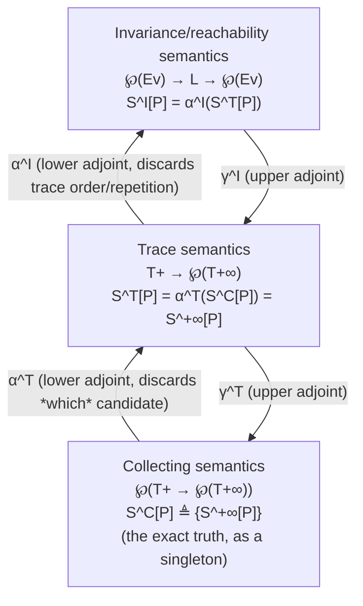

[[book-guidelines|↩ Back to guidelines]]

## Why bother defining "property" at all?

By chapter 7, the book already has a precise semantics: $\mathcal{S}^{+\infty}\llbracket P \rrbracket$, the set of every finite and infinite trace a program $P$ can produce. In principle that *is* everything there is to know about $P$. So why does chapter 8 spend eleven sections building an entire theory of "properties" on top of something we already have?

Because "everything there is to know" is useless for verification and static analysis as stated. You never ask "what is the *exact* semantics of this program?" You ask *yes/no* questions about it: does it terminate? does $x$ stay positive? can this pointer be null at line 12? Each such question picks out a subset of possible semantics — the ones for which the answer is "yes" — and asks whether $P$'s actual semantics falls inside that subset. A **property**, in this book, is nothing more than that subset. Treating properties as sets (rather than as formulas in some logic) is the running decision from chapter 2 (§2.3) that finally pays off here: it lets the book talk uniformly about "stronger," "weaker," "sound," and "best" using nothing but $\subseteq$, regardless of whether the property in question concerns integers, traces, or programs themselves.

What chapter 8 then does is show that "property of a program" is not one fixed idea — it is a whole *hierarchy* of increasingly coarse-grained notions, each one a deliberate loss of information relative to the one below it, and each loss formalized by the same tool: a **Galois connection**. That hierarchy — collecting semantics, then trace properties, then invariance/reachability properties — is the actual subject of this chapter, and it is the scaffolding the rest of the book's verification methods (Hoare logic, chapter 18) and static analyses (chapters 19 onward) all sit on.

## Properties as sets, formally

### What is a formal property?

Section 8.2 restates the chapter 2 convention at full generality. Fix a universe of entities $\mathcal{E}$ (integers, environments, traces — whatever you're currently reasoning about). A **formal property** of $\mathcal{E}$ is a subset $P \in \wp(\mathcal{E})$. An entity $e \in \mathcal{E}$ *has* property $P$ iff $e \in P$, which the book immediately rewrites as

$$e \in P \iff \{e\} \subseteq P,$$

turning membership ($\in$) into implication/inclusion ($\subseteq$). This rewrite looks cosmetic but is the single most load-bearing move in the chapter: $\in$ is a relation between an element and a set, awkward to approximate; $\subseteq$ is a relation between two sets, and inclusion between sets composes and abstracts cleanly (it's exactly what Galois connections are built to preserve). Every later definition in the chapter — collecting semantics, trace property semantics, invariance semantics — is stated as an inclusion for this reason.

$P$ is **stronger** than $P'$ (equivalently $P'$ is **weaker**) iff $P \subseteq P'$. The strongest property is $\emptyset$ (nothing has it — "false"); the weakest is $\mathcal{E}$ itself (everything has it — "true"). The strongest property that a *specific* entity $e$ can have is $\{e\}$: knowing "it's exactly $e$" is strictly more information than knowing any property $e$ happens to satisfy.

**Example 8.1 (even/odd).** With $\mathcal{E} = \mathbb{Z}$: $\emptyset$ is false, $\mathbb{Z}$ is true, $2\mathbb{Z} \triangleq \{z \in \mathbb{Z} \mid \exists k \in \mathbb{Z}.\, z = 2k\}$ is "even," $2\mathbb{Z}+1$ is "odd," and every integer is in exactly one of the two ($\mathbb{Z} = 2\mathbb{Z} \cup 2\mathbb{Z}+1$).

**What breaks without this.** If you instead fix a specific logic (first-order arithmetic, say) to state properties, two costs appear immediately. First, you inherit that logic's expressiveness ceiling — some properties you care about (termination, say) simply aren't first-order-definable. Second, and more subtly for this book's purposes: comparing the *strength* of two properties stated as formulas requires implication-checking within that logic, which can itself be undecidable, whereas comparing two properties-as-sets is just $\subseteq$, decidable whenever the sets are decidable. Remark 8.4 spells out the price precisely: a formula $\varphi$ under interpretation $\mathcal{I}$ denotes a property $\mathcal{S}\llbracket \varphi \rrbracket = \{\rho \mid \dots\}$, and reasoning "on $\mathcal{S}\llbracket \varphi \rrbracket$" instead of "on $\varphi$" is exactly what buys you this — at the cost of tying every result to one fixed interpretation $\mathcal{I}$.

**Grounding.** In Rust, a property over a universe `E` is most naturally a predicate, but *as data* (so it can be intersected, weakened, and compared) it's a set:

```rust
use std::collections::HashSet;
use std::hash::Hash;

/// A formal property of a (finite, enumerable-for-this-sketch) universe.
#[derive(Clone)]
struct Property<E: Eq + Hash + Clone>(HashSet<E>);

impl<E: Eq + Hash + Clone> Property<E> {
    /// P is stronger than other iff P ⊆ other.
    fn stronger_than(&self, other: &Property<E>) -> bool {
        self.0.is_subset(&other.0)
    }
    fn has(&self, e: &E) -> bool {
        self.0.contains(e)
    }
}
```

`stronger_than` is literally $\subseteq$; there's no separate "implication" operator to implement, which is the whole point.

In Lean, this is even more direct because `Set` already *is* `α → Prop`, so a property and its membership predicate are definitionally the same object:

```lean
-- A property of `E` is a `Set E`; `e ∈ P` unfolds to `P e`.
def isEven (z : Int) : Prop := ∃ k, z = 2 * k

def Even : Set Int := {z | isEven z}

-- "stronger" is exactly `⊆`, which mathlib already gives you for `Set`.
example (P Q : Set Int) (h : P ⊆ Q) (z : Int) (hz : z ∈ P) : z ∈ Q := h hz
```
This is worth pausing on if your target is a compiler/verifier: Lean's `Set α := α → Prop` means every "property as a predicate" you'd write in a type checker (well-typed, well-scoped, satisfies-invariant-$I$, …) is *already* a set in exactly this book's sense, with $\subseteq$ giving you soundness comparisons for free.

## The collecting semantics: the strongest property there is

Given the equivalence $e \in P \iff \{e\} \subseteq P$, apply it to the single most informative entity available: the program's own exact semantics, $e = \mathcal{S}^{+\infty}\llbracket P \rrbracket$. Section 8.3 first locates this in the right space: a **formal semantic property** of program $P$ is an element of $\wp(\mathbb{T}_+ \to \wp(\mathbb{T}_{+\infty}))$ — a *set of possible trace semantics*, not a set of traces. (Because a relation on $\mathbb{T}_+ \times \mathbb{T}_{+\infty}$ is isomorphic to its right image in $\mathbb{T}_+ \to \wp(\mathbb{T}_{+\infty})$, this is equivalently $\wp(\wp(\mathbb{T}_+ \times \mathbb{T}_{+\infty}))$ — the set-of-sets-of-traces shape later authors [194] would call a *hyperproperty*. Cousot keeps the plain set-theoretic phrasing rather than adopt that name, but it's worth knowing the term if you read further in the verification/security literature.)

Section 8.4 then defines the **collecting semantics**:

$$\mathcal{S}^{\mathbb{C}}\llbracket P \rrbracket \triangleq \{\mathcal{S}^{+\infty}\llbracket P \rrbracket\}$$

— the *singleton* set containing $P$'s one true semantics. By the strongest-property-of-an-entity fact above, this is the strongest semantic property $P$ could possibly have. Program $P$ has property $\mathcal{P} \in \wp(\mathbb{T}_+ \to \wp(\mathbb{T}_{+\infty}))$ iff $\mathcal{S}^{+\infty}\llbracket P \rrbracket \in \mathcal{P}$, iff, by the $\in/\subseteq$ rewrite,

$$\mathcal{S}^{\mathbb{C}}\llbracket P \rrbracket \subseteq \mathcal{P}.$$

**What breaks without this.** Without naming the collecting semantics explicitly, you'd have to keep asking "does $\mathcal{S}^{+\infty}\llbracket P \rrbracket \in \mathcal{P}$?" for every property $\mathcal{P}$ of interest — a membership question against a possibly-infinite, possibly-abstract set. Packaging the semantics itself as a singleton set converts *every* such question into "is the collecting semantics included in $\mathcal{P}$?" — one uniform inclusion query, answerable by the same abstraction machinery (Galois connections) used for everything else in the book. This is why later chapters casually say things like "the analysis is sound if it overapproximates the collecting semantics" — "the collecting semantics" is shorthand for "the exact truth, repackaged so you can compare it to an approximation with $\subseteq$."

**Grounding.** The collecting semantics is the *most precise* abstract element you could ever hand to an analysis — the input a verifier would use if it had unlimited resources and never lost precision:

```rust
/// A (toy, finite) trace identifier standing in for a real T+/T+infinity trace.
type TraceId = u32;

/// A trace semantics S : T+ -> P(T+infinity), modeled here (toy, finite
/// case) as a map from an initialization trace to its allowed continuations.
type TraceSemantics = HashMap<TraceId, HashSet<TraceId>>;

/// The collecting semantics is the singleton set containing the exact
/// trace semantics — the "full-precision" element of the property lattice.
fn collecting_semantics(exact: TraceSemantics) -> Property<TraceSemantics> {
    // Property<TraceSemantics> needs TraceSemantics: Eq + Hash; derive both
    // via a thin newtype in real code — omitted here for brevity.
    Property(HashSet::from([exact]))
}
```
There's nothing to compute here — that's the point. Every abstract interpreter in the rest of the book is defined as *some sound overapproximation of* `collecting_semantics(...)`; none of them ever construct it (it's generally uncomputable — chapter 9), but it is always the yardstick soundness proofs are stated against.

## Trace properties vs. semantic properties

A **trace property**, defined in §8.5, is a much smaller object than a semantic property: not a set of possible semantics, but a single element of $\mathbb{T}_+ \to \wp(\mathbb{T}_{+\infty})$ (isomorphically, a set of pairs $\wp(\mathbb{T}_+ \times \mathbb{T}_{+\infty})$) — one function from an initialization trace to the set of allowed continuations. The trace semantics itself, $\mathcal{S}^{+\infty}\llbracket P \rrbracket$, *is* a trace property (§8.7 calls it the "trace property semantics," the strongest trace property $P$ has — trivially itself). So a program's trace semantics sits at a different type than its collecting semantics: the collecting semantics is a *singleton set containing* the trace semantics; a general trace property doesn't have to be a singleton at all.

This difference in type is not bookkeeping — it's a genuine, provable expressiveness gap, and the chapter proves it with a pointed pair of examples built around the same scenario: a program whose executions from a fixed initialization $\pi_0$ always terminate with $x = 0$ or with $x = 1$.

**Example 8.5 (semantic property).** $P \triangleq \wp(\{\pi \in \mathbb{T}_+ \mid \rho(\pi)x = 0\}) \cup \wp(\{\pi \in \mathbb{T}_+ \mid \rho(\pi)x = 1\})$. If $\mathcal{S}^{+\infty}\llbracket P \rrbracket \pi_0 \in P$, then observing *one* execution terminate with $x=0$ tells you every other possible execution from $\pi_0$ also terminates with $x=0$ (or every one terminates with $x=1$ — but not a mix). This is *"the result is always the same."*

**Example 8.7 (trace property).** $\overline{P} \triangleq \{\pi \in \mathbb{T}_+ \mid \rho(\pi)x = 0\} \cup \{\pi \in \mathbb{T}_+ \mid \rho(\pi)x = 1\}$ — same-looking union, but now a single set of traces, not a set of trace-semantics-candidates. $\mathcal{S}^{+\infty}\llbracket S \rrbracket \pi_0 \subseteq \overline{P}$ only tells you every execution terminates with *some* Boolean value for $x$ — observing one execution end in $x=0$ tells you *nothing* about whether another might end in $x=1$. This is *"the result is always Boolean,"* strictly weaker than "always the same."

Example 8.10 makes the relationship exact: the trace property $\overline{P} = \alpha^{\mathbb{T}}(P)$ is literally the *abstraction* of the semantic property $P$ from example 8.5 — the two examples aren't independent, the second is what you get by feeding the first through the abstraction map defined in §8.6:

$$
\alpha^{\mathbb{T}} \in \wp(\mathbb{T}_+ \to \wp(\mathbb{T}_{+\infty})) \to (\mathbb{T}_+ \to \wp(\mathbb{T}_{+\infty})), \qquad
\alpha^{\mathbb{T}}(\mathcal{P}) \triangleq \pi \mapsto \bigcup \{\mathcal{S}(\pi) \mid \mathcal{S} \in \mathcal{P}\}
$$
$$
\gamma^{\mathbb{T}} \in (\mathbb{T}_+ \to \wp(\mathbb{T}_{+\infty})) \to \wp(\mathbb{T}_+ \to \wp(\mathbb{T}_{+\infty})), \qquad
\gamma^{\mathbb{T}}(\overline{P}) \triangleq \{\mathcal{S} \mid \mathcal{S} \mathrel{\dot{\subseteq}} \overline{P}\}
$$

with $\langle \wp(\mathbb{T}_+ \to \wp(\mathbb{T}_{+\infty})), \subseteq \rangle \; \substack{\gamma^{\mathbb{T}} \\ \longleftarrow\!\!\!\longrightarrow \\ \alpha^{\mathbb{T}}} \; \langle \mathbb{T}_+ \to \wp(\mathbb{T}_{+\infty}), \dot{\subseteq} \rangle$ a genuine Galois connection (exercise 8.9). $\alpha^{\mathbb{T}}$ takes a *set of candidate semantics* and, for each initialization $\pi$, unions together everything any candidate said was possible — literally forgetting *which* candidate was the real one, keeping only "the union of what any of them could do." That union is exactly where the information loss in going from example 8.5 to example 8.7 comes from: once you union $\{x{=}0\text{-always}\}$ together with $\{x{=}1\text{-always}\}$ candidates, you can no longer recover "it's consistently one or the other."

<svg viewBox="0 0 760 300" xmlns="http://www.w3.org/2000/svg" font-family="ui-sans-serif, system-ui, sans-serif">
  <style>
    .box { fill: none; stroke: #8a8a8a; stroke-width: 1.5; }
    .cand { fill: #d9e8f5; stroke: #5b84a8; stroke-width: 1; }
    .cand2 { fill: #f5ded9; stroke: #a86b5b; stroke-width: 1; }
    .lbl { fill: #444444; font-size: 13px; }
    .small { fill: #555555; font-size: 11px; }
    .arrow { stroke: #666666; stroke-width: 2; fill: none; marker-end: url(#arrowhead); }
  </style>
  <defs>
    <marker id="arrowhead" markerWidth="8" markerHeight="8" refX="6" refY="4" orient="auto">
      <path d="M0,0 L8,4 L0,8 Z" fill="#666666"/>
    </marker>
  </defs>

  <rect x="20" y="20" width="260" height="240" class="box" rx="8"/>
  <text x="150" y="45" text-anchor="middle" class="lbl">Semantic property P</text>
  <text x="150" y="62" text-anchor="middle" class="small">(a set of candidate trace-semantics)</text>
  <rect x="45" y="80" width="200" height="60" class="cand" rx="6"/>
  <text x="145" y="115" text-anchor="middle" class="small">candidate: always x=0</text>
  <rect x="45" y="160" width="200" height="60" class="cand2" rx="6"/>
  <text x="145" y="195" text-anchor="middle" class="small">candidate: always x=1</text>

  <path d="M290 150 L 430 150" class="arrow"/>
  <text x="360" y="135" text-anchor="middle" class="small">alpha^T (union, forgets which)</text>

  <rect x="440" y="20" width="300" height="240" class="box" rx="8"/>
  <text x="590" y="45" text-anchor="middle" class="lbl">Trace property alpha^T(P)</text>
  <text x="590" y="62" text-anchor="middle" class="small">(one set of traces, not a set of candidates)</text>
  <rect x="465" y="90" width="250" height="130" class="cand" rx="6"/>
  <text x="590" y="145" text-anchor="middle" class="small">all traces ending x=0</text>
  <text x="590" y="165" text-anchor="middle" class="small">union with</text>
  <text x="590" y="185" text-anchor="middle" class="small">all traces ending x=1</text>
</svg>

**[[Safety-and-Liveness-Properties#What breaks without this distinction|What breaks without this distinction]].** If you conflate "trace property" and "semantic property" — as the informal phrase "program property" tempts you to — you will silently overstate what a trace-level analysis can prove. A dataflow analysis that only ever computes elements of $\mathbb{T}_+ \to \wp(\mathbb{T}_{+\infty})$ (which is most of them — reaching-definitions, liveness, interval analysis) is structurally incapable of expressing "the outcome is always the same across executions," no matter how precise you make it, because that property doesn't even *live* in the trace-property space. Knowing this in advance tells you which specification languages (relational, hyperproperty-style — think noninterference, chapter 32) require a genuinely different, coarser-or-not abstraction than plain trace analysis.

## Invariance and reachability properties

Sections 8.8–8.10 abstract *again*, one level further down. An **invariance/reachability property** is not indexed by whole traces at all — it's a relation between the values of program variables *at a single program point* $\ell$, required to hold whenever execution reaches $\ell$. This is the level most static analyzers you've actually used (a linter's "variable used before initialization" check, an interval analyzer's per-line ranges) report results at.

**Example 8.13** works this out concretely on a small program with a `break`:

```
ℓ₁  /* x = 0 */
    x = x + 1;
    while ℓ₂ (tt) /* 1 ≤ x ≤ 2 */ {
ℓ₃      /* 1 ≤ x ≤ 2 */
        x = x + 1;
        if ℓ₄ (x > 2) /* 2 ≤ x ≤ 3 */
ℓ₅          /* x = 3 */
            break;
    }
ℓ₆  /* x = 3 */
    ;
ℓ₇  /* x = 3 */
```

with the strongest invariant $\mathcal{I}$ spelled out label by label — e.g. $\mathcal{I}(\ell_1) \triangleq \{\rho \in \mathbb{E}_v \mid \forall y \in \mathcal{V}.\, \rho(y) = 0\}$ (everything is still 0 at entry), down to $\mathcal{I}(\ell_5) = \mathcal{I}(\ell_6) = \mathcal{I}(\ell_7) \triangleq \{\rho \in \mathbb{E}_v \mid \rho(x)=3 \wedge \forall y \ne x.\, \rho(y)=0\}$ (once you've broken out, $x$ is pinned at exactly 3). Note this is already a real per-line invariant, not a summary — it's exactly the kind of annotation a Hoare-logic proof (chapter 18) attaches to each program point.

Formally, the abstraction that produces this from a trace property is $\alpha^{\mathbb{I}}$:

$$
\alpha^{\mathbb{I}} \in (\mathbb{T}_+ \to \wp(\mathbb{T}_{+\infty})) \to (\wp(\mathbb{E}_v) \to \mathbb{L} \to \wp(\mathbb{E}_v))
$$
$$
\alpha^{\mathbb{I}}(\mathcal{S}) \triangleq P \mapsto \ell \mapsto \{\rho(\pi_0 \frown \pi^\ell) \mid \exists \pi'.\ \rho(\pi_0) \in P \wedge \pi^\ell \pi' \in \mathcal{S}(\pi_0)\}
$$

Read it as: fix a precondition $P$ on the initial environment; for each label $\ell$, collect the environment reached at every prefix $\pi^\ell$ of every trace in $\mathcal{S}(\pi_0)$ whose initialization satisfies $P$. This is a genuine further abstraction (exercise 8.14 asks you to show $\alpha^{\mathbb{I}}$ is a lower adjoint, i.e. part of another Galois connection) because it throws away *order and repetition* — a trace visiting $\ell$ five times with five different environments collapses to one set of (up to) five environments, with no memory of which visit came first or how they related to each other across labels. The **invariance/reachability semantics** is then the strongest such invariant, obtained by abstracting the trace semantics itself:

$$\mathcal{S}^{\mathbb{I}}\llbracket P \rrbracket \triangleq \alpha^{\mathbb{I}}(\mathcal{S}^{\mathbb{T}}\llbracket P \rrbracket).$$

**What breaks without this.** An invariant *cannot*, by construction, express relations that span two different reachings of the *same* point across time (e.g. "$x$ is non-decreasing across loop iterations" as opposed to just "$x \ge 0$ at every iteration") — that information lived in the trace and was discarded by $\alpha^{\mathbb{I}}$'s per-label flattening. This is precisely the safety/liveness split the book takes up next (chapter 10): invariance properties are a subclass of *safety*, and genuinely temporal claims about how a variable evolves need either a finer (trace-level) property or explicit auxiliary/ghost variables to smuggle history back into the per-point environment.

**Grounding.** This is the shape a real dataflow/abstract fixpoint solver actually iterates on — a map from labels to abstract environments:

```rust
use std::collections::{HashMap, HashSet};

type Label = u32;
type Env = HashMap<String, i64>;   // a concrete environment ρ

/// The invariance/reachability semantics: 𝓘 : Label -> Set<Env>.
/// (In a real analyzer this is the abstract state a fixpoint loop refines;
/// here it's just the *collected exact* answer, matching the book's 𝒮^I.)
struct Invariant(HashMap<Label, HashSet<Env>>);

impl Invariant {
    /// Record that environment `rho` was observed at label `ell`.
    fn observe(&mut self, ell: Label, rho: Env) {
        self.0.entry(ell).or_default().insert(rho);
    }
}
```
This `observe` step is exactly $\alpha^{\mathbb{I}}$ specialized to a single execution — run it over *every* trace consistent with precondition $P$ and you get $\mathcal{S}^{\mathbb{I}}\llbracket P \rrbracket$ exactly. Every reachability analysis you'll write for the verifier project is a sound *overapproximation* of this `Invariant` map, computed without enumerating traces (chapter 14 does this calculationally).

In Lean, the Galois-connection statement in exercise 8.14 is not just an analogy — it's a proof obligation of exactly the shape `mathlib`'s `GaloisConnection` structure was built for:

```lean
-- GaloisConnection is already in mathlib: `GaloisConnection l u` packages
-- exactly `∀ a b, l a ≤ b ↔ a ≤ u b` — the definition the book calls
-- ⟨α, γ⟩ forming a Galois connection. Proving exercise 8.14 amounts to
-- instantiating this for `alphaI`/`gammaI` and discharging one `Iff.intro`.
example (alphaI : TraceProperty → Invariant) (gammaI : Invariant → TraceProperty)
    (h : GaloisConnection alphaI gammaI) : Monotone alphaI :=
  h.monotone_l
```

## The hierarchy, as one composed Galois connection tower

Section 8.11 is short in prose because by this point it's just naming what's already built: three levels, each related to the next by a Galois connection, with the whole tower composing:



Two facts make this a genuine *hierarchy* rather than three unrelated definitions:

1. **Composition.** Because Galois connections compose (§11.8, used here before it's even formally stated), $\alpha^{\mathbb{I}} \circ \alpha^{\mathbb{T}}$ and $\gamma^{\mathbb{T}} \circ \gamma^{\mathbb{I}}$ form a Galois connection directly from the collecting semantics down to invariants — you never *have* to go through trace properties explicitly; it's just the natural intermediate stop.
2. **Monotone precision loss.** Each abstraction step is provably sound but not exact (in general) — $\gamma^{\mathbb{T}}(\alpha^{\mathbb{T}}(\mathcal{P})) \supseteq \mathcal{P}$, not $=$ — so the hierarchy is a strict ordering of expressiveness: semantic properties can state facts trace properties can't (example 8.5 vs. 8.7), and trace properties can state facts invariance properties can't (order/repetition across visits to the same label). This is a specific instance of the book's general recipe — concrete domain, abstraction function, abstract domain, soundness by construction — applied to *properties themselves* rather than to values or states, which is exactly why the same $\alpha/\gamma$ machinery from a sign-abstraction example (chapter 3) reappears unchanged here at a completely different type.

## Where this leads

This chapter's hierarchy is the map the rest of the book's verification and analysis chapters place themselves on:

- **Undecidability (chapter 9)** immediately follows because *every* level in this hierarchy is, in the fully general case, an uncomputable predicate over programs (Rice's theorem) — the collecting semantics you can't compute is exactly $\mathcal{S}^{\mathbb{C}}\llbracket P \rrbracket$ from §8.4.
- **Safety and liveness (chapter 10)** refine the trace-property level from this chapter into the two decomposable subclasses that make trace properties tractable to check on finite prefixes.
- **Galois connections proper (chapter 11)** formalize, in full generality, the tool this chapter already used three times ($\alpha^{\mathbb{T}}$, $\alpha^{\mathbb{I}}$, and implicitly the sign abstraction of chapter 3) — read that chapter as "what §8.6 and §8.9 were secretly instances of."
- **Fixpoint-based verification and Hoare logic (chapters 17–18)** are literally proof methods for showing a program's actual invariance semantics $\mathcal{S}^{\mathbb{I}}\llbracket P \rrbracket$ from this chapter implies a specification — i.e., they operate exactly at the level this chapter defines, and Hoare logic itself will later be recast (§18's closing point) as *an abstract interpretation of the invariance semantics*.

For the compiler/verifier project specifically: the `Invariant` map above — labels to sets (later, abstract domains) of environments — is the literal data structure your fixpoint-based checker will maintain and refine, and every soundness argument you write for it ("my analysis' invariant at $\ell$ overapproximates the true reachable environments") is an instance of $\mathcal{S}^{\mathbb{I}}\llbracket P \rrbracket \subseteq \gamma(\text{abstract invariant at } \ell)$ — the $\in/\subseteq$ rewrite from §8.2, one more time, at the very concrete end of the hierarchy this chapter builds.
