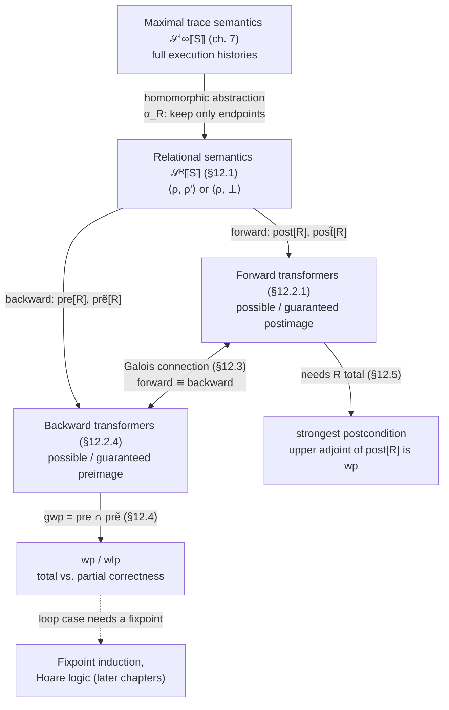

# Relational and Predicate Transformer Semantics

[[book-guidelines|↩ Back to guidelines]]

## Why the trace semantics isn't the semantics you want for verification

Every semantics built so far in this book — the structural prefix trace semantics of chapter 6, the maximal (finite-or-infinite) trace semantics $\mathcal{S}^{+\infty}\llbracket S \rrbracket$ of chapter 7 — records *everything that happened during execution*: the full alternating sequence of program-point configurations and actions, from the moment execution starts at $\mathrm{at}\llbracket S \rrbracket$ to the moment it stops (or never does). That is exactly the right level of detail for defining what a program *means*, and it's the right foundation for talking about safety and liveness (chapter 10) or reachability at intermediate points.

But it is almost never the right level of detail for verification. When you want to prove a Hoare triple $\{P\} S \{Q\}$ — "if $S$ starts in a state satisfying $P$, and terminates, it ends in a state satisfying $Q$" — you don't care about the path $S$ took to get there. You care about the relationship between the *start* state and the *end* state. Two wildly different traces through a loop are irrelevant if they start and end in the same environments. This chapter's whole project is throwing away everything about a trace except its two endpoints, and then re-deriving Dijkstra's predicate-transformer semantics — weakest precondition, weakest liberal precondition, strongest postcondition — as instances of exactly the same abstraction machinery (Galois connections) used everywhere else in the book, rather than postulating them as a separate formalism.

**What breaks without this step:** if you only had the trace semantics, "does $S$ establish $Q$ from $P$" would require reasoning about an unbounded, structurally complex set of full execution histories. Predicate transformers compress that down to a single function $\wp(\text{states}) \to \wp(\text{states})$ — exactly the shape a verifier's VC (verification-condition) generator needs to compute, recursively, over the syntax of $S$.

## Step 1 — Relational semantics: keep only the endpoints

The book's first move is a *homomorphic/partitioning abstraction* (§12.1) of the maximal trace semantics: throw away everything about a trace except

- for a **finite** (terminating) trace $\pi_1 \frown \pi_2$: its initial environment $\rho(\pi_1)$ and its final environment $\rho(\pi_1 \frown \pi_2)$,
- for an **infinite** (non-terminating) trace: its initial environment and a distinguished symbol $\bot$ (Dana Scott's notation for "undefined"/non-termination).

Formally (12.1):

$$
\alpha_R\langle \pi_1, \pi_2 \rangle \triangleq \langle \rho(\pi_1), \rho(\pi_1 \frown \pi_2) \rangle \quad (\pi_2 \in \mathbb{T}^+)
$$
$$
\alpha_R\langle \pi_1, \pi_2 \rangle \triangleq \langle \rho(\pi_1), \bot \rangle \quad (\pi_2 \in \mathbb{T}^\infty)
$$
$$
\mathcal{S}^R\llbracket S \rrbracket \triangleq \alpha_R(\mathcal{S}^{+\infty}\llbracket S \rrbracket)
$$

This is the *infinitary relational semantics*: a set of pairs $\langle \rho, \rho' \rangle \in \mathbb{E}_\mathbb{V} \times (\mathbb{E}_\mathbb{V} \cup \{\bot\})$, where $\mathbb{E}_\mathbb{V} = \mathbb{V} \to \mathbb{Z}$ is the set of environments. Because it's a homomorphic abstraction (exercise 11.6 in the previous chapter), this is a genuine Galois connection $\langle \mathbb{T}^+ \to \wp(\mathbb{T}^{+\infty}), \subseteq \rangle \rightleftarrows \langle \wp(\mathbb{E}_\mathbb{V} \times (\mathbb{E}_\mathbb{V} \cup \{\bot\})), \subseteq \rangle$ — it's sound by construction, not by a separate proof.

If you don't care about non-termination at all (e.g., you're only interested in partial correctness), a further exclusion abstraction (exercise 11.5) drops the $\bot$ case entirely, giving the **finitary relational semantics**, also called the **natural semantics**:

$$
\mathcal{S}^{R^+}\llbracket S \rrbracket \triangleq \{ \langle \rho(\pi_1), \rho(\pi_1 \frown \pi_2) \rangle \mid \pi_1 \in \mathbb{T}^+ \wedge \pi_2 \in \mathcal{S}^+\llbracket S \rrbracket(\pi_1) \}
$$

This is the semantics most programming-language textbooks call "big-step" or "natural" semantics — it's now visible as the *finitary special case* of an abstraction that the book already needed to define, rather than a separate primitive notion.

**Rust grounding.** The most literal Rust encoding of $\mathcal{S}^R\llbracket S \rrbracket$ is not a function `Env -> Env` — that presumes determinism and totality, neither of which the book assumes yet. It's a relation:

```rust
// Env is a snapshot of all variable bindings, e.g. a small map.
type Env = std::collections::BTreeMap<String, i64>;

#[derive(Clone, PartialEq, Eq, Debug)]
enum Outcome {
    Terminates(Env),
    Diverges, // the "⊥" case
}

// S^R⟦S⟧ as a Rust type: a set of (input, output) pairs.
type RelationalSemantics = std::collections::HashSet<(Env, Outcome)>;
```

A deterministic interpreter later *specializes* this relation into a partial function `Env -> Option<Env>` (returning `None` only for a divergence you can actually detect, which in general you can't — this is exactly Rice's theorem territory from an earlier chapter). But the relational view is what the theory needs, because nondeterministic and concurrent semantics are relations, not functions, and the theory should cover them uniformly.

## Step 2 — Property transformers: abstracting the relation itself

A relation $R \in \wp(\mathbb{P} \times \mathbb{Q})$ can itself be abstracted again — this time into a function from *properties* of the input to *properties* of the output (or vice versa). This is the **property transformer** view, and it comes in two dual flavors depending on which direction you read the arrow.

### Forward transformers: post and its dual

In *forward* transformers, you're given a precondition (a hypothesis on where execution starts) and you compute what's true after.

> **Postimage transformer.** For $P \in \wp(\mathbb{P})$ and $R \in \wp(\mathbb{P} \times \mathbb{Q})$,
> $$\mathsf{post}[R] \triangleq P \mapsto \{ y \in \mathbb{Q} \mid \exists x \in P.\ \langle x, y \rangle \in R \} \tag{12.2}$$

This says: $y$ is a possible output of $R$ under precondition $P$ iff **some** $x$ satisfying $P$ maps to $y$. It's the standard "right image," also written $R[P]$. Its dual, $\widetilde{\mathsf{post}}[R]$, swaps the existential for a universal by negating both sides (12.3):

$$
\widetilde{\mathsf{post}}[R] \triangleq \neg \circ \mathsf{post}[R] \circ \neg = P \mapsto \{y \in \mathbb{Q} \mid \forall x \in \mathbb{P}.\ \langle x, y \rangle \in R \Rightarrow x \in P\}
$$

$\widetilde{\mathsf{post}}[R]P$ says: $y$ is guaranteed to be produced only by $x$'s satisfying $P$ — i.e., **every** predecessor of $y$ under $R$ lies in $P$. Concretely, `post` answers "what results are *possible*"; `post̃` answers "what results are *guaranteed to have come from* $P$" — the difference between an overapproximation of possible outputs and a *definite*-dependency guarantee.

**Worked example (12.4).** Take the arithmetic-expression semantics $\mathcal{A}\llbracket A \rrbracket \in \mathbb{E}_\mathbb{V} \to \mathbb{Z}$ from chapter 3, viewed as a relation $R = \{ \langle \rho, \mathcal{A}\llbracket A \rrbracket \rho \rangle \mid \rho \in \mathbb{E}_\mathbb{V} \}$. If $P = \{\rho \mid \rho(\texttt{x}) > \rho(\texttt{y}) + 1\}$ (i.e., "$\texttt{x} > \texttt{y}+1$" as a set of environments), then

$$
\mathsf{post}[\mathcal{A}\llbracket\texttt{x-1}\rrbracket]\,P = \{v \in \mathbb{Z} \mid v = \rho(\texttt{x}) - 1 \geq \rho(\texttt{y}) + 1\}
$$

i.e. from $\texttt{x} > \texttt{y}+1$ you can conclude $\texttt{x-1} \geq \texttt{y}+1$. The book notes explicitly: **the sign abstraction from chapter 3 is an abstraction of this very transformer** — the calculational-design recipe you already learned there was secretly computing an abstraction of $\mathsf{post}[\mathcal{A}\llbracket A \rrbracket]$ all along.

### Backward transformers: pre and its dual

In *backward* transformers, you're given a postcondition and you ask what preconditions guarantee (or merely permit) it.

> **Preimage transformer.** For $Q \in \wp(\mathbb{Q})$,
> $$\mathsf{pre}[R] \triangleq \mathsf{post}[R^{-1}] = Q \mapsto \{x \in \mathbb{P} \mid \exists y \in Q.\ \langle x, y \rangle \in R\} \tag{12.11}$$

This is the "left image," $R^{-1}[Q]$: the set of inputs from which **some** execution reaches $Q$. Its dual (12.12),

$$
\widetilde{\mathsf{pre}}[R] \triangleq \neg \circ \mathsf{pre}[R] \circ \neg = Q \mapsto \{ x \in \mathbb{P} \mid \forall y \in \mathbb{Q}.\ \langle x, y \rangle \in R \Rightarrow y \in Q \}
$$

is the set of inputs from which **all** possible executions land in $Q$. This distinction — *some* execution vs. *all* executions — is precisely the "possible/must" duality that shows up all over program analysis (may-alias vs. must-alias, existential vs. universal reachability, angelic vs. demonic nondeterminism), and it appears here for the first time as literally the definition of a transformer and its De Morgan dual, not as a bespoke fork in the theory. It's exactly why weakest precondition ($\forall$-flavored, "all executions must satisfy $Q$") and weakest liberal precondition end up defined via $\widetilde{\mathsf{pre}}$ below.

**What breaks without the dual:** if you only had $\mathsf{pre}[R]$ (the "some execution" version), you could never express "this statement is *guaranteed* to terminate in a state satisfying $Q$" — only "it's *possible* that it does." Verification needs the universal reading; that's what forces the dual transformer into existence.

**Rust grounding — this is a transfer function.** If you've ever written a dataflow-analysis pass, `post[R]` and `pre[R]` are exactly what you call the *transfer function* of a basic block, applied forward or backward:

```rust
// Forward: "possible" postimage transformer, monotone over sets of Envs.
fn post(relation: &RelationalSemantics, pre: &HashSet<Env>) -> HashSet<Outcome> {
    relation.iter()
        .filter(|(x, _)| pre.contains(x))
        .map(|(_, y)| y.clone())
        .collect()
}

// Backward: "some predecessor reaches Q" preimage transformer.
fn pre(relation: &RelationalSemantics, post: &HashSet<Outcome>) -> HashSet<Env> {
    relation.iter()
        .filter(|(_, y)| post.contains(y))
        .map(|(x, _)| x.clone())
        .collect()
}
```

Any real static analyzer builds `post`/`pre` structurally over the syntax of `S` (composing the transfer functions of sub-statements) instead of materializing the relation — but the specification each transfer function must satisfy is exactly (12.2)/(12.11), and soundness of the transfer function is exactly "the computed transformer overapproximates the true one." This is the mechanism, not an analogy: a Hoare-triple verifier's VC generator *is* a structural implementation of `pre` (backward) or `post` (forward) composed statement-by-statement.

### The relation and its transformer determine each other

Reasoning about $R$ directly or about $\mathsf{post}[R]$/$\widetilde{\mathsf{post}}[R]$ is *equivalent*: one uniquely determines the other via an explicit inverse (12.6), $\mathsf{post}^{-1}[T] \triangleq \{\langle x,y\rangle \mid y \in T(\{x\})\}$, giving **Galois bijections**

$$
\langle \wp(\mathbb{P}\times\mathbb{Q}), \subseteq \rangle \underset{\mathsf{post}}{\overset{\mathsf{post}^{-1}}{\rightleftarrows}} \langle \wp(\mathbb{P}) \xrightarrow{\sqcup} \wp(\mathbb{Q}), \dot\subseteq \rangle
$$

(where $\wp(\mathbb{P}) \xrightarrow{\sqcup} \wp(\mathbb{Q})$ denotes join-preserving functions, and $\dot\subseteq$ is the pointwise order). This is worth pausing on: it means *any* join-preserving property transformer arises from some relation, and vice versa — the two views (relational vs. transformer) are strictly interchangeable when the transformer preserves joins. That join-preservation condition is not incidental; it's the standard signature of a *lower adjoint* in a Galois connection (chapter 11), so $\mathsf{post}[R]$ is always a lower adjoint of *some* Galois connection.

But be careful: abstracting *properties of relations* $\wp(\wp(\mathbb{P}\times\mathbb{Q}))$ down to transformers $\wp(\mathbb{P}) \to \wp(\mathbb{Q})$ (via the Galois connection (12.7)) **loses information** — exercise 12.10 asks you to prove this explicitly. Two genuinely different sets of relations can collapse to the same transformer. This matters for a verifier: if you reason only at the transformer level (as wp-calculus does), you cannot recover certain relational facts (e.g. "the same execution that produced $y_1$ from $x_1$ also produced $y_2$ from $x_2$" — a *hyperproperty*, in the terminology of chapter 8). The book is explicit that this is a real, not merely theoretical, loss.

### Galois connections between forward and backward

Section 12.3 closes the loop: forward and backward abstraction of the *same* relation $R$ are themselves related by further Galois connections (12.22, 12.23):

$$
\langle \wp(\mathbb{P}), \subseteq \rangle \underset{\mathsf{post}[R]}{\overset{\widetilde{\mathsf{pre}}[R]}{\rightleftarrows}} \langle \wp(\mathbb{Q}), \subseteq \rangle
\qquad
\langle \wp(\mathbb{Q}), \subseteq \rangle \underset{\mathsf{pre}[R]}{\overset{\widetilde{\mathsf{post}}[R]}{\rightleftarrows}} \langle \wp(\mathbb{P}), \subseteq \rangle
$$

i.e. $\widetilde{\mathsf{pre}}[R]$ is the *upper adjoint* paired with lower adjoint $\mathsf{post}[R]$, and symmetrically $\widetilde{\mathsf{post}}[R]$ pairs with $\mathsf{pre}[R]$. This is the formal statement of "forward abstraction is essentially equivalent to backward abstraction" — you're never forced to pick a direction; you can always translate.

The book gives a genuinely practical application of exactly this pairing (§12.3, worked example): if $Q$ is a set of "error" traces of some trace semantics $\mathcal{S}$, then

- **sufficient precondition for absence of errors:** $P = \overrightarrow{\mathsf{pre}}[\mathcal{S}](\neg Q) \cap \widetilde{\overrightarrow{\mathsf{pre}}}[\mathcal{S}](\neg Q)$ — from a start in $P$, you provably cannot reach an error.
- **necessary precondition for presence of errors:** $P' = \overrightarrow{\mathsf{pre}}[\mathcal{S}]Q \cap \widetilde{\overrightarrow{\mathsf{pre}}}[\mathcal{S}]Q$ — from a start in $P'$, an error is unavoidable.

The book's worked numeric example (four traces $\pi_0^a, \pi_0^b, \pi_0^c, \pi_0^d$, two of which reach an error region $Q$ and two reach $\neg Q$) computes $P = \{\pi_0^b\}$ and $P' = \{\pi_0^d\}$, so $\neg P' = \{\pi_0^a, \pi_0^b, \pi_0^c\}$ is a *sound but incomplete* "no definite error" precondition — the classic three-way outcome (definitely safe / definitely unsafe / don't know) that shows up whenever you try to make undecidable properties decidable by sound approximation. This is the general schema every abstract-interpretation-based bug finder or verifier alarm ultimately reduces to.

## Step 3 — Dijkstra's weakest (liberal) precondition, derived rather than postulated

Now the payoff. Edsger Dijkstra's weakest precondition calculus is usually presented as a freestanding axiomatic system over logical predicates — a set of syntax-directed rules you're told to trust. Cousot instead **derives** it as a special case of the pre/dual-pre machinery just built (§12.4, eq. 12.26):

$$
\mathsf{gwp}\llbracket R \rrbracket Q_\bot \triangleq \mathsf{pre}[R]Q_\bot \cap \widetilde{\mathsf{pre}}[R]Q_\bot
$$
$$
\mathsf{wp}\llbracket R \rrbracket Q \triangleq \mathsf{gwp}\llbracket R \rrbracket Q
$$
$$
\mathsf{wlp}\llbracket R \rrbracket Q \triangleq \mathsf{gwp}\llbracket R \rrbracket (Q \cup \{\bot\})
$$

where $Q_\bot \in \wp(\mathbb{E}_\mathbb{V} \cup \{\bot\})$ can mention divergence and $Q \in \wp(\mathbb{E}_\mathbb{V})$ cannot (predicate logic has no term for "the program didn't terminate"). Read $\mathsf{gwp}\llbracket R \rrbracket Q_\bot$ as: the set of inputs from which **some** execution reaches $Q_\bot$ ($\mathsf{pre}[R]Q_\bot$) **and all** executions reach $Q_\bot$ (the dual) — i.e. it's simultaneously possible and guaranteed, which for a well-defined transformer collapses to "every execution reaches $Q_\bot$."

- $\mathsf{wlp}\llbracket S \rrbracket Q$ (**weakest *liberal* precondition**) folds nontermination *into* the postcondition set, so it's satisfied "vacuously" by any execution that diverges — this is the transformer for **partial correctness**.
- $\mathsf{wp}\llbracket S \rrbracket Q$ (**weakest precondition**) excludes $\bot$ from the target set entirely, so a diverging execution simply fails to satisfy it — this is **total correctness**, and it silently bakes in a termination requirement: $\mathsf{wp}\llbracket S \rrbracket Q = \mathsf{wlp}\llbracket S \rrbracket Q \wedge \mathsf{wp}\llbracket S \rrbracket \mathrm{tt}$.

This is precisely why $\{P\} S \{Q\}$ (partial correctness, "*if* it terminates, $Q$ holds") uses $\mathsf{wlp}$, and $[P] S [Q]$-style total-correctness triples use $\mathsf{wp}$ — the two notions of Hoare triple you'll meet later in the book (chapter on Hoare logic) are not two different logics; they're the same construction instantiated at two different postproperty domains, $\mathbb{E}_\mathbb{V}$ vs. $\mathbb{E}_\mathbb{V} \cup \{\bot\}$.

Dijkstra's own six/seven-way classification of a (possibly nondeterministic) statement's behavior with respect to $Q$ falls straight out of this apparatus:

| Case | Meaning | Transformer |
|---|---|---|
| (a) | terminates, satisfies $Q$ | $\mathsf{gwp}[S]Q$ |
| (b) | terminates, satisfies $\neg Q$ | $\mathsf{gwp}[S]\neg Q$ |
| (c) | fails to terminate | $\mathsf{gwp}[R]\{\bot\}$ |
| (ab) | terminates, but $Q$ vs. $\neg Q$ is start-dependent | $\mathsf{gwp}[S]\top$ |
| (ac) | may terminate; if it does, satisfies $Q$; termination itself uncertain | $\mathsf{gwp}[S](Q \cup \{\bot\})$ — this is $\mathsf{wlp}$ |
| (bc) | symmetric to (ac) with $\neg Q$ | $\mathsf{gwp}[S](\neg Q \cup \{\bot\})$ |
| (abc) | nothing determined | $\mathsf{gwp}[S](\top \cup \{\bot\})$ |

Notice case (ac) is literally the definition of $\mathsf{wlp}$ — the classification isn't a separate taxonomy bolted onto the transformer semantics, it's just naming the transformer's value at different arguments.

**Lean grounding — this is exactly a Hoare-logic weakest-precondition function.** If you've used Lean's (or any dependently-typed language's) approach to program logics, `wp`/`wlp` here are precisely the semantic objects that a Hoare-logic soundness proof relates to the syntactic proof rules. A minimal Lean sketch (ignoring nontermination, i.e. computing `wlp`):

```lean
-- A relational semantics as a relation between environments.
def Env := String → Int

-- R : the "may step from ρ to ρ'" relation for a statement.
def wlp (R : Env → Env → Prop) (Q : Env → Prop) : Env → Prop :=
  fun ρ => ∀ ρ', R ρ ρ' → Q ρ'
```

This `wlp` is exactly $\widetilde{\mathsf{pre}}[R]$ specialized to `Env`-predicates — the universally-quantified, "all reachable finals satisfy $Q$" reading. A Hoare-logic soundness theorem in Lean is, at bottom, the statement that the syntactic proof system's derivable triples are all sound with respect to *this* semantic function, computed structurally over the statement — which is exactly the calculational-design recipe (define the concrete semantics, then the transformer, then derive syntax-directed rules that compute it) that the whole book has been teaching since chapter 3.

**Python grounding — a five-line VC generator sketch**, useful precisely because it makes the recursive, syntax-directed nature of $\mathsf{wlp}$ concrete without Rust's ownership ceremony or Lean's type discipline getting in the way:

```python
def wlp(stmt, Q):
    match stmt:
        case ("skip",):
            return Q
        case ("assign", var, expr):
            return lambda env: Q(subst(env, var, eval_expr(expr, env)))
        case ("seq", s1, s2):
            return wlp(s1, wlp(s2, Q))          # compose backward
        case ("if", cond, s1, s2):
            return lambda env: (
                (eval_bool(cond, env) and wlp(s1, Q)(env)) or
                (not eval_bool(cond, env) and wlp(s2, Q)(env))
            )
        case ("while", cond, body):
            raise NotImplementedError("needs an invariant — see fixpoint induction, ch. 24")
```

The `while` case is deliberately left broken: $\mathsf{wlp}$ of a loop is a *greatest fixpoint* (you need "all executions, however many iterations, land in $Q$" — an infinite conjunction), and computing it syntactically requires exactly the fixpoint-induction and invariant-search machinery the book develops several chapters later. This chapter gives you the *specification* the loop case must satisfy; it doesn't yet give you an algorithm for the loop case. That gap is precisely why Hoare logic needs loop invariants as first-class syntax, not just an implicit consequence of the [[Forward-Reachability-Semantics#Assignment|assignment]]/sequencing rules.

## Step 4 — Strongest postconditions: the forward dual, with a caveat

Symmetrically, §12.5 defines the strongest postcondition. But there's an asymmetry the book is careful to flag: this construction only forms a clean Galois connection when $R$ is **total** (every input has at least one output — including $\bot$ for divergence):

$$
\langle \wp(\mathbb{P}), \subseteq \rangle \underset{\mathsf{post}[R]}{\overset{\mathsf{wp}\llbracket S \rrbracket}{\rightleftarrows}} \langle \wp(\mathbb{Q}), \subseteq \rangle
$$

with the derivation running straight through the machinery already built: $\mathsf{post}[R]P \subseteq Q \Leftrightarrow P \subseteq \widetilde{\mathsf{pre}}[R]Q \Leftrightarrow P \subseteq \mathsf{pre}[R]Q \cap \widetilde{\mathsf{pre}}[R]Q$ (by exercise 12.16, which needs totality) $\Leftrightarrow P \subseteq \mathsf{wp}\llbracket S \rrbracket Q$. So $\mathsf{wp}$ is the *upper adjoint* to $\mathsf{post}[R]$ precisely because totality lets you collapse $\mathsf{pre} \cap \widetilde{\mathsf{pre}}$ into a single clean object.

Dijkstra himself noted difficulties handling nontermination with strongest postcondition transformers; the book's fix is structural rather than ad hoc: use the *relational* semantics $\mathcal{S}^R$ (which already carries $\bot$ as an explicit value) instead of $\mathcal{S}^{R^+}$ (which silently drops nonterminating executions). Once $\bot$ is a first-class output, totality is restored (every $x$ has *some* image, possibly $\bot$), and the Galois connection goes through cleanly. This is a small but telling example of the book's recurring lesson: apparent asymmetries between forward and backward reasoning in the informal literature often come from an implicit, unstated restriction (here: "assume everything terminates") rather than a deep structural difference between the two directions.

## Where the pieces fit together



## Where this leads

This chapter is the hinge between *semantics* (trace-level, chapters 6–7) and *verification method* (chapters on invariance semantics and Hoare logic, later in the book): $\mathsf{wlp}$ and $\mathsf{wp}$ are exactly what a structural verification-condition generator computes, statement by statement, and the book explicitly cross-references that the assignment/sequencing/conditional cases are complete here while the loop case is deferred until [[Fixpoint-Theory|fixpoint theory]] and fixpoint induction are available (needed for the "all iterations" reading of a loop's $\mathsf{wlp}$). It's also the ancestor of "[[Backward-Accessibility-Semantics|backward accessibility semantics]]" (structural backward transformers) covered later, and of the forward "reachability semantics" built by dualizing this same apparatus. The chapter's Galois-connection framing (§12.3) is what lets later chapters freely switch between forward dataflow-style reasoning and backward VC-generation-style reasoning about the *same* underlying relation, and prove that switching loses nothing when totality holds.

**For the Rust verifier project:** the forward/backward transformer pair $\mathsf{post}[R]/\mathsf{pre}[R]$ *is* the transfer-function interface a checker needs — structural, monotone, and (per §12.2.2's bijection) provably equivalent to reasoning about the underlying relation directly, so you can freely choose whichever direction is cheaper to compute for a given syntactic form. And $\mathsf{wlp}$'s definition as $\widetilde{\mathsf{pre}}$ restricted to $\bot$-free postconditions is the precise semantic target that a Hoare-triple soundness proof for that verifier needs to be proved against — the loop-case gap flagged above is exactly where your invariant-search/fixpoint-induction component has to plug in.

**For the elaborator/unification project:** less directly load-bearing here — this chapter's content is squarely about program semantics rather than definitional equality or metavariable resolution. The one thread worth keeping: the "some vs. all" duality between a transformer and its tilde-dual is the same shape of duality (existential vs. universal quantification over solutions) that shows up later when comparing unification (find *some* substitution) against validity checking (hold for *all* substitutions) — worth remembering when that distinction resurfaces in the unification material.
