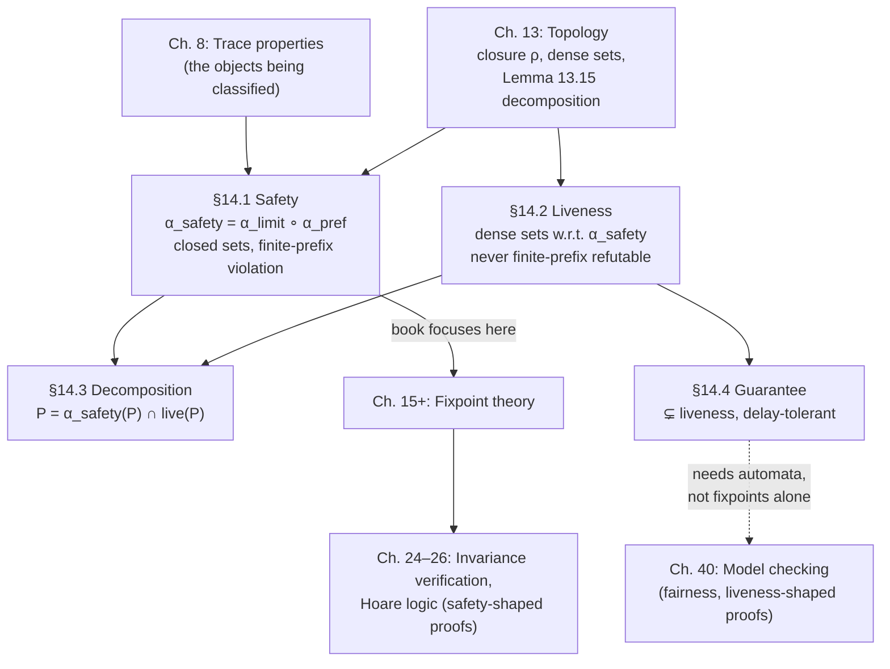

[[book-guidelines|↩ Back to guidelines]]

# Safety and Liveness Properties

## What breaks without this distinction

Suppose you want to build a verifier. You have a program property — some
predicate over program executions — and you want to check whether a given
run satisfies it. Some properties you can check *while the program runs*:
watch the trace unfold, and the moment something forbidden happens (a
division by zero, a negative array index), you can stop and say "violated."
Other properties you fundamentally *cannot* check this way, no matter how
long you wait: "this program terminates" is never falsifiable by watching a
prefix, because the prefix not having terminated yet is completely consistent
with it terminating one step later.

This isn't a minor implementation detail — it's a fault line that runs through
the entire theory of program verification. A runtime monitor, a model
checker, and a static analyzer all have to know, before they start, which side
of this line the property they're checking falls on. Cousot's Chapters 13–14
give this fault line a name — **safety** vs. **liveness** — and, more
importantly, a *precise mathematical definition* rather than the folk
description ("nothing bad happens" vs. "something good happens") that's
usually all you get. The folk description turns out to be slightly wrong (the
book will show you a counterexample), and the precise version is what lets
you actually prove a given property is safety, is liveness, or is neither.

The reason this apparatus lives here in the book, right after trace semantics
(Ch. 6–7) and the hierarchy of program properties (Ch. 8), and right before
[[Fixpoint-Theory|fixpoint theory]] (Ch. 15): safety properties are exactly the properties that
later chapters' *fixpoint-based static analyzers* can soundly approximate by
finite computation. Chapter 14 literally says "this book concentrates on the
verification and static analysis of safety properties of programs" — so this
topic is a hinge for everything that follows.

## Chapter 13's detour: a lightweight topology

Before Cousot can define safety and liveness formally, he needs vocabulary
for "closed" and "dense" — and that vocabulary is topology. Chapter 13 is
explicitly a minimal, purpose-built topology primer: just enough machinery to
support Chapter 14, not a general topology course.

### Topological spaces, open and closed sets

A **topology** $\mathcal{T}$ on a nonempty set $\mathcal{X}$ is a family
$\mathcal{T} \in \wp(\mathcal{X})$ of subsets of $\mathcal{X}$ — the **open
sets** — such that:

$$
\text{(a) unions of open sets are open} \qquad \text{(b) finite intersections of open sets are open}
$$

The **closed sets** are just the complements of the open sets:
$\neg P \triangleq \mathcal{X} \setminus P$. Nothing here is mysterious if
you think of $\mathcal{X}$ as "all possible executions" and open/closed as a
way of carving that space up so that "closeness" (in a generalized,
non-metric sense) is well-behaved.

### Topological closure — the operator that actually matters

What the book actually *uses*, repeatedly, is not the open-set definition
directly but its dual: the **closure operator** $\rho$, satisfying the
**Kuratowski closure axioms**:

- **Expansive**: $P \subseteq \rho(P)$ — closing a set never shrinks it.
- **Idempotent**: $\rho \circ \rho = \rho$ — closing an already-closed set
  does nothing more.
- **Strict**: $\rho(\emptyset) = \emptyset$.
- **Preserves finite joins**: $\rho(P \cup Q) = \rho(P) \cup \rho(Q)$.

Lemma 13.8 proves this makes $\rho$ an **upper closure operator** in the
sense already established in Chapter 11 (Galois connections) — safety and
liveness will turn out to be nothing more than a specific, concrete instance
of the abstract closure-operator machinery you already have. This is the
book's calculational-design philosophy showing up again: rather than invent
safety and liveness from scratch, Cousot *reuses* the closure/Galois
apparatus and just needs to exhibit the right closure operator.

**What breaks without idempotence and extensiveness specifically:** if
closing a set could shrink it, "the closure of a property" wouldn't be a
sound *overapproximation* of that property, which is exactly the role safety
closure will play (§14.1). If closure weren't idempotent, "the safety part of
a property" wouldn't be a well-defined fixed notion — you'd never know if
you'd finished closing.

### Limits of sequences and dense sets

An element $x \in \mathcal{X}$ is the **limit** of a sequence
$\langle x_n \rangle$ iff every neighborhood of $x$ eventually contains all
the $x_n$. Example 13.11 makes the connection to trace semantics explicit:
the iterates of the prefix-trace transformer $F(X) = \{a\} \cup \{\pi a \mid
\pi \in X\}$ converge, in exactly this topological sense, to the infinite
trace $a^\omega$ — this is the same limit construction Chapter 7 used
(informally) to build infinite traces as limits of finite prefixes.

$P$ is **dense** iff $\rho(P) = \mathcal{X}$ — closing it recovers the whole
space. The classic example: $\mathbb{Q}$ is dense in $\mathbb{R}$, because
every real is a limit of rationals.

The one result from Chapter 13 that does all the load-bearing work in
Chapter 14 is **Lemma 13.15**:

$$
\forall P \in \wp(\mathcal{X}).\quad P = \rho(P) \cap (P \cup \neg\rho(P))
$$

*Every set decomposes into the intersection of a closed set, $\rho(P)$, and a
dense set, $P \cup \neg\rho(P)$.* This is a purely set-theoretic fact about
any topological space whatsoever — but once Chapter 14 defines the right
closure operator on trace properties, this single lemma *becomes* the
safety/liveness decomposition theorem. It's worth sitting with this: the book
is not proving safety/liveness decomposition as a special fact about
programs; it's instantiating a generic topological fact.

## Chapter 14: safety and liveness, formally

### The intuition, stated precisely

> Safety properties are trace properties that can be checked at runtime.
> Examples are absence of runtime error or that the successive values taken
> by a variable are increasing. Liveness properties are trace properties that
> cannot be checked at runtime. Examples are termination or [that] the value
> of an integer variable eventually reach[es] 0.

The formal object under discussion is a **trace property**
$P \in \wp(\mathbb{T}_+ \times \mathbb{T}_{+\infty})$: a set of
(initialization-trace, continuation-trace) pairs, using the isomorphic
relational view of the maximal trace semantics from Chapter 8's Galois
isomorphism $\langle \mathbb{T}_+ \to \wp(\mathbb{T}_{+\infty}), \subseteq\rangle \cong \langle \wp(\mathbb{T}_+ \times \mathbb{T}_{+\infty}), \subseteq\rangle$.

### Building the safety closure, one operator at a time

Cousot builds the safety closure operator compositionally, from two simpler
closures — this incremental construction is itself worth internalizing as a
technique, independent of the specific result:

**1. Prefix closure**, $\alpha_{\text{pref}}(\Pi)$: take all (finite and
infinite) prefixes of executions in $\Pi$. Formally, extending the prefix
order $\lessdot$ on traces to executions,
$\langle \pi_0, \pi \rangle \lessdot \langle \pi_0', \pi' \rangle \triangleq \pi_0 = \pi_0' \wedge \pi \lessdot \pi'$:

$$
\alpha_{\text{pref}}(\Pi) \triangleq \{\langle \pi_0, \pi' \rangle \mid \exists \langle \pi_0, \pi \rangle \in \Pi.\ \pi' \lessdot \pi\}
$$

Example 14.2: if $E = \{\langle \sigma, \sigma^{2n}\rangle \mid n \in \mathbb{N}_+\}$
("stays in state $\sigma$ and terminates in an *even* number of steps"), then
$\alpha_{\text{pref}}(E) = \{\langle \sigma, \sigma^n \rangle \mid n \in
\mathbb{N}_+\}$ — the parity requirement is destroyed, because prefix-closing
throws in all the odd-length prefixes too. Lemma 14.5 confirms
$\alpha_{\text{pref}}$ is a genuine topological closure.

**2. Limit closure**, $\alpha_{\text{limit}}(\Pi)$: add every infinite trace
all of whose finite prefixes are already in $\Pi$. Continuing the example, if
$T = \{\langle \sigma, \sigma^n\rangle \mid n \in \mathbb{N}_+\}$, then
$\alpha_{\text{limit}}(T) = T \cup \{\langle\sigma,\sigma^\omega\rangle\}$ —
it adds the never-terminating execution that "would have satisfied every
finite prefix." Lemma 14.7 shows this too is a topological closure (the
idempotence proof is genuinely intricate — a small taste of how much
real analysis has to happen even in a "lightweight" topology chapter).

**3. Safety closure**, the composition:
$\alpha_{\text{safety}} \triangleq \alpha_{\text{limit}} \circ \alpha_{\text{pref}}$
— take all limits of prefixes. Theorem 14.10 proves the composite is
*still* a topological closure (this requires showing prefix-closing again
after limit-closing adds nothing new — a genuine, nontrivial commutation
argument). Running the example through both stages:
$\alpha_{\text{safety}}(E) = \{\langle \sigma, \sigma^n\rangle \mid n \in
\mathbb{N}_+\} \cup \{\langle \sigma, \sigma^\omega \rangle\}$ — "stays in
state $\sigma$" (terminating or not, any parity).

### Definition 14.11 — safety

$$
P \text{ is a safety property} \iff \alpha_{\text{safety}}(P) = P
$$

Safety properties are exactly the **closed sets** of the topology that
$\alpha_{\text{safety}}$ generates (Theorem 14.14 — this is just Chapter 13's
Lemma 13.9 applied to this specific closure). And because
$\alpha_{\text{safety}}$ is an upper closure operator on the complete lattice
$\langle \wp(\mathbb{T}_+ \times \mathbb{T}_{+\infty}), \subseteq \rangle$,
Theorem 11.88 immediately gives **Theorem 14.15**: the safety properties
themselves form a complete lattice. One subtlety worth flagging (Example
14.16, Exercise 14.24): the *union* of infinitely many safety properties need
not be a safety property (e.g. "terminates in exactly $n$ steps" for each
$n$, unioned over all $n$, gives termination — not safety). The **lub** in
the safety lattice is instead $\alpha_{\text{safety}}(\bigcup_n P_n)$, which
re-closes the union — concretely, this reintroduces the missing limit trace.

**Worked examples of safety properties (§14.1.6):**
- "After reaching program point $\ell$, variable $x$ is always positive."
- "The value of $x$ is monotonically increasing."
- Not safety: "all executions terminate" (Exercise 14.19) — because a
  not-yet-terminated finite prefix is consistent with eventual termination,
  so no finite observation can witness the violation "never terminates."

### Why safety violations are runtime-checkable: Theorem 14.20

This is the theorem that cashes out the "nothing bad ever happens, and if it
does you'll catch it in finite time" intuition:

$$
\alpha_{\text{safety}}(\Pi) = \Pi \implies \forall \langle \pi_0, \pi \rangle \notin \Pi.\ \exists \pi' \in \mathbb{T}_+.\ \langle \pi_0,\pi'\rangle \lessdot \langle \pi_0,\pi \rangle \wedge \langle \pi_0,\pi'\rangle \notin \Pi
$$

In words: if $\Pi$ is safety-closed, then every execution that violates $\Pi$
has a **finite prefix** that already violates $\Pi$. Watch the trace, and if
it's ever going to fail, it fails on a finite prefix you can actually
observe — this is the formal content behind "safety = checkable violation."
The proof leans on $\alpha_{\text{limit}}$'s idempotence, tracing the
compositional construction back through.

Critically — and the book is careful to flag this — checkable violation is
*not* the same as checkable satisfaction. Rice's theorem (Ch. 9) still applies:
there's no algorithm that, given a program, always decides *whether* it
satisfies a given nontrivial safety property; you can only catch violations
when they happen at runtime, not certify their absence in general.

### Definition 14.26 — liveness

Instead of inventing a separate closure operator, liveness reuses
$\alpha_{\text{safety}}$'s topology directly, via Chapter 13's density
notion: liveness properties are the **dense sets** of that same topology.
Equivalently, by Lemma 13.14:

$$
P \text{ is a liveness property} \iff \mathrm{live}(P) = P, \quad \text{where } \mathrm{live}(P) \triangleq \neg\alpha_{\text{safety}}(P) \cup P
$$

A useful reformulation (Theorem 14.27):
$P$ is liveness $\iff \neg P \subseteq \alpha_{\text{safety}}(P)$ — every
non-$P$ execution is nonetheless a limit of $P$-satisfying prefixes. This is
the formal shape of "no finite prefix ever rules $P$ out."

**Theorem 14.30** makes the "can't check at runtime" intuition precise:

$$
\mathrm{live}(P) = P \iff \forall \pi_0 \in \mathbb{T}_+.\ \forall \pi \in \mathbb{T}_{+\infty}.\ \exists \pi' \in \mathbb{T}_{+\infty}.\ \langle \pi_0, \pi\pi'\rangle \in P
$$

Read this as: *no matter what prefix you've observed so far, there is always
some continuation that would make $P$ true.* A monitor watching a finite
prefix can never rule out $P$ — there's always still hope. That's exactly why
liveness is not runtime-checkable, and it's stated with the same rigor as the
safety-checkability theorem, just proving the opposite property.

**Example 14.28**: termination, $\mathbb{T}_+ \times \mathbb{T}_+$, is a
liveness property — a formally satisfying closure of the loop opened by
Exercise 14.19 (termination is *not* safety). The book shows this by direct
computation: $\alpha_{\text{safety}}(\mathbb{T}_+ \times \mathbb{T}_+) =
\mathbb{T}_+ \times \mathbb{T}_{+\infty}$, so $\mathrm{live}(\mathbb{T}_+
\times \mathbb{T}_+) = \emptyset \cup (\mathbb{T}_+ \times \mathbb{T}_+) =
\mathbb{T}_+ \times \mathbb{T}_+$, satisfying the density condition.

**Important correction to the folk intuition:** liveness is *not* the same
thing as "eventuality"/"guarantee" properties ("something good must
eventually happen"). Cousot flags explicitly that this common informal
reduction of liveness to guarantee is *improper* — which is exactly what
§14.4 exists to demonstrate.

### Theorem 14.32 — the decomposition, for real this time

$$
\forall P \in \wp(\mathbb{T}_+ \times \mathbb{T}_{+\infty}).\quad P = \alpha_{\text{safety}}(P) \cap \mathrm{live}(P)
$$

*Every trace property is the intersection of its safety part and its liveness
part.* The proof is one line: "this is a corollary of lemma 13.15" — the
generic topological decomposition fact, specialized to the
$\alpha_{\text{safety}}$ topology. This is the payoff for building the
topology machinery in Chapter 13 at all: once you've shown
$\alpha_{\text{safety}}$ is a genuine topological closure, the
Alpern–Schneider-style safety/liveness decomposition theorem is free.

This is the **Alpern–Schneider theorem** in its original (non-topological)
form — Cousot's contribution here is recasting it as an instance of general
topology rather than a bespoke result about program traces, which is exactly
the calculational-design ethos running through the whole book: don't
postulate a new theory for each new phenomenon, find the general apparatus it
instantiates.

One caution worth carrying forward (Exercise 14.33, and the book's own
framing note): not every program property is even a *trace* property in the
first place — dependency properties (Ch. 47) are a later example — so the
safety/liveness dichotomy, and this decomposition, only applies within the
world of trace properties to begin with.

### Guarantee properties — a strict subclass of liveness

Because there's no single *strongest* liveness property implied by a given
$P$ (liveness closure, `live`, is extensive and idempotent but *not*
increasing/monotone), it's useful to isolate a well-behaved subclass. Define
the **guarantee closure**:

$$
\alpha_{\text{guarantee}}(X) \triangleq (\mathbb{T}_+ \times \mathbb{T}_*) \circ X
$$

(composing with all finite-trace prefixes/relations — concatenating any
finite trace onto members of $X$). Theorem 14.34 confirms this is a genuine
upper closure operator (extensive, idempotent, monotone). **Definition
14.35**: $P$ is a guarantee property iff $\alpha_{\text{guarantee}}(P) = P$
— informally, *some event is guaranteed to eventually happen, and happening
later doesn't break it* (delay-tolerant success).

**Theorem 14.38 — every guarantee property is a liveness property.** The
proof is a clean two-line computation:
$\alpha_{\text{safety}}(\alpha_{\text{guarantee}}(X)) = \mathbb{T}_+ \times
\mathbb{T}_{+\infty}$ (the safety closure of any guarantee-closed set is
everything), so $\mathrm{live}(X) = \neg(\mathbb{T}_+ \times
\mathbb{T}_{+\infty}) \cup X = X$.

**But the containment is strict — Theorem 14.42:**

$$
\alpha_{\text{safety}}(\wp(\mathbb{T}_+ \times \mathbb{T}_{+\infty})) \cap \alpha_{\text{guarantee}}(\wp(\mathbb{T}_+ \times \mathbb{T}_{+\infty})) = \{\mathbb{T}_+ \times \mathbb{T}_{+\infty}\}
$$

*No property (other than the trivial "true" property) is both a safety and a
guarantee property.* This is the theorem that formally kills the naive
"liveness = eventuality" intuition: if liveness just *meant* guarantee, and
guarantee properties formed a complete lattice under intersection/union
(Theorem 14.41, they do), you'd expect substantial overlap with safety. There
is essentially none. Guarantee is a genuinely narrower, stronger notion than
general liveness.

**Example 14.39** (elaborated in Exercise 14.40): "an interactive system can
keep providing service while never letting its resource usage grow without
bound" is liveness but *not* guarantee — there's no fixed point in the
execution by which the property is "locked in"; it has to keep holding
indefinitely, arbitrarily far out, which is exactly what guarantee's
delay-tolerant, eventually-locked-in structure rules out.

Termination itself (Example 14.36) *is* a guarantee property — once a trace
terminates, prefixing it with more steps beforehand doesn't stop it from
having terminated — showing the taxonomy is genuinely a *strict* hierarchy:
guarantee $\subsetneq$ liveness, and safety $\cap$ guarantee is (essentially)
empty, while safety $\cap$ liveness $=$ trivial-only (Exercise 14.31, solved
in the book: only the property $\mathbb{T}_+ \times \mathbb{T}_{+\infty}$
itself is both safety *and* liveness).

## Grounding: what this looks like in code

### Rust — the checker-shaped reading

The Rust-relevant payoff is direct: **safety properties are exactly the
properties your runtime monitor or model checker can implement as an
incremental, prefix-only check** — no lookahead, no backtracking over the
whole execution, just "does this new event still keep me in the safe set?"
Liveness properties structurally *cannot* be implemented this way; you need
either a full-trace/fairness argument (model checking with Büchi automata) or
you accept you're only checking guarantee-style approximations.

```rust
// A safety monitor: only needs the *new* event plus its own running state.
// This shape is only sound for safety properties (Theorem 14.20) —
// a violation, if it ever occurs, is witnessed by a finite prefix.
trait SafetyMonitor<Event> {
    /// Returns `Err` the instant a finite prefix witnesses a violation.
    /// Never needs to "wait and see" — that's what makes it a safety check.
    fn step(&mut self, event: &Event) -> Result<(), Violation>;
}

// Example: "x is monotonically increasing" (14.18) — a genuine safety
// property, checkable incrementally.
struct MonotoneCheck { last: i64 }
impl SafetyMonitor<i64> for MonotoneCheck {
    fn step(&mut self, &x: &i64) -> Result<(), Violation> {
        if x < self.last { return Err(Violation::NotMonotone); }
        self.last = x;
        Ok(())
    }
}

// "eventually terminates" CANNOT be written as a SafetyMonitor: no finite
// sequence of `step` calls can ever return `Err` for it, because
// non-termination is never witnessed by a finite prefix (Exercise 14.19).
// A guarantee-style checker instead has to accept "still pending" as a
// third outcome distinct from "violated":
enum GuaranteeStatus { Pending, Satisfied }
trait GuaranteeMonitor<Event> {
    fn step(&mut self, event: &Event) -> GuaranteeStatus;
    // No `Violation` variant is even expressible here — that's the point.
}
```

This `SafetyMonitor` vs. `GuaranteeMonitor` split is a direct, load-bearing
design fork for the verifier project: any Hoare-triple or contract-checking
component that needs a hard, sound "this failed" signal at runtime has to be
restricted to properties provable safety in Cousot's sense — trying to build
a `SafetyMonitor` for a liveness property is not a bug to fix, it's a
category error, and Theorem 14.20/14.30 tell you exactly why, symbolically.

### Lean — the topological reading, definitionally

Because Cousot builds safety/liveness as instances of a *generic* closure
operator (upper closure, Kuratowski axioms) rather than a bespoke
program-specific definition, this is a natural fit for Lean's style of
building a small theory once and instantiating it:

```lean
-- The generic notion (mirrors §13.2's Kuratowski axioms), independent
-- of programs entirely.
structure TopologicalClosure (X : Type) where
  closure     : Set X → Set X
  expansive   : ∀ P, P ⊆ closure P
  idempotent  : ∀ P, closure (closure P) = closure P
  strict      : closure ∅ = ∅
  preservesJoin : ∀ P Q, closure (P ∪ Q) = closure P ∪ closure Q

-- Safety, verbatim as "the set is a fixed point of the closure" —
-- this `def` is definitionally exactly Cousot's Definition 14.11.
def IsSafety {X} (α : TopologicalClosure X) (P : Set X) : Prop :=
  α.closure P = P

-- Density, and hence liveness (14.26), is likewise definitional —
-- `IsLiveness` unfolds to exactly `live(P) = P` with no extra content.
def IsLiveness {X} (α : TopologicalClosure X) (P : Set X) : Prop :=
  (α.closure Pᶜ)ᶜ ∪ P = P
```

The instructive point for the elaborator project isn't a specific Lean tactic
here — it's the *methodology*: Cousot proves the decomposition theorem
(14.32) once, generically, as a fact about any `TopologicalClosure`
(Lemma 13.15), and then gets the program-specific instance "for free" by
supplying $\alpha_{\text{safety}}$ as the witness. This is the same
calculational-design move you want from a minimal elaborator: build the
generic unification/closure machinery once, and let each specific judgment
form (definitional equality, subtyping, safety-checking) be *an instance*
rather than a hand-rolled special case.

### Python — a quick illustrative sketch

```python
# A five-line illustration of *why* violation-of-safety is finite-prefix
# checkable but violation-of-liveness is not — not load-bearing, just
# a concrete feel for Theorem 14.20 vs. Theorem 14.30.

def check_safety_prefix(trace_prefix, forbidden_state):
    # Safety: "never reach forbidden_state" — one bad step and you're done.
    return forbidden_state not in trace_prefix

def check_liveness_prefix(trace_prefix, must_eventually):
    # Liveness: absence in the prefix proves NOTHING — there's always
    # a hypothetical continuation where must_eventually still shows up.
    return "cannot conclude from a finite prefix"  # by Theorem 14.30
```

## Where this leads



Two threads run forward from here. First, the book announces explicitly that
its own scope narrows from this point on: "*this book concentrates on the
verification and static analysis of safety properties of programs*" (§14.5).
Everything from Chapter 15's fixpoint theory through the reachability
semantics, Hoare logic, and the whole battery of abstract domains (signs,
intervals, zones, points-to, dependency) that follow is, structurally, *safety
analysis* — sound overapproximation of the set of reachable/possible
executions, which is exactly the shape Theorem 14.20 makes tractable: a
finite, prefix-observable violation witness is what a fixpoint-based static
analyzer can hope to soundly approximate. Liveness properties (termination,
fairness) need a fundamentally different toolkit — typically automata-based
model checking or separate ranking-function arguments — which the book
revisits later (Ch. 40, [[Model-Checking-as-Abstract-Interpretation|Model Checking as Abstract Interpretation]]) rather
than folding into the main fixpoint-analysis line.

Second, for the verifier/elaborator projects: this chapter is the formal
justification for *why* a Hoare-triple-checking or contract-verification
component built on invariant/fixpoint search (which is what Chapters 17–18
build next) is only ever going to give you sound, checkable guarantees for
safety-shaped specifications. If a specification is liveness-shaped
(termination guarantees, "this resource is eventually released"), no amount
of invariant strengthening alone will make it runtime- or fixpoint-checkable
in this same sense — you need either a guarantee-style ranking/measure
argument (which the book's later well-founded/variant-function machinery
supplies) or a genuinely different, automata-based proof technique. Knowing
which bucket a specification clause falls into, before you start proving it,
is exactly the discipline Chapters 13–14 hand you a precise test for.
