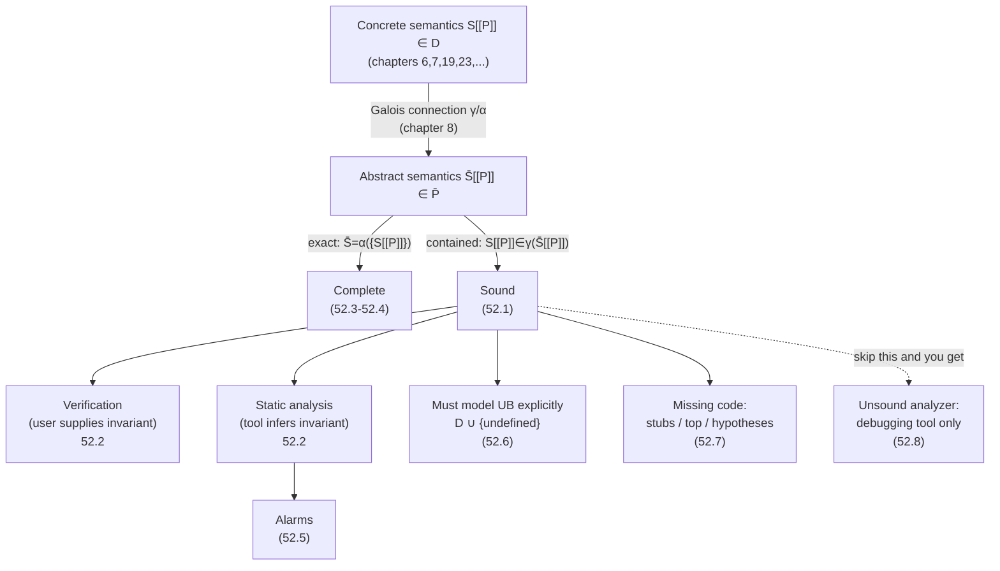

# Soundness, Completeness, and the Practice of Static Analysis

[[book-guidelines|↩ Back to guidelines]]

## Why this chapter exists

Every other chapter in this book *builds* something — a semantics, a fixpoint theorem, an abstract domain, a widening operator. Chapter 52 is different: it's Cousot stepping back after fifty-one chapters of construction to answer the question a skeptical reader should have been asking the whole time — "okay, but what did any of that actually *buy* me, precisely?" The word "soundness" gets used constantly and informally in the static-analysis literature ("our tool is sound for X"), and Cousot's complaint (he cites this explicitly) is that it's usually left "in the vagueness of informal explanations." This chapter is the payoff of the calculational-design method: because every abstract semantics in the book was *derived* from a concrete one via a Galois connection or a soundness relation, soundness isn't something you have to separately prove after the fact — it falls out of the construction. This chapter makes that payoff explicit, precise, and — in its second half — brutally practical, addressing the things a textbook could get away with ignoring: what happens when the language itself has undefined corners, what happens when you can't see a library's source code, and what happens when a vendor just... doesn't tell you their tool is unsound.

If you're building a verifier, this chapter is the closest thing in the book to a spec for what "verifier" is even supposed to mean.

## Soundness, made precise (52.1)

**The problem soundness solves.** Without a precise definition, "sound" degenerates into a marketing word. You need a definition sharp enough that you could, in principle, write a machine-checkable proof obligation from it. Cousot's move is to phrase soundness not as a property of an algorithm, but as a *containment relation between two semantics living in different domains, connected by concretization*.

**The setup.** A program $P$ of a language $\mathbb{P}$ has a concrete semantics $\mathcal{S}\llbracket P \rrbracket \in \mathcal{D}$ — an element of the semantic domain $\mathcal{D}$ (this could be trace semantics, reachability semantics, denotational semantics — any of the levels of abstraction built up over chapters 6, 7, 19, 23, 25, 26, 28, 42). Program *properties* live one level up: $\mathbb{P} \triangleq \wp(\mathcal{D})$, sets of possible semantics. The **collecting semantics** $\{\mathcal{S}\llbracket P \rrbracket\}$ — the singleton set containing the actual semantics — is the *strongest* semantic property you could possibly state about $P$ (everything else is an overapproximation of it).

You're rarely interested in *all* of $\wp(\mathcal{D})$; you restrict to a computer/logic-representable subdomain $\overline{\mathbb{P}}$ whose meaning is fixed by a **concretization function** $\gamma \in \overline{\mathbb{P}} \to \wp(\mathcal{D})$, monotone (so that $\subseteq$ on $\wp(\mathcal{D})$ corresponds to $\sqsubseteq$ on $\overline{\mathbb{P}}$). If every property in $\wp(\mathcal{D})$ has a *best* ($\sqsubseteq$-most-precise) approximation in $\overline{\mathbb{P}}$, that upgrades $\gamma$ into a full **Galois connection**:

$$\langle \wp(\mathcal{D}), \subseteq \rangle \xrightleftharpoons[\alpha]{\gamma} \langle \overline{\mathbb{P}}, \sqsubseteq \rangle$$

Now the definition itself. Given an abstract semantics $\overline{\mathcal{S}}\llbracket P \rrbracket \in \overline{\mathbb{P}}$ (what your verifier or analyzer actually computes or checks), it is **sound** exactly when:

$$\{\mathcal{S}\llbracket P \rrbracket\} \subseteq \gamma(\overline{\mathcal{S}}\llbracket P \rrbracket) \quad\text{i.e.}\quad \mathcal{S}\llbracket P \rrbracket \in \gamma(\overline{\mathcal{S}}\llbracket P \rrbracket)$$

In words: *the real behavior of the program, concretized back down from the abstract description, must actually be one of the behaviors that description permits.* That's the whole definition. No hand-waving about "catching most bugs" — either the concrete run is inside the concretized abstract claim, or the analyzer lied.

When a Galois connection exists, the *best possible* abstract semantics is $\alpha(\{\mathcal{S}\llbracket P \rrbracket\})$, and soundness of any candidate $\overline{\mathcal{S}}\llbracket P \rrbracket$ collapses to the single inequality:

$$\alpha(\{\mathcal{S}\llbracket P \rrbracket\}) \sqsubseteq \overline{\mathcal{S}}\llbracket P \rrbracket$$

— your abstraction just has to be *at least as coarse* as the best possible one, which (by the Galois connection adjunction) is equivalent to the $\gamma$-containment above.

**What breaks without this.** Without a fixed concrete semantics to check against, "sound" has no truth-conditions — you can't even in principle write down what would falsify the claim. This is the exact failure mode the chapter later diagnoses in commercial unsound tools (52.8): the developers themselves usually can't tell you precisely what their tool guarantees, because there's no $\mathcal{S}\llbracket P\rrbracket$ and $\gamma$ pinned down anywhere.

**Why this is calculational, not postulated.** Because $\mathcal{S}\llbracket P \rrbracket$ is itself defined by structural induction on $P$'s grammar (using fixpoints for loops/recursion, chapters 17, 19), the abstract $\overline{\mathcal{S}}\llbracket P \rrbracket$ can be *derived* by the induction and fixpoint-abstraction theorems of chapters 16 and 24, rather than guessed and checked. And because $\overline{\mathbb{P}}$ decomposes into independent abstract domains assembled by functors (the reduced product of chapter 36), soundness proofs are modular — you verify each domain's primitives once, and composition is free. This modularity is what makes soundness *scale* to industrial analyzers instead of being a one-off proof for a toy language.

**Grounding — Rust.** This is close to how a Rust type checker or borrow checker is specified, if you were honest about it: the "concrete semantics" is what the program actually does at runtime (memory layout, aliasing, moves); the "abstract semantics" is what `rustc`'s trait/lifetime solver claims. Soundness of the borrow checker is exactly the statement "every program that typechecks is memory-safe when it runs" — a $\gamma$-containment in disguise, where $\gamma$ maps a lifetime/ownership judgment down to the set of concrete executions it's claimed to cover. A minimal skeleton for a Hoare-triple checker in the spirit of your verifier project:

```rust
// A concrete trace domain D, and an abstract predicate domain P-bar.
trait ConcreteSemantics {
    type Trace;
    fn run(&self) -> Self::Trace;
}

trait AbstractSemantics {
    type Abstract;
    // gamma: concretization, abstract -> set of concrete traces it permits
    fn concretize(&self, a: &Self::Abstract) -> Box<dyn Fn(&<Self as ConcreteSemantics>::Trace) -> bool>
    where Self: ConcreteSemantics;
}

// Soundness obligation (not machine-checked here, but this is *what*
// a soundness proof for `analyze` must establish):
//   for every program P: concretize(analyze(P))(run(P)) == true
fn analyze<S: AbstractSemantics>(program: &str) -> S::Abstract {
    unimplemented!("calculationally derived, not postulated")
}
```

**Grounding — Lean.** Lean's kernel gives you the cleanest possible illustration of $\gamma$-containment as literal propositional content: a soundness theorem for an abstract interpreter is stated as `∀ p, concrete_sem p ∈ gamma (abstract_sem p)`, and *proving* it (rather than asserting it) is exactly what distinguishes a verified analyzer from a postulated one — the same distinction the chapter draws in 52.9 between "calculational design" and "informal design followed by an a posteriori check."

## Verification versus static analysis (52.2)

**The problem.** Both verification and static analysis need to discover and prove some property *inductive* (true initially, preserved by every execution step — structural and/or fixpoint induction). By Rice's theorem (9.12), that inductive property is in general not effectively computable, for the collecting semantics *or* the abstract one. There are exactly two ways to route around this uncomputability, and the chapter's central claim is that they are asymmetric in difficulty:

- **Verification**: the *end user* supplies the inductive property (this is chapters 25–26's territory — invariants, specifications). Unless $\overline{\mathbb{P}}$ happens to be decidable, checking that the user's candidate really is inductive can't be fully automated either — you still need theorem-prover user assistance, or a proof term that a proof assistant checks.
- **Static analysis**: the tool *approximates* the strongest inductive property automatically, using abstraction (chapter 27) plus extrapolation/interpolation — i.e., widening and narrowing (chapter 34). This buys automation at the cost of completeness: the answer is guaranteed effective, but not guaranteed to be the exact property.

**The asymmetry, stated precisely.** A static analyzer must infer the inductive property that a verifier would merely be handed — and that inferred property might need to be the *exact* abstraction of the collecting semantics to be useful. So **sound static analysis is strictly harder than sound verification**, at least on infinite abstract domains that don't reduce to finite ones. This is the chapter's answer to Key Question 2 from the guidelines: verification offloads the hard creative step (finding the invariant) to a human or an oracle; static analysis must automate that step, and automating invariant-discovery on an infinite domain is where all of the book's machinery (Galois connections, widening, reduced products) earns its keep.

**Grounding.** This maps directly onto your two stated engineering targets: a Rust verifier that checks programs against user-supplied Hoare-triple specs is squarely in the *verification* column (you supply $\gamma$'s target predicate; the checker's job is "is this inductive," which for decidable fragments can be fully automated, and for others needs SMT or proof-term checking). A Lean-style elaborator's `isDefEq`/unifier, by contrast, isn't proving program properties at all — but the general shape (discover a solution automatically vs. require a supplied witness and just check it) recurs there too: unification search is "static-analysis-like" automation, while accepting an explicit elaborated term and kernel-checking it is "verification-like." The chapter's asymmetry argument — automation is harder to make sound than checking — is exactly why type-checking (checking) is decidable while type *inference* with dependent types plus implicits (search) routinely is not.

## Completeness, and why it's not the same as computability (52.3–52.4)

**Definition.** Completeness says the *converse* direction: if a property genuinely holds of all executions, the method can always be used to *prove* it — no false alarms, ever. Completeness is additional to, not a substitute for, soundness. Under calculational design, you get both simultaneously exactly when the abstract semantics coincides with the *best* abstraction:

$$\overline{\mathcal{S}}\llbracket P \rrbracket = \alpha(\{\mathcal{S}\llbracket P \rrbracket\})$$

i.e. equality, not just $\sqsubseteq$-containment, in the soundness inequality from 52.1.

**The key conceptual untangling: completeness $\neq$ computability.** These get conflated constantly, and Cousot is emphatic that they're orthogonal. Verification methods are frequently complete (any true inductive invariant *can* in principle be expressed and proved) while still, by Rice's theorem, not fully automatable — either the property can't be expressed in $\overline{\mathbb{P}}$ at all, or it can be but the inductive proof isn't fully mechanizable. Completeness is about *expressive and proof-theoretic adequacy*; automatability is about *whether a machine can find the proof unassisted*. A method can have either without the other.

**You can always buy completeness — the question is at what cost.** Any abstraction can be made complete by refining it (more precise, more expensive/harder to compute) or by coarsening it all the way to the trivial abstraction (everything maps to $\mathtt{tt}$, so nothing is ever wrong, and nothing useful is ever said — complete but useless). The identity abstraction (no abstraction at all) and the everywhere-$\mathtt{tt}$ abstraction are *always* complete, for trivial reasons. The interesting content is in between. And it isn't always achievable non-trivially: the chapter cites a result that for certain past/future temporal logics, *every* non-trivial abstraction is incomplete — only the identity and the everywhere-imprecise abstractions are complete. So "just refine until it's complete" is not a universal recipe; for some property classes, completeness genuinely forces triviality.

**Practical incompleteness management (52.4).** Rice's theorem guarantees incompleteness is unavoidable *across all programs*, but that doesn't mean you can't reach zero false alarms on one program or one well-behaved family (the chapter cites Astrée reaching exactly this for synchronous control-command code). Levers available: refine the abstract domain (add domains to a reduced product, chapter 36, to attack the *origin* of imprecision rather than symptom-patch it) or refine widening (section 34.5) — but precision gains often come with *disproportionate* cost growth as the analyzed program class widens. Beyond that, it's user help: either let the user pick which abstract domains to include (well-supported for numerical domains, still immature for symbolic ones), or let the user supply program invariants directly — though naively this often doesn't help, because a nonlinear user invariant gets *linearized away* by the analyzer's own coarser domains and its extra information is lost in translation. The fix the chapter proposes: express user invariants in a separate, more expressive domain used *only* to reduce the other domains (not to replace them), so the extra precision survives the abstraction step instead of being discarded by it.

## Handling alarms (52.5)

**The obligation soundness imposes.** If your analyzer is sound, it *must* report every potential error, true or false — that's a direct corollary of the $\gamma$-containment definition: any behavior not covered by the report would violate soundness. The cost is that an imprecise analysis can flood the user with alarms, most of which are false. Since the user can't tell true from false alarms just by looking, the practical problem shifts from "produce alarms" (soundness forces that) to "**order** the alarms usefully."

Strategies the chapter names: handle alarms stemming from *semantic undefinedness* first (52.6 explains why — they poison everything downstream); use **dependency analysis** (chapter 47) or the sharper **responsibility analysis** to find the small set of *dominant* alarms that are causally upstream of a cascade of derived ones, and triage those first; use **abstract testing** to try to positively identify which alarms are genuinely true. If what's left after all that is only false alarms, there's no more triage to be had — the analysis itself has to be refined (back to 52.4's levers).

## Handling semantic undefinedness (52.6)

This is the chapter's most technically substantial section, and it directly answers the guidelines' Key Question 1: how can a language with genuinely undefined behavior — like C — be soundly analyzed at all?

**The root requirement.** Soundness and completeness are only as meaningful as the formal semantics they're checked against. If the semantics itself leaves behavior undefined, you need that undefinedness *reflected explicitly in the semantic domain* and reported to the user — you cannot just quietly assume "undefined behavior never happens" (that would silently break soundness) or refuse to analyze at all (useless).

**Three distinct sources of the problem**, which the chapter is careful to separate:

1. **Implementation drift** — the semantics you're analyzing against isn't the one the compiler actually implements (compilers have bugs). The scientific fix: prove the compiler correct, or check source/object-code equivalence per compiled program.
2. **No semantics exists at all**, formally or informally. Then reasoning about executions is reasoning about undefined mathematical objects — "mathematical nonsense," in Cousot's words — and there is no way around it except to first *define* the language (the chapter cites this having been done for Python). Note the sharp distinction from *postulating* a semantics at some abstract level: that's always available and always easier, but a genuine correctness proof needs an actual program $\overline{\mathcal{S}}$, a specification $\gamma$, and a proof that one satisfies the other — postulation just relocates where the unproven assumption lives, it doesn't remove it.
3. **An informal semantics with genuine gaps** — the common case, e.g. C. Here the fix is to classify the gaps and handle each soundly. The chapter reproduces the C standard's own three-way taxonomy:
   - **Unspecified behavior** — several outcomes are allowed (e.g., order of evaluation of expressions). Sound handling: overapproximate by considering *all* allowed behaviors; if that's too imprecise, an *underapproximation warning* must be issued whenever some possible behaviors are excluded. (A determinacy analysis — proving all evaluation orders give the same result — can sidestep the imprecision entirely when it succeeds.)
   - **Implementation-defined behavior** — also unspecified, but the compiler must document its choice (e.g., integer size/endianness, signed-overflow semantics). Soundly handled by *parameterizing* the analysis on the choice.
   - **Undefined behavior proper** — the standard imposes *no* requirements at all (e.g., dereferencing a dangling pointer, violating sequence-point ordering). The sound approach: signal it, then continue analyzing the *correct* behaviors, with an explicit warning that **the analysis is no longer valid past that point if the UB is ever actually hit at runtime**.

**The precise soundness statement for UB-laden languages.** The semantics is defined as maximal executions *up to the first undefined behavior, if any* — formally $\mathcal{S}\llbracket P \rrbracket \in \mathcal{D} \cup \{\text{undefined behaviors}\}$ — and the analysis is sound *for that semantics*. This is the key move that answers Key Question 1: soundness isn't broken by UB, because the semantics itself was honestly redefined to stop exactly where the language stops making promises. Case analysis on what actually happens at runtime:
- If the flagged UB never actually occurs (false alarm), analysis and runtime coincide exactly.
- If it does occur (true alarm), analysis and runtime coincide *up to* the point of occurrence — and nothing the analyzer said about anything *after* that point is a valid conclusion.

Consequently, UB-related warnings should always be triaged **first** among alarms (this is the forward reference from 52.5) — everything downstream of an unresolved UB alarm is analytically untrustworthy until that alarm is cleared by program correction or analyzer refinement.

The chapter explicitly ties this to two other places in the book doing the same move: **typing (chapter 49)**, where the semantics cleanly separates *static* errors (caught by the type system) from *dynamic* ones (not), and **Astrée**, whose soundness envelope is precisely specified and reported to the user rather than left implicit.

**Grounding — Rust.** This is precisely the discipline `unsafe` is supposed to enforce and that Miri (Rust's UB-detecting interpreter) implements operationally: safe Rust's semantics is defined to *exclude* the UB cases by construction (no dangling derefs, no data races reachable through the type system), so a soundness argument for safe Rust doesn't need this three-way taxonomy at all — it needs it only at `unsafe` boundaries, which is exactly why `unsafe` blocks are the targeted audit surface for a Rust verifier, not the whole program.

```rust
// Modeling the chapter's D ∪ {undefined behaviors} domain directly:
enum Outcome<T> {
    Value(T),
    Unspecified(Vec<T>),     // all allowed behaviors, soundly enumerated
    ImplementationDefined(T), // parameterized by a chosen target profile
    Undefined,                 // analysis is valid only strictly before this
}
```

**Grounding — Python.** A quick illustrative sketch of "sound up to the first UB" as a small interpreter combinator — not load-bearing, just the shape of the idea:

```python
def run_sound(trace, is_ub):
    """Return the prefix of `trace` up to (not including) the first
    point where `is_ub` holds; anything after that is unreported by
    design, matching the chapter's 'valid up to the first undefined
    behavior, if any' semantics."""
    for i, state in enumerate(trace):
        if is_ub(state):
            return trace[:i], True   # true alarm if this state is ever reached
    return trace, False
```

## Handling missing code (52.7)

**The problem.** Real analyses hit calls into libraries or system calls whose source isn't available (often not even in the same language). Soundness can't just silently assume "the call does nothing bad."

**Sound options, in decreasing order of precision:**
1. If the library/OS is well-documented, write **stubs**: given an abstract precondition, return the abstract postcondition guaranteed valid after the call.
2. Absent documentation, the only fully sound fallback is **"top/everywhere undefined"** — which typically propagates pervasively and floods the analysis with false alarms.
3. An intermediate option: ask the programmer for an explicit **hypothesis** after the call. Soundness of the overall result then becomes conditional on the *veracity* of that hypothesis — this is the route Astrée actually takes in practice (e.g., users supply input-value intervals), with the practical guidance to supply intervals *larger* than strictly necessary, to make any robustness conclusion stronger than the minimum required.

This is a direct, unavoidable instance of the "verification vs. static analysis" asymmetry from 52.2, pushed down to the level of individual function calls: full automation (option 2) is sound but nearly useless; full precision (option 1) requires work equivalent to writing part of the specification by hand; the middle ground (option 3) trades automation for a documented, auditable soundness dependency.

## The ethics and economics of unsound analyzers (52.8)

This section is the chapter's most opinionated, and it's worth reading as argument rather than just summary.

**The economic fact.** Sound commercial static analyzers are roughly an order of magnitude harder and more expensive to build than unsound ones (Cousot cites this directly). Soundness is also *hard to sell*, because buyers — including, pointedly, "even some scientists" — often don't fully grasp what soundness buys them or costs them. The market incentive therefore tilts toward cheap, unsound tools.

**How unsoundness manifests in practice:**
- **Omitting and hiding alarms** — unsound tools often generate *more raw alarms* than sound ones while simultaneously *hiding most of them*, surfacing only what a heuristic guesses is "probable." This is popular precisely because it feels less noisy — but the noise reduction is bought by silently discarding some genuine bugs along with the false positives, with no way for the user to know which. The chapter holds up **Polyspace Code Prover**'s three-way classification (definite error / no error / potential error — red/green/gray) as the sound alternative: eliminate definite (red) errors first, which in practice also tends to clear out many false alarms among the potential (gray) ones, rather than hiding grays wholesale.
- **Bounding execution unsoundly** — e.g., analyzing an airplane control loop assuming a maximum 10-hour flight (with a 20-hour safety margin) is *sound* only relative to that stated bound, and becomes silently unsound the moment the assumption is violated (e.g., the program isn't reinitialized between flights). The chapter's sharper point: comparing loop-unrolling-with-a-bound against widening-based analysis on raw precision/performance, without disclosing that the bound changes *what is actually being checked*, is an unfair comparison dressed up as a fair one.
- **Undisclosed, undefined unsoundness** — the sharpest ethical claim in the chapter: many commercial analyzers are unsound *in ways nowhere formally defined*, and their creators stay silent about it. Cousot's framing: rejecting mathematical rigor "would be easier for charlatans," and while a minority of practitioners take that path, the scientific mainstream does not — because abstract interpretation demonstrates rigor is *achievable* here, which removes the excuse for skipping it.

**The reframe: unsound tools are debugging tools, not analysis tools.** Cousot's position is definitional, not just a value judgment: since an unsound method gives no soundness guarantee, it provides no *proof* of absence of bugs — it can only ever find some bugs (a debugging tool, per the taxonomy set up in chapter 1), never certify their absence. Worse, because the unsoundness is undisclosed, results aren't even stable across tool releases — a later version can silently regress and stop reporting a real bug it used to catch, with no visible signal that this happened. "There is no notion of scientific progress without soundness" — without a fixed, checkable notion of correctness, later versions aren't provably *better*, just *different*.

**The honest caveat, immediately after.** Verifiers and analyzers are themselves programs, and can themselves have bugs — soundness of the *design* doesn't guarantee bug-free *implementation*. But the chapter draws a useful distinction here that matters for a verifier-building project specifically: for a static analyzer, the *inference* of the inductive property need not itself be checked for correctness — only the **inductiveness-checking step** needs to be proven sound, and that checker can in principle be a small, separately-extractable tool distinct from the (possibly heuristic, possibly buggy) inference engine that proposes candidates. This is the same shape as a proof-checking kernel being small and trustworthy while the elaborator/tactic engine that *finds* proof terms is large, complex, and doesn't need to be trusted — only checked.

## Toward mechanized soundness proofs (52.9–52.10)

Cousot closes by naming the frontier this book's method points toward: presently, calculational design is mostly a human discipline — a guideline for informal design, or a basis for an a-posteriori correctness check. But because it's *algebraic manipulation* ([[Fixpoint-Abstraction|fixpoint abstraction]] theorems, Galois connection composition, functor assembly), it's in principle automatable the way symbolic integration became automatable in computer algebra systems. Metatools already exist to *check* a calculational design after the fact; the open frontier is design *assistants* that help construct — or eventually largely automate — the derivation itself, rather than only verifying one a human already did.

## Synthesis: where this sits in the book, and why it matters for your projects



This chapter is the book's own audit of itself: everything from chapters 6 through 51 was built so that *this* chapter's definitions would fall out as consequences rather than as separately-bolted-on claims. Structurally, it sits right before Chapter 53 (the engineering/tooling survey) and Chapter 54 (the closing synthesis) — it's the last *theoretical* chapter, and its job is to make sure the reader can state precisely what all the preceding machinery was for before the book turns to "how do you actually ship this."

For your standing projects, this chapter is directly load-bearing, not background:

- **The Rust verifier.** The soundness definition in 52.1 — $\mathcal{S}\llbracket P \rrbracket \in \gamma(\overline{\mathcal{S}}\llbracket P \rrbracket)$ — *is* the formal target for "Hoare-triple soundness" in your own words: whatever your verifier's checker outputs about a program's compliance with a spec, concretizing it back down must actually contain the program's real behavior. The verification/static-analysis asymmetry (52.2) tells you exactly where your automation burden lives: if the user supplies the invariant (verification-shaped), your checker only needs to confirm inductiveness — the smaller, more tractable proof obligation the 52.8 discussion flags as the part that genuinely needs to be trusted; if you instead try to *infer* invariants automatically (static-analysis-shaped), you've taken on the harder, Rice's-theorem-constrained problem of 52.2, and 52.4's levers (domain refinement, widening refinement, user-supplied invariants in a separate expressive domain) become your actual design menu.
- **Undefined behavior modeling** (52.6) is a near-literal blueprint if your verifier ever needs to handle `unsafe` Rust or FFI boundaries: model the semantic domain as $\mathcal{D} \cup \{\text{UB}\}$, prove soundness only up to the first UB occurrence, and make that boundary explicit and reported rather than silently assumed away.
- **The Lean-side elaborator/unifier project** connects more loosely here — this chapter isn't about elaboration — but the general pattern in 52.8's closing caveat (small trusted checking kernel, untrusted-but-checked search/inference engine) is exactly Lean's own kernel/elaborator split, and worth keeping in mind as the architectural template regardless of which formal system you're building toward.
