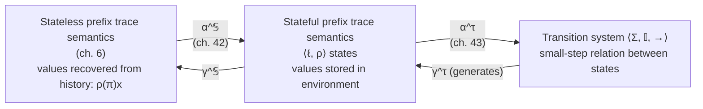

# Stateful and Operational Program Semantics

## Why this chapter pair exists

Every semantics course you've ever seen — and every interpreter you've ever written — starts from a state: a program counter plus a memory, `(pc, env)`, stepping to the next `(pc, env)`. That's *operational semantics*, and it's the semantics equivalent of "the way everyone actually does it."

Cousot's book has, up to this point (chapter 6), deliberately *not* done it that way. Its foundational semantics is a **stateless prefix trace semantics**: a trace is a sequence of actions, and the value of a variable at any point is *recovered by replaying the history of assignments up to that point* — $\rho(\pi)x$ — rather than read out of a memory cell that's been sitting there the whole time. No explicit environment object exists in the primitive semantics at all.

This chapter pair closes the gap between "the book's real foundation" and "the semantics you actually recognize." It does it in two calculated abstraction steps, each one a genuine Galois connection, not just an informal restatement:

1. **Chapter 42** abstracts the stateless trace semantics into a **stateful trace semantics** — traces of pairs $\langle \text{program point}, \text{environment} \rangle$, the classic `(pc, memory)` picture.
2. **Chapter 43** abstracts that further into a **transition system** — a *relation* between states, i.e. small-step operational semantics in the Plotkin style you'd recognize from any PL theory course.

The punchline, proved rather than assumed (Theorem 43.11), is that you can run this whole derivation in reverse: postulate the transition system first, generate the stateful trace semantics from it, and you get back exactly what chapter 42 built by calculation. The book's stateless-first ordering is a *deliberate choice*, not the only possible one — and understanding why it was chosen is as important as understanding the mechanics.



---

## Part 1 (Chapter 42): From stateless traces to stateful traces

### What breaks without an explicit state

The stateless semantics of chapter 6 works with traces $\pi \in \mathbb{T}$: sequences of program points connected by labeled actions, $\ell_1 \xrightarrow{a_1} \ell_2 \xrightarrow{a_2} \ell_3 \dots$. To know the value of variable `x` at some point in the trace, you don't look it up — you scan backward through the trace for the most recent [[Forward-Reachability-Semantics#Assignment|assignment]] to `x` and evaluate it. This is expressive: it's exactly the right shape for *weak memory models* (chapter references [23]), where "what value do I see" genuinely depends on which reordering of memory operations the hardware chose to expose to you, and baking in a single canonical "current memory" would be actively wrong.

But for ordinary sequential programs, nobody wants to replay history to ask "what's the value of `x` right now." You want a memory. That's what this chapter builds — and it insists on *deriving* it from the stateless semantics by abstraction (calculational design), rather than just asserting a memory model as a second primitive definition. The reason: if you define both semantics independently, you now owe a proof that they agree. If you *derive* one from the other via a Galois connection, agreement is free — it's what a Galois connection is for.

### The state and the abstraction

A state bundles a program point and an environment:

$$\sigma = \langle \ell, \rho \rangle \in \mathbb{S} \triangleq (\mathbb{L} \times \mathbb{E}_\mathbb{V})$$

where an environment $\rho \in \mathbb{E}_\mathbb{V} \triangleq \mathbb{V} \to \mathbb{V}$ maps variables $\mathtt{x} \in \mathbb{V}$ to values $\rho(\mathtt{x}) \in \mathbb{V}$.

The abstraction $\alpha^{\mathbb{S}}$ turns a *stateless* trace pair $\langle \pi_0, \pi \rangle$ (an initialization prefix $\pi_0$ followed by continuation $\pi$) into a *stateful* one by recording the environment at every point instead of discarding it:

$$
\begin{aligned}
\alpha^{\mathbb{S}}(\langle \pi_0 \ell, \ell \rangle) &\triangleq \langle \ell, \rho(\pi_0 \ell) \rangle \\
\alpha^{\mathbb{S}}(\langle \pi_0, \pi \xrightarrow{a} \ell \rangle) &\triangleq \alpha^{\mathbb{S}}(\langle \pi_0, \pi \rangle) \cdot \langle \ell, \rho(\pi_0 \frown \pi \xrightarrow{a} \ell) \rangle
\end{aligned}
\tag{42.1}
$$

Read this as: walk the stateless trace step by step; at each program point, *compute* the environment that the stateless semantics would have derived by replaying history up to that point, and attach it as a label. The information content doesn't change — you're not inventing new facts about the program — you're just materializing, at each point, a value the stateless semantics could always compute lazily. This is precisely what makes it an abstraction rather than an approximation: nothing is lost about *reachable states*, only the *replay mechanism* is discarded.

$\alpha^{\mathbb{S}}$ lifts to sets of trace pairs pointwise (it's a **homomorphic/partitioning abstraction** — each trace pair is abstracted independently, with no interaction between traces), and then to *all* initialization traces $\mathbb{T}^+$ at once, giving the prefix state trace semantics:

$$\mathcal{S}_{\mathbb{S}}^*[\![S]\!] \triangleq \alpha^{\mathbb{S}}(\mathcal{S}^*[\![S]\!]) \tag{42.2}$$

**Rust/Python grounding.** This is exactly the difference between two ways of writing a tiny tree-walking interpreter:

```rust
// "Stateless" style: value looked up by scanning history.
// (Nobody actually writes interpreters this way, but this is
// structurally what ρ(π)x means — a fold over the trace so far.)
fn value_of(history: &[Event], var: &str) -> Option<i64> {
    history.iter().rev()
        .find_map(|e| match e {
            Event::Assign(x, v) if x == var => Some(*v),
            _ => None,
        })
}

// "Stateful" style: value read directly out of an environment —
// this is α^𝕊 applied. Same information, materialized eagerly.
use std::collections::HashMap;
type Env = HashMap<String, i64>;

fn step(pc: usize, env: &mut Env, instr: &Instr) -> usize {
    match instr {
        Instr::Assign(x, expr) => { env.insert(x.clone(), eval(expr, env)); pc + 1 }
        // ...
    }
}
```
The `HashMap<String, i64>` *is* $\rho$; every interpreter you've written that carries a mutable environment around is implicitly living in the codomain of $\alpha^{\mathbb{S}}$.

### The structural definition: calculational design, construct by construct

Just having the abstraction (42.1)–(42.2) isn't enough to *compute with* — you want a definition by structural induction on the program syntax, mirroring how a compiler pass would actually be written: one case per language construct, each depending only on the semantics of its immediate subcomponents. The book derives this shape generically first,

$$\widehat{\mathcal{S}}_{\mathbb{S}}^*[\![S]\!] = f_{\mathbb{S}}^*[\![S]\!]\Big(\prod_{S' \lhd S} \widehat{\mathcal{S}}_{\mathbb{S}}^*[\![S']\!]\Big) \tag{42.3}$$

and then calculates $f_{\mathbb{S}}^*$ for each construct, proving each case equals $\alpha^{\mathbb{S}}$ applied to the stateless definition (never just asserting it):

**Assignment**, $S ::= {}^\ell \mathtt{x = A;}$:
$$
\widehat{\mathcal{S}}_{\mathbb{S}}^*[\![S]\!] = \{\langle \ell, \rho\rangle \mid \rho \in \mathbb{E}_\mathbb{V}\} \;\cup\; \{\langle \ell, \rho\rangle \langle \mathsf{after}[\![S]\!], \rho[\mathtt{x} \leftarrow v]\rangle \mid \rho \in \mathbb{E}_\mathbb{V} \wedge v = \mathcal{A}[\![A]\!]\rho\} \tag{42.4}
$$
In words: the length-1 trace is just "we're at $\ell$ with some environment," and the length-2 continuation moves to `after[S]` with the environment updated at `x` by evaluating the right-hand side. This is `env.insert(x, eval(A, env))`, formalized.

**Statement list**, $S_l ::= S_l' \, S$: traces of the list are traces of the prefix $S_l'$, plus traces that continue past the join point into $S$:
$$
\widehat{\mathcal{S}}_{\mathbb{S}}^*[\![S_l]\!] = \widehat{\mathcal{S}}_{\mathbb{S}}^*[\![S_l']\!] \;\cup\; \{\pi \cdot \langle \mathsf{at}[\![S]\!], \rho\rangle \cdot \pi' \mid \pi \cdot \langle \mathsf{at}[\![S]\!], \rho\rangle \in \widehat{\mathcal{S}}_{\mathbb{S}}^*[\![S_l']\!] \wedge \langle \mathsf{at}[\![S]\!], \rho\rangle \cdot \pi' \in \widehat{\mathcal{S}}_{\mathbb{S}}^*[\![S]\!]\} \tag{42.5}
$$
This is exactly sequential composition: glue traces at the shared program point $\mathsf{at}[\![S]\!]$.

**Iteration**, $S ::= \mathtt{while}^\ell (B)\, S_b$ — this one *cannot* be given a closed-form structural equation the way the first two can, because the number of loop unrollings is unbounded. Instead it's defined as a **least fixpoint**:

$$\widehat{\mathcal{S}}_{\mathbb{S}}^*[\![\mathtt{while}^\ell(B)\,S_b]\!] = \mathrm{lfp}^{\subseteq}\, \mathcal{F}_{\mathbb{S}}^*[\![\mathtt{while}^\ell(B)\,S_b]\!] \tag{42.6}$$

where the transformer $\mathcal{F}_{\mathbb{S}}^*[\![\cdot]\!]X$ has three parts: (a) the length-1 "we're at the loop head" traces; (b) traces in $X$ where the guard is false, extended by one step to `after[S]`; (c) traces in $X$ where the guard is true, extended into the loop body's own traces $\widehat{\mathcal{S}}_{\mathbb{S}}^*[\![S_b]\!]$, looping back to $\ell$. This is the calculational-design method that recurs throughout the book: *any* iterative construct in a structural semantics is a least fixpoint of a one-step unrolling operator — proved here via corollary 18.34 and theorem 18.23 (the general fixpoint-transfer machinery from the book's order-theory chapters), not postulated.

**Lean grounding.** The fixpoint at (42.6) is precisely the shape of Lean's own definition of a `while`-style unbounded recursion — an inductively-approached least fixed point over a monotone operator on sets, which is the mathematical content behind `WellFoundedRecursion` or a `partial def` unrolled semantically. If you were formalizing this in Lean, $\mathcal{F}_{\mathbb{S}}^*$ becomes a monotone `Set (Trace) → Set (Trace)`, and (42.6) becomes an appeal to the Knaster–Tarski least-fixpoint theorem over the powerset lattice — exactly the machinery the book proves generically in its fixpoint-theory chapters and merely *instantiates* here.

### Why this ordering, and what it costs

The two Key Questions the book's own chapter summary flags are worth answering explicitly, because they're the conceptual payoff of the whole chapter:

1. **Why stateless-first?** Because the stateless semantics is strictly more general — it's the one that scales to weak memory models, where "the current value of a variable" isn't even well-defined without committing to a specific reordering. Deriving the familiar stateful semantics *from* the general one, by abstraction, means you get the classical picture as a special case for free, with soundness guaranteed by the Galois connection rather than argued separately.
2. **What's retained that a stateful definition would lose?** The ability to talk about *multiple candidate resolutions of memory operations along the same skeleton of control flow* — something that's awkward to express if your primitive notion of "state" already commits to one memory image per point in the trace.

---

## Part 2 (Chapter 43): From stateful traces to a transition system

### What a transition system is, and why it's a further abstraction (not a restatement)

A **transition system** is the object you've been informally calling "operational semantics" your whole career:

$$\langle \Sigma, \mathbb{I}, \xrightarrow{\tau} \rangle$$

— a nonempty set of states $\Sigma$, a set of initial states $\mathbb{I} \subseteq \Sigma$, and a transition relation $\xrightarrow{\tau} \in \wp(\Sigma \times \Sigma)$ between a state and its possible successors. This is Plotkin-style structural operational semantics (SOS) in its most bare-bones form: a relation, not a function — nondeterminism is built in for free, since $\xrightarrow{\tau}$ need not be single-valued.

From a transition system you regenerate a prefix trace semantics by literally unrolling the relation:

$$\gamma^\tau(\langle \Sigma, \mathbb{I}, \xrightarrow{\tau}\rangle) \triangleq \{\pi_0 \cdots \pi_n \mid n \in \mathbb{N} \wedge \pi_0 \in \mathbb{I} \wedge \forall i \in [0, n[.\ \pi_i \xrightarrow{\tau} \pi_{i+1}\} \tag{43.1}$$

— every finite path through the relation starting from an initial state. And conversely, given a prefix trace semantics $S$, you can *extract* a transition system:

$$
\begin{aligned}
\Sigma &\triangleq \{\pi_i \mid \exists n, \pi_0,\dots,\pi_{i-1},\pi_{i+1},\dots,\pi_n.\ \pi_0\cdots\pi_n \in S\} \\
\mathbb{I} &\triangleq \{\pi_0 \mid \exists n, \pi_1,\dots,\pi_n.\ \pi_0 \cdots \pi_n \in S\} \\
\xrightarrow{\tau} &\triangleq \{\pi_i \to \pi_{i+1} \mid \exists n \in \mathbb{N}^+, \dots.\ \pi_0\cdots\pi_n \in S\}
\end{aligned}
\tag{43.2}
$$

— $\Sigma$ is every state that appears anywhere in any trace, $\mathbb{I}$ is every state that ever starts a trace, and $\xrightarrow{\tau}$ is every consecutive pair that ever appears adjacent in a trace. This forms a genuine **Galois connection** between the complete lattice of sets of traces $\langle \wp(\mathbb{T}^+), \subseteq\rangle$ and the (suitably ordered) collection of transition systems.

### The information-loss example — and why it's harmless for whole programs

Here's the sharp edge of this abstraction, and it's worth sitting with because it explains something every operational-semantics-based analysis silently accepts. Take $\Pi = \{a, aa\}$ — a two-trace set: "just do `a` once" or "do `a` twice." Extracting a transition system from $\Pi$ gives you a single state with a self-loop on `a`. Reconstituting a trace set from *that* transition system via $\gamma^\tau \circ \alpha^\tau$ gives you $a^+$ — every finite nonempty sequence of `a`'s. You've silently manufactured `aaa`, `aaaa`, ... that were never in $\Pi$.

**What breaks:** a transition system is *local* — a transition only knows the state it's leaving from, never how it got there or how many times it's been visited before. Anything the original trace semantics could express by virtue of *history* (visit counts, "this is the third time through the loop, so...") is invisible to a transition-system view once you've collapsed to reachable states. This is a genuine loss of information, formalized precisely rather than hand-waved.

**Why it's tolerated:** because software model checking, reachability analysis, and safety verification — nearly everything chapter 44 (Software Model Checking) and beyond in this book care about — only ask "can the program reach a bad state?", not "how many times did it loop before doing so?" For *reachability*, extra spurious traces like `aaa` are harmless overapproximation: if the transition system says a bad state is unreachable, it genuinely is (soundness is preserved in the safe direction), even though the transition system may admit executions the real program never performs. This is the standard operational-semantics tradeoff: cheap, local, composable step rules, in exchange for coarser trace-level precision. It's also exactly why chapter 6 chose the *stateless* trace semantics as the book's true foundation rather than starting from transition systems directly — the more information-rich starting point lets you *choose*, per-analysis, how much of that precision to abstract away, instead of losing it unconditionally on day one.

### The structural transition semantics, and its relation to chapter 42

Just as chapter 42 gave a structural (per-construct) definition of the stateful trace semantics, chapter 43 gives a structural definition of the transition relation $\widehat{\mathcal{S}}^\tau[\![S]\!]$ itself, by the same calculational method — each case is *proved* to equal $\alpha^\tau$ applied to the structural stateful semantics of chapter 42, not just declared to look right:

**Assignment**:
$$\widehat{\mathcal{S}}^\tau[\![S]\!] = \{\langle \ell, \rho\rangle \longrightarrow \langle \mathsf{after}[\![S]\!], \rho[\mathtt{x} \leftarrow \mathcal{A}[\![A]\!]\rho]\rangle \mid \rho \in \mathbb{E}_\mathbb{V}\} \tag{43.4}$$
— one transition edge per possible environment, landing at the updated environment. This is your interpreter's `step` function, read as a *relation* instead of a *function call*.

**Statement list**: simply the union of the sub-transitions,
$$\widehat{\mathcal{S}}^\tau[\![S_l]\!] = \widehat{\mathcal{S}}^\tau[\![S_l']\!] \cup \widehat{\mathcal{S}}^\tau[\![S]\!] \tag{43.5}$$
— no gluing logic needed here (unlike (42.5)), because a transition relation is already just a flat set of edges; sequencing is implicit in how program points connect, not in how the semantic object is constructed.

**Iteration and break**: the book works through `while` and `break` by case analysis on lemma 6.39, and the punch line is instructive: the loop-body-to-loop-head back-edge does *not* need its own explicit transition rule, because $\mathsf{after}[\![S_b]\!] = \mathsf{at}[\![\mathtt{while}^\ell(B)\,S_b]\!] = \ell$ already — the labeling of program points makes the loop close up automatically. `break` contributes its own transition class (jumping straight to `break\text{-}to[\![S]\!]`, the label just past the enclosing loop) that a plain fall-through statement list never needs, and the proof is careful to note these transitions are counted exactly once even when `break` is nested inside the loop syntactically.

**Rust grounding — this is your interpreter's dispatch loop, formalized.** The structural transition relation is literally the mathematical specification of:

```rust
enum Instr { Assign(String, Expr), While(Cond, Vec<Instr>), Break, /* ... */ }

// A step relation, not a step function — note it *could* return
// multiple successors for a nondeterministic language; here P
// happens to be deterministic so it always returns exactly one.
fn step(state: (usize, Env), program: &[Instr]) -> Option<(usize, Env)> {
    let (pc, mut env) = state;
    match &program[pc] {
        Instr::Assign(x, e) => { env.insert(x.clone(), eval(e, &env)); Some((pc + 1, env)) }
        Instr::While(cond, _) if !eval_cond(cond, &env) => Some((after_loop(pc), env)),
        Instr::While(_, body) => Some((body_start(pc), env)),
        Instr::Break => Some((after_enclosing_loop(pc), env)),
        // ...
    }
}
```
Every "definitional interpreter" (Reynolds' term, cited explicitly in the chapter's conclusion — "definitional interpreters," following the *Lisp in Lisp* tradition) is exactly this: the transition relation of chapter 43, implemented as executable code, in the very language it defines.

### Theorem 43.11 — the equivalence, and why it validates the reverse construction

$$
\textbf{Theorem 43.11.}\quad \text{The stateful prefix trace semantics } \widehat{\mathcal{S}}_{\mathbb{S}}^*[\![\cdot]\!] \text{ of section 42.2 is exactly generated by the transition semantics } \widehat{\mathcal{S}}^\tau[\![\cdot]\!] \text{ of chapter 43.}
$$

Formally: $\gamma^\tau(\widehat{\mathcal{S}}^\tau[\![S]\!]) = \widehat{\mathcal{S}}_{\mathbb{S}}^*[\![S]\!]$ for every program component $S$. The proof is by structural induction, construct by construct, matching the exact same case split as the definitions above (base case: length-1 traces coincide trivially by construction; assignment case: direct unfolding of (43.4)/(42.4); iteration case: the trickiest one, arguing by a "reductio ad absurdum on the first point of divergence" that any trace generated by the transition system that *isn't* already accounted for at position $k$ would force a transition not present in the case analysis of lemma 6.39 — a contradiction).

This theorem is the reason the chapter can honestly say something remarkable in its conclusion: **you could have designed this book the other way around.** Postulate the transition semantics of chapter 43 first (the way essentially every operational semantics textbook actually does it — Plotkin-style, structural rules assumed as primitive); derive the stateful prefix trace semantics from it via (43.1); then take limits (as in chapter 7) to get the maximal trace semantics. Theorem 43.11 certifies that this alternative route lands in exactly the same place as the calculational, abstraction-driven route the book actually takes. The book's ordering isn't forced by the mathematics — it's a *stylistic and pedagogical* choice, motivated by wanting the stateless, weak-memory-friendly semantics as the true foundation, with everything else (including the classical operational picture you already knew) recovered as a provably faithful abstraction of it.

### Operational vs. denotational: the chapter's own historical framing

The chapter closes with a compact history that's worth internalizing because it explains *why* this machinery exists in the field at all: operational semantics (McCarthy, then the Vienna Definition Language) gave way in popularity to Scott–Strachey denotational semantics because "what is done" reads more elegantly than "how it's done" — until denotational semantics hit a wall on parallelism, where no fully satisfying denotational treatment ever emerged. Plotkin's structural operational semantics (chapter 16's rule-based deductive definitions) brought operational reasoning back into fashion, partly *because* it handles parallelism naturally via interleaving of atomic actions. But weak memory models reopened the problem for transition systems specifically — interleaving-based state semantics is "somewhat heavy" for describing hardware reorderings elegantly — which is precisely the gap the book's stateless-first foundation (chapter 6) was built to sidestep from the very beginning.

---

## Synthesis: where this sits in the book, and why it matters for verification tooling

**Downstream dependency.** Chapter 44 (Software Model Checking) explicitly builds on chapter 42's stateful semantics rather than chapter 43's transition system, precisely *because* structural reasoning on programs (per-construct compositionality) is easier over trace semantics than over a flattened relation — model checking here is recast as an abstract interpretation of the stateful prefix trace semantics against regular-expression specifications, sound and complete by calculational design rather than postulated. Chapter 46 (a pointer language) also reaches back to this chapter pair, noting explicitly that a stateful, memory-based semantics is *more* natural there than the book's usual stateless default — memories with pointers and aliasing are exactly the case where "recover the value by replaying history" stops being the natural formulation.

**Why this is load-bearing for a verifier/elaborator project.** This pair of chapters is the precise mechanism by which "what does my Hoare-triple checker actually execute against" gets nailed down. A Rust verifier that checks program correctness against logic-clause specifications needs *some* ground-truth operational semantics to be sound relative to — and this chapter shows you both (a) how to derive that operational semantics compositionally from a more primitive trace-based definition by calculation instead of by fiat, and (b) exactly how much information a transition-relation view of "the machine" throws away relative to the richer trace semantics your soundness proof might actually need. If your Hoare-logic soundness argument ever needs to talk about *history* (loop invariants that depend on iteration count, ranking functions, temporal properties beyond plain reachability), you now know precisely where the transition-system abstraction stops being adequate and you need to fall back to the trace-level semantics of chapter 42 — or further back still, to the stateless semantics of chapter 6.

**What it depends on.** The iteration cases in both chapters lean directly on the book's general fixpoint-transfer theorems (corollary 18.34, theorem 18.23) — this pair is a worked application of that machinery, not new theory of its own. If those fixpoint results are unfamiliar, that's the actual prerequisite to revisit before this material, not anything within chapters 42–43 themselves.

---
[[book-guidelines|↩ Back to guidelines]]
