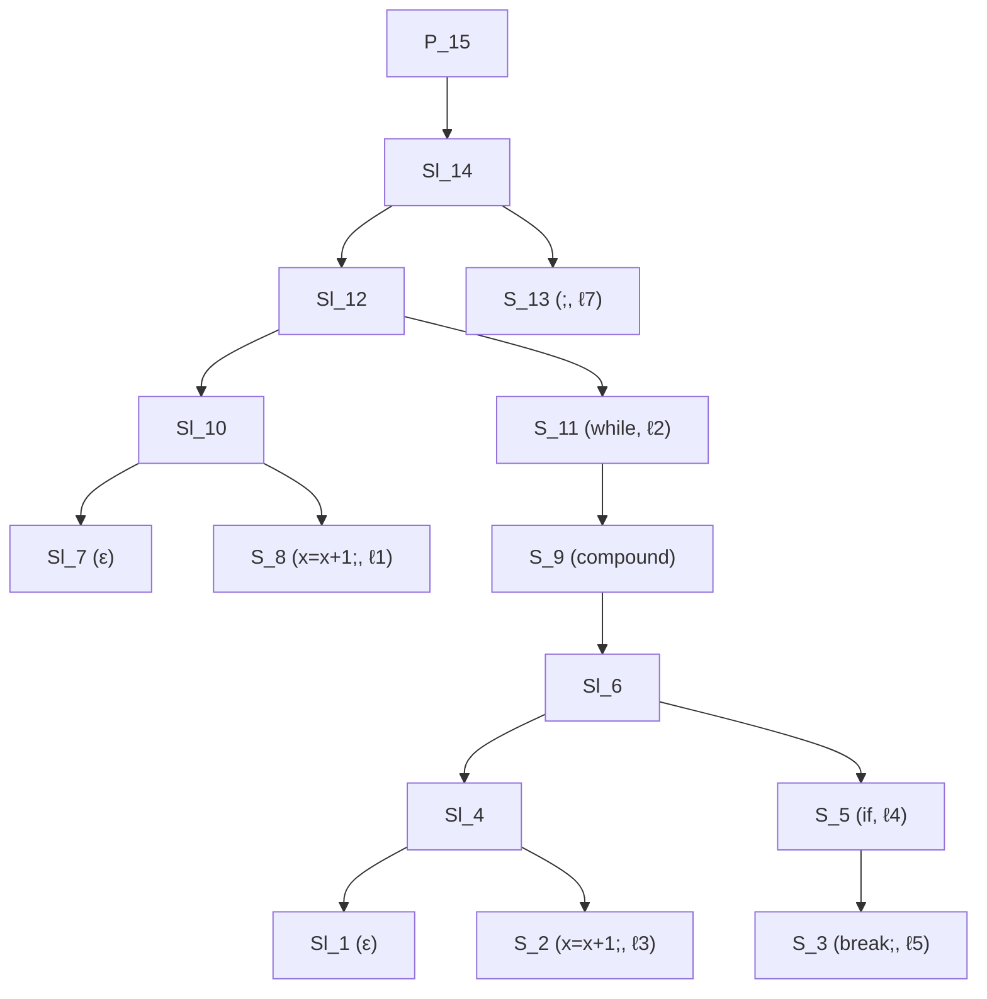
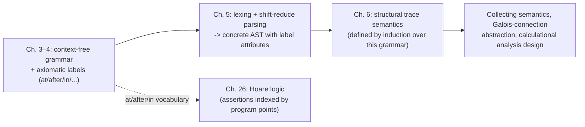

# Syntax and Parsing of Programming Languages

[[book-guidelines|↩ Back to guidelines]]

## Why a static analyzer needs to start here

Before you can compute anything sound about a program — a sign, an interval, a reachability invariant — you need to be able to *talk about the program as a mathematical object*: a tree, not a string of characters. Everything downstream in Cousot's calculational method (structural semantics in chapter 6, collecting semantics, abstract domains, fixpoint computation) is defined by *structural induction over syntax*. That only works if "the syntax" is a precisely specified inductive set, not an ad hoc string format. So chapters 3–5 quietly do two jobs that the rest of the book leans on completely:

1. Fix a **context-free grammar** for expressions and statements, so every later semantic definition can pattern-match on grammar productions.
2. Fix a vocabulary for talking about **where you are in a program** — "the entry point of this loop," "the point right after this [[Forward-Reachability-Semantics#Assignment|assignment]]" — without hard-wiring one particular labeling scheme. This is what lets later chapters define semantics and analyses generically over *any* program point representation.

Then chapter 5 is the engineering reality check: *how do you actually turn source text into that tree?* This is the practical detour into lexing and LR-style shift-reduce parsing — deliberately not the deepest possible treatment (Cousot says so explicitly), but enough to build a real parser with `ocamllex`/`menhir` and to understand *why* naive grammars are ambiguous and how tooling resolves that.

What breaks without this layer: without a formally fixed grammar, "the semantics of a program" is not well-defined — you'd be doing induction over an informal notion of "expression," and two people's mental parse trees of `1-2-3` could legitimately disagree. Cousot's whole calculational method (semantics → collecting semantics → abstraction → analysis, all by structural induction) is only as rigorous as the syntax it inducts over.

---

## Part 1 — Context-free grammar of expressions and statements

### Expressions (§3.4)

The book's running example throughout chapter 3 is the "rule of signs" — and before any semantics can be attached to `-`, `<`, or `nand`, the set of legal expressions has to exist as a *set*, defined inductively. Cousot gives it as a minimal grammar built from just three primitives (constant `1`, unary `-`, and `nand`), remarking that all of arithmetic and Boolean logic can be recovered from these plus iteration:

$$
\begin{aligned}
x, y, \ldots &\in \mathbb{V} & &\text{variables (}\mathbb{V}\text{ not empty)}\\
A \in \mathbb{A} \; ::= \;& 1 \mid x \mid A_1 - A_2 & &\text{arithmetic expressions}\\
B \in \mathbb{B} \; ::= \;& A_1 < A_2 \mid B_1 \,\mathsf{nand}\, B_2 & &\text{Boolean expressions}\\
E \in \mathbb{E} \; ::= \;& A \mid B & &\text{expressions}
\end{aligned}
$$

Read the `::=` as "is defined as" and `|` as "or, alternatively" — completely standard BNF, but Cousot is careful to say explicitly that this notation goes back to Chomsky, because *the whole point of the chapter* is to show that everything from here on (semantics, abstraction, analysis) is going to be defined the same inductive way, over the same kind of grammar.

Two disambiguation choices are made **by fiat**, not derived: the grammar as written is genuinely ambiguous (`1-1-1` could parse as `(1-1)-1` or `1-(1-1)`), so the book stipulates left-associativity for `-` and `nand`, and gives arithmetic operators priority over Boolean ones (so `1-1<1-1-1` parses as `((1-1)<((1-1)-1))`, evaluating to `ff`). This is worth sitting with: *ambiguity of a grammar is a property of the grammar itself*, independent of any parsing algorithm — precedence and associativity declarations are extra information layered on top to pick out one parse tree among several that the bare grammar admits. Chapter 5 will show mechanically how a parser enforces that choice.

**What breaks without disambiguation:** if you don't fix associativity, "the semantics of `1-1-1`" is not a function of the expression — it's a *relation* to a set of possible values, which destroys determinism and makes every later definition (semantics, abstract semantics, soundness proofs) either ill-defined or has to carry an extra existential/universal quantifier everywhere. Fixing it once, at the syntax level, keeps every downstream chapter clean.

### Statements and programs (§4.1)

Chapter 4 extends the same idea to full imperative programs — assignment, conditionals, loops, `break`, compound statements:

$$
\begin{aligned}
S \;::=\;& x = A\,; & &\text{assignment}\\
\mid\;& ; & &\text{skip}\\
\mid\;& \texttt{if}\,(B)\,S & &\text{conditional}\\
\mid\;& \texttt{if}\,(B)\,S\;\texttt{else}\,S & &\\
\mid\;& \texttt{while}\,(B)\,S & &\text{iteration}\\
\mid\;& \texttt{break}\,; & &\text{iteration break}\\
\mid\;& \{\mathit{Sl}\} & &\text{compound statement}\\[4pt]
\mathit{Sl} \;::=\;& \mathit{Sl}\; S \mid \epsilon & &\text{statement list } \mathit{Sl} \in \mathbb{SI}\\[4pt]
P \;::=\;& \mathit{Sl} & &\text{program } P \in \mathbb{P}\\
\mathbb{Pc} \;\triangleq\;& \mathbb{S} \cup \mathbb{SI} \cup \mathbb{P} & &\text{program component}
\end{aligned}
$$

The book immediately introduces $\mathbb{Pc}$, the union of statements, statement lists, and programs — "program component" — because almost every subsequent definition (labels, semantics, analyses) is stated *uniformly* over $\mathbb{Pc}$ rather than case-split by hand across statements vs. programs. That's a small but recurring design habit worth internalizing: whenever several syntactic categories need the same family of definitions, the book introduces their union as a first-class sort.

**Grounding (Rust).** This grammar is, almost verbatim, an algebraic data type:

```rust
enum Aexpr {
    One,
    Var(String),
    Sub(Box<Aexpr>, Box<Aexpr>),
}

enum Bexpr {
    Lt(Box<Aexpr>, Box<Aexpr>),
    Nand(Box<Bexpr>, Box<Bexpr>),
}

enum Stmt {
    Assign(String, Aexpr),
    Skip,
    If(Bexpr, Box<Stmt>),
    IfElse(Bexpr, Box<Stmt>, Box<Stmt>),
    While(Bexpr, Box<Stmt>),
    Break,
    Block(Vec<Stmt>),   // Sl, flattened to a Vec instead of a linked Sl' S / ε
}
```

This is exactly the shape of an AST you would hand to a compiler pass or, in your verifier project, to a typing/proof-obligation generator: every structural-induction definition the book will later write (semantics, `at`/`after`, abstract semantics) becomes a `match` over this enum. The book's own §3.5 "Structural Definitions" is literally describing what Rust calls a fold/recursive function over an ADT — recursion on naturals generalized to recursion on the syntax tree, one equation per constructor.

---

## Part 2 — Axiomatic definition of program labels and program points

### The problem this solves

A static analyzer needs to talk about "the state of the program just before this assignment" or "whether this loop is reachable." That requires *naming* program points. The naive move is to bake in one concrete scheme — e.g., number every statement — and then define semantics in terms of those numbers. Cousot deliberately refuses to do this. Labels "are not part of the program syntax; their syntax is therefore free" (§4.2): rather than fixing *one* representation, the book specifies **axiomatically** — by the properties any valid labeling must satisfy — leaving the actual representation open. Exercises 4.9–4.11 show three legitimate interpretations: a path in the syntax tree, the remaining statement list still to execute, or a node in the compiler's control-flow graph. All three satisfy the same axioms, so any theorem proved from the axioms transfers to all of them for free.

**What breaks without this move:** if the book instead committed to (say) "labels are integers assigned by a left-to-right traversal," every later proof about program points would implicitly depend on that traversal order, and switching representations (e.g., to compiler CFG nodes) would force re-proving everything. The axiomatic style is a one-time investment that buys representation-independence for the rest of the book.

### The label functions

For every program component $S \in \mathbb{Pc}$, six functions are defined by structural recursion over the grammar, each satisfying stipulated postulates rather than one hard-coded formula:

| Function | Meaning |
|---|---|
| $\mathrm{at}\llbracket S\rrbracket$ | the program point at which execution of $S$ *starts* |
| $\mathrm{after}\llbracket S\rrbracket$ | the exit point after $S$, where execution continues if $S$ terminates normally (no `break`) |
| $\mathrm{escape}\llbracket S\rrbracket$ | Boolean: does $S$ contain a `break;` that escapes out of $S$ (i.e., not absorbed by an inner loop)? |
| $\mathrm{break\text{-}to}\llbracket S\rrbracket$ | the point execution jumps to when a `break;` escapes $S$ (defined only if $\mathrm{escape}\llbracket S\rrbracket = \mathsf{tt}$) |
| $\mathrm{breaks\text{-}of}\llbracket S\rrbracket$ | the set of labels of all `break;` statements that can escape $S$ |
| $\mathrm{in}\llbracket S\rrbracket$ | all program points *inside* $S$ (including $\mathrm{at}\llbracket S\rrbracket$, excluding $\mathrm{after}\llbracket S\rrbracket$ and $\mathrm{break\text{-}to}\llbracket S\rrbracket$) |

Two derived notions round this out: $\mathrm{labs}\llbracket S\rrbracket \triangleq \mathrm{in}\llbracket S\rrbracket \cup \{\mathrm{after}\llbracket S\rrbracket\}$ (potentially-reachable points ignoring breaks) and $\mathrm{labx}\llbracket S\rrbracket \triangleq \mathrm{labs}\llbracket S\rrbracket \cup (\mathrm{escape}\llbracket S\rrbracket \mathrel{?} \{\mathrm{break\text{-}to}\llbracket S\rrbracket\} \mathrel{:} \varnothing)$ (also including the break exit).

The postulates are given per grammar production, exactly mirroring §4.1's grammar — Cousot notes this is "reminiscent of attribute grammars," and it is: each function is an attribute synthesized (or, for `after`, partly inherited) at every node of the parse tree. A representative slice, for `in`:

$$
\begin{aligned}
\mathit{Sl} ::= \epsilon &: \; \mathrm{in}\llbracket \mathit{Sl}\rrbracket \triangleq \{\mathrm{at}\llbracket \mathit{Sl}\rrbracket\}\\
S ::= \texttt{if}\,(B)\,S_t &: \; \mathrm{in}\llbracket S\rrbracket \triangleq \{\mathrm{at}\llbracket S\rrbracket\} \cup \mathrm{in}\llbracket S_t\rrbracket, \qquad \mathrm{at}\llbracket S\rrbracket \notin \mathrm{in}\llbracket S_t\rrbracket\\
S ::= \texttt{while}\,(B)\,S_b &: \; \mathrm{in}\llbracket S\rrbracket \triangleq \{\mathrm{at}\llbracket S\rrbracket\} \cup \mathrm{in}\llbracket S_b\rrbracket, \qquad \mathrm{at}\llbracket S\rrbracket \notin \mathrm{in}\llbracket S_b\rrbracket
\end{aligned}
$$

and for `after` (note how it threads *forward* through a statement list — $\mathrm{after}$ of the first statement in `Sl' S` is $\mathrm{at}\llbracket S\rrbracket$, i.e., control literally falls into the next statement):

$$
\mathit{Sl} ::= \mathit{Sl}' \, S : \; \mathrm{after}\llbracket \mathit{Sl}'\rrbracket \triangleq \mathrm{at}\llbracket S\rrbracket, \qquad \mathrm{after}\llbracket \mathit{Sl}\rrbracket \triangleq \mathrm{after}\llbracket S\rrbracket
$$

and crucially, for `while` — this is where `break-to` earns its keep — the loop body's exit point is not the loop's own `at`, but the loop's `after`:

$$
S ::= \texttt{while}\,(B)\,S_b : \; \mathrm{after}\llbracket S_b\rrbracket \triangleq \mathrm{at}\llbracket S\rrbracket \quad\text{(normal fall-through re-enters the loop test)}, \qquad \mathrm{break\text{-}to}\llbracket S_b\rrbracket \triangleq \mathrm{after}\llbracket S\rrbracket
$$

### The explicit-labeling interpretation

Section 4.2.3 shows the most common concrete instance: decorate every statement-introducing production with an explicit label $\ell$, and read $\mathrm{at}$ straight off the syntax:

$$
S ::= \ell\, x = A\,; \qquad \mathrm{at}\llbracket S\rrbracket \triangleq \ell
$$

and similarly for `;`, `if`, `while`, `break`. For the example program

$$
\texttt{x = x+1; while(tt) \{ x = x+1; if (x>2) break; \};}
$$

explicit labeling gives

$$
\ell_1\, \texttt{x=x+1;} \;\; \texttt{while}^{\ell_2}(\texttt{tt}) \{ \ell_3\, \texttt{x=x+1;} \;\; \texttt{if}^{\ell_4}(\texttt{x>2})\; \ell_5\, \texttt{break;} \}^{\ell_6}\,; ^{\ell_7}
$$

with syntax tree (figure 4.2 in the book):



**Load-bearing point for the two engineering targets:** this axiomatic-labels machinery is precisely the abstraction your Hoare-triple verifier needs for **program-point-indexed assertions**. A Hoare logic annotates *program points* with pre/post conditions; $\mathrm{at}$, $\mathrm{after}$, and $\mathrm{break\text{-}to}$ are exactly the vocabulary for saying "the invariant holds at the loop head" or "control after a `break` skips the rest of the loop body and lands after the loop" without committing to how those points are represented in your actual data structures (AST node id? CFG node? path?). If your verifier's IR changes representation later, proofs phrased over $\mathrm{at}/\mathrm{after}/\mathrm{in}$ transfer unchanged — that's the entire payoff of doing it axiomatically instead of by fixing one encoding.

### The proved lemmas — and why structural induction is the only tool used

Four lemmas anchor the whole apparatus, **all proved by structural induction on the syntax tree** (Burstall's principle from §3.8: a property true of a compound whenever it's true of the compound's immediate parts is true of everything):

- **Lemma 4.15**: $\mathrm{at}\llbracket S\rrbracket \in \mathrm{in}\llbracket S\rrbracket$ — the entry point is always "inside."
- **Lemma 4.16**: for nonempty $S \ne \{\ldots\{\epsilon\}\ldots\}$, $\mathrm{after}\llbracket S\rrbracket \notin \mathrm{in}\llbracket S\rrbracket$ — the exit point is never "inside" (proved by induction on distance to the root, not on $S$'s own structure, because `after` is partly *inherited* from the enclosing context rather than synthesized bottom-up).
- **Lemma 4.17**: $\mathrm{escape}\llbracket S\rrbracket \Rightarrow \mathrm{break\text{-}to}\llbracket S\rrbracket \notin \mathrm{in}\llbracket S\rrbracket$ — a `break` target is never inside the component it escapes.
- **Lemma 4.18**: $\mathrm{escape}\llbracket S\rrbracket \Rightarrow \mathrm{break\text{-}to}\llbracket S\rrbracket \ne \mathrm{after}\llbracket S\rrbracket$ — breaking out is genuinely different from falling through.

These are exactly the sanity properties a control-flow representation needs before you can trust reachability or invariance reasoning over it — e.g., lemma 4.16 is what guarantees you can't accidentally treat "the state after the loop" as also being "a state during the loop" when computing an invariant.

**Grounding (Rust).** A trait capturing the axioms, decoupled from representation, looks like:

```rust
trait Labels {
    type Point: Eq + Copy;
    fn at(&self) -> Self::Point;
    fn after(&self) -> Self::Point;
    fn escapes(&self) -> bool;
    fn break_to(&self) -> Option<Self::Point>; // Some(_) iff escapes() == true
    fn in_points(&self) -> std::collections::HashSet<Self::Point>;
}
```

Any concrete `Point` type — a `usize` CFG-node id, a path-in-tree encoding, whatever — can implement this trait, and lemmas 4.15–4.18 become properties you'd write as `#[test]` invariants or, more ambitiously, as proof obligations discharged once against the trait rather than against every concrete instantiation.

---

## Part 3 — Lexing and bottom-up shift-reduce parsing (§5.1–5.5)

Chapter 4 gave you the *target* — an abstract syntax tree. Chapter 5 is the practical *how*: turning raw source text into that tree, using OCaml's `ocamllex` and `menhir` as the running toolchain.

### Lexing: abstracting characters into lexemes

The first phase (§5.1–5.3) is not parsing at all — it's an *abstraction step* in its own right (the book explicitly calls parsing "an instance of abstract interpretation of grammar semantics" in its closing remark, and lexing is the same idea one level down): collapse the character stream into a stream of *lexemes*, discarding irrelevant detail (whitespace) and classifying what's left. For `if (x < 0) x = -x ;`:

```
IF LPAREN IDENT LT NUM RPAREN IDENT ASSIGN MINUS IDENT SEMICOLON END
if  (      x     <  0   )      x     =      -     x     ;         (eof)
```

A lexer specification is a sequence of regular expressions tried in order — first match wins, longest-identifier / longest-number greedily, keywords checked before the generic identifier rule so `if` doesn't get lexed as a variable name:

```ocaml
(* File lexer.mll *)
{ open Parser  exception Error of string }
rule token = parse
    [' ' '\t' '\n']  { token lexbuf }   (* skip, then keep lexing *)
  | "nand"           { NAND }
  | "if"             { IF }
  | "else"           { ELSE }
  ...
```

`ocamllex` compiles this directly into an OCaml function that yields one `token` value per call. Note the type of `token` is *generated from the parser specification*, not the other way around — lexemes exist to serve the grammar, not vice versa.

### Bottom-up parsing: shift, reduce, accept, reject

The grammar from §5.4 (essentially chapter 4's statement grammar, restated over lexemes: `prog: stmtlist END`, `stmt: IDENT ASSIGN aexpr SEMICOLON | ... | LBRACKET stmtlist RBRACKET`, `aexpr: NUM | IDENT | aexpr MINUS aexpr | MINUS aexpr | LPAREN aexpr RPAREN`, `bexpr: aexpr LT aexpr | bexpr NAND bexpr | LPAREN bexpr RPAREN`) is consumed left-to-right, bottom-up: the parser builds the tree in **prefix order** using a **stack** holding recognized structure and an **input** of remaining lexemes.

A parser state is `stack | input`. Two moves:

- **Shift** ($\xrightarrow{S}$): push the next input lexeme onto the stack — used when the stack holds a *prefix* of some rule's right-hand side, still under construction.
- **Reduce** ($\xrightarrow{R}$): the stack's top matches a complete right-hand side of a grammar rule; replace it with the rule's left-hand-side nonterminal.

**Acceptance**: stack reduces to the grammar axiom and input is empty. **Rejection**: no shift or reduce move extends the stack/input to a valid sentence — a syntax error.

Tracing `IF LPAREN IDENT LT NUM RPAREN IDENT ASSIGN MINUS IDENT SEMICOLON END` (i.e. `if (x<0) x=-x;`) end to end:

```
                                              | IF LPAREN IDENT LT NUM RPAREN IDENT ASSIGN MINUS IDENT SEMICOLON END
 R→  stmtlist                                | IF LPAREN IDENT LT NUM RPAREN IDENT ASSIGN MINUS IDENT SEMICOLON END
 S→  stmtlist IF                             | LPAREN IDENT LT NUM RPAREN IDENT ASSIGN MINUS IDENT SEMICOLON END
 S→  stmtlist IF LPAREN                      | IDENT LT NUM RPAREN IDENT ASSIGN MINUS IDENT SEMICOLON END
 S→  stmtlist IF LPAREN IDENT                | LT NUM RPAREN IDENT ASSIGN MINUS IDENT SEMICOLON END
 R→  stmtlist IF LPAREN aexpr                | LT NUM RPAREN IDENT ASSIGN MINUS IDENT SEMICOLON END
 S→  stmtlist IF LPAREN aexpr LT             | NUM RPAREN IDENT ASSIGN MINUS IDENT SEMICOLON END
 S→  stmtlist IF LPAREN aexpr LT NUM         | RPAREN IDENT ASSIGN MINUS IDENT SEMICOLON END
 R→  stmtlist IF LPAREN aexpr LT aexpr       | RPAREN IDENT ASSIGN MINUS IDENT SEMICOLON END
 R→  stmtlist IF LPAREN bexpr                | RPAREN IDENT ASSIGN MINUS IDENT SEMICOLON END
 S→  stmtlist IF bexpr                       | IDENT ASSIGN MINUS IDENT SEMICOLON END      (after RPAREN shift+reduce)
 S→  stmtlist IF bexpr IDENT                 | ASSIGN MINUS IDENT SEMICOLON END
 S→  stmtlist IF bexpr IDENT ASSIGN          | MINUS IDENT SEMICOLON END
 S→  stmtlist IF bexpr IDENT ASSIGN MINUS    | IDENT SEMICOLON END
 S→  stmtlist IF bexpr IDENT ASSIGN MINUS IDENT | SEMICOLON END
 R→  stmtlist IF bexpr IDENT ASSIGN aexpr    | SEMICOLON END
 S→  stmtlist IF bexpr IDENT ASSIGN aexpr SEMICOLON | END
 R→  stmtlist IF bexpr stmt                  | END
 R→  stmtlist stmt                           | END
 R→  stmtlist                                | END
 S→  stmtlist END                            |
 R→  prog                                    |     ← accepted
```

Every reduce collapses a recognized rule's RHS on the stack top into its LHS; every shift consumes one lexeme of lookahead. This is exactly the mechanism `menhir`/`ocamlyacc` implement as a table-driven automaton — you're watching, by hand, what the generated state machine does internally.

**Grounding (Python, illustrative only — per the resolved style, a quick sketch rather than load-bearing).** A tiny shift-reduce skeleton for a much simpler grammar (`E -> E + E | num`) makes the two moves concrete:

```python
def shift(stack, tokens):
    stack.append(tokens.pop(0))

def reduce_plus(stack):
    # stack top: [..., E, '+', E]  ->  [..., E]
    right, _, left = stack.pop(), stack.pop(), stack.pop()
    stack.append(('E', left, right))
```

A real parser generator replaces the "when do I shift vs. reduce" decision with a precomputed automaton (an LR/LALR state table) rather than ad hoc lookahead logic — which is exactly the subject of Part 4.

---

## Part 4 — Resolving shift-reduce and reduce-reduce ambiguities (§5.6–5.7)

### Shift-reduce conflicts: the grammar is ambiguous, the parser can't be

The grammar of §5.4 is genuinely ambiguous — `1-2-3` admits two derivations, `((1-2)-3)` and `(1-(2-3))`. A shift-reduce parser hits this concretely: parsing `1-2-x`, it reaches state

$$
\texttt{aexpr MINUS aexpr} \mid \texttt{MINUS IDENT}
$$

and has a genuine choice: **reduce** ($\to \texttt{aexpr} \mid \texttt{MINUS IDENT}$, giving left-associativity) or **shift** ($\to \texttt{aexpr MINUS aexpr MINUS} \mid \texttt{IDENT}$, giving right-associativity). This is a *shift-reduce conflict*: the same parser state, same lookahead, admits both actions and the grammar alone doesn't say which to prefer.

Menhir/yacc resolve this with **precedence and associativity declarations**, layered on top of the (unchanged, still-ambiguous) grammar:

```
%left MINUS          /* evaluated second */
%nonassoc UMINUS      /* evaluated first  */
```

declares `MINUS` left-associative — instructing the parser to prefer *reduce* over *shift* whenever this exact conflict arises. Layering more operators just extends the priority order, low to high:

```
%left NAND         /* evaluated fourth */
%left LT            /* evaluated third  */
%left MINUS          /* evaluated second */
%nonassoc UMINUS      /* evaluated first  */
```

so `1-1<1-1-1` parses as arithmetic binding tighter than comparison, matching the informal choice already stipulated back in §3.4.

A second, subtler conflict: unary vs. binary `-` share the same lexeme. `MINUS aexpr %prec UMINUS` tells the generator "this production, though syntactically identical to the binary rule's shape, should be *treated* as having `UMINUS`'s (higher) precedence" — resolving `1 - -2` correctly as `1 - (-2)` rather than misparsing the second `-` as a continuation of the first.

**The dangling-else problem** is the classic reduce-reduce-adjacent shift-reduce case: `if (b1) if (b2) s1 else s2` is syntactically ambiguous between the `else` binding to the outer or inner `if`. Convention (and every mainstream language) binds it to the *closest* enclosing `if`. Cousot's resolution introduces a **fake, zero-width token** `NO_ELSE`:

```
%nonassoc NO_ELSE   /* evaluated sixth (lowest) */
%nonassoc ELSE      /* evaluated fifth */
...
stmt:
  | ...
  | IF LPAREN b=bexpr RPAREN s=stmt %prec NO_ELSE
  | IF LPAREN b=bexpr RPAREN s1=stmt ELSE s2=stmt
  | ...
```

`%prec NO_ELSE` doesn't correspond to any real input — it just assigns the else-less `if` rule an *artificially low* precedence so that, whenever the parser could either reduce the dangling `if` immediately or shift a pending `ELSE` to attach to it, it prefers the shift — pulling the `else` in to bind to the nearest `if`. So

```
if(b1) if(b2) s1 else if(b3) s2 else s3
```

parses as

```
(if(b1) (if(b2) s1 else (if(b3) s2 else s3)))
```

— exactly the "closest enclosing `if`" reading — purely from a precedence trick, without restructuring the grammar itself (which exercises 5.4–5.5 pose as the alternative, harder route: eliminate the ambiguity by rewriting the grammar rather than patching it with precedence).

**What breaks without a resolution policy at all**: the grammar remains genuinely ambiguous; a naive parser generator either refuses to build a table (some LR conflict), or — as menhir does for the cases it *can* resolve — silently picks one alternative and never reduces the other production, which is only safe because the disambiguation is *intentional*, declared, and understood. An *undeclared* shift-reduce conflict is a real bug risk: the parser will build and run, but silently encode a parsing decision nobody chose on purpose.

### Reduce-reduce conflicts: a genuinely broken grammar

A reduce-reduce conflict is different in kind: two *different* completed right-hand sides both match the stack top for the same lookahead, and there's no notion of associativity/precedence that meaningfully disambiguates it — it signals the grammar itself has a design flaw. Cousot's minimal example:

```
%token NUM
%start s
s: | t     { () }
   | NUM   { () }
t: | NUM   { () }
```

A bare `NUM` can be reduced either directly to `s`, or to `t` and then `t` reduced to `s` — two derivations of the same string. Menhir reports:

```
Warning: one state has reduce/reduce conflicts.
Warning: one reduce/reduce conflict was arbitrarily resolved.
Warning: production t -> NUM is never reduced.
```

and **arbitrarily** picks the first-listed alternative, silently making the second production dead code (`t -> NUM` is unreachable). Unlike a shift-reduce conflict, there's no useful precedence declaration to fix this with — the honest fix (exercise 5.6) is to *change the grammar* so the two nonterminals aren't both directly reachable from the same lookahead token in the same way, i.e., to actually remove the redundant derivation rather than paper over it. This is the practical signal that "if `menhir` reports a reduce-reduce conflict, don't reach for a precedence declaration — go fix the grammar."

### Abstract syntax and generation (§5.8–5.10, briefly)

As the parser shifts and reduces, it builds the abstract syntax tree incrementally alongside the stack: each shift extends the tree left to right, each reduction extends it bottom-up, combining the already-built subtrees of the reduced symbols into one new node for the LHS nonterminal. The AST itself is an ordinary parameterized OCaml algebraic type (attribute-parameterized, `unit` for pure parsing, later instantiated with label quadruples $\langle \mathrm{at}, \mathrm{after}, \mathrm{escape}, \mathrm{break\text{-}to}\rangle$ per §4.2 — concretely closing the loop between chapters 4 and 5: the axiomatic labels of chapter 4 get realized as explicit tree annotations attached during parsing). `menhir`'s grammar-rule actions (`{ Prog(...) }`) are literally constructor calls building this tree at each reduction. LR(k)/LALR(k) grammars — the class the book restricts to — are exactly those admitting a deterministic bottom-up parser using $k$ lexemes of lookahead (commonly $k = 0$ or $1$); this is *why* precedence declarations are enough to steer them: the underlying automaton is deterministic once conflicts are resolved.

---

## Where this leads



Everything from chapter 6 onward — structural (compositional) trace semantics, the collecting semantics, sign/interval/etc. abstract domains, fixpoint-based static analysis, Hoare-logic verification — is defined *by structural induction over exactly this grammar*, and refers to program points *exclusively* through the axiomatic label vocabulary ($\mathrm{at}$, $\mathrm{after}$, $\mathrm{in}$, $\mathrm{break\text{-}to}$) rather than any one concrete encoding. That's the payoff of doing syntax this carefully up front: chapter 6's semantics doesn't care whether your labels are integers, tree paths, or CFG nodes, because it only ever invokes the axioms.

For the standing engineering projects this vault is built around: the grammar + AST here is the direct ancestor of whatever IR a Rust verifier would type-check or generate proof obligations over, and the $\mathrm{at}/\mathrm{after}/\mathrm{in}/\mathrm{break\text{-}to}$ machinery is precisely the program-point bookkeeping a Hoare-triple checker needs — get it representation-independent now (as this chapter insists), and the later soundness proofs (chapter 26) won't have to be redone if the IR's concrete point-representation changes. The lexing/shift-reduce material itself is comparatively self-contained engineering knowledge — useful for building the verifier's front end, but not conceptually load-bearing for the elaboration/unification side of the roadmap.
