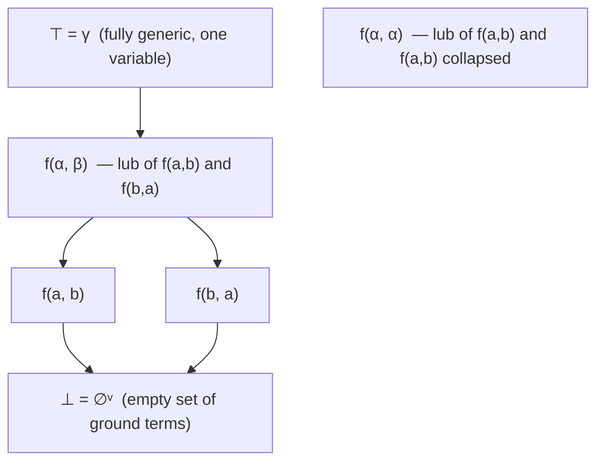

# The Herbrand Domain and Unification

[[book-guidelines|↩ Back to guidelines]]

## Why you'd want an abstract domain of *terms*

Every abstract domain in this book so far has abstracted **numbers**: intervals abstract integers, octagons abstract pairs of variables, zones abstract differences. But plenty of interesting program properties aren't about numbers at all — they're about *shapes*: the structure of a Prolog term, the syntax tree a compiler is elaborating, the type of an expression before you know all its parts. If you want to reason abstractly about *sets of trees* the way interval analysis reasons abstractly about *sets of integers*, you need a domain whose elements are themselves tree-shaped, and whose order captures "this shape is less specific than that one."

That's what Jacques Herbrand built (1930, in his thesis, translated in [486]) to give logic a purely syntactic notion of a "term" independent of any interpretation — a **ground term** like `+(1, 2)` denotes nothing but itself, an uninterpreted piece of syntax. Alongside ground terms he needed **symbolic terms** — terms with variables, like `+(1, x)` — to state general facts ("for all `x`, ...") and to solve equations between such facts. Gordon Plotkin and John Reynolds later showed (independently, around 1970) that these symbolic terms don't just sit there as syntax — they form a **complete lattice**, and two operations logicians already used by hand — **unification** and **anti-unification** (least common generalization) — are exactly that lattice's meet and join. This chapter (48) reconstructs that lattice as a genuine Galois-connection abstract domain of the *set of ground terms* it abstracts, in the same calculational style used throughout the book, and it exists here specifically to hand chapter 49 (Typing) a domain for **types with type variables** — monomorphic type inference literally *is* Herbrand-domain reasoning, with `list('a)` playing the role of a symbolic term.

If you're building an elaborator that resolves metavariables by unification, or a verifier whose typing judgments carry unification variables, this chapter is the abstract-interpretation-flavored account of the exact mechanism you'll implement: a set of things-with-holes, ordered by "more general than," where solving `?m = f(x)` is a lattice meet.

## 1. Ground terms: the Herbrand universe

A **signature** $\mathbf{F}$ is a set of function symbols $f \backslash n$ (arity $n \ge 0$; $n=0$ symbols are constants). Ground terms are built from $\mathbf{F}$ with no variables at all:

$$
\mathbf{t} \in \mathbf{T} ::= f\backslash 0 \mid f\backslash n(\mathbf{t}_1,\dots,\mathbf{t}_n)
$$

The set $\mathbf{T}$ of all such terms is the **Herbrand universe** with signature $\mathbf{F}$. Nothing here is interpreted — `+(1, 2)` is not "3," it's a labeled tree with root `+` and children `1` and `2`. This is exactly the AST of a term language before any evaluator touches it.

```rust
// The Herbrand universe, directly: an uninterpreted term tree.
enum Term {
    Const(Symbol),                 // f\0
    App(Symbol, Vec<Term>),        // f\n(t1, ..., tn)
}
```

A **ground term property** is just a set of ground terms — e.g. $P_0 = \{0, -(0,0), -(1,1), \dots\}$, "terms that evaluate to zero" if you later gave `+`/`-` a semantics. Ground term properties form the trivial complete lattice $\langle \wp(\mathbf{T}), \subseteq, \varnothing, \mathbf{T}, \cup, \cap\rangle$ — this is the *concrete* domain (48.1) that the rest of the chapter abstracts.

## 2. Symbolic terms: terms with a hole

A **term with variables** (symbolic term) adds a third production:

$$
\alpha,\beta,\gamma \in \mathbb{V}_{\mathfrak{t}} \qquad \tau \in \mathbf{T}^{\nu} ::= f\backslash 0 \mid f\backslash n(\tau_1,\dots,\tau_n) \mid \alpha
$$

So $+(1,\alpha)$ is a symbolic term standing in for the whole family $\{+(1,0), +(1,1), +(1,-(-(0,1),-(0,1))), \dots\}$ — every ground term you get by plugging *some* ground term into $\alpha$. `vars⟦τ⟧` denotes the set of free variables of $\tau$. OCaml's own type syntax is literally this grammar with a cosmetic notation change: `'a -> 'b -> 'a list -> 'b list` is, in prefix form, `->(->(α, β), ->(list(α), list(β)))` — a symbolic term over the signature `{->, list}`. This is not a coincidence; chapter 49 builds monomorphic type inference directly on top of this chapter.

An **[[Forward-Reachability-Semantics#Assignment|assignment]]** $\varrho \in \mathbf{P}^\nu \triangleq \mathbb{V}_{\mathfrak{t}} \to \mathbf{T}$ maps variables to ground terms, and extends homomorphically to a full evaluation of any symbolic term: $\varrho(f(\tau_1,\dots,\tau_n)) \triangleq f(\varrho(\tau_1),\dots,\varrho(\tau_n))$. Think of $\varrho$ as an environment binding metavariables — exactly a Lean/Coq metavariable-assignment map, or a Rust type-inference substitution table.

```rust
type Assignment = std::collections::HashMap<VarId, Term>; // ϱ : variable → ground term
```

**Syntactic replacement** $\tau[\alpha \leftarrow \tau']$ substitutes $\tau'$ for every occurrence of $\alpha$ inside $\tau$ (structurally, not through binders — there are none here). Lemma 48.8 shows syntactic replacement and environment update *commute*: $\varrho(\tau[\alpha \leftarrow \tau']) = \varrho[\alpha \leftarrow \varrho(\tau')](\tau)$. That's the formal reason the book reuses one notation for both operations — substituting-then-evaluating is the same as evaluating-with-an-updated-environment. This is precisely the substitution lemma that underlies every capture-avoiding-substitution proof you'd write for a real language (modulo binders, which first-order terms don't have).

**What breaks without the occurs check.** Call $\varrho(\tau)$ the *ground instance* of $\tau$. Lemma 48.9 (occurs check) proves that unless $\tau$ *is* the variable $\alpha$, no assignment can make $\varrho(\alpha) = \varrho(\tau)$ for $\alpha$ a variable occurring inside $\tau$ — because $\varrho(\tau)$ would then have to be an infinite tree (you'd need $\varrho(\alpha)$ to contain another copy of $\varrho(\alpha)$ inside it, recursively, forever), and ground terms are finite by construction. This single lemma is *why* unification algorithms need an occurs check: without it, you could "solve" $\alpha \doteq f(\alpha)$ and silently build a cyclic/infinite term, corrupting everything downstream. (Without an occurs check, Prolog I's unification was in fact unsound — Alain Colmerauer's fix in Prolog II was to embrace infinite rational trees deliberately, rather than patch the check.)

## 3. The symbolic abstraction, and why it must be relational

Abstraction is defined by its concretization first, in the usual style of the book:

$$
ground(\tau) \triangleq \{\varrho(\tau) \mid \varrho \in \mathbf{P}^\nu\}, \qquad ground(\overline{\varnothing}^\nu) \triangleq \varnothing
$$

($\overline{\varnothing}^\nu$ is a formal bottom symbol added because every *real* symbolic term has a nonempty concretization — a term is never the abstraction of the empty set on its own.)

**Remark 48.11, and the failure mode it's guarding against.** Here is the subtlety that makes this abstraction genuinely useful rather than a toy: all occurrences of the *same* variable $\alpha$ inside one term $\tau$ must take the *same* ground value in any one instance $\varrho(\tau)$. So $f(a,b) \notin ground(f(\alpha,\alpha))$ when $a \ne b$ — $f(\alpha,\alpha)$ only describes pairs where both components are equal. This is what "relational" means here: the abstraction can express *equality constraints between subterms*, not just independent per-position bounds. If the abstraction were instead "purely value-wise" — abstract each argument position independently, the way a non-relational numeric domain like intervals abstracts each variable independently — you could never express "the two arguments must be the same term," and every unification-driven use case (matching a pattern with a repeated variable, checking `x : 'a -> 'a` applied twice to the same argument) would be unrepresentable. The variable *names* don't matter (terms equal up to renaming — $\alpha \leftrightarrow \beta$ — have identical concretizations, e.g. $ground(f(\alpha,\alpha)) = ground(f(\beta,\beta)) = \{f(t,t) \mid t \in \mathbf{T}\}$); what matters is the *pattern of repetition*.

## 4. The subsumption order: "less general than"

Now define an order on symbolic terms directly, semantically, as inclusion of ground instances — no substitution machinery yet, just set containment of concretizations:

$$
(\tau \preceq^\nu \tau') \triangleq \big(ground(\tau) \subseteq ground(\tau')\big) \tag{48.12}
$$

This is a preorder $\langle \mathbf{T}^\nu \cup \{\overline{\varnothing}^\nu\}, \preceq^\nu\rangle$ with infimum $\overline{\varnothing}^\nu$; for example $f(a,b) \preceq^\nu f(a,b) \preceq^\nu f(a,\beta) \preceq^\nu \gamma$ — each step generalizes by replacing something concrete with a fresh variable. Read $\tau \preceq^\nu \tau'$ as "$\tau'$ subsumes $\tau$," or "$\tau$ is an instance of $\tau'$." It's only a *pre*order because syntactically distinct terms can have the same concretization (e.g. $f(\alpha,\alpha)$ and $f(\beta,\beta)$), so the book quotients by the induced equivalence $\simeq^\nu$ ($\tau \simeq^\nu \tau' \triangleq \tau \preceq^\nu \tau' \wedge \tau' \preceq^\nu \tau$, which turns out to be exactly "equal up to variable renaming," exercise 48.15) to get a genuine partial order $\langle \mathbb{P}^H, \preceq_{\simeq^\nu}\rangle$ on equivalence classes $[\tau]_{\simeq^\nu}$.

Formally, unwinding the definitions (exercise 48.13), subsumption means: $\tau \preceq^\nu \tau'$ iff every ground instance of $\tau$ is also achievable as a ground instance of $\tau'$ — $\forall \varrho \in \mathbf{P}^\nu.\, \exists \varrho' \in \mathbf{P}^\nu.\, \varrho(\tau) = \varrho'(\tau')$.

The **abstraction function** — going from a set of ground terms up to the single symbolic term that best (most-precisely) covers it — is the *least common generalization*: given a family of ground terms $\{t_i \mid i \in \Delta\}$, walk them structurally in lockstep:

$$
lcg[\nu](\varnothing) \triangleq \overline{\varnothing}^\nu \qquad\quad
lcg[\nu](\{f_i(\mathbf{t}_i^1,\dots,\mathbf{t}_i^{n_i}) \mid i\in\Delta\}) \triangleq
\begin{cases}
f(T^1,\dots,T^n) & \text{if all } f_i=f,\ n_i=n\\[2pt]
\nu(\{f_i(\mathbf{t}_i^1,\dots) \mid i\in\Delta\}) & \text{otherwise}
\end{cases}
$$

where $T^k = lcg[\nu](\{\mathbf{t}_i^k \mid i \in \Delta\})$. In words: if every term in the family has the same head symbol and arity, recurse into corresponding children and rebuild; the moment the family disagrees (different function symbols, or different arities), collapse that whole subfamily to *one fresh variable*, chosen by an arbitrary injective naming scheme $\nu$ so that identical subfamilies always get the identical variable (this is what preserves equality constraints — see below).

**Example 48.19.** With $\nu(\langle a,b\rangle)=\alpha,\ \nu(\langle b,a\rangle)=\beta$:

$$lcg[\nu]\big(\langle f(g(a,a),h(b,b),a,b),\ f(g(b,b),h(a,a),b,a)\rangle\big) = f\big(g(\alpha,\alpha),\, h(\beta,\beta),\, \alpha,\, \beta\big)$$

Notice the last two arguments, $\langle a,b\rangle$ vs $\langle b,a\rangle$, get abstracted to $\alpha$ and $\beta$ respectively — and those same $\alpha,\beta$ reappear as the diagonal-fillers inside $g$ and $h$, because $\nu$ assigns the *same* variable to the *same* subfamily wherever it recurs. This is exactly the relational property from §3 surviving abstraction: any equality that held between two ground positions across the whole family is preserved as a repeated variable in the abstraction, and any position that varied *independently* gets its own fresh variable.

Corollary 48.23/48.24 show this abstraction is sound (overapproximating: $\{t_i\} \subseteq ground(lcg[\nu](\{t_i\}))$) and — modulo the renaming-quotient — *exact as a Galois retraction*: $ground \circ lcg[\nu] \circ ground(\tau) = ground(\tau)$. Corollary 48.28 then upgrades this to the headline structural result:

> **The symbolic terms, ordered by $\preceq_{\simeq^\nu}$, form a complete lattice** — because they are the image of the complete lattice of ground-term properties $\langle \wp(\mathbf{T}), \subseteq\rangle$ under a Galois retraction. Its **join** (least upper bound) is $LCG_{\simeq^\nu}$ (binary: $lcg$), and its **meet** (greatest lower bound) is $GCI_{\simeq^\nu}(S) \triangleq lcg_{\simeq^\nu}[\nu]\!\big(\bigcap ground_{\simeq^\nu}(S)\big)$ (binary: $gci$).

This is the payoff of the whole construction: unification and least-common-generalization are not two independently-invented algorithms bolted onto term syntax — they are *forced to exist*, and forced to be exactly the meet and join, purely by the fact that this is a complete lattice image of a Galois retraction. The book derives them from the lattice structure rather than defining them first and checking the lattice axioms afterward — the same calculational-design philosophy used everywhere else in the book.



*(Moving up = generalizing / losing information = weaker property. Meet = "most specific common instance" = unification, moving down toward a shared refinement; join = "least general common generalization" = lcg, moving up toward a shared ancestor.)*

## 5. The classic substitution-based definition — and why it's equivalent

Logicians usually don't define subsumption semantically via `ground`; they define it *syntactically* via **substitutions**: partial functions $\vartheta$ from variables to terms-with-variables, extended homomorphically like assignments. $\tau \preceq^\nu \tau'$ classically means: there exists a substitution $\vartheta$ with $\vartheta(\tau') = \tau$ (applying $\vartheta$ to the *more general* term $\tau'$ produces the *more specific* term $\tau$).

**Theorem 48.31** proves these two definitions — the semantic one via `ground`-set-inclusion and the classic syntactic one via substitutions — coincide. This matters practically: it licenses switching between "reason about the set of ground instances" (good for proofs) and "reason about a syntactic substitution table" (good for algorithms) without worrying you've silently changed the relation.

## 6. The algorithms

### 6.1 Subsumption check: `leq`

Figure 48.34 gives `leq($\tau_1$, $\tau_2$, $\vartheta_0$)`, checking $\tau_1 \preceq^\nu \tau_2$ by structural recursion, threading a substitution table $\vartheta_0$ (initially $\varepsilon$) that records which subterm of $\tau_1$ each variable of $\tau_2$ has been matched against so far, so a *repeated* variable in $\tau_2$ is checked against the *same* subterm every time it recurs — this is the algorithmic footprint of §3's relational requirement.

```
let rec leq(τ1, τ2, ϑ0) =
  if   τ2 = α ∈ Vt ∧ α ∉ dom(ϑ0)                then ⟨tt, ϑ0[α ← τ1]⟩          -- bind α
  elif τ2 = α ∈ Vt ∧ α ∈ dom(ϑ0) ∧ ϑ0(α) = τ1   then ⟨tt, ϑ0⟩                  -- consistent repeat
  elif τ1 = f(τ1¹,...,τ1ⁿ) ∧ τ2 = f(τ2¹,...,τ2ⁿ) then                          -- same head, recurse
       let ⟨b1,ϑ1⟩ = leq(τ1¹,τ2¹,ϑ0) in ... let ⟨bn,ϑn⟩ = leq(τ1ⁿ,τ2ⁿ,ϑn-1) in
       ⟨b1 ∧ ... ∧ bn, ϑn⟩
  else ⟨ff, ϑ0⟩
```

Lemmas 48.37/48.40/48.43 prove termination, soundness, and completeness respectively; Theorem 48.44 concludes `leq` is *totally correct*: it always terminates and its boolean result exactly matches the $\preceq_{\simeq^\nu}$ order.

### 6.2 Meet: unification (`unify`, `mgu`, `gci`)

The meet in the symbolic-term lattice is characterized (48.45) by: find $\vartheta$ making $\vartheta(\tau_1) = \vartheta(\tau_2)$ — the classic statement of unification, arrived at here as *forced by the Galois retraction*, not postulated. Figure 48.48 gives the algorithm (essentially Herbrand's own 1930 recursive procedure, later rediscovered and popularized by Alan Robinson under the name "unification," and rephrased with deductive rules by Martelli and Montanari):

```
let rec unify(τ1, τ2, ϑ0) =
  if   τ1 = f(τ1¹,...,τ1ⁿ) ∧ τ2 = g(τ2¹,...,τ2ᵐ) then
       if f ≠ g then Ωs                                        -- clash: no unifier
       else fold unify over corresponding children, threading ϑ; fail if any step fails
  elif τ1 = τ2 = α ∈ Vt                          then ϑ0        -- variable erasure
  elif τ1 = α ∈ Vt ∧ α ∈ vars⟦τ2⟧                then Ωs        -- OCCURS CHECK: fail
  elif τ1 = α ∈ Vt then
       if α ∉ dom(ϑ0) then {⟨α, τ2⟩} ∘ ϑ0                       -- variable elimination: bind α := τ2
       else unify(ϑ0(α), τ2, ϑ0)                                -- α already bound: unify its value
  else unify(τ2, τ1, ϑ0)                                        -- orient: put the variable first

let mgu(τ1, τ2) = unify(τ1, τ2, ε)

let gci(τ1, τ2) =                                -- precondition: no shared variables
  if τ1 = ∅ᵛ ∨ τ2 = ∅ᵛ then ∅ᵛ
  else let ϑ = mgu(τ1, τ2) in if ϑ = Ωs then ∅ᵛ else ϑ(τ1)
```

Notice the occurs check sits exactly where Lemma 48.9 said it must — trying to bind $\alpha$ to a term that already contains $\alpha$ would build an infinite term, so it's rejected outright, returning the error substitution $\Omega_s^r$ (concretization $\varnothing$, i.e. the lattice's true bottom — "no ground term unifies these").

**Worked failure and success.** $f(a,\alpha) \doteq f(b,\beta)$ with $a \ne b$: the recursive call on the first arguments hits `f = g` at the outer level (both `f`), recurses to `unify(a, b, ...)`, which is the *ground-clash* case ($a \ne b \in \mathbf{F}_0$) — no rule applies except failure, so $mgu = \Omega_s^r$, and indeed $gci(f(a,\alpha), f(b,\beta)) = \varnothing^\nu$: there is genuinely no ground term that is both $f(a, \cdot)$ and $f(b, \cdot)$. Contrast with $f(x,y) \doteq f(z,z)$ (Herbrand's own example, footnote 2): this *does* unify, with $\vartheta(x)=\vartheta(y)=\vartheta(z)=\gamma$ for a fresh $\gamma$ — the most general solution identifies all three variables, matching the relational reading from §3 exactly: $y$ and $z$ get forced equal by the second argument position, and that constraint propagates back to force $x$ equal too.

Theorem 48.64 (soundness+completeness of `mgu` as *most general* unifier: its concretization as a solved-equation substitution equals the full set of ground solutions $\gamma_e(\tau_1 \doteq \tau_2)$) and Theorem 48.66 (`gci` computes the actual lattice meet) close the correctness argument.

### 6.3 Join: least common generalization (`lcg`)

Figure 48.69 is the mirror-image algorithm for the join, walking two terms in lockstep instead of one term against a substitution table, and instead of failing on a clash it **generalizes** by inventing a fresh variable for the position where they disagree — reusing a previously invented variable $\beta$ if this exact pair $\langle\tau_1,\tau_2\rangle$ was already generalized elsewhere in the term (that's the memo table $T_0$, `dom`/lookup at line 6–7):

```
let rec lub(τ1, τ2, T0) =
  if   τ1 = f(τ1¹,...,τ1ⁿ) ∧ τ2 = f(τ2¹,...,τ2ⁿ) then           -- same head: recurse structurally
       fold lub over children, threading T; rebuild f(τ¹,...,τⁿ)
  elif ∃β ∈ dom(T0). T0(β) = ⟨τ1,τ2⟩                            -- seen this exact clash before
       then ⟨β, T0⟩                                              -- reuse the same fresh variable
  else let β fresh in ⟨β, T0[β ← ⟨τ1,τ2⟩]⟩                       -- invent a new variable

let lcg(τ1, τ2) = if τ1 = ∅ᵛ then τ2 elif τ2 = ∅ᵛ then τ1 else fst(lub(τ1, τ2, ∅))
```

**Example 48.70** (mismatched arguments): $lcg(f(a,b), f(b,a))$ — same head $f$, recurse: $lub(a,b,\varnothing)$ has no shared head (both are ground constants but different ones) $\Rightarrow$ invent $\alpha$, table $\{\alpha \mapsto \langle a,b\rangle\}$. Then $lub(b,a,\{\alpha\mapsto\langle a,b\rangle\})$: the pair $\langle b,a\rangle$ is *not* the same as the recorded $\langle a,b\rangle$ (order matters!), so invent a *second* fresh variable $\beta$. Result: $lcg(f(a,b),f(b,a)) = f(\alpha,\beta)$ — two independent holes, because the two argument positions never agreed on anything across the family.

**Example 48.71** (matched arguments): $lcg(f(a,b), f(a,b))$ — identical terms. First child pair $\langle a,b\rangle \Rightarrow \alpha$, table $\{\alpha \mapsto \langle a,b\rangle\}$. Second child pair is *again* $\langle a,b\rangle$ — same as the recorded pair — so the memo hits and reuses $\alpha$ rather than inventing $\beta$. Result: $f(\alpha,\alpha)$, a genuinely relational generalization (both positions forced equal), not $f(\alpha,\beta)$. This is the join's version of the relational-abstraction property from §3, and it's the entire reason the memo table $T_0$ exists — dropping it would silently degrade `lcg` from a *relational* to a *Cartesian* (independent-per-position) abstraction, destroying precision for exactly the cases (repeated variables, shared structure) unification-based analyses care about most.

Theorem 48.103 (proof off-book, on the companion GitHub repo) establishes `lcg`'s total correctness as computing the lattice join.

## Grounding: the same shape in Rust, Lean, and Python

**Rust — a small, honest unifier.** The book's `unify` is directly transcribable as a recursive function over a `Term` enum plus a substitution map, with the occurs check as an explicit early-exit — this is close to the core of what a Hindley–Milner-style type checker's `unify` function looks like in practice:

```rust
use std::collections::HashMap;

#[derive(Clone, Debug, PartialEq)]
enum Term {
    Var(u32),
    App(&'static str, Vec<Term>),
}

fn occurs(v: u32, t: &Term, subst: &HashMap<u32, Term>) -> bool {
    match t {
        Term::Var(w) if *w == v => true,
        Term::Var(w) => subst.get(w).map_or(false, |t2| occurs(v, t2, subst)),
        Term::App(_, args) => args.iter().any(|a| occurs(v, a, subst)),
    }
}

fn unify(t1: &Term, t2: &Term, subst: &mut HashMap<u32, Term>) -> bool {
    let t1 = resolve(t1, subst);
    let t2 = resolve(t2, subst);
    match (&t1, &t2) {
        (Term::Var(a), Term::Var(b)) if a == b => true,
        (Term::Var(a), _) => {
            if occurs(*a, &t2, subst) { return false; } // Lemma 48.9's failure mode, guarded
            subst.insert(*a, t2);
            true
        }
        (_, Term::Var(_)) => unify(&t2, &t1, subst), // reorient, as in (48.47.13)
        (Term::App(f, args1), Term::App(g, args2)) => {
            f == g && args1.len() == args2.len()
                && args1.iter().zip(args2).all(|(a, b)| unify(a, b, subst))
        }
        _ => false,
    }
}

fn resolve(t: &Term, subst: &HashMap<u32, Term>) -> Term {
    match t {
        Term::Var(v) => subst.get(v).map_or(t.clone(), |t2| resolve(t2, subst)),
        other => other.clone(),
    }
}
```

**Lean — this is `isDefEq` on metavariables.** Lean's elaborator does not implement Herbrand-domain unification on *all* terms (dependent types need higher-order/pattern unification for metavariable applications), but on the *first-order fragment* — matching an inductive constructor's argument shape, checking two ground types are defeq — the mechanism is the chapter's `unify` verbatim: metavariables `?m` play the role of $\alpha$, `assignExprMVar` is exactly `{⟨α, τ2⟩} ∘ ϑ0`, and Lean's own occurs check (rejecting `?m := f ?m`) is Lemma 48.9's finiteness argument enforced at runtime. Sketching the correspondence:

```lean
-- Conceptual sketch of unify's structure in Lean's metavariable style
-- (not literal kernel code — illustrates the correspondence)
partial def unify (t1 t2 : Term) : StateM Subst Bool := do
  let t1 ← resolve t1
  let t2 ← resolve t2
  match t1, t2 with
  | .mvar a, .mvar b => pure (a == b)
  | .mvar a, _ =>
      if ← occurs a t2 then pure false        -- occurs check, Lemma 48.9
      else do assign a t2; pure true          -- variable elimination, (48.47.11)
  | _, .mvar _ => unify t2 t1                 -- reorientation, (48.47.13)
  | .app f as, .app g bs =>
      pure (f == g) <&&> allM (uncurry unify) (as.zip bs)
  | _, _ => pure false
```

The Herbrand domain's *lattice* structure — subsumption as generality, `lcg` as anti-unification — is also precisely what Lean's `isDefEq` needs to reason about when two metavariable-containing types are "the same up to still-undetermined holes," and it's the formal justification for why unification, not some ad hoc pattern match, is the right operation for implicit-argument resolution.

**Python — a quick `lcg` sketch**, where Rust's ceremony would obscure the point (memoization by pair identity):

```python
def lcg(t1, t2, table, fresh):
    if isinstance(t1, App) and isinstance(t2, App) and t1.head == t2.head and len(t1.args) == len(t2.args):
        return App(t1.head, [lcg(a, b, table, fresh) for a, b in zip(t1.args, t2.args)])
    key = (t1, t2)
    if key not in table:
        table[key] = fresh()          # invent a NEW variable only for a genuinely new mismatch
    return table[key]                  # reuse: this is what makes lcg relational, not Cartesian
```

## Where this leads

- **Immediately, chapter 49 (Typing):** monomorphic types-with-variables ("monotypes with variables," e.g. `'a list`) are exactly this chapter's symbolic terms, and Hindley–Milner-style type inference is unification in this lattice — solving `?a list = int list` is `mgu`, generalizing two branches of an `if` to a common type is `lcg`. The chapter you just read is the load-bearing abstract-domain machinery underneath ordinary type inference, made explicit rather than assumed.
- **For the elaborator/unifier project in your learning goals:** this is the untyped, first-order skeleton of what a metavariable-based elaborator's core loop does. Miller's *pattern unification* (the tractable higher-order fragment used by real proof assistants) is best understood as "Herbrand-style first-order unification, plus a restricted class of higher-order metavariable applications ($?m\ x_1\ \dots\ x_n$ with the $x_i$ distinct bound variables) that can be solved by the same variable-elimination-plus-occurs-check discipline." Get comfortable with *this* chapter's `unify` — occurs check, idempotent substitution, most-general solution — before tackling the higher-order generalization; the extra machinery sits on top of, not instead of, this.
- **For proof search / clause generation:** Herbrand's own motivation was refutation theorem-proving via the resolution rule — unification is what lets two clauses with variables be matched up to derive a new one. Any resolution-style or tableau-style prover you build will need exactly `mgu` as its "can these two literals be made to match" primitive.
- **Structurally**, this chapter depends on: the general theory of Galois connections/retractions and complete lattices (chapters 11 and the order-theory groundwork), and on nothing else new — it's a self-contained worked example of "define abstraction by concretization, derive the lattice, then derive the algorithms," the book's calculational-design method applied to syntax instead of numbers.
