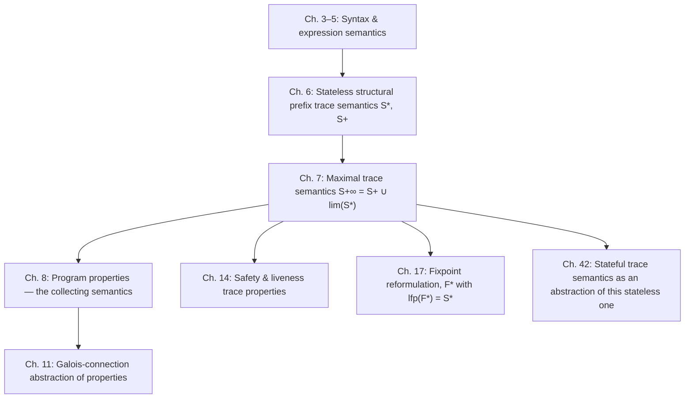

# Trace Semantics of Programs

[[book-guidelines|↩ Back to guidelines]]

## Why define this at all

Before you can *analyze* a program — before "abstract interpretation" means anything — you need a mathematically precise answer to a much more naive question: what does it mean for a program to run? Not "run" in the sense of a CPU fetching bytes, but "run" in the sense of a mathematical object you can quantify over, take limits of, and prove theorems about. That object is a **trace**: a record of a single execution, as a sequence of program points and the actions that moved you between them.

Cousot could have taken the conventional route here — a small-step transition relation over machine *states* (program counter + memory), the kind you'd write as `⟨ℓ, ρ⟩ → ⟨ℓ', ρ'⟩`. Almost every operational-semantics textbook does this. Instead, chapters 6–7 build something deliberately unusual, and the two design choices are the whole point of this topic:

1. **Stateless.** A trace never carries an explicit memory/environment. It's just a sequence of labels and actions (assignments, tests, breaks, skips). If you need to know what `x` equals at some point, you don't look it up in a store — you *replay the trace backward* until you find the last [[Forward-Reachability-Semantics#Assignment|assignment]] to `x`.
2. **Structural and deductive.** The trace semantics of a compound statement is defined by an inference rule per grammar production — exactly the same recipe used for expressions in chapter 3, just generalized from values to *sets of traces*. A trace isn't computed by an interpreter loop; it's a **proof object** in a small deductive system, one rule per syntax case.

Both choices look perverse until you see what they buy: a stateless semantics generalizes cleanly to concurrency and weak memory models (where "the current value of `x`" is genuinely ambiguous and depends on *which* past write you're reading from — you can't get away with a single mutable cell), and it lets chapter 42 recover the familiar stateful semantics later as a mere *abstraction* of this one, rather than treating statefulness as a primitive. You'll see this pattern constantly in this book: start from the most general/precise object, get everything else as an abstraction of it.

## What breaks without a rigorous trace semantics

If you skip straight to "abstract domains" and "static analysis" without nailing this down first, every soundness claim you make later is unfalsifiable — "sound with respect to what?" Static analysis is only meaningful relative to a ground-truth semantics it's supposed to approximate. Trace semantics *is* that ground truth here: it is, in Cousot's own framing, the strongest (maximally precise) program property there is (chapter 8), and every abstract domain in the rest of the book is obtained from it by systematically throwing away information via a Galois connection. Get this chapter wrong, and "sound" stops meaning anything.

---

## 1. What a trace is

**Definition (6.1).** A finite trace is a finite sequence of *configurations* — program labels $\ell$ marking "what's next" — separated by *actions*:

$$
v \in \mathbb{V} \qquad a \in \mathbb{A} ::= x = A = v \mid B \mid \neg(B) \mid \mathrm{break} \mid \mathrm{skip}
$$

An action is either an assignment (recording both the source expression and the concrete value it evaluated to), a test outcome (`B` for true, `¬(B)` for false), a loop-exiting `break`, or a no-op `skip`. Concretely, a prefix trace and a maximal (terminating) trace of a small program look like this:

$$
\ell_1 \xrightarrow{x=x+1=1} \ell_2 \xrightarrow{\mathsf{tt}} \ell_3 \xrightarrow{x=x+1=2} \ell_4 \xrightarrow{\neg(x>2)} \ell_2 \xrightarrow{\mathsf{tt}} \ell_3 \quad (6.2)
$$

Read left to right: at $\ell_1$, `x` is assigned `1`; the test at $\ell_2$ comes back true; at $\ell_3$, `x` is assigned `2`; the test `x > 2` at $\ell_4$ comes back false; and so on. A trace can degenerate to a single label $\ell_1$ (zero actions taken yet), and it can be infinite — for a nonterminating loop, the trace just keeps unwinding.

The book fixes notation for the different flavors: $\mathbb{T}_+$ is the set of all finite traces, $\mathbb{T}_\infty$ all infinite ones, $\mathbb{T}_{+\infty} \triangleq \mathbb{T}_+ \cup \mathbb{T}_\infty$ everything. $\pi = \ell\pi'$ means "$\pi$ starts at label $\ell$"; $\pi = \pi'\ell$ means "$\pi$ ends at label $\ell$" (for finite $\pi$). Trace concatenation $\frown$ glues a trace ending at $\ell$ to one starting at $\ell$.

**Grounding.** This is exactly the shape you'd reach for if you were writing a program-trace collector in Rust for a verifier's test harness:

```rust
enum Action {
    Assign { var: String, value: i64 },
    Test(bool),      // true = B held, false = ¬(B)
    Break,
    Skip,
}

// A finite trace, structurally: alternating labels and actions.
struct Trace {
    labels: Vec<Label>,      // len = actions.len() + 1
    actions: Vec<Action>,
}
```

For infinite traces, Rust's `Vec` obviously won't do — you'd reach for a lazy/coinductive structure (a `Stream`, or an `Iterator` you never fully consume). Lean makes the finite/infinite split explicit at the type level, which is worth naming here because it foreshadows exactly the tension chapter 7 resolves:

```lean
inductive FiniteTrace where
  | last : Label → FiniteTrace
  | step : Label → Action → FiniteTrace → FiniteTrace

-- an infinite trace needs coinduction, not this inductive type
```

The book's own remark 6.5 is candid about this: it doesn't over-specify what $\mathbb{T}_{+\infty}$ *is* concretely (a coinductive stream? a function $\mathbb{N} \to \ldots$?) — it just parameterizes traces abstractly over labels $\mathbb{L}$ and actions $\mathbb{A}(\mathbb{V})$ and moves on. That's a deliberate implementation-hiding move you should imitate: pin down the *interface* (concatenation, prefixing, the value-recovery operation below) before committing to a representation.

## 2. Recovering variable values from trace history

This is the load-bearing idea that makes "stateless" workable at all.

**Definition (6.2).** $\rho(\pi)x$ is the value of variable $x$ at the end of finite trace $\pi$ — formally, *the value of the last assignment to $x$ on $\pi$, or $0$ if there is none* (exercise 6.7 asks you to prove this characterization from the recursive definition).

There's no environment record anywhere in the trace's type. Instead, $\rho$ is a function that *scans backward through the sequence of actions* looking for the most recent write. This is precisely the mental model of Git blame, or of an SSA-form compiler pass, or — if you've touched event-sourced systems — of reconstructing "current state" by folding over an append-only event log rather than mutating a table in place. The state is never stored; it's always *derived*.

**What breaks without this.** If you instead baked a memory $\rho$ into every configuration $\langle \ell, \rho \rangle$ (the conventional stateful choice), you'd be forced to pick, once and for all, what "the current value of $x$" means at a program point — which is fine for a sequential deterministic language, but becomes incoherent the moment you add concurrency: under a relaxed memory model, different threads can legitimately disagree about which past write "the current value" refers to. Chapter 17's worked exercise on sequential consistency (program order / coherence order / read-from relations) is only expressible because the semantics never assumed a single canonical memory in the first place. Stateless-first is what keeps that door open.

**Grounding.** In Rust, this is a fold:

```rust
fn value_at_end(trace: &[Action], x: &str) -> i64 {
    trace.iter().rev()
        .find_map(|a| match a {
            Action::Assign { var, value } if var == x => Some(*value),
            _ => None,
        })
        .unwrap_or(0)
}
```

In Lean, it's a recursive definition over the inductive `FiniteTrace` from above — and note that this function is exactly the *denotation* half of a small-step semantics without ever mentioning a `Map<Var, Value>` type. This is the sense in which the book's "stateless" semantics quietly *is* doing state management — it's just deferring the bookkeeping to $\rho$ instead of the trace's shape.

## 3. The two trace-semantics functionals: prefix and maximal-finite

With traces and $\rho$ in hand, chapter 6 defines two closely related functionals for any statement $S$.

**Prefix trace semantics** $\mathcal{S}^*\llbracket S \rrbracket$ (6.3): given an initialization trace $\pi_1 \mathrm{at}\llbracket S \rrbracket$ that has already arrived at $S$'s entry point, $\mathcal{S}^*\llbracket S \rrbracket(\pi_1\mathrm{at}\llbracket S \rrbracket)$ is the set of ways $S$ can *continue* it — partial executions of $S$ that may or may not have finished:

$$
\underbrace{\xrightarrow{\pi_1} \underbrace{\mathrm{at}\llbracket S \rrbracket \xrightarrow{\pi_2} \ell}_{\in\ \mathcal{S}^*\llbracket S\rrbracket(\pi_1\mathrm{at}\llbracket S\rrbracket)}}_{}
$$

**Maximal finite trace semantics** $\mathcal{S}^+\llbracket S \rrbracket$ (6.4) is the restriction of that to continuations that actually finish — reach $\mathrm{after}\llbracket S \rrbracket$:

$$
\mathcal{S}^+\llbracket S \rrbracket(\pi_1\mathrm{at}\llbracket S \rrbracket) \triangleq \{\pi_2\ell \in \mathcal{S}^*\llbracket S \rrbracket(\pi_1\mathrm{at}\llbracket S \rrbracket) \mid \ell = \mathrm{after}\llbracket S \rrbracket\} \qquad (6.9)
$$

The pair $\langle \pi_1, \pi_2 \rangle$ (initialization, continuation) is called a *prefix execution*; when $\pi_2$ actually reaches the end, it's a *finite maximal execution*. Note $\mathcal{S}^*$ is safety-shaped (it describes everything that *could* happen so far, including partial computations — no notion of "success") while $\mathcal{S}^+$ is termination-shaped (it only counts completed runs). This distinction resurfaces constantly later in the book: prefix semantics underlies *safety properties*, maximal-finite underlies *partial correctness* (chapter 8).

## 4. Structural definitions: axioms and inference rules per grammar production

Section 6.5 generalizes the recursive-definition recipe from expressions (chapter 3) to arbitrary syntax-indexed sets $F\llbracket S \rrbracket$:

- **Base case (axiom):** $\dfrac{}{x \in F\llbracket S \rrbracket}$ — $x$ is unconditionally in the set.
- **Inductive case**, for $S ::= S_1 \ldots S_n$: $\dfrac{x_1 \in F\llbracket S_1 \rrbracket, \ldots, x_n \in F\llbracket S_n \rrbracket}{f(x_1,\ldots,x_n) \in F\llbracket S \rrbracket}$ — combine sub-results with $f$.

This is *the* recurring shape of a typing judgment or an evaluation judgment, and it's worth naming explicitly: an inference rule with premises above the line and a conclusion below is nothing but a **constructor of a proof term**, and "prove that trace $\pi$ is a valid execution of $S$" means "exhibit a derivation tree built from these rules" — precisely the shape of a type-checking derivation. If you've internalized bidirectional typing judgments, this section should feel entirely familiar; it's the same machine, applied to "is this trace a legal execution" instead of "does this term have this type."

**Grounding.** In Rust, a deductive system like this becomes a recursive function pattern-matching on syntax, one match arm per production — literally an inductive-datatype interpreter:

```rust
fn is_prefix_trace(s: &Stmt, pi1: &Trace) -> HashSet<Trace> {
    match s {
        Stmt::Assign { .. } => { /* rule (6.16) */ todo!() }
        Stmt::Skip       => { /* rule (6.17) */ todo!() }
        Stmt::Seq(s1, s2)   => { /* rule (6.14): combine S*[[s1]] and S+[[s1]]·S*[[s2]] */ todo!() }
        Stmt::If { .. }     => { /* rules (6.18)/(6.19) */ todo!() }
        Stmt::While { .. }  => { /* rules (6.24)/(6.25)/(6.26), see §5 below */ todo!() }
        Stmt::Break         => { /* rule (6.29) */ todo!() }
    }
}
```

In Lean this is even more literal: an `inductive Prop`-valued relation `IsPrefixTrace : Stmt → Trace → Trace → Prop` with one constructor per rule — this *is* what `isDefEq`-style kernel judgments look like internally, just for a different relation.

## 5. The per-construct rules — worked in full for assignment and conditionals

The book instantiates the axiom/rule schema once per statement form. Two worth seeing exactly, because their shape recurs everywhere:

**Assignment**, $S ::= {}^\ell x = A;$ — a prefix (and here, automatically maximal) trace continuing $\pi^\ell$ takes the one step dictated by evaluating $A$:

$$
\dfrac{v = \mathcal{A}\llbracket A \rrbracket \rho(\pi^\ell)}{\ell \xrightarrow{x=A=v} \mathrm{after}\llbracket S \rrbracket \in \widehat{\mathcal{S}}^*\llbracket S \rrbracket(\pi^\ell)} \qquad (6.16)
$$

This is the moment $\rho$ from §2 actually gets used: the value assigned is computed by evaluating the arithmetic expression *against the history so far*, not against a stored environment.

**Conditional**, $S ::= \mathtt{if}^\ell(B)\ S_t$ — two rules, one per branch outcome:

$$
\dfrac{\mathcal{B}\llbracket B \rrbracket \rho(\pi_1^\ell) = \mathsf{ff}}{\ell \xrightarrow{\neg(B)} \mathrm{after}\llbracket S \rrbracket \in \widehat{\mathcal{S}}^*\llbracket S \rrbracket(\pi_1^\ell)} \qquad (6.18)
\qquad
\dfrac{\mathcal{B}\llbracket B \rrbracket \rho(\pi_1^\ell) = \mathsf{tt},\ \ \pi_2 \in \widehat{\mathcal{S}}^*\llbracket S_t \rrbracket(\pi_1^\ell \xrightarrow{B} \mathrm{at}\llbracket S_t \rrbracket)}{\ell \xrightarrow{B} \mathrm{at}\llbracket S_t \rrbracket \frown \pi_2 \in \widehat{\mathcal{S}}^*\llbracket S \rrbracket(\pi_1^\ell)} \qquad (6.19)
$$

Skip, sequencing, `break`, and compound statements get the same treatment (rules 6.13–6.17, 6.29–6.30) — each is a one-line mechanical rule once you have the pattern. Worth flagging: the rules for `break` thread a distinguished label $\mathrm{break\text{-}to}\llbracket S \rrbracket$ (the exit label of the closest enclosing loop) through every construct that could contain a break, which is exactly the kind of "auxiliary judgment parameter" you end up needing in a real type checker for anything with non-local control flow (think: `return`, exceptions).

**Worked example (6.31).** For $P_6 \triangleq {}^{\ell_1}x{=}x{+}1;\ {}^{\ell_2}x{=}x{+}1;\ {}^{\ell_3}$, the book derives the full proof tree that $\ell_1 \xrightarrow{x=1} \ell_2 \xrightarrow{x=2} \ell_3 \in \widehat{\mathcal{S}}^*\llbracket P_6\rrbracket(\ell_1)$ by chaining (6.16) twice through the sequencing rule (6.14) — a genuine derivation tree, not just an assertion. This is worth working through by hand once: it's the smallest possible example of "a trace is a proof."

## 6. Iteration: left-recursive vs. right-recursive characterization

This is the technically richest part of the chapter, and one of the two subtopics the guidelines flag as a key question — so it earns the most space.

### The rule as given: left recursion

The book's primary rule for $S ::= \mathtt{while}^\ell(B)\ S_b$ is (schematically) "$n+1$ iterations = $n$ iterations, then one more":

$$
\dfrac{\ell\pi_2\ell \in \widehat{\mathcal{S}}^*\llbracket S \rrbracket(\pi_1^\ell),\quad \mathcal{B}\llbracket B \rrbracket \rho(\pi_1^\ell\pi_2^\ell) = \mathsf{tt},\quad \pi_3 \in \widehat{\mathcal{S}}^*\llbracket S_b \rrbracket(\pi_1^\ell\pi_2^\ell \xrightarrow{B} \mathrm{at}\llbracket S_b \rrbracket)}{\ell\pi_2^\ell \xrightarrow{B} \mathrm{at}\llbracket S_b \rrbracket \frown \pi_3 \in \widehat{\mathcal{S}}^*\llbracket S \rrbracket(\pi_1^\ell)} \qquad (6.26)
$$

Read the premise carefully: it recursively demands a trace of the *whole loop* ($\ell\pi_2\ell$) as an ingredient for building a longer trace of the whole loop. That's **left recursion** in exactly the sense a parser writer means it — the recursive call is on the *outside*, wrapping around one more iteration tacked onto the right. There's also a base case (6.24: the trace reduced to just $\ell$, zero iterations) and an exit case (6.25: the test fails, loop is done).

**What breaks without stating it this way.** Left recursion is the *natural* direction to write down, because it mirrors how you'd narrate an execution as it happens: "first it did some iterations, then it did one more." But it is not the only correct characterization, and proving properties *about* this definition (e.g., that reordering rules doesn't change the generated set — lemma 6.45 below) requires first pinning down precisely what set of traces this left-recursive form generates. That's what **lemma 6.39** does.

### Lemma 6.39 — closing the recursion

$$
\widehat{\mathcal{S}}^*\llbracket S \rrbracket(\pi_1^\ell) \triangleq \{\underline{\pi}(k-1) \frown \ell\pi'(k) \mid \pi_1^\ell \in \mathbb{T}^+ \wedge k \in \mathbb{N}^+ \wedge \beta(k-1)\} \qquad (6.39)
$$

In words: every prefix trace of the loop is *exactly* "$k-1$ complete terminating iterations of the body, followed by whatever the $k$th iteration got through" — for some $k$, provided all tests up through iteration $k-1$ came back true ($\beta(k-1)$). $\underline{\pi}(k)$ is literally $k$ concatenated maximal executions of $S_b$; $\ell\pi'(n)$ is the (possibly partial) $n$th iteration. This is a *closed-form* description of the same set (6.26) defines recursively — the difference between "here's a recipe for building the set" and "here's what's in the set, stated directly," which is exactly the gap a soundness proof has to bridge.

**Grounding.** This is the difference between writing a loop as accumulating recursion —

```rust
fn prefix_traces_left(n_completed: usize, body: &Stmt, init: &Trace) -> Vec<Trace> {
    // n+1 = n, then one more: recursive call wraps the *outer* structure
    if n_completed == 0 { return vec![init.clone()]; }
    prefix_traces_left(n_completed - 1, body, init)
        .into_iter()
        .flat_map(|prev| continue_with_one_more_iteration(body, &prev))
        .collect()
}
```

— versus the closed-form check lemma 6.39 licenses: "a candidate trace is valid iff it decomposes as $k{-}1$ back-to-back maximal executions of the body plus a trailing partial one, with all guards along the way evaluating true." The second form is what you'd actually implement in a *verifier* — you don't want to search over unbounded recursion depth to validate a witness trace, you want a direct predicate you can check.

### The equivalent right-recursive definition — and why it matters

Section 6.8 replaces (6.25)/(6.28)/(6.26) with an equivalent set of rules (6.40)–(6.42) where "$n+1$ iterations = one iteration, then $n$ more" — the recursive call is now *inside*, on the tail:

$$
\dfrac{\mathcal{B}\llbracket B \rrbracket \rho(\pi_1^\ell) = \mathsf{tt},\quad \pi_2' \in \widehat{\mathcal{S}}^*\llbracket S_b \rrbracket(\pi_1^\ell \xrightarrow{B} \mathrm{at}\llbracket S_b \rrbracket),\quad \pi_3' \in \widehat{\mathcal{S}}^*\llbracket S \rrbracket(\pi_1^\ell \xrightarrow{B} \mathrm{at}\llbracket S_b\rrbracket \frown \pi_2')}{\ell \xrightarrow{B} \mathrm{at}\llbracket S_b \rrbracket \frown \pi_2' \frown \pi_3' \in \widehat{\mathcal{S}}^*\llbracket S \rrbracket(\pi_1^\ell)} \qquad (6.42)
$$

**Lemma 6.45** proves these two rule sets are *equivalent* — same generated trace set — by structural induction, bottoming out in lemma 6.39 as the common closed form both definitions must satisfy.

**Why bother, if 6.39 already fully characterizes the left-recursive version (the guidelines' own key question)?** Two reasons, and both are things a compiler/verifier engineer runs into constantly:

1. **Different definitions are convenient for different proofs.** Left recursion mirrors *execution order* and is the natural thing to state as "what actually happened." Right recursion mirrors *structural/inductive proof order* — "peel off one step, recurse on the rest" — which is the shape induction proofs and recursive-descent implementations actually want. You'll pick whichever one makes your current proof's induction hypothesis line up; chapter 17 uses exactly this right-recursive shape to derive a fixpoint transformer $\mathcal{F}^*$ whose least fixpoint reproduces (6.39) — the right-recursive form is what makes that fixpoint construction go through cleanly.
2. **It's a template for "this equivalence isn't obvious; prove it once, reuse forever."** This is precisely the kind of lemma that, if skipped, silently corrupts every later proof that happens to use "the wrong" recursive form and assumes it's interchangeable with the other.

**Grounding.** In Rust terms, this is the tail-recursive vs. non-tail-recursive rewrite of the same fold — and if you've ever converted an accumulator-passing loop into a `foldl`/`foldr` pair to make an induction proof tractable in Lean, you've done exactly lemma 6.45's move. In Lean, proving `leftRec_iterate = rightRec_iterate` by structural induction on the iteration count is a direct transliteration of the book's proof, and it's the same maneuver you'd need to justify unfolding a recursive elaboration rule in either evaluation order.

## 7. Traces as a relation between initialization and continuation

Section 6.10 makes explicit something implicit since §3: because $\mathbb{T}_+ \to \wp(\mathbb{T}_+)$ and $\wp(\mathbb{T}_+ \times \mathbb{T}_+)$ are isomorphic (the right-image correspondence — a set-valued function is the same data as a relation), $\mathcal{S}^*\llbracket S \rrbracket$ can equally well be read as a **relation**

$$
\mathcal{S}^*\llbracket S \rrbracket \triangleq \{\langle \pi, \pi' \rangle \mid \pi \in \mathbb{T}_+ \wedge \pi' \in \mathcal{S}^*\llbracket S \rrbracket\pi\}
$$

pairing an initialization trace with a continuation trace. This single sentence is doing more work than it looks: it's the bridge between "trace semantics as a function returning a set of futures" and "trace semantics as an input/output relation," which is exactly the relational/transformer view chapter 12 builds the rest of the verification machinery on (and it's the same move that lets you later think of a Hoare triple $\{P\}S\{Q\}$ as constraining this very relation). Sections 6.11–6.12 then generalize from a single initialization trace $\pi_1$ to an arbitrary *set* of initial traces $\mathcal{P}_0$ (needed once you stop fixing one starting point and want, e.g., "all traces reachable from any state satisfying precondition $P$"), and give a pointwise (per-label) reformulation used later for reachability analyses.

## 8. Chapter 7: closing the loop with infinite traces

Chapter 6 only produces finite traces. A nonterminating loop has none of those — it has an *infinite* one, and chapter 7's entire job is defining what that infinite trace *is*, without just declaring a separate coinductive clause (that's deferred to chapter 16's coinductive/bi-inductive framework; here it's done more simply, as a limit).

**Prefixes and limits.** For a finite or infinite trace $\pi$, $\pi[0..p]$ is its length-$p$ prefix. Given a set $\mathcal{T}$ of finite traces, its limit is

$$
\lim \mathcal{T} \triangleq \{\pi \in \mathbb{T}^\infty \mid \forall n \in \mathbb{N}.\ \pi[0..n] \in \mathcal{T}\} \qquad (7.2)
$$

— the infinite traces *all of whose finite prefixes are already in* $\mathcal{T}$. This only works cleanly when $\mathcal{T}$ is closed under taking prefixes (a natural property of $\mathcal{S}^*\llbracket S\rrbracket$'s output). When it isn't, (7.4) gives a looser variant — prefixes need only be *extendable* to a member of $\mathcal{T}$, not members themselves.

**Infinite trace semantics:**

$$
\mathcal{S}^\infty\llbracket S \rrbracket(\pi^\ell) \triangleq \lim\big(\mathcal{S}^*\llbracket S \rrbracket(\pi^\ell)\big) \qquad (7.6)
$$

**Maximal finite-or-infinite trace semantics**, unifying both outcomes into one object:

$$
\mathcal{S}^{+\infty}\llbracket S \rrbracket(\pi^\ell) \triangleq \mathcal{S}^+\llbracket S \rrbracket(\pi^\ell) \cup \mathcal{S}^\infty\llbracket S \rrbracket(\pi^\ell) \qquad (7.7)
$$

**Worked example.** For the nonterminating loop $S = \mathtt{while}^{\ell_1}(\mathtt{tt})\ {}^{\ell_2}x{=}x{+}1;\ {}^{\ell_3}$, the finite prefix semantics from §6 is the family $\big(\ell_1 \xrightarrow{\mathsf{tt}} \ell_2 \xrightarrow{x=i} \ell_1\big)_{i=1}^n$ for every $n$ — all finite, all incomplete. Taking the limit collapses this entire infinite *family* of finite prefixes into a single infinite trace $\pi = \big(\ell_1 \xrightarrow{\mathsf{tt}} \ell_2 \xrightarrow{x=i} \ell_1\big)_{i=1}^\infty$, and $\mathcal{S}^{+\infty}\llbracket S \rrbracket(\ell_1) = \{\pi\}$ — exactly one maximal execution, the nonterminating one. This is a genuinely useful thing to internalize: **an infinite trace isn't a new kind of primitive object you construct directly; it's the limit point that a directed system of ever-longer finite prefixes converges to.** That's the sense in which "maximal finite and infinite trace semantics as limits of prefixes" (the guidelines' phrasing) should be read literally, not loosely.

**Lemma 7.15 — iteration's infinite traces.** For a `while` loop, its infinite executions are *exactly* one of two mutually exclusive shapes:

- **(a)** infinitely many terminating iterations of the body, back to back, forever — the loop always finishes each pass but the count of passes never stops; or
- **(b)** finitely many ($n{-}1 \geq 0$) terminating iterations, followed by one iteration of the body that *itself* runs forever (an inner nontermination, e.g. a nested infinite loop or an infinite recursive call inside the body).

Both cases fall directly out of lemma 6.39 plus the definition of $\lim$: case (a) is what you get by taking $k \to \infty$ in (6.39)'s "$k$ completed iterations" description; case (b) is what happens when the *last* iteration itself fails to produce a finite maximal trace. This is a genuinely satisfying closure of the chapter: nontermination of a loop is fully explained in terms of the same finite-trace machinery from chapter 6, with no separate primitive notion of "infinite loop" ever introduced.

**Grounding.** This limit construction is precisely what you reach for whenever you formalize a fixpoint semantics for a `while` interpreter: instead of writing a Rust function that returns `Option<Trace>` and looping until it terminates or hangs, you characterize the infinite case as "the trace such that every finite prefix is a valid finite prefix of some longer run" — which is directly checkable, unlike "run forever and see." In Lean, this is where you'd reach for a coinductive `Stream`/`CoInductive Trace` and prove that the greatest-fixpoint characterization coincides with $\lim$ of the inductive prefix set — a genuinely nontrivial correspondence the book chooses to sidestep here (deferring the coinductive treatment to chapter 16) precisely because $\lim$-of-prefixes is enough to get the theory off the ground without committing to a coinduction principle yet.

---

## Where this leads



Everything downstream in the book treats the trace semantics defined here as the *concrete* semantics being abstracted. Chapter 8's "collecting semantics" is literally $\mathcal{S}^{+\infty}$ collected over all initial states — the strongest program property that exists, full stop. Every later chapter's abstract domain (intervals, octagons, points-to, Hoare logic itself) is, by construction, a *sound approximation* of what was defined here, obtained via a Galois connection (chapter 11). And the left/right-recursive-iteration duality of §6 isn't a one-off curiosity: chapter 17 reuses the right-recursive shape to build a fixpoint transformer $\mathcal{F}^*$ whose least fixpoint provably *equals* (6.39)'s $\mathcal{S}^*$ — the deductive, proof-tree characterization of "what a loop's traces are" and the fixpoint, iterative characterization turn out to be two views of the same object, which is the calculational-design method the whole book is built on.

For the standing project: this chapter *is* the ground-truth operational semantics a Rust verifier needs before any Hoare-triple soundness proof can be stated meaningfully — "the Hoare triple $\{P\}S\{Q\}$ is sound" cashes out as a claim about $\mathcal{S}^{+\infty}\llbracket S \rrbracket$, nothing else. The structural-deductive rule format (§4–5) is also the direct ancestor of any typing/evaluation judgment you'd hand-roll for such a verifier — the same axiom-plus-inference-rule recipe, just proving "this is a valid trace" instead of "this term has this type." And the left- vs. right-recursive duality (§6) is worth keeping in your pocket the next time an induction proof over a loop or a recursive elaboration step refuses to go through in one direction — try stating it in the other recursive form first.
