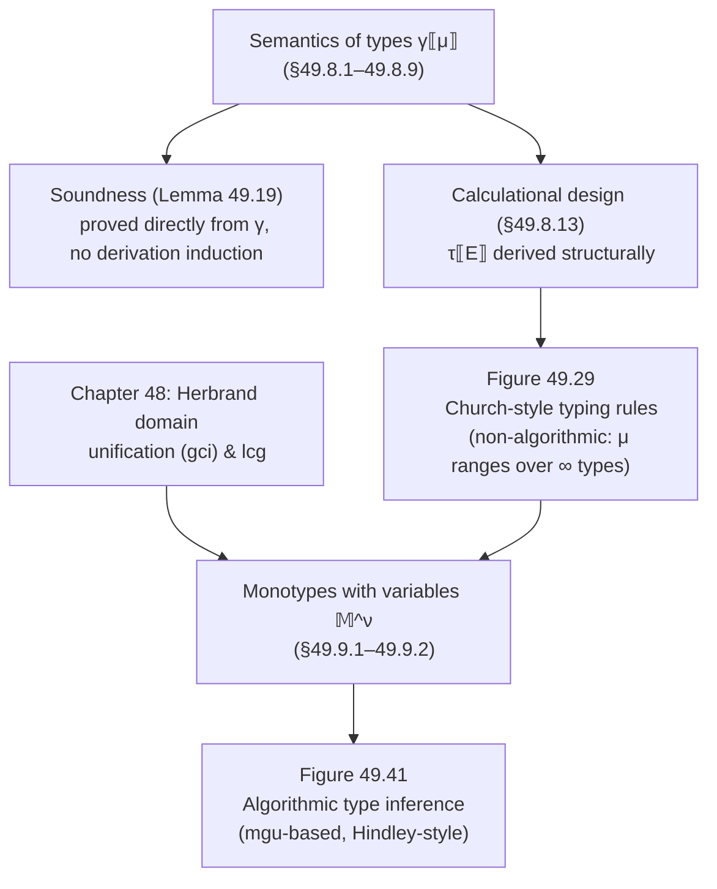

# Type Systems as Abstract Interpretation

[[book-guidelines|↩ Back to guidelines]]

## The problem: two ways to justify a type system, and only one of them is honest about where it comes from

Every treatment of static typing you've seen probably follows the same script: someone hands you a set of inference rules — $\Gamma \vdash e : \tau$ scribbled with horizontal bars — and *then* proves, usually by induction on the derivation tree, that if a program type-checks it "cannot go wrong" (progress + preservation, à la Wright–Felleisen). The rules come first, as an act of engineering taste; soundness is a theorem bolted on afterward to justify the taste.

Cousot's chapter 49 refuses that order. It asks: what does a type *mean*, semantically, before any rule exists? A monotype like `int list` isn't a syntactic token — it's a **set of runtime values** (all well-formed integer lists, plus whatever error placeholder belongs there). Once you fix that meaning as a Galois connection between "the set of possible run-time behaviors of an expression" and "the set of monotypes consistent with those behaviors," the typing rules are not invented — they're **calculated**, mechanically, as the best possible sound approximation. Soundness isn't proved after the fact; it's true by construction, because every step of the calculation is itself an over-approximation.

This matters for anyone building a type checker or an elaborator: it's the difference between hand-writing rules and hoping they're sound, versus deriving the rules from a specification you already trust. If you ever add a rule to a type checker and aren't sure it's sound, this chapter shows you the actual discipline for finding out.

## Part 1 — Static vs. dynamic errors: what "does not go wrong" actually has to rule out

Before types, Cousot fixes the universe of untyped values $\mathbb{U}$: built from booleans $\mathbb{B}$, integers $\mathbb{Z}$, the null list `nil`, pairs $\langle x,y\rangle$, and lists $x :: y$. Nothing stops you from building $1 :: \langle 0, \texttt{nil}\rangle :: \texttt{nil}$ — a list mixing an integer and a pair. That's a value with no coherent shape, and operating on it is where errors come from.

Two flavors of error are distinguished sharply, and this distinction is the spine of the whole chapter:

- **Static error** $\Omega^\sigma$ — detectable *without running the program* (e.g., building an inhomogeneous list, or applying `hd` to something that's provably never a list).
- **Dynamic error** $\Omega^\delta$ — only detectable *at runtime* (e.g., `hd(nil)` — you can't know a list is empty until you evaluate up to that point in general).

**[[Safety-and-Liveness-Properties#What breaks without this distinction|What breaks without this distinction]]:** if you don't separate the two, you either (a) demand a type system that rules out *all* possible runtime failures — which is undecidable in general (this is literally Exercise 49.1: prove that checking a program has no static *or* dynamic errors is undecidable) — or (b) you conflate "well-typed" with "will never crash," which is a promise no realistic static type system keeps (Rust's `unwrap()` on `None`, ML's `hd []`, are dynamic errors that typecheck fine). The chapter's target is precise and achievable: **static typing only needs to rule out static errors.** The slogan "well-typed programs don't go wrong" is quietly narrower than it sounds — it means "don't go *statically* wrong."

```rust
// A Rust flavor of the same split. The type checker guarantees
// this compiles only if operand *shapes* line up statically —
// that's the analogue of ruling out Ω^σ.
fn head(xs: &[i32]) -> i32 {
    xs[0] // this can still panic at runtime: index out of bounds
          // — the Rust analogue of a *dynamic* error Ω^δ that
          // static typing does not (and does not try to) rule out
}
```

**Rust grounding, more precisely:** `Vec<T>::get(0) -> Option<&T>` is exactly a dynamic-error-aware API — it turns the dynamic error into an explicit value instead of a panic, pushing the error back into the type-checked world. That's the "more sophisticated static analyses" the chapter gestures at (footnote to exercise 49.34) — refining a type system so some *dynamic* errors migrate into the static category.

## Part 2 — Dynamic types: what a runtime actually needs to track

If you were writing an interpreter for a dynamically typed language, what would you tag each value with at runtime? The chapter defines dynamic types $t \in \mathbb{T}^\delta$ as ground terms:

$$t \in \mathbb{T}^\delta ::= \texttt{bool} \mid \texttt{int} \mid \texttt{nil} \mid t_1 * t_2 \mid t_1\ \texttt{list} \mid \texttt{err}$$

The subtlety worth sitting with: **`nil` has its own type**, distinct from "`t list` for some `t`." Why not just say `nil : t list` for an arbitrary `t`? Because `nil` is genuinely polymorphic in `t` — it belongs to *every* `t list` simultaneously (there are infinitely many such types). The book resolves this with an explicit equivalence relation on dynamic types:

$$t_1\ \texttt{list} \equiv^\delta \texttt{nil} \;=\; \texttt{nil} \equiv^\delta t_1\ \texttt{list} \;\triangleq\; \mathbf{tt}$$

meaning: an object of type `nil` can be used wherever a `t list` is expected, for *any* `t`. This is the seed of the whole polymorphism story later — `nil`'s type is genuinely infinite, and taming that infinity (via type *variables*) is exactly what Part 5 below is about.

**Lean angle:** this "one constructor whose type is generic over an index" is precisely what an inductive family with a universally-quantified constructor looks like:

```lean
inductive MyList (α : Type) where
  | nil  : MyList α          -- generic in α, just like `nil` here
  | cons : α → MyList α → MyList α
```

`MyList.nil`'s *type* `MyList α` is parametric — Lean's elaborator has to unify `α` with whatever the surrounding context demands, exactly the "monotype-with-variable" move the chapter makes explicit in Part 5.

## Part 3 — Semantics of monomorphic types: a type *is* a set of values

Here's the definition that makes the whole chapter's method possible — it's the concretization function $\gamma$ mapping each monotype $\mu$ to the set of values it denotes:

$$\gamma\llbracket\texttt{int}\rrbracket \triangleq \mathbb{Z} \cup \{\Omega^\delta\} \qquad \gamma\llbracket\texttt{bool}\rrbracket \triangleq \mathbb{B} \cup \{\Omega^\delta\}$$
$$\gamma\llbracket\mu_1 * \mu_2\rrbracket \triangleq \{\langle v_1,v_2\rangle \mid v_1 \in \gamma\llbracket\mu_1\rrbracket\setminus\{\Omega^\delta\} \wedge v_2 \in \gamma\llbracket\mu_2\rrbracket\setminus\{\Omega^\delta\}\} \cup \{\Omega^\delta\}$$
$$\gamma\llbracket\mu_1\ \texttt{list}\rrbracket \triangleq \{v_1 :: \dots :: v_n :: \texttt{nil} \mid n \in \mathbb{N}^+ \wedge \forall i.\ v_i \in \gamma\llbracket\mu_1\rrbracket\setminus\{\Omega^\delta\}\} \cup \{\texttt{nil}, \Omega^\delta\}$$

Read that last line carefully: **a type includes its own dynamic error as a member.** $\gamma\llbracket\texttt{int}\rrbracket$ isn't just $\mathbb{Z}$ — it's $\mathbb{Z} \cup \{\Omega^\delta\}$. This is not sloppiness; it's the load-bearing move that lets "typable" and "cannot go statically wrong" coexist: a well-typed expression is still allowed to *dynamically* fail (e.g., `hd([])` is well-typed — it has type $\alpha$ for the right $\Gamma$ — but evaluates to $\Omega^\delta$, not to a static error). The type's job is only to exclude $\Omega^\sigma$, never to promise termination-without-$\Omega^\delta$.

**What breaks without this:** if instead you defined $\gamma\llbracket\texttt{int}\rrbracket = \mathbb{Z}$ exactly, then no expression that can dynamically fail would ever be well-typed by the semantic definition below — which would make the whole type system useless for a language with partial operations like `hd`.

From this, types and their runtime tags line up via a correspondence function $\delta$ (the inverse map from static monotypes to dynamic types — `bool ↦ bool`, `μ₁ * μ₂ ↦ δ(μ₁) * δ(μ₂)`, etc.), and Theorem/Definition 49.13 nails the general shape:

$$\gamma\llbracket\mu\rrbracket = \{v \in \mathbb{V} \mid \tau^\delta(v) = \delta(\mu)\} \cup \{\Omega^\delta\} \cup (\mu = \mu_1\ \texttt{list} \;?\; \{\texttt{nil}\} : \varnothing)$$

i.e., "the values whose runtime tag matches this static type, plus the dynamic-error placeholder, plus `nil` if it's a list type." Everything downstream — type assignments, typings, judgments — is now defined the *same* way: as a set of concrete objects, with a $\gamma$ function.

- **Type [[Forward-Reachability-Semantics#Assignment|assignment]]** $\Gamma \in \mathbb{A} \triangleq \mathbb{V} \to \mathbb{M}$ — denotes $\gamma\llbracket\Gamma\rrbracket \triangleq \{\rho \mid \forall x.\ \rho(x) \in \gamma\llbracket\Gamma(x)\rrbracket\}$: the set of environments consistent with the hypothesis.
- **Typing** $\langle \Gamma,\mu \rangle \in \Theta \triangleq \mathbb{A} \times \mathbb{M}$ — denotes $\gamma\llbracket\langle\Gamma,\mu\rangle\rrbracket \triangleq \{f \mid \forall\rho\in\gamma\llbracket\Gamma\rrbracket.\ f(\rho)\in\gamma\llbracket\mu\rrbracket\}$: the set of *expression semantics* (functions from environment to value) consistent with that hypothesis-and-conclusion pair.
- **Type judgment** $\Gamma \vdash E : \mu \;\triangleq\; \mathscr{E}\llbracket E \rrbracket \in \gamma\llbracket\langle \Gamma,\mu\rangle\rrbracket$ — a judgment is *by definition* the statement that $E$'s actual semantics is a member of the concrete set the typing denotes.

This is the crux: **a type judgment is a membership test in semantics-land, not a syntactic derivation.** Everything that follows is downstream of this one equation (49.18).

```python
# A deliberately concrete, non-load-bearing illustration in Python:
# think of gamma[mu] literally as a runtime predicate.
def gamma_int(v):
    return isinstance(v, int) or v is OMEGA_DELTA

def judgment_holds(E, Gamma, mu, gamma_mu):
    # Gamma |- E : mu  iff  for every environment consistent with Gamma,
    # E's actual evaluated value is a member of gamma[mu].
    return all(gamma_mu(eval_expr(E, rho)) for rho in environments_matching(Gamma))
```

## Part 4 — Soundness for free: Lemma 49.19

Because a judgment is *defined* as membership in a concrete semantic set, soundness stops being a theorem you prove by induction on a derivation — it becomes almost definitional:

> **Lemma 49.19 (typable expressions cannot go wrong).** If $\Gamma \vdash E : \mu$ then $\forall \rho \in \gamma\llbracket\Gamma\rrbracket.\ \mathscr{E}\llbracket E \rrbracket \rho \neq \Omega^\sigma$.

The proof is four lines of unfolding definitions — (49.18) → (49.16) → (49.13) — and the last step just observes $\Omega^\sigma \notin \mathbb{V}$ (the value domain used by $\gamma\llbracket\mu\rrbracket$ never contains the static-error placeholder to begin with). There's no induction on a derivation tree because there's no derivation tree yet in the argument — the rules of Figure 49.29 don't exist at this point in the chapter. **This is the load-bearing methodological claim of the whole chapter**, and the book says it explicitly: contrast this with "the classic approach [Winskel §8.3], which proceeds by induction on a derivation of the type $\mu$ of $E$ according to type inference rules that have to be guessed a priori." Here, soundness is proved *before* any rule is written down, from the semantics of types alone. The rules, when they arrive, inherit soundness automatically because they're calculated to be sound.

**What this buys you as an implementer:** if you ever *add* a typing rule to an existing checker (a new primitive, a new coercion), the classical discipline forces you to re-run an inductive soundness proof over the whole rule set. Here, the discipline is local: define what the new rule's conclusion *means* semantically, check the rule is an under-approximation of the calculation, done. This is precisely the posture you want for the "checker/verifier" project — rules aren't trusted by convention, they're checked against a semantics you can point to.

## Part 5 — Calculational design: deriving Figure 49.29 instead of guessing it

Now the actual machine. The type of an expression $E$, written $\tau\llbracket E \rrbracket$, is defined as a Galois-connection abstraction of its concrete semantics — "the best (smallest, most precise) set of typings consistent with $E$'s actual behavior":

$$\alpha(\{\mathscr{E}\llbracket E \rrbracket\}) = \{\langle\Gamma,\mu\rangle \mid \Gamma \vdash E : \mu\} \;\stackrel{\smash{\raisebox{-2pt}{\tiny$\triangle$}}}{=}\; \tau\llbracket E \rrbracket \tag{49.23}$$

Since this best abstraction is generally not computable exactly (or not by structural recursion on $E$ without more work), the chapter derives a **structural, rule-shaped over-approximation** by calculating $\tau\llbracket E \rrbracket$ case by case on the syntax of $E$, each step licensed by "$\subseteq$ (over-approximation of the collecting semantics)" or an exact equality from an already-established lemma. Two representative cases, both worked in full in the source:

- **$E = 1$:** $\{\langle\Gamma,\mu\rangle \mid \forall\rho \in \gamma\llbracket\Gamma\rrbracket.\ 1 \in \gamma\llbracket\mu\rrbracket\} = \{\langle\Gamma,\texttt{int}\rangle \mid \Gamma \in \mathbb{A}\}$ — collapses immediately because `int` is the *only* monotype whose concretization contains the literal `1`. This calculation *is* the rule `[cte]`.
- **$E = \texttt{hd}(S)$:** a longer chain (shown on p. 909 of the source) that unfolds the semantics of `hd`, invokes Lemma 49.7 (the structural/fixpoint characterization of homogeneous lists), and lands exactly on $\{\langle\Gamma,\mu\rangle \mid \Gamma \vdash S : \mu\ \texttt{list}\}$ — which *is* rule `[hd]`.

The result, Figure 49.29, is the classic Church-style (non-algorithmic — types are still sets, possibly infinite) presentation:

$$\dfrac{}{\Gamma \vdash 1 : \texttt{int}}\ [\texttt{cte}] \qquad \dfrac{}{\Gamma \vdash x : \Gamma(x)}\ [\texttt{var}] \qquad \dfrac{\Gamma \vdash A_1:\texttt{int},\ \Gamma \vdash A_2:\texttt{int}}{\Gamma \vdash A_1-A_2:\texttt{int}}\ [\texttt{mns}]$$
$$\dfrac{\Gamma\vdash S_1:\mu_1,\ \Gamma\vdash S_2:\mu_2}{\Gamma\vdash S_1,S_2:\mu_1*\mu_2}\ [\texttt{pair}] \qquad \dfrac{}{\Gamma\vdash[\,]:\mu\ \texttt{list}}\ [\texttt{nil}] \qquad \dfrac{\Gamma\vdash S_1:\mu,\ \Gamma\vdash S_2:\mu\ \texttt{list}}{\Gamma\vdash S_1::S_2:\mu\ \texttt{list}}\ [\texttt{cons}]$$
$$\dfrac{\Gamma\vdash S:\mu\ \texttt{list}}{\Gamma\vdash \texttt{hd}(S):\mu}\ [\texttt{hd}] \qquad \dfrac{\Gamma\vdash S:\mu\ \texttt{list}}{\Gamma\vdash \texttt{tl}(S):\mu\ \texttt{list}}\ [\texttt{tl}] \qquad \dfrac{\Gamma\vdash S:\mu\ \texttt{list}}{\Gamma\vdash S=[\,]:\texttt{bool}}\ [\texttt{eq}]$$

Notice the shape of `[nil]`: $\Gamma \vdash [\,] : \mu\ \texttt{list}$ for *every* $\mu$ — the empty list is typable at infinitely many types simultaneously, exactly reflecting the `nil`-equivalence from Part 2. This is precisely the fact that makes the rules *non-algorithmic*: an implementation that tried to enumerate $\tau\llbracket E \rrbracket$ by brute-force case analysis on Figure 49.29 could never finish on `[]`, because it isn't one finite set — it's a schema.

```rust
// Figure 49.29's rules, transcribed as a checker (not an inferencer) —
// this only *verifies* a claimed type, mirroring the non-algorithmic
// judgment-checking framing of Exercise 49.36.
enum Mono { Int, Bool, Pair(Box<Mono>, Box<Mono>), List(Box<Mono>) }

fn check(gamma: &TypeEnv, e: &Expr, mu: &Mono) -> bool {
    match e {
        Expr::Const(_) => matches!(mu, Mono::Int),
        Expr::Var(x) => gamma.get(x) == Some(mu),
        Expr::Nil => matches!(mu, Mono::List(_)),          // works for ANY mu — [nil]
        Expr::Cons(s1, s2) => match mu {
            Mono::List(elem) => check(gamma, s1, elem) && check(gamma, s2, mu),
            _ => false,
        },
        Expr::Hd(s) => check(gamma, s, &Mono::List(Box::new(mu.clone()))),
        // ... [mns], [pair], [tl], [eq] follow the same pattern
        _ => false,
    }
}
```

This is `check`, not `infer` — and that gap (checking works fine against `[nil]`'s infinite schema; *inferring* a type for `[]` from nothing does not) is exactly the problem Part 6 solves.

## Part 6 — Monotypes with variables: making `nil`'s infinite type finite

Why can't you just enumerate $\tau\llbracket [\,] \rrbracket = \{\langle\Gamma,\mu\ \texttt{list}\rangle \mid \mu \in \mathbb{M} \wedge \Gamma \in \mathbb{A}\}$ and be done? Because that set is genuinely infinite — one $\mu$ for every monotype in existence — and no algorithm enumerates an infinite set in finite time. This is **Exercise 49.36 / Key Question 2** made concrete: the *rules* (as a checker) are fine with the infinite schema; an *inference algorithm* that has to compute a representative type from scratch is not.

Hindley's fix, and the chapter's actual payoff for anyone building an inference engine: don't represent a set of monotypes by enumerating it — represent it by **one monotype-with-variables** that stands for the whole set via its ground instances. This reuses, verbatim, the Herbrand symbolic-term machinery of Chapter 48 (the "symbolic domain" mentioned in the guidelines' summary of that chapter):

$$\mu \in \mathbb{M}^\nu ::= \texttt{int} \mid \texttt{bool} \mid \mu_1 * \mu_2 \mid \mu_1\ \texttt{list} \mid \alpha \qquad (\alpha,\beta \in \mathfrak{V},\ \text{type variables})$$

The abstraction is the **least common generalization**, $lcg[\nu]$, from Chapter 48's Herbrand lattice — the *join* in the subsumption lattice of terms-with-variables, dual to unification (which is the lattice's *meet*, $gci$/mgu). Concretely:

$$\tau^\nu\llbracket E \rrbracket \triangleq lcg[\nu](\tau\llbracket E \rrbracket)$$

For `[]`, this instantly collapses the infinite family $\{\mu\ \texttt{list} \mid \mu \in \mathbb{M}\}$ down to the single finite representative $\alpha\ \texttt{list}$ — one term, one type variable, standing in for every ground instance. The book is careful to flag that this abstraction is *lossy in general* ($lcg[\nu](\{\texttt{int}, \texttt{bool}\}) = \alpha$ throws away the fact that only two ground types were possible, not all of them) — **but it is proved exact for exactly the sets that actually arise from typing this language's expressions** (49.38–49.39, a genuine Galois *isomorphism*, not just a connection, on the sub-lattice $\mathbf{PM}$ of sets-of-ground-instances-of-a-term-with-variables). The reason it's exact here and not in general: the language and rules were designed with no type unions (no expression has type $\{\texttt{int}, \texttt{bool}\}$ simultaneously) — precisely the discipline that keeps Hindley–Milner-style inference both sound *and* complete for this fragment.

From this, the algorithmic rules of **Figure 49.41** fall out by the same calculational method — but now using $gci$ (unification, the lattice meet) wherever two premises need to agree on a variable-bearing type:

$$\dfrac{\Gamma_1\vdash A_1:\mu_1,\ \Gamma_2\vdash A_2:\mu_2,\ \vartheta = mgu(\{\langle\Gamma_1,\mu_1\rangle,\langle\Gamma_2,\mu_2\rangle,\langle\Gamma^\nu,\texttt{int}\rangle\})}{\vartheta(\Gamma^\nu)\vdash A_1-A_2:\texttt{int}}\ [\texttt{mns}]$$

$$\dfrac{}{\Gamma^\nu \vdash [\,] : \alpha\ \texttt{list}}\ [\texttt{nil}] \qquad \dfrac{\Gamma_1\vdash S_1:\mu_1,\ \Gamma_2\vdash S_2:\mu_2,\ \vartheta = mgu(\{\langle\Gamma_1,\mu_1\ \texttt{list}\rangle,\langle\Gamma_2,\mu_2\rangle\})}{\vartheta(\Gamma_1)\vdash S_1::S_2:\vartheta(\mu_1)\ \texttt{list}}\ [\texttt{cons}]$$

Compare `[nil]` here against Figure 49.29's version: instead of an infinite schema over all $\mu$, there's now exactly **one variable** $\alpha$, unified against whatever context demands a concrete type for it. This is Hindley–Milner's core trick stated with total precision: *polymorphism-at-inference-time is a fresh variable plus unification*, not a search over infinitely many ground possibilities.

**Example 49.40** shows unification failure doing the work of a type error, exactly as you'd expect from an inferencer:

$$gci(\langle\Gamma^\nu,\texttt{int}\rangle, \langle\Gamma^\nu,\texttt{int}*\texttt{int}\rangle, \langle\Gamma^\nu,\texttt{bool}\rangle) = \overline{\varnothing}^\nu$$

"the difference of a pair of integers and a boolean is not typable, because `int`, `int*int`, and `bool` don't unify" — unification's failure state ($\overline{\varnothing}^\nu$, the bottom of the lattice) *is* the type-error signal. This is the same mechanism Miller pattern-unification generalizes for higher-order metavariables, and the same mechanism Lean's `isDefEq` runs (at the level of definitional equality rather than ground unifiability) when resolving implicit arguments.

```rust
// A minimal Rust sketch of the Figure 49.41 [mns] rule: infer, then unify.
// This is the load-bearing shape of a real type-inference pass.
fn infer_minus(gamma: &mut Subst, a1: &Expr, a2: &Expr) -> Result<Mono, TypeError> {
    let mu1 = infer(gamma, a1)?;
    let mu2 = infer(gamma, a2)?;
    gamma.unify(&mu1, &Mono::Int)?;   // mgu({<Γ,μ1>, <Γ,int>})
    gamma.unify(&mu2, &Mono::Int)?;   // mgu({<Γ,μ2>, <Γ,int>})
    Ok(Mono::Int)
}
```

```lean
-- Lean's own elaborator does exactly this shape when checking `a - b`:
-- infer types of subterms into metavariables, then `isDefEq` (definitional-
-- equality-as-unification) to force them to Int, exactly mirroring mgu here.
-- The chapter's `gci` on ground terms is the simply-typed special case of
-- what Lean's kernel unifier does over dependent terms.
```

## Where this leads



This chapter is a template, not just a result about types: **give the property you want a precise semantic (concrete) meaning first, then calculate the analysis as a provably-sound over-approximation of that meaning.** That's the same discipline the rest of the book applies to reachability, Hoare-logic invariance, and model checking — typing is simply the instance most programmers already have intuition for, which is presumably why Cousot places it here as a worked case study of the method.

For the standing projects this vault is tracking:

- **The Rust checker/verifier**: Figure 49.29's rules, read as a *checker* rather than an inferencer, are directly the shape of a Hoare-triple-style verification-condition checker — `Γ ⊢ E : μ` is structurally the same judgment form as `Γ ⊢ {P} S {Q}`, and Lemma 49.19's proof technique (soundness by unfolding semantic definitions, not induction on a postulated rule set) is the right template for proving your own verifier's rules sound against whatever operational semantics it's checked against.
- **The elaborator/unifier project**: Part 6 is close to a minimal worked example of what your metavariable-unification engine needs to do — $lcg[\nu]$ (join, generalization) and $gci$/mgu (meet, unification) are literally the two lattice operations Miller pattern-unification and Lean's kernel unifier specialize to richer term languages. The chapter's proof that the abstraction is *exact* here (49.38–49.39), rather than merely sound, is worth remembering as the ideal case — most real unification problems (including yours, with implicit arguments) won't get that exactness for free, and knowing precisely *why* it holds here (no type unions, no generic operations) tells you what discipline you'd need to impose elsewhere to get it back.
