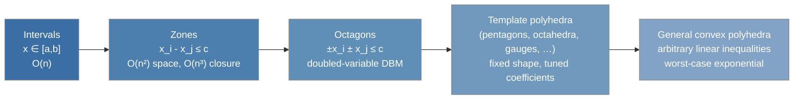

# Zone and Octagon Relational Domains

[[book-guidelines|↩ Back to guidelines]]

## 1. The gap that non-relational domains can't close

Interval analysis (chapter 32-ish territory, and the non-relational domains generally) tells you `x ∈ [0, 100]` and `n ∈ [0, 100]` separately. It cannot tell you `x < n`. That's a real problem the moment you write an array-bounds check:

```rust
fn get(a: &[i32], x: i64, n: i64) -> Option<i32> {
    if x >= 0 && x < n {
        Some(a[x as usize]) // safe iff the analysis can prove x < n, not just x < 100
    } else {
        None
    }
}
```

If `n` is a symbolic parameter (the array's own length, unknown at analysis time), interval analysis is stuck: it can bound `x` and `n` independently but has no vocabulary for a *relation between two variables*. This is exactly the motivating example the book opens chapter 40 with — bounding array indices against a symbolic bound `n`. What breaks without relational reasoning isn't a corner case; it's the single most common shape of correctness argument in array-processing code (`i < len`, `lo <= hi`, `write_pos < capacity`, loop counters against buffer sizes).

The zone domain is the cheapest fix: track constraints of the shape $x_i - x_j \le c$ (equivalently, bounded differences between pairs of variables) and, as a bonus, single-variable bounds $\pm x_i \le c$ by encoding them as differences against a fictitious zero variable. The octagon domain extends this one notch further to $\pm x_i \pm x_j \le c$, catching sums as well as differences ($x + y \le c$, useful for things like "buffer position plus remaining capacity"). Both are *relational* domains, but restricted to a shape cheap enough to stay polynomial — this is the whole design tension of the chapter: full linear relations (polyhedra, chapter 38-ish) are exponential to maintain; zones and octagons trade some precision for a shape that reuses graph algorithms you already have.

## 2. The zone domain

### 2.1 Constraints, and the zero-variable trick

A zone property over variables $\mathbb{V} = \{x_1, \dots, x_m\}$ (values ranging over a totally ordered field $\mathbb{F}$, typically $\mathbb{Q}$ or $\mathbb{R}$, or $\mathbb{Z}$ — division is never needed) is a conjunction of constraints

$$x_i - x_j \le c$$

The book's trick for folding in *unary* bounds ($x_i \le c$, $-x_i \le c$) without a second constraint shape: introduce an extra variable $x_0$ whose value is *always* $0$. Then $x_i \le c$ becomes $x_i - x_0 \le c$, and $-x_i \le c$ becomes $x_0 - x_i \le c$. Every constraint in the system, uniformly, is now of the form $x_i - x_j \le c_{ij}$ for $i, j \in [0, m]$, $i \ne j$. This is a small move but it's the reason the rest of the domain gets to be *one* uniform machine instead of two.

**Rust grounding.** This is the standard trick for representing "bounded variable plus bounded difference" systems as a single homogeneous constraint graph — you'll see the identical move in timed-automata model checkers and in SMT difference-logic theories:

```rust
/// Variable index 0 is the reserved "always zero" pseudo-variable.
type VarId = usize;

struct Constraint {
    i: VarId, // x_i
    j: VarId, // x_j
    c: i64,   // x_i - x_j <= c
}
```

### 2.2 Encoding as a weighted graph / DBM

Each constraint $x_i - x_j \le c_{ij}$ becomes a directed edge $\langle i, j\rangle$ of weight $c_{ij}$ in a graph $G = \langle [0,m], E, \omega \rangle$ — reusing the weighted-graph machinery from chapter 39 wholesale. The graph is represented by its adjacency (distance) matrix $D$, with $D_{ij} = c_{ij}$ when the constraint is present and $D_{ij} = \infty$ (no constraint) otherwise, $D_{ii} = 0$. This matrix is the **difference bound matrix (DBM)** — a name due to Vaughan Pratt, who introduced this canonical encoding.

```rust
const INF: i64 = i64::MAX;

struct Dbm {
    n: usize,           // n = m + 1 (variables 0..=m, 0 is the zero pseudo-variable)
    d: Vec<Vec<i64>>,   // d[i][j] = c_ij, or INF if absent, d[i][i] = 0
}
```

The concretization $\gamma(D) = \{\rho \mid \forall i,j.\ \rho(x_i) - \rho(x_j) \le D_{ij}\}$ (with $x_0 \mapsto 0$) is empty exactly when $D$ contains a cycle of strictly negative total weight — a chain $x_{i_1} - x_{i_2} \le c, x_{i_2}-x_{i_3}\le c', \dots, x_{i_n}-x_{i_1}\le c''$ summing to a negative number forces $0 < 0$, a contradiction. That's a purely graph-theoretic reading of unsatisfiability, and it's what makes reusing chapter 39's shortest-path theory pay off.

### 2.3 Normalization by saturation (reusing Roy-Floyd-Warshall)

The same zone can be written by many different graphs: $x-y\le 0 \wedge y-z\le 1$ has the exact same meaning as $x-y\le 0 \wedge y-z\le 1 \wedge x-z\le 1$ — the third constraint is implied, redundant, but a different-looking graph. Two abstract elements that denote the same concrete set but look syntactically different are a problem for a lattice implementation (you can't cheaply test equality, or check whether a fixpoint iteration has stabilized) — so, exactly as in chapter 36's general normalization discussion, zones need a canonical form.

The book's answer: **saturate**. Compute *all* implied constraints by taking all-pairs shortest paths in the constraint graph — literally an application of the Roy-Floyd-Warshall algorithm derived by calculational design in chapter 39. If $D = \mathrm{RFW}(G)$ is the shortest-distance matrix,

- **Lemma 40.2 (meaning-preserving):** $\gamma(\mathrm{RFW}(D)) = \gamma(D)$ for all $D$. Saturating never changes what the zone means — it can only add constraints that were already implied.
- **Lemma 40.3 (normalizing):** $\gamma(D_1) = \gamma(D_2) \iff \mathrm{RFW}(D_1) = \mathrm{RFW}(D_2)$. Two DBMs denote the same zone iff their saturations are syntactically identical matrices. This is exactly the canonical-form property you need — it turns "does this zone equal that zone" from a semantic question into a matrix equality check, and "has the fixpoint stabilized" into the same check.

$\mathrm{RFW}$ is idempotent on normalized matrices, and any graph with a negative-weight cycle saturates to $\bot$ (the empty zone). This is the exact same all-pairs-shortest-paths closure you'd reach for to decide satisfiability of a conjunction of difference-logic atoms in an SMT solver — the DBM-plus-Floyd-Warshall combination in this chapter *is* the standard decision procedure for the theory of difference logic (relevant if you're building constraint-solving into a verifier: this is the exact mechanism, not just an analogy).

```rust
impl Dbm {
    /// Normalize by saturation: all-pairs shortest paths (Roy-Floyd-Warshall).
    /// Returns ⊥ (None) if a strictly-negative-weight cycle is found.
    fn normalize(&mut self) -> bool {
        let n = self.n;
        for k in 0..n {
            for i in 0..n {
                for j in 0..n {
                    if self.d[i][k] != INF && self.d[k][j] != INF {
                        let via_k = self.d[i][k].saturating_add(self.d[k][j]);
                        if via_k < self.d[i][j] {
                            self.d[i][j] = via_k;
                        }
                    }
                }
            }
        }
        (0..n).all(|i| self.d[i][i] >= 0) // false => negative cycle => bottom
    }
}
```

**Lean grounding.** The pair of lemmas above is exactly a *soundness-and-completeness* pair for a decision procedure, in the same shape as `isDefEq`'s correctness properties: `normalize` never changes the denoted set (soundness of the rewrite — nothing is lost or gained semantically), and it's a canonical form up to which semantic equality coincides with syntactic equality (completeness of the check). If you were formalizing this in Lean, `Lemma 40.2` is a `theorem normalize_sound : γ (rfw D) = γ D` and `Lemma 40.3` is `theorem normalize_complete : γ D₁ = γ D₂ ↔ rfw D₁ = rfw D₂` — the second is precisely the property a `DecidableEq` instance on the *normalized* type needs, mirroring how definitional equality in a kernel is only decidable after both sides are reduced to a canonical (normal) form.

### 2.4 The lattice of zones (Theorem 40.4)

Zones, and normalized zones, both form lattices. The subtlety worth internalizing: **join behaves well, meet doesn't.**

- $D \sqcup D'$ (union of zones — componentwise *max* of the two DBMs, loosening each bound to whichever is weaker) returns a normalized matrix whenever the inputs are normalized. Convenient — no extra work after joining.
- $D \sqcap D'$ (intersection — componentwise *min*) can produce a matrix that is *not* saturated, even when both inputs were. Example straight from the text: $x-y\le 1$ meet $y-z\le 2$ gives $x-y\le1 \wedge y-z\le2$, and componentwise-min against a system with no $x-z$ bound just leaves $x-z\le\infty$ — but the *implied* tightest bound is $x-z\le 3$. You must **re-run RFW** after every meet to get back to normal form.

This asymmetry — join is free, meet needs re-saturation — is not a minor implementation detail. It's the seed of the convergence problem in §3.

### 2.5 Assignment and test transformers (by calculational design)

Following the same calculational-design discipline used throughout the book (derive the transformer as the strongest sound abstraction of the concrete [[Forward-Reachability-Semantics#Assignment|assignment]]/test semantics, per chapter 21's assign/test operators), the chapter works out:

- **Invertible assignments** ($x_k \mathbin{:=} x_k + c$, or any linear assignment with an inverse) translate directly into a *shift* of row/column $k$ of the DBM by $c$ — no renormalization needed, because shifting preserves saturation.
- **Non-invertible assignments** ($x_k \mathbin{:=} c$, or anything that loses information about the old value of $x_k$) require first **eliminating** variable $x_k$ from all existing constraints (projecting it out — replacing every constraint that mentions $x_k$ with the best bound derivable without it) and then reintroducing the new constraint $x_k = c$.
- **Tests** ($x_i - x_j \le c$? — $\ge$ is symmetric, $=$ splits into two $\le$'s) either detect a negative cycle (test is $\bot$-infeasible) or add the new constraint and require renormalization, since a test can make previously-non-implied constraints implied.

The throughline: every transformer either preserves normal form for free (join, shift-assignment) or must pay for a renormalization pass (meet, test, elimination-assignment) — which is precisely the cost that later collides with widening.

## 3. Widening, narrowing, and the saturation trap

### 3.1 The naive approach and why it breaks

Zone widening is modeled directly on interval widening (chapter 32): compare the previous iterate's DBM to the current one, and for every entry that has grown looser (or newly appeared) across the two iterates, extrapolate it straight to $\infty$ — i.e. drop the constraint, betting that it will never stabilize on a finite bound. This is the standard "unstable constraints go to $\infty$" recipe, and by itself it's exactly what makes interval widening terminate in finitely many steps.

**Here's what breaks (Example 40.13):** the zone domain doesn't stay in the "just-widened" matrix — every other transformer immediately **renormalizes by saturation**. And saturation is exactly the operation that reconstructs implied constraints from the ones that remain. So if widening drops the direct constraint on $y$ to $\infty$, but there's still a path $y \to z \to \dots \to y$ through other, still-finite constraints, Roy-Floyd-Warshall will happily recompute a *finite* bound on $y$ right back — silently undoing the widening. The next iteration re-triggers the same instability, and the fixpoint loop never converges. Saturation, which is exactly what makes the domain sound and precise for every *other* operation, is the thing sabotaging termination here — a genuinely nasty interaction between two individually-correct mechanisms.

This is the kind of failure mode worth sitting with: it's not a bug in RFW, and it's not a bug in the widening rule. Each is correct in isolation. The bug is emergent, from composing them across iterations.

### 3.2 Three fixes, and the one the book prefers

1. **Limit normalization during widening** — keep every *other* operation normalized-by-saturation for precision, but skip saturation specifically on the widening step (Miné's original solution).
2. **Normalize by minimization instead of saturation**, at least for the widening step — minimization keeps a *minimal* set of constraints (no redundant ones), so there's no redundant path left over to reconstruct the dropped bound. (Saturation is still preferred for every other transformer, because minimization's minimal representation is exactly the one most likely to make an *incomplete* transformer miss a propagation it should have made.)
3. **[[Convergence-Acceleration-by-Widening-and-Narrowing#History widening|History widening]]** (chapter 34.7's general technique, specialized here) — remember which constraints previous widenings have already eliminated, and *forbid* the normalization step from reintroducing them.

The book's own preferred fix for the general case is history widening, formalized in **Theorem 40.14**: the zone history-iterates with widening and RFW-normalization converge in finitely many steps. The proof idea is clean: every time the iteration hasn't yet stabilized, widening extrapolates *at least one* matrix entry to $\infty$; even if saturation would otherwise reconstruct a finite value for it, the history join with the recorded eliminated-constraint term forces that entry to stay $\infty$ from the next iterate onward. Since the DBM has only $(m+1)^2$ entries, each of which can be "pinned to $\infty$" at most once, the whole process converges in at most $(m+1)^2$ steps.

```rust
use std::collections::HashSet;

struct HistoryWidening {
    /// (i, j) pairs that a previous widening step has forced to ∞ —
    /// normalization must not resurrect a finite bound on these.
    pinned_infinite: HashSet<(usize, usize)>,
}

impl HistoryWidening {
    fn widen_step(&mut self, prev: &Dbm, curr: &mut Dbm) {
        for i in 0..curr.n {
            for j in 0..curr.n {
                if curr.d[i][j] > prev.d[i][j] || prev.d[i][j] == INF && curr.d[i][j] != INF {
                    // unstable: extrapolate and remember we did it
                    curr.d[i][j] = INF;
                    self.pinned_infinite.insert((i, j));
                }
            }
        }
        curr.normalize();
        // re-pin: undo any resurrection saturation just performed
        for &(i, j) in &self.pinned_infinite {
            curr.d[i][j] = INF;
        }
    }
}
```

**What breaks without history widening, concretely:** you get a fixpoint engine that appears correct on small hand-tested examples (loops with genuinely tight bounds) but hangs or times out on real programs with loosely-coupled variable chains — a defect that's brutal to diagnose because both individual pieces (RFW, widening) pass their own unit tests.

## 4. The octagon domain — Miné's doubled-variable trick

Octagons extend the constraint vocabulary one more notch: alongside differences, allow *sums*, $x_i + x_j \ge c$ (equivalently $-x_i - x_j \le -c$). Historically these first showed up under the name "simple sections" for program parallelization, and were given a full abstract-domain treatment (assignment, test, join, widening, narrowing) by Antoine Miné.

The elegant move is Miné's encoding: rather than build new machinery for sums, **double every variable**. For each program variable $x_i$, introduce a "negated" companion — think of it as $-x_i$ — living at matrix position $m+i$ (if $x_i$ lives at position $i$, its negation lives at position $m+i$, for $m$ the number of variables). Every octagon constraint, whatever its original shape, translates into a pure *difference* constraint between some pair drawn from $\{x_1,\dots,x_m,-x_1,\dots,-x_m\}$:

$$x_i + x_j \ge c \;\equiv\; (-x_j) - x_i \le -c$$

Once translated, the entire zone machine — DBM representation, RFW-based saturation, the calculational assignment/test transformers, and (with the same history-widening fix, for the exact same saturation-vs-widening reason as §3) the widening — applies unchanged to a $(2m)\times(2m)$ matrix instead of an $(m+1)\times(m+1)$ one. One extra bookkeeping constraint keeps the encoding consistent: since $x-y\le c$ and $(-y)-(-x)\le c$ say the same thing, the matrix must satisfy the symmetry $M_{ij} = M_{m+j,m+i}$ for all $i,j$.

```python
# Python sketch: translating an octagon constraint into the doubled-variable DBM.
# Positions 0..m-1 are x_1..x_m ("positive" copies); m..2m-1 are their negations.

def add_octagon_constraint(dbm, i, j, c, kind):
    m = dbm.n // 2
    if kind == "diff":       # x_i - x_j <= c
        dbm.set(i, j, c)
    elif kind == "sum_ge":   # x_i + x_j >= c  <=>  (-x_j) - x_i <= -c
        dbm.set(m + j, i, -c)
    elif kind == "sum_le":   # x_i + x_j <= c  <=>  x_i - (-x_j) <= c
        dbm.set(i, m + j, c)
    elif kind == "bound_ge": # x_i >= c  <=>  (-x_i) - 0 <= -c  (x_0 the zero var, folded in as usual)
        dbm.set(m + i, 0, -c)
```

The price is exactly what you'd expect from doubling the dimension of a matrix that already costs $O(n^2)$ to store and $O(n^3)$ to saturate: octagon operations stay polynomial (quadratic/cubic in the number of variables) but this doesn't scale to programs with tens of thousands of live variables at once — the reason production analyzers (Astrée and friends) don't run one global octagon over the whole program, but instead restrict relational tracking to small variable *clusters* ("packs") chosen statically or dynamically, and fall back to non-relational (interval) tracking elsewhere.

## 5. Beyond octagons: the template-polyhedra family

Zones and octagons are two points on a much larger design axis: fix a *template* — a finite, program-independent family of linear (or nonlinear) inequality shapes — and instantiate the coefficients per-program. Pentagons, parallelotopes, octahedra, "two variables per inequality," logahedra, and gauges all follow this pattern, trading precision against the cost of maintaining the chosen shape; general convex polyhedra (arbitrary linear inequalities, no fixed template) sit at the expensive, maximally precise end, and plain intervals sit at the cheap, minimally relational end.



The book flags a nice bit of intellectual honesty here: the templates that would be *exactly* right for a given program can generally only be found *from the program's proof itself* — a chicken-and-egg problem, since the whole point of the analysis is to find that proof. Nonlinear templates (ellipses, exponentials) show up too, mainly for modeling physical/control systems — Astrée uses them, via Jérôme Feret's work, for control-loop filters.

## Where this leads

Zones and octagons are the chapter's worked demonstration that a numerical abstract domain doesn't need to be built from scratch: it can be *encoded into* an existing combinatorial structure (weighted graphs) and inherit an existing algorithm (Roy-Floyd-Warshall, derived by calculational design in chapter 39) essentially for free — the octagon domain in particular is nothing but "zones on twice as many variables plus a symmetry invariant." That's a template for the rest of the book's relational-domain family (§40.3) and a reusable move in general: when you're designing a new abstract domain, ask whether it's secretly an existing domain wearing a different encoding.

The saturation-vs-widening interaction (§3) is the chapter's sharpest lesson and the one most worth carrying forward: **soundness of individual operations does not compose into termination of their iteration**, and diagnosing why requires reasoning about what an operation does to the *history* of the fixpoint sequence, not just its single-step correctness. History widening (chapter 34.7's general pattern) is the standing fix for this whole class of problem, not just this one instance — expect the same shape of fix wherever a domain has a "renormalize for precision" step that can interact badly with "extrapolate for termination."

For the SMT/constraint-programming thread in particular: the DBM-plus-Floyd-Warshall combination in §2.3 *is* the standard decision procedure for the theory of difference logic (a common SMT background theory, and the native state representation of timed-automata model checkers like UPPAAL) — this chapter's normalization lemmas (40.2, 40.3) are literally a soundness-and-completeness argument for that decision procedure, which is directly reusable if the verifier project ever needs a difference-constraint solver as a theory plugin.
