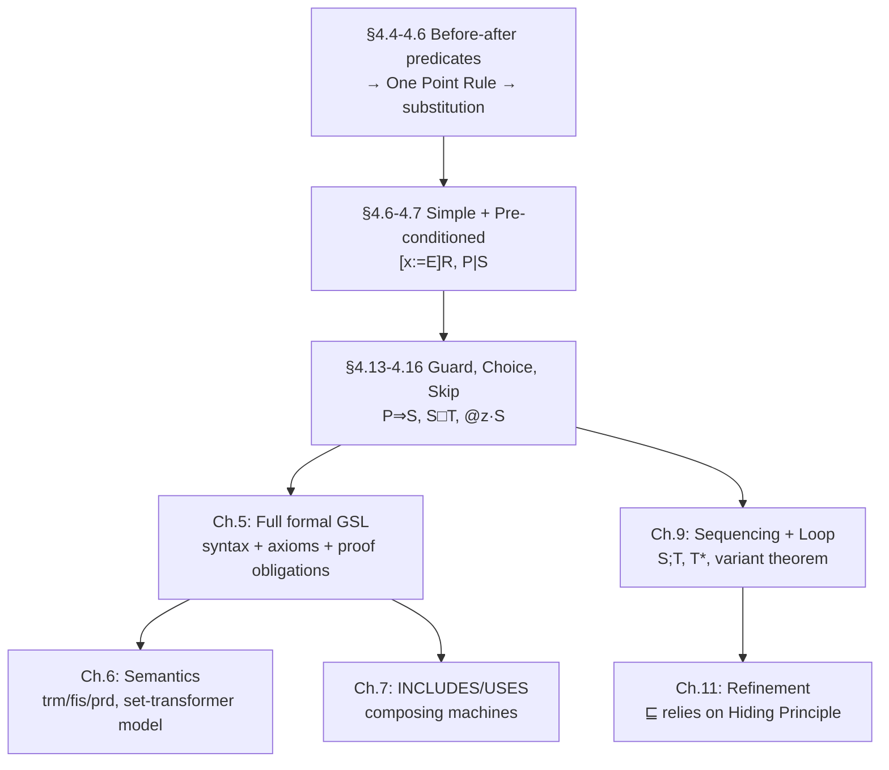

[[book-guidelines|↩ Back to guidelines]]

# Abstract Machines and the Generalized Substitution Language

## From proving predicates to specifying programs

Chapters 1–3 built a proof theory and a mathematical universe (sets, relations, functions, fixpoints) rich enough to state and prove anything. This chapter turns that machinery toward a genuinely new problem: **specifying software**, not just doing mathematics. The pivot is Dijkstra's weakest-precondition technique — every construct in the notation that follows gets its meaning defined as "the condition under which this construct, whatever it does operationally, is guaranteed to establish a given post-condition $R$." Nothing here is executed or tested; everything here is *proved*. This is the discipline a Hoare-logic verifier's core has to implement, watched being built for the first time from nothing.

Two design choices are worth flagging immediately because they shape everything downstream:

1. **No sequencing, no loops — yet.** The notation deliberately stops short of being a full programming language. Sequencing and loops belong to the *how* (Chapter 9); this chapter is entirely about the *what*. This separation — a pure specification calculus, provably prior to and independent of any control-flow calculus — is the same discipline that separates a verification condition's *logical content* from the *operational semantics* used to generate it: you want the meaning of "this operation establishes $R$" to be stable before you ever start asking how a sequence of such operations composes.
2. **The abstract machine as the unit of encapsulation.** A machine bundles state (`VARIABLES`) with the only sanctioned way to touch it (`OPERATIONS`), enforced by the **Hiding Principle**: no external party can read or write the state directly. This one principle is what makes the entire [[Refinement-Theory|refinement theory]] of Chapter 11 possible — you can freely change *how* a machine represents its state, as long as its operations still behave the same way from the outside, precisely because nothing outside was ever allowed to depend on the representation.

---

## 1. The pocket-calculator model: statics and dynamics

Every software system, however large, is modeled as *state plus operations that modify it* — Abrial's own image is a pocket calculator: an invisible memory (the **statics**, declared via `VARIABLES` and constrained via `INVARIANT`) and a set of keys (the **dynamics**, declared via `OPERATIONS`). This is not a simplification made for pedagogical convenience; it is the *entire* ontology the rest of the book builds on. A minimal machine:

```
MACHINE
    booking
VARIABLES
    seat
INVARIANT
    seat ∈ ℕ
END
```

The invariant is not optional decoration — it is required to carry enough conjuncts to *type* every variable (recall Chapter 2 §2's type-checking discipline: `seat ∈ ℕ` is simultaneously a semantic constraint and the thing that lets `seat` type-check at all), and, unlike a Z schema, the B-Method draws **no syntactic line between "typing conjuncts" and "other conjuncts"** — a design choice worth noting because it means the invariant is a single, undifferentiated logical object a proof obligation can freely reason about, rather than two separate artifacts (a signature and a constraint) that a checker has to reconcile.

---

## 2. Before-after predicates: the VDM/Z starting point, and why B abandons it

The most direct way to specify what an operation does is a **before-after predicate**: a formula relating pre-state variables to post-state variables (primed):

$$
\texttt{cancel} \;\widehat{=}\; seat' = seat + 1 \qquad\qquad \text{or, non-deterministically: } seat' > seat
$$

This is precisely the VDM/Z convention, and it's the most literal encoding of a Hoare-triple's *relational* content — a before-after predicate over $(seat, seat')$ *is* a relation in exactly Chapter 2's Relational Calculus sense. The **Proof Obligation** for invariant preservation, stated directly in before-after form, is:

$$
seat \in \mathbb{N} \;\Rightarrow\; \forall seat' \cdot (seat' = seat + 1 \Rightarrow seat' \in \mathbb{N})
$$

This is completely correct but has two structural annoyances: an explicit universal quantifier over the primed variable, and an explicit reference to the "after" name `seat'` that a Predicate-Calculus proof then has to instantiate away. Abrial's move — apply the **One Point Rule** from §1.4 directly — collapses this quantifier mechanically:

$$
\forall x \cdot (x = E \Rightarrow P) \;\Leftrightarrow\; [x{:=}E]P \qquad\text{(since }seat'\text{ is non-free in }seat+1\text{)}
$$

$$
seat \in \mathbb{N} \;\Rightarrow\; [seat := seat+1](seat \in \mathbb{N})
$$

**This single substitution is the entire pivot of the chapter.** It's the concrete, worked instance — promised back in Chapter 1's discussion of the One Point Rule — of exactly how a before-after-predicate style specification becomes a substitution-based one. From this point forward the book never writes another before-after predicate; every operation is a **generalized substitution**, and "generalized substitution" is defined recursively, entirely in terms of what it does to a post-condition $R$ under the operator $[S]R$ ("the weakest condition under which $S$ establishes $R$").

```rust
// The One Point Rule collapse as an executable rewrite — this is exactly
// the "substitute instead of quantify" move a VC generator performs when
// turning an assignment statement into a predicate transformer.
fn wp_assign(invariant: impl Fn(&State) -> bool, var_update: impl Fn(&State) -> State)
    -> impl Fn(&State) -> bool
{
    // wp(x := E, I) = I[x := E]  — no ∀x'. captured, just substitute.
    move |s: &State| invariant(&var_update(s))
}
```

```lean
-- The general pattern — "prove P holds of the updated state" reduces to
-- "prove [x := E]P", no quantifier — is the same simplification a symbolic
-- executor performs at every assignment node: substitute into the path
-- condition/postcondition rather than universally quantifying over a
-- fresh SSA-style variable and then instantiating it back out.
```

---

## 3. The Generalized Substitution Language, construct by construct

Every GSL construct is defined by how it transforms a post-condition $R$ into the **weakest pre-condition** under which the substitution guarantees $R$ — written $[S]R$. This is Dijkstra's `wp` calculus, rebuilt from the ground up and connected, construct by construct, to the proof-theoretic machinery of Chapters 1–3.

### 3.1 Simple substitution — the base case

$$
[x := E]R \;\widehat{=}\; [x{:=}E]R \qquad\text{(the Chapter 1 substitution, reused verbatim as the semantic definition)}
$$

The identity of *syntactic substitution* (Chapter 1's $[x{:=}E]P$) and *the weakest-precondition semantics of assignment* is not a coincidence or an abuse of notation — it's the entire point of having built substitution so carefully, with capture-avoidance, back in Chapter 1. The language's operational primitive and its logical primitive are, by design, the *same object*.

### 3.2 Pre-conditioned substitution — separating "crashes" from "does nothing useful"

An operation like `book` (decrement `seat`) is only meaningful when `seat > 0`. The **pre-conditioned substitution**, $P \mid S$ (`PRE P THEN S END`), is defined:

$$
[P \mid S]R \;\widehat{=}\; P \land [S]R
$$

Outside $P$, $[P\mid S]R$ is false for *every* $R$ — this substitution is said to be **non-terminating** ("crashes"): it cannot be relied on to establish anything at all once its precondition fails, which is exactly the semantics of undefined behavior in an unchecked language, made explicit and provable rather than left as a silent gap. The corresponding proof obligation gains an extra hypothesis:

$$
I \land P \;\Rightarrow\; [S]I \qquad\text{(reduces, e.g., to } seat\in\mathbb{N}\land 0<seat \Rightarrow seat-1\in\mathbb{N}\text{)}
$$

**This is Hoare-triple `{P ∧ I} S {I}` in every respect except notation.** $P\mid S$ is the direct ancestor of a function's `requires` clause in a refinement-type or contract-based verifier — a caller must discharge $P$ before the call is licensed, exactly the generous-style discipline discussed below.

### 3.3 Guarded substitution — the crucial dual of pre-condition

$$
[P \Rightarrow S]R \;\widehat{=}\; P \Rightarrow [S]R
$$

The distinction between $P\mid S$ and $P \Rightarrow S$ is one of the sharpest and most consequential points in the chapter, and it maps onto a distinction the compiler/verifier project will need constantly:

| | $P \mid S$ (pre-condition) | $P \Rightarrow S$ (guard) |
|---|---|---|
| To establish $R$ | must **prove** $P$ | may **assume** $P$ |
| If $P$ fails | establishes *nothing* — "crash," undefined | establishes *anything* — "non-feasible," vacuously OK |
| Caller's obligation | discharge $P$ before calling | none — the substitution absorbs $P$ as a hypothesis |

**Non-[[Semantics-of-Generalized-Substitutions#Feasibility|feasibility]] (guard failing) is the semantic home of dead-code / unreachable-path reasoning**: a guard `P ⇒ S` where `P` is false at some program point makes that branch vacuously "establish anything" — precisely what licenses an SMT-based reachability analysis to discard an infeasible path without further obligation, in contrast to a failed precondition, which represents a genuine specification violation the caller must be blamed for. Confusing these two in a verifier's IR is a real correctness bug class: treating a guard failure as a precondition violation over-reports errors on genuinely unreachable code; treating a precondition failure as a guard silently masks real contract violations.

### 3.4 Bounded and unbounded choice — the two flavors of non-determinism

**Bounded choice** ($S \Box T$, `CHOICE S OR T END`):

$$
[S \Box T]R \;\Leftrightarrow\; [S]R \land [T]R
$$

read: "whichever of $S, T$ a future implementer picks, it must establish $R$." This is the specification-level ancestor of a refinement type's disjoint-case verification, or of a nondeterministic automaton's "all paths must be safe" semantics.

**Unbounded choice** ($@z \cdot S$, `ANY z WHERE P THEN S END`):

$$
[@z \cdot S]R \;\widehat{=}\; \forall z \cdot [S]R \qquad\qquad [\texttt{ANY } z \texttt{ WHERE } P \texttt{ THEN } S \texttt{ END}]R \;\widehat{=}\; \forall z \cdot (P \Rightarrow [S]R)
$$

generalizing the conjunction of bounded choice to a universal quantifier over an *unbounded* range of implementer choices — this is a weaker, un-pre-conditioned cousin of Carroll Morgan's *specification statement*, and it's the formal home of "pick any value satisfying this property, I don't care which, but the rest of the proof must work for all of them." The derived `x :∈ E` ("becomes a member of") sugar — $x :\in E \;\widehat{=}\; \texttt{ANY } z \texttt{ WHERE } z \in E \texttt{ THEN } x := z \texttt{ END}$ — is exactly how the book specifies non-deterministic initialization (`table :∈ INDEX → VALUE`) or search results (`index :∈ table⁻¹[{value}]`) without committing to *which* satisfying value gets chosen — a direct notational cousin of existential witness extraction in a constraint solver: "some value satisfying this constraint exists and gets bound," with the choice of *which* one left entirely to the implementer/solver.

### 3.5 Skip and derived conditionals

$$
[\texttt{skip}]R \;\widehat{=}\; R \qquad\qquad \texttt{IF } P \texttt{ THEN } S \texttt{ ELSE } T \texttt{ END} \;\widehat{=}\; (P\Rightarrow S)\;\Box\;(\lnot P \Rightarrow T) \qquad\qquad \texttt{IF } P \texttt{ THEN } S \texttt{ END} \;\widehat{=}\; \texttt{IF } P \texttt{ THEN } S \texttt{ ELSE skip END}
$$

The full conditional is deliberately *not* a primitive — it's manufactured from guard + choice + skip, following the same minimization discipline as Chapters 1–3 (fewest primitives, everything else derived and provably equivalent). This matters for a verifier's own IR design: if `if/then/else` desugars cleanly into guard-and-choice, a checker only needs to get $wp$ right for the two primitives, and the conditional's soundness comes for free.

```rust
// The GSL constructs as a small predicate-transformer interpreter —
// this is literally what a Hoare-logic VC generator's core loop computes.
enum Subst {
    Assign(String, Expr),
    Pre(Pred, Box<Subst>),          // P | S
    Guard(Pred, Box<Subst>),        // P => S
    Choice(Box<Subst>, Box<Subst>), // S [] T
    Any(String, Box<Subst>),        // @z . S
    Skip,
}

fn wp(s: &Subst, r: &Pred, env: &Env) -> Pred {
    match s {
        Subst::Assign(x, e) => r.substitute(x, e),                 // §3.1
        Subst::Pre(p, s) => p.clone().and(wp(s, r, env)),          // §3.2 — MUST prove p
        Subst::Guard(p, s) => p.clone().implies(wp(s, r, env)),    // §3.3 — MAY assume p
        Subst::Choice(s, t) => wp(s, r, env).and(wp(t, r, env)),   // §3.4 bounded
        Subst::Any(z, s) => Pred::ForAll(z.clone(), Box::new(wp(s, r, env))), // §3.4 unbounded
        Subst::Skip => r.clone(),                                   // §3.5
    }
}
```

---

## 4. Generous versus defensive specification style

Given a book/cancel pair that can fail (booking past capacity), two disciplines are possible:

- **Generous style**: the pre-condition depends on state ($nbr \le seat$), and the operation is *not* internally protected — calling it outside its pre-condition is the caller's fault, full stop. The caller needs an *inquiry operation* to check state before calling, and the proof burden ("did you call this correctly?") lives entirely at the call site.
- **Defensive style**: the pre-condition is state-independent (or trivial), and the operation instead *reports* success/failure internally (`report <— book(nbr)`, returning `good`/`bad`), absorbing the failure case into ordinary control flow rather than into a proof obligation on the caller.

Abrial states a clear preference for generous style as "more in the spirit of the constructive method," reserving defensive style for genuinely unknown future limitations (e.g. an unspecified buffer capacity that only the eventual implementation will fix). **This maps directly onto two different verification architectures a compiler/elaborator has to choose between for every fallible operation:**

- Generous ≈ a `requires`-clause / refinement-type discipline where the *caller* must statically discharge the precondition (a failed obligation is a compile-time verification error) — the load-bearing choice for anything the elaborator wants to prove *statically*, once and for all, at the call site.
- Defensive ≈ a `Result`/`Option`-return discipline where failure is pushed into the *value domain* and checked (or ignored) at runtime — appropriate exactly when the failure boundary genuinely can't be known ahead of time (buffer sizes, external resource limits), which is precisely Abrial's stated exception case.

Recognizing which discipline a given operation calls for — rather than defaulting to one everywhere — is itself a design decision a refinement-type system's frontend has to make explicit, and this section is the cleanest statement of the tradeoff you'll find pre-dating the modern `Result<T,E>` vs. `requires`-contract debate by decades.

---

## 5. Parameterization, initialization, and contextual information

- **Machine parameters** are either scalars or finite non-empty sets (sets written in upper case by convention), constrained via a `CONSTRAINTS` clause. `minint`, `maxint`, and the derived `INT`/`NAT`/`NAT1` intervals are the book's built-in bounded-integer vocabulary — worth noting because **every manipulable set in this framework is finite** (a consequence flagged again in Chapter 5): there is no direct way to declare a variable of type $\mathbb{N}$ or $\mathbb{Z}$ unbounded, only bounded intervals or given (finite) sets. This is a real, deliberate restriction with implementability in mind — a variable that could range over all of $\mathbb{N}$ has no representable machine encoding, so the specification language simply refuses to let you write one.
- **`INITIALIZATION`** assigns starting values via a (possibly non-deterministic) substitution, subject to the same "must establish the invariant" proof obligation as any operation — initialization is not special-cased logically, only syntactically.
- **Input/output parameters** on operations (`book(nbr)`, `value ← access(index)`) are ordinary variables distinct from the state, with the *only* structural requirement being distinctness — parameterized operations are explicitly **not** promoted to the status of "procedures": an implementer is free to compile one as a real procedure call or inline its body, because nothing in the specification's meaning depends on that choice.
- **`SETS`/`CONSTANTS`/`PROPERTIES`**: given sets are either *enumerated* (explicit element list) or *deferred* (unspecified but finite and non-empty, instantiated later per Chapter 12); distinct given sets and machine-parameter sets are *always independent types* — no predicate anywhere may assert one is a subset of or equal to another. Constants are declared in `CONSTANTS`/`PROPERTIES` exactly parallel to variables in `VARIABLES`/`INVARIANT`, but with one structurally important asymmetry: **constants are not subject to the Hiding Principle.** They're visible outside the machine and can only ever be *given final values* (Chapter 12), never refined the way variables can — the type-vs-value distinction shows up again here as a visibility distinction, not merely a syntactic one.
- **Relational overriding as assignment sugar**: `r(x) := E` desugars to $r := r \mathbin{\lhd\!\!+} \{x \mapsto E\}$ — this is Chapter 2's overriding operator, reused verbatim as the semantics of updating one entry of a state variable that happens to be a function (an array, a map, a partial record). Recognizing this desugaring means a "mutable map update" in a specification is never a new primitive to reason about — it's ordinary relational algebra whose properties (from Chapter 2's catalogue) transfer immediately.
- **`ASSERTIONS`**: predicates *provably deducible* from `INVARIANT`/`PROPERTIES`, entered as extra proof hypotheses without needing their own preservation proof — a pure "lemma cache" for easing later proof obligations, structurally identical to a verifier caching a derived fact so downstream VCs don't have to re-derive it from scratch.
- **`DEFINITIONS`**: pure textual macros (possibly parameterized), applied uniformly regardless of clause order — the specification-language equivalent of a preprocessor, with no semantic weight of its own, used purely to keep large specifications readable (the chapter's data-base example uses definitions like `MARRIED = dom(husband ∪ wife)` to keep operation bodies legible).

---

## Where this leads



This chapter is deliberately informal — "practical and semi-formal," in Abrial's own words — with the complete formal apparatus (full syntax, type-checking, axioms per construct, the canonical proof-obligation scheme) deferred to Chapter 5, and the deep semantic theory ([[Semantics-of-Generalized-Substitutions#Termination|termination]] `trm`, feasibility `fis`, the set-transformer model connecting `wp` back to ordinary relations) deferred to Chapter 6. What's load-bearing here, for the compiler/elaborator/verifier project, is the *vocabulary and the intuition*: pre-condition vs. guard as two genuinely different failure semantics (a caller obligation vs. a vacuous-truth escape hatch), generous vs. defensive as two different verification architectures, and the Hiding Principle as the property that makes refinement — swapping an implementation without changing observable behavior — a coherent thing to even attempt. Every one of these ideas resurfaces, formalized, in the next three chapters, and every one of them has a direct analogue in the refinement-type / Hoare-logic verifier the learning goals describe: `requires`/`ensures` contracts are $P\mid S$; guard-based dead-path elimination is $P \Rightarrow S$; non-deterministic witness search (`x :∈ E`) is existential constraint solving; and the Hiding Principle is exactly what justifies a compiler optimizing a data representation without re-verifying every client.

---

*Style/goals config applied: `vaults/.article-style.md` (workbench-wide — Rust primary for the predicate-transformer interpreter sketch, Lean for the VC-generator framing, Mermaid for the structural diagram) and `vaults/.learning-goals.md` (workbench-wide — emphasis on Hoare logic, weakest preconditions, contract-based verification (requires/ensures), and the precondition/guard distinction load-bearing for a CHC/VC-generation pipeline). No book-specific style or goals file exists for this book.*
