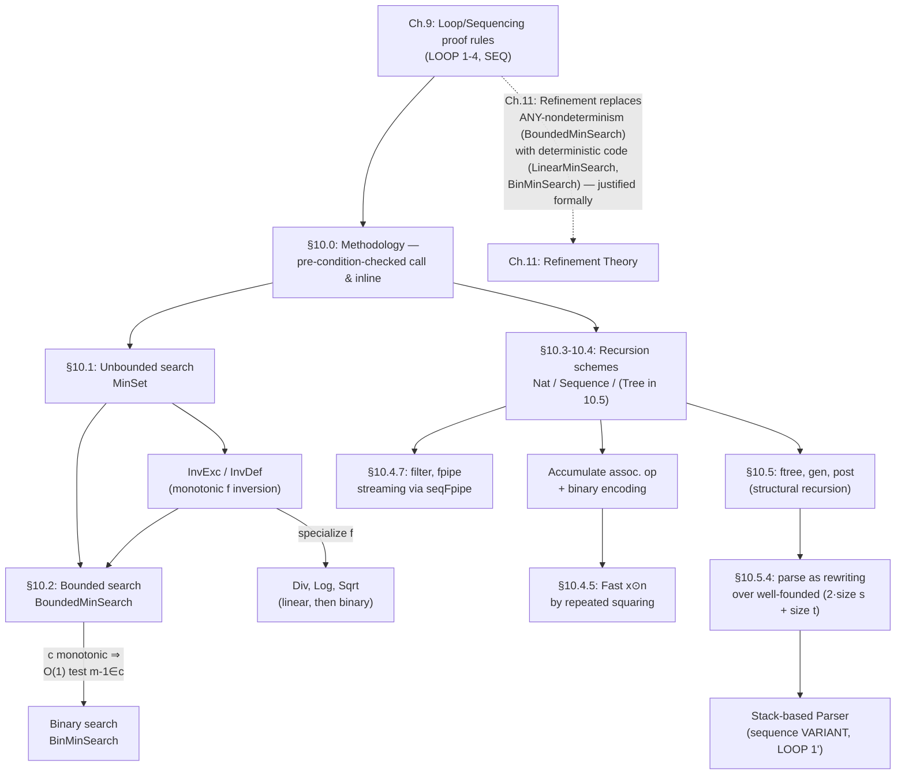

# Algorithm [[Fixpoint-Construction-and-Induction#Construction|Construction]] Methodology

[[book-guidelines|↩ Back to guidelines]]

## Why this chapter exists

Chapter 9 gave you the *proof rules* for loops and sequencing — `LOOP 1`
through `LOOP 4`, the invariant/variant discipline, the sequencing rule. Those
rules tell you how to check that a given loop is correct. They do not tell you
how to *find* the loop in the first place, and they certainly don't tell you
how to avoid re-deriving the same argument twenty times for twenty superficially
different problems (division, logarithm, square root, binary search, sorting a
sequence, parsing an expression — these all "feel" like the same shape of
problem, but naively they'd each cost you a full invariant/variant proof from
scratch).

Chapter 10 is Abrial's answer: a *methodology* for algorithm construction that
treats "having proved an algorithm once" as a reusable asset. The chapter's
own framing is worth stating up front, because it explains why the exposition
looks the way it does:

> "The intention, with each of these examples, is not to present the most
> clever or efficient algorithm corresponding to a given problem. Rather, the
> aim is to show that each algorithm development could be performed as a
> coordinate activity, having strong connections with other algorithm
> developments."

This is not a "design patterns for algorithms" cookbook in the informal sense.
Every reuse step is a formal proof obligation, discharged by the machinery of
Chapter 9. The payoff is that once you've proved `MinSet` — "increment `r`
until it hits the minimum of a set" — correct, you get natural-number
division, integer logarithm, and integer square root essentially for free, by
*instantiation*, not by re-proving a loop each time.

**What breaks without this discipline:** without a formal notion of "calling"
a proved algorithm inside a new pre-condition, you'd have two bad options.
Either you inline the previous proof by hand every time (tedious, error-prone,
and it obscures the real relationship between the two problems), or you treat
correctness of library functions as an informal, trust-me affair (which is
exactly the gap that turns "verified" software into software with unverified
seams). The B-Book's answer is closer to how a real verified-software toolchain
has to work: a callee's contract (pre/post-condition) is a first-class proof
object, and calling it correctly is itself a checked proof step — not folklore.

---

## 1. Re-use of proved algorithms via pre-condition-checked calls

### The problem in its bare form

Suppose you've already built and proved an algorithm `alpha`, presented as an
"operation" of a variable-free abstract machine:

$$
r \leftarrow \mathit{alpha}(i) \;=\; \mathbf{PRE}\; P(i)\; \mathbf{THEN}\; S(r,i) \;\mathbf{END}
$$

together with a proved property of the form

$$
\forall i \cdot \big(P(i) \Rightarrow [r \leftarrow \mathit{alpha}(i)]\,(r = f(i))\big) \tag{1}
$$

Read $[r \leftarrow \mathit{alpha}(i)]\,(r = f(i))$ as "after running this
substitution, the postcondition $r = f(i)$ holds" — this is the weakest
precondition notation from earlier chapters, specialized to substitutions.

Now you're building a *new* algorithm `beta`, and you notice — this is the
creative, non-formal step — that `beta`'s target function $g$ is related to
`alpha`'s target function $f$ by

$$
Q(j) \Rightarrow g(j) = f(E) \tag{2}
$$

for some expression $E$ depending on $j$ (but not on $r$, $i$, $s$). The
natural thing to do is write `beta` as a call to `alpha`:

$$
s \leftarrow \mathit{beta}(j) \;=\; \mathbf{PRE}\; Q(j)\; \mathbf{THEN}\; s \leftarrow \mathit{alpha}(E) \;\mathbf{END}
$$

### The one thing you actually have to prove

Expanding the call and using (1), Abrial shows the whole obligation
$Q(j) \Rightarrow [s \leftarrow \mathit{alpha}(E)](s = f(E))$ collapses to a
single residual conjecture:

$$
Q(j) \Rightarrow P(E) \tag{4}
$$

That's it. **You do not re-prove anything about `alpha`'s internals.** You
only prove that `beta`'s pre-condition, instantiated at the actual argument
$E$, implies `alpha`'s pre-condition. This is exactly what a type-and-effect
checker does at a call site — check the callee's `requires` clause is implied
by what's known at the call, then treat the callee as an opaque black box that
delivers its `ensures` clause. Once (4) is discharged, the book allows you to
**inline** the (now-redundant) pre-condition and rewrite `beta` as the literal
in-lined text of `alpha`'s body — at which point `beta` becomes just as
"specializable" as `alpha` was, and the process iterates. This is the engine
that drives the entire chapter: a growing library of proved loop bodies,
each specialization inheriting correctness by pre-condition implication
rather than by re-proof.

**Grounding (Rust).** This is precisely a `requires`/`ensures` contract check
at a call boundary — the kind of thing tools like Prusti or Creusot check
mechanically:

```rust
// alpha: contract is "pre P(i) implies post r == f(i)"
#[requires(p(i))]
#[ensures(result == f(i))]
fn alpha(i: u64) -> u64 { /* proved once */ }

// beta reuses alpha's proof by satisfying alpha's precondition
// at the call site with e = big_e(j)
#[requires(q(j))]
#[ensures(result == g(j))]     // discharged via g(j) == f(big_e(j))
fn beta(j: u64) -> u64 {
    let e = big_e(j);
    // Obligation (4): q(j) ==> p(e).  This is the ONLY new proof.
    alpha(e)
}
```

The verifier never re-examines `alpha`'s loop; it only checks that `beta`'s
precondition, pushed through `big_e`, discharges `alpha`'s precondition. This
is exactly obligation (4).

**Grounding (Lean).** In a dependently-typed setting the "call" is a term
application and the residual proof obligation is a literal proof term you must
supply:

```lean
-- alpha carries its correctness proof in its type
def alpha (i : Nat) (h : P i) : {r : Nat // r = f i} := ...

-- beta must produce a proof of `P (E j)` to legally call alpha
def beta (j : Nat) (hq : Q j) : {s : Nat // s = g j} :=
  have hp : P (E j) := proof_of_obligation_4 hq   -- <- the ONLY new work
  let r := alpha (E j) hp
  ⟨r.1, by rw [r.2]; exact g_eq_f_E hq⟩
```

The elaborator forces you to supply `hp : P (E j)` — you cannot call `alpha`
without it, which is the formal mirror of "pre-condition checked call."

**Where this matters for a verifier/elaborator project:** this is the
soundness argument for treating *any* previously-checked function as a trusted
black box at a call site — it's [[Set-Theory-and-the-Relational-Calculus#The mechanism|the mechanism]] that makes modular verification
possible at all, rather than requiring whole-program re-verification on every
change.

---

## 2. Unbounded search for a minimum

### First principles

You want a substitution establishing $r = \min(c)$ for a non-empty set $c
\subseteq \mathbb{N}$. Two elementary facts about `min` (proved earlier, in
§3.5.3) do all the work:

- **Condition 1:** $r \in c \Rightarrow r \geq \min(c)$
- **Condition 2:** $\min(c) \in c$

Chaining these: if $r \in 0..\min(c)$ *and* $r \in c$, then necessarily $r =
\min(c)$ (Condition 3). That's the exit condition of a loop that starts at 0
and increments $r$ while $r \notin c$:

$$
r := 0;\ \mathbf{WHILE}\ r \notin c\ \mathbf{DO}\ r := r+1\ \mathbf{INVARIANT}\ r \in 0..\min(c)\ \mathbf{VARIANT}\ \min(c)-r\ \mathbf{END}
$$

This is **Algorithm 10.1.1**, `MinSet(c)`. Every proof obligation from
`LOOP 1` is genuinely easy here — e.g. the invariance step needs "$r \notin c
\Rightarrow r \neq \min(c)$", which follows immediately from Condition 2 (the
book notes this is the *only* place Condition 2 is used). A variant, `MinSetMin(c,a)`,
lets you start from a known lower bound $a \leq \min(c)$ instead of 0 — the
same loop, shifted.

**What breaks without unbounded search:** you cannot yet exploit any structure
of $c$ (like monotonicity) — that's Bounded Search's whole point (§3 below).
Unbounded search is the fallback that works for *any* non-empty subset of
$\mathbb{N}$, at the cost of possibly $O(\min(c))$ steps.

### The payoff: natural-number function inversion, "for free"

Here's where re-use (§1) kicks in hard. Given a strictly monotonic $f : \mathbb{N} \to \mathbb{N}$, define its inverse **by excess** and **by defect**:

$$
e = \{r \mid p \leq f(r)\}, \qquad d = \{r \mid p < f(r+1)\}
$$

Both $e$ and $d$ are non-empty subsets of $\mathbb{N}$ (monotonicity of $f$
guarantees this), so `InvExc(f,p)` and `InvDef(f,p)` are *literally* calls to
`MinSet` — the pre-condition-implication obligation (4) is trivial here since
$e, d \in \mathcal{P}_1(\mathbb{N})$ falls straight out of $f$'s monotonicity.
Inlining and simplifying the guard (`LOOP 3`) yields:

$$
r := 0;\ \mathbf{WHILE}\ f(r) < p\ \mathbf{DO}\ r := r+1\ \mathbf{END}
$$

Specialize $f = \mathrm{mult}(b)$ and you get **natural-number division**;
specialize $f = \exp(x)$ and you get **integer logarithm**; specialize $f =
\mathrm{square}$ and you get **integer square root**. Three "different"
algorithms, one proof, three instantiations. This is the chapter's thesis made
concrete.

**Grounding (Rust).** The unbounded-search skeleton as a generic function over
any monotonic predicate:

```rust
/// Requires: exists r with f(r) >= p (monotonic f), guaranteed by caller.
fn min_set_by_excess(f: impl Fn(u64) -> u64, p: u64) -> u64 {
    let mut r = 0;
    while f(r) < p { r += 1 }
    r
}

fn nat_div(a: u64, b: u64) -> u64 {           // instantiate f = |n| b*(n+1)
    min_set_by_excess(|n| b * (n + 1), a)     // "InvDef(mult(b), a)"
}
fn int_sqrt(x: u64) -> u64 {                  // instantiate f = |n| (n+1)^2
    min_set_by_excess(|n| (n + 1) * (n + 1), x)
}
```

The genuinely interesting content isn't the Rust — it's that all three
functions above share *one* correctness proof, parametrized over the
monotonic function argument; the pre-condition-implication obligations differ
but the loop invariant reasoning doesn't.

**Grounding (Python)**, quick sketch for comparing two sequences by finding
the first index where they disagree (Algorithm 10.1.3–10.1.5, `EqualSeq`) —
another unbounded-search instance, this time over an index set derived from
two sequences instead of a numeric inverse:

```python
def equal_seq(s, t):  # s, t terminated by a 0 sentinel
    n = 1
    while s[n] == t[n] and s[n] != 0 and t[n] != 0:
        n += 1
    return s[n] == t[n]
```

---

## 3. Bounded search, binary search, and the role of monotonicity

### From unbounded to bounded

Suppose, instead of starting from 0, you already know $\min(c) \in a..b$ for
some $a, b$, and you can compare $\min(c)$ against arbitrary points of that
interval. The natural loop narrows an interval $[r,k]$ known to contain
$\min(c)$, choosing *any* midpoint $m \in (r+1)..k$ and shrinking either side:

$$
\mathbf{ANY}\ m\ \mathbf{WHERE}\ m \in (r{+}1)..k\ \mathbf{THEN}\ \mathbf{IF}\ \min(c) < m\ \mathbf{THEN}\ k := m-1\ \mathbf{ELSE}\ r := m\ \mathbf{END}\ \mathbf{END}
$$

This is `BoundedMinSearch` (Algorithm 10.2.1); its invariant is $r,k \in a..b
\wedge \min(c) \in r..k$, variant $k-r$. Notice it's *non-deterministic* — any
choice of $m$ in the interval works, and the proof doesn't care which. This
non-determinism is the design's whole point: it's a template with two
independent knobs (how you pick $m$, and how you test the comparison) that
different specializations fill in differently.

**Knob 1 — deterministic choice of $m$, giving linear search.** Choose $m =
r+1$ always. Then "$\min(c) < m$" reduces (via the loop invariant $r \le
\min(c)$) to "$r \in c$" — no reference to $\min(c)$ needed. This yields
`LinearMinSearch`, an $O(b-a)$ scan.

**Knob 2 — exploiting monotonicity of $c$, giving the fast comparison
test that binary search needs.** This is the crux of the whole
section, and it's worth stating carefully because it's easy to
under-appreciate: *why does binary search need monotonicity at all?*

Say $c$ is monotonic in the specific sense the book uses:

$$
\forall n \cdot (n \in c \Rightarrow n{+}1 \in c)
$$

("once you're in $c$, every larger number is too" — think of $c$ as
$\{n \mid p \le f(n)\}$ for a monotonic $f$, i.e. an "upward-closed tail" of
$\mathbb{N}$.) Then:

$$
m - 1 \in c \iff \min(c) \le m
$$

The book is careful to isolate *which half of this biconditional actually
needs monotonicity* — a subtlety worth sitting with:

- $m{-}1 \in c \Rightarrow \min(c) \le m$ holds **unconditionally**, for any
  set $c$ — it's immediate from the basic property of `min` (Condition 1).
- $\min(c) \le m \Rightarrow m{-}1 \in c$ is **false in general** — this is
  exactly where monotonicity is doing its job: it's what lets you conclude
  that everything from $\min(c)$ up to $m-1$, in particular $m-1$ itself, is
  still in $c$.

This answers the guidelines' key question directly: **monotonicity is what
turns "is $m$ above or below the target?" into a test you can compute in
$O(1)$ without knowing $\min(c)$ — namely, testing membership $m-1 \in c$
directly.** Without monotonicity you're stuck with the non-deterministic
`BoundedMinSearch` (or its deterministic-but-linear specialization); *with*
monotonicity, you can replace the oracle test $\min(c) < m$ by the computable
test $m-1 \in c$, and — critically — you're now free to choose $m$ to be the
*midpoint* $(r+1+k)/2$ instead of $r+1$, because nothing about the correctness
argument depended on which $m$ in the interval you picked. That single
substitution — same loop skeleton, same invariant, same variant $k-r$, only
the choice of $m$ changes from "linear step" to "midpoint" — is what turns
$O(n)$ linear search into $O(\log n)$ **binary search** (`BinMinSearch`,
Algorithm 10.2.7):

$$
\mathbf{WHILE}\ r \ne k\ \mathbf{DO}\ \mathbf{LET}\ m = \lfloor(r{+}1{+}k)/2\rfloor\ \mathbf{IN}\ \mathbf{IF}\ m{-}1 \in c\ \mathbf{THEN}\ k := m{-}1\ \mathbf{ELSE}\ r := m\ \mathbf{END}\ \mathbf{END}
$$

The variant $k - r$ halves (roughly) each iteration instead of decrementing by
1, which is where the logarithmic bound comes from — though notice the *proof
structure* (invariant $\min(c) \in r..k$, variant strictly decreasing) is
identical to linear search's; only the rate of decrease differs.

### Reconstructing classical algorithms as binary search instances

Because `InvExc`/`InvDef` from §2 compute the minimum of monotonic sets $e, d$
(monotonic *because* $f$ is monotonic), they are immediately eligible for the
`BinMinSearch` specialization — giving `BinDiv`, `BinLog`, `BinSqrt`: the same
three functions as before, now $O(\log n)$ instead of $O(n)$, obtained by
swapping which minimum-search primitive you call, with essentially no new
proof work. `BinaryClassifierInArray` (§10.2.7) reconstructs the textbook
"binary search over a sorted array" by extending a finite non-decreasing array
$s$ into an unbounded monotonic function and reusing `BinInvExc`/`BinInvDef`
verbatim.

**Grounding (Rust).** The monotonicity-exploiting predicate test, generic over
any monotonic membership oracle:

```rust
/// Requires c monotonic upward-closed tail with min(c) in a..=b.
fn bin_min_search(mut r: u64, mut k: u64, in_c: impl Fn(u64) -> bool) -> u64 {
    while r != k {
        let m = (r + 1 + k) / 2;
        if m > 0 && in_c(m - 1) { k = m - 1 } else { r = m }
    }
    r
}

fn bin_sqrt(x: u64) -> u64 {
    bin_min_search(0, x, |n| x <= n * n)   // c = {n | x <= n^2}, monotonic
}
```

This is a direct rendering of the "swap the O(1) test, keep the proof"
argument — `bin_min_search` never changes; only `in_c` changes across
`BinDiv`, `BinLog`, `BinSqrt`.

**Grounding (Lean).** In Lean's standard library, `Nat.log2` and binary-search
combinators over `Ord`/`LE` instances exploit exactly this fact: a
`Decidable`/monotone comparison replaces an existential witness search with a
computable bisection, and [[Semantics-of-Generalized-Substitutions#Termination|termination]] is proved by the same strictly
decreasing measure ($k - r$, or in Lean idiom, `WellFoundedRecursion` on the
interval width) — the *shape* of the well-founded descent argument here is the
same one you'll meet again in §7's parser termination proof.

---

## 4. Recursive schemes on natural numbers, sequences, and trees

The book treats "recursion scheme → loop" as a single mechanical transform,
applied uniformly across three inductively defined domains.

### Natural numbers (§10.3)

Given $a \in s$ and $g : s \to s$, the recursion $f(0) = a,\ f(n{+}1) = g(f(n))$
becomes `RecNat(a,g,n)` — accumulate $r$ from $a$, apply $g$ $n$ times:

$$
r,k := a,0;\ \mathbf{WHILE}\ k<n\ \mathbf{DO}\ r,k := g(r),k{+}1\ \mathbf{END}
$$

with invariant $k \in 0..n \wedge r = f(k)$. **Natural-number
exponentiation** is the first instance: $a=1$, $g = \mathrm{mult}(x)$.

The scheme is then generalized (`ExtendedRecNat`) to recurrences of the form
$f(n{+}1) = g(f(n),n)$ — where the step also needs the *index*, not just the
previous value. Abrial handles this cleanly by defining an auxiliary function
$ff(n) = (f(n), n)$ that *does* fit the basic scheme, proving $ff$ well-defined
by ordinary induction, then projecting. This "pair up with the index to fit
the basic recursion shape" trick is itself worth remembering — it recurs
whenever you need an accumulator that depends on position, e.g. summing a
sequence or computing a factorial by right recursion.

### Sequences (§10.4.1, §10.4.6)

Two dual schemes, mirroring right- vs. left-fold:

$$
f([\,]) = a,\quad f(s \frown x) = g(f(s),x) \qquad\text{(right recursion, `RightRecSeq`)}
$$
$$
f([\,]) = a,\quad f(x \to s) = h(x,f(s)) \qquad\text{(left recursion, `LeftRecSeq`)}
$$

Each becomes a loop scanning the sequence once, from the corresponding end,
accumulating into $r$. These are your `fold_left`/`fold_right`, formally
justified and immediately usable for **positional-notation decoding**
($\mathrm{num}_b$), **encoding**, and the accumulation of any associative
operator with a unit (§10.4.2) — which is itself the general scheme underlying
fast exponentiation (§5 below).

**Grounding (Rust).** These schemes are exactly `Iterator::fold`:

```rust
// RightRecSeq: f([]) = a, f(s ++ [x]) = g(f(s), x)
fn right_rec_seq<T, V>(a: V, g: impl Fn(V, T) -> V, s: Vec<T>) -> V {
    s.into_iter().fold(a, g)   // this literally *is* the loop invariant
}
```

### Trees (§10.5.1–10.5.2)

Formulae here are modeled as labelled binary trees `ftree`: a leaf `(a)` for
$a \in \mathrm{ATM}$, or an internal node `(f, o, g)` for $o \in \mathrm{OPR}$
and $f,g \in \mathrm{ftree}$ — the algebraic-data-type shape a functional
programmer would recognize immediately. Two recursive schemes appear:

- $\mathrm{post}((a)) = [a]$, $\mathrm{post}((f,o,g)) = \mathrm{post}(f) \frown
  \mathrm{post}(g) \frown [o]$ — postfix (Polish) flattening, unconditional
  structural recursion.
- $\mathrm{gen}$ — infix flattening with *minimal* bracketing, which
  recurses on the tree **and** consults a priority function
  $\mathrm{prit} : \mathrm{TOK} \to \mathbb{N}$ to decide whether each
  sub-formula needs parentheses (four cases, by the truth of $P = \mathrm{prif}(f) <
  \mathrm{prit}(o)$ and $Q = \mathrm{prit}(o) < \mathrm{prif}(g)$).

**Grounding (Lean)**, since this is a genuine inductive-type recursion:

```lean
inductive FTree where
  | leaf (a : Atom) : FTree
  | node (l : FTree) (o : Op) (r : FTree) : FTree

def post : FTree → List Tok
  | .leaf a   => [a]
  | .node l o r => post l ++ post r ++ [o]   -- structural recursion,
                                              -- accepted by Lean's kernel
                                              -- termination checker directly
```

`post` is exactly the shape Lean's equation compiler wants: structural
recursion on a strictly smaller subterm, no well-founded-recursion annotation
needed. `gen`, by contrast, still recurses structurally but *branches* on an
externally-supplied priority function — the recursion is structural, the
*case split* is what does the real work of deciding bracket placement.
Abrial proves `gen` is injective (Property 10.5.2, by induction on the tree,
with a supporting lemma about how `gen` output can be decomposed) — this is
the formal guarantee that "printing with minimal parentheses" doesn't lose
information, i.e. that the pretty-printer has a genuine left inverse. That
left inverse is exactly the parser built in §7.

---

## 5. Fast exponentiation by repeated squaring

### Generalizing beyond exponentiation

Rather than deriving fast exponentiation in isolation, Abrial derives a
*generic* fast-binary-operation scheme (§10.4.5) and gets exponentiation,
multiplication, matrix power, and relation-iterate as four instances of the
same proof.

Let $\odot$ be a binary operation (left operand ranges over some set, right
operand a natural number, e.g. "multiply by," "raise to the power," "compose
$n$ times"). Assume three algebraic laws:

$$
x \odot (a+b) = (x \odot a) \oplus (x \odot b) \qquad\text{(Rule 1, "almost distributes over $+$")}
$$
$$
x \odot (a \times b) = x \odot a \odot b \qquad\text{(Rule 2, "almost associative")}
$$
$$
x \odot 1 = x \qquad\text{(Rule 3, unit)}
$$

Given the binary representation of $n$ (built earlier in the chapter via
`Encode`/`denum₂` — itself a `LeftRecSeq₁` instance): $n = \sum_i d_i \cdot
2^i$, Rule 1 splits $x \odot n$ into a $\oplus$-combination of $x \odot (d_i \cdot
2^i)$ terms; Rule 2 turns each $2^i$-th power into $i$ applications of "square
and combine." Defining $a_i = x \odot 2^{i-1}$ gives the squaring recurrence
$a_1 = x,\ a_{i+1} = a_i \odot 2$, and the whole computation becomes:

$$
x \odot n = (a_p \odot d_p) \oplus \cdots \oplus (a_1 \odot d_1)
$$

Specializing $(\odot, \oplus) = (\text{multiplication}, \text{addition})$
gives fast multiplication; $(\odot,\oplus) = (\text{exponentiation},
\text{multiplication})$ gives **`FastExponentiation`** (Algorithm 10.4.10):

$$
r,c,m := x^{n \bmod 2},\, x,\, n/2;\quad \mathbf{WHILE}\ m>0\ \mathbf{DO}\ r,c,m := r \times (c^2)^{m \bmod 2},\, c^2,\, m/2\ \mathbf{END}
$$

with (informally, from the general scheme's invariant) $c$ tracking the
running squared base and $r$ accumulating the product — this is
literally "repeated squaring," the standard $O(\log n)$-multiplication
algorithm, but arrived at as a *specialization instance* rather than derived
from scratch. The same instantiation table also yields fast **square-matrix
exponentiation** and fast **relation iteration** ($\odot = \text{iterate}$,
$\oplus = \text{composition}$) — this is the generic "fast power" that shows
up under `pow`/`checked_pow`/matrix-power routines in most standard libraries,
here recovered as one theorem with four readings.

**Grounding (Rust).** The generic scheme, parametrized over $\odot$ and
$\oplus$, then specialized:

```rust
fn fast_binary_op<T: Copy>(
    x: T, mut n: u64,
    odot: impl Fn(T, u64) -> T,   // x odot 2^k, computed by repeated squaring
    combine: impl Fn(T, T) -> T,  // the (oplus) combinator
    square: impl Fn(T) -> T,      // "odot 2" step: a_{i+1} = square(a_i)
    unit: T,
) -> T {
    let mut acc = unit;
    let mut base = x;
    while n > 0 {
        if n & 1 == 1 { acc = combine(acc, base); }
        base = square(base);
        n >>= 1;
    }
    acc
}

fn fast_pow(x: u64, n: u64) -> u64 {
    fast_binary_op(x, n, |b, _| b, |a, b| a * b, |b| b * b, 1)
}
```

This is `Iterator`-free but it is exactly the textbook `fast_pow` you'd write
by hand — the value of the derivation above isn't the code, it's that the
*same* skeleton, with `combine`/`square` swapped, is matrix exponentiation
(useful for computing linear recurrences like Fibonacci in $O(\log n)$) and
relation iteration (useful for computing $n$-step reachability in a graph —
directly relevant if you're building reachability analysis into a static
analyzer or CHC engine, since $n$-step reachability under a transition
relation $R$ is exactly $R^n$, computable in $O(\log n)$ matrix-style
compositions instead of $O(n)$ unrollings).

---

## 6. Filters and filter-pipes

### From `filter` to `filter-pipe`

A filter is a function $f : u \to \mathrm{seq}(u)$ — think "each input element
expands into zero or more outputs" — lifted to sequences by mapping and
flattening (`conc`, from §3.7.3):

$$
\mathrm{filter}(f)(s) = \mathrm{conc}(f \circ s), \qquad \mathrm{filter} \in (u \to \mathrm{seq}(u)) \to (\mathrm{seq}(u) \to \mathrm{seq}(u))
$$

This is `flat_map`/`concatMap` under a different name, and the book proves the
expected recursive characterization ($\mathrm{filter}(f)(s \frown t) =
\mathrm{filter}(f)(s) \frown \mathrm{filter}(f)(t)$) then implements it as a
`RightRecSeq` instance (Algorithm 10.4.14) — another re-use, §1's methodology
applied yet again.

A **filter-pipe** composes several filters: $\mathrm{fpipe}(sf) = \mathrm{comp}(\mathrm{filter} \circ sf)$
for a *sequence* of filters $sf$. Semantically this is just function
composition of the individual `filter(f_i)`'s. Operationally, though,
Abrial's real target isn't "what value does the pipe compute" — that's the
easy, purely functional half — it's **how do you compute it incrementally, one
element at a time, across all stages simultaneously**, rather than fully
materializing stage 1's entire output before starting stage 2. This is exactly
the guidelines' third Key Question, and it deserves a careful answer.

### Why interleaved evaluation, not staged composition

Naively you'd run filter 1 to completion, producing a full intermediate
sequence, then feed that to filter 2, and so on — a "batch pipeline." The book
instead builds `seqFpipe`, which threads a *sequence of small input buffers*
$ss$, one per stage, and defines the pipe's behavior by simultaneous recursion
on the filter-pipe and the buffer sequence:

$$
\mathrm{seqFpipe}([\,],[\,]) = [\,], \qquad \mathrm{seqFpipe}(sf \frown f,\, ss \frown s) = \mathrm{filter}(f)(s) \frown \mathrm{filter}(f)(\mathrm{seqFpipe}(sf,ss))
$$

The properties built on top of this (10.4.19 through 10.4.22) formalize the
picture the book draws: stage $i$ consumes *one* element from its buffer,
produces its filtered output, and appends that output to stage $i{+}1$'s
buffer — the rest of the pipe stays untouched during that step. The resulting
algorithm, `EvalFpipe` (Algorithm 10.4.15), maintains a stack-shaped invariant
over buffers `ss` and drains from the *last* non-empty stage outward:

```
WHILE k > 0 DO
  IF ss(k) = []                       -- stage k has no work: retreat
    THEN k := k - 1
  ELSIF k < size(ss)                  -- stage k has output ready for stage k+1
    THEN ss := ss <+ {k -> tail(ss(k)), (k+1) -> ss(k+1) ~ sf(k)(first(ss(k)))};
         k := k + 1
  ELSE                                 -- k is the last stage: emit
    r := r ~ sf(k)(first(ss(k)));
    ss(k) := tail(ss(k))
  END
INVARIANT ... r ~ seqFpipe(sf,ss) = fpipe(sf)(s) ...
VARIANT [size(ss)]  -- a *sequence* variant (LOOP 1')
```

**Why this matters, concretely, and why "just compose sequentially" is
wrong as an implementation strategy even though it's right as a specification:**
$\mathrm{fpipe}$ (function composition) is a perfectly good *specification* of
what the pipe computes — but computing it by literally running each stage to
completion before the next starts forces you to materialize every
intermediate sequence in full. `EvalFpipe`'s incremental, per-element
threading is the difference between a batch pipeline and a genuine *streaming*
pipeline: bounded per-stage buffering, and — crucially for anything with
side effects or unbounded/lazy inputs — the ability to interleave stages so
that a later stage can start consuming before an earlier stage has finished
producing. The invariant $r \frown \mathrm{seqFpipe}(sf,ss) = \mathrm{fpipe}(sf)(s)$
is exactly the proof that this eager, interleaved schedule computes the
*same* answer as the lazy specification — streaming and batch composition
agree extensionally, but only the streaming form is implementable without
unbounded intermediate storage.

**Grounding (Rust).** `filter`/`flat_map` and filter-pipe as iterator
composition:

```rust
fn filter_apply<T: Clone, F: Fn(&T) -> Vec<T>>(f: F, s: &[T]) -> Vec<T> {
    s.iter().flat_map(|x| f(x)).collect()
}
// A filter-pipe as a chain of adapters — Rust's iterator adapters
// are *already* lazily interleaved (pull-based), which is precisely
// the streaming discipline EvalFpipe proves correct by hand:
fn pipe<T: 'static>(
    stages: Vec<Box<dyn Fn(T) -> Vec<T>>>,
) -> impl Fn(Vec<T>) -> Vec<T> {
    move |input| stages.iter().fold(input, |acc, f|
        acc.into_iter().flat_map(|x| f(x)).collect())
}
```

Rust's `Iterator` chain (`.flat_map().flat_map()...`) is pull-based and lazily
interleaved by construction — it is the *executable* analogue of what
`EvalFpipe`'s stack-of-buffers invariant proves correct from first principles:
you never materialize a full intermediate `Vec` between stages when you chain
adapters directly instead of `.collect()`-ing between them.

---

## 7. Parsing as rewriting over a well-founded relation

### Setting up the problem

Given a formula — the minimally-bracketed infix flattening $\mathrm{gen}(f)$
of an `ftree` (see §4) — the parsing problem is to recover the postfix form
$\mathrm{post}(f)$, i.e. compute $\mathrm{gen}^{-1} \mathrm{;\ post}$, without
ever materializing $\mathrm{gen}^{-1}(f)$ as a tree first (that would defeat
the point of a linear, stack-based parser).

Abrial's strategy has three steps: (1) state the transformation as a system of
**rewriting rules** over pairs $(t,s)$ — an operator/bracket stack $t$ and a
remaining-input sequence $s$; (2) prove the rules genuinely define a
function, i.e. that rewriting *terminates* and reaches a unique normal form;
(3) turn the rules mechanically into a loop.

### The rewriting rules

$$
\begin{aligned}
\mathrm{parse}([\,],s) &= [\,] \\
\mathrm{parse}(t,[\,]) &= [\,] \\
\mathrm{parse}(t \frown l,\, r \to s) &= \begin{cases}
r \frown \mathrm{parse}(t \frown l,\, s) & \text{if } r \in \mathrm{ATM} \\
\mathrm{parse}(t \frown l \frown r,\, s) & \text{if } r = ( \\
\mathrm{parse}(t,s) & \text{if } l = (\ \wedge\ r = ) \\
\mathrm{parse}(t \frown l \frown r,\, s) & \text{if } \mathrm{prit}(l) < \mathrm{prit}(r) \\
l \frown \mathrm{parse}(t,\, r \to s) & \text{otherwise}
\end{cases}
\end{aligned}
$$

This is a shunting-yard algorithm's rewriting semantics stated with total
precision: $l$ is the top of the operator stack $t$, $r$ the next input token.
Atoms emit immediately; opening brackets push; a matching close-bracket pops
without emitting; a lower-priority stack-top is popped and emitted before the
new operator is pushed (case 6); otherwise the new operator is pushed on top
(case 7, the "otherwise" branch of an operator that binds *more* tightly than
what's already on the stack).

### Why "well-founded relation" and not simply "structural recursion"

Here's the point the guidelines' framing wants surfaced explicitly. This is
**not** structural recursion on a single inductively-defined argument (unlike
`post` or `gen` in §4, which decrease on the tree). The recursive calls above
sometimes shrink $t$ (case 5: popping the stack), sometimes shrink $s$ (cases
3, 4, 7: consuming input), and case 6 shrinks $t$ while leaving $s$ alone. No
single argument decreases on every call. What the book invokes instead is
the general well-founded recursion scheme of §3.11.3, applied to the
**lexicographic-style combined measure**

$$
2 \times \mathrm{size}(s_1) + \mathrm{size}(t_1) \;>\; 2 \times \mathrm{size}(s_2) + \mathrm{size}(t_2)
$$

— a single natural number built from *both* arguments, which strictly
decreases on every one of the six rewrite cases (check: cases 3/4/7 decrease
$\mathrm{size}(s)$ by 1 (weight 2), case 5 leaves $s$ untouched but decreases
$\mathrm{size}(t)$ by 2 (weight 1, so the $2s+t$ measure still strictly
drops since $t$ drops by 2 > the $\le 1$ that could be added elsewhere in that
step), case 6 decreases $t$ by 1 while $s$ is unchanged). This is precisely
*why* the chapter frames parsing under "recursion on well-founded sets"
(§3.11.3) rather than ordinary structural recursion: the natural termination
argument genuinely needs a measure combining two independently-varying
quantities, which is the hallmark of well-founded (as opposed to structural)
recursion.

Once termination and functional correctness are established — Property
10.5.3, $\mathrm{parse}([(],\, \mathrm{gen}(f) \frown [)]) = \mathrm{post}(f)$,
proved by tree induction on $f$ via two supporting lemmas about how `gen`'s
bracket-insertion interacts with the rewrite cases — the rules are "mimicked"
directly by a loop, **Algorithm 10.5.1**, `Parser(f)`:

```
o,t,s := [], [(], f <- );
WHILE s /= [] /\ t /= [] DO
  LET v,l,r,u BE v,l,r,u = front(t), last(t), first(s), tail(s) IN
    IF      r in ATM              THEN o,s := o <- r, u
    ELIF    r = (                 THEN t,s := t <- r, u
    ELIF    l = ( /\ r = )        THEN t,s := v, u
    ELIF    prit(l) < prit(r)     THEN t,s := t <- r, u
    ELSE                                o,t := o <- l, v
    END
  END
INVARIANT  o ~ parse(t,s) = post(gen^-1(f))
VARIANT    [size(s), size(t)]    -- a *sequence* variant: lexicographic descent
```

The variant here is explicitly a **sequence** `[size(s), size(t)]`, invoking
`LOOP 1'` (the sequence-variant form of the loop rule) rather than
`LOOP 1`'s single-natural-number variant — the loop rule itself is asked to
witness a lexicographic descent, mirroring exactly the two-argument
well-founded measure used to justify `parse`'s termination in the first place.
This is a shunting-yard parser (an explicit operator stack `t`, an output
accumulator `o`, and a priority comparison) derived and proved correct, not
asserted.

**Grounding (Rust).** A direct transcription — note how the stack-shape
mirrors the rewrite cases one-to-one:

```rust
enum Tok { Atom(char), Op(char), LParen, RParen }

fn parse(tokens: &[Tok], priority: impl Fn(&Tok) -> i32) -> Vec<Tok> {
    let mut out = Vec::new();
    let mut stack = vec![Tok::LParen];
    for r in tokens.iter().chain(std::iter::once(&Tok::RParen)) {
        loop {
            match (stack.last().unwrap(), r) {
                (_, Tok::Atom(_)) => { out.push(clone(r)); break; }
                (_, Tok::LParen)  => { stack.push(clone(r)); break; }
                (Tok::LParen, Tok::RParen) => { stack.pop(); break; }
                (l, _) if priority(l) < priority(r) => { stack.push(clone(r)); break; }
                _ => { out.push(stack.pop().unwrap()); }  // loop again: case 7 repeats
            }
        }
    }
    out
}
```

The `loop { ... break }` inner construct is exactly the case split of
`Parser`'s body; the outer `for` corresponds to the well-founded descent on
$\mathrm{size}(s)$, and the inner popping loop to the descent on
$\mathrm{size}(t)$ when $s$ doesn't shrink — the two components of the
sequence variant, made visible as two nested loops instead of one loop with a
pair-valued variant.

**Where this connects to the elaborator/prover project:** this section is a
worked example of exactly the proof obligation your project's `isDefEq` or
unification engine will face constantly — a recursive procedure whose
recursive calls don't decrease any single structural argument, requiring an
explicit well-founded measure (often a lexicographic pair, exactly as here) to
justify termination to a trusted kernel. Lean's own `termination_by`/`decreasing_by`
machinery exists precisely to let you supply such a measure when the
equation compiler's default structural-recursion detector fails — this
`parse` function is a textbook case where you'd reach for it:

```lean
def parse : List Tok → List Tok → List Tok
  | [], _ => []
  | _, [] => []
  | t :: ts, r :: rs =>
    if isAtom r then r :: parse (t :: ts) rs
    else if r == lparen then parse (r :: t :: ts) rs
    else if t == lparen && r == rparen then parse ts rs
    else if prio t < prio r then parse (r :: t :: ts) rs
    else t :: parse ts (r :: rs)
termination_by ts rs => (2 * rs.length + ts.length, 0)   -- the book's own measure
```

That the book's *hand-derived* combined measure $2 \cdot \mathrm{size}(s) +
\mathrm{size}(t)$ is exactly the kind of thing Lean's `termination_by` clause
expects you to supply is not a coincidence — both are solving the same
problem (justify a non-structurally-decreasing recursion to a trusted checker)
with the same tool (well-founded recursion on a synthesized natural-number
measure).

---

## Synthesis: where this fits and where it leads



Chapter 10 is deliberately positioned as a **bridge**: it takes the raw proof
machinery of Chapter 9 and shows it scaling to real algorithm design, while
quietly setting up Chapter 11. Notice that `BoundedMinSearch` is
*non-deterministic* (`ANY m WHERE...`), and both `LinearMinSearch` and
`BinMinSearch` are obtained from it by *reducing non-determinism* — a step the
chapter uses informally ("we shall justify formally our right to replace the
body of a loop by a less non-deterministic substitution... in section 11.1.4")
but explicitly defers to the next chapter's refinement relation. So Chapter 10
isn't just a worked-examples chapter; it's simultaneously a rehearsal, using
concrete and motivating cases, for the abstract partial order between
specifications and implementations that Chapter 11 formalizes as refinement.

**For the learning goals in play here:** the load-bearing idea to carry
forward is that *every* algorithmic speedup in this chapter — bounded vs.
unbounded search, binary vs. linear search, fast exponentiation vs. naive
repeated multiplication, streaming filter-pipes vs. batch composition — is
obtained by the same two-step pattern: (1) state a completely general,
possibly non-deterministic or inefficient scheme and prove it correct once;
(2) specialize by discharging a pre-condition-implication obligation (§1) or
by justifying a refinement (deferred formally to Ch. 11). That pattern —
prove the general scheme once, specialize by discharging a residual
obligation at each call site — is exactly the discipline a verified compiler
needs for treating library functions, and it is exactly what a bidirectional
elaborator's mode-checking discipline is doing when it checks a callee's
`requires` against a caller's known facts rather than re-deriving the callee's
whole proof. The well-founded-relation argument in §7 is, separately, a
direct rehearsal for justifying non-structural recursion to a trusted kernel —
precisely the situation a unification or elaboration engine's own recursive
procedures will be in.
