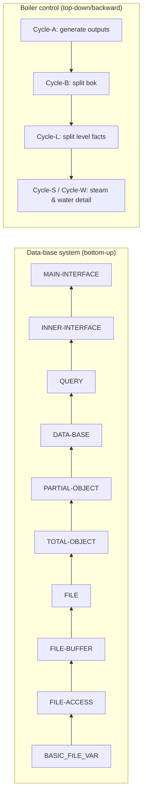
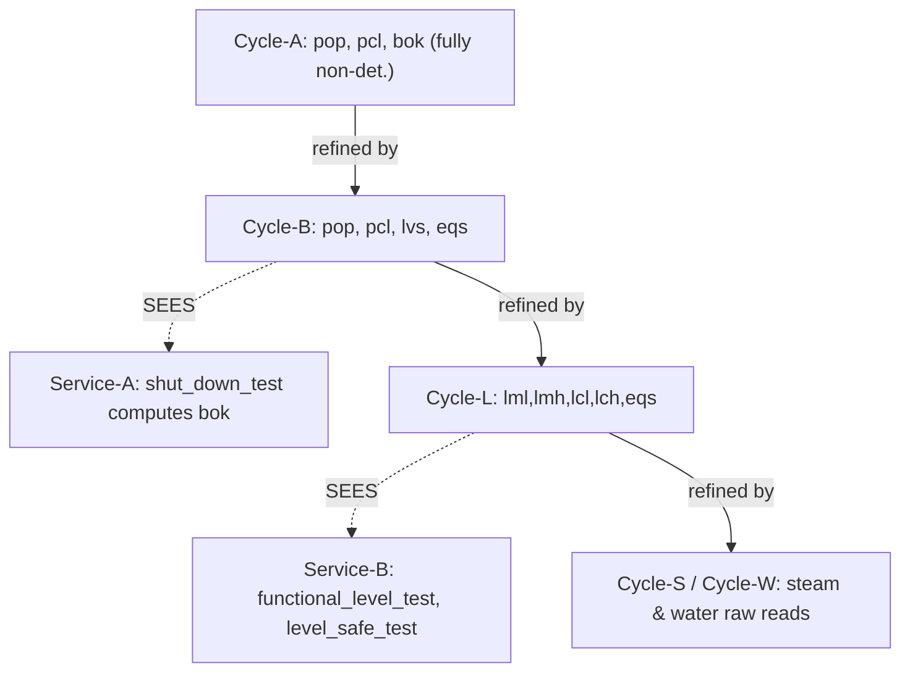

# Case Studies in Refinement

[[book-guidelines|↩ Back to guidelines]]

## Why the book ends here, not with more theory

Chapters 1 through 12 build a complete, self-consistent formal apparatus: predicate logic and set theory (Ch. 1–2), the Generalized Substitution Language and abstract machines (Ch. 3–7), worked specifications (Ch. 8), programming constructs and their proof rules (Ch. 9–10), refinement itself (Ch. 11), and the module mechanics — `IMPLEMENTATION`, `IMPORTS`, `SEES` — that let a refinement chain terminate in something a compiler can actually swallow (Ch. 12). All of it is sound. None of it, on its own, tells you whether the method *scales* — whether a working engineer, staring at a vague paragraph from a client, can actually walk the whole distance from "boiler must not explode" to compilable code without the formalism collapsing under its own weight somewhere in the middle.

Chapter 13 is Abrial's answer to that question, and he chooses two case studies that stress opposite ends of the development process:

- The **data-base system** (§13.2) is built **bottom-up**: start from the "hardware" — a bounded file — and layer machine on top of machine, each one hiding the last, until you reach a command-driven user interface. This is refinement in its most familiar guise: successive concretization of a fixed abstract idea.
- The **boiler control system** (§13.4) is built **top-down and backward**: start from the single non-deterministic operation "generate the outputs," and refine it not by making it *more concrete* in the usual sense, but by *decomposing its non-determinism* into successively more detailed sub-computations. Abrial is explicit that this inverts the textbook understanding of refinement — normally refinement adds implementation detail; here it adds *specification* detail, step by step, using the refinement machinery as an authoring discipline rather than a late-stage optimization pass.

Reading both together is the point: the same four proof-obligation disciplines — invariant preservation, the gluing relation between abstract and concrete state, `IMPORTS`-based encapsulation, and `SEES`-based read-only sharing — produce two visibly different-looking architectures depending on which direction you walk them. If you only ever saw one direction, you might mistake an accident of the example for a law of the method. Chapter 13 exists to correct that.



---

## Part 1 — A library of basic hardware abstraction machines (§13.1)

Before either case study starts, Abrial specifies a small library of `BASIC` machines: `BASIC_CONSTANTS`, `BASIC_IO`, `BASIC_BOOL`, `BASIC_enum`, `BASIC_FILE_VAR`. These are deliberately *never refined*. He states this outright: "such machines are supposed to contain the specification of 'hardware' on which other machines will eventually be implemented... none of these basic machines are refined and, a fortiori, implemented; they are just given." This is the B-Method's equivalent of a trusted FFI boundary or a compiler intrinsic — a place where the proof obligations stop, because the thing being described is assumed to exist as a primitive of the target platform.

`BASIC_CONSTANTS` fixes `minint`, `maxint`, and the derived sets `INT`, `NAT`, `NAT_1` (positive naturals), `INT_1` (negative integers) via properties like

$$
INT = minint\mathbin{{.}{.}}maxint \quad\land\quad NAT = 0\mathbin{{.}{.}}maxint
$$

`BASIC_enum` is more interesting: it's a *generic template*, not a concrete machine. It declares an abstract set `enum = \{\cdots\}` together with a pair of constants `code_enum`, `decode_enum` that are mutually inverse bijections between `enum` and a dense initial segment of naturals:

$$
code\_enum \in enum \rightarrowtail \{0,1,\dots\} \quad\land\quad decode\_enum = code\_enum^{-1}
$$

The book's own note is worth preserving verbatim in spirit: this machine is meant to be *instantiated per enumerated type* by "a small utility program" — i.e., it's a code-generation template, not a machine you import directly. `BASIC_SEX` (`SEX = \{man, woman\}`) and `BASIC_COMMAND` (`COMMAND = \{new, birth, marriage, death, print, quit\}`), used later in the data-base development, are exactly this template with `enum` substituted.

`BASIC_FILE_VAR(max\_rec, INDEX, VALUE)` is the one genuinely load-bearing machine for the data-base study: a size-bounded sequence of "records" (total functions `INDEX → VALUE`) plus one buffer record, with invariant

$$
buf\_vrb \in INDEX \rightarrow VALUE \;\land\; file\_vrb \in seq(INDEX \rightarrow VALUE) \;\land\; size(file\_vrb) \le max\_rec
$$

**What breaks without a hardware layer like this:** every refinement chain has to bottom out *somewhere*, or the proof obligations recurse forever. If you don't draw an explicit, deliberately-unrefined floor, you either (a) never finish the development, or (b) silently smuggle in an assumption about the target machine (arrays exist, are bounded, integers wrap or don't) without ever writing down what you assumed. `BASIC_FILE_VAR` is that floor made honest: its invariant *is* the assumption, stated as a checkable predicate instead of folklore.

**Rust framing.** This is precisely the shape of an `unsafe` boundary or a `#[no_mangle] extern "C"` FFI declaration in a verifier: a typed contract at the edge of what your checker can see into, past which you trust rather than prove. A Rust-based refinement verifier built along these lines would want an explicit "axiom machine" concept — a module whose invariant is asserted, not derived — exactly mirroring `BASIC_FILE_VAR`'s role.

---

## Part 2 — The layered data-base system (§13.2)

This redevelops, with full refinement machinery, the family-tree data-base first specified informally in Chapter 4. The point of doing it twice is structural: Chapter 4 shows *what* to specify; Chapter 13 shows how to walk from that specification down to something with a real memory layout.

### The file stack: refinement by change of variable

Four layers, each one `IMPLEMENTATION ... REFINES ...` the one above, connected by `IMPORTS`:

```
FILE  ⟵ (implemented by) FILE-BUFFER ⟵ FILE-ACCESS ⟵ BASIC_FILE_VAR
```

`FILE(max\_rec, FIELD, VALUE)` is the abstract machine: one variable `file \in seq(FIELD \rightarrow VALUE)`, with direct-access operations `val\_file`, `mod\_file`. Nothing here suggests any notion of "the file lives on disk and part of it is cached" — that's exactly the point of an abstract specification: it names the *effect* (read/write a field of a record) without committing to a *mechanism*.

`FILE-BUFFER` introduces [[Set-Theory-and-the-Relational-Calculus#The mechanism|the mechanism]]. It splits the single abstract variable into two concrete ones, `bfile` (the on-disk part) and `buffer` (the in-core part currently being edited), related by

$$
buffer \in dom(bfile) \rightarrowtail (FIELD \rightarrow VALUE)
$$

and the crucial **gluing relation** — the total linking relation from [[Refinement-Theory|Refinement Theory]] (Ch. 11) that reconstructs the abstract state from the concrete one — is a change of variable:

$$
file = bfile \mathbin{\lhd\!-} buffer
$$

read "$file$ equals $bfile$ overridden by $buffer$." This is Chapter 11's abstract-machine refinement condition made concrete: every operation on `bfile, buffer` must correspond to *some* operation on the single abstract `file` consistent with this equation. `mod_file(o,i,v)` in the implementation first checks whether record `o` is already resident (`not_in_buffer`), loads it if not (`load_buffer`), then writes through the buffer (`mod_buffer`) — three concrete steps standing in for one abstract assignment `file(o)(i) := v`, exactly the "refining does more but says less" asymmetry Chapter 11 licenses.

`FILE-ACCESS` refines again, adding a boolean `updated` recording whether the buffer has been "touched" since the last flush — a classic write-back cache flag:

$$
updated = false \Rightarrow buffer \subseteq bfile \qquad\qquad updated = true \Rightarrow buffer \ne \varnothing
$$

This is worth pausing on as a design pattern independent of B: *every* layer in this stack adds exactly one new piece of physical detail (buffering, then dirty-tracking) and proves, via its own gluing relation, that the added detail is invisible from one layer up. **What breaks without this discipline:** without a proof obligation forcing each layer's gluing relation to actually reconstruct the layer above, "optimizations" like write-back caching are exactly the class of bug that passes every test and fails in production under a timing- or crash-dependent window — the classic cache-coherency defect. The gluing invariant is what makes "this cache is transparent" a theorem instead of a hope.

**Rust framing.** `bfile <+ buffer` (relational overriding, `<+`) is precisely a `HashMap::extend`-style override merge, and the gluing invariant is exactly the representation invariant a `Cache<K, V>` struct's `Drop`/flush logic must uphold — the kind of fact you'd want expressed as a `#[invariant]` attribute checked by a refinement-typed borrow checker, not just documented in a comment. A verifier project modeled on this chapter would need first-class support for "abstract variable defined as a total function of concrete variables" (the change-of-variable case), which is a strictly easier gluing relation to check automatically than a general relational one — worth special-casing.

### Object and data-base layers

`TOTAL-OBJECT` implements a keyed collection of total-function-valued objects on top of `FILE` (each object occupies one record); `PARTIAL-OBJECT` refines that to allow objects that are partial functions, by implementing "missing field" as a distinguished sentinel value inside the total encoding underneath — another change-of-variable refinement, this time absorbing partiality into totality rather than the reverse.

`DATA-BASE` is then specified (not yet implemented) as the familiar family-tree machine — `person`, `sex`, `status`, `mother`, `husband`, with `wife = husband^{-1}` — and it `SEES` (rather than `IMPORTS`) `BASIC_SEX` and `BASIC_STATUS`, since those are read-only shared vocabulary, not private state to hide. Its `PARTIAL-OBJECT`-based implementation is the layer where the abstract relational calculus (`husband \in WOMAN \rightarrowtail MAN`, `MARRIED = dom(husband \cup wife)`) finally gets compiled down to concrete record fields.

### The interface stack, and where termination gets proved

`QUERY` is maximally non-deterministic on purpose: an operation like `get_new_couple` specifies only that it *chooses* some man and woman satisfying the data-base's pre-conditions, or reports failure — it says nothing about *how* a real terminal session gathers that input. Its `IMPLEMENTATION` fills in the how: prompt, read, validate, retry — ordinary interactive I/O, now provably consistent with the abstract choice it refines.

`INNER-INTERFACE` composes `QUERY` with `DATA-BASE` so that every `DATA-BASE` operation is called only from within its pre-condition — this is the layer where "protected" calling discipline becomes structural rather than a code-review convention.

`MAIN-INTERFACE` contains the actual event loop, and this is where Chapter 9's [[Semantics-of-Generalized-Substitutions#Termination|termination]] machinery (loop variants) earns its keep in a live example:

```
main =
  VAR c, x IN
    c ←— COMMAND_READ;  x := maxint;
    WHILE (c ≠ quit) ∧ (x ≠ 0) DO
      CASE c OF
        EITHER new     THEN first_operation
        OR     birth   THEN birth_operation
        OR     marriage THEN marriage_operation
        OR     death   THEN death_operation
        OR     print   THEN print_operation
      END;
      c ←— COMMAND_READ;
      x := x - 1
    INVARIANT x ∈ NAT
    VARIANT   x
    END
  END
```

The book is explicit about *why* the otherwise-pointless variable `x` is there: `main` is proving a refinement of `skip` (the abstract `MAIN-INTERFACE` machine's operation is literally specified as `skip`), and `skip` trivially terminates — so the concrete loop must be *proved* to terminate too, or the refinement is unsound. `x`, counting down from `maxint`, is a syntactic termination certificate bolted onto a loop whose "real" exit condition (`c = quit`) is not, on its own, provably reached. This is a small but sharp illustration of Chapter 9's variant/invariant discipline (`VARIANT`, well-founded decrease) applied to a case where the natural loop condition alone can't discharge the proof obligation.

---

## Part 3 — Backward refinement in the boiler control system (§13.4)

### The problem, stated the way a client would state it

A boiler is a reservoir; water enters through a pump, steam exits to drive an engine. A controlling program runs in fixed cycles of three phases: **receive** messages (raw water level, steam rate, pump state, and equipment-repair notifications), **decide** (open the pump if the level is too low, close it if too high, do nothing otherwise, or shut the whole system down in extreme cases), **send** (pump orders, failure/shutdown notices). Complications the informal spec insists on: the water-level sensor, steam-rate sensor, and pump can each independently fail, in which case the program must substitute a *calculated estimate* for the missing raw reading and keep running until an operator sends a repair message; and the transmission system itself can be judged "suspect" by cross-checking incoming values against physical plausibility bounds.

This is deliberately a **reactive system**: there is no notion of "the program terminates having computed a result." It runs forever, cycle after cycle, and correctness means something closer to "every reachable state satisfies the safety/function laws" than "the output equals the expected value of the input." This is a genuinely different specification shape from the data-base's command-response model, and it is why the chapter treats it with a different refinement *style*.

### System analysis — turning prose into a naming discipline and boolean equations (§13.4.3)

Before any B machine appears, Abrial does something that looks almost administrative and is in fact the real intellectual content of this section: he assigns a disciplined acronym to every quantity the informal spec mentions, systematically distinguishing *raw* readings, *measured* intervals (this cycle's adjusted values), and *calculated* intervals (predicted bounds for *next* cycle) — `lr` (level raw), `lml/lmh` (level measured low/high), `lcl/lch` (level calculated low/high), and the analogous `s*` (steam) and `w*` (water-rate) families. This three-way split — raw / measured / calculated — is the entire trick for handling sensor failure without special-casing it everywhere: a "measured" interval is *always* available, whether or not the sensor is healthy, because when the sensor is judged broken the measured interval is simply set equal to the previous cycle's calculated prediction instead of the (untrusted) raw value:

$$
lml', lmh' = \begin{cases} lr', lr' & \text{if } lok' = true \land lim' = true \\ lcl_0, lch_0 & \text{otherwise} \end{cases}
$$

Only after this vocabulary is fixed does the "function and safety" law get written as boolean equations rather than prose:

$$
pop' = bool(lmh' < lfh \land lml' < lfh) \qquad pcl' = bool(lml' > lfl \land lmh' > lfl)
$$
$$
lvs' = bool(lml' \ge lsl \land lmh' \le lsh \land lcl' \ge lsl \land lch' \le lsh) \qquad bok' = bool(lvs' = true \land eqs' = true)
$$

**Why this matters as methodology, not just as this example:** the six geometric cases for how the interval $[lml, lmh]$ can sit relative to the threshold interval $[lfl, lfh]$ (below, straddling-low, containing, contained-in-and-safely-between, straddling-high, above) are worked out exhaustively as a table before being collapsed into the two-line boolean formula above. This is the book modeling, for a reactive/embedded system, exactly the same "make the informal law a checkable predicate" discipline that Chapter 8's [[Case-Studies-in-Specification|Case Studies in Specification]] used for invoice discounts and lift scheduling — the domain changes, the discipline doesn't.

**What breaks without this analysis pass:** if you jump straight to writing GSL operations from the client's prose, you will not notice — until a proof obligation fails, or worse, until it doesn't and the system misbehaves in the field — that "the water level is too high" is ambiguous between the raw reading, the adjusted measured interval, and the calculated prediction, and that only one of these three is safe to act on when a sensor might be lying. The analysis section exists to force that disambiguation onto paper *before* any operation is specified.

### System synthesis — deriving an implementation order from data dependencies (§13.4.4)

With every quantity's defining equation on the table, subscripted with $0$ for "value from the previous cycle" and primed for "value computed this cycle," Abrial sorts the equations into a dependency order (each line may only refer to primed variables defined *above* it or subscripted-$0$ variables already available), then classifies every one of the resulting 44 objects by the shape of its dependency footprint:

- **Outputs** (primed, left-column only, never appear on any right-hand side): $bok, lfm, sfm, wfm$ — 4 of them.
- **Persistent variables** (appear left-column and also right-column subscripted-$0$): $pop, pcl, lcl, lch, lok, scl, sch, sok, wml, wmh, wok$ — 11 of them; these are the ones that must survive from one cycle to the next as genuine state.
- **Internal variables** (left-column, and right-column only primed — computed and consumed within the same cycle): $lvs, eqs, wc, lml, lmh, stk, sml, smh, wtk, wcl, wch$ — 11 of them.
- **Inputs** (right-column primed only, never left-column): $lim, lr, lrm, sim, sr, srm, wr, wrm$ — 8 of them, matching the incoming messages exactly.
- **Constants**: $leh, lsl, lsh, lfl, lfh, seh, sdi, sdd, wnr, dt$ — 10 of them.

This classification *is* an architecture, even though not one line of B syntax has been written yet: it tells you which quantities need to live in machine-level `VARIABLES` versus `CONCRETE_VARIABLES` of some future implementation, which need to appear in a `VISIBLE_VARIABLES` clause because a sibling machine will need to `SEES` them, and — because the dependency order was constructed precisely to make this true — it tells you a legal sequential execution order for a single cycle's computation, before you've committed to any control structure at all.

**Load-bearing point for a compiler/elaborator project:** this input/output/persistent/internal classification, derived mechanically from a dependency graph over a set of defining equations, is structurally the same problem as computing a topological schedule for a system of mutually-referencing constraints — the kind of pass a Horn-clause solver or an SSA-[[Fixpoint-Construction-and-Induction#Construction|construction]] stage performs before code generation. Treating "which variables are inputs to this specification" as a *derived* fact rather than a manually-declared one is a pattern worth lifting directly into a CHC-based invariant-generation front end: run the dependency analysis first, generate the constraint schedule, only then decide storage and evaluation order.

### Formal specification and design — refining by decomposing non-determinism (§13.4.5)

This is where the "backward" and "non-flat" refinement style the guidelines flag becomes concrete, and it is worth being precise about what makes it unusual relative to Chapters 11–12's presentation of refinement, since those chapters — and the data-base study above — mostly show refinement adding *implementation* detail to a fixed specification. Here Abrial explicitly reframes refinement as an authoring tool for adding *specification* detail:

> "We shall then refine this first, very abstract and non-deterministic, specification by formalizing the way the messages in question are elaborated step by step, thus taking account of more details in the problem... this departs from the well-known classical use of refinement, which is often understood as a means of introducing only the details of implementation."

**The starting machine**, `Cycle-A`, has one operation that non-deterministically sets three booleans with no constraint beyond typing:

```
MACHINE Cycle-A
VISIBLE_VARIABLES pop, pcl, bok
INVARIANT pop, pcl, bok ∈ BOOL × BOOL × BOOL
OPERATIONS
  main_A = BEGIN pop, pcl, bok :∈ BOOL × BOOL × BOOL END
END
```

This says almost nothing — deliberately. Abrial notes the invariant could instead have been a direct copy of the boolean-equation tables from §13.4.4, in which case `main_A` would have to be proved to *establish* those equations; he chooses the weaker "typing-only" style purely for space, and explicitly invites the reader to try the richer version. This choice matters conceptually: **it means every refinement step below is not discharging "does this correctly compute the boiler law" against a rich abstract contract, but rather is *introducing* that contract for the first time**, one non-deterministic choice narrowed at a time, and the actual correctness argument lives in the *chain of refinements itself*, checked against the informal analysis in §13.4.3–4, rather than against any single formal ancestor.

**The refinement pattern, repeated at each layer**, is always the same move: take an operation that non-deterministically sets a group of variables, and refine its `IMPLEMENTATION` to call two sub-operations — one that continues to set a *smaller* group non-deterministically (the next `Cycle-*` machine down), and one that *derives* the variable(s) just peeled off, deterministically, from what the first sub-operation produced (a `Service-*` machine, connected only by `SEES`, never `IMPORTS`, back to the `Cycle` machine it depends on):

```
IMPLEMENTATION Cycle-A-2
REFINES Cycle-A
IMPORTS Cycle-B-1, Service-A-1
OPERATIONS
  main_A = BEGIN main_B; shut_down_test END
END

MACHINE Cycle-B-1
VISIBLE_VARIABLES pop, pcl, lvs, eqs
INVARIANT pop, pcl ∈ BOOL × BOOL ∧ lvs, eqs ∈ BOOL × BOOL
OPERATIONS
  main_B = BEGIN pop, pcl :∈ BOOL × BOOL ‖ lvs, eqs :∈ BOOL × BOOL END
END

MACHINE Service-A-1
SEES Cycle-B-1
VISIBLE_VARIABLES bok
INVARIANT bok ∈ BOOL
OPERATIONS
  shut_down_test = BEGIN bok := bool(lvs = true ∧ eqs = true) END
END
```

Notice precisely what happened: `bok` (boiler-OK) is *removed* from the non-deterministic choice and replaced by a deterministic formula over two new non-deterministic variables `lvs, eqs` — which is exactly the first equation from the §13.4.3/13.4.4 tables, now literally embedded as a substitution. The chain continues: `Cycle-B` is refined by `Cycle-L` (splitting `lvs, eqs` into measured/calculated level intervals) plus a `Service-B` machine computing `functional_level_test` and `level_safe_test`; `Cycle-L` is refined by `Cycle-S`/`Cycle-W` (steam and water detail) plus further services, down to the point where every remaining non-deterministic choice is an actual sensor read.

**Why the safety test lives in a separate SEES-connected machine, not inside `Cycle`'s own operation** — one of the guidelines' key questions, and the answer is now visible directly in the code above: `shut_down_test` is *pure derivation* with no non-determinism of its own, so keeping it structurally separate from the `Cycle` machine that supplies its inputs means it can be refined, replaced, or re-verified completely independently, and — crucially for §13.4.7 below — the `Cycle` machine chain never has to be touched or re-proved just because a `Service` formula changes. `SEES` rather than `IMPORTS` is the right relationship precisely because `Service-A` needs to *read* `Cycle-B`'s output without owning or hiding it — this is Chapter 12's USES/SEES distinction (specification-time forgotten vs. implementation-time persistent, read-only sharing between siblings) doing real architectural work, not just satisfying a syntax rule.



### Final architecture, and the flattened program (§13.4.6)

The design-time architecture is a nested import/sees tree; Abrial notes explicitly that it need not survive to the delivered code as separate modules — the various `main_*` operations can be in-lined into one flat sequential program, a "patch-work of the various abstractions": read steam, test steam, adjust steam, calculate next steam; read water, calculate previous water, test water, adjust water; read level, test level, adjust level, calculate next level, test equipment; then the two derived service checks; then the shutdown test. This is worth flagging explicitly: **the refinement architecture is a proof-organizing structure, not necessarily a runtime module structure** — the same relationship a well-factored set of lemmas has to the single flat proof term a kernel eventually checks.

### Architectural resilience to specification changes (§13.4.7)

The book's own closing question is deliberately practical: after the whole chain above is finished and proved, the client asks for a second, redundant pump. Does the entire development need to be redone?

Abrial's answer is a minimal, local surgery, and its shape is the real payoff of the backward-refinement style: he introduces one *new* layer, `Cycle-X`, with exactly the same specification as the old `Cycle-W` (water-rate machine) it replaces — literally, `Cycle-X INCLUDES Cycle-W; OPERATIONS main_X = main_W END`. Everywhere `Cycle-W` used to be imported directly (specifically, inside `Cycle-L`'s implementation), `Cycle-X` is substituted instead — a one-line change, since the two machines are specification-identical. Only `Cycle-X`'s *own* implementation is new: it imports two **renamed copies** of the original `Cycle-W` (`P1.Cycle-W`, `P2.Cycle-W`, using the renaming-for-instantiation mechanism), runs both, and adds a `Service-X` machine that *synthesizes* one water-rate reading out of the two pumps' independent readings:

```
MACHINE Service-X-1
SEES P1.Cycle-W-1, P2.Cycle-W-1
CONCRETE_VARIABLES wml, wmh, wtk
INVARIANT wml, wmh, wtk ∈ NAT × NAT × BOOL
OPERATIONS
  synthesis_water =
    BEGIN
      wml := P1.wml + P2.wml ‖
      wmh := P1.wmh + P2.wmh ‖
      wtk := bool(P1.wtk ∧ P2.wtk)
    END
END
```

The book underlines the load-bearing fact directly: *"the refinement of the machine `Cycle-W` is not modified."* Everything below the insertion point — the original single-pump machine and its own internal refinement chain — is reused verbatim via renaming, and everything above it — `Cycle-L`, `Cycle-B`, `Cycle-A`, and the entire safety/function-law reasoning built on top of them — never even sees that a second pump now exists, because `Cycle-X`'s *external* specification is unchanged; only its *implementation* grew a layer.

**What made this cheap, precisely:** the original architecture had already drawn the module boundary exactly where the later change would need one — because system synthesis (§13.4.4) had already identified the water-rate quantities as a self-contained variable group with their own dependency-closed sub-equations, separate from level and steam. A change that cuts across an existing module boundary is a local edit; a change that cuts *through* one forces re-derivation of everything downstream. This is the single strongest argument the chapter makes for doing the analysis/synthesis work (§13.4.3–4) *before* writing any B machine: it is what determines whether a later requirements change is absorbed by renaming-and-insertion or by rewriting the proof.

---

## Part 4 — A library of useful abstract machines (§13.3)

Between the two case studies, Abrial sketches a small catalogue of general-purpose, parametric data-structure machines — `ARRAY_VAR`, `SEQUENCE_VAR`, `SET_VAR` (and `COLLECTION` variants managing families of such structures indexed by a key), and `TREE_VAR` — without walking through their full refinement chains. The point of including this library here, undeveloped, is structural rather than technical: it is a reminder that everything demonstrated bespoke in §13.2 for one specific file abstraction generalizes into a *reusable component library* — the same relationship a hand-rolled ring buffer has to `std::collections::VecDeque` once you've proven the pattern works once and want to stop re-deriving it. The source material here is genuinely thin (machine headers and one-paragraph descriptions, no worked refinements), consistent with its role as a coda rather than a third case study.

---

## Synthesis: the whole B-method arc, and what this chapter proves about it

Zoom out to the book's full trajectory: **specification** (Ch. 1–8) gives you a language for stating *what* a system must do, expressive enough to capture liveness and safety as first-class provable facts rather than test-suite folklore. **Refinement** (Ch. 11) gives you a partial order and a proof discipline — the gluing invariant, $pre/rel$ containment — for justifying that a more concrete description is a legitimate narrowing of a more abstract one. **Implementation** (Ch. 12) gives you the module mechanics, `IMPORTS` and `SEES`, that let a refinement chain terminate in something with real modularity, not just a monolithic proof term. Chapter 13's contribution is to show these three pieces composing over a *complete* development, twice, in two directions:

- The data-base study shows the arc running the way most textbooks present it: abstract specification down to concrete implementation, one honest layer of physical detail at a time, each layer's gluing invariant carrying the proof obligation that the optimization below is invisible from above.
- The boiler study shows the arc running in the *other* direction and demonstrates something the earlier chapters state as a theorem but don't dramatize: that refinement's proof obligations are agnostic to whether concretization happens by adding implementation mechanism or by resolving specification non-determinism. The "backward, non-flat" technique is not a different formalism — it is the same $S \sqsubseteq T$ relation from Chapter 11, applied at a point in the design process most methodologies would consider premature.

Both studies converge on the same practical lesson, stated by the boiler's redundant-pump modification but true of the file-stack refactor too: **the cost of a future change is decided by where you draw module boundaries during analysis, not by how carefully you later implement inside them.** A boundary drawn along a real dependency seam (water-rate as a self-contained variable group; the file/buffer split as a self-contained caching concern) absorbs a change by local insertion and renaming. A boundary drawn arbitrarily forces re-proof of everything downstream. This is the closing argument the whole book has been building toward: formal methods pay for themselves not primarily by catching bugs at the point of proof, but by making the *cost of change* legible and boundable in advance.

### Where this leads — for the Rust verifier / Lean-style elaborator project

- **Gluing invariants as change-of-variable equations** (`file = bfile <+ buffer`) are the easy, mechanically-checkable case of refinement — worth a dedicated fast path in a Rust verifier before tackling general relational gluing invariants, since so much of real systems code (caches, buffers, incremental view maintenance) is exactly this shape.
- **The input/output/persistent/internal classification derived from a dependency graph over defining equations** (§13.4.4) is a direct blueprint for a constraint-scheduling pass in a CHC/Horn-clause invariant generator: compute the dependency order first, and let it determine both storage class and evaluation order, rather than hand-declaring either.
- **`SEES`-only dependency for pure derivations** (`Service-A` reading `Cycle-B` without owning it) models exactly the read-only, non-owning borrow a Rust type checker or an elaborator's metavariable-context lookup needs — a pattern worth encoding as a distinct capability from ordinary ownership/import in any module system the verifier's front end adopts.
- **The redundant-pump case study is a worked example of *architectural* refinement resilience** — a property no type system checks for you, but one a well-designed module boundary earns for free. It's the strongest concrete argument in the book for why the elaborator project's own architecture should isolate "one physical assumption per module," mirroring what made `Cycle-W` swappable for `Cycle-X` at zero cost to everything above it.
