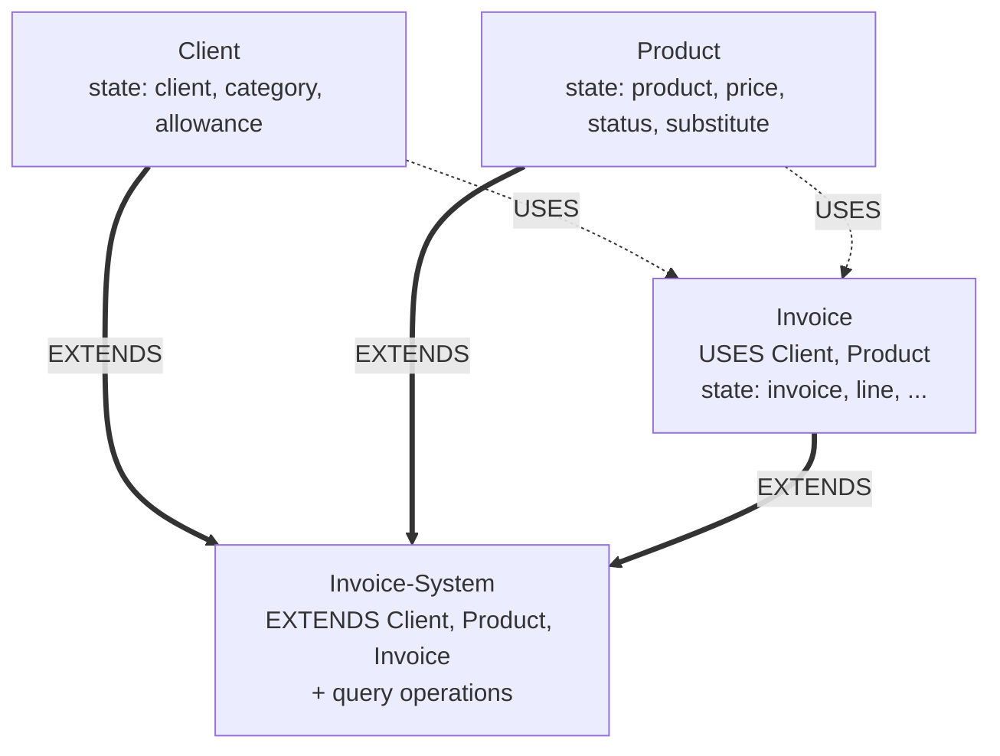
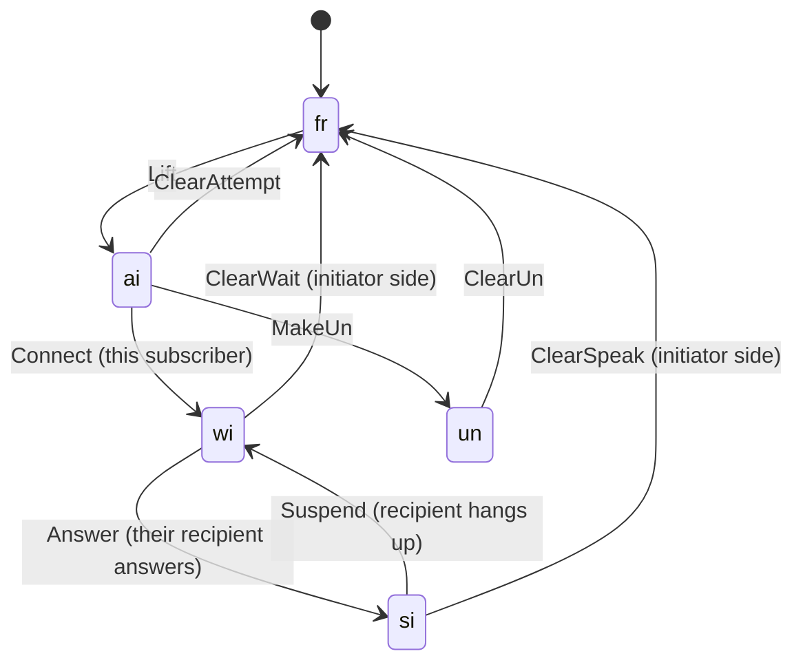
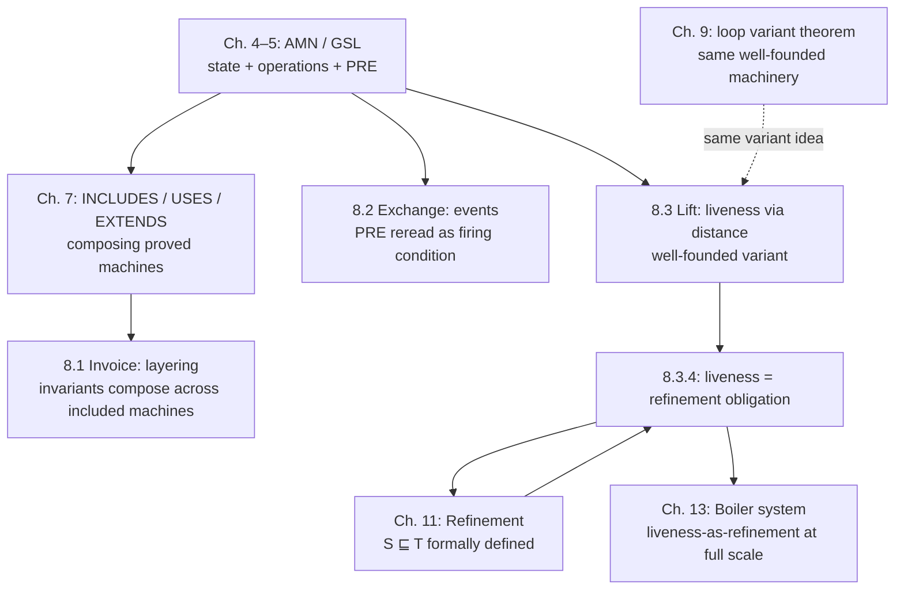

# Case Studies in Specification

[[book-guidelines|↩ Back to guidelines]]

## Why case studies, and why *these* three

Everything in the B-Book up to this point — sequents, sets, relations, fixpoints, the Generalized Substitution Language (GSL) — is machinery. Machinery is only convincing once it has been made to lift something heavy. Chapter 8 is Abrial's proof that the machinery scales: three specifications, each deliberately chosen to stress a *different* failure mode of naive specification.

- The **Invoice System** stresses *composition*: can you build a realistically-sized data-processing system out of small, separately-verified pieces without the pieces' invariants fighting each other?
- The **Telephone Exchange** stresses *control style*: what happens when "operations" aren't things a user invokes on demand, but things that happen concurrently, for reasons external to the specification?
- The **Lift Control System** stresses the hardest question of all: how do you specify — and *prove* — that a reactive system doesn't just behave correctly when it acts, but that it is eventually forced to act? This is a **liveness** property, and it looks, at first, like it needs a completely different proof theory than everything built so far. Abrial's punchline is that it doesn't.

These three case studies share one architectural discipline worth naming up front, because it explains why the invariants below look the way they do: every "law" from an informal requirements paragraph gets compiled into either an **invariant** (a fact that must hold in every reachable state) or a **pre-condition** (a fact that must hold before an operation may legally execute). There is no third place for a business rule to hide. If you can't classify a requirement as one of these two, you haven't understood it well enough to specify it yet — this is the discipline that later chapters formalize as generous-style specification and its refinement obligations.

---

## Part 1 — Layered machine construction in the invoice system

### The problem: incremental trust

Imagine writing the invoice system's `INVARIANT` clause as one flat blob covering clients, products, invoices, and invoice lines simultaneously. It would type-check, in principle. But every time you touched *any* part of it, you would be re-proving *everything* — there'd be no way to know that a change to how products track their substitutes couldn't possibly break the client discount logic, because both facts would live in the same undifferentiated predicate.

**What breaks without layering:** proof effort stops being compositional. In the worst case, verifying $n$ features costs work proportional to the interaction graph between all $n$, not to $n$ itself. This is precisely the same disease that makes untyped monolithic functions hard to maintain in ordinary software — and the fix is structurally the same fix: draw a module boundary, hide the internals, and expose only a typed interface (here, a machine's *operations*, guarded by their own *pre-conditions*) that the outside world is allowed to call.

Abrial's answer is **layered machine [[Fixpoint-Construction-and-Induction#Construction|construction]]**: build small, independently-verifiable machines (`Client`, `Product`), then compose them (`Invoice`, `Invoice-System`) using the composition clauses from Chapter 7 (`USES`, `EXTENDS`) rather than merging their state.

### The layers

**`Client`.** State: `client ⊆ CLIENT` (a deferred set — an opaque, existentially-guaranteed-nonempty carrier type, exactly like an uninterpreted sort in a first-order theory or an abstract `type Client` with no constructors exposed), plus `category : client → CATEGORY` and `allowance : client → ℕ`. A constant `discount : CATEGORY → (0‥100)` encodes law 6 ("friend clients get 20% off") *as data*, not as a scattered `if` — this is worth noticing on its own: a business rule that's naturally a lookup table should be a machine constant with a `PROPERTIES` clause pinning its value, not conditional logic buried in every operation that needs it.

$$
discount \in CATEGORY \rightarrow (0\mathbin{{.}{.}}100) \;\land\; discount = \{friend \mapsto 20,\; dubious \mapsto 100,\; normal \mapsto 100\}
$$

**`Product`.** State: `product ⊆ PRODUCT`, `price : product → ℕ`, `status : product → STATUS`, and — the interesting one — `substitute : product ⇸ status⁻¹[{available}]`, a *partial function* whose range is constrained to already-available products. Read that invariant slowly: it says, in one line, "a product may or may not have a substitute, and if it does, that substitute is guaranteed not to itself be sold out." This is law 2 of the informal spec, compiled directly into a typing fact about a function's range — no separate check is needed anywhere else in the system, because the invariant makes the bad state *unrepresentable*.

**`Invoice`.** This machine `USES Client, Product` — read-only sharing, because an invoice needs to look up a client's discount and a product's price without being able to mutate either. Its state has two natural halves: invoice-level (`invoice`, `customer`, `percentage`, `allowed`, `total`) and line-level (`line`, `origin`, `article`, `quantity`, `unit-cost`). The single most instructive invariant in the whole chapter is this one, encoding law 3 ("no two lines of an invoice may share a product"):

$$
origin \otimes article \in LINE \rightarrowtail INVOICE \times PRODUCT
$$

Here $\otimes$ is Abrial's *direct product* of two functions with a common domain: $(origin \otimes article)(l) = (origin(l), article(l))$. Saying that this paired function is a **partial injection** ($\rightarrowtail$) says exactly: no two distinct lines map to the same (invoice, product) pair. Compare this to the naive alternative — a side condition checked procedurally inside `new_line` — and the gain is visible immediately: the invariant is a *static, standing* guarantee that every proof obligation downstream can assume for free, rather than a runtime check that has to be independently re-verified at every call site that might slip past it.

Also worth internalizing: `create_invoice_header` copies `discount(category(c))` and `allowance(c)` into the new invoice's own `percentage` and `allowed` fields *at creation time*, not by reference. This is a deliberate temporal decoupling — "any future change of these data, on the client's record, will not affect the eventual calculation of the invoice," as the text puts it. It's the specification-level analogue of copy-on-write versus aliasing, and it matters because without it, the invariant $ran(total \oplus allowed) \subseteq (\leq)$ (i.e., every invoice's `total ≤ allowed`, law 5) could be silently invalidated by an operation that never even touches the `Invoice` machine.

**`Invoice-System`.** This top machine `EXTENDS Client, Product, Invoice` (recall from Chapter 7: `EXTENDS` = `INCLUDES` + automatic `PROMOTES`, so every operation of the three sub-machines becomes directly callable on `Invoice-System` itself) and adds a battery of *query* operations (`product_available`, `client_not_dubious`, `total_not_exceeded_by_line_of_invoice`, …) whose entire job is good error reporting — deciding, before calling a state-changing operation, whether its pre-condition would actually be met.



### Grounding: layering as module boundaries with proof-carrying invariants

The Rust shape of this is a set of small structs, each owning its own invariant, composed by containment rather than inheritance:

```rust
// Deferred sets become opaque newtypes — no constructors outside this module,
// mirroring the B "hiding principle": a client of this module can hold a
// ClientId but can never manufacture one out of thin air.
#[derive(Copy, Clone, PartialEq, Eq, Hash)]
pub struct ClientId(u64);

pub enum Category { Friend, Dubious, Normal }

pub struct ClientMachine {
    category: HashMap<ClientId, Category>,
    allowance: HashMap<ClientId, u64>,
}

impl ClientMachine {
    // The invariant "category, allowance total on client" is enforced by
    // construction: every insertion path is forced through here.
    pub fn create_client(&mut self, allowance: u64) -> ClientId {
        let id = ClientId(self.category.len() as u64);
        self.category.insert(id, Category::Normal);
        self.allowance.insert(id, allowance);
        id
    }

    pub fn discount_pct(cat: &Category) -> u8 {
        match cat { Category::Friend => 20, _ => 0 }
    }
}

pub struct InvoiceMachine<'a> {
    clients: &'a ClientMachine,   // USES: read-only borrow, not ownership
    products: &'a ProductMachine,
    // the partial-injection invariant (origin ⊗ article) below is exactly
    // what a HashMap<(InvoiceId, ProductId), LineId> enforces for free —
    // two lines with the same key simply cannot coexist.
    line_of: HashMap<(InvoiceId, ProductId), LineId>,
}
```

The `HashMap<(InvoiceId, ProductId), LineId>` is the Rust idiom for "partial injection from a direct product" — B's `origin ⊗ article ∈ LINE ↣ INVOICE × PRODUCT` invariant and a hash map keyed on a compound key are the *same idea*, one stated declaratively as a proof obligation, the other enforced operationally by the data structure's own API surface. This is worth sitting with: in the B-Method, you *prove* the injection holds after every operation; in Rust with the right data structure, the type/API makes violating it structurally impossible. Both are legitimate ways to discharge the same proof obligation — one via a trusted kernel (the map's insert logic), the other via an explicit, per-operation proof.

In Lean, the same layering shows up as a record whose *field* carries the invariant as a proposition, which is the more literal translation of B's style (invariant as a standing predicate over the state, checked by a proof obligation rather than baked into a data structure):

```lean
structure InvoiceState where
  invoice   : Finset Invoice
  line      : Finset Line
  origin    : Line → Invoice
  article   : Line → Product
  -- the direct-product injection, stated exactly as Abrial states it
  no_dup_article :
    ∀ l₁ l₂ : Line, l₁ ∈ line → l₂ ∈ line →
      origin l₁ = origin l₂ → article l₁ = article l₂ → l₁ = l₂
```

Every operation on `InvoiceState` (e.g. `new_line`) then has to come with a proof term re-establishing `no_dup_article` — which is *exactly* what a B proof obligation asks a human (or a prover) to produce, made explicit as a Lean term. This is the fragment of the B-Book most directly relevant to a checker/verifier project: the invoice invariant is a genuine, checkable Hoare-style postcondition on every state-transforming operation, and "generate and prove all obligations of machine Invoice" (Exercise 5, p. 369) is literally asking for the same VCGen + discharge pipeline a Hoare-logic verifier would run.

---

## Part 2 — Modeling concurrent systems as event machines

### The problem: who calls the operations?

Every abstract machine up to now has an implicit mental model: some external client calls an operation, waits for it to finish, then calls the next one. That model works fine for `Client` and `Product` — a program really does call `create_client`, then later `modify_allowance`. It breaks down completely for a telephone exchange, where dozens of subscribers are doing things *simultaneously*, and where many transitions (a call getting dropped for taking too long, say) have no "caller" at all in the ordinary sense.

**What breaks without the event reframing:** if you insist on modeling `Connect` as a function some client invokes with both arguments in hand, you have to invent a fictional orchestrator that "decides" which pair of subscribers to connect and calls the operation on their behalf — and that orchestrator doesn't exist in the real system and has no natural specification. The event reframing removes this fiction.

### The reframing

Abrial's move, following Woodcock and Loomes, is genuinely simple once seen: **keep the exact same syntax** (an `OPERATIONS` clause with `PRE`/`THEN`/`END`), but change how you *read* it. An operation is no longer "a thing a client calls"; it is "a thing that may fire, whenever its pre-condition happens to become true." The pre-condition is renamed, informally, the **firing condition**. Nobody needs to be identified as the *caller* — the operation simply *occurs*, for reasons (a person lifting a handset, an internal timeout) that are outside the model's concern.

This single re-reading is what lets seven independently-specified operations (`Lift`, `Connect`, `MakeUn`, `Answer`, `ClearAttempt`/`ClearWait`/`ClearSpeak`, `Suspend`, `ClearUn`) model a system where any number of subscriber-pairs can be mid-conversation at once, interleaved arbitrarily, with no global scheduler anywhere in the specification. Concurrency, here, is not a new *semantic* primitive bolted onto GSL — it is *nondeterministic interleaving of independently-fireable operations*, something GSL already had every tool to express.

### The state machine per subscriber

Each `SUBSCRIBER` moves through the status lattice `{fr, un, ai, wi, si, wr, sr}` (free / unavailable / attempting-initiator / waiting-initiator / speaking-initiator / waiting-recipient / speaking-recipient):



with a symmetric `Connect`-triggered branch on the recipient side (`fr → wr → sr`, with `ClearWait`/`ClearSpeak` clearing the recipient to `fr`/`un` respectively).

The invariant is where the real content lives. `caller` is a function from subscribers to subscribers, but its *domain* is restricted, and its restriction is a **bijection**:

$$
caller \in status^{-1}[\{wr, sr\}] \rightarrowtail status^{-1}[\{wi, si\}]
$$

$$
status^{-1}[\{wr\}] \lhd caller \in status^{-1}[\{wr\}] \rightarrowtail status^{-1}[\{wi\}]
$$

i.e. among *waiting* subscribers specifically, `caller` is a bijection between waiting recipients and waiting initiators, and separately a bijection between speaking recipients and speaking initiators. In prose: every conversation, at every moment, has *exactly* one recipient and *exactly* one initiator, paired off — this is precisely how the specification rules out conference calls without a single line of code dedicated to "no conference calls." (Exercise 8, tellingly, asks the reader to modify the machine to *allow* conference calls — which requires relaxing this bijection to a general relation, an excellent illustration that a specification's invariant is exactly the boundary of what the system can and cannot do.)

The `Exchange` machine then `INCLUDES Simple-Exchange` and layers dialling on top — an `nstatus` classifying each so-far-dialled digit sequence as `hopeful`/`bad`/`good`, with `Success` defined as literally *calling* `Connect` from the included machine once the dialled number resolves to a free subscriber. This is the composition discipline from Part 1 again, now applied to a concurrent system: `Exchange` doesn't reimplement connection logic, it *promotes and calls into* `Simple-Exchange`'s already-proved operations.

### Grounding: events as guarded transitions, not RPCs

This is the one place in the chapter where Rust's ownership/borrowing story is *not* the most natural fit for illustrating the idea — a shared mutable event log with many independently-firing guards is closer to an actor/message-passing shape. Still, a direct, checker-relevant translation:

```rust
enum Status { Free, Unavailable, AttemptInit, WaitInit, SpeakInit, WaitRecip, SpeakRecip }

struct Exchange {
    status: HashMap<SubscriberId, Status>,
    caller: HashMap<SubscriberId, SubscriberId>, // recipient -> initiator
}

impl Exchange {
    /// An "operation" is not something a caller invokes expecting a result;
    /// it is a partial transition function: None means "not fireable now"
    /// (the B pre-condition failed), matching GSL's PRE|S — outside the
    /// pre-condition, the substitution is simply not defined here.
    fn try_connect(&mut self, s: SubscriberId, t: SubscriberId) -> Option<()> {
        if self.status.get(&s) != Some(&Status::AttemptInit) { return None; }
        if self.status.get(&t) != Some(&Status::Free) { return None; }
        self.status.insert(s, Status::WaitInit);
        self.status.insert(t, Status::WaitRecip);
        self.caller.insert(t, s);
        Some(())
    }
}

// A driver loop models "events fire whenever their guard holds" by
// nondeterministically polling all fireable transitions — this loop, not
// any single function, is the operational reading of "concurrent activity":
fn step(ex: &mut Exchange, rng: &mut impl Rng) {
    let fireable: Vec<Transition> = enumerate_fireable_transitions(ex);
    if let Some(t) = fireable.choose(rng) { apply(ex, t); }
}
```

The `Option<()>` return is the Rust idiom for GSL's pre-conditioned substitution $P \mid S$: calling an operation outside its pre-condition isn't a crash to be caught, it's a transition that was never enabled — the type signature makes "not currently applicable" a first-class, checkable outcome rather than a runtime panic. This is exactly the distinction Chapter 4's `PRE` versus `IF`-guard discussion (pp. 227–264) draws at the specification level, showing up again here at the code level.

---

## Part 3 — The lift control liveness problem

### The problem: safety is not enough

Everything proved so far in the book is a **safety** property: "the invariant holds in every reachable state," which is a statement of the form *nothing bad ever happens*. The `Lift` machine's invariant — `moving ⊆ LIFT`, `floor ∈ LIFT → FLOOR`, `dir ∈ LIFT → DIRECTION`, plus two non-overlap conditions preventing a lift from being asked to do something it's already doing — is entirely a safety statement of this kind.

But requirement 4 of Davis's 1984 lift problem (still a canonical reactive-systems benchmark today) says something structurally different: *"all requests for lifts from floors must be serviced eventually."* This is a **liveness** property — a statement of the form *something good eventually happens* — and no invariant, by itself, can express it. An invariant that's true in every state is compatible with a lift that simply never moves again. You need a separate argument that *progress* is guaranteed, not just that *badness* is excluded.

**What breaks without a liveness argument:** you could build a `Lift` machine whose every reachable state satisfies the invariant perfectly, and which is completely correct by every safety proof obligation the book has developed so far — while a request at floor 3 sits forever unserviced because the lift always happens to prefer other floors. Safety alone cannot rule this out. This is precisely the reason the informal spec (p. 358) flags requirements 4 and 5 with "(can this be proved or demonstrated?)" — the authors of the original problem statement already suspected liveness would be the hard part.

### The state and the attraction predicates

`Lift`'s state: `moving ⊆ LIFT` (which lifts are currently between floors), `floor ∈ LIFT → FLOOR`, `dir ∈ LIFT → DIRECTION`, `in ⊆ FLOOR ↔ DIRECTION` (hall-call buttons: $(f,d) \in in$ means someone at floor $f$ wants to travel in direction $d$), and `out ⊆ LIFT ↔ FLOOR` (car-call buttons: $(l,f) \in out$ means someone inside lift $l$ wants to get out at floor $f$).

Two derived predicates carry all the routing logic:

$$
attracted\text{-}up(l) \;\equiv\; \bigl(dom(in) \cup out[\{l\}]\bigr) \cap (floor(l)+1 \,{.}{.}\, top) \neq \emptyset
$$

$$
attracted\text{-}dn(l) \;\equiv\; \bigl(dom(in) \cup out[\{l\}]\bigr) \cap (ground \,{.}{.}\, floor(l)-1) \neq \emptyset
$$

Read $attracted\text{-}up(l)$ as: "is there any pending request — hall call or car call — strictly above where lift $l$ currently is?" From these, `can-continue-up(l)` (nobody wants out here, nobody wants in here going up, and the lift is still attracted upward) governs the `Continue_up`/`Stop_up` pair, and `attracted-up`/`attracted-dn` alone govern `Depart_up`/`Change_up_to_dn` for a stationary lift. Every one of the eight operations (`Request_Floor`, `Request_Lift`, `Continue_up`/`dn`, `Stop_up`/`dn`, `Depart_up`/`dn`, `Change_up_to_dn`/`dn_to_up`) is a small, independently-guarded event, in exactly the same style as the telephone exchange — this is a second worked instance of the same event-machine idea from Part 2, now under a much harder correctness demand.

### Distance: turning "eventually" into "strictly decreasing"

Here is the actual proof technique, and it is the most important idea in the chapter. Abrial defines a function $dist(f, d, g, e)$: given a lift currently at (or arriving at) floor $f$ traveling in direction $d$, and a pending request at floor $g$ wanting direction $e$, $dist$ counts the number of floors the lift must still traverse to reach and service that request — counting *each necessary reversal of direction as one extra unit*. The table (p. 365) gives all eight cases by comparing $f$ vs. $g$ and $d$ vs. $e$; the case $f > g, d = up, e = up$, for instance, forces the lift to go all the way to the top, reverse, and come back down past its start to $g$:

$$
dist(f, up, g, up) = 2\times(top - ground) - f + g + 2 \quad \text{when } f > g
$$

The theorem — and this is the crux — is: **for every operation except `Request_Floor` and `Request_Lift`, firing that operation strictly decreases $dist(floor(l), dir(l), g, e)$ for every still-pending request $(g,e)$.** For `Change_up_to_dn`, Abrial computes the decrease explicitly:

$$
\delta - \delta' = 2\times(top - floor(l)) + 1 > 0
$$

always positive, because $floor(l) \le top$. Since $dist$ is a natural number bounded below by $0$, and every relevant transition strictly decreases it, the system *cannot* fire an infinite sequence of transitions without eventually servicing the request — the request cannot be starved forever. This is nothing but **well-founded induction**, the exact same proof principle Chapter 3 built for $\mathbb{N}$, sequences, and trees, now applied to reactive-system fairness instead of to a data structure. If you've internalized "a well-founded relation has no infinite descending chain," you've already internalized the entire liveness argument — $dist$ is simply a *variant function* (in the sense Chapter 9 formalizes for loop [[Semantics-of-Generalized-Substitutions#Termination|termination]]) applied to a system that runs forever rather than a loop that terminates.


---

## Part 4 — Liveness properties as refinement obligations

### The punchline: no new proof theory needed

Section 8.3.4 is where Abrial delivers the chapter's real thesis, and it's worth stating plainly because it's easy to read past: **you do not need a separate "liveness proof theory" bolted onto GSL.** Every one of those "distance strictly decreases" facts from Part 3 is *definitionally equivalent* to an ordinary **refinement** obligation — the same relation, $S \sqsubseteq T$, that Chapter 11 defines for turning an abstract specification into a concrete implementation.

[[Fixpoint-Construction-and-Induction#The construction|The construction]]: define one maximally nondeterministic operation, `Decrease_Distances(l)`, whose entire job is to say "do *something* to the state — while preserving the invariant $I$, while only ever servicing requests (never creating new unserviced ones: $in' \subseteq in_0$, $out' \subseteq out_0$), and while strictly decreasing $dist$ for every request still pending afterward":

$$
Decrease\_Distances(l) \;\widehat{=}\; \texttt{PRE } l \in LIFT \texttt{ THEN}
$$
$$
moving, floor, dir, in, out :\Bigl(I \;\land\; in \subseteq in_0 \;\land\; out \subseteq out_0 \;\land\;
$$
$$
\forall(g,e)\cdot\bigl((g,e)\in in \Rightarrow dist(floor(l),dir(l),g,e) < dist(floor_0(l),dir_0(l),g,e)\bigr)\Bigr) \texttt{ END}
$$

This uses the **generalized/bounded-choice substitution** $x : P$ from Chapter 5 (`x :∈ E`'s more general cousin: "choose new values for these variables satisfying predicate $P$, referring to the old values via subscript-0 primes") — the specification-statement idiom that says "any state transition with this property is acceptable," without committing to *which* one.

Now [[Semantics-of-Generalized-Substitutions#The claim|the claim]] is: `Change_up_to_dn(l)`, pre-conditioned exactly as before, **refines** `Decrease_Distances(l)`. Concretely,

$$
Change\_up\_to\_dn(l) \;\widehat{=}\; \texttt{PRE } I_{\text{guard}} \texttt{ THEN } Decrease\_Distances(l) \texttt{ END}
$$

where $I_{\text{guard}}$ is exactly `Change_up_to_dn`'s original pre-condition. Abrial then works the algebra of what "$Change\_up\_to\_dn$ refines $Decrease\_Distances$" *unfolds to*, using the refinement definition in terms of $[\cdot]$ (weakest-precondition semantics — negate, existentially quantify over post-states, negate again), and shows it collapses, after calculation, to *precisely* the distance-decreasing inequality from Part 3 — the same formula, derived two different ways. The refinement obligation and the liveness obligation are not merely related; they are **the same proposition**, viewed once through the refinement relation's definition and once through an informal "does the distance go down" argument.

### Why this matters more than it looks

This is the passage in the entire chapter most directly relevant to the theorem-proving/compiler project: it is a worked example of **reducing a temporal-logic-shaped property (liveness, "eventually P") to a first-order, per-transition verification condition**, by (1) introducing a ranking/variant function into a well-founded order, and (2) casting "the ranking function decreases" as a refinement (equivalently, a weakest-precondition entailment) discharged by the *same* proof machinery already used for safety. This is structurally identical to how a modern verifier handles termination and liveness in Horn-clause / CHC form: a liveness obligation becomes a rank-function synthesis problem plus a set of first-order VCs of the shape "if the rank function is $r$ before and $r'$ after, and the transition guard holds, then $r' < r$" — exactly Abrial's $\delta - \delta' > 0$ calculations. If you ever implement a CEGAR-style liveness checker or a termination-analysis pass in your compiler's verification backend, this section is the specification-level ancestor of that machinery, and "find a good model for the distances" (Abrial's own closing generalization) is precisely the rank-function-synthesis problem such a tool has to automate.

### Grounding: rank functions as refinement checks

```rust
// A "liveness obligation" compiles to: find a measure that strictly
// decreases on every relevant transition, bounded below — i.e. a
// well-founded variant, exactly as in Chapter 9's loop-termination theory.
fn distance(floor: u32, dir: Direction, g: u32, e: Direction, ground: u32, top: u32) -> u32 {
    match (dir, e) {
        // (abbreviated: mirrors Abrial's 8-case table on p. 365)
        (Direction::Up, Direction::Up) if floor <= g => g - floor,
        (Direction::Up, Direction::Up) => 2 * (top - ground) - floor + g + 2,
        // ... remaining six cases
        _ => unimplemented!(),
    }
}

/// The refinement check, made executable: an abstraction step is licensed
/// only if it strictly decreases the rank for every request still pending —
/// this predicate IS the discharge of the refinement proof obligation.
fn decreases_distance_for_all_pending(
    before: &LiftState, after: &LiftState, requests: &[(u32, Direction)],
) -> bool {
    requests.iter().all(|&(g, e)| {
        distance_of(after, g, e) < distance_of(before, g, e)
    })
}
```

In Lean, the refinement-as-liveness argument is most naturally a termination proof discharged by `WellFoundedRecursion` / a `decreasing_by` obligation on the rank function — the same machinery Lean uses to prove *your own recursive function* terminates is, structurally, what Abrial is asking a B prover to establish about the *lift's* behavior:

```lean
-- `dist` plays the role of a Lean termination measure; showing it strictly
-- decreases on every enabled transition is literally a `decreasing_by`
-- side-goal, and "eventually serviced" follows from WF induction on ℕ.
theorem change_up_to_dn_decreases (l : Lift) (h : ChangeUpToDnGuard l) :
    ∀ g e, (g, e) ∈ pendingRequests l →
      dist (floor' l) (dn) g e < dist (floor l) (dir l) g e := by
  intro g e hmem
  simp [dist, h.attracted_dn, h.not_attracted_up]
  omega
```

---

## Synthesis: where this fits, and where it leads



Chapter 8 is a hinge, not a detour. It **depends on**: the composition clauses of Chapter 7 (`USES`/`EXTENDS`, exercised directly in the invoice layering), the pre-conditioned substitution and generalized-choice constructs of Chapters 4–5 (both the event reframing and `Decrease_Distances` lean on these), and — quietly, by anticipation — on the refinement relation that Chapter 11 hasn't formally defined yet, but whose *informal* shape (a concrete operation doing "at most what the abstract one allows, but possibly less nondeterministically") is exactly what section 8.3.4 needs and gets away with using early, with an explicit forward pointer.

What **depends on it**: Chapter 9's variant theorem for loop termination is the same well-founded-decrease argument specialized to sequential programs instead of reactive systems — once you've seen $dist$ decrease across lift events, the loop variant is the same idea with "iteration" instead of "event." And Chapter 13's Boiler Control System case study runs the liveness-as-refinement thesis at full architectural scale, decomposing a maximally nondeterministic `Cycle` machine into layers exactly the way `Decrease_Distances` was decomposed into `Change_up_to_dn` and its siblings here.

For the standing project: this chapter is where "weakest-precondition reasoning" (Chapters 4–6) and "refinement" (a preview of Chapter 11) visibly merge into a single proof-obligation discipline capable of swallowing liveness — a property class that, in most treatments, needs its own temporal logic and its own proof calculus. The B-Method's answer — pick a well-founded rank function, express "the rank decreases" as a first-order VC, discharge it with the same prover used for everything else — is the direct ancestor of rank-function/termination-argument synthesis in a CHC-based verification backend, and the `Decrease_Distances`-style maximally-nondeterministic specification statement is a clean worked example of the "specify by constraint, refine toward an implementation" pattern your compiler's constraint-based refinement-type inference will need to formalize in general.
