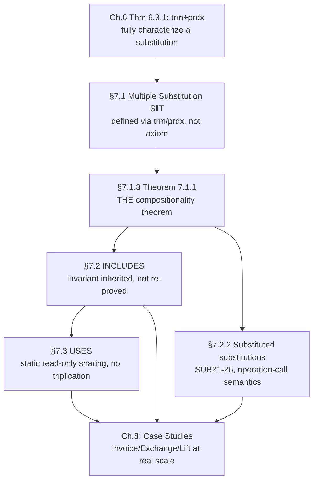

[[book-guidelines|↩ Back to guidelines]]

# Composing Large Specifications

## Scaling proof, not just notation

Everything up to this chapter deals with one abstract machine at a time. But real specifications need dozens or hundreds of machines, and the entire discipline collapses if composing them requires re-proving invariant preservation from scratch every time. This chapter's real subject is not "how do you write `INCLUDES`" — it's **how do you compose already-proved pieces without re-opening their proofs**. Every mechanism here (multiple substitution, `INCLUDES`, `USES`, `PROMOTES`/`EXTENDS`) is engineered around one constraint: *the proof obligation for a composite machine should only involve the composite's own new material, never a re-derivation of what the parts already established.* This is modular verification's founding discipline, and watching Abrial derive it from a single theorem about independent substitutions is the clearest possible illustration of why it works.

---

## 1. Multiple generalized substitution: composing behavior, not syntax

### From syntactic sugar to a genuine semantic operator

Chapter 4 introduced `x := E || y := F` as pure sugar for `x,y := E,F`. This chapter generalizes `||` to combine *any* two generalized substitutions $S, T$ — not just simple assignments — working on **distinct** variables $x, y$. Because $S \| T$ isn't decomposable into elementary assignment, it can't be given meaning by unfolding sugar; instead it's defined the way §6.3.3 flagged as sufficient to characterize *any* substitution — by specifying its `trm` and `prdx` directly:

$$
\texttt{trm}(S \| T) \;\widehat{=}\; \texttt{trm}(S) \land \texttt{trm}(T) \qquad\qquad \texttt{prd}_{x,y}(S\|T) \;\widehat{=}\; \texttt{prd}_x(S) \land \texttt{prd}_y(T)
$$

This is a direct, load-bearing application of Theorem 6.3.1 ($S = \texttt{trm}(S)\mid@x'\cdot(\texttt{prd}_x(S)\Rightarrow x:=x')$): rather than axiomatize $[S\|T]R$ operationally, Abrial defines the *two invariants that fully pin down a substitution's meaning* and lets the founding identity do the rest. This is the specification-language analogue of defining a new operator in a proof assistant purely by its type and its defining equations, then getting all derived behavior "for free" from the kernel's normal-form machinery — you never need a new primitive reduction rule, only the two characterizing predicates.

### The Main Result: independence lets you compose proofs, not just substitutions

$$
[S]P \land [T]Q \;\Rightarrow\; [S\|T](P\land Q) \qquad \text{if } x\backslash Q \text{ and } y\backslash P \qquad \textbf{Theorem 7.1.1}
$$

Read this exactly as it will be used: if $S$ (working on $x$) is proved to establish $P$, and $T$ (working on the *disjoint* variable $y$) is proved to establish $Q$ — with the crucial **non-freeness side conditions** $x\backslash Q$, $y\backslash P$ (neither predicate mentions the other's variable) — then their combination $S\|T$ establishes the *conjunction* $P\land Q$, with **no further proof work**. This is not a convenience lemma; it is *the* theorem that makes machine composition tractable at all. Without the non-freeness side conditions, this would be false in general (imagine $P$ secretly depending on $y$ — combining $S$ and $T$ could then interact in ways neither individual proof accounted for). The side conditions are doing exactly the job Chapter 1's non-freeness machinery (§1.3.3, revisited constantly since) was built for: mechanically certifying that two pieces of reasoning genuinely don't interfere.

**This is frame-rule reasoning, avant la lettre.** Anyone who has used separation logic's frame rule —

$$
\frac{\{P\}\,S\,\{Q\}}{\{P * R\}\, S\,\{Q * R\}} \quad (\text{modifies}(S) \cap \text{fv}(R) = \emptyset)
$$

— will recognize Theorem 7.1.1 immediately: separation logic's disjointness-of-footprint side condition *is* Abrial's $x\backslash Q \land y\backslash P$, just phrased spatially (disjoint heap regions) rather than syntactically (disjoint variable sets, non-freeness). Both are answering the identical question — "under what condition does local reasoning about two independent pieces compose into global reasoning about the whole?" — and both answer it the same way: prove disjointness, get compositionality for free. For a constraint-solving/verification kernel, this is the theorem that justifies decomposing a large verification condition into independently-dischargeable sub-obligations whenever the underlying state footprints don't overlap — exactly the reasoning a modular Hoare-logic checker needs to avoid re-verifying shared/unrelated state on every call.

```rust
// Theorem 7.1.1 as a compositional verification rule — the exact shape
// a modular VC checker uses to avoid re-deriving proofs for independent
// state fragments (the "frame rule" pattern).
struct Obligation<'a> { pred: &'a Pred, vars: HashSet<String> }

// Given [S]P and [T]Q already discharged separately, produce [S‖T](P∧Q)
// WITHOUT further proof search — provided the footprints are disjoint.
fn combine(s_proof: Obligation, t_proof: Obligation) -> Option<Pred> {
    let disjoint = s_proof.vars.is_disjoint(&t_proof.vars);
    let non_interfering =
        !s_proof.pred.free_vars().overlaps(&t_proof.vars)   // x \ Q
        && !t_proof.pred.free_vars().overlaps(&s_proof.vars); // y \ P
    if disjoint && non_interfering {
        Some(s_proof.pred.clone().and(t_proof.pred.clone())) // free composition
    } else {
        None // must fall back to a joint proof — no shortcut available
    }
}
```

### `||` eliminated: it's syntactic sugar after all, just at a higher level

Section 7.1.2 catalogues equivalences showing $\|$ distributes through every other GSL construct — $S\|(P\mid T) = P\mid(S\|T)$, $S\|(T\Box U) = (S\|T)\Box(S\|U)$, $S\|(@z\cdot T) = @z\cdot(S\|T)$ if $z\backslash S$, and so on — culminating in the remark that "$\|$ can always be eliminated": despite being given real semantic content (unlike the earlier purely-syntactic `||`), *this* generalized `||` is still, in the end, provably expressible via the other primitives. This is another instance of the book's recurring minimality discipline (Chapters 1–3's "smallest genuine primitive set, everything else derived") — even a semantically-primitive-looking operator earns its keep only by being *provably reducible*, which is exactly the kind of conservativity guarantee a proof assistant wants for every "derived tactic" or notation extension it adds to its surface language: convenience without any expansion of the trusted core.

---

## 2. INCLUDES: incremental specification via proven independence

### Building a machine from already-proved machines

Given machines $M_1, M_2$ with **distinct** variables $x_1, x_2$ and separately-proved invariant preservation ($\forall x_1\cdot(I_1\land P_1\Rightarrow[S_1]I_1)$, similarly for $M_2$), Theorem 7.1.1 delivers, essentially automatically (since $x_2\backslash I_1$ trivially, being disjoint variable sets): $\forall(x_1,x_2)\cdot(I_1\land I_2\land P_1\land P_2 \Rightarrow [S_1\|S_2](I_1\land I_2))$ — **the conjoined invariant $I_1\land I_2$ is preserved by the conjoined operation, with zero new proof effort.** This is the formal justification for `INCLUDES`: a machine $M$ that includes $M_1$ and $M_2$ inherits their invariants and their already-discharged preservation proofs *for free*; $M$'s own proof obligation only has to cover $M$'s *additional* invariant (the **gluing invariant**, which may reference $x_1$ and $x_2$ alongside $M$'s own variables) and $M$'s *new or combined* operations.

Concatenation rules for every clause (`SETS`, `CONSTANTS`, `PROPERTIES` by conjunction, `VARIABLES`, `INVARIANT` by conjunction, `INITIALIZATION` by multiple composition `||`) are entirely mechanical — there's no semantic content left to prove at the composition step itself, only bookkeeping, precisely because Theorem 7.1.1 already did the semantic work.

### The one-call-per-operation rule, and why it's not optional

**At most one operation of a given included machine may be called within a single operation of the including machine.** Abrial doesn't just state this — he shows exactly what breaks without it: machine $M_1$ with invariant $v < w$ and operations `increment` ($v{:=}v{+}1$, guarded $v<w$) and `decrement` ($w{:=}w{-}1$, guarded $v<w$), each individually invariant-preserving. Calling *both* in sequence within one including-machine operation (`increment` then `decrement`) can break $v<w$ when $w = v+1$: after `increment`, $v = w$; the guard for `decrement` was checked *before* either call, against the *original* state, not the intermediate one. **This is exactly the classic "TOCTOU" (time-of-check to time-of-use) bug pattern**, and it's precisely why: Theorem 7.1.1's independence argument only covers *one* call to each operation, combined via `||` on genuinely disjoint variable sets at a *single* instant — it says nothing about *sequential* calls to the *same* machine's operations, because sequencing (Chapter 9) doesn't exist yet at this point in the book, and even once it does, two calls to the same included machine's operations are not independent substitutions in Theorem 7.1.1's sense (they share $M_1$'s variables with each other, not just with the including machine). The restriction is the precise boundary of what the composition theorem actually licenses.

### Visibility rules: read-only variables, no re-derivable secrets

| category (of included) | `PROPERTIES` (including) | `INVARIANT` (including) | `OPERATIONS` (including) |
|---|---|---|---|
| parameters | — | — | — |
| sets | ✓ | ✓ | ✓ |
| constants | ✓ | ✓ | ✓ |
| variables | — | — | **read-only** |
| operations | — | — | ✓ (callable) |

Included variables are visible but strictly **read-only** in the including machine's operations — they can appear in expressions but never on the left-hand side of an assignment. This is the syntactic enforcement of the Hiding Principle *between* machines, not just from an external user: even the including machine, which has full read visibility, is barred from directly mutating an included machine's state, because doing so would bypass the proof that $M_1$'s own operations preserve $I_1$. **The table itself is the formal answer to "what is INCLUDES's actual trust boundary"** — everything ticked is safe to depend on without re-proof; everything blank would require re-opening $M_1$'s own proof.

### Operation calls: substitution applied to a substitution

An operation call (`rp <— change(vv+56)`) is defined as literally substituting actual parameters for formal ones *in the operation's body substitution* — Chapter 7 extends the Substitution syntactic category itself with a **substituted-substitution** form (`[Variable := Expression] Substitution`), and extends SUB1–SUB20's substitution rules (SUB21–SUB26) to cover substituting into `:=`, `skip`, `P|S`, `S□T`, `P⇒S`, `@y·S`. This closes a conceptual loop opened all the way back in Chapter 1: substitution was first defined over Predicates and Expressions (§1.3.4), extended to set-theoretic Expressions (§2.1.1), and now finally extended to **Substitutions themselves** — the same capture-avoidance discipline (SUB26's $y\backslash(x,E)$ side condition on `@y·S`) applies at every layer, because an operation call unfolding into its body is, formally, nothing but a (possibly multiple) substitution applied to a GSL term, and GSL terms bind variables (`@z·S`) exactly the way predicates do.

```lean
-- The substituted-substitution mechanism is the formal analogue of
-- beta-reduction for a first-order "function call" — expanding a call
-- to `change(vv+56)` is substituting the actual parameter into the
-- operation's body, governed by the same capture-avoidance side
-- conditions (SUB26) that guard ordinary predicate substitution.
-- This is precisely inlining, with a proof that inlining preserves
-- meaning built directly into the substitution calculus rather than
-- assumed as a separate compiler optimization correctness argument.
```

### Transitivity, renaming, PROMOTES/EXTENDS

`INCLUDES` is **transitive**: if $M$ includes $M_1$ and $M_1$ already includes $M_0$, $M$ automatically has (and must not re-declare) access to $M_0$ — the inclusion graph's transitive closure is implicit. **Renaming** (`xx.Scalar(VALUE)`) lets a machine include two structurally-identical copies of another machine without a variable clash, and renaming is itself transitive down the inclusion chain. `PROMOTES` exposes selected included operations as genuine operations of the including machine (skipping the need to write a trivial wrapper); `EXTENDS` is `INCLUDES` with automatic promotion of everything — the `TwoScalars` example (two renamed `Scalar` copies, `EXTENDS`-included, plus a hand-written `swap` operation combining `xx.chg(yy.var) || yy.chg(xx.var)` via the very `||` operator this chapter opened with) is a clean closing demonstration that every mechanism in the chapter — multiple substitution, operation-call substitution, `EXTENDS` — composes into one coherent, minimal toolkit.

---

## 3. USES: read-only sharing without triplication

### The sharing problem `INCLUDES` alone can't solve

If two machines $M_1$ and $M_3$ both need to `INCLUDES` a common machine $M_2$, and both are in turn included in $M$, `INCLUDES`'s "all variables must be distinct" rule combined with its concatenation semantics would put *three* copies of $M_2$'s state into $M$ (once via $M_1$, once via $M_3$, and — if $M$ also needs it directly — once more explicitly). `USES` solves this by making the sharing **static and read-only** rather than a full state-owning inclusion: $M_2$'s non-operational clauses (parameters, sets, constants, properties, invariant) get concatenated into *each* using machine's proof context — enabling $M_1$ and $M_3$ to *assume* $M_2$'s invariant when proving their own — but $M_2$'s **variables are only ever instantiated once**, when $M_1$, $M_3$, and $M_2$ are all finally brought together via a common `INCLUDES` in $M$.

$$
\begin{array}{ccc}
M_1 \xrightarrow{\text{USES}} M_2 & \xleftarrow{\text{USES}} & M_3 \\
\downarrow{\scriptstyle\text{INCLUDES}} & & \downarrow{\scriptstyle\text{INCLUDES}} \\
& M &
\end{array}
$$

**The gluing invariant relating $M_1$ and $M_2$ can only be proved in $M$, never in $M_1$ or $M_2$ themselves** — not because of a limitation in the proof theory, but because neither $M_1$ (which doesn't modify $M_2$'s variables) nor $M_2$ (which is "ignorant" that anyone uses it) has the joint visibility the proof needs. $M$, having full visibility of both, is the *only* place with enough context to discharge it. This is a real, structural point about **where proof obligations must live in a modular system**: an invariant relating two components can only be checked at the point where both components' internals are simultaneously visible — a direct analogue of why cross-module invariants in a modular verifier (or cross-crate trait coherence in Rust) can only be checked where both sides are in scope together, never unilaterally by either side alone.

### Visibility, and why USES is deliberately not transitive

`USES` visibility differs subtly from `INCLUDES`: a used machine's *formal parameters* are visible (unlike included machines', which are already instantiated and hence irrelevant to expose), but its *operations* are **not** callable at all (unlike included machines', which are callable) — `USES` is purely a *static knowledge* sharing mechanism, never a behavioral one. And critically, **`USES` is not transitive**: if $M_1$ uses $M_2$, and $M_0$ includes $M_1$, $M_0$ must *explicitly* `USES` $M_2$ again — it doesn't inherit the usage automatically the way `INCLUDES` propagates. The reason given is structural, not arbitrary: every machine that uses $M_2$ must *eventually* be brought together with $M_2$ under one common `INCLUDES`, and that gathering point needs to know, directly and locally, the complete list of who's sharing $M_2$ — computing that list via transitive closure across an arbitrarily deep inclusion hierarchy would make the sharing-consistency check (are all users of $M_2$ being included together, exactly once?) far harder to state and verify locally. **Non-transitivity here is a deliberate simplicity-of-verification tradeoff**, the same kind of tradeoff a module system makes when it requires explicit re-export rather than implicit transitive visibility — easier to check locally, at some cost in declaration verbosity.

---

## Where this leads



Theorem 7.1.1 is this chapter's entire engine: every mechanical concatenation rule for `INCLUDES`, every restriction in `USES`'s visibility table, and the one-call-per-operation rule all exist purely to keep the side conditions of that one theorem satisfiable at scale. For the compiler/elaborator/verifier project, this chapter is where "modular verification" stops being a slogan and becomes a specific, provable mechanism: a frame-rule-style compositionality theorem (Theorem 7.1.1) that lets independently-verified components combine without re-opening their proofs, a formally-extended substitution calculus that makes "inlining a function call" a proof-preserving syntactic operation (SUB21–26), and a sharing discipline (`USES`) that shows precisely where a cross-component invariant's proof obligation has to live when neither component alone has enough visibility to discharge it. Chapter 8's case studies (an invoice system, a telephone exchange, a lift controller) are the payoff: real specifications built entirely by composing pieces this chapter proved could be composed for free.

---

*Style/goals config applied: `vaults/.article-style.md` (workbench-wide — Rust primary for the compositional-obligation sketch, Lean for the substituted-substitution/inlining framing, Mermaid for the structural diagram) and `vaults/.learning-goals.md` (workbench-wide — emphasis on modular/compositional verification, the frame-rule analogy, and substitution-as-inlining as it bears on an elaborator's call-expansion semantics). No book-specific style or goals file exists for this book.*
