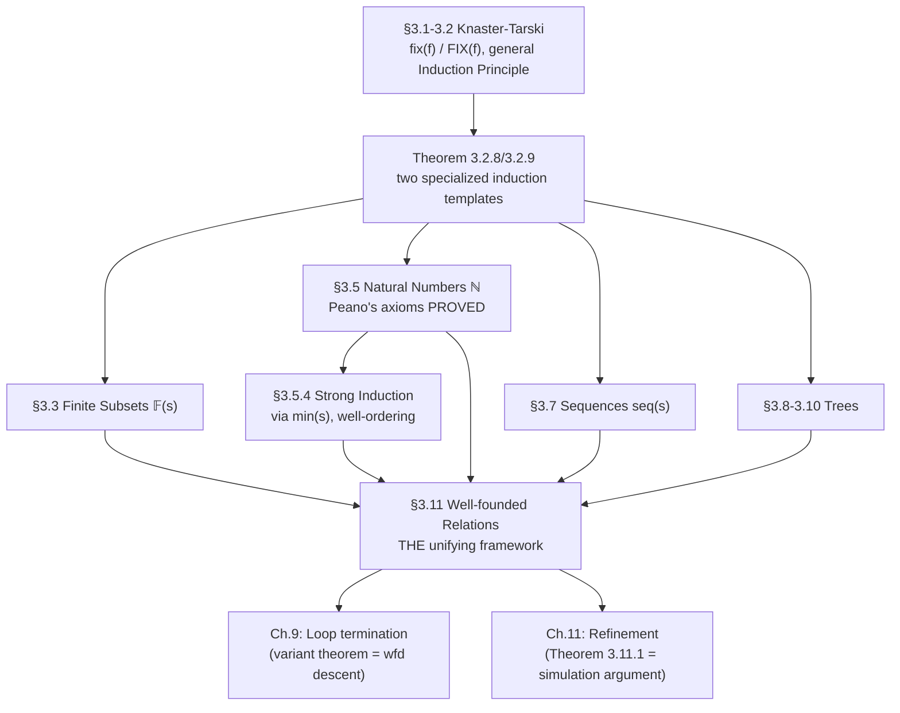

[[book-guidelines|↩ Back to guidelines]]

# Fixpoint Construction and Induction

## Why "circular" definitions need a theorem before they need a proof technique

A finite set is the empty set, or an already-finite set with one more element added. A natural number is $0$, or the successor of an already-existing natural number. A sequence is empty, or an existing sequence with one more element prepended. Every one of these definitions is *self-referential* — it defines the thing partly in terms of itself — and none of them is directly expressible as a set-comprehension $\{x \mid P\}$, because $P$ would itself need to mention the very set being defined. Abrial's insight (borrowed from Knaster–Tarski, but re-derived here from [[Algorithm-Construction-Methodology#First principles|first principles]]) is that every one of these "circular" definitions is secretly the *same* equation in disguise:

$$
x = f(x)
$$

for some monotonic set-transformer $f$ — literally, $\mathbb{N} = \{0\} \cup \text{succ}[\mathbb{N}]$, $\mathbb{F}(s) = \{\emptyset\} \cup \text{add}(s)[s \times \mathbb{F}(s)]$, $\text{seq}(s) = \{[\,]\} \cup \text{insert}(s)[s \times \text{seq}(s)]$ — three superficially different "inductive definitions" that are, underneath, one *fixpoint equation* with different choices of $f$. Once you prove, once, that fixpoint equations of this shape have well-defined solutions (Knaster–Tarski), you get: (1) *existence* of the object as a genuine, well-formed set (not a hand-wave about "the smallest set closed under..."), (2) an *induction principle* for proving universal properties of its members, and (3) a *recursion scheme* for defining total functions over it — all three, simultaneously, as consequences of one theorem, for every inductive structure the book will ever need.

This is precisely the payoff of building an inductive type via a strictly-positive functor and taking its initial algebra (or, dually, its least fixpoint in a set-theoretic setting): Abrial derives, by hand, exactly what a `data` declaration or an `inductive` definition in a modern type theory gives you for free — except here you *watch* the induction principle get manufactured from the fixpoint's definition, rather than accepting it as a primitive elimination rule.

---

## 1. The Knaster–Tarski construction: how a fixpoint equation gets solved

### Setting up the two candidate sets

For a set transformer $f \in \mathbb{P}(s) \to \mathbb{P}(s)$, a fixpoint is a set $x$ with $f(x) = x$, equivalently $f(x) \subseteq x \land x \subseteq f(x)$. Abrial's construction starts from the two extremes:

$$
\phi = \{x \mid x \in \mathbb{P}(s) \land f(x) \subseteq x\} \qquad\qquad \Phi = \{x \mid x \in \mathbb{P}(s) \land x \subseteq f(x)\}
$$

$\phi$ ("pre-fixpoints", $f$ shrinks or preserves them) always contains $s$ itself; $\Phi$ ("post-fixpoints") always contains $\emptyset$. The genuinely interesting objects are $\text{inter}(\phi)$ and $\text{union}(\Phi)$ — and the beautiful, slightly surprising result (proved by direct calculation using only monotonicity of $f$: $a \subseteq b \Rightarrow f(a) \subseteq f(b)$) is that these two extremal *bounds* are actually themselves fixpoints:

$$
\texttt{fix}(f) \;\widehat{=}\; \text{inter}(\phi) \qquad\qquad \texttt{FIX}(f) \;\widehat{=}\; \text{union}(\Phi)
$$

$$
f(\texttt{fix}(f)) = \texttt{fix}(f) \qquad \textbf{Theorem 3.2.5 (Knaster–Tarski, least fixpoint)} \qquad\qquad f(\texttt{FIX}(f)) = \texttt{FIX}(f) \qquad \textbf{Theorem 3.2.6 (greatest fixpoint)}
$$

`fix(f)` is the *least* fixpoint, `FIX(f)` the *greatest*. Abrial picks the **least** fixpoint to build mathematical objects — the reason, given explicitly, is that only the least fixpoint yields a usable induction principle (see §2 below); the greatest fixpoint is held in reserve and resurfaces in Chapter 9 for the semantics of *loops*, where "greatest fixpoint" models exactly the coinductive, possibly-nonterminating behavior a `while` loop's weakest liberal precondition needs.

**Why this matters for anything type-theory-shaped:** `fix`/`FIX` are, precisely, the initial-algebra/terminal-coalgebra pair that separates *inductive* types (finite, well-founded, built bottom-up — what `fix` gives you) from *coinductive* types (potentially infinite, built top-down/lazily — what `FIX` gives you). Every dependently-typed language's distinction between `inductive` and `coinductive`/`CoInductive` declarations is this same Knaster–Tarski duality, specialized to the category of types instead of raw sets.

```rust
// The proof-relevant content of Theorem 3.2.5, phrased operationally:
// fix(f) is characterized by two properties that any implementation
// of "the initial algebra of f" must satisfy.
trait Monotonic<T> {
    fn apply(&self, x: &Set<T>) -> Set<T>;
    // required law: a ⊆ b ⇒ apply(a) ⊆ apply(b)
}

// fix(f) = inter({ x | f(x) ⊆ x })  — computed, not just specified,
// via Kleene iteration when f is also continuous (finite/ω-chain case,
// which is exactly the case Abrial needs for ℕ, seq, trees):
fn kleene_fixpoint<T: Clone + Eq + std::hash::Hash>(
    f: &impl Monotonic<T>,
) -> Set<T> {
    let mut x = Set::empty();
    loop {
        let next = f.apply(&x);
        if next == x { return x; }   // f(x) = x reached
        x = next;
    }
}
```

### The general Induction Principle

Because $\texttt{fix}(f)$ is the *least* pre-fixpoint, proving a universal property $\forall x \cdot (x \in \texttt{fix}(f) \Rightarrow P)$ reduces (via the very definition of $\texttt{fix}$ as an intersection) to showing that the set $\{x \mid x \in \texttt{fix}(f) \land P\}$ is itself a pre-fixpoint:

$$
f(\{x \mid x \in \texttt{fix}(f) \land P\}) \subseteq \{x \mid x \in \texttt{fix}(f) \land P\} \;\;\Rightarrow\;\; \forall x \cdot (x \in \texttt{fix}(f) \Rightarrow P) \qquad \textbf{Theorem 3.2.7}
$$

This single theorem is then specialized twice, mechanically, into the two shapes every inductive structure in the chapter needs:

**First special case** (a single base point $a$, a single constructor $g: s \to s$ — this is $\mathbb{N}$'s shape):

$$
f = \lambda z \cdot (z \in \mathbb{P}(s) \mid \{a\} \cup g[z]) \qquad\Longrightarrow\qquad \frac{\forall x \cdot (x \in \texttt{fix}(f) \land P \Rightarrow [x{:=}g(x)]P)}{\forall x \cdot (x \in \texttt{fix}(f) \Rightarrow P)} \qquad \textbf{Theorem 3.2.8}
$$

This *is* the base-case/inductive-step shape of ordinary mathematical induction, derived rather than postulated: prove $P$ at $a$ (the base case, folded into how $z$ is instantiated), then prove $P$ is preserved by $g$.

**Second special case** (a base point $a$, a constructor $g: t \times s \to s$ parameterized by an *extra* set $t$ — this is $\mathbb{F}(s)$'s and $\text{seq}(s)$'s shape, where the "extra" ingredient is which element of $s$ is being added/prepended):

$$
f = \lambda z \cdot (z \in \mathbb{P}(s) \mid \{a\} \cup g[t \times z]) \qquad\Longrightarrow\qquad \frac{[x{:=}a]P \qquad \forall x \cdot (x \in \texttt{fix}(f) \land P \Rightarrow \forall u \cdot (u \in t \Rightarrow [x{:=}g(u,x)]P))}{\forall x \cdot (x \in \texttt{fix}(f) \Rightarrow P)} \qquad \textbf{Theorem 3.2.9}
$$

**Why deriving these mechanically (rather than asserting each induction principle as a separate axiom per structure) is the load-bearing move:** it's exactly the discipline that lets a proof assistant support user-defined inductive types safely — you don't hand-write a new trusted axiom every time someone declares a new `inductive Foo`; you derive `Foo`'s induction/recursion principle *once*, mechanically, from the fixpoint (initial-algebra) semantics of the constructor signature the user wrote. Abrial is doing, by hand and for a fixed small menu of shapes, exactly what Lean's/Coq's kernel does automatically and generally for arbitrary strictly-positive inductive declarations.

```lean
-- Theorem 3.2.8's shape is *exactly* what Lean's `inductive Nat` elaborator
-- derives as `Nat.rec` (and the `induction` tactic uses under the hood):
-- a base case at the nullary constructor, an inductive step across the
-- unary constructor, both packaged from the type's own constructor
-- signature rather than hand-specified per type.
inductive MyNat where
  | zero : MyNat
  | succ : MyNat → MyNat
-- MyNat.rec : {motive : MyNat → Sort*} →
--   motive .zero →                              -- base case, ~ Theorem 3.2.8's [x:=a]P
--   (∀ n, motive n → motive (.succ n)) →         -- step,       ~ [x:=g(x)]P
--   ∀ n, motive n
-- is generated automatically from the constructor list — Abrial's Theorem
-- 3.2.7→3.2.8 specialization, done generically by the kernel instead of
-- by hand for each new inductive shape.
```

---

## 2. Natural numbers: fixpoint-first, Peano's axioms proved as theorems

### Construction

With only `BIG` (the primitive infinite set) available, Abrial defines $0$ and `succ` from scratch:

$$
0 \;\widehat{=}\; BIG - BIG \qquad\qquad \texttt{succ} \;\widehat{=}\; \lambda n \cdot (n \in \mathbb{F}(BIG) \mid \{\texttt{choice}(\overline{n})\} \cup n)
$$

(where $\overline{n} = BIG - n$; well-definedness of `succ` — that $\overline{n}$ is nonempty so `choice` has something to pick — follows from $n$ being a *finite* subset of the *infinite* $BIG$, Property 3.4.1). Then, matching the "first special case" template above exactly:

$$
\texttt{genat} \;\widehat{=}\; \lambda s \cdot (s \in \mathbb{P}(\mathbb{F}(BIG)) \mid \{0\} \cup \texttt{succ}[s]) \qquad\qquad \mathbb{N} \;\widehat{=}\; \texttt{fix}(\texttt{genat})
$$

Mathematical Induction (Theorem 3.5.1) drops straight out of Theorem 3.2.8, no separate proof needed.

### Peano's five axioms — proved, not assumed

$$
0 \in \mathbb{N} \quad\text{(Peano 1)} \qquad \forall n\cdot(n\in\mathbb{N}\Rightarrow \texttt{succ}(n)\in\mathbb{N}) \quad\text{(Peano 2)} \qquad \forall n\cdot(n\in\mathbb{N}\Rightarrow \texttt{succ}(n)\neq 0) \quad\text{(Peano 3)}
$$
$$
\texttt{succ}(n)=\texttt{succ}(m)\Rightarrow n=m \quad\text{(Peano 4)} \qquad\qquad \text{Mathematical Induction} \quad\text{(Peano 5)}
$$

Peano 1, 2, and 5 fall out immediately as Property 3.5.1, Property 3.5.2, and Theorem 3.5.1 — direct instances of the general machinery. Peano 3 is a one-line consequence of `succ`'s definition ($\texttt{choice}(\overline{n}) \in \texttt{succ}(n)$ but $\texttt{choice}(\overline{n}) \notin 0 = \emptyset$). **Peano 4 (injectivity of `succ`) is the interesting one** — it needs a genuine supporting lemma chain: trichotomy ($n < m \lor n = m \lor m < n$, Property 3.5.4) is proved by induction on $n$ from a technical Property 3.5.6, which is itself proved by induction on $m$; only then does Peano 4 follow by a case split on trichotomy plus a direct membership argument ($\texttt{choice}(m)$ distinguishes $\texttt{succ}(n)$ from $\texttt{succ}(m)$ when $n < m$).

**Why "Peano's axioms are theorems, not axioms" is the whole point of the chapter, not a curiosity:** every unsoundness risk in the *axiomatic* Peano approach (could these five axioms be jointly inconsistent? does some other, unintended structure also satisfy them, e.g. via non-standard models?) simply doesn't arise here — $\mathbb{N}$ is *constructed* as a specific, concrete fixpoint of a specific, concrete monotonic function, and Peano's properties are consequences you can trace, step by step, back to the six set-theoretic axioms of Chapter 2. This is the same reason a verifier built on an inductively-defined `Nat` (as in Lean/Coq/Rust's own `enum`-based Peano encodings) is on firmer metatheoretic ground than one that simply *postulates* five Peano axioms as a black-box theory — the former's consistency is inherited from the ambient type theory's consistency; the latter's has to be argued separately (typically also by exhibiting a model, which is exactly what Abrial does here).

---

## 3. Strong induction and well-ordering: min/max as the connective tissue

$\texttt{min}(s) \;\widehat{=}\; \text{inter}(s)$ for nonempty $s \in \mathbb{F}_1(\mathbb{N})$ is a lower bound by construction (Theorem 3.1.1's generalized-intersection property); the extra work is proving $\texttt{min}(s) \in s$ — i.e. that the greatest-lower-bound is *achieved*, not merely approached — which for $\mathbb{N}$'s well-ordering needs its own inductive argument (Property 3.5.8/3.5.9). Once that's in hand, **Strong Induction** (Theorem 3.5.2) is proved by a genuinely elegant *reductio*: assume some $n$ fails property $P$; let $z$ be the set of all such failures; $z$ is nonempty, so $\texttt{min}(z)$ exists and is *itself* a member of $z$ (fails $P$); but strong induction's hypothesis says $P$ holds at $\texttt{min}(z)$ *because* it holds at every $m < \texttt{min}(z)$ — vacuously true, since nothing in $z$ is smaller than its own minimum — contradiction.

$$
\frac{\forall n \cdot \big(n \in \mathbb{N} \land \forall m \cdot (m \in \mathbb{N} \land m < n \Rightarrow [n{:=}m]P) \Rightarrow P\big)}{\forall n \cdot (n \in \mathbb{N} \Rightarrow P)} \qquad \textbf{Theorem 3.5.2, Strong Induction}
$$

**Why this specific proof pattern is worth internalizing:** "assume a counterexample exists, take a minimal one, derive that it can't actually be minimal (or can't actually be a counterexample)" is the exact shape of a **[[Semantics-of-Generalized-Substitutions#Termination|termination]] argument via well-founded descent** — precisely the technique a Hoare-logic loop-variant proof uses (Chapter 9 will formalize this directly), and precisely the technique CEGAR-style / SMT-based termination provers automate: exhibit a ranking function into a well-founded order, show every transition strictly decreases it, conclude no infinite bad sequence exists. Strong induction and well-founded descent are two faces of the same coin, and this proof makes the coin visible.

---

## 4. Recursive function definition: building `f` as a relation, then proving it total

### The construction

Given $a \in s$ and total $g: s \to s$, wanting $f: \mathbb{N} \to s$ with $f(0) = a$, $f(\texttt{succ}(n)) = g(f(n))$: Abrial does *not* define $f$ directly as a function — he defines a monotonic relation transformer

$$
\texttt{genf}(a,g) \;\widehat{=}\; \lambda h \cdot (h \in \mathbb{P}(\mathbb{N}\times s) \mid \{0 \mapsto a\} \cup (\texttt{pred};h;g))
$$

takes its least fixpoint $f = \texttt{fix}(\texttt{genf}(a,g))$ — at this point $f$ is *only known to be a binary relation* — and then separately proves, **by ordinary mathematical induction on $n$** (Theorem 3.5.3), that this relation is in fact a *total function* $\mathbb{N} \to s$. **This two-step discipline (construct as a relation via fixpoint, then prove totality/functionality as a separate theorem) is the precise blueprint for how a verified compiler justifies compiling recursion into an actual computable function**: you don't get to assume your recursive definition terminates and is well-defined just because you wrote `f(succ(n)) = g(f(n))` — you have to *prove* the relation you get from unfolding that equation is single-valued and total. This is exactly the termination-checking obligation every total-functional-language elaborator (Lean's, Agda's, Coq's `Fixpoint` guardedness/decreasing-argument check) discharges before accepting a recursive definition — Abrial just makes the proof obligation fully explicit and hand-discharged rather than automated.

```rust
// The relation-first, prove-totality-second discipline as a Rust sketch.
// `genf` builds a *relation* (as a graph); only after proving it total
// (which in Rust's total, terminating-by-construction functions is
// enforced by the type system + the compiler's own termination check
// for structural recursion) do we get to treat it as `fn`.
fn genf<S: Clone>(a: S, g: impl Fn(S) -> S, n: u64) -> S {
    // This *is* the unique total function satisfying f(0)=a, f(succ n)=g(f(n));
    // Rust's structural-recursion-on-u64-via-loop termination check plays
    // the role Theorem 3.5.3 plays for Abrial: a totality proof discharged
    // once, mechanically, rather than trusted per-definition.
    let mut acc = a;
    for _ in 0..n { acc = g(acc); }
    acc
}
```

### Well-founded recursion: the fully general version

Section 3.11.3 generalizes this from $\mathbb{N}$ to an arbitrary set $s$ well-founded by a relation $r$: given $g: (s \rightharpoonup t) \to t$, there's a unique $f: s \to t$ with $f(x) = g(r[\{x\}] \lhd f)$ — "the value of $f$ at $x$ depends on the values of $f$ at $x$'s $r$-predecessors." The construction again goes relation-first (`res(f)`, a fixpoint equation $f = g \circ \texttt{res}(f) \circ \texttt{image}(r)$, Knaster–Tarski for existence, then well-founded induction to prove totality) — this is the **general recursion scheme** that subsumes natural-number recursion, sequence recursion, and tree recursion (§7 below) as special cases, and it's demonstrated on the **Ackermann function** as the canonical example of recursion that is *not* structural in the naive sense (the recursive calls don't obviously decrease a single simple measure) but *is* well-founded under the lexicographic order on $\mathbb{N} \times \mathbb{N}$.

---

## 5. Well-founded relations: the unifying framework

### The definition, arrived at from two complementary intuitions

Abrial motivates well-foundedness from two angles that turn out to be equivalent: (1) *construction never cycles* (building up from smaller pieces never lets you reach a piece you started from), and (2) *destruction always terminates* (tearing an object down into constituent pieces bottoms out after finitely many steps, with no infinite descending chain). [[Refinement-Theory#The formal definition|The formal definition]] captures the *non-existence of a nonempty, entirely self-sustaining* subset:

$$
\texttt{wfd}(r) \;\widehat{=}\; \forall p \cdot \big(p \in \mathbb{P}(s) \land p \subseteq r^{-1}[p] \Rightarrow p = \emptyset\big)
$$

i.e., the only subset $p$ where *every* element of $p$ has an $r$-related element also in $p$ (a subset entirely "sustained" by its own members — a candidate for an infinite descending chain) is the empty set. Two equivalent reformulations via `inter`/`union` echo the `fix`/`FIX` duality of §1 exactly, underscoring that well-foundedness *is* a fixpoint condition in the same technical sense as everything else in this chapter.

### The Well-founded Set Induction Rule: the chapter's actual capstone

$$
\frac{\forall x \cdot \big(x \in s \land \forall y \cdot (y \in r[\{x\}] \Rightarrow P(y)) \Rightarrow P(x)\big)}{\forall x \cdot (x \in s \Rightarrow P(x))} \qquad \textbf{The Well-founded Set Induction Rule}
$$

Every induction principle in the chapter — mathematical induction on $\mathbb{N}$, finite-set induction, strong induction, sequence induction, tree induction (all three tree flavors) — is a **special case of this one rule**, obtained by choosing the right well-founded $r$ ($r = \texttt{succ}^{-1}$ restricted appropriately for $\mathbb{N}$; $r$ = "removed one element" for finite sets; the subtree relation for trees). Abrial deliberately delays presenting this unifying rule until *after* deriving each special case by hand (§§3.3–3.10), a pedagogical choice worth noting: seeing the pattern repeat concretely five separate times makes the eventual generalization feel earned rather than handed down.

**This is precisely the theoretical foundation a general-purpose termination/recursion checker needs**, and it maps directly onto the project's stated interest in *structural tractability* and reachability analysis:

- A **well-founded relation is a ranking/measure function's domain** — proving `wfd(r)` for some order is exactly what a variant/ranking-function-based termination prover establishes to certify a loop or recursive call terminates (this is made fully explicit three chapters later, in Chapter 9's loop-termination theory, which reuses this section's machinery directly).
- **Theorem 3.11.1** (well-foundedness transfers across a *total* relation $v$ satisfying $v^{-1};r' \subseteq r;v^{-1}$) is the abstract shape of a **simulation/refinement argument for termination**: if you can map a new system's states into an already-known-terminating system's states such that every step in the new system corresponds to a step (or non-step) in the old one, the new system inherits termination. This is structurally the same move as a **Galois connection**-based abstract interpretation soundness proof — a relation linking concrete and abstract domains, with a commutation condition ensuring properties transfer across the abstraction.
- The **Ackermann function example** demonstrates that "terminates" and "structurally recursive on a single argument" are *not* the same requirement — well-founded recursion under a lexicographic (or any well-founded) order is strictly more general than naive structural recursion, which matters directly for a constraint-solving kernel that needs to justify termination of search procedures whose "obvious" decreasing measure isn't a single natural number.

```rust
// The general well-founded recursion scheme (§3.11.3), as an interface —
// this is the abstract contract a termination-checking elaborator has to
// verify is satisfied before accepting *any* recursive definition, whether
// structural or measure-based (Ackermann-style).
trait WellFounded<T> {
    // r[{x}]: the "predecessors" / constructing points of x.
    fn predecessors(&self, x: &T) -> Vec<T>;
    // Proof obligation (not checkable by the type system alone in general —
    // this is exactly the gap a termination-checking algorithm must close):
    // no infinite chain x0, x1, x2, ... with x_{i+1} ∈ predecessors(x_i).
}

fn well_founded_recursion<T: Clone, U, W: WellFounded<T>>(
    wf: &W,
    x: &T,
    g: &impl Fn(&T, &dyn Fn(&T) -> U) -> U,
) -> U {
    // f(x) = g(x, |predecessor -> f(predecessor)|) — Property 3.11.1's
    // res(f) made concrete: g consumes the *restriction* of f to x's
    // r-predecessors, never f itself unrestricted (which would beg the
    // termination question).
    let recurse = |y: &T| well_founded_recursion(wf, y, g);
    g(x, &recurse)
}
```

---

## 6. Finite subsets and finite/infinite sets: the second fixpoint template in action

$\mathbb{F}(s) = \texttt{fix}(\texttt{genfin}(s))$ with $\texttt{genfin}(s) = \lambda z \cdot (z \in \mathbb{P}(\mathbb{P}(s)) \mid \{\emptyset\} \cup \texttt{add}(s)[s \times z])$ is a direct instance of the "second special case" template (Theorem 3.2.9), giving Finite Set Induction (Theorem 3.3.1) essentially for free: prove $P$ at $\emptyset$, then prove $P$ is preserved by adding any single element. $\texttt{finite}(s) \;\widehat{=}\; s \in \mathbb{F}(s)$ and $\texttt{infinite}(s) \;\widehat{=}\; \lnot \texttt{finite}(s)$ give a purely inductive characterization of finiteness — worth contrasting with Dedekind's classical alternative (a set is infinite iff it's in bijection with a proper subset of itself, Theorem 3.4.1), which the chapter proves *implies* (but leaves the converse as an exercise) the inductive definition. That two independently-motivated notions of "infinite" coincide is itself a small but real consistency check on the whole framework — a sanity property analogous to checking two independently-stated operational and denotational semantics agree.

---

## 7. Sequences and trees: the same recipe, twice more

**Finite sequences**: $\text{seq}(s) = \texttt{fix}(\texttt{genseq}(s))$, built from $[\,] \in \text{seq}(s)$ and $\forall(x,t)\cdot((x,t)\in s\times\text{seq}(s) \Rightarrow (x{\to}t)\in\text{seq}(s))$ — again the "second special case" template, with `insert` as the constructor and Theorem 3.7.1 as the resulting induction principle (base case at $[\,]$, step preserving prepend by any $s$-element). A **direct** (non-inductive) construction is also given — $\text{seq}(s) = \bigcup n \cdot (n \in \mathbb{N} \mid (1..n) \to s)$, sequences as functions from an initial segment of $\mathbb{N}$ — and the chapter leaves it as understood (rather than belabored) that the two constructions denote the same set; this is the same "inductive definition vs. direct characterization, provably coincident" pattern as finite/Dedekind-infinite above.

**Trees** (finite, then labelled, then binary) repeat the recipe a third time, each with its own base case (a leaf / the empty tree) and constructor (assembling a finite sequence of already-given subtrees), each inheriting an induction and recursion principle by the same mechanism. By the time the chapter reaches trees, the pattern is thoroughly familiar — which is exactly the point of §3.11's eventual unification: five separate hand-built instances of "prove the base case, prove the constructor preserves it" are all secretly the Well-founded Set Induction Rule, specialized five different ways.

---

## Where this leads



Every later chapter that needs "this process terminates" or "this recursive/loop construct is well-defined" reaches directly back into §3.11: Chapter 9's loop-termination proof rule is the Well-founded Set Induction Rule applied to program executions; Chapter 11's [[Refinement-Theory|refinement theory]] reuses Theorem 3.11.1's simulation-transfer pattern almost verbatim. For the compiler/elaborator/verifier project, this chapter is where the abstract machinery for **every termination argument the toolchain will ever need to construct or check** gets built once, from first principles, and proved sound — a CEGAR loop's progress measure, a ranking function synthesized by an invariant generator, a structural-recursion check in the elaborator's kernel, and an abstract-interpretation Galois-connection soundness argument are all, underneath, instances of well-founded induction exactly as formalized here.

---

*Style/goals config applied: `vaults/.article-style.md` (workbench-wide — Rust primary for the executable fixpoint/recursion sketches, Lean promoted for the inductive-type correspondence, Mermaid for the structural diagram) and `vaults/.learning-goals.md` (workbench-wide — emphasis on termination arguments, well-founded descent, and the initial-algebra/inductive-type connection load-bearing for the elaborator and CSP/abstract-interpretation kernel). No book-specific style or goals file exists for this book.*
