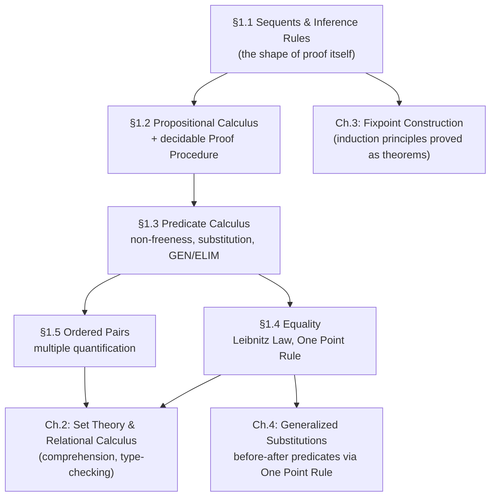

[[book-guidelines|↩ Back to guidelines]]

# Formal Proof and Predicate Logic

## Why a software-construction book opens with pure logic

Abrial's stated project is to make every stage of software [[Fixpoint-Construction-and-Induction#Construction|construction]] — specification, programming, refinement — carry a proof of correctness alongside it. The moment you commit to that, you face a problem that has nothing to do with software yet: *proofs, like programs, are formal texts, and formal texts can contain bugs.* If you're going to produce hundreds or thousands of correctness proofs across a real system, sloppy or "convincing-looking" proofs are exactly as dangerous as sloppy code — arguably more dangerous, because a proof is supposed to be the thing that catches the bug, not another place for one to hide.

The fix Abrial reaches for is the one theorem-proving toolchains still reach for today: make the *notion of proof itself* mechanically checkable. Not "convincing to a mathematician," but reducible to a fixed, finite set of syntactic rules that a program (a **trusted kernel**, in modern terms) can verify without understanding a word of the underlying mathematics. Chapter 1 builds exactly that machinery, bottom-up: first the shape of a proof in the abstract (sequents, inference rules), then a full account of two logics built on top of that shape (propositional and first-order predicate calculus), then equality, then a notational device (ordered pairs / multiple quantification) needed for everything that follows.

If you've used Lean, Coq, or Isabelle, you already know where this is going: this chapter is Abrial re-deriving, from scratch, the sequent-calculus / natural-deduction foundation that those systems' kernels implement in a few hundred lines of trusted code. Everything else — the B-Method's abstract machines, generalized substitutions, refinement — sits *on top of* this chapter's proof theory. If chapter 1's rules are unsound, nothing built afterward means anything.

---

## 1. Sequents: what "provable under assumptions" means, formally

### The problem it solves

Ordinary mathematical statements ("if $n$ is a natural number, $n \geq 0$") are almost never proved in a vacuum — they're proved *relative to* a set of assumptions. Before you can define proof rules, you need a syntax that pins down, explicitly, "this conclusion, under exactly these hypotheses" — otherwise "provable" is an ambiguous, context-dependent notion that a checker can't pin down.

### The formal device

A **sequent** is a formal object

$$
HYP \vdash P
$$

where $HYP$ is a (possibly empty, possibly infinite in principle but always finite in any actual proof) collection of **predicates** (formulas subject to proof) and $P$ is the **conclusion** or **goal** predicate. Read it as "$HYP$ entails $P$." At this stage $P$ and the members of $HYP$ are left completely abstract — denoted by meta-linguistic variables like $P$, $Q$ — because Abrial hasn't yet defined *any* concrete syntax for predicates. This is a deliberate layering move: the *shape* of proof (sequents, inference, axioms) is defined before any particular *logic* (propositional, predicate, equality) is defined to run inside that shape.

**What this maps to in a checker's data model:** a sequent is exactly the `Judgment` type at the heart of any proof assistant's kernel — a context plus a goal. If you've seen Lean's `Ctx ⊢ e : T` or a Hoare triple `{P} S {Q}`, you're looking at sequents with extra payload (types, programs) riding along on the same skeleton.

```rust
// The sequent skeleton, before any concrete Predicate syntax exists.
// Generic over the payload so it can later host propositional formulas,
// predicate-calculus formulas, or eventually B's before-after predicates.
struct Sequent<Pred> {
    hyp: Vec<Pred>,   // HYP: the hypothesis collection
    goal: Pred,       // P: the conclusion
}
```

```lean
-- Lean's own judgment form is a direct descendant of exactly this idea:
-- a local context (the HYP collection) entailing a goal.
-- `Ctx ⊢ P` is spelled, in Lean's actual metatheory, as a `MetaM` goal
-- with a `LocalContext` — the same "collection of hypotheses, one conclusion"
-- shape Abrial introduces here.
```

---

## 2. Inference rules: derivation vs. reduction, and the special case of axioms

### The problem it solves

Given the sequent skeleton, you need a *mechanism* for establishing that a particular sequent holds. "Whatever seems convincing" is not mechanizable. Abrial's answer: a rule relates some number of *antecedent* sequents to one *consequent* sequent, and a proof is nothing but a systematic, terminating chain of rule applications.

### The formal device

An inference rule is written

$$
\frac{S_1 \quad \cdots \quad S_n}{S}
$$

where $S_1, \ldots, S_n$ (the antecedents) and $S$ (the consequent) are all sequents. Read forward, the horizontal bar is a *derivation* symbol: proofs of the antecedents give you a proof of the consequent. Read backward, it's a *reduction* symbol: to prove $S$, it suffices to prove $S_1, \ldots, S_n$. Both readings are the same rule — which direction you use it in is a choice made at proof-construction time, not a property of the rule itself.

A rule with **zero antecedents** is an **axiom** — its consequent is asserted outright, with no further obligation. Once a sequent is proved, it's called a **theorem** and can be folded back into the rule collection exactly as if it had been an axiom; a proved *inference rule* (not just a proved sequent) is a **derived rule**, obtained by treating the rule's own antecedents as extra axioms and proving its consequent relative to that extended collection.

**Why this distinction matters for proof search / automation (a load-bearing point for anything checker-shaped):** the forward/backward duality is exactly the split between *proof checking* (walk a derivation forward, confirming each step matches a rule) and *proof search / tactic execution* (start from the goal, apply rules backward, generate subgoals). Every tactic-based prover — Lean's `tacticSeq`, Coq's `Ltac`, or a hand-rolled backward-chaining solver — is doing "backward rule application" in exactly Abrial's sense, and the resulting proof term, when it's checked later by a trusted kernel, is read in the *forward* direction. This is the seed of the **proof-producing architecture** distinction that matters enormously for a verifier's trusted computing base: the tactic engine that searches backward can be buggy and slow, as long as the artifact it emits is checked forward by a small, trusted, forward-only kernel.

```rust
// A rule: some number of antecedent sequents license one consequent sequent.
// Zero antecedents = axiom.
struct Rule<Pred> {
    antecedents: Vec<Sequent<Pred>>,
    consequent: Sequent<Pred>,
}

// Backward search (tactic-style): given a goal sequent, find a rule whose
// consequent unifies with it, and recursively search its antecedents.
// This is untrusted — it can be slow, heuristic, wrong.
fn backward_search<P: Clone + PartialEq>(
    goal: &Sequent<P>,
    rules: &[Rule<P>],
) -> Option<ProofTree<P>> {
    for rule in rules {
        if rule.consequent_matches(goal) {
            let subproofs: Option<Vec<_>> = rule
                .antecedents
                .iter()
                .map(|s| backward_search(s, rules))
                .collect();
            if let Some(subproofs) = subproofs {
                return Some(ProofTree::Node(rule.clone(), subproofs));
            }
        }
    }
    None
}

// Forward checking (kernel-style): walk a completed proof tree and confirm
// every node really is an instance of a real rule. This is the trusted part.
fn check<P: PartialEq>(tree: &ProofTree<P>, rules: &[Rule<P>]) -> bool {
    match tree {
        ProofTree::Node(rule, subproofs) => {
            rules.contains(rule)
                && subproofs.iter().zip(&rule.antecedents)
                    .all(|(t, s)| check(t, rules) && t.root_sequent() == s)
        }
    }
}
```

```lean
-- In Lean this split is completely literal: `Expr` proof terms are checked
-- forward by the kernel's `isDefEq`/typechecking pass; tactics build those
-- terms by backward goal manipulation and are entirely untrusted — a bug
-- in a tactic can only ever produce a term the kernel then rejects, never
-- a term that "lies" and gets accepted. Abrial's axiom/theorem distinction
-- is the ancestor of Lean's `axiom` vs. `theorem` declarations: an axiom is
-- asserted with no derivation obligation (and is tracked as such — Lean
-- literally records which axioms a proof depends on), a theorem must
-- reduce, by kernel-checkable steps, to axioms and prior theorems.
```

---

## 3. The Basic Rules (BR1–BR4): logic-independent scaffolding

Before introducing any connective, Abrial isolates four rules that hold no matter what domain of mathematics the predicates come from — they express only the *mechanics* of entailment itself:

| Rule | Statement | Reading |
|---|---|---|
| **BR1** | $P \vdash P$ | Assuming $P$ proves $P$ — pure reflexivity of entailment. |
| **BR2** | $\dfrac{HYP \vdash P \quad HYP \subseteq HYP'}{HYP' \vdash P}$ | Monotonicity: adding hypotheses never destroys an existing proof. |
| **BR3** | $\dfrac{P \text{ occurs in } HYP}{HYP \vdash P}$ | Anything already assumed is *ipso facto* proved (a corollary of BR1 + BR2). |
| **BR4** | $\dfrac{HYP \vdash P \quad HYP, P \vdash Q}{HYP \vdash Q}$ | "Cut": if $P$ is provable and $Q$ follows once $P$ is assumed, $Q$ follows outright. |

**What breaks without BR2 (monotonicity):** if adding a hypothesis could *invalidate* an existing proof, backward reasoning ("assume $P$, try to prove $Q$") would be unsound in general — every proof would need to be re-checked against every possible future hypothesis set. Note Abrial's careful remark here: monotonicity holds *even if* $HYP'$ turns out to be contradictory. A contradictory hypothesis set proves *everything* (including $\lnot P$), so it certainly still proves $P$ — monotonicity doesn't get violated by contradiction, it gets trivially satisfied by it. This is the seed of the later "contradictory hypotheses prove anything" result in §1.2.2 (`ex falso quodlibet`), and it matters practically: in a verifier, a genuinely contradictory context (e.g. an unsatisfiable set of Hoare-logic preconditions) is not a bug in the proof system — it's a signal that the corresponding program path is unreachable, and SMT-based invariant generators rely on exactly this to discharge dead-code paths trivially.

BR4 (cut) is the rule that licenses "prove an auxiliary lemma, then use it" — the everyday practice of introducing a helper fact mid-proof. It's normally applied backward: to prove $Q$ under $HYP$, it suffices to prove $Q$ under $HYP$ *enlarged with a new hypothesis* $P$, provided you separately discharge $P$ under $HYP$. Choosing a good $P$ is explicitly flagged as the creative, non-mechanical part of proof construction — a theme that recurs throughout the chapter (see §6 below on instantiation).

```python
# BR4 (cut) as a proof-search combinator: split a goal into "prove a lemma"
# and "prove the goal assuming the lemma." This is the abstract shape of
# every `have`/`suffices` tactic in a modern prover.
def cut(hyp, lemma_pred, goal, prove_lemma, prove_goal_with_lemma):
    proof_of_lemma = prove_lemma(hyp, lemma_pred)          # HYP ⊢ P
    proof_of_goal = prove_goal_with_lemma(hyp + [lemma_pred], goal)  # HYP,P ⊢ Q
    return CutProof(proof_of_lemma, proof_of_goal)          # HYP ⊢ Q
```

---

## 4. Propositional Calculus: connectives, rules, and the mechanized Proof Procedure

### 4.1 Syntax and rules per connective

Abrial's base syntax has exactly three primitive connectives — conjunction ($\land$), implication ($\Rightarrow$), negation ($\lnot$) — with $\lnot$ binding tightest, then $\land$, then $\Rightarrow$ (all right-associating is *not* assumed; binary operators associate left unless stated otherwise). Disjunction ($\lor$) and equivalence ($\Leftrightarrow$) are introduced later as pure syntactic *rewrites*, not new primitives:

$$
P \lor Q \;\;\widehat{=}\;\; \lnot P \Rightarrow Q \qquad\qquad P \Leftrightarrow Q \;\;\widehat{=}\;\; (P \Rightarrow Q) \land (Q \Rightarrow P)
$$

This minimalism is a real methodological choice, not laziness: fewer primitive connectives means fewer inference rules to prove sound, and every property of $\lor$/$\Leftrightarrow$ falls out for free from the properties of $\land$/$\Rightarrow$/$\lnot$ already established. It's the same instinct behind minimizing a proof kernel's trusted primitive set — every derived construct you *don't* have to axiomatize is a construct that can't independently harbor a soundness bug.

Each connective gets an introduction and an elimination rule:

- **CNJ** ($\land$-intro, Rule 1): $\dfrac{HYP \vdash P \quad HYP \vdash Q}{HYP \vdash P \land Q}$ — splits a conjunctive goal into two.
- **$\land$-elim** (Rules 2, 2′): from $HYP \vdash P \land Q$ derive $HYP \vdash P$ and $HYP \vdash Q$ separately (used forward).
- **DED** ($\Rightarrow$-intro, Rule 3): $\dfrac{HYP, P \vdash Q}{HYP \vdash P \Rightarrow Q}$ — the deduction theorem, applied backward: to prove $P \Rightarrow Q$, assume $P$ and prove $Q$.
- **MP** (Modus Ponens, derived from Rule 4 + BR4): $\dfrac{HYP \vdash P \quad HYP \vdash P \Rightarrow Q}{HYP \vdash Q}$.
- **CTR** (reductio, Rules 5/6): proof by contradiction, in two symmetric forms depending on whether the current goal is negated.

DED deserves a beat of attention because it is, structurally, the single most important rule for anything you'll build later: it's the **implication-introduction** rule that every typed lambda calculus's function-introduction rule (via Curry–Howard) is a direct descendant of. `HYP, P ⊢ Q` proving `HYP ⊢ P ⇒ Q` is exactly `Γ, x:A ⊢ e:B` proving `Γ ⊢ (λx.e):A→B`. This is not a metaphor Abrial draws — the book stays purely proof-theoretic — but it's the connection worth holding onto: a Hoare-style refinement proof and a dependently-typed program are, underneath, discharging the same shape of obligation.

### 4.2 The Proof Procedure: turning propositional logic into a decision procedure

Section 1.2.4's central result is that all eight of the chapter's theorems about negation-pushing reduce to **derived rules** (DR1–DR8), each of which strictly *simplifies* a goal (a negated conjunction becomes an implication; an implicative goal's antecedent gets simplified). Applying these, plus DED, in a *fixed priority order*

$$
\texttt{BS1, BS2, DB1, DB2, DR1}, \ldots, \texttt{DR8}, \texttt{CNJ}, \texttt{DED}
$$

turns propositional proof into a genuine **decision procedure**: apply the highest-priority applicable rule at every step; the process terminates either in success (the goal already matches a hypothesis, via BS1/BS2), in a detected contradiction, or in unavoidable failure. There is no branching choice left to intuition anywhere in this loop — this is precisely why Abrial can say propositional proof "can be made checkable by a robot." DB1/DB2 are an extra optimization: if $\lnot P$ (resp. $P$) already occurs among the hypotheses, a contradiction-goal of the form $P \Rightarrow R$ (resp. $\lnot P \Rightarrow R$) is discharged immediately rather than opening a fresh reductio.

**What this maps to in a checker's implementation:** this *is* a DPLL-style propositional decision procedure, phrased as a sequent-calculus tactic loop rather than as clause-set resolution — the same completeness guarantee, different presentation. If you're building a proof-search or verification-condition-discharging component, this section is the historical/conceptual ancestor of "run a SAT solver on the propositional skeleton before invoking anything more expensive."

```rust
// The fixed-priority tactic loop of section 1.2.4, as an actual decision
// procedure. Because every step strictly reduces the size of the (sub)goal,
// this always terminates — propositional validity is decidable, and this
// *is* the decision procedure, not just a heuristic search.
enum Step { Discharged, Contradiction, Reduced(Vec<Sequent<Pred>>), Stuck }

fn proof_procedure_step(seq: &Sequent<Pred>) -> Step {
    if let Some(_) = seq.goal_matches_hypothesis() { return Step::Discharged; }       // BS1/BS2
    if let Some(new_goals) = seq.try_db_shortcut()  { return Step::Reduced(new_goals); } // DB1/DB2
    if let Some(new_goals) = seq.try_dr_rules()     { return Step::Reduced(new_goals); } // DR1..DR8
    if let Some(new_goals) = seq.try_cnj()          { return Step::Reduced(new_goals); }
    if let Some(new_goal)  = seq.try_ded()          { return Step::Reduced(vec![new_goal]); }
    Step::Stuck // only reached if HYP is contradictory in a way not yet caught, or genuinely invalid
}
```

### 4.3 Classical results catalogue

Section 1.2.6 lists the standard algebra of $\land, \lor, \Rightarrow, \Leftrightarrow, \lnot$: commutativity, associativity, distributivity of $\land$ over $\lor$ and vice versa, excluded middle ($P \lor \lnot P$), idempotence, absorption, De Morgan, contraposition, double negation, and monotonicity/congruence properties (e.g. $P \Leftrightarrow Q \Rightarrow (P \land R \Leftrightarrow Q \land R)$). The last group — that provable equivalence licenses substitution *inside* any surrounding predicate — is what lets equivalence be used "operationally as if it were a rewriting rule" from here on: this is definitional/propositional rewriting in miniature, the same privilege that lets a `simp` set or a `rfl`-closure rewrite subterms freely once an equality is established.

---

## 5. Predicate Calculus: quantifiers, non-freeness, and substitution

This is the section with the highest direct payoff for anything elaborator- or unifier-shaped, because non-freeness and substitution are exactly the "variable plumbing" that a real implementation has to get right under the hood of `isDefEq`, capture-avoiding substitution, and De Bruijn indexing.

### 5.1 Two new syntactic categories, and a crucial distinction

[[Set-Theory-and-the-Relational-Calculus#The syntax|The syntax]] is extended with **Expression** and **Variable** as categories distinct from **Predicate**:

$$
\text{Predicate} ::= \cdots \mid \forall\, \text{Variable} \cdot \text{Predicate} \mid [\text{Variable} := \text{Expression}]\,\text{Predicate}
$$
$$
\text{Expression} ::= \text{Variable} \mid [\text{Variable} := \text{Expression}]\,\text{Expression}
$$

Abrial is explicit and insistent about the distinction: **a Predicate is subject to proof and denotes nothing; an Expression denotes a mathematical object and is not subject to proof.** This is not a stylistic aside — it's a strict two-sort discipline that the whole book's type system rides on (and it's the direct ancestor of `Prop` vs. non-`Prop` sorts, or of the classifying distinction between a judgment and a term in a typed calculus). A checker that conflates "this thing type-checks" with "this thing evaluates to a value" has conflated exactly the two categories Abrial keeps rigorously apart here.

A **Variable** occurring in a predicate can be eliminated in two dual ways: **generalizing** it (prefixing with $\forall x \cdot$) or **specializing** it (prefixing with a substitution $[x := E]$). This duality — quantification vs. instantiation — is the entire content of what a metavariable-based elaborator does: a metavariable is a variable held open for later specialization, and unification is the process of discovering the substitution that specializes it correctly. Every metavariable in a bidirectional elaborator is, underneath, exactly a Predicate-Calculus variable waiting for its `[x := E]`.

### 5.2 Non-freeness: the formal notion behind "this variable is really unknown"

**[[Set-Theory-and-the-Relational-Calculus#The problem it solves|The problem it solves]]:** in $\forall x \cdot P$, $x$ is a *dummy* — renaming it changes nothing, and substituting *into* it makes no sense (there's nothing free left to replace). You need a syntactic, mechanically checkable notion of "which occurrences of a variable are actually free (substitutable) vs. bound (dummy)" before substitution can even be defined without ambiguity.

**Definition:** $x$ has a free occurrence in a formula $F$ if it occurs in $F$ outside the scope of any quantifier binding that same $x$; $x \backslash F$ ("$x$ is non-free in $F$") means no free occurrence exists. The rules NF1–NF8 define this recursively over syntax — most importantly:

$$
\text{NF5: } x \backslash \forall x \cdot P \qquad \text{NF6: } x \backslash \forall y \cdot P \iff x \backslash y \land x \backslash P \qquad \text{NF7: } x \backslash [x{:=}E] F \qquad \text{NF8: } x \backslash [y{:=}E] F \iff x\backslash y \land x\backslash E \land x\backslash F
$$

**Why this is load-bearing, not bookkeeping:** every unsoundness in a naive substitution-based system traces back to skipping exactly this check. This is variable capture, full stop — the same failure mode that De Bruijn indices exist to make structurally impossible, and that a Miller-pattern unifier's "distinct bound variables" restriction exists to keep decidable.

### 5.3 Substitution: rules by structural case, and the capture-avoidance side condition

$[x := E]F$ is defined by recursion on $F$'s structure (SUB1–SUB7):

$$
[x{:=}E]x = E \qquad [x{:=}E]y = y \;\text{ if } x\backslash y \qquad [x{:=}E](P \land Q) = [x{:=}E]P \land [x{:=}E]Q \qquad [x{:=}E]\forall x \cdot P = \forall x \cdot P
$$

$$
[x{:=}E]\forall y \cdot P = \forall y \cdot [x{:=}E]P \quad\text{ if } y \backslash x \text{ and } y \backslash E \qquad \textbf{(SUB7 — the critical case)}
$$

SUB7's side condition ($y \backslash E$, i.e. the bound variable $y$ must not occur free in the thing being substituted in) is the textbook capture-avoidance clause. Abrial doesn't just state it — he demonstrates the unsoundness of skipping it with a worked counterexample: substituting $[n := m]$ into $n \in \mathbb{N} \Rightarrow \forall m \cdot (m \in \mathbb{N} \Rightarrow m = n)$ *without* renaming the bound $m$ first turns a true statement ("not every natural equals a fixed $n$") into the false statement $\forall m \cdot (m \in \mathbb{N} \Rightarrow m = m)$'s negation-flavored twin — the free $m$ being substituted in gets silently captured by the $\forall m$. **This is precisely the bug class a capture-avoiding-substitution implementation (or De Bruijn indices, which sidestep the problem by construction) exists to prevent**, and it's exactly what breaks in a hand-rolled elaborator that does textual substitution instead of tracking binder depth.

The fix when capture threatens: **alpha-conversion** — rename the bound variable to a fresh one not occurring in $E$ or $P$ before substituting:

$$
[x{:=}E]\forall y \cdot P \;=\; \forall z \cdot [x{:=}E][y{:=}z]P \qquad (z \text{ fresh: } z\backslash E,\, z\backslash P)
$$

```rust
// Capture-avoiding substitution — SUB1..SUB7 as executable Rust, using a
// fresh-name generator to implement the alpha-conversion fallback of SUB7.
// This is the load-bearing routine any elaborator/unifier is built on top of.
enum Pred {
    Var(String),
    And(Box<Pred>, Box<Pred>),
    Forall(String, Box<Pred>),
    // ...
}

fn subst(x: &str, e: &Pred, p: &Pred, fresh: &mut impl FnMut() -> String) -> Pred {
    match p {
        Pred::Var(y) if y == x => e.clone(),          // SUB1
        Pred::Var(y) => Pred::Var(y.clone()),          // SUB2 (x \ y)
        Pred::And(a, b) => Pred::And(
            Box::new(subst(x, e, a, fresh)),
            Box::new(subst(x, e, b, fresh)),
        ),                                              // SUB3
        Pred::Forall(y, body) if y == x => p.clone(),  // SUB6: x is bound here, stop
        Pred::Forall(y, body) if !free_in(y, e) => {    // SUB7: safe, no capture
            Pred::Forall(y.clone(), Box::new(subst(x, e, body, fresh)))
        }
        Pred::Forall(_y, body) => {                     // SUB7 violated: alpha-convert first
            let z = fresh();
            let renamed = subst(_y, &Pred::Var(z.clone()), body, fresh);
            Pred::Forall(z, Box::new(subst(x, e, &renamed, fresh)))
        }
    }
}
```

```lean
-- Lean's kernel sidesteps the entire SUB7 problem by using de Bruijn indices
-- internally: a bound variable is represented by "how many binders out" it
-- is, not by a name, so there is no name to accidentally capture — SUB7's
-- side condition becomes structurally unnecessary rather than something
-- that must be checked. Pretty-printed names are re-attached only for
-- display. This is *the* standard engineering answer to the exact problem
-- Abrial spends SUB3–SUB7 formalizing by hand with named variables.
```

### 5.4 Quantifier inference rules: GEN and ELIM

$$
\textbf{GEN (Rule 7):}\;\; \dfrac{x \backslash H \text{ for each } H \in HYP \quad HYP \vdash P}{HYP \vdash \forall x \cdot P} \qquad\qquad \textbf{ELIM (Rule 8):}\;\; \dfrac{HYP \vdash \forall x \cdot P}{HYP \vdash [x{:=}E]P}
$$

GEN's side condition — $x$ non-free in every hypothesis — is exactly the standard "$x$ not already assumed to have any particular property" restriction on universal generalization; violating it would let you generalize over a variable the hypotheses have secretly pinned down. ELIM is unrestricted: from $\forall x \cdot P$ you may instantiate with *any* expression $E$, including $x$ itself (recovering $P$ via SUB8, $[x{:=}x]F = F$).

**This is the formal shape of instantiation search**, and it's exactly where "the creative part of the proof" lives (Abrial says as much): choosing the right $E$ to instantiate a universally-quantified hypothesis with is undecidable in general — it's the predicate-calculus analogue of choosing the right unifier substitution, and it's why first-order and higher-order provers spend most of their engineering on instantiation heuristics (E-matching, trigger-based instantiation in SMT solvers) rather than on the surrounding propositional skeleton, which — per §4.2 — is fully decidable.

### 5.5 Existential quantification and the extended Proof Procedure

$\exists x \cdot P \;\widehat{=}\; \lnot \forall x \cdot \lnot P$ is introduced as a pure rewrite (not a new primitive), from which DR12–DR16 extend the propositional decision procedure with quantifier-handling: existential goals get instantiated (DR13, dual to ELIM), universal hypotheses get instantiated (DR11), and the procedure's invariant is preserved — after applying DED as much as possible, hypotheses end up either simple or universally quantified, goals end up either simple or existentially quantified, and *all remaining progress requires an instantiation guess.* This cleanly separates "the mechanical part" (propositional skeleton + pushing quantifiers to the right normal form) from "the part requiring genuine search" (finding witnesses/instantiations) — precisely the same separation that motivates splitting an SMT solver's core (a decidable Boolean/theory-combination engine) from its quantifier-instantiation heuristics (undecidable in general, handled by pattern-based triggers).

---

## 6. Equality: the Leibnitz Law and the One Point Rule

### 6.1 Leibnitz Law and reflexivity

Equality is introduced as the book's **first given (primitive) predicate** — $\text{Expression} = \text{Expression}$ — with two rules:

$$
\textbf{EQL (Rule 10):}\;\; HYP \vdash E = E \qquad\qquad \textbf{Leibnitz Law (Rule 9):}\;\; \dfrac{HYP \vdash E = F \quad HYP \vdash [x{:=}E]P}{HYP \vdash [x{:=}F]P}
$$

Leibnitz's Law — "equals may be replaced by equals in any provable context" — is what every downstream equational reasoning system (congruence closure in SMT solvers, `rw`/`simp` in Lean, `subst` tactics) ultimately implements. Symmetry and transitivity of equality (Theorems 1.4.1–1.4.3) are then *derived* from EQL + Leibnitz rather than assumed as primitive — a nice illustration of minimizing the trusted rule set: two rules generate the whole familiar algebra of `=`.

### 6.2 The One Point Rule: collapsing a quantifier against an equality

$$
\forall x \cdot (x = E \Rightarrow P) \;\Leftrightarrow\; [x{:=}E]P \qquad (x \backslash E) \qquad\qquad \textbf{Theorem 1.4.6, the One Point Rule}
$$

with the dual for existentials: $\exists x \cdot (x = E \land P) \Leftrightarrow [x{:=}E]P$. Intuitively: quantifying over *all* $x$ satisfying $x = E$ is just talking about the single value $E$ — the quantifier "collapses" to a substitution. This looks like a minor simplification lemma, but it's flagged later (Chapter 4) as [[Set-Theory-and-the-Relational-Calculus#The mechanism|the mechanism]] that turns a before-after predicate proof obligation into a substitution-based specification — i.e. this is the theorem that lets the entire B-Method's generalized-substitution semantics be phrased as "substitute and check" rather than "quantify and check." For anyone building a verification-condition generator, this is the formal justification for why you're allowed to eagerly substitute a program variable's value into a postcondition rather than universally quantifying over "whatever the variable equals after execution" — it's Hoare-style weakest-precondition reasoning's `[x := E]P` move, proved sound from [[Algorithm-Construction-Methodology#First principles|first principles]] rather than assumed.

---

## 7. Ordered pairs and multiple quantification

The final extension in this chapter adds ordered-pair Expressions ($E, F$, or $E \mapsto F$ when parenthesization would otherwise be heavy) and "multiple variables" (comma-separated identifier lists), deliberately kept as a *notational* extension rather than a semantic primitive — no new inference rules are needed; Rules 7–9 (GEN, ELIM, Leibnitz) are simply reused via a multiple-substitution rewrite rule (SUB13) that decomposes $[x,y := C,D]F$ into a chain of single substitutions through a fresh intermediate variable:

$$
[x, y := C, D]\,F \;=\; [z{:=}D]\,[x{:=}C]\,[y{:=}z]\,F \qquad (x \backslash y,\; z \backslash (x,y,C,D,F))
$$

Theorems 1.5.1–1.5.4 establish that $\forall(x,y) \cdot P \Leftrightarrow \forall x \cdot \forall y \cdot P$ (and the $\exists$ dual) whenever $x \backslash y$ — multiple quantification is just notation for nested single quantification, not a new logical operation. Notice this is *not* a free equivalence — it needs $x \backslash y$ (the two bound variables must be distinct), a small but real reminder that even "obviously equivalent" quantifier-reordering facts carry side conditions that a mechanized checker must verify rather than assume. This section also sets up the ordered-pair machinery that Chapter 2's Cartesian products and relations will build directly on top of.

---

## Where this leads



Everything in the rest of the B-Book is a sequent proved using this chapter's rules, extended with new axioms per mathematical domain (sets in Ch.2, fixpoints in Ch.3) but never with new *rules of inference* — the propositional/predicate/equality proof theory built here stays fixed for the entire book. This is the small-trusted-kernel discipline made concrete: Chapter 1 is the only place soundness can be lost; everywhere else, "proof" just means "reduces to Chapter 1's rules."

For the compiler/elaborator project this chapter maps onto directly: the sequent (§1), non-freeness and capture-avoiding substitution (§5.2–5.3), and the GEN/ELIM instantiation pair (§5.4) are the exact mechanisms a bidirectional type checker's context management and a Miller-pattern unifier's occurs-check/scope-check machinery have to reimplement correctly. The Leibnitz Law and One Point Rule (§6) are the proof-theoretic core of both `isDefEq`-style definitional-equality checking and of weakest-precondition substitution in a Hoare-logic verifier — the same theorem serving both roles is not a coincidence; it's the reason "type checking" and "verification condition generation" end up looking so structurally similar in a dependently-typed verifier.

---

*Style/goals config applied: `vaults/.article-style.md` (workbench-wide — Rust primary, Lean promoted to co-primary for this proof-theoretic material, Python tertiary; Mermaid for the structural diagram) and `vaults/.learning-goals.md` (workbench-wide — emphasis on judgments, substitution/capture, unification, and the trusted-kernel framing). No book-specific style or goals file exists for this book.*
