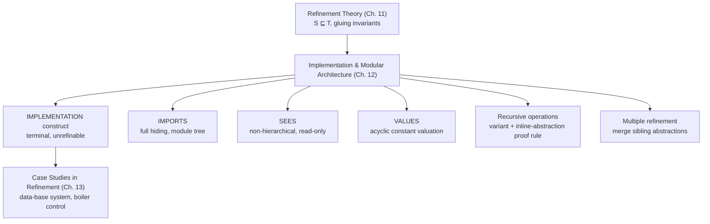

# Implementation and Modular Architecture

[[book-guidelines|↩ Back to guidelines]]

## Why refinement has to stop somewhere

Every construct covered so far in the B-Method — abstract machines, generalized substitutions, refinement — has one job: shrink the gap between "what the software must do" and "what a computer can actually execute," while keeping every step provably faithful to the last. But that chain of refinements cannot go on forever. At some point you need a *last* refinement: one that is no longer a mathematical model of something more abstract, but a piece of text a compiler could plausibly digest as-is — assignments to scalars, `if`, `while`, procedure calls, nothing else. Chapter 12 is where Abrial names this terminal stage and gives it a distinct syntactic category: the **IMPLEMENTATION**.

This matters architecturally, not just terminologically. Up to now, "building something large" meant `INCLUDES` and `USES` (Chapter 7): mechanisms for assembling *specification text*. An implementation needs a different mechanism, because its job isn't to assemble more specification — it's to assemble *already-built modules* into a running system. That mechanism is `IMPORTS`. If you think of `INCLUDES`/`USES` as "how do I write a big spec out of smaller specs" and `IMPORTS`/`SEES` as "how do I link a big program out of smaller compiled modules," you have the core distinction this chapter draws out precisely, with proof obligations to match.

**What breaks without a distinguished implementation stage:** if refinement had no terminal marker, nothing would stop you from writing "refinements" forever without ever producing executable code, and — worse — nothing would enforce the restriction to an implementable substitution language (no more unbounded choice `@z·S`, no more non-deterministic `||`, no infinite abstract sets). The IMPLEMENTATION construct is where the proof system finally says: *this text must compile*.

## The IMPLEMENTATION construct: refinement with nowhere further to go

Structurally, an `IMPLEMENTATION` looks almost identical to a `REFINEMENT` — it has `REFINES`, `INVARIANT`, `OPERATIONS` — but two properties set it apart:

1. **It is refined by nothing else.** An `IMPLEMENTATION` refines either a `MACHINE` or a `REFINEMENT`, but nothing can refine *it*. It is a leaf of the refinement partial order from Chapter 11 ($S \sqsubseteq T$).
2. **It has no abstract state or constants of its own.** No `VARIABLES` clause, no `ABSTRACT_CONSTANTS` clause. Whatever state it needs, it gets *indirectly*, by importing already-specified machines.

Concretely, in place of `VARIABLES`, an implementation may only declare `CONCRETE_VARIABLES` (introduced back in §4.21 as the "already concrete, don't need refining further" counterpart to abstract variables), and concrete `CONSTANTS`, whose values it must ultimately pin down via a new clause, `VALUES` (below). Every abstract variable, abstract constant, or deferred set that appeared somewhere up the refinement chain must, by the time you reach the implementation, either be resolved locally or be resolved by delegating to an imported machine.

**Rust framing.** Think of the refinement chain as a sequence of trait refinements — each layer narrowing an interface — terminating in a concrete `struct` that actually holds bytes and implements the trait with real field accesses instead of further abstraction. An `IMPLEMENTATION` is that terminal `impl` block: it cannot itself be the target of a further blanket impl; it is where the type-erasure stops and the memory layout becomes real. The `VARIABLES → CONCRETE_VARIABLES` transition is the "opaque associated type becomes a concrete field" moment.

## The worked example: from a spec to an implementation

Abrial builds this incrementally with a tiny running example — a machine `Little-Example_1` that maintains the maximum of a growing set of naturals, specified with maximal abstraction (a set `y`, invariant `y ⊆ ℕ`):

```
MACHINE Little-Example_1
VARIABLES y
INVARIANT y ⊆ NAT
INITIALISATION y := ∅
OPERATIONS
  enter(n) = PRE n ∈ NAT THEN y := y ∪ {n} END;
  m ← maximum = PRE y ≠ ∅ THEN m := max(y) END
END
```

This is refined once (accumulate only the current max `z = max(y ∪ {0})`), and refined again (rename `z` to a fresh `z'` with a trivial linking invariant `z' = z`). At this second refinement, `enter` starts doing real comparison work (`IF n > z' THEN z' := n END`) and `maximum`'s pre-condition vanishes — the concrete algorithm no longer needs a non-empty check because `z'` is always defined.

Then Abrial introduces a small reusable machine, `Scalar(initval)`, with a single variable, `modify` and `value` operations — a bare mutable cell, "available off the shelf." Instead of refining `Little-Example_3` again from scratch, he rewrites it as an **implementation that imports `Scalar`**:

```
IMPLEMENTATION Little-Example_3
REFINES Little-Example_1
IMPORTS Scalar(0)
INVARIANT z' = z
OPERATIONS
  enter(n) = VAR v IN
               v ← value;
               IF n > v THEN modify(n) END
             END;
  m ← maximum = BEGIN m ← value END
END
```

Two things just happened that are easy to miss on a first read:
- The `VARIABLES` clause is *gone*. `z'` is no longer a variable of this text at all — it lives entirely inside `Scalar`, hidden.
- The operations no longer touch `z'` directly; they only *call* `Scalar`'s `modify`/`value`. This is the Hiding Principle (Chapter 4) applied one more time, now at the module boundary instead of the machine boundary.

## Importation as a mechanical, five-step expansion

`IMPORTS` isn't just a visibility annotation — Abrial gives it an exact operational meaning (§12.1.2), a five-step "practice of importation" that a tool could execute mechanically:

1. Instantiate the imported machine with the actual parameters from `IMPORTS` (e.g. `Scalar(0)` binds `initval := 0`).
2. Fold the instantiated machine's variables into the implementation's own variable set.
3. Conjoin the instantiated machine's invariant with the implementation's invariant.
4. Sequence (`;`) the instantiated machine's `INITIALISATION` with the implementation's own.
5. Text-expand every operation call in the implementation's operations by inlining the (parameter-substituted) body of the called operation — exactly the "substituted substitution" mechanism already used for `INCLUDES` back in §7.2.2.

After this expansion, you are, provably, back in an ordinary refinement situation, and the ordinary proof obligations of §11.3.3 apply unchanged. Abrial actually walks the reader through this expansion for `enter(n)` line by line, substituting `v := z'` for the `value` call and `PRE n ∈ NAT THEN z' := n END` for the `modify` call, then discharging the resulting proof obligation down to the trivial arithmetic fact `n > z ⇒ n = \max(\{z,n\})$, $n \le z \Rightarrow z = \max(\{z,n\})$.

This is worth dwelling on because of what it buys you, stated explicitly (§12.1.2, final paragraph): *you never need to re-refine `Little-Example_3`.* Any future refinement of `Scalar` automatically refines `Little-Example_3`, because refinement is monotonic under every generalized-substitution construct (§11.2.4). Importation turns a system into a set of independently replaceable modules connected by a proof-once, use-forever guarantee — which is exactly what separate compilation and dynamic dispatch through a trait object give you in Rust, minus the "proof" part (Rust gives you the type-safety half; B gives you the behavioral-refinement half on top).

**Rust framing, more precisely.** `IMPORTS Scalar(0)` is close to holding a private field `scalar: Scalar` initialized with `Scalar::new(0)`, where `Scalar`'s internals are genuinely private (no `pub` fields) — the compiler enforces exactly the "you cannot touch `z'` directly, only call `modify`/`value`" rule that B enforces by proof obligation. The "monotonic under refinement" guarantee is the formal-methods analogue of "you can swap the implementation behind a trait without touching call sites" — except B additionally guarantees the *behavioral* substitutability, not just the type-level one.

## `IMPORTS` vs `INCLUDES`: two different composition regimes

§12.1.8 makes the comparison explicit, and it's the single most load-bearing distinction in the chapter:

| | `INCLUDES` (Ch. 7) | `IMPORTS` (Ch. 12) |
|---|---|---|
| Used in | a `MACHINE` specification | an `IMPLEMENTATION` |
| Purpose | build a large **specification text** | build the **final software system** |
| Variable visibility from operations | partly visible, read-only (**semi-hiding**) | invisible (**full hiding**) |
| Constants/sets | fully visible in relevant clauses | fully visible in relevant clauses |

The visibility difference is the whole point. `INCLUDES` lets an including machine's *invariant* mention the included machine's variables (so you can state cross-machine invariants like the invoice system's "no two lines share a product"), and lets operations *read* them. `IMPORTS`, by contrast, gives an implementation's `INVARIANT` clause read access to the imported machine's variables (to state the gluing relation between abstract and concrete state) but denies the `OPERATIONS` clause *any* direct access — operations may only call the imported machine's own operations. The book states the rule as a table (visibility of imported-machine objects across `VALUES`/`PROPERTIES`/`INVARIANT`/`OPERATIONS`): sets and constants are visible everywhere useful; concrete/abstract variables are visible only in `INVARIANT` and, as a narrow exception, inside a loop invariant (§12.3) — never in ordinary operation bodies.

**What breaks without full hiding at the `IMPORTS` boundary:** if operations could reach into an imported machine's state directly, the "any future refinement of the imported machine automatically refines the importer" guarantee collapses — the importer's correctness proof would have been implicitly using implementation details of the imported machine's *current* representation, not just its specified behavior. Full hiding is precisely what makes modules independently refinable. This is the same discipline Rust's privacy system enforces syntactically (you cannot name a private field from outside the module) and that a Lean-style abstract type (`opaque` definitions, or a structure with private fields hidden behind an interface) enforces semantically.

## The `VALUES` clause: acyclic bottom-up constant valuation

An implementation must pin down two kinds of "still abstract" leftovers from the whole refinement chain above it: deferred `SETS` and concrete `CONSTANTS` that were declared but never given a concrete value. That's the job of `VALUES` (§12.1.7):

$$\text{constant\_name} = \text{concrete value expression}$$

The subtlety is *what counts as a legal right-hand side*. A concrete constant $s$ declared somewhere in the refinement chain $M_1, \ldots, M_n$ (the implementation being $M_n$) may be valued only by:
- a concrete constant of the imported machine $M$ or of a "seen" machine (§12.2, below),
- a member of an enumerated set declared in the chain or in a seen machine,
- an arithmetic expression over such things and literals ($+, -, \times, /$, exponentiation, `mod`, `succ`, `pred`),
- a total function defined in extension, or the identity on a scalar-bounded interval, with values built the same way,
- a set visible from the imported or seen machine, or an interval with such bounds.

What is explicitly *forbidden*: valuing $s$ by means of a formal parameter of $M_1$, or by means of *another* concrete constant declared somewhere in $M_1, \ldots, M_n$ itself. Abrial states the reason directly: **this is to avoid circular definitions.** If $s$ (declared high in the chain) could be valued by $u$ (also declared in the chain), and $u$ in turn depended on $s$, you'd have a definitional cycle with no well-founded base case. By forcing every value to trace back "from the bottom" — from the imported machine or a seen machine, which are themselves already fully implemented (or will be, independently) — the valuation relation is guaranteed acyclic: it's a DAG rooted at literal constants, and every path terminates.

This is precisely the acyclicity discipline a compiler's constant-folding or a dependent-type-checker's `let`-binding evaluation needs, and it is worth naming explicitly for the elaborator project: **this is the same shape of problem as the occurs-check in unification** — you cannot let a metavariable's solution mention itself (directly or transitively) without breaking well-foundedness of substitution. Here the "metavariables" are concrete constants awaiting a value, the "solutions" are the `VALUES`-clause right-hand sides, and the legality rule (*must bottom out in an imported/seen machine's already-fixed constants*) is a purpose-built, syntactically-checkable substitute for a full occurs-check: instead of searching the dependency graph for cycles after the fact, the grammar of legal right-hand sides makes a cycle *unconstructible* in the first place. If you were implementing this in Rust for a constraint solver, the analogous discipline is: never let a substitution write $\alpha := \ldots \alpha \ldots$; the B-Book's answer is architectural (values only flow one direction across the module hierarchy) rather than algorithmic (no occurs-check needed because the grammar forbids the bad case).

## Sharing without breaking encapsulation: the `SEES` clause

`IMPORTS` gives you a strict tree: each module has exactly one importer, connections only flow through common ancestors. That's clean but sometimes wasteful — e.g. many modules might all want read-only access to one shared, variable-free "mathematical library" machine, and routing every such access through a chain of ancestors is needless ceremony. §12.2 introduces the **`SEES`** clause to add controlled, non-hierarchical short-circuits:

```
        SEES              SEES
Mi  ───────────►  M2  ◄──────────  M3
```

The constraints are deliberately asymmetric and specific:

- $M_2$'s variables are readable (never writable) from $M_1$'s and $M_3$'s **operations** — but *not* from their **invariants**. The reason given is architectural independence: allowing $M_2$'s variables into a seer's invariant would force $M_2$ to be re-proved whenever a seer's invariant changed, defeating the whole point of `SEES` as a cost-free optimization for $M_2$.
- Down the refinement chain, the rule tightens further: a *refinement or implementation* of a seer can only call $M_2$'s **inquiry operations** (operations that don't modify state) — not read $M_2$'s abstract variables directly at all, because by refinement time you don't yet know what $M_2$'s final concrete representation will even be. Only at the seeing machine's own top level are $M_2$'s abstract variables visible in operations; further down, only inquiry-operation calls survive.
- `SEES` is **not transitive across refinement**: if $M$ sees $N$, a refinement $M'$ of $M$ does *not* automatically see $N$ — it must repeat the `SEES` declaration itself. Abrial's stated reason is readability: a refinement should be self-contained, not require memorizing everything its every ancestor happened to see.
- **No cycles**: $M$ cannot see $N$ which sees ... which sees $M$; nor can any implementation-chain descendant of $M$ see an ancestor of $M$ reached through `IMPORTS`. This is exactly acyclicity again, now over the *module dependency graph* rather than the constant-valuation graph — the same discipline, applied at a different layer.
- A "seen" machine may itself contain `INCLUDES` but never `USES`.

## Comparing `IMPORTS`, `INCLUDES`, and `SEES` — and the `USES`/`SEES` pairing

The chapter closes the loop (§12.1.8, §12.2.6) by triangulating all four composition mechanisms the book has now introduced across Chapters 7 and 12:

| Clause | Stage | Sharing model | Variable visibility | Transitive? |
|---|---|---|---|---|
| `INCLUDES` | specification | text absorbed into one machine | read-only in operations, visible in invariant | yes |
| `USES` | specification | one shared sub-spec, forgotten once absorbed | visible in invariant, **no** operation calls at all | no |
| `IMPORTS` | implementation | strict tree, full hiding | invisible in operations (only via calls); visible in invariant | yes (renaming propagates) |
| `SEES` | machine/refinement/implementation | non-hierarchical short-circuit, module persists in final code | read-only via inquiry-operation calls in operations; **never** in invariant | no |

The `USES`/`SEES` pairing is the cleanest way to see *why* four mechanisms are needed rather than two. `USES` is a *specification-time* device: the shared text gets textually absorbed and then is architecturally forgotten — the final system doesn't remember that two machines once used a common ancestor; both including machines simply have to be combined together eventually. `SEES`, by contrast, is an *implementation-time* device: the shared module survives as an actual, separately-compiled module in the running system, and stays visible as such. This is why `USES` permits full parameter visibility (used and using machine are destined to be combined) while `SEES` forbids it (there's no such destiny — the modules that see a given machine need never be imported together at all), and why `USES` permits invariant-level references to the shared machine's variables (they'll be merged into one proof eventually anyway) while `SEES` forbids it (the seen machine must stay provable in isolation, once, forever).

**Rust/Lean framing.** `INCLUDES`/`USES` map onto compile-time composition — trait bounds, generic composition, `mod` inlining, monomorphization: everything gets folded into one proof obligation (one monomorphized instantiation) and the seams disappear. `IMPORTS`/`SEES` map onto link-time/runtime module composition — separately compiled crates behind stable, encapsulated APIs, where the whole point is that each crate keeps its own already-discharged proof obligations and never needs re-checking when a sibling crate changes. If you're building the verifier from the learning-goals project, this distinction is exactly the line between "constraints generated and solved within one elaboration unit" and "trusted, previously-checked interfaces consumed via a stable, hidden-implementation contract" — i.e., the line that determines what has to re-enter your CHC/SMT solver versus what a **proof certificate** from a separately-verified module lets you simply trust.

## Multiple refinement of several abstractions

Ordinarily, `REFINES` names exactly one abstraction. §12.4 lifts this to a *list*:

```
REFINEMENT M_xy
REFINES M_x, M_y
VARIABLES xy
INVARIANT xy = 10 × x + y
INITIALISATION xy := 0
OPERATIONS
  modify_x(n) = BEGIN xy := 10 × n + (xy mod 10) END;
  n ← value_x  = BEGIN n := xy / 10 END;
  modify_y(n) = BEGIN xy := (xy / 10) + n END;
  n ← value_y  = BEGIN n := xy mod 10 END
END
```

Two previously-independent machines $M_x$ (variable $x \in 0..9$) and $M_y$ (variable $y \in 0..9$) are refined *simultaneously* by a single refinement whose gluing invariant, $xy = 10x + y$, packs both abstract variables into one concrete variable. Abrial is explicit that this is not a new theoretical concept — it's the ordinary refinement machinery, just applied with a coupling invariant that mentions two abstractions' variables at once — but it's an important *architectural* move: it lets independently-developed subsystems be merged late in a development when their concrete representations turn out to be efficiently combinable (his motivating scenario: two memory-management-flavored machines that happen to fit in one word, or one data structure). It generalizes: at the level of a whole development tree, sibling implementations $M_5, M_6$ can be optimized down onto a single implementation $M_{56}$, provided their data don't interfere.

**Rust framing.** This is the refinement-theoretic version of *packing two logically independent fields into one bitfield or one `u32`*, with the compression relation ($xy = 10x + y$, a bijective encoding here) playing the role a `#[repr(...)]` layout decision plays in Rust — except again, B additionally proves that every abstract operation on either original machine is still correctly realized by the packed representation, rather than just asserting a memory layout.

## Recursively defined operations

Chapter 3 already had "recursion" — least-fixpoint-based recursive definitions of total functions on inductively defined sets like $\mathbb{N}$, sequences, and trees. §12.5 introduces a *second*, deliberately distinct notion: recursion as an **implementation-level programming construct**, admissible only inside an `IMPLEMENTATION`, never inside a `MACHINE` or `REFINEMENT` — for the same reason sequencing and `WHILE` loops (Chapter 9) were confined to the executable layer: recursion is a *computational* technique for realizing an already-specified, non-recursive abstraction, not a specification technique in its own right.

**[[Fixpoint-Construction-and-Induction#The construction|The construction]].** For a substitution $S$ parameterized over an inductively defined set $t$ (e.g. $t = \mathbb{N}$), the set-transformer semantics $str(S)$ (Chapter 6) has type $t \to (\mathbb{P}(s) \to \mathbb{P}(s))$ — a function *on* $t$. Since $t$ is inductively defined, Chapter 3's recursive-function machinery applies directly to *define* this function recursively. Worked example: factorial.

$$
f(n) = \begin{cases} str(r := 1) & n = 0 \\ f(n-1) \circ str(r := r \times n) & \text{otherwise} \end{cases}
$$

Abrial proves by induction on $n$ that $f(n) = str(r := n!)$ for all $n \in \mathbb{N}$ (Property 12.5.1), using the algebraic identity $str(S) \circ str(T) = str(S;T)$ from Chapter 9. Stripping the `str(·)` wrapper from both sides of the recursive equation for $f$ mechanically yields the recursive *operation*:

```
r ← fact(n) =
  IF n = 0 THEN
    r := 1
  ELSE
    r ← fact(n − 1);
    r := r × n
  END
```

which is now proved to be a correct refinement of the ordinary non-recursive specification `r ← fact(n) = PRE n ∈ ℕ THEN r := n! END`.

**Syntax and the variant.** Because [[Semantics-of-Generalized-Substitutions#Termination|termination]] of a recursive call chain needs the same well-founded-decrease argument a loop needs, the grammar for `Operation-Declaration` is extended with a `REC ... THEN ... END` form carrying an explicit **variant** expression, exactly parallel to a loop's variant (§9.2.9):

```
r ← fact(n) =
  REC n THEN
    IF n = 0 THEN r := 1
    ELSE r ← fact(n − 1); r := r × n
    END
  END
```

**The proof rule — and why it replaces recursive calls with inlined abstraction, not with itself.** This is the sharpest idea in the section, and it's worth stating precisely because it resolves an apparent paradox: how do you prove a recursive implementation `op(x) = REC V THEN T END` refines a non-recursive abstraction `Op(x) = PRE P THEN S END`, when $T$ itself contains calls to `op`? The answer: those recursive calls inside $T$ are **not** treated as calls to the operation being defined (which would be circular and meaningless as a proof step) — they are treated as calls to the operation of an *implicit importation* of the very machine being implemented. Concretely, each recursive call `op(F)` inside $T$ is replaced, exactly as `IMPORTS` expansion would replace any imported-operation call, by the **inlined abstract specification** itself, strengthened with the decrease obligation:

$$[x := F]\ \mathrm{PRE}\ V' < V \land P\ \mathrm{THEN}\ S\ \mathrm{END}$$

(where $V$ is the variant at entry, $V'$ the variant of the recursive call — a natural number or, for the sequence/tree cases, a sequence of naturals under lexicographic order). Substituting the abstraction's own pre/post pair — not the concrete recursive body — for each recursive call turns the whole proof into an ordinary, non-recursive refinement proof, dischargeable with the §11.2.6 machinery already established for one-shot refinement.

This is precisely the discipline behind proving a recursive *function* correct by strong induction, phrased operationally: "assume the recursive calls behave according to spec (that's the induction hypothesis, formalized as calling the abstraction under a smaller-variant guard), then show the concrete body meets spec given that assumption." It is also, notably, the exact same move a **fixpoint/lfp-based operational-semantics proof** makes when proving a recursively-defined evaluator sound against a declarative big-step semantics: unfold one level, appeal to the inductive hypothesis via the *specification*, never via the *implementation*, of the recursive call.

**Why this matters for the elaborator/CSP project.** This is essentially the well-founded recursion discipline your Rust verifier's proof-search or fixpoint solver needs whenever it must justify a recursive procedure (a typing-rule interpreter, an unfolding-based normalizer, or a CHC solver's least-fixpoint iteration) — the variant-decrease condition is exactly a **ranking function** in the termination-analysis sense, and the "replace a recursive call by its already-known-correct specification, not by re-entering the implementation" move is exactly what lets induction hypotheses stand in for coinductive appeals to "trust the callee" in a **trusted-kernel** architecture: the kernel doesn't re-verify a lemma's proof every time it's cited, it trusts the previously-established *statement*, precisely as this proof rule trusts `Op`'s specification rather than re-descending into `op`'s recursive body.

## Executable syntax: what actually survives to code

The final piece of architectural discipline (§12.1.11) is a hard restriction on what an implementation's operations may contain, motivated by translatability into an ordinary imperative language: `skip`, assignment, procedure calls, sequencing, `VAR` blocks, `WHILE`, `IF`/`ELSIF`, `CASE` — and nothing else. Notably *absent*: the multiple-substitution operator `||`, even though it's known to be refinement-monotonic (§11.2.4) and could in principle have been kept. Arithmetic terms are further split into **Protected** and **Unprotected** forms — a protected assignment wraps a `PRE` around every sub-expression's well-definedness condition (e.g. every operand and partial product of `a := b + c × d` must be shown to lie in `INT = minint..maxint`) — because the classical machine arithmetic used by a real target language is *partial* (can overflow) where the book's mathematical `+`, `×` are total. This is the B-Method's answer to the same problem SMT-based verifiers solve with overflow side-conditions on bitvector arithmetic: every arithmetic sub-term gets an explicit, provable-in-context definedness obligation before it's allowed to reach the executable layer.

## Where this leads



Chapter 12 depends entirely on Chapter 11's refinement relation and proof-obligation machinery — every mechanism here (`IMPORTS` expansion, the recursive-operation proof rule) reduces, eventually, to an ordinary refinement proof obligation. It feeds directly into Chapter 13's case studies, where the data-base system is built bottom-up as a literal `IMPORTS`/`SEES` layer stack (`FILE → FILE-BUFFER → FILE-ACCESS → BASIC-FILE-VAR`, with `SEES`-connected utility machines), and the boiler control system exploits `SEES`-separated Service machines to keep a safety check out of the main control loop.

For the standing project: this chapter is where "proof of refinement" and "software architecture" become the same activity. The acyclic-valuation discipline in `VALUES` is a hand-built occurs-check for a constraint system with only one kind of constraint (equality-to-a-closed-value); a general elaborator's metavariable-solving machinery needs the same acyclicity guarantee but for arbitrary unification constraints, which is exactly why Miller-pattern unification's restriction (metavariable applied only to distinct bound variables) exists — it's the general-purpose version of the same "make cycles unconstructible by restricting the grammar of legal solutions" move seen here. The recursive-operation proof rule — replace a recursive call by the callee's *specification*, never its *implementation*, once a decreasing variant is established — is the direct ancestor of how a trusted kernel should treat a call to an already-verified lemma or a separately-compiled module behind a `SEES`/`IMPORTS`-style boundary: don't re-descend into proof search you've already discharged, cite the certificate.
