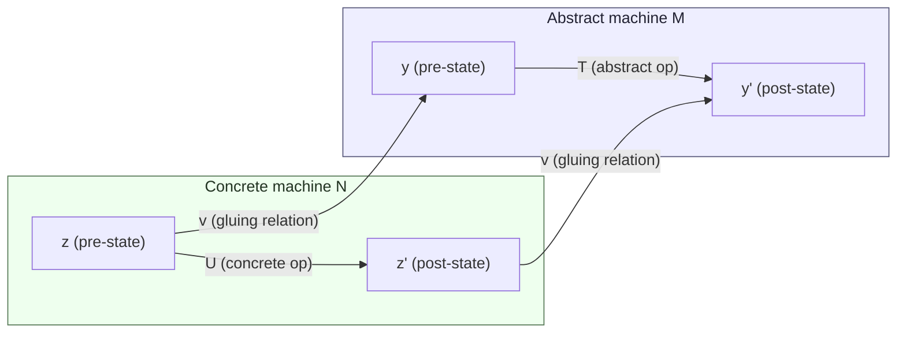

[[book-guidelines|↩ Back to guidelines]]

# Refinement Theory

## Why refine anything at all?

Every abstract machine you build in the B-Method is written to be *understood*, not executed. Chapter 4 taught you to specify an operation like `m ← maximum` with a set `y ⊆ ℕ` and a before-after predicate `m = max(y)`. That specification is honest, precise, and utterly unimplementable as written on real hardware — there's no bounded-memory representation of "an arbitrary finite set of naturals" that a machine can manipulate directly, and even if there were, recomputing `max(y)` from scratch on every call is wasteful. The specification's job was to be *checkable against intent*, not to be *fast* or *concrete*.

So there's a gap: the model that's easiest to *prove correct against the informal requirements* is rarely the model that's easiest to *run*. Refinement is Abrial's answer to closing that gap in verifiable steps rather than in one leap of faith. You don't throw away the abstract machine and write an implementation from scratch, hoping it "does the same thing." You produce a *sequence* of machines, each one replacing some piece of the previous machine's state and behavior with something more concrete, each step carrying its own local proof obligation that the replacement is faithful to what came before. By the time you reach an actual `IMPLEMENTATION` (Chapter 12), correctness has been established incrementally, and the trusted base for the whole chain is nothing more than: each individual refinement step was checked.

This is precisely the discipline a verifier needs if it is going to accept "this concrete program meets this abstract specification" as a theorem rather than an assertion. If you are building a Rust verifier that discharges Hoare-triple-style contracts, refinement theory is the formal object your verifier's core judgment *is*: "does this candidate implementation refine this specification" is exactly the shape of "does this program satisfy this pre/post-condition contract," generalized to allow the state representation itself to change between the two.

**What breaks without it:** without a formal refinement relation, "step-wise development" is just wishful renaming — you write machine $N$ that "looks like" it does what machine $M$ did, but you have no proof obligation forcing every behavior $N$ can exhibit (as observed from outside) to correspond to some behavior $M$ could also have exhibited. Bugs introduced during the "obviously equivalent" concretization step are exactly the bugs formal methods exist to catch, and they're invisible to informal reasoning precisely because the two machines don't share a common state space to compare.

## Refining a substitution: the core relation

### The intuition before the symbols

Fix an abstract machine $M$ with a single variable $x$. A substitution $S$ (an operation body, in GSL — the Generalized Substitution Language of Chapters 4–5 and 9) is **refined by** a substitution $T$ if $T$ can be dropped in wherever $S$ was used, and no external observer — no code that only interacts with $M$ through its operations — can tell the difference. Concretely: every property $R$ that $S$ was guaranteed to establish, $T$ also establishes.

Abrial builds the intuition with three small examples before giving the formal definition — worth walking through because they isolate the two independent "knobs" refinement can turn.

**Knob 1 — reduce non-determinism.** Take
$$S = (x := 0 \,\square\, x := x - 1), \qquad T = (x := x - 1).$$
$S$ is the *bounded choice* substitution: it may set $x$ to $0$ or decrement it, and $[S]R \Leftrightarrow [x{:=}0]R \land [x{:=}x{-}1]R$ — i.e. $S$ guarantees $R$ only if *both* branches would establish it. $T$ guarantees $R$ under a weaker condition ($[T]R \Leftrightarrow [x{:=}x{-}1]R$ alone), so whenever $S$ guaranteed $R$, $T$ does too. $T$ refines $S$ by throwing away one of the nondeterministic choices — a legitimate move, because a client of $M$ was never entitled to assume *which* choice would occur, only that *whichever* choice occurred, $R$ would hold.

**Knob 2 — weaken the pre-condition.** Take
$$S = (x > 5 \mid x := x - 1), \qquad T = (x > 0 \mid x := x - 1).$$
Here $[S]R \Leftrightarrow x>5 \land [x{:=}x{-}1]R$ and $[T]R \Leftrightarrow x>0 \land [x{:=}x{-}1]R$. Since $x>5 \Rightarrow x>0$, $[S]R \Rightarrow [T]R$: $T$ refines $S$ by being willing to run — and to guarantee its result — in *more* starting states than $S$ was. This is a real gain, not a cosmetic one, because a refinement whose pre-condition is broader can be embedded in more contexts than the machine that specified it.

Both knobs can turn at once, as Abrial's third example shows: $T$ "does less" (less non-determinism, so long as we stay inside $S$'s [[Semantics-of-Generalized-Substitutions#Termination|termination]] conditions) but simultaneously "does more" (it might terminate — and behave usefully — outside those conditions, where $S$ was allowed to do anything at all, including nothing sensible). This asymmetry is harmless *only* because of the Hiding Principle from Chapter 4: since a client can never inspect $M$'s internal state directly, it can never notice that $T$ is "more capable" than $S$ promised to be — it can only invoke $T$ through $M$'s interface, which never advertises capabilities $S$ didn't have.

### The formal definition

Recall from §6.4.2 the **set-transformer model**: $\mathit{str}(S)$ is the function mapping a postcondition set $a$ to the largest set of pre-states from which $S$ is guaranteed to land in $a$. Refinement is then just pointwise inclusion of set transformers:

$$S \sqsubseteq T \quad\Longleftrightarrow\quad \forall a\cdot(a \subseteq s \Rightarrow \mathit{str}(S)(a) \subseteq \mathit{str}(T)(a))$$

read "$S$ is refined by $T$." Using the two other set-theoretic projections of a substitution from §6.4.1 — $\mathit{pre}(S)$ (its domain of guaranteed termination) and $\mathit{rel}(S)$ (its before-after relation) — Abrial derives the equivalent, and far more usable, characterization:

$$S \sqsubseteq T \quad\Longleftrightarrow\quad \mathit{pre}(S) \subseteq \mathit{pre}(T) \;\land\; \mathit{rel}(T) \subseteq \mathit{rel}(S) \qquad \text{(Property 11.1.1)}$$

This is the formal shadow of the two knobs above: the pre-condition can only *grow* going down a refinement chain ($\mathit{pre}(S) \subseteq \mathit{pre}(T)$), and the relation can only *shrink* ($\mathit{rel}(T) \subseteq \mathit{rel}(S)$) — fewer behaviors, over a domain that is at least as large.

Equality of substitutions, $S = T$, is defined as $\mathit{str}(S) = \mathit{str}(T)$, and from this Abrial gets, for free, that $\sqsubseteq$ is a **partial order**:

$$S \sqsubseteq S \qquad S \sqsubseteq T \land T \sqsubseteq U \Rightarrow S \sqsubseteq U \qquad S \sqsubseteq T \land T \sqsubseteq S \Rightarrow S = T$$

reflexive, transitive, antisymmetric. This partial-order structure is what makes "successive refinement" a coherent methodology at all: a chain $M \sqsubseteq N_1 \sqsubseteq N_2 \sqsubseteq \cdots \sqsubseteq N_k$ composes by transitivity into a single refinement relation $M \sqsubseteq N_k$, so you never have to re-derive the whole proof from $M$ down to $N_k$ directly — each link only has to be locally sound.

**What breaks without antisymmetry/transitivity:** if $\sqsubseteq$ weren't transitive, "prove each step correct" would not imply "the whole development is correct" — you'd need a separate, non-compositional argument at the end connecting the final implementation back to the original specification. The entire economic case for stepwise refinement (prove small things, get a big thing for free) rests on this order structure.

### Monotonicity: refine the parts, get the whole for free

The partial order alone doesn't tell you *how* to build a refined substitution out of refined pieces. Abrial proves seven monotonicity laws, one per basic GSL construct — precondition, bounded choice, guard, unbounded choice, multiple substitution `||`, sequencing, and the loop `*`:

$$S \sqsubseteq T \Rightarrow (P\mid S) \sqsubseteq (P \mid T) \qquad S \sqsubseteq T \Rightarrow (P \Rightarrow S) \sqsubseteq (P \Rightarrow T) \qquad \forall z\cdot(S \sqsubseteq T) \Rightarrow @z\cdot S \sqsubseteq @z\cdot T$$
$$U \sqsubseteq V \land S \sqsubseteq T \Rightarrow (U \| S) \sqsubseteq (V \| T) \qquad U \sqsubseteq V \land S \sqsubseteq T \Rightarrow (U;S) \sqsubseteq (V;T) \qquad S \sqsubseteq T \Rightarrow S^\ast \sqsubseteq T^\ast$$

The loop case is the one Abrial proves in full, by unrolling both sides to their least-fixpoint definitions (§9.2.1) and applying Theorem 3.2.1 (the fixpoint-inclusion principle from the Knaster–Tarski machinery of Chapter 3) — a nice callback showing that the entire refinement calculus for loops rests on the same fixpoint theory used to build the natural numbers.

The payoff: **you never refine an operation body wholesale.** You refine its *sub-substitutions* independently — one branch of a choice, one statement in a sequence — and monotonicity lets you conclude that the whole operation is refined. This is the compositional discipline that any real verifier needs: a Rust-style checker that verifies refinement of a `match` arm or a loop body locally, then combines the results, is applying exactly these seven laws (specialized to whatever your source language's control-flow constructs are). If your language has a construct without a proven monotonicity law, you cannot check refinement of programs using that construct compositionally — you'd be forced back to a global, whole-program set-transformer comparison, which does not scale.

## Refining a generalized assignment

Most of the "algorithm [[Fixpoint-Construction-and-Induction#Construction|construction]]" work in Chapter 10 was really refinement in disguise, and §11.1.5 makes that precise. Suppose the substitution to be refined has the shape $P \mid (x : Q)$ — a pre-condition guarding an unbounded, nondeterministic assignment "$x$ becomes any value satisfying $Q$" (recall $x:Q \;=\; @x'\cdot([x{:=}x']Q \Rightarrow x{:=}x')$ from §5.1.1). Working through the definitions of $\mathit{str}$, Abrial derives:

$$(P \mid (x:Q)) \sqsubseteq T \quad\Longleftrightarrow\quad \forall x\cdot(P \Rightarrow [T]Q) \qquad \text{(Property 11.1.2)}$$

This single equivalence is doing a lot of quiet work. Recall from §4.5 that the proof obligation for an operation $S$ of a machine with invariant $I$ and pre-condition $P$ was stated as $\forall x\cdot(I \land P \Rightarrow [S]I)$. Property 11.1.2 tells you this is *exactly* the statement that $S$ refines the maximally-nondeterministic substitution $(I \land P) \mid (x : I)$ — "re-establish the invariant, in the least committal way possible." In other words:

> **An abstract-machine proof obligation is a special case of a refinement proof obligation**, where the abstraction being refined is the most permissive substitution consistent with the invariant.

Specializing $Q$ further to $x = E$ (a deterministic assignment to a set-theoretic expression $E$ not mentioning $x$) gives:

$$(P \mid x{:=}E) \sqsubseteq T \quad\Longleftrightarrow\quad \forall x\cdot(P \Rightarrow [T](x = E)) \qquad \text{(Property 11.1.3)}$$

This is the theorem that retroactively justifies every algorithm-correctness proof in Chapter 10: proving a loop computes $\min(c)$ by exhibiting an invariant and showing $[T](x = E)$ under the loop's precondition is *literally* proving the loop refines the simple assignment $x := E$. Chapter 10's practice wasn't a separate informal technique running alongside refinement theory — it *was* refinement theory, instantiated to its simplest case.

**Grounding — Rust.** Think of $P \mid (x:Q)$ as an under-determined trait contract:

```rust
/// Contract: caller guarantees `pre(&self)`.
/// Implementer guarantees: on return, `post(&self, &result)` holds.
trait Spec {
    fn pre(&self) -> bool;
    fn post(&self, result: &State) -> bool;
}

/// A refinement is any concrete function `t` such that, whenever
/// `pre` held, `t` terminates and its output satisfies `post`.
/// This is exactly Property 11.1.2/11.1.3, specialized to a
/// deterministic implementation `t`.
fn refines<S: Spec>(spec: &S, t: impl Fn(&State) -> State) -> bool {
    // verifier obligation: forall x, spec.pre(x) => spec.post(x, t(x))
    unimplemented!("this is the shape of the verifier's core check")
}
```

The verifier's job, in this framing, is precisely to discharge $\forall x\cdot(P \Rightarrow [T]Q)$ for the candidate implementation $T$ against the declared contract $P \mid (x:Q)$ — a weakest-precondition-style check, which is what Dijkstra's $[T]\cdot$ notation *is* (Chapters 4–6 build $[\cdot]$ as exactly a $\mathit{wp}$ calculus).

## Abstract machine refinement: the gluing relation

Refining a single substitution changes only *behavior*, not *state space* — $S$ and $T$ both work with the same variable $x$. But the deepest refinements change the *representation* of the state itself. Abrial's running example: `Little-Example_1` stores the full set `y : F(NAT1)` of numbers entered so far, and answers `maximum` by computing `max(y)` on demand. `Little-Example_2` instead stores a single number `z : NAT`, updating it as `z := max({z,n})` on each `enter(n)`, and answers `maximum` by just returning `z`. The two machines have the *same signature* (same operation names, same parameter shapes) but *incompatible* state — you cannot ask whether $y \sqsubseteq z$ because they don't live in the same set.

**What breaks without a state-space bridge:** without some formal way to relate `y` and `z`, "the two machines behave the same" is unfalsifiable — you'd be trusting the developer's eyeball rather than a proof. The entire discipline collapses back to informal justification exactly at the step where formal justification matters most, since concretizing state is *the* step where representation bugs are introduced (off-by-one encodings, lost history, aliasing).

### Formal definition via external substitutions

Abrial's route to a formal definition of machine refinement is indirect but principled. Take any "external" substitution `prog` — built from operation calls only, respecting the Hiding Principle, never touching `y` or `z` directly — and "implement" it on each machine by initializing that machine and inlining each call. This yields two substitutions $T$ (on `Little-Example_1`, working over $x_1,x_2,y$) and $U$ (on `Little-Example_2`, over $x_1,x_2,z$). Since $T$ and $U$ don't share a variable space, compare them only on their *common* (external) variables, by hiding the internal ones with the unbounded-choice operator $@$:

$$@y\cdot T \;\sqsubseteq\; @z\cdot U$$

Generalizing over *every* possible external substitution gives the full definition: machine $M$ (variable $y \in b$) is refined by machine $N$ (variable $z \in c$) when, for every external substitution with its own variable $x \in a$, implemented as $T$ on $M$ and $U$ on $N$,

$$M \sqsubseteq N \quad\Longleftrightarrow\quad @y\cdot(y \in b \Rightarrow T) \;\sqsubseteq\; @z\cdot(z \in c \Rightarrow U)$$

This is honest but unusable — an informal universal quantification over *all* client programs is not something you can discharge with a fixed, finite set of proof obligations. The rest of §11.2 exists to eliminate that quantifier.

### The sufficient condition: a gluing relation

[[Set-Theory-and-the-Relational-Calculus#The mechanism|The mechanism]] that removes the quantifier is a **total binary relation** $v$ linking the concrete state to the abstract state:

$$v \in c \leftrightarrow b \qquad \mathit{dom}(v) = c$$

This is the **gluing relation** (sometimes called a *linking* or *abstraction* relation elsewhere in the refinement-calculus literature Abrial cites — Hoare, He & Sanders, Morgan). In the running example, $v = \{(z,y) \mid z = \max(y \cup \{0\})\}$: every concrete value of $z$ corresponds to (at least) one abstract $y$ whose maximum, capped below by $0$, equals $z$. Totality — $\mathit{dom}(v)=c$ — says *every* reachable concrete state has *some* abstract counterpart; nothing concrete is left orphaned.

Abrial proves (Theorem 11.2.2, via two supporting lemmas, Properties 11.2.1–11.2.2) that this local condition on $v$ is **sufficient** for full machine refinement:

$$v \in c \leftrightarrow b \;\land\; \mathit{dom}(v) = c \;\land\; \forall r\cdot(r \subseteq a\times c \Rightarrow \mathit{str}(T)(v[r]) \subseteq v[\mathit{str}(U)(r)]) \;\;\Longrightarrow\;\; M \sqsubseteq N$$

The totality hypothesis is not decorative — Property 11.2.2, the harder of the two lemmas, uses it essentially: without $\mathit{dom}(v)=c$ there could be reachable concrete states with *no* abstract justification at all, and the proof that hiding the concrete variable produces no *more* observable behavior than hiding the abstract one would simply fail. **What breaks without totality:** the concrete machine could reach states that are *meaningless* from the abstraction's point of view — states a client, reasoning purely in terms of the abstract spec, could never predict or explain. Totality is precisely the guarantee that concretization never "escapes" the abstract world it's supposed to be simulating.

### Monotonicity again, and the pre/rel reformulation

Just as with substitution refinement, Abrial then proves the $v$-indexed refinement relation $T \sqsubseteq_w U$ (where $w = \mathit{id}(a) \Vert v$ lifts $v$ to also track the untouched external variable) is monotonic under the GSL constructs — precondition, choice, guard, unbounded choice, sequencing, and (with a dedicated proof using the pre/rel reformulation below) the multiple-substitution operator `\|`. This means, exactly as before: **prove refinement operation-by-operation, and the whole machine's refinement follows automatically** (Theorem 11.2.3) — you never need to re-derive the whole-machine external-substitution argument by hand.

The most usable form, and the one actually applied to discharge real proof obligations, restates the sufficient condition purely in terms of $\mathit{pre}$ and $\mathit{rel}$ (Theorem 11.2.4):

$$v \in c \leftrightarrow b \qquad \mathit{dom}(v) = c \qquad v^{-1}[\mathit{pre}(T)] \subseteq \mathit{pre}(U) \qquad v^{-1};\mathit{rel}(U) \subseteq \mathit{rel}(T);v^{-1} \;\;\Longrightarrow\;\; M \sqsubseteq N$$

for each pair of corresponding operations $T$ (in $M$) and $U$ (in $N$). Read the two inequalities operationally:

- $v^{-1}[\mathit{pre}(T)] \subseteq \mathit{pre}(U)$: **the concrete operation must be defined at least everywhere the gluing relation says the corresponding abstract operation was defined.** You can never concretely refuse to run in a state that glues to an abstract state where running was guaranteed.
- $v^{-1};\mathit{rel}(U) \subseteq \mathit{rel}(T);v^{-1}$: **every concrete step, translated back through $v$, must correspond to some abstract step.** This is the simulation diagram, spelled out as relational composition: go concrete-then-glue-back, and you must land somewhere the abstract relation could also have reached from the corresponding starting point.

This is literally the **forward simulation** condition from the general theory of data refinement — the same shape you'll find in Hoare's *Proof of Correctness of Data Representation* (cited as reference [3] in this chapter) and in every subsequent refinement calculus (Morgan, Back, Morris — all cited). When $v$ is the identity relation, these two conditions collapse exactly to Property 11.1.1, confirming that machine refinement is a strict generalization of substitution refinement, with the "change of representation" as the genuinely new ingredient.



Every concrete transition must be "coverable" by an abstract one via $v$; this is the diagram Abrial draws informally in §11.2.7 before formalizing it.

**Grounding — Lean.** This is exactly the shape of a simulation relation used to prove one state-transition system refines another, and it maps closely onto how a Lean development would state a refinement theorem between an abstract and concrete `Std.HashMap`-style implementation:

```lean
structure Refines (Abs Conc : Type) (op_abs : Abs → Abs → Prop) (op_conc : Conc → Conc → Prop) where
  glue : Conc → Abs → Prop
  total : ∀ c, ∃ a, glue c a
  sim   : ∀ c c' a, glue c a → op_conc c c' →
            ∃ a', op_abs a a' ∧ glue c' a'
```

`glue` is Abrial's $v$; `total` is $\mathit{dom}(v)=c$; `sim` is the relational-composition inequality above, existentially quantified rather than written as a set inclusion — the same statement, phrased in the idiom of a forward-simulation lemma you'd actually try to prove `by` a case split on `op_conc` and provide a witness `a'`.

## Refinement proof obligations, assembled

Section 11.2.6 replaces the $\mathit{str}/\mathit{pre}/\mathit{rel}$-level conditions with something a working developer actually discharges: syntactic proof obligations stated directly in terms of the machine and refinement *text*, for the picture where $M$ has invariant $I$ (variable $y$), operation $T = P \mid K$; and refinement $N$ adds a change-of-variable invariant $J$ (relating $y$ and the new variable $z$), with corresponding operation $U = Q \mid L$. Abrial instantiates the gluing relation as $v = \{(z,y) \mid I \land J\}$ — the *combined* invariant plays the role of the gluing relation directly, which is why B-Method practice states the linking invariant as, simply, another `INVARIANT` clause in the `REFINEMENT` construct.

The four proof obligations for a machine/refinement pair are:

$$[B]I \qquad \text{(Obligation 1 — abstract initialization establishes } I\text{)}$$
$$\forall y\cdot(I \land P \Rightarrow [K]I) \qquad \text{(Obligation 2 — abstract operation preserves } I\text{)}$$
$$[C]\,\exists y\cdot(I \land J) \qquad \text{(Obligation 3 — concrete initialization establishes the linking invariant)}$$
$$\forall(y,z)\cdot(I \land J \land P \Rightarrow Q \land [L]\lnot[K]\lnot J) \qquad \text{(Obligation 4 — the refinement condition proper)}$$

Obligations 1–2 are nothing new — the ordinary machine proof obligations from §5.2.5. Obligation 3 says concretizing the initial state doesn't strand you outside the linking relation. Obligation 4 is where the real content is, and it deserves unpacking, because $[L]\lnot[K]\lnot J$ looks opaque on first read.

Read it via the standard wp identity $[K]\lnot J \Leftrightarrow \lnot(\text{some execution of } K \text{ reaches a state where } J \text{ fails})$, i.e. $\lnot[K]\lnot J$ says "$K$ can reach a state satisfying $J$." Then $[L]\lnot[K]\lnot J$ says: *every* terminating execution of the concrete operation $L$ lands in a state from which the abstract operation $K$ *could* have reached — i.e., every concrete outcome is one of the abstract outcomes $K$ was permitted to produce. This is exactly the forward-simulation diagram again, phrased entirely inside the substitution calculus, with no explicit relational image/inverse needed. Abrial proves (Properties 11.2.3–11.2.5) that Obligations 1 and 4 together imply the full relational sufficient condition (Theorem 11.2.3/11.2.4) — closing the loop from the abstract, quantifier-heavy definition all the way down to four locally checkable predicates.

When the operation has a result parameter $r$, Obligation 4 becomes

$$\forall(y,z)\cdot(I \land J \land P \Rightarrow Q \land [[r{:=}r']L]\lnot[K]\lnot(J \land r{=}r'))$$

— outputs are folded into the state being related, so that "the concrete result matches some abstract result" is part of what the simulation has to preserve.

**What breaks without Obligation 4 specifically:** Obligations 1–3 alone only ensure each machine is *internally* consistent and that initialization lines up. Nothing forces the concrete operations to actually track the abstract ones during execution — you could satisfy 1–3 with a concrete machine that behaves nothing like the abstraction after the first operation call. Obligation 4 is the one closing the "day two" gap; it's also, not coincidentally, the obligation whose failure corresponds to the everyday bug of "this optimized/concrete version of the function doesn't actually implement the spec," which is the exact failure mode a Hoare-triple verifier exists to catch.

### Syntax and the REFINEMENT construct

Section 11.3 packages all of this into concrete B-Method syntax: the `REFINEMENT` construct mirrors `MACHINE` almost clause-for-clause, adding a `REFINES` clause naming the abstraction, and reusing `INVARIANT` to state the gluing relation $J$ directly (in the worked example, `INVARIANT z = max(y ∪ {0})`). One structural rule matters beyond the proof obligations themselves: **a variable, once it disappears going down a refinement chain, can never reappear** in a later refinement. This is what makes "the state only gets more concrete" a syntactic invariant of a whole development, not just a semantic one you'd have to re-verify by inspection at each step — abstract state is *retired*, never revived, all the way down to the final `IMPLEMENTATION` of Chapter 12.

## Synthesis: where this sits in the book, and in your project

**What this depends on.** The entire machinery here is parasitic on two earlier results. First, the set-transformer/pre/rel triad from §6.4 gives refinement its precise mathematical footing — without those set-theoretic models of a substitution, "$S \sqsubseteq T$" would have no denotation to quantify over. Second, and more specifically for the loop case, the well-founded/fixpoint theory of Chapter 3, applied to loops in Chapter 9 (the variant theorem, `pre(T*)` as `fix(str(T))`), is exactly what the loop-monotonicity proof in §11.1.4 invokes — refinement of the loop construct reduces to the same Knaster–Tarski reasoning that built $\mathbb{N}$ itself. Chapter 9's variant/invariant discipline for proving a *single* machine's loop terminates and Chapter 11's refinement discipline for proving *one machine implements another* turn out to be the same fixpoint machinery pointed at two different questions.

**What depends on this.** Chapter 12 ([[Implementation-and-Modular-Architecture|Implementation and Modular Architecture]]) is refinement theory pushed to its terminal case: an `IMPLEMENTATION` is simply the refinement in a chain past which no further refinement is offered, where `IMPORTS` replaces `INCLUDES`-with-visibility by full hiding, and `VALUES` finally pins down concrete constants. Chapter 13's case studies (the Data-base system built bottom-up, the Boiler Control system built top-down/backward) are refinement chains of exactly this shape run at realistic scale — and notably, Chapter 8 already previewed that even *liveness* properties (the lift controller making progress toward serving a request) reduce to a refinement proof obligation against a maximally-nondeterministic `Decrease_Distances` operation, meaning refinement isn't just for "concretize the data structure" — it's the single proof technique the whole book converges on for "this system does what it's supposed to," safety and liveness alike.

**[[Sequencing-Loops-and-Termination-Proofs#For the compiler/verifier project|For the compiler/verifier project]].** Three connections are worth holding onto explicitly:

1. **Refinement obligations *are* Hoare-triple verification conditions, generalized.** Property 11.1.2/11.1.3 show that an ordinary machine-operation proof obligation is the special case of refinement where the abstraction is "the most nondeterministic substitution consistent with the invariant." A Rust verifier checking `requires`/`ensures` contracts is discharging exactly this special case; if you later want the verifier to also check "optimized implementation refines reference implementation" (a very common real-world need — proving a fast routine matches a slow, obviously-correct one), Obligation 4's full gluing-relation form is the general theorem you need, not a separate mechanism bolted on afterward.
2. **The gluing relation is a proof-search target, and its totality requirement is where an SMT/CHC backend earns its keep.** Discovering $v$ automatically — the relation between concrete and abstract representations — is structurally the same search problem as invariant synthesis via abstract interpretation or Horn-clause solving: you're looking for a relation (a lattice element, if you frame $c\times b$ relations as an abstract domain) that is simultaneously total on the concrete side and simulation-closed under every operation. This is a natural target for CEGAR-style refinement in your CSP/abstract-interpretation kernel: propose a candidate $v$, check the pre/rel inequalities, and when Obligation 4 fails, the counterexample state is exactly the "counterfact" your CSP search should be hunting for.
3. **Forward simulation vs. bidirectional typing.** The pre/rel refinement condition is a *forward* simulation (every concrete step is matched by an abstract one), and Abrial notes explicitly it is *not* required that every abstract step have a concrete counterpart — non-determinism may only shrink. This asymmetry is the same directionality distinction you'll meet again in bidirectional typing: checking mode (concrete term against expected abstract type) is naturally a forward-simulation-shaped judgment, while inference mode runs the relation the other way. Keeping the direction of the gluing relation straight here is good practice for keeping metavariable-unification direction straight in the elaborator later.
