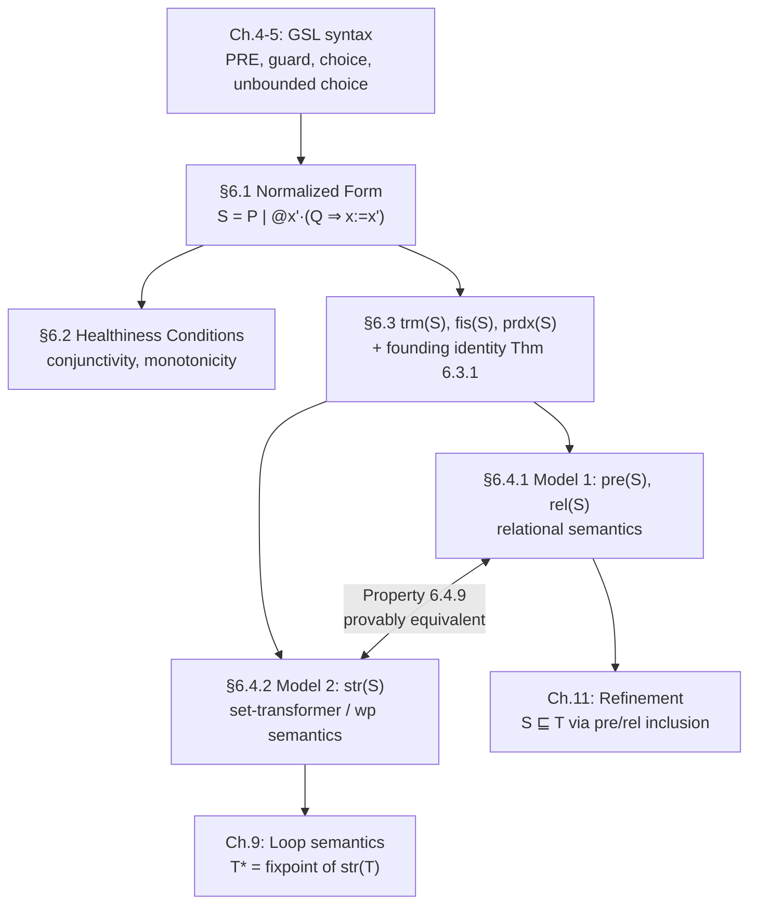

[[book-guidelines|↩ Back to guidelines]]

# Semantics of Generalized Substitutions

## Why the notation itself isn't a good enough foundation

Chapter 4 introduced the Generalized Substitution Language informally, and Chapter 5 nailed down its full syntax and axioms — but syntax and axioms alone are a shaky base for the *next* two projects the book has in mind: loops (Chapter 9) and refinement (Chapter 11), both of which need to reason about substitutions in ways that go well beyond "what does this specific construct do." Abrial's answer is to build **two equivalent set-theoretic models** of a generalized substitution — one as a set-plus-relation, one as a monotonic set-transformer — and to prove that *any* substitution built from GSL's primitives reduces to a canonical shape those models can characterize completely. Once that reduction is in hand, every later development (loop semantics as a fixpoint, refinement as a relation between two models) can be conducted on the *models*, in ordinary set theory, rather than on the notation itself.

This is precisely the architectural move a verifier's own semantics layer needs: don't reason about the AST of `if`/`while`/assignment directly — compile everything down to a small canonical intermediate representation (here: `pre`/`rel`, or equivalently a set-transformer) whose properties you've already proven once, and reason about *that*.

---

## 1. The Normalized Form Theorem: one shape to rule them all

### The claim

Every generalized substitution built from GSL's primitives can be rewritten into exactly one canonical shape:

$$
S \;=\; P \mid @x' \cdot (Q \Rightarrow x := x') \qquad \text{for some } P, Q \text{ with } x \backslash P \qquad \textbf{Theorem 6.1.1}
$$

Read this as: *every* substitution, however built from `PRE`, `CHOICE`, guards, and unbounded choice, is equivalent to "require $P$, then non-deterministically pick any $x'$ satisfying $Q$ and assign it." $P$ is the substitution's **pre-condition** in disguise; $Q$ (a predicate relating $x$ and $x'$) is its **before-after behavior** in disguise. This is not an approximation or a simplification with loss of information — it's a genuine equivalence, proved by structural induction over every GSL construct using thirteen algebraic laws (Laws 1–13) that push pre-conditions and quantifiers outward and choices inward until only one $P\mid@x'\cdot(\ldots)$ shell remains.

**Why this is the single most consequential result in the chapter:** it means every proof *about* the language as a whole — "establishing a post-condition distributes over conjunction," "termination has such-and-such shape," "the set-transformer model is well-defined" — needs to be proved **once**, on the normalized form, rather than once per construct (six-plus separate inductive cases). This is exactly the payoff of compiling a rich source language down to a minimal core calculus before proving metatheoretic properties: a type-soundness or normalization proof for a full-featured language is done once on the (much smaller) desugared core, and every surface construct inherits the result for free through the desugaring. Theorem 6.1.1 *is* that desugaring step, made completely explicit and proved sound.

```rust
// The normalized-form shape as a canonical IR — this is the "core calculus"
// every richer GSL construct compiles down to, exactly the way a compiler's
// frontend desugars sugar into a small typed core before optimization/
// verification passes run.
struct Normalized {
    precondition: Pred,           // P  (x not free in P)
    relation: Pred,                // Q  (relates x, x')
    // meaning: [S]R  ⇔  P ∧ ∀x'·(Q ⇒ [x:=x']R)     — Property 6.1.1
}

fn normalize(s: &Subst) -> Normalized {
    match s {
        Subst::Assign(_, e) => Normalized { precondition: Pred::True, relation: eq_prime(e) }, // Law 1
        Subst::Pre(p, s) => {
            let n = normalize(s);
            Normalized { precondition: p.clone().and(n.precondition), relation: n.relation } // Law 3
        }
        Subst::Choice(s, t) => {
            let (ns, nt) = (normalize(s), normalize(t));
            Normalized {
                precondition: ns.precondition.and(nt.precondition),   // Law 4/5/8
                relation: ns.relation.or(nt.relation),
            }
        }
        Subst::Guard(p, s) => {
            let n = normalize(s);
            Normalized { precondition: p.clone().implies(n.precondition), relation: p.clone().and(n.relation) } // Laws 6/7/10
        }
        Subst::Any(z, s) => {
            let n = normalize(s); // Laws 9, 11, 13 — quantifier reshuffling
            Normalized {
                precondition: Pred::ForAll(z.clone(), Box::new(n.precondition)),
                relation: Pred::Exists(z.clone(), Box::new(n.relation)),
            }
        }
        Subst::Skip => Normalized { precondition: Pred::True, relation: Pred::Eq("x".into(), Expr::Var("x".into())) }, // Law 1+2
    }
}
```

---

## 2. The Healthiness Conditions: conjunctivity and monotonicity

With the normalized form as a single case to check, two structural properties of $[S]R$ (Dijkstra's **healthiness conditions**) get short, uniform proofs:

$$
[S](A \land B) \;\Leftrightarrow\; [S]A \land [S]B \qquad \textbf{Property 6.2.1, conjunctivity}
$$

$$
\forall x \cdot (A \Rightarrow B) \;\Rightarrow\; ([S]A \Rightarrow [S]B) \qquad \textbf{Property 6.2.2, monotonicity}
$$

**Conjunctivity** has an immediate practical payoff: proving a conjunctive invariant reduces to proving each conjunct separately against the same substitution — exactly the modularity a verifier wants when discharging a multi-clause `ensures`/invariant against one operation. **Monotonicity** is the load-bearing property for compositional reasoning: it's what licenses substituting a logically-weaker-but-still-sufficient postcondition into a proof without re-deriving everything, and it's the exact property a predicate-transformer semantics must satisfy for `wp` to compose correctly across program structure (weakening the goal never invalidates an established result).

**Why these two conditions are called "healthiness" rather than just "properties":** they're the axiomatic *characterization* of what counts as a legitimate predicate transformer at all — any $[S]$ satisfying conjunctivity and monotonicity is, by [[Fixpoint-Construction-and-Induction#Construction|construction]], guaranteed to correspond to *some* coherent notion of "program behavior" (no $[S]$ that fails these could correspond to any actual relation between states). This is precisely the role monotonicity plays in a fixpoint-based denotational semantics (recall Chapter 3's Knaster–Tarski: only *monotonic* set transformers are guaranteed fixpoints) — Chapter 9's loop semantics, built as a fixpoint of a set transformer, depends on exactly this monotonicity carrying over from the loop body's substitution.

---

## 3. Termination and feasibility: giving `PRE` and guard formal teeth

Chapter 4 introduced pre-conditioned and guarded substitutions informally ("crashes" vs. "non-feasible"). This section gives both a rigorous, checkable definition, using the same trick throughout: define the *negative* notion via a second-order quantification over all possible post-conditions, then collapse it to a first-order test using $(x=x)$ as a universal witness.

### Termination

$$
\texttt{abt}(S) \;\widehat{=}\; \lnot[S]R \text{ for any predicate } R \qquad\qquad \texttt{trm}(S) \;\widehat{=}\; \lnot\texttt{abt}(S)
$$

collapses (via monotonicity, since $R \Rightarrow (x=x)$ for *any* $R$, so $[S]R$ implies $[S](x=x)$, and conversely — Property 6.3.1/6.3.2) to a genuinely checkable, first-order test:

$$
\texttt{trm}(S) \;\Leftrightarrow\; [S](x=x)
$$

giving a clean compositional catalogue: $\texttt{trm}(x:=E) \equiv \texttt{true}$, $\texttt{trm}(P\mid S) \equiv P \land \texttt{trm}(S)$, $\texttt{trm}(S\Box T) \equiv \texttt{trm}(S)\land\texttt{trm}(T)$, $\texttt{trm}(P\Rightarrow S) \equiv P \Rightarrow \texttt{trm}(S)$, $\texttt{trm}(@z\cdot S) \equiv \forall z\cdot\texttt{trm}(S)$.

**This is exactly a $\top$-based "totality"/termination-oracle test**, structurally the same trick as checking `assert(true)` never fails to characterize whether a program path is unreachable-by-abort. The compositional rules are, essentially, a syntax-directed termination-checking pass over the substitution's structure — directly transferable to a Hoare-logic verifier's "does this statement definitely not abort" analysis, distinct from (and a precondition for) proving it establishes anything *specific*.

### Feasibility

$$
\texttt{mir}(S) \;\widehat{=}\; [S]R \text{ for any predicate } R \qquad\qquad \texttt{fis}(S) \;\widehat{=}\; \lnot\texttt{mir}(S)
$$

("mir" for *miracle* — Dijkstra's term for a statement that establishes everything, including contradictions, because it's vacuously licensed by a false guard). Collapsing the same way: $\texttt{fis}(S) \Leftrightarrow \lnot[S](x\neq x)$, giving the dual catalogue: $\texttt{fis}(P\mid S) \equiv P\Rightarrow\texttt{fis}(S)$, $\texttt{fis}(S\Box T) \equiv \texttt{fis}(S)\lor\texttt{fis}(T)$, $\texttt{fis}(P\Rightarrow S) \equiv P\land\texttt{fis}(S)$, $\texttt{fis}(@z\cdot S) \equiv \exists z\cdot\texttt{fis}(S)$, and — worth pulling out specifically — $\texttt{fis}(x:\in E) \Leftrightarrow E \neq \emptyset$: a "pick any element of $E$" substitution is only implementable if $E$ actually has an element, formalizing exactly the intuition Chapter 4 asserted informally about `ANY`/`:∈` constructs.

**Termination vs. feasibility, side by side, is precondition-failure vs. guard-failure made completely rigorous:** $\texttt{trm}$ is *false* exactly where a `PRE` fails (a genuine specification violation, the caller's fault); $\texttt{fis}$ is *false* exactly where a guard is *vacuously* satisfied because its condition failed (a miracle — logically fine, but *unimplementable*, since no real program can "establish anything"). A CSP/constraint-solving kernel checking "can this branch even be taken" is asking a feasibility question in exactly this sense; a contract checker validating "did the caller discharge the precondition" is asking a termination question in exactly this sense. Keeping the two separate in a verifier's own IR — rather than collapsing both into one generic "this could go wrong" flag — is directly justified by this section's insistence on two distinct, independently axiomatized predicates.

---

## 4. `prdx(S)`: recovering the before-after predicate, and the founding identity

### Definition and the systematic translation table

$$
\texttt{prd}_x(S) \;\widehat{=}\; \lnot[S](x \neq x')
$$

read: $x'$ is a *reachable* after-value from $x$ under $S$ exactly when $S$ does *not* guarantee $x \neq x'$ — i.e., $x'$ isn't ruled out. This is the formal inverse of the One Point Rule move from Chapter 4 §2: where Chapter 4 went before-after-predicate → substitution, `prdx` goes substitution → before-after-predicate, closing the loop and proving the two representations are **interconvertible with no loss of information**. The compositional table is a clean syntax-directed translation:

$$
\texttt{prd}_x(x:=E) \equiv x'=E \qquad \texttt{prd}_x(P\mid S) \equiv P \Rightarrow \texttt{prd}_x(S) \qquad \texttt{prd}_x(S\Box T) \equiv \texttt{prd}_x(S)\lor\texttt{prd}_x(T) \qquad \texttt{prd}_x(@z\cdot S) \equiv \exists z\cdot\texttt{prd}_x(S) \text{ (if } z\backslash x')
$$

A worked example makes the non-determinism concrete: $\texttt{prd}_x((x{:=}x{+}1)\Box(x{:=}x{-}1)) \equiv (x'=x+1)\lor(x'=x-1)$ — and in a multi-variable machine, an unmentioned variable $y$ picks up $y'=y$ automatically (Chapter 4's point about before-after predicates always needing an explicit "unchanged" clause, now shown as something the generalized-substitution formulation gets *for free*).

### The founding identity: `trm` and `prdx` together characterize `S` completely

$$
S = \texttt{trm}(S) \mid @x' \cdot (\texttt{prd}_x(S) \Rightarrow x := x') \qquad \textbf{Theorem 6.3.1}
$$

This is Theorem 6.1.1's normalized form, specialized: $P$ *is* $\texttt{trm}(S)$, and $Q$ *is* $\texttt{prd}_x(S)$ — the two "unknowns" of the normalized shape turn out to be exactly the termination and before-after predicates, no more and no less. **This single identity is the formal justification for treating a Hoare-triple's precondition and its relational (before-after) content as jointly sufficient to pin down a specification completely** — you never need a third piece of information. It's also precisely the statement that GSL and the before-after-predicate style (VDM/Z) have **identical expressive power**: anything one can specify, the other can too, via this translation, so the choice between them (made in Chapter 4 in favor of substitutions) is purely one of notational convenience, never of expressiveness.

---

## 5. Two equivalent set-theoretic models

### Model 1: pre-set and relation

Given a substitution $S$ working over an invariant $x \in s$:

$$
\texttt{pre}(S) \;\widehat{=}\; \{x \mid x \in s \land \texttt{trm}(S)\} \qquad \texttt{rel}(S) \;\widehat{=}\; \{x,x' \mid (x,x')\in s\times s \land \texttt{prd}_x(S)\} \qquad \texttt{dom}(S) \;\widehat{=}\; \{x \mid x\in s \land \texttt{fis}(S)\}
$$

**The single most counter-intuitive, and most important, fact in this section:**

$$
\overline{\texttt{pre}(S)} \times s \;\subseteq\; \texttt{rel}(S) \qquad \textbf{Property 6.4.1}
$$

Outside its pre-condition, $\texttt{rel}(S)$ connects *every* point to *every* point — not "nothing," but *everything*. This looks like it's adding spurious behavior, but it's exactly right: outside the pre-condition, $S$ is defined (per Chapter 4 §2) to establish *anything whatsoever* ($\texttt{trm}(S)$ is false there, so $[S]R$ can be vacuously anything), and a relation that "can go anywhere" from a given point is precisely a relation containing every pair from that point. **This is the relational-algebra encoding of undefined behavior**, and it's the reason a Hoare-logic soundness proof has to be so careful about what a failed precondition entails: the semantic model doesn't just say "we don't know what happens" — it says "the relation genuinely contains every possible outcome from there," which is exactly what licenses discharging *any* postcondition as trivially true once you're outside the precondition (the same over-approximation an abstract interpreter uses at an unreachable or contract-violated program point).

Conversely, any pre-set/relation pair satisfying this inclusion **reconstructs** a unique substitution (Property 6.4.4): $\texttt{pre}(S) = p$, $\texttt{rel}(S) = r$ for $S \;\widehat{=}\; x\in p \mid @x'\cdot((x,x')\in r \Rightarrow x:=x')$ whenever $\overline{p}\times s \subseteq r$. Substitutions and (pre-set, relation)-pairs-with-that-inclusion-property are in exact bijective correspondence.

### Model 2: the set transformer

$$
\texttt{str}(S) \;\widehat{=}\; \lambda p \cdot (p \in \mathbb{P}(s) \mid \{x \mid x \in s \land [S](x \in p)\}) \qquad \texttt{str}(S) \in \mathbb{P}(s) \to \mathbb{P}(s)
$$

This is Dijkstra's `wp` made into a genuine mathematical *function* rather than a syntactic predicate-transformer — feed it the set of "acceptable" post-states, get back the set of pre-states from which $S$ is guaranteed to land in that set. The two models translate into each other cleanly:

$$
\texttt{pre}(S) = \texttt{str}(S)(s) \qquad \texttt{dom}(S) = \texttt{str}(S)(\emptyset) \qquad \texttt{str}(S)(p) = \texttt{pre}(S) \cap \texttt{rel}(S)^{-1}[p] \qquad \textbf{Property 6.4.9}
$$

**Why keep both models rather than picking one:** `pre`/`rel` is the natural home for *relational* reasoning (composition, inverse, restriction — Chapter 2's whole toolkit applies directly, and it's the model refinement — Chapter 11 — will use, since refinement is fundamentally a statement about relations narrowing). `str` is the natural home for *fixpoint* reasoning (it's literally a monotonic set transformer of exactly the Knaster–Tarski shape from Chapter 3, which is precisely why Chapter 9 defines the loop construct's semantics as `str`'s own least/greatest fixpoint). Having both, provably equivalent, means each later chapter can use whichever model makes *its* argument cleanest, with zero risk of the two disagreeing.

```lean
-- Theorem 6.3.1 and Property 6.4.9 together are the formal guarantee that
-- "predicate-transformer semantics" (str, ~ wp) and "relational semantics"
-- (pre/rel, ~ an operational/denotational state-transition relation) are
-- interchangeable presentations of the same object — precisely the kind
-- of soundness bridge a verifier needs when its VC generator computes
-- weakest preconditions but its underlying operational-semantics-based
-- trust argument (or its symbolic executor) reasons in terms of concrete
-- state-transition relations. Without this bridge, "the wp calculus is
-- sound with respect to the operational semantics" would need a separate,
-- from-scratch proof; here it falls out of Theorem 6.3.1 for free.
```

```rust
// The two models, side by side, with the translation Property 6.4.9 gives
// for free — useful when a verifier's frontend produces one representation
// (e.g. wp/str from syntax-directed VC generation) but a backend solver
// wants the other (e.g. rel, to run relational/graph algorithms on it).
struct RelModel<T> { pre: Set<T>, rel: Relation<T, T> }
struct TransformerModel<T> { str: Box<dyn Fn(&Set<T>) -> Set<T>> }

impl<T: Clone + Ord> RelModel<T> {
    fn to_transformer(&self, universe: &Set<T>) -> TransformerModel<T> {
        let pre = self.pre.clone();
        let rel_inv = self.rel.inverse();
        TransformerModel {
            str: Box::new(move |p: &Set<T>| pre.intersect(&rel_inv.image(p))), // str(S)(p) = pre(S) ∩ rel(S)⁻¹[p]
        }
    }
}
```

---

## Where this leads



This chapter is the hinge the entire second half of the book turns on. Chapter 9's loop construct is defined as a **fixpoint** of exactly the kind of monotonic set-transformer this chapter builds (`str`), reusing Chapter 3's Knaster–Tarski machinery directly on `str`'s own type $\mathbb{P}(s)\to\mathbb{P}(s)$; Chapter 11's refinement relation $S \sqsubseteq T$ is defined set-theoretically as $\texttt{pre}(S)\subseteq\texttt{pre}(T) \land \texttt{rel}(T)\subseteq\texttt{rel}(S)$ — a direct statement about **this chapter's Model 1**, not about GSL syntax at all. For the compiler/elaborator/verifier project, this chapter is the closest the book comes to a full **denotational semantics with a proven soundness bridge to an operational (relational) semantics** — Theorem 6.3.1 is the soundness theorem, `trm`/`fis`/`prdx` are the semantic judgments a real Hoare-logic verifier's VC generator computes (whether it knows it or not), and the healthiness conditions are the exact algebraic laws that must hold of any `wp`-style predicate transformer for compositional verification to be sound at all.

---

*Style/goals config applied: `vaults/.article-style.md` (workbench-wide — Rust primary for the normalization/model-translation sketches, Lean for the soundness-bridge framing, Mermaid for the structural diagram) and `vaults/.learning-goals.md` (workbench-wide — emphasis on weakest-precondition semantics, soundness bridges between denotational and relational models, and the trm/fis distinction as it maps onto contract violations vs. dead-path reasoning in a VC generator). No book-specific style or goals file exists for this book.*
