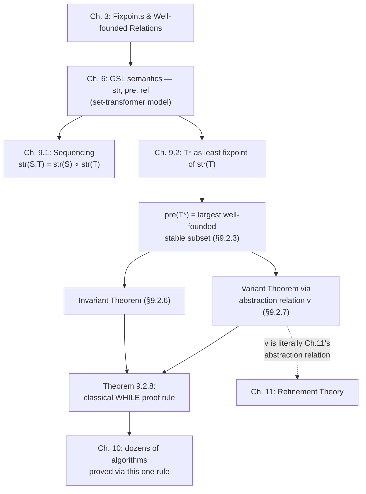

[[book-guidelines|↩ Back to guidelines]]

## Why this chapter has to exist

Every abstract machine so far — Chapters 4 through 8 — was built out of *specification*-level substitutions: assignment, `skip`, guard, precondition, bounded and unbounded choice. Those constructs are enough to *say what an operation does* (its before/after relation), but they are deliberately weak on *how* it does it. An operation body like `ANY r WHERE r ∈ ℕ ∧ r ∉ c THEN r := r' END` doesn't tell you an algorithm; it tells you a postcondition and licenses any implementation that meets it.

Sooner or later you need to go from "here is a relation between before-state and after-state" to "here is a sequence of steps a machine actually performs." That transition needs exactly two new pieces of machinery that ordinary imperative languages take for granted and that the generalized-substitution calculus has so far refused to give you:

1. **Sequencing** (`;`) — "do this, then do that."
2. **Looping** (`T*`, and its sugared form `WHILE`) — "repeat this until some condition stops holding."

Abrial is explicit that these two constructs are never used to *specify* a machine's operations — only to *refine* one (Chapter 11). That's a design choice worth sitting with: sequencing and iteration are treated as *implementation* concepts, not specification concepts, because a specification should describe *what*, and control flow is inherently about *how*. This chapter is the mathematical foundation that makes it sound to write a loop and then claim, with proof, that it implements a given specification.

The chapter's center of gravity is not sequencing (which is a short, mostly mechanical section) — it's the loop. And the reason the loop needs forty pages of set theory where sequencing needed four is that "repeat until $P$ fails" secretly bundles together two very different properties that are easy to conflate and dangerous to conflate:

- **Partial correctness**: *if* the loop stops, the postcondition holds.
- **[[Semantics-of-Generalized-Substitutions#Termination|Termination]]**: the loop *does* stop.

Weakest-precondition reasoning ($[S]R$, read "$S$ establishes $R$") handles both uniformly for `skip`, assignment, and choice, because those constructs can't fail to terminate. A loop can. So before you can even *write down* $[T^*]R$ correctly, you need a theory of what it means for repeated application of a relation to "run out" — and that theory turns out to be exactly the theory of **well-founded relations** from Chapter 3, section 3.11. This is the load-bearing fact of the whole chapter: *loop termination is well-foundedness, restated*.

---

## 1. Sequencing of generalized substitutions

### 1.1 The motivating gap

Nothing in the substitution calculus built up through Chapter 7 lets you say "first do $S$, then do $T$." Function composition of relations ($p ; q$ from section 2.4) gives you the *before-after relation* of doing two things in a row, but a generalized substitution isn't just a relation — it's a predicate transformer, and predicate transformers compose in the *opposite* direction from relations (this is the same contravariance you'd recognize from `map`/`fmap` versus a Kleisli composition, or from how a type checker's context grows going one way while the substitution that discharges it flows the other).

### 1.2 Syntax and axiom

Abrial simply extends the `Substitution` grammar with a new production:

$$
\text{Substitution} ::= \text{Substitution} \,;\, \text{Substitution}
$$

and gives it the defining axiom in terms of $[\cdot]$: $S ; T$ establishes $R$ exactly when $S$, run first, establishes that $T$ establishes $R$:

$$
[S ; T]R \;\Leftrightarrow\; [S]\big([T]R\big)
$$

This is *the* line to internalize before anything else in this article: sequencing is **substitution of predicate transformers into predicate transformers**. $[T]R$ is itself a predicate (the weakest precondition of $R$ under $T$); $S ; T$ establishes $R$ iff $S$ establishes *that* predicate. Everything downstream — trm, prd, fis, pre, rel, str for `;` — is just this one line pushed through each construct's own definition.

### 1.3 Derived properties (trm, prd, fis, pre, rel, str)

From that axiom, combined with the definitions from Chapter 6 (termination $trm(S)$ — "$S$ doesn't abort"; [[Semantics-of-Generalized-Substitutions#Feasibility|feasibility]] $fis(S)$ — "$S$ doesn't miracle"; the before-after predicate $prd_x(S)$), Abrial derives:

$$
trm(S;T) \;\Leftrightarrow\; \big(trm(S) \wedge \forall x' \cdot (prd_x(S) \Rightarrow [x:=x']\,trm(T))\big)
$$

Read this in words: *the sequence terminates iff $S$ terminates, and every state $x'$ that $S$ could plausibly leave you in is one from which $T$ also terminates.* This is exactly the two-part Hoare-style reasoning you already do informally when you chain two functions and ask "does the first one ever throw, and if it returns, does the second one ever throw on that output?" — except here it's stated with full generality over $S$'s *entire* set of possible after-states, because $S$ may be non-deterministic.

The set-theoretic counterparts (section 6.4) compose the same way, but now as genuine relational/functional composition:

$$
pre(S;T) = pre(S) \cap \overline{rel(S)^{-1}[\overline{pre(T)}]} \qquad
rel(S;T) = \overline{pre(S)} \times s \;\cup\; rel(S) ; rel(T) \qquad
str(S;T)(p) = str(S)\big(str(T)(p)\big)
$$

The last equation is the cleanest of the three and the one to keep: **the set-transformer semantics of `;` is literal function composition of set transformers**, $str(S;T) = str(S) \circ str(T)$ — note the order flips relative to reading order, the same contravariance mentioned above.

### 1.4 Algebraic laws, and why they're asymmetric

Abrial then lists a catalogue of algebraic identities — `skip` is a left and right identity, `;` is associative, and `;` distributes over precondition, guard, and choice **on the left**:

$$
(P \mid S) ; T = P \mid (S;T) \qquad (P \Rightarrow S) ; T = P \Rightarrow (S;T) \qquad (S \Box T) ; U = (S;U) \Box (T;U)
$$

but the *right*-distribution laws are weaker or restricted:

$$
S ; (P \mid T) = [S]P \mid (S;T) \qquad S ; (T \Box U) = (S;T) \Box (S;U)
$$

and one law holds only for a *deterministic* left-hand side, marked with an asterisk in the source:

$$
(x := E) ; (P \Rightarrow S) = [x:=E]P \Rightarrow (x := E ; S) \quad {}^{*}
$$

with the book flagging explicitly that this equality would **fail** if `x := E` were replaced by an arbitrary (non-deterministic) substitution. This is the chapter's first "what breaks without care" moment: **sequencing does not distribute symmetrically because of non-determinism**. Precondition and guard distribute cleanly to the left because "$S$ then ($P$-precondition $T$)" can push $P$'s truth-check back through a *single* known continuation of $S$ only when $S$ has one definite after-state to check $P$ against. If $S$ is a choice among many possible after-states, "$T$'s precondition holds" has to be evaluated per-branch, not hoisted wholesale — which is exactly what the weaker right-distribution laws express (they distribute through `Box` because choice-of-choice is still a well-defined predicate no matter how many branches there are, but a precondition test genuinely needs a specific state to evaluate against).

**What this buys you in practice**: this asymmetry directly justifies familiar code-motion refactorings — e.g. hoisting an `if` out of a sequence, `x := E; IF P THEN T ELSE U END = IF [x:=E]P THEN x:=E;T ELSE x:=E;U END` — as *proved algebraic identities* rather than "obviously fine" transformations. Compiler folks will recognize this shape immediately: it's the same reasoning that licenses constant propagation followed by branch specialization, except here soundness comes with an explicit written-down proof obligation instead of an ad-hoc "the optimization is sound because..." comment.

Finally, a monotonicity property that will resurface, essentially unchanged, as the engine of the loop's correctness proof:

$$
[S]P \;\wedge\; \forall x \cdot (P \Rightarrow [T]R) \;\Rightarrow\; [S;T]R \qquad \text{(Property 9.1.1)}
$$

*If $S$ establishes $P$, and $P$ (at every reachable state, universally) implies $T$ establishes $R$, then $S;T$ establishes $R$.* This is Hoare's sequencing rule — $\dfrac{\{P\}S\{Q\} \quad \{Q\}T\{R\}}{\{P\}S;T\{R\}}$ — written in weakest-precondition style instead of triple style, with the universal quantifier flagged as essential (it has to hold for *every* state satisfying $P$, not just the one $S$ happens to produce, because $S$ may be non-deterministic).

### Grounding: sequencing as predicate-transformer composition

```rust
// A generalized substitution as a predicate transformer: given a postcondition,
// produce its weakest precondition. `R` here stands for a boolean-valued
// predicate over the state — think of it as a closure over `State`.
type Predicate<State> = std::rc::Rc<dyn Fn(&State) -> bool>;

trait Substitution<State> {
    /// [S] R  —  the weakest precondition under which S establishes R.
    fn wp(&self, r: Predicate<State>) -> Predicate<State>;
}

struct Seq<State, S, T> {
    s: S,
    t: T,
    _marker: std::marker::PhantomData<State>,
}

impl<State, S: Substitution<State>, T: Substitution<State>> Substitution<State> for Seq<State, S, T> {
    fn wp(&self, r: Predicate<State>) -> Predicate<State> {
        // [S ; T] R  =  [S] ([T] R)
        self.s.wp(self.t.wp(r))
    }
}
```

This is not a cute analogy — it *is* the theorem $str(S;T) = str(S) \circ str(T)$, typed. If you are building a verifier's VC (verification condition) generator, this is literally the shape of `wp_seq`: compute the postcondition's weakest precondition through the second statement first, then feed that as the target postcondition into the first. Every WP-calculus-based tool (Dafny, Why3, Boogie) implements exactly this composition for `;`.

---

## 2. The loop operator as a substitution fixpoint

### 2.1 The expansion equation

Abrial wants a primitive substitution $T^\ast$ ("$T$ opened", though he also entertains "$T$ star") satisfying the informal unrolling every imperative programmer already knows:

$$
T^\ast \;=\; skip \;\Box\; (T ; T^\ast)
$$

*In words: either do nothing (the loop is already done), or do $T$ once and then the whole loop again.* Note this is stated with `Box` (bounded choice), not a conditional — $T^\ast$ doesn't yet know *when* to stop; that's what the `WHILE` sugar built on top of it will add (below). $T^\ast$ by itself just says "zero or more repetitions of $T$, non-deterministically choosing when to stop" — precisely the *Kleene star* of relational algebra, lifted to the substitution level.

From $T^\ast$, `WHILE` is *defined*, not primitive:

$$
\texttt{WHILE } P \texttt{ DO } S \texttt{ END} \;\overset{\text{def}}{=}\; (P \Rightarrow S)^\ast ; (\lnot P \Rightarrow skip)
$$

*Repeat "if $P$, do $S$" some (non-deterministically chosen) number of times, then require $\lnot P$ and stop.* The proof that this really does unfold the way a `WHILE` loop should — $\texttt{WHILE } P \texttt{ DO } S \texttt{ END} = \texttt{IF } P \texttt{ THEN } S ; \texttt{WHILE } P \texttt{ DO } S \texttt{ END END}$ — is a five-line algebraic derivation using exactly the sequencing laws from Section 1 above, substituting the expansion of $(P \Rightarrow S)^\ast$ and simplifying with `skip`'s identity laws. It's satisfying precisely because it shows the informal "obviously true" unrolling equation is a *derived theorem*, not an assumption.

### 2.2 $T^\ast$ as a least fixpoint of a set transformer

Here is where the chapter earns its length. $T^\ast$ can't be defined the way every other construct so far was — by a direct case-by-case clause in [[Set-Theory-and-the-Relational-Calculus#The syntax|the syntax]]'s semantic axioms — because $T^\ast$ is *self-referential*: its own definition ($skip \Box (T;T^\ast)$) mentions itself. This is precisely the situation Chapter 3's Knaster–Tarski machinery (`fix`, monotonic set transformers, section 3.2) was built to handle, and Abrial now cashes that investment in directly.

Working in the set-transformer model $str$ (section 6.4.2, where $str(S)(p)$ is the set of states from which $S$ guarantees landing in $p$), the expansion equation becomes, for any subset $p \subseteq t$ of the state space:

$$
str(T^\ast)(p) \;=\; p \;\cap\; str(T)\big(str(T^\ast)(p)\big)
$$

— i.e. $str(T^\ast)(p)$ is a **fixpoint** of the set function $g \mapsto p \cap str(T)(g)$. Since $str(T)$ is always monotonic (a healthiness condition established in Chapter 6), Abrial *defines* $str(T^\ast)(p)$ to be the **least** such fixpoint:

$$
str(T^\ast)(p) \;\overset{\text{def}}{=}\; \mathrm{fix}\big(\lambda r \cdot (r \in \mathbb{P}(t) \mid p \cap str(T)(r))\big)
$$

This is the single most important definitional choice in the chapter, and it's worth pausing on *why least* and not *greatest*. A least fixpoint of a monotonic set function is built "from the bottom up" — starting from $\varnothing$ and iterating the function — which, unwound, corresponds to: *the empty set of guaranteed-terminating states, plus states from which one step of $T$ lands you in a guaranteed-terminating state, plus states from which two steps do, ...* This is finite unrolling, which is exactly what "termination in finitely many steps" should mean. A *greatest* fixpoint, by contrast, would happily include states that loop forever without ever "bottoming out" at a real base case — that's precisely the tool used later (Theorem 9.2.3) to characterize the loop's before-after relation $rel(T^\ast)$, which *does* need to account for infinite/non-terminating runs.

Two supporting theorems (9.2.1, 9.2.2 — general results about fixpoints of the form $\mathrm{fix}(\lambda p \cdot (p \cap g(p)))$, proved by a careful double-inclusion argument via Theorem 3.2.1 from Chapter 3) establish that this definition is well-formed and — critically — that $str(T^\ast)$ still satisfies the healthiness condition of distributing over generalized intersection, so $T^\ast$ is a legitimate citizen of the generalized substitution language, not a special-cased exception to it.

### What breaks without the fixpoint framing

If you tried to define $T^\ast$ directly as "iterate $T$ until $P$ fails, syntactically," you'd need a *metalinguistic* notion of "how many times" that doesn't exist inside the substitution calculus itself (which has no built-in natural-number-indexed repetition primitive — recall that $\mathbb{N}$ itself had to be *constructed* via fixpoint in Chapter 3, precisely so this kind of definition would be available later). Casting $T^\ast$ as a fixpoint sidesteps needing a counting mechanism entirely: it characterizes "the loop's effect" purely in terms of *stability under $T$*, which will turn out — in the next section — to be identical to well-foundedness, no counting required.

### Grounding: least fixpoint as bounded/derived iteration

```lean
-- The book's str(T*) is literally a Lean well-founded fixpoint / structural
-- recursion in disguise. If `T` is total on a subtype `p` reachable in
-- finitely many T-steps, `T*`'s termination set is built the same way
-- Lean's `WellFoundedRecursion` unfolds a recursive definition: from
-- terminating base cases outward, never assuming the whole set upfront.

-- A relation `step` standing for `rel(T)`, and `wfd` standing for well-foundedness
-- of `step` restricted to the loop's termination set:
variable {State : Type} (step : State → State → Prop)

-- pre(T*) as "the set of states from which `step` admits no infinite chain" —
-- exactly Lean's `Acc` (accessibility) predicate:
-- `Acc step x` holds iff every step-successor of `x` is itself `Acc step`-accessible.
-- This is definitionally the same "least fixpoint of a stability condition" Abrial builds by hand.
#check @Acc
#check @WellFounded
```

The correspondence here is not decorative: `Acc` in Lean's core library *is* $\mathrm{fix}$ applied to exactly the kind of monotonic "all-successors-are-good" set transformer Abrial writes out longhand. When Lean's kernel accepts a `termination_by`/`decreasing_by` recursive definition, it is discharging, mechanically, the same proof obligation this section derives by hand: exhibit that the recursion only ever recurses into $Acc$-elements.

---

## 3. Termination as a well-founded stability condition

### 3.1 $pre(T^\ast)$ is the largest well-founded stable subset

Instantiating the fixpoint definition at $p = t$ (the whole state space) gives the termination set of the loop:

$$
pre(T^\ast) = \mathrm{fix}(str(T))
$$

Unfolding this (Property 6.4.9, translating $str$ back into $rel$) yields two dual characterizations that Abrial proves are equal — and this equality is the conceptual heart of the whole chapter:

$$
pre(T^\ast) \;=\; \bigcup\Big\{\,p \in \mathbb{P}(t) \;\Big|\; p \subseteq rel(T)^{-1}[p]\,\Big\}
\qquad\text{(the union of all self-sustaining "cycle" sets)}
$$

$$
pre(T^\ast) \;=\; \bigcap\Big\{\,p \in \mathbb{P}(t) \;\Big|\; rel(T)^{-1}[\overline{p}] \subseteq \overline{p}\,\Big\}
\qquad\text{(the largest set stable under, and well-founded w.r.t., }rel(T)\text{)}
$$

Read the first form operationally: a set $p$ satisfying $p \subseteq rel(T)^{-1}[p]$ is one where **every point in $p$ has a $T$-successor also in $p$** — that's exactly what it means for $p$ to be entirely made of infinite chains or cycles under $T$. The union of *all* such sets is therefore the largest possible collection of states from which $T$ can be made to run forever (by an adversary picking the "wrong" non-deterministic branch every time). The *complement* of that union — everything left over — is $pre(T^\ast)$: every non-deterministic execution starting there is eventually forced to run out of road.

Abrial then proves, as the crux result of the section:

$$
wfd\big(pre(T^\ast) \triangleleft rel(T)\big) \qquad \text{(Property, derived directly from the above)}
$$

— the loop's before-after relation, **restricted to its own termination set**, is a well-founded relation in exactly the sense of Chapter 3, section 3.11 ($wfd(r)$: no non-empty subset is entirely "self-devouring" under $r$). This is the payoff the whole apparatus was built for: **"the loop terminates from $p$" and "$rel(T)$ restricted to $p$ is well-founded" are literally the same statement**, not two facts that happen to correlate.

The section closes with **Property 9.2.4**, establishing $pre(T^\ast)$ as *maximal* with this property — any other set $p$ that is both $rel(T)$-stable ($rel(T)[p] \subseteq p$) and well-founded is automatically a subset of $pre(T^\ast)$:

$$
rel(T)[p] \subseteq p \;\wedge\; wfd(p \triangleleft rel(T)) \;\Rightarrow\; p \subseteq pre(T^\ast)
$$

This maximality is what makes the theory *usable*: instead of computing $pre(T^\ast)$ exactly (generally infeasible), you exhibit *some* stable, well-founded $p$ and you get a sound (if possibly incomplete) termination guarantee for free. This is the proof rule that everything in Sections 4–6 below packages into something you'd actually write in a program.

### 3.2 $rel(T^\ast)$: the "transitive opening"

A companion derivation (section 9.2.4) computes the loop's full before-after relation as a **greatest** fixpoint:

$$
rel(T^\ast) \;=\; \mathrm{FIX}\big(\lambda r \cdot (r \in s \leftrightarrow s \mid id(t) \cup (rel(T);r))\big) \;=\; pre(T^\ast) \times t \;\cup\; rel(T)^{*}
$$

Note the two fixpoint flavors doing two different jobs in the same chapter: the *least* fixpoint (Section 2) captures "provably terminates," while the *greatest* fixpoint here captures "everything a non-deterministic run could possibly do, terminating or not" — including the degenerate case of never terminating, which the relation must still account for (recall from Chapter 6 that outside a substitution's precondition, its `rel` is required to be "anything goes," $\overline{pre(S)} \times s \subseteq rel(S)$; that's precisely the first disjunct here). Abrial calls $rel(T^\ast)$ the **transitive opening** of $rel(T)$ by direct analogy with transitive closure — same generating equation, opposite fixpoint polarity.

### Grounding: well-founded stability as the termination-analysis lattice element

```python
# A toy illustration of pre(T*) as the *largest well-founded stable set*,
# computed by the same fixpoint-from-the-top-down idea Property 9.2.4
# licenses: start from a candidate set, verify stability + well-foundedness,
# and you get a *sound* (possibly under-approximate) termination proof —
# without ever enumerating all of pre(T*) itself.

def is_stable_and_wf(candidate: set, rel: dict[int, set[int]]) -> bool:
    """rel: adjacency map standing for rel(T). Checks rel(T)[p] ⊆ p
    and that rel(T) restricted to p has no cycle (a finite stand-in
    for well-foundedness on a finite state space)."""
    # stability: every successor of a candidate point stays in candidate
    for x in candidate:
        if not rel.get(x, set()) <= candidate:
            return False
    # well-foundedness on a finite set == acyclicity of the restriction
    visited, stack = set(), []
    def has_cycle(node, on_stack):
        if node in on_stack:
            return True
        if node in visited:
            return False
        visited.add(node); on_stack.add(node)
        for nxt in rel.get(node, set()) & candidate:
            if has_cycle(nxt, on_stack):
                return True
        on_stack.discard(node)
        return False
    return not any(has_cycle(n, set()) for n in candidate)
```

If you are building an abstract-interpretation-based termination analyzer (directly relevant to the CSP/Horn-clause kernel in your project's stated goals), this *is* the shape of a **ranking-function-free** termination check: exhibit a candidate over-approximation of the reachable states, discharge stability as a Horn-clause obligation ($rel(T)[p] \subseteq p$), and discharge well-foundedness either syntactically (finite domain, as above) or via an explicit ranking function (Section 5, next). The two are not competing techniques — Abrial's Property 9.2.4 is exactly the theorem that licenses swapping one for the other.

---

## 4. The Invariant Theorem

Section 3 tells you what $pre(T^\ast)$ *is*; it doesn't yet give you a usable proof rule for showing a postcondition holds. The **Invariant Theorem** is the first practical payoff:

$$
p \subseteq str(T)(p) \;\wedge\; p \subseteq pre(T^\ast) \;\Rightarrow\; p \subseteq str(T^\ast)(p) \qquad \textbf{Invariant Theorem}
$$

In words the book gives directly: *if a set $p$ is invariant under $T$ (one step of $T$ can't leave $p$), and if $T^\ast$ is guaranteed to terminate when started in $p$, then $T^\ast$ is invariant under $p$ too.* This is derived as a direct instance of the general Theorem 9.2.4 about fixpoints (itself proved via Theorem 3.2.3 from Chapter 3 — a sufficient-condition lemma for fixpoint inclusion, of the shape "if $p \subseteq f(p)$ then $p \subseteq \mathrm{fix}(f)$ under monotonicity"). Structurally this is exactly loop-invariant reasoning as you already know it — "if the loop body preserves the invariant, the invariant holds after any number of iterations" — except stated with the termination side-condition made syntactically explicit rather than assumed implicitly. That side-condition, $p \subseteq pre(T^\ast)$, is precisely what a naive "invariant + preserved ⇒ holds forever" argument in an untyped/partial setting is silently smuggling in, and what a *total*-correctness Hoare logic must discharge separately (this is the classic partial- vs. total-correctness distinction: an invariant alone only proves *partial* correctness — "if it stops, $p$ holds" — you additionally need termination to get *total* correctness).

---

## 5. The Variant Theorem and abstraction relations

### 5.1 The gap the Invariant Theorem leaves open

The Invariant Theorem's second hypothesis, $p \subseteq pre(T^\ast)$, is exactly the thing you don't yet know how to prove — it's the termination obligation itself. The **Variant Theorem** supplies sufficient conditions for it, and does so by *reduction to a relation you already trust*.

By Property 9.2.5 (the practical restatement of well-foundedness from Section 3), the condition needed is $wfd(p \triangleleft rel(T))$. Chapter 3's Theorem 3.11.1 already told you how to prove a relation well-founded *without* verifying well-foundedness directly: exhibit an already-well-founded relation $r$ on some other set $s$, and a **total relation** $v$ (from $p$ to $s$) simulating $r'$ by $r$:

$$
v^{-1} ; r' \subseteq r ; v^{-1}
$$

Abrial instantiates this by picking a substitution $S$ on $s$ whose own loop $S^\ast$ is *already known* to terminate on all of $s$ ($pre(S^\ast) = s$) — the canonical witness being the "decrease a natural number" substitution from Section 2.5's worked example, $S = \texttt{ANY } n' \texttt{ WHERE } n' \in \mathbb{N} \wedge n' < n \texttt{ THEN } n := n' \texttt{ END}$, whose $S^\ast$ was shown to always terminate on $\mathbb{N}$ precisely *because* "$<$" on $\mathbb{N}$ is well-founded.

Working through what the simulation condition $v^{-1} ; rel(T) \subseteq rel(S) ; v^{-1}$ demands, plus $dom(v) = p$ and $v^{-1}[pre(S)] = p$, Abrial names $v$ the **variant relation** in this chapter, but immediately flags — and this is a genuinely important cross-reference — that these are *exactly* the sufficient conditions for **$T$ to refine $S$**, which Chapter 11 will call $v$ the **abstraction relation** and prove formally (Theorem 11.2.4). The two boxed conditions of the Variant Theorem *are* a refinement proof obligation, discovered here in embryo before refinement itself has been formally defined.

$$
\begin{aligned}
v &\in p \leftrightarrow s, \quad dom(v) = p \\
\forall a \cdot \big(a \subseteq t \Rightarrow str(S)(v[a]) \subseteq v[str(T)(a)]\big) \\
pre(S^\ast) &= s
\end{aligned}
\;\Bigg\}\; \Rightarrow \; wfd(p \triangleleft rel(T)) \qquad \textbf{Variant Theorem}
$$

Why does this matter *conceptually*, not just technically? Because it means **the reason a termination proof and a refinement proof share machinery is not a coincidence — they are the same proof**. Proving "my loop terminates" is proving "my loop's behavior, viewed through an abstraction $v$, is simulated by an already-terminating reference process." That reference process is usually as boring as "a natural number counts down" — but the *theorem* doesn't care; it works for any well-founded target, e.g. lexicographic orders on sequences (used explicitly for the sequence-variant version, Theorem 9.2.5′).

### 5.2 Why go through an abstraction relation at all?

The Key Question the guidelines flag for this section deserves a direct answer: why not just say "exhibit a well-founded relation directly on $T$'s own state space" and skip $v$, $S$, $s$ entirely? Two reasons, both visible in the derivation:

1. **Reusability.** A single always-terminating reference substitution $S$ (e.g. "decrement a natural") can be reused, via a different $v$ each time, to prove termination of *every* loop whose variant reduces to a natural number — you're not proving "$<$ on $\mathbb{N}$ is well-founded" from scratch each time; you cite it once (Chapter 3, section 3.5) and reduce everything else to it.
2. **This is literally how you'll want to build a termination checker.** A well-founded relation directly on an arbitrary, possibly infinite or structured state space is often not *checkable*; a well-founded relation on $\mathbb{N}$ (or on sequences under lexicographic order, or on multisets under a multiset ordering) is decidable and syntactically checkable by a machine. The abstraction relation $v$ is exactly the "measure function" (usually written $V$, the *variant*) that a termination checker actually evaluates.

### Grounding: the variant relation as a decreasing measure / termination metric

```rust
// The book's "variant relation" v, specialized (as it is in Theorem 9.2.5)
// to v = λx.(I | V) — a *function* from the loop state to ℕ.
// This is precisely what a Rust static analyzer / borrow-checker-adjacent
// termination checker would compute per loop: a ranking function.

trait Variant<State> {
    /// The measure V(x). Must be well-typed into a well-founded codomain.
    fn measure(&self, state: &State) -> u64; // ℕ, matching Theorem 9.2.5
}

/// Property required by the Variant Theorem, restated as a proof obligation
/// a verifier would discharge as a VC (verification condition):
///   ∀x. I(x) ∧ P(x) ⇒ measure(step(x)) < measure(x)
fn termination_vc<S, V: Variant<S>>(
    invariant: impl Fn(&S) -> bool,
    guard: impl Fn(&S) -> bool,
    step: impl Fn(&S) -> S,
    variant: &V,
    state: &S,
) -> bool {
    !(invariant(state) && guard(state)) ||
        variant.measure(&step(state)) < variant.measure(state)
}
```

```lean
-- In Lean, this exact obligation is discharged by `termination_by` /
-- `decreasing_by`: the elaborator generates precisely the VC above and
-- asks you (or `decreasing_tactic`) to prove it. Abrial's "variant relation
-- v into an already-terminating S" is, structurally, what Lean's kernel
-- calls a *measure* into `Nat` (or, more generally, any `WellFoundedRelation`).
def countdown (n : Nat) : Nat :=
  match n with
  | 0 => 0
  | n + 1 => countdown n
termination_by n
decreasing_by simp_wf; omega
```

The Rust/Lean pairing here is deliberate: Rust's version is what you'd generate as a raw verification condition inside a checker's IR; Lean's `termination_by`/`decreasing_by` is what that verification condition looks like once it's been surfaced back to the *user* as an obligation to discharge — the same mathematical content (Abrial's boxed simulation condition, specialized to $v$-as-measure-function) at two different layers of a toolchain, which is exactly the kind of correspondence your compiler project will need to make explicit between its own IR-level VCs and its surface-level proof obligations.

---

## 6. Traditional while loop proof rules

### 6.1 From `T*` back to `WHILE`

Section 9.2.9 specializes everything above to the concrete `WHILE P DO S END` (recall its definition: $(P \Rightarrow S)^\ast ; (\lnot P \Rightarrow skip)$), computing its $str$ and $pre$ directly (Property 9.2.6), then re-deriving the Variant-and-Invariant machinery in `WHILE`-specific form. After substituting $T := P \Rightarrow S$ into Theorem 9.2.5 and simplifying (using the fact that the reference substitution $S$'s own precondition — reusing the letter $S$ unfortunately for two different things across sections — collapses to $V \in \mathbb{N} \wedge V < n$), Abrial arrives at **Theorem 9.2.6**, and its natural-number-variant-explicit polish, **Theorem 9.2.8** — the version worth committing to memory, because it is, verbatim, the classical Hoare proof rule for `WHILE`:

$$
\begin{aligned}
&[T]I &&\textbf{(Initialization)}\\
&\forall x \cdot (I \wedge P \Rightarrow [S]I) &&\textbf{(Invariance)}\\
&\forall x \cdot (I \Rightarrow V \in \mathbb{N}) &&\textbf{(Typing)}\\
&\forall x \cdot (I \wedge P \Rightarrow [n{:=}V][S](V < n)) &&\textbf{(Termination)}\\
&\forall x \cdot (I \wedge \lnot P \Rightarrow R) &&\textbf{(Finalization)}
\end{aligned}
\;\Bigg\}\; \Rightarrow \; [T \,;\, \texttt{WHILE } P \texttt{ DO } S \texttt{ INVARIANT } I \texttt{ VARIANT } V \texttt{ END}]\,R
$$

Five obligations, each with an evocative name Abrial gives directly:

- **Initialization** — the code that sets up the loop ($T$) establishes the invariant.
- **Invariance** — one iteration of the body, assuming the invariant and the guard, re-establishes the invariant. (Exactly the Invariant Theorem's antecedent $p \subseteq str(T)(p)$, specialized.)
- **Typing** — the variant expression genuinely lands in a well-founded domain ($\mathbb{N}$ here; sequences-under-lex-order in the primed version, Theorem 9.2.8′).
- **Termination** — one iteration strictly decreases the variant. ($n$ is required *fresh* — it snapshots the *before* value of $V$ so the *after* value can be compared against it; this freshness side-condition is doing the same job as a fresh existential in a Hoare-logic frame rule, and skipping it is a soundness bug, not a stylistic nicety.)
- **Finalization** — once the guard fails, the invariant alone must imply the postcondition.

This is worth contrasting explicitly with the textbook Hoare-logic while rule you likely already know, $\dfrac{\{I \wedge P\}\,S\,\{I\}}{\{I\}\,\texttt{while } P \texttt{ do } S\,\{I \wedge \lnot P\}}$ — that rule alone only gives you *partial* correctness. Abrial's Theorem 9.2.8 is the **total**-correctness version: Typing and Termination are exactly the two extra obligations a partial-correctness Hoare rule elides, and the chapter's entire forty-page arc (fixpoints → well-foundedness → variant theorem) exists precisely to justify why those two extra lines are sound to add.

Note also the striking fact the book calls out explicitly: for the *full* construct `WHILE P DO S INVARIANT I VARIANT V END` (i.e. once the invariant and variant are made syntactically part of the loop, not just an external proof artifact), the defining property becomes an **equivalence**, not just an implication — the five conditions plus the finalization *are* the meaning of the annotated loop, including its termination predicate and its before-after predicate:

$$
trm(\texttt{WHILE}\ldots\texttt{END}) \;\Leftrightarrow\; \text{(Invariance} \wedge \text{Typing} \wedge \text{Termination)}, \qquad
prd(\texttt{WHILE}\ldots\texttt{END}) \;\Leftrightarrow\; [x:=x'](I \wedge \lnot P)
$$

The intuitive justification Abrial gives is worth restating precisely because it resolves a question a careful reader would otherwise stumble on: why do purely *proof-artifact*-looking predicates ($I$, $V$) end up inside the *termination* condition of the construct? Because once annotated, $I$ and $V$ are treated as *checked at runtime, conceptually* — if either assertion would fail during an "execution," the annotated loop aborts. So they're not external decoration; they're part of what the annotated loop *means*.

### 6.2 Practical transformation theorems

The chapter closes with four theorems (9.2.9–9.2.11, in the guidelines' "four practical loop transformation rules") that are the tools you'd actually reach for once Theorem 9.2.8 has discharged a loop once and you want to massage it further without redoing the whole proof:

- **Theorem 9.2.9** — you may *strengthen* the invariant to $I \wedge J$ for free, provided $J$ is itself preserved by the body under $I \wedge P \wedge J$. (Useful for incrementally layering extra bookkeeping invariants onto an already-proved loop.)
- **Theorem 9.2.10** — you may *weaken* the guard from $P$ to any $P'$ implied by $P$ within the invariant, i.e. swap in a cheaper-to-check but logically-implied guard.
- **Theorem 9.2.11** — you may add a completely fresh auxiliary variable $y$, threading an extension $B$ through the initialization and an extension $A$ through the body, *for free*, as long as neither $A$ nor $B$ touches the loop's main variable $x$. (This is exactly the proof-theoretic justification for adding a loop counter, an accumulator, or a ghost variable to an already-verified loop without re-deriving termination or invariance from scratch.)

These aren't deep theorems individually — each proof is "straightforward" or "left as an exercise" in the source — but collectively they're what makes Theorem 9.2.8 *usable* as an engineering tool rather than a one-shot proof obligation: they let you evolve a verified loop incrementally, the same way a type checker lets you weaken a bound or add an unused type parameter without re-checking the whole program.

### Grounding: the five obligations as VC-generator output

```python
# A minimal illustration of how Theorem 9.2.8's five obligations map onto
# what a Dafny/Why3-style VC generator emits for an annotated while-loop.
# This is the "traditional loop proof rules" of the topic title, made concrete.

def while_vcs(T_init, P_guard, S_body, I_invariant, V_variant, R_post):
    return {
        "initialization": lambda pre_state: I_invariant(T_init(pre_state)),
        "invariance":      lambda x: (not (I_invariant(x) and P_guard(x)))
                                       or I_invariant(S_body(x)),
        "typing":          lambda x: (not I_invariant(x)) or V_variant(x) >= 0,
        "termination":     lambda x: (not (I_invariant(x) and P_guard(x)))
                                       or V_variant(S_body(x)) < V_variant(x),
        "finalization":    lambda x: (not (I_invariant(x) and not P_guard(x)))
                                       or R_post(x),
    }
```

Every one of these five closures is, verbatim, one line of Theorem 9.2.8 — which is exactly the point: a real WP-based verifier's loop-checking code is, structurally, a direct transcription of this 1996 theorem, and the "annotate loops with `invariant` / `decreases` clauses" convention in Dafny, Why3, F*, and Lean's `termination_by` is the same five-obligation discipline surfacing at the language-design level.

---

## Synthesis: where this fits, and why it matters for your project

### Inside the book's arc



Chapter 9 is the hinge of the book. Everything before it (logic, sets, fixpoints, machines, GSL semantics) was building the vocabulary to *specify*. Everything after it (Chapter 10's algorithm library, Chapter 11's [[Refinement-Theory|refinement theory]], Chapters 12–13's implementations) is building the vocabulary to *implement and prove implementations correct*, and this chapter is the single bridge both halves cross: Chapter 10's forty-page catalogue of algorithms is, mechanically, "apply Theorem 9.2.8 (or 9.2.8′) repeatedly with different $I$ and $V$"; Chapter 11's entire refinement calculus reuses, verbatim, the abstraction-relation machinery discovered here as a termination side-quest.

### For the compiler/verifier project

Several load-bearing connections worth flagging explicitly, since this chapter sits almost directly on top of your stated goals:

- **This *is* your Hoare-triple soundness argument for loops.** Theorem 9.2.8's five obligations are exactly the VCs a `requires`/`ensures`/`invariant`/`decreases`-annotated loop in your compiler will need to emit, and the Invariant/Variant Theorem pairing is the soundness proof you'd cite (or re-derive) to justify that VC generator is sound, not just "the standard thing everyone does."
- **Well-founded relations are your termination-measure abstraction, end to end.** The reduction "prove $wfd(p \triangleleft rel(T))$ by exhibiting a simulation into an already-well-founded $S$" is precisely the interface your invariant-generation/CHC engine should expose: a termination obligation reduces to synthesizing a ranking function (ℕ- or lex-sequence-valued) plus a proof that the loop body is simulated by "the ranking function strictly decreases" — which is a *linear arithmetic* or *lexicographic* constraint your CSP/SMT layer is well-suited to search for automatically (this is the formal ancestor of automatic ranking-function synthesis techniques used in modern termination provers).
- **The abstraction relation $v$ previews simulation/refinement, which is your bisimulation-adjacent machinery for CEGAR-style abstraction refinement.** Section 5's aside — "these are exactly the sufficient conditions for refinement, proved formally in Ch. 11" — is not incidental. A counterexample-guided abstraction-refinement loop needs precisely a relation between an abstract domain and a concrete one satisfying a simulation condition of this shape; Abrial's variant relation is a special case restricted to a well-founded target.
- **The least-vs-greatest fixpoint distinction ($str(T^\ast)$ vs. $rel(T^\ast)$) is a template for your own invariant-generation semantics.** Least fixpoint = "definitely, finitely reachable/terminating" (soundness of over-approximation for safety); greatest fixpoint = "everything possibly reachable, including divergence" (needed for liveness/non-termination reasoning). Keeping these two fixpoint polarities distinct, and knowing which one a given verification question actually needs, is exactly the discipline abstract interpretation over Galois-connected lattices formalizes generally — this chapter is a hand-worked instance of that discipline in a single, very concrete setting.

The next topic in the book's arc, **Chapter 10 ([[Algorithm-Construction-Methodology|Algorithm Construction Methodology]])**, is where you'll see Theorem 9.2.8 fired dozens of times in quick succession — unbounded search, binary search, fast exponentiation, sorting — and it rewards re-reading this chapter's five-obligation template immediately before that one, since every one of those derivations is this same rule with $I$ and $V$ swapped out.
