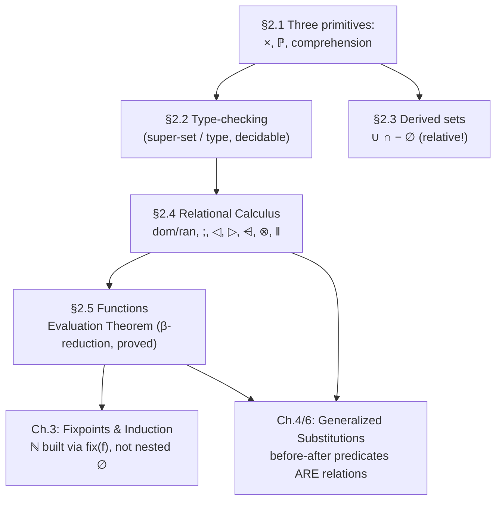

[[book-guidelines|↩ Back to guidelines]]

# Set Theory and the Relational Calculus

## Why not just extend the logic of Chapter 1?

Chapter 1 gave Abrial a sound, mechanizable proof theory, but no way to talk about "high-order" objects — sets of sets, relations, functions — without leaving first-order logic behind. His fix is the one every practical specification language makes: stay in first-order logic, but let its *domain of quantification* include sets, so that "high order" content becomes ordinary first-order data rather than a jump to second-order logic. He gives three explicit reasons for choosing set theory over, say, extending the predicate calculus directly: (1) it keeps you in first-order logic while still letting you build arbitrarily nested structures — sets of sets of relations, etc. — as *objects*, not predicates; (2) most set-theoretic vocabulary exists precisely to *hide quantifiers* (inclusion, composition, generalized union all secretly encode a $\forall$ or $\exists$ you'd otherwise have to write out by hand); (3) negation stays "controlled" — the complement of a set is still a set, so negation never produces something outside the universe of discourse the way an unrestricted predicate's negation can.

This chapter's set theory is deliberately **not** ZF. Abrial strips out the Foundation, Replacement, Pairing, and Union axioms (replacing what they'd normally justify with type-checking, discussed below, and the fact that ordered pairs are kept outside set theory per Chapter 1 §1.5) and keeps only what's needed: three *constructive* primitives (cartesian product, power-set, comprehension) plus three more axioms (extensionality, a restricted choice, a restricted infinity). If you've used Lean's or Coq's `Set`/`Type` universes, or Z/VDM's schema notation, this is the same instinct: minimize the trusted axiomatic base, derive everything else.

---

## 1. The three basic set constructs, and why membership is the *only* primitive predicate

### The syntax

$$
\text{Set} ::= \text{Set} \times \text{Set} \;\mid\; \mathbb{P}(\text{Set}) \;\mid\; \{\text{Variable} \mid \text{Predicate}\} \;\mid\; BIG
$$

Cartesian product ($s \times t$), power-set ($\mathbb{P}(s)$), and comprehension ($\{x \mid P\}$) are the *only* primitive Set-forming constructs. Everything else in the chapter — union, intersection, relations, functions — is defined in terms of these three plus one new primitive Predicate form, membership ($E \in s$).

### The axioms

| Axiom | Statement | Reading |
|---|---|---|
| **SET1** | $(E,F) \in (s \times t) \Leftrightarrow (E \in s \land F \in t)$ | Pair membership decomposes componentwise. |
| **SET2** | $s \in \mathbb{P}(t) \Leftrightarrow \forall x \cdot (x \in s \Rightarrow x \in t)$ | Power-set membership *is* the subset relation — $\subseteq$ is sugar for this. |
| **SET3** | $E \in \{x \mid x \in s \land P\} \Leftrightarrow (E \in s \land [x{:=}E]P)$ | Comprehension: separation/selection over an existing set $s$. |
| **SET4** | $\forall x \cdot (x \in s \Leftrightarrow x \in t) \Rightarrow s = t$ | Extensionality: a set is exactly its members. |
| **SET5** | $\exists x \cdot (x \in s) \Rightarrow \texttt{choice}(s) \in s$ | Choice: a nonempty set has a distinguished (but otherwise unspecified) member. |
| **SET6** | $\texttt{infinite}(BIG)$ | A primitive infinite set exists — needed to construct $\mathbb{N}$ in Chapter 3. |

**Why comprehension is restricted to selection over an existing set** (SET3 requires $x \in s \land P$, not an unrestricted $\{x \mid P\}$): this is the mechanism that makes Russell's paradox structurally impossible rather than merely avoided by fiat. $\{x \mid x \notin x\}$ simply isn't an instance of SET3's shape — there's no ambient $s$ being selected from — so the paradoxical set is never syntactically constructible, and no Foundation Axiom is needed to rule it out after the fact. This is the same design principle behind a total, terminating type theory disallowing `Type : Type` (Girard's paradox) — the unsoundness is prevented by restricting what's expressible, not by patching a hole after the fact.

**Ordered pairs are deliberately kept out of set theory.** Abrial explicitly rejects the classical Kuratowski encoding $E \mapsto F \;\widehat{=}\; \{\{E\},\{E,F\}\}$, calling it "a perversion of the concept of membership" — under that encoding you could ask whether $\{E,F\}$ "is a member of" the pair, which is nonsense, and the encoding degenerates when $E = F$ (the pair $E \mapsto E$ collapses to $\{\{E\}\}$, losing the fact that it was ever a pair). Pairs stay a primitive Expression former from Chapter 1 §1.5. **This is not a minor stylistic choice — it directly motivates the chapter's central methodological device, type-checking (§2 below):** because not every Expression is a Set (a pair isn't), $x \in x$-style self-membership statements aren't just false, they're often not even *well-formed*, and distinguishing "false" from "ill-formed" needs a mechanism logic alone doesn't give you.

```rust
// The three primitive Set formers as an AST — this is the minimal
// trusted grammar a B-Method-style verifier's set layer has to support.
// Note Pair is NOT a Set constructor: it lives in Expression, mirroring
// Abrial's insistence that pairs are outside set theory.
enum SetExpr {
    Product(Box<SetExpr>, Box<SetExpr>),      // s × t
    PowerSet(Box<SetExpr>),                    // ℙ(s)
    Comprehension { var: String, base: Box<SetExpr>, pred: Box<Pred> }, // {x | x∈s ∧ P}
    Big,                                        // BIG
    Ident(String),                              // a given/abstract set
}

enum Expr {
    Var(String),
    Pair(Box<Expr>, Box<Expr>),   // E ↦ F — an Expression, never a Set
    Set(SetExpr),
    Choice(Box<SetExpr>),
}
```

---

## 2. Type-checking: how paradox is prevented mechanically, without a Foundation Axiom

### The problem it solves

Classical ZF blocks $x \in x$ using the Foundation Axiom — a genuine axiom asserting no set contains itself, proved as a theorem about well-founded membership chains. Abrial wants something cheaper and more directly mechanizable: reject $\exists x \cdot (x \in x)$ not as *false* but as **not even a legal statement to submit for proof** — the same move a statically-typed language makes when it refuses to compile `1 + "foo"` rather than defining an ill-typed runtime semantics for it.

### The mechanism

Every Expression gets assigned a **Type** (built from `type(Expression)`, `super(Set)`, `Type × Type`, `ℙ(Type)`, or a bare identifier); every Set additionally gets a **super-set**, the upper bound beyond which further containment claims about that set stop being trackable. Type-checking is phrased, deliberately, in exactly the same sequent/inference-rule apparatus as Chapter 1 — a sequent $ENV \vdash \texttt{check}(P)$ ("under environment $ENV$, $P$ type-checks") is proved by a **fixed-order decision procedure** (rules T1–T21, tried in numeric order, backward), completely mirroring the propositional Proof Procedure of §1.2.4. Two Type-Predicate forms exist: `check(Predicate)` (the entry point) and `Type = Type` (what it eventually reduces to).

A few structurally important rules:

- **T2/T4** restrict quantified predicates to the shape $\forall x \cdot (x \in s \Rightarrow \cdots)$ / $\exists x \cdot (x \in s \land \cdots)$ — a *typed* quantifier, where every bound variable's set membership is declared up front, exactly like a typed binder `∀ x : T, P x` in a dependently-typed language, as opposed to an untyped `∀x, P x` that has to be separately constrained.
- **T7/T8** transform `check(E = F)` into `type(E) = type(F)`, and `check(E ∈ s)` into `type(E) = super(s)` — equality and membership checks *reduce to* type equality, not the other way around. This is the crux: type-checking is a completely separate, syntactically-driven pass that runs *before* (and independently of) the semantic proof of the predicate.
- **T9–T18** compute `type` and `super` compositionally over expression structure (the type of a pair is the product of component types; the super-set of a comprehension is the super-set of its base set; etc.) — a straightforward syntax-directed inference, exactly what a type-inference pass in a compiler does.

**Why this is the right mental model for a verifier's front end:** this is a *bidirectional*-flavored discipline before the term is used — `check(Predicate)` synthesizes/propagates type obligations exactly the way a bidirectional elaborator's *checking* mode pushes an expected type inward and its *inference* mode synthesizes one outward. Abrial's system is simpler (no dependent types, no unification of metavariables — every type is fully determined syntactically), but the architectural split — a decidable, syntax-directed type pass that runs to completion *before* the expensive semantic proof search begins — is exactly why a real verifier separates "does this program even type-check / is this VC well-formed" from "is this VC valid," and why the former is cheap and total while the latter is where all the undecidability lives.

```rust
// Type-checking as its own decidable pass, structurally separate from
// proof search — mirrors T1..T21 as a syntax-directed algorithm.
enum Ty { Base(String), Pow(Box<Ty>), Prod(Box<Ty>, Box<Ty>) }

fn infer_type(env: &TypeEnv, e: &Expr) -> Result<Ty, TypeError> {
    match e {
        Expr::Var(x) => env.lookup_super(x).map(Ty::clone),      // T9, via ENV
        Expr::Pair(a, b) => {
            let ta = infer_type(env, a)?;
            let tb = infer_type(env, b)?;
            Ok(Ty::Prod(Box::new(ta), Box::new(tb)))              // T10
        }
        Expr::Choice(s) => infer_super(env, s),                    // T11
        Expr::Set(s) => Ok(Ty::Pow(Box::new(infer_super(env, s)?))), // T12
    }
}
// The key architectural point: infer_type/infer_super run to completion,
// deciding well-formedness, *before* any theorem-proving tactic touches
// the predicate's semantic content — exactly the "type-check first" gate
// a Hoare-logic VC generator wants ahead of an SMT call.
```

```lean
-- Lean's elaborator performs an analogous, but strictly more powerful,
-- pass: bidirectional type inference/checking with metavariables and
-- unification, run before (or interleaved with) proof-term construction.
-- Abrial's system is the "fully first-order, no unification needed"
-- special case — every `super`/`type` fact is either given directly by
-- the environment or mechanically computable, with no metavariable ever
-- needing to be *solved for*. That's the essential simplification: no
-- Miller-pattern unification is needed here because nothing is left
-- implicit for the checker to infer creatively.
```

---

## 3. Derived constructs, and why the empty set has no absolute meaning

### Union, intersection, difference, singletons — all comprehension in disguise

Given an ambient super-set $u$ and $s, t \subseteq u$:

$$
s \cup t \;\widehat{=}\; \{a \mid a \in u \land (a \in s \lor a \in t)\} \qquad s \cap t \;\widehat{=}\; \{a \mid a \in u \land (a \in s \land a \in t)\} \qquad s - t \;\widehat{=}\; \{a \mid a \in u \land (a \in s \land a \notin t)\}
$$

None of these are new primitives — they're all comprehension (SET3) instances with a chosen predicate. This is deliberate economy: fewer primitives, fewer soundness obligations, everything else provably reducible.

### The empty set is relative, not absolute

$$
\emptyset_u \;\widehat{=}\; u - u
$$

**This is the section's sharpest, most consequential type-theoretic point.** The empty set is always *the empty set of some ambient type $u$* — there is no absolute $\emptyset$. Consequently $\emptyset \in \{\emptyset, \{\emptyset\}\}$ **does not type-check**: there is no given set relating the different occurrences of $\emptyset$ to a common super-set. But $\{\emptyset, \{\emptyset\}\} \subseteq \mathbb{P}(\mathbb{P}(s))$ *does* type-check, for a given $s$, with $\mathbb{P}(\mathbb{P}(s))$ being the tightest (minimal) super-set that makes it well-formed — you could add more $\mathbb{P}$'s but not fewer. Abrial draws out the sharpest consequence explicitly: **the classical set-theoretic definition of $\mathbb{N}$ as $\{\emptyset, \{\emptyset\}, \{\{\emptyset\}\}, \ldots\}$ does not make sense in this framework**, because it requires nesting the "same" $\emptyset$ at incompatible types. This is exactly the failure mode a typed system is designed to catch: a [[Fixpoint-Construction-and-Induction#Construction|construction]] that's syntactically fine in an untyped set theory but ill-typed once you insist every set lives in a definite, trackable universe — precisely analogous to why you can't build Lean's `Nat` as literally nested `∅`s inside a universe-stratified type theory either; you need a genuinely new inductive type, which is exactly what Chapter 3 does instead (fixpoint-constructed $\mathbb{N}$, not nested empty sets).

---

## 4. The Relational Calculus: hiding quantifiers behind algebra

This is the section with the highest direct transfer to a verifier's internal representations, because **relations are exactly the semantic domain a Hoare-triple / before-after specification lives in** — the whole point of Chapter 2's Relational Calculus is that it will become, in Chapter 6, the *set-theoretic model of a generalized substitution* (a program statement, semantically, is nothing but a relation between pre-state and post-state).

### Core constructs (first series)

Given $p \in u \leftrightarrow v$ (a relation from $u$ to $v$, i.e. $p \in \mathbb{P}(u \times v)$):

$$
p^{-1} \;\widehat{=}\; \{b,a \mid (b,a) \in v \times u \land (a,b) \in p\} \qquad \text{dom}(p) \;\widehat{=}\; \{a \mid a \in u \land \exists b \cdot (b \in v \land (a,b) \in p)\} \qquad \text{ran}(p) \;\widehat{=}\; \text{dom}(p^{-1})
$$

$$
p;q \;\widehat{=}\; \{a,c \mid (a,c) \in u \times w \land \exists b \cdot (b \in v \land (a,b) \in p \land (b,c) \in q)\} \qquad \text{(forward composition)}
$$

$$
\text{id}(u) \;\widehat{=}\; \{a,b \mid (a,b) \in u \times u \land a = b\} \qquad s \lhd p \;\widehat{=}\; \text{id}(s);p \;\;\text{(domain restriction)} \qquad p \rhd t \;\widehat{=}\; p;\text{id}(t) \;\;\text{(range restriction)}
$$

with domain/range *subtraction* ($s \mathbin{\lhd\!\!-} p$, $p \mathbin{-\!\!\rhd} t$) defined as restriction to the complement. Note the deliberate minimality again: only a handful of these are given as genuine primitive definitions; the rest (like `ran`, or restriction stated directly rather than via `id` composition) are shown as *equivalent* derived characterizations — the same "smallest trusted core, everything else provably equivalent" discipline as §1 and §2.

**Why forward composition is defined the way it is (not the usual math-textbook right-to-left order):** $p;q$ reads left-to-right, $a$ related to $c$ through an intermediate $b$ via $p$ then $q$ — this ordering is exactly why generalized-substitution *sequencing* in later chapters (`S;T`, "do $S$ then $T$") can be defined as literal relational composition with this same operator, with no reordering needed. This is a small notational choice with a real payoff three chapters later: the specification language's control-flow operator and the mathematical composition operator are, deliberately, the identical symbol doing the identical thing.

### Second series: image, overriding, direct and parallel product

$$
p[w] \;\widehat{=}\; \{y \mid y \in t \land \exists a \cdot (a \in w \land (a,y) \in p)\} \qquad\qquad q \mathbin{\lhd\!\!+} p \;\widehat{=}\; \{a,b \mid (a,b) \in s \times t \land ((a,b) \in q \land a \notin \text{dom}(p)) \lor (a,b) \in p\}
$$

**Overriding ($\lhd\!\!+$)** deserves special attention: "take all of $p$, plus the parts of $q$ whose domain doesn't overlap $p$'s." When $p, q$ are functions, this is *exactly* the semantics of updating a mutable store at specific keys while leaving the rest untouched — `q ⩤ p` is precisely `store.extend(p)` in an imperative sense, made into pure relational algebra. This construct resurfaces directly in Chapter 4 as the notation for state assignment in generalized substitutions (`r(x) := E`), so recognizing it here as ordinary relational overriding demystifies what would otherwise look like an ad hoc programming-language primitive: it's function overriding, full stop.

**Direct product** ($f \otimes g$, pairs $x \mapsto (y,z)$ from $f$ and $g$ sharing domain $x$) and **parallel product** ($h \| k$, pairs $(a,c) \mapsto (b,d)$ from independent $h, k$) are the relational-algebra ancestors of a compiler's *product type constructors* — direct product is "compute two results from one shared input" (a `let (y, z) = (f(x), g(x))` pattern, made total and provably functional by requiring the underlying relations be functions), parallel product is "run two independent things on two independent inputs" (a non-interfering pair of computations, the relational shadow of `(f, g) : (A → B, C → D) → (A × C → B × D)`).

```rust
// Relations as finite maps from pairs — a direct executable model of
// the Relational Calculus, useful for testing/exploring small examples
// the way the book's own worked examples do.
use std::collections::BTreeSet;

#[derive(Clone)]
struct Relation<A: Ord + Clone, B: Ord + Clone>(BTreeSet<(A, B)>);

impl<A: Ord + Clone, B: Ord + Clone> Relation<A, B> {
    fn inverse(&self) -> Relation<B, A> {
        Relation(self.0.iter().map(|(a, b)| (b.clone(), a.clone())).collect())
    }
    fn dom(&self) -> BTreeSet<A> { self.0.iter().map(|(a, _)| a.clone()).collect() }

    fn compose<C: Ord + Clone>(&self, q: &Relation<B, C>) -> Relation<A, C> {
        let mut out = BTreeSet::new();
        for (a, b) in &self.0 {
            for (b2, c) in &q.0 {
                if b == b2 { out.insert((a.clone(), c.clone())); }
            }
        }
        Relation(out) // p;q
    }

    fn override_with(&self, p: &Relation<A, B>) -> Relation<A, B> where A: std::hash::Hash {
        let dom_p = p.dom();
        let kept: BTreeSet<_> = self.0.iter().filter(|(a, _)| !dom_p.contains(a)).cloned().collect();
        Relation(kept.into_iter().chain(p.0.iter().cloned()).collect()) // q ⩤ p
    }
}
```

---

## 5. Functions: the total/partial, injective/surjective hierarchy, and the Evaluation Theorem

### Functions as constrained relations

$$
s \pfun t \;\widehat{=}\; \{r \mid r \in s \leftrightarrow t \land r^{-1};r \subseteq \text{id}(t)\} \qquad\qquad s \tfun t \;\widehat{=}\; \{f \mid f \in s \pfun t \land \text{dom}(f) = s\}
$$

with injections, surjections, bijections layered on top via constraints on $f^{-1}$ and $\text{ran}(f)$. The definition of partial function via $r^{-1};r \subseteq \text{id}(t)$ is worth unpacking: $r^{-1};r$ relates $b$ to $b'$ whenever both come from a common $a$ — requiring that to sit inside $\text{id}(t)$ (i.e. $b = b'$) is exactly saying "no element of the domain maps to two different outputs," the relational-algebra encoding of single-valuedness, with no explicit universal quantifier written anywhere — a clean instance of Abrial's stated reason #2 for choosing set theory in the first place (§ above: set theory *hides* quantifiers).

### Functional abstraction and the Evaluation Theorem

Lambda abstraction is introduced directly as a derived Set:

$$
\lambda x \cdot (x \in s \mid E) \;\widehat{=}\; \{x,y \mid (x,y) \in s \times t \land y = E\} \qquad \text{well-defined only if } \forall x \cdot (x \in s \Rightarrow E \in t)
$$

and function application via choice: $f(E) \;\widehat{=}\; \texttt{choice}(f[\{E\}])$ (well-defined provided $f$ is a partial function and $E \in \text{dom}(f)$). The chapter's payoff theorem connects this all the way back to Chapter 1's substitution machinery:

$$
\big(\lambda x \cdot (x \in s \mid E)\big)(V) \;=\; [x{:=}V]E \qquad \textbf{Theorem 2.5.1, the Evaluation Theorem}
$$

**This is, precisely, the $\beta$-reduction rule of the lambda calculus, derived as a theorem rather than assumed as a computation rule.** In Abrial's world lambda abstraction is *defined* set-theoretically (as a graph — a set of pairs), so "applying" it and "getting back the substituted body" isn't a primitive evaluation step, it's a *proved consequence* of what functions and choice mean. This is the cleanest possible illustration of the difference between an *operational* semantics (β-reduction as a rewrite rule you take on faith) and a *denotational* semantics (β-reduction as a derivable fact about the underlying mathematical objects) — and it's exactly the kind of soundness argument a trusted kernel needs if its notion of definitional equality is going to include β-reduction: you want to be able to *prove*, at the meta level, that unfolding a lambda and substituting really does preserve the function's graph-theoretic meaning, not merely assert it.

```lean
-- Theorem 2.5.1 is the set-theoretic justification for exactly the
-- reduction rule Lean's kernel performs when it reduces `(fun x => E) V`
-- to `E[x := V]` during defeq-checking (whnf/β-reduction). Abrial proves,
-- from the definitions of λ-abstraction-as-a-set-of-pairs and of function
-- application via `choice`, that this reduction is *sound* — the same
-- kind of meta-theoretic justification that backs Lean's kernel β-rule,
-- just derived inside first-order set theory instead of assumed as part
-- of the calculus's primitive reduction relation.
```

```python
# A direct, if inefficient, computational reading of Theorem 2.5.1:
# evaluating a functional abstraction *is* substitution into its body.
def lambda_abstraction(s, expr_fn):
    # expr_fn: x -> E(x); represents λx·(x∈s | E)
    return {x: expr_fn(x) for x in s}   # the graph, {(x, E) | x∈s, y=E}

def apply(f_graph, v):
    return f_graph[v]   # f(V) = choice(f[{V}]) — the unique match

# apply(lambda_abstraction(s, lambda x: E(x)), V) == E(V)
# is Theorem 2.5.1 made executable: evaluating the abstraction at V
# and substituting V into E's definition coincide by construction.
```

---

## 6. The catalogue of properties, and the family-relations worked example

Section 2.6 assembles a large reference catalogue (membership, monotonicity, inclusion, and equality laws across all the constructs above) meant to be cited by name rather than re-derived — the same "prove once, cite forever" discipline as Chapter 1's classical-results catalogue (§1.2.6/1.3.9). Section 2.7's worked example is worth internalizing as a template for how relational algebra *specifies* rather than *computes*: given only four base relations (`men ⊆ PERSON`, `women = PERSON − men`, `husband ∈ women ⤔ men`, `mother ∈ PERSON ↠ dom(husband)`), an entire kinship vocabulary — `wife`, `spouse`, `father`, `parents`, `children`, `sibling`, `sibling-in-law`, `cousin` — is derived purely by composition, inverse, restriction, and product:

$$
\text{father} \;\widehat{=}\; \text{mother}; \text{husband} \qquad \text{parents} \;\widehat{=}\; \text{mother} \otimes \text{father} \qquad \text{sibling} \;\widehat{=}\; (\text{children}^{-1}; \text{children}) - \text{id}(PERSON)
$$

Each derived concept is a genuine algebraic *expression*, provable equal to alternative characterizations (e.g. `mother = father ; wife`) using nothing but the catalogue of §2.6 plus Chapter 1's Leibnitz Law — a small-scale rehearsal of exactly the proof style the book will use at full specification scale from Chapter 8 onward.

---

## Where this leads



The Relational Calculus built here is not incidental machinery — it is the semantic universe the entire B-Method specification language will be interpreted in. Chapter 6 will show that a generalized substitution's meaning is exactly a relation `pre/rel` pair over this same calculus; Chapter 4's assignment and overriding notation `r(x) := E` is literally the `⩤` operator introduced here. And the type-checking discipline of §2.2 — decidable, syntax-directed, running to completion before any semantic proof begins — is the architectural template every later proof-obligation generator in the book follows: check well-formedness first, prove validity second, and never let the two passes be confused with each other. For the compiler/elaborator project, this chapter is where "your program's semantic domain" (relations over states) and "your type checker's separation from your prover" (§2.2's independence from proof search) both get their first fully worked instance — and Theorem 2.5.1 is the closest this book comes to handing you a meta-theoretic soundness proof for β-reduction itself.

---

*Style/goals config applied: `vaults/.article-style.md` (workbench-wide — Rust primary, Lean promoted for the type-checking/β-reduction material, Python for the executable evaluation-theorem sketch; Mermaid for the structural diagram) and `vaults/.learning-goals.md` (workbench-wide — emphasis on the type-checking/proof-search separation, definitional equality, and the relational semantics that anticipates Hoare-triple-style specification). No book-specific style or goals file exists for this book.*
