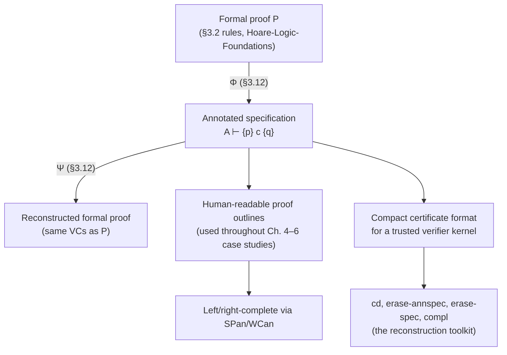

# Annotated Specifications

[[book-guidelines|↩ Back to guidelines]]

## The problem: formal proofs don't determine their own construction

Section 3.2 (see [[Hoare-Logic-Foundations|Hoare Logic Foundations]]) gave you sound inference rules. But try to actually *use* the sequential-composition rule to construct a proof:

$$\frac{\{p\}\ c_1\ \{q\} \qquad \{q\}\ c_2\ \{r\}}{\{p\}\ c_1;c_2\ \{r\}}$$

Given only the conclusion — the specification $\{p\}\ c_1;c_2\ \{r\}$ you're trying to prove — this rule gives you **no indication whatsoever of what $q$ should be.** The metavariable $q$ is a free choice with no algorithm for picking it out of the rule's shape alone. The book's concrete illustration: proving

$$\{n \ge 0\}\ (k{:=}0;y{:=}1); \mathrm{while}\ k \ne n\ \mathrm{do}\ (k{:=}k{+}1;y{:=}2{\times}y)\ \{y = 2^n\}$$

requires guessing the mediating assertion $y = 2^k \wedge k \le n$ between the initialization and the loop — and nothing about the rule as stated *hands you* that guess.

This is a genuinely important observation about the difference between **checking** a proof and **constructing** one — the same gap that separates type-*checking* (given a term and a type, verify) from type-*inference* (given a term alone, synthesize a type) in a bidirectional type system. The inference rules of §3.2 are perfectly adequate as a *checking* discipline — if someone hands you $q$, you can verify the two premisses independently. But as a *construction* discipline they're underspecified: the conclusion alone doesn't pin down the premisses.

## The fix: annotate the conclusion so it determines its own premisses

The book's move is deceptively small but structurally exactly analogous to how bidirectional typing resolves the same underspecification problem for type systems: **push enough information into the conclusion that the premisses become determined, not guessed.** Rewrite the sequencing rule with an *underlined* intermediate assertion appearing literally in the conclusion:

$$\frac{\{p\}\ c_1\ \{q\}\qquad \{q\}\ c_2\ \{r\}}{\{p\}\ c_1; \underline{\{q\}}\ c_2\ \{r\}}$$

Now the conclusion — a command with an assertion written in the middle of it — *carries* $q$ syntactically. Given this annotated command, splitting it back into the two premisses is now purely mechanical: read off $q$ from where it's written, and you have both triples for free. This is the entire idea of an **annotated specification**, also called (following long practice, and the book cites this explicitly) a **proof outline**: a command decorated with enough intermediate assertions that a reader — or an automated checker — can reconstruct a full formal proof, or at minimum extract every verification condition the formal proof would contain, without needing to search for anything.

Formally, the book writes an **annotation description**

$$A \vdash \{p\}\ c\ \{q\}$$

and says "$A$ establishes $\{p\}\,c\,\{q\}$" when $A$ is an annotated specification that pins down this triple and shows how to build a full proof of it. This $\vdash$-relation is itself defined by its own family of inference rules — a proof system *about* proof outlines, one level up from the proof system about programs.

## Left-complete, right-complete, complete — and why you rarely need both ends

$$A \qquad\text{any annotated specification}$$
$$\{p\}A \qquad\text{left-complete: begins with a precondition}$$
$$A\{q\} \qquad\text{right-complete: ends with a postcondition}$$
$$\{p\}A\{q\} \qquad\text{complete: both}$$

The book makes a genuinely elegant observation here: you don't always need both ends written down, because for many commands you can *compute* the missing end. This is the **weakest (liberal) precondition**: given a command $c$ and postcondition $q$, the weakest precondition $p_w$ is the assertion such that $\{p\}\,c\,\{q\}$ holds exactly when $p \Rightarrow p_w$. (The book flags the historical terminology quirk: strictly "weakest precondition" is reserved for total correctness and "weakest liberal precondition" for partial — but since this book mostly does partial correctness, it drops the qualifier.) When $p_w$ is computable, $c\ \{q\}$ alone — right-complete, no explicit precondition — already carries enough information to reconstruct $\{p_w\}\,c\,\{q\}$, because the *rule itself* computes $p_w$ from $c$ and $q$.

$$\textbf{Assignment (ASan)}\qquad v{:=}e\ \{q\} \;\vdash\; \{q/v \to e\}\ v{:=}e\ \{q\}$$

is exactly this: no precondition is ever written, because the substitution rule already *is* the weakest-precondition computation for assignment. This is the annotated-specification system's version of **type inference mode** in bidirectional typing — you supply the "output" (here, the postcondition; there, sometimes the term) and the system *synthesizes* the missing piece rather than making you supply it and merely check consistency.

## Sequential composition, strengthening, and reconstructing the running example

$$\textbf{Sequential Composition (SQan)}\qquad \frac{A_1\{q\}\vdash\{p\}\,c_1\,\{q\} \qquad A_2 \vdash \{q\}\,c_2\,\{r\}}{A_1;A_2 \vdash \{p\}\,c_1;c_2\,\{r\}}$$

Note carefully: the premiss $A_1\{q\}$ must be **right-complete** — it must literally end in $\{q\}$ — and that $\{q\}$ is *stripped off* in the conclusion $A_1;A_2$, precisely so it isn't duplicated (once as $A_1$'s tail, once as $A_2$'s head) or, worse, dropped entirely if $A_2$ isn't itself left-complete. This bookkeeping detail is exactly the same concern a compiler's SSA-construction pass has about not duplicating or dropping a value at a basic-block boundary — the "seam" between two composed proof fragments has to be represented exactly once, unambiguously.

$$\textbf{Strengthening Precedent (SPan)}\qquad \frac{p \Rightarrow q \qquad A \vdash \{q\}\,c\,\{r\}}{\{p\}A \vdash \{p\}\,c\,\{r\}}$$

This is the rule that lets you attach an *arbitrary* precondition to any annotated specification (trivially, via $p \Rightarrow p$) — it's how the machine-computed weakest precondition from (ASan) gets replaced, when useful, by a stronger, more human-readable assertion, discharging the gap as an ordinary verification condition.

Chaining (ASan), (SQan), (SPan) mechanically reconstructs exactly the annotated proof the book opened the section with — the reader is invited to verify this, and it's worth actually doing by hand once, because it demonstrates concretely that the annotation machinery isn't just notation, it's a genuine *algorithm* for constructing the proof, not merely presenting one.

## Where intermediate assertions are unavoidable, not optional

The book is careful to note three genuine reasons annotations (beyond the trivial "erase the ones a rule computes for you") are needed:

1. **`while` (and later, recursive procedure calls) don't have weakest preconditions expressible in this assertion language** — an invariant is a *choice*, not a computation, so it must be written down:
$$\textbf{Partial Correctness of while (WHan)}\qquad \frac{\{i \wedge b\}A\{i\} \vdash \{i\wedge b\}\,c\,\{i\}}{\{i\}\ \mathrm{while}\ b\ \mathrm{do}\ (A) \;\vdash\; \{i\}\ \mathrm{while}\ b\ \mathrm{do}\ c\ \{i \wedge \neg b\}}$$
   This is the annotation-level echo of the same fact from [[Hoare-Logic-Foundations]]: a loop's invariant is an induction hypothesis, and induction hypotheses are never *derivable from the rule shape alone* — they're the one piece of creative content a human (or a loop-invariant-synthesis engine, in an automated setting) must supply. This is exactly where automated verification tooling turns to abstract interpretation: a widening operator over an abstract lattice *computes* an $i$ a human would otherwise have to guess.
2. **Structural rules like existential quantification and the frame rule don't fit the weakest-precondition mold cleanly** — they transform an existing annotation rather than compute one from scratch, e.g.
$$\textbf{Frame (FRan)}\qquad \frac{A \vdash \{p\}\,c\,\{q\}}{\{A\}*r \;\vdash\; \{p*r\}\,c\,\{q*r\}}$$
3. **Intermediate assertions often simplify verification conditions**, even when technically omittable — a pragmatic, not logical, reason, but one that matters enormously for readability of real proofs.

Skip, conditional, and variable declaration round out the family with the expected shapes — (SKan), (CDan) (case-splitting the annotation the same way (CD) case-splits the triple), (DCan) — and (WCan) mirrors (WC) to make any annotation right-complete by discharging one verification condition, symmetric to (SPan)'s left-completing role.

## §3.12: the payoff — annotations are provably faithful to formal proofs

Section 3.3 built the *practical* machinery; §3.12 proves the *theoretical* guarantee that makes trusting that machinery legitimate: **an annotated specification is not an informal shorthand that merely resembles a proof — it is provably interconvertible with one.** This is exactly the kind of guarantee a **trusted kernel** needs before it's allowed to accept a compact certificate in place of replaying a full derivation, and it's worth reading this section with that framing in mind, because it's precisely the "proof-carrying code" architecture: a compact, human/machine-writable artifact (the annotation) plus a *proven* reconstruction procedure that turns it back into whatever the trusted checker actually verifies (the full formal proof).

The book builds this correspondence out of a small toolkit of functions:

- **`erase-annspec`** and **`erase-spec`** strip an annotation description down to just the underlying specification, or just the annotation, respectively — the "forget the extra information" projections in both directions.
- **`cd`** (command-of) recovers the bare, unannotated command embedded in an annotated specification — deleting every annotation leaves you the program as it was originally written.
- **`left-compl`, `right-compl`, `compl`** are the *completion* functions: given a possibly-incomplete annotation, they insert vacuous $p \Rightarrow p$ / $q \Rightarrow q$ instances of (SP)/(WC) to force it complete. This is a clean example of a normalization procedure that changes representation without changing content — exactly the kind of transformation a trusted kernel wants to be able to apply automatically rather than trust a possibly-buggy annotation author to have done by hand.

**Proposition 12** collects the basic sanity facts: `erase-annspec` maps each annotated rule (Xan) onto its un-annotated counterpart (X); it maps *proofs* of annotation descriptions onto *proofs* of specifications (so a checked annotated proof really does certify a real proof, not merely resemble the shape of one); and if $A \vdash \{p\}\,c\,\{q\}$ is provable, then `cd(A) = c` and, when $A$ is left/right-complete, it genuinely begins/ends with $p$/$q$ (i.e. completeness as defined syntactically matches completeness as you'd intuitively expect).

### Φ: from a formal proof to an annotation

**Proposition 13** defines a function $\Phi$ mapping any proof $P$ of a specification $\{p\}\,c\,\{q\}$ into a proof of an annotation description establishing the *same* triple, and shows `erase-annspec(Φ(P))` is *similar* to $P$ — identical except possibly for extra trivial $p \Rightarrow p$ instances inserted by completion. $\Phi$ is defined by structural induction on $P$'s final inference step, case by case — e.g. the (SQ) case takes the two sub-proofs, right-completes the first one's annotation (via `right-compl`) so its tail assertion matches, and glues them with (SQan); the (WH) case takes the completed annotation of the body's proof and wraps it in the `while`-shaped annotation. This is precisely a compiler *lowering pass*: given a derivation in one representation (the "IR" of full formal Hoare-logic proofs), $\Phi$ mechanically produces an equivalent derivation in a more compact target representation (annotated proof outlines) — deterministic, structurally recursive, and provably preserving meaning (the verification conditions, up to trivial insertions).

### Ψ: from an annotation back to a formal proof

Going the other direction is the part that actually matters for trust: **Ψ** reconstructs a genuine formal proof from an annotation alone, and this is where the "self-determining premisses" idea from earlier in the article gets its rigorous payoff. The construction proceeds via an auxiliary $\Psi_0$ that decomposes an annotation into a **coherent premiss sequence** — a chain of triples and verification conditions from $p$ to $q$ where each step's postcondition matches the next step's precondition, essentially a straight-line trace through the annotation's structure. $\Psi_0$ is defined by cases exactly mirroring how annotations are built — e.g. $\Psi_0(A_0\,v{:=}e\,\{q\}) = \Psi_0(A_0\,\{q/v\to e\}), \{q/v\to e\}\,v{:=}e\,\{q\}$: peel off the assignment step, recording the precondition the (ASan) rule computed, and recurse on what came before.

Given a proper (i.e. containing at least one actual specification, not just VCs) coherent premiss sequence $S$ from $p$ to $q$, a function **`code`** stitches the embedded commands together by sequential composition, and — this is the key derivability lemma — for *any* such $S$, the triple $\{p\}\ \mathrm{code}(S)\ \{q\}$ is derivable, by repeatedly folding adjacent steps together with (SQ), (SP), (WC) until the whole chain collapses into one proof. **Proposition 14** ties the bow: if an annotation description is provable at all, $\Psi$ reconstructs a genuine formal proof of it, whose verification conditions are exactly those of the original erased proof.

### The diagram, and why it matters for a real kernel

The book closes §3.12 with a commuting diagram relating Proofs of Specifications, Proofs of Annotation Descriptions, Annotation Descriptions, and back to Proofs of Specifications via $\Phi$, `erase-annspec`, `concl`, `erase-spec`, and $\Psi$ — with $\simeq$/$\sim$ marking "same verification conditions, up to trivial insertions." The content of that diagram, stripped of notation, is: **you can go proof → compact annotation → proof again, and land somewhere equivalent to where you started.** That is *exactly* the soundness property you need before you're willing to let a real theorem-prover kernel accept an annotation (a "proof outline," or in modern terms, a compact **proof certificate**) instead of demanding the full derivation every time. Concretely, for the Rust-based verifier the standing project is aimed at: this is the architectural template for **proof reconstruction** — a fast, human-writable/LLM-writable annotated specification is what a frontend produces; $\Psi$-style reconstruction is what your trusted kernel runs before accepting it, so the kernel's trusted computing base only needs to trust the *reconstruction procedure* (small, mechanical, proven correct here) rather than trust that every annotation-writer got every VC right by hand.

```rust
// Ψ, sketched as a reconstruction pass a trusted kernel would run:
// walk the annotated specification, rebuild the coherent premiss
// sequence, then fold it into one formal-proof derivation via SQ/SP/WC.
enum Annotation {
    Assign { var: Var, expr: Expr, post: Assertion },
    Seq(Box<Annotation>, Box<Annotation>),
    While { inv: Assertion, guard: BExpr, body: Box<Annotation> },
    Strengthen { pre: Assertion, rest: Box<Annotation> }, // {p} A
    // ... Frame, Existential, Substitution, etc.
}

/// Mirrors Ψ0: unfolds an annotation into a straight-line premiss chain.
fn decompose(a: &Annotation, target_post: &Assertion) -> Vec<PremissStep> {
    match a {
        Annotation::Assign { var, expr, post } => {
            let pre = post.substitute(var, expr); // the (ASan) computation
            vec![PremissStep::Triple { pre, cmd: Command::Assign(var.clone(), expr.clone()), post: post.clone() }]
        }
        Annotation::Seq(a1, a2) => {
            let mut steps = decompose(a1, target_post);
            steps.extend(decompose(a2, target_post));
            steps
        }
        // ... other cases exactly follow the book's Ψ0 case analysis
        _ => todo!(),
    }
}

/// Mirrors the "fold via SQ/SP/WC until one proof remains" lemma:
/// a trusted, small, re-checkable core -- this IS the kernel.
fn reconstruct_proof(steps: Vec<PremissStep>) -> ProofTree {
    steps.into_iter().reduce(|acc, step| ProofTree::sequential_compose(acc, step))
        .expect("proper coherent sequence: at least one real triple")
}
```

## Where this leads



Every worked example in the rest of the book — the list-reversal proof, mergesort, quicksort, Schorr-Waite — is presented as an annotated specification, never as a raw formal-proof tree, precisely because §3.3/§3.12 established that doing so loses nothing. For the verifier project, this pair of sections is the theoretical justification for building your checker around **proof outlines as the primary user-facing artifact** rather than raw derivation trees: as long as your reconstruction procedure mirrors $\Psi$'s structural-recursion discipline, a compact, readable annotation is exactly as trustworthy as the exhaustive proof it stands in for — which is the property that makes proof-carrying code, and LLM-assisted or automatically-synthesized annotations, safe to accept into a small, auditable trusted kernel instead of an ever-growing, unauditable pile of raw inference-rule applications.
