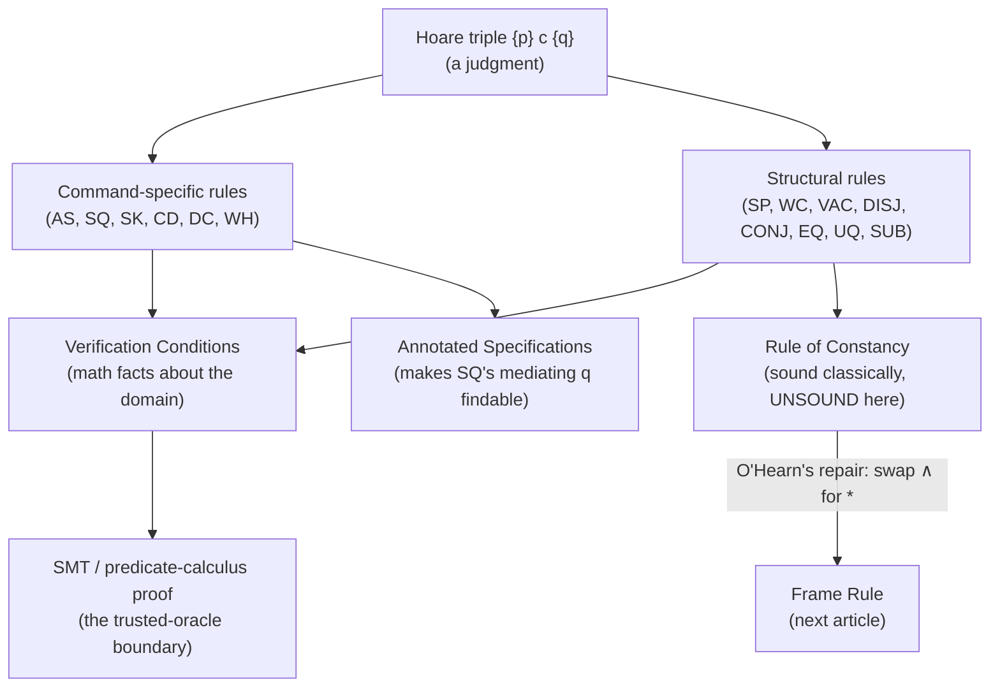

# Hoare Logic Foundations

[[book-guidelines|↩ Back to guidelines]]

## Why you need a proof theory for commands at all

Chapter 2 gave you a semantics for *assertions* — the satisfaction relation $s,h \models p$ tells you, given a store and a heap, whether a formula is true. That's enough to talk about single states. But a program is a *transformer* of states, and what you actually want to prove is a claim of the shape "if the input satisfies this, the output will satisfy that." That claim — a **Hoare triple** — is the unit of specification in this book:

$$\{p\}\ c\ \{q\}$$

read as a partial-correctness specification: starting from any state satisfying $p$, no execution of $c$ aborts, and if $c$ terminates, the final state satisfies $q$. (There's also a total-correctness form $[p]\,c\,[q]$, which additionally demands termination — the book uses it rarely, because in the presence of `while` loops and later recursion, termination arguments are a separate concern from the heap-safety arguments that are separation logic's real contribution.)

Notice something already: the triple is a *statement*, not a *computation*. You can't evaluate $\{p\}\,c\,\{q\}$ the way you evaluate an expression — you have to *prove* it. That's where inference rules come in: a small, fixed vocabulary of proof steps such that if you follow them, the specification you end up with is guaranteed valid. This is precisely the judgment-forms-and-typing-rules idea from type theory, just aimed at operational behavior instead of static typing: a Hoare triple is a judgment, and an inference rule is exactly a typing rule for that judgment, with the same shape — premisses over a line, conclusion under it, side conditions in the margin. If you've internalized "a typing rule licenses one way to derive a judgment," you already understand the mechanism here; what changes is only what's being judged.

**What breaks without this:** if all you had were the informal English description of `{p} c {q}`, two different people could reasonably disagree about whether a given program meets a given spec. Inference rules pin down *exactly* which derivations are legal, so "this program is correct" becomes a syntactic fact (a proof tree exists) rather than a semantic argument you re-litigate every time.

## Command-specific rules vs. structural rules

The book's rules split into two families, and this split matters more than it looks:

- **Command-specific rules** are syntax-directed: one rule per command form (assignment, sequencing, `while`, `skip`, conditional). Given a triple whose command is, say, `v := e`, there is exactly one rule that could have produced it.
- **Structural rules** don't care what the command is — Strengthening Precedent and Weakening Consequent apply to *any* triple, regardless of its command. They let you slide the pre/postcondition around without touching the program.

This is the same distinction bidirectional type systems draw between rules that inspect the term's outermost constructor (introduction/elimination rules, analogous to command-specific rules here) and rules that only manipulate the *type* — subsumption, in a subtyping discipline, is exactly Weakening Consequent's cousin: "if you've proved something stronger, you're licensed to claim something weaker that follows from it." Structural rules are the load-bearing plumbing that keeps a syntax-directed system from getting stuck.

## The command-specific rules

**Assignment (AS).**
$$\frac{}{\{q/v \to e\}\ v := e\ \{q\}}$$

This rule has no premisses — it's an axiom schema. Read right to left: you're given the *postcondition* $q$ you want, and the rule tells you the precondition is $q$ with every free occurrence of $v$ replaced by $e$ (written $q/v \to e$). This is backward reasoning baked into the rule itself: the rule doesn't tell you what holds *after* running `v := e` starting from some given precondition; it tells you what had to hold *before*, given what you want *after*. For example, $\{2\times y = 2^{k+1} \wedge k+1 \le n\}\ k := k+1\ \{2\times y = 2^k \wedge k \le n\}$ — substitute $k+1$ for $k$ in the postcondition and you get exactly the precondition shown.

If you've worked with weakest-precondition calculi in program analysis, this is precisely $\mathrm{wp}$ for assignment, and it's exact (not just sound) here because expressions in this language are heap-independent and side-effect-free — a property the book insists on precisely so this substitution law stays this clean (this is the seed of the weakest-precondition machinery that gets formalized properly in [[Annotated-Specifications|Annotated Specifications]]).

**Sequential Composition (SQ).**
$$\frac{\{p\}\ c_1\ \{q\} \qquad \{q\}\ c_2\ \{r\}}{\{p\}\ c_1 ; c_2\ \{r\}}$$

This is the rule that makes proofs compositional — you prove each subcommand against its own local pre/postcondition, and gluing two proofs is just matching up postcondition-of-first with precondition-of-second, exactly like the transitivity step in a compiler's type-checking pass over a sequence of statements, or the way an elaborator chains typing judgments across a `let`-sequence. Nothing here is unsound in isolation; the difficulty is entirely practical (see below) — how do you *find* the mediating assertion $q$ when you're constructing a proof rather than checking a given one?

**skip (SK), Conditional (CD), Variable Declaration (DC).** Rounding out the syntax-directed family:

$$\frac{}{\{q\}\ \mathrm{skip}\ \{q\}} \qquad
\frac{\{p \wedge b\}\ c_1\ \{q\} \qquad \{p \wedge \neg b\}\ c_2\ \{q\}}{\{p\}\ \mathrm{if}\ b\ \mathrm{then}\ c_1\ \mathrm{else}\ c_2\ \{q\}} \qquad
\frac{\{p\}\ c\ \{q\}}{\{p\}\ \mathrm{newvar}\ v\ \mathrm{in}\ c\ \{q\}}\ (v \notin \mathrm{FV}(p,q))$$

The conditional rule case-splits the precondition by the branch condition $b$ — an if/else's two branches each only need to discharge their own reachable slice of the precondition, which is the imperative-programming analogue of a match/case-analysis in a dependently-typed proof, where each branch inherits a refined context. The variable-declaration rule's side condition ($v$ not free in $p$ or $q$) is a scoping/hygiene condition: it says the declared variable is genuinely *local*, so whatever the caller believes about the outer state is untouched. This is the same discipline that keeps a fresh metavariable or a freshly-bound name from leaking capture into a surrounding context during elaboration — the exact failure mode substitution rules guard against everywhere in this material (see the Substitution rule below, and its role in Chapter 4's procedure calls).

## Structural rules: Strengthening Precedent and Weakening Consequent

$$\textbf{Strengthening Precedent (SP)}\quad\frac{p \Rightarrow q \qquad \{q\}\ c\ \{r\}}{\{p\}\ c\ \{r\}}
\qquad\qquad
\textbf{Weakening Consequent (WC)}\quad\frac{\{p\}\ c\ \{q\} \qquad q \Rightarrow r}{\{p\}\ c\ \{r\}}$$

Both premisses that aren't triples — $p \Rightarrow q$ and $q \Rightarrow r$ — are called **verification conditions (VCs)**. This is worth pausing on, because it is the single most important architectural fact about Hoare logic: *the proof of a program's correctness bottoms out in ordinary mathematical implications about the data domain, not in anything about the program*. The book is explicit that formally you'd need sub-proofs of these VCs using predicate calculus plus theory-specific axioms about integers, sequences, etc., but in practice it just states them and trusts the reader.

This is exactly the interface a real verification pipeline needs: the Hoare-rule layer produces VCs, and a separate engine — historically hand proof, in a modern toolchain an **SMT solver** — discharges them. This is the seam where Hoare logic hands off to **SAT/SMT and constraint solving**: every Strengthening-Precedent or Weakening-Consequent step in a hand proof is, mechanically, exactly one query you'd fire at Z3 or CVC5 in an automated verifier. If you're building the Rust-based verifier described in the standing project, this is the boundary between your *trusted kernel* (the inference rules, which must be sound) and your *oracle* (the SMT backend, whose answers you either trust or — better, for a small trusted computing base — turn into checkable proof certificates that the kernel replays).

```rust
// A minimal sketch of the SP/WC seam: the checker only needs to trust
// that `Assignment` substitutes correctly and that `entails` is sound;
// everything else is bookkeeping over that contract.
enum Rule {
    Assignment { post: Assertion, var: Var, expr: Expr },
    Sequential { left: Box<ProofTree>, right: Box<ProofTree> },
    StrengthenPrecedent { vc: Assertion, sub: Box<ProofTree> }, // vc : p => q
    WeakenConsequent   { sub: Box<ProofTree>, vc: Assertion },  // vc : q => r
    // ... Skip, Conditional, VarDecl, While, ...
}

struct ProofTree {
    pre: Assertion,
    cmd: Command,
    post: Assertion,
    rule: Rule,
}

// A checker's only "unsafe" dependency is this call — everywhere else
// is pure syntax manipulation over the rule shapes above.
fn discharge_vc(vc: &Assertion, smt: &mut dyn SmtOracle) -> Result<(), CheckError> {
    if smt.is_valid(vc) { Ok(()) } else { Err(CheckError::UnprovableVc(vc.clone())) }
}
```

## The `while` rule and invariants

$$\textbf{Partial Correctness of while (WH)}\quad\frac{\{i \wedge b\}\ c\ \{i\}}{\{i\}\ \mathrm{while}\ b\ \mathrm{do}\ c\ \{i \wedge \neg b\}}$$

Here $i$ is the **invariant**: an assertion that holds every time control reaches the top of the loop. The rule says: if executing the body once, assuming the invariant and the guard, re-establishes the invariant, then executing the whole loop (however many iterations) preserves the invariant, and on exit you additionally know the guard is false.

**What breaks without this:** a loop's number of iterations isn't statically known, so you cannot unfold it into a finite sequential-composition proof the way you can with a fixed-size straight-line program. The invariant is the finite, loop-independent summary that lets a single (SQ)-shaped derivation stand in for all the iterations at once — precisely the same move as replacing an unbounded recursive call with an induction hypothesis. This is *the* Hoare-logic analogue of an inductive proof, and it foreshadows two things down the line: (1) Chapter 4's recursive-procedure rule, where the "invariant" becomes a hypothesis about the procedure you're allowed to assume while proving its own body (structural induction on the call, not the loop count); and (2) **abstract interpretation's fixpoint computation for invariant generation** — automatically *finding* $i$ (rather than being handed it, as the book always is) is exactly the loop-invariant-synthesis problem that widening operators over an abstract lattice solve, and it's the mechanized cousin of what a human prover does by inspection here.

The book flags that (WH) is the one rule in the chapter that does *not* extend to total correctness — reflecting that `while` is the only source of possible nontermination in this language (until Chapter 4 adds recursion, which reopens the same issue).

## Vacuity, disjunction, conjunction, quantification

Section 3.4 supplies the remaining structural rules, each solving a specific compositionality problem:

$$\textbf{Vacuity (VAC)}\quad\frac{}{\{\mathrm{false}\}\ c\ \{q\}}$$

Sound for a slightly startling reason: both triple-forms universally quantify over states satisfying the precondition, and no state satisfies $\mathrm{false}$, so the implication is vacuously true — the same "ex falso" move as an empty-match arm in a Rust `match` over an uninhabited variant, or a Lean proof that discharges a branch via `absurd` because the hypothesis context is already contradictory. It's genuinely useful: it lets you dispatch the "body of the loop never executes" case cleanly, e.g. when a verification condition already reduces to `false` under some branch of case analysis.

$$\textbf{Disjunction (DISJ)}\quad\frac{\{p_1\}\ c\ \{q\} \qquad \{p_2\}\ c\ \{q\}}{\{p_1 \vee p_2\}\ c\ \{q\}}$$

This is exactly case-splitting the precondition and merging the results — the mirror image of the conditional rule's case-split on the *command*. Used together with (VAC), it lets you handle "the range is empty" and "the range is nonempty" as two disjoint preconditions covering `true`, exactly as the book does for a summation loop where one disjunct triggers vacuity for the never-executed body.

$$\textbf{Conjunction (CONJ)}\quad\frac{\{p_1\}\ c\ \{q_1\} \qquad \{p_2\}\ c\ \{q_2\}}{\{p_1 \wedge p_2\}\ c\ \{q_1 \wedge q_2\}}$$

Two independent proofs of the same command from different angles compose into a stronger joint claim. The book flags — and this is a genuinely important warning, worth remembering when you get to concurrency — that this rule becomes **unsound** in some extensions of separation logic (specifically once resource ownership and race conditions enter the picture); it's a reminder that "sound in classical Hoare logic" is not automatically "sound once you add separating conjunction and concurrency," a theme that recurs with the rule of constancy below.

$$\textbf{Existential (EQ)}\quad\frac{\{p\}\ c\ \{q\}}{\{\exists v.\ p\}\ c\ \{\exists v.\ q\}} \qquad
\textbf{Universal (UQ)}\quad\frac{\{p\}\ c\ \{q\}}{\{\forall v.\ p\}\ c\ \{\forall v.\ q\}}$$
(both require $v$ not free in $c$)

A variable satisfying this side condition — not occurring in the command itself, only in the assertions — is called a **ghost variable**. Ghost variables are pure specification machinery: they let you *name* a value (e.g. "the original value of $x$ before the loop started," or later, in Chapter 5, "the abstract shape being copied") purely for the purpose of stating a relationship in the postcondition, with zero runtime cost or presence. This is precisely a **metavariable's role in an elaborator** turned inside out: where a metavariable stands for an unknown *term* to be solved for by unification, a ghost variable stands for a *known-but-unnamed-at-runtime* value, introduced by the prover to make an invariant expressible, then existentially discharged once its job is done. Both are "logical bookkeeping that never becomes code."

## The Substitution rule and why aliasing wrecks it without a side condition

$$\textbf{Substitution (SUB)}\quad\frac{\{p\}\ c\ \{q\}}{\{p/\delta\}\ (c/\delta)\ \{q/\delta\}}$$

where $\delta$ is a simultaneous substitution $v_1 \to e_1, \ldots, v_n \to e_n$ over all variables free in $p$, $c$, or $q$, **with the side condition**: if $v_i$ is modified by $c$, then $e_i$ must be a variable not occurring free in any other $e_j$.

This rule lets you take a proved generic specification and instantiate it — critical once procedures show up in Chapter 4, since a procedure's body is proved once and its formal parameters get substituted at every call site. But the side condition is not decoration; it's the entire content of the rule. The book's own counterexample is precise: from the valid $\{x = y\}\ x := x + y\ \{x = 2y\}$, substituting $x \to z, y \to 2w - 1$ (distinct targets) gives the valid $\{z = 2w-1\}\ z := z + 2w - 1\ \{z = 2(2w-1)\}$. But substituting $x \to z, y \to 2z - 1$ — where the *modified* variable's replacement ($z$) also appears inside another substituted expression — yields the **false** claim $\{z = 2z - 1\}\ z := z + 2z - 1\ \{z = 2(2z-1)\}$.

This is exactly variable capture during substitution — the same failure mode that a naive (non-capture-avoiding) substitution function produces when implementing beta-reduction or a definitional-equality checker: substituting a term for a variable when the target expression can alias with something else the modified variable also touches silently changes the meaning of the formula. In a type-theoretic setting the fix is renaming bound variables to avoid capture (alpha-conversion before substitution); here the fix is the side condition itself — forbidding modified variables from substituting into an expression shared by others. Either way, the lesson transfers directly: **any substitution operation over a language with mutable/bound state needs an explicit non-capture side condition, and it is exactly this class of bug that a naive Rust `HashMap<Var, Expr>`-based substitution routine will reproduce if you don't check it.**

```rust
/// A capture-checking substitution, mirroring the book's side condition:
/// if `v` is modified by `cmd`, its replacement expression must not
/// appear as the replacement for any *other* substituted variable.
fn safe_substitute(
    subst: &HashMap<Var, Expr>,
    modified_by_cmd: &HashSet<Var>,
) -> Result<(), SubstError> {
    for (v, e) in subst {
        if modified_by_cmd.contains(v) {
            for (other_v, other_e) in subst {
                if other_v != v && other_e.free_vars().is_superset_of_(e) {
                    return Err(SubstError::Capture {
                        modified: v.clone(),
                        aliasing_through: other_v.clone(),
                    });
                }
            }
        }
    }
    Ok(())
}
```

## The rule of constancy — and why it fails here

Everything above is classical Hoare logic, imported wholesale. But one further classical structural rule does **not** survive the move to separation logic, and understanding exactly why is the hinge on which the rest of this book turns:

$$\textbf{Rule of Constancy (unsound in separation logic)}\quad\frac{\{p\}\ c\ \{q\}}{\{p \wedge r\}\ c\ \{q \wedge r\}}$$
(where no variable free in $r$ is modified by $c$)

In ordinary Hoare logic (over stores alone, no heap) this rule is exactly what lets you extend a "local" proof — one that only mentions the variables $c$ actually touches — with an arbitrary extra fact $r$ about untouched variables, on the reasoning that if $c$ doesn't modify those variables, $r$ just rides along unchanged. It looks completely innocuous.

It is not innocuous once the heap enters the picture, because $r$ can now be a fact *about heap cells*, and heap cells can **alias** with each other through pointers even when the *variables* naming them are distinct. The book's counterexample: $\{x \mapsto -\}\ [x]:=4\ \{x \mapsto 4\}$ is valid, but instantiating the rule of constancy with $r \equiv y \mapsto 3$ gives
$$\{x \mapsto - \wedge\ y \mapsto 3\}\ [x] := 4\ \{x \mapsto 4 \wedge\ y \mapsto 3\},$$
which is **false** whenever $x = y$: the mutation destroys $y \mapsto 3$ because $x$ and $y$ denote the *same* address, even though $y$ (the variable) is never assigned to. Ordinary conjunction $\wedge$ says nothing about whether the two conjuncts describe disjoint resources — it's perfectly happy for $x \mapsto -$ and $y \mapsto 3$ to be talking about the exact same cell.

This is the single crack that the entire apparatus of separation logic exists to patch. O'Hearn's fix — replacing $\wedge$ with the separating conjunction $*$, giving the **frame rule** $\{p * r\}\ c\ \{q * r\}$ — is exactly this rule, repaired so that $r$'s heap footprint is asserted *disjoint* from $c$'s by construction, rather than merely "not textually modified." That repair, and the precise programming-language properties (safety monotonicity, the frame property) that make it sound, is the subject of [[The-Frame-Rule-and-Local-Reasoning|The Frame Rule and Local Reasoning]] — this article's direct sequel.

## Where this leads



This chapter's rules are the entire *classical* inheritance separation logic keeps intact — everything here remains valid once heap-manipulating commands and the separating connectives are added in the sections that follow. Two threads specifically continue: the practical difficulty of finding the mediating assertion $q$ in (SQ) motivates the annotated-specification machinery of §3.3/§3.12 (see [[Annotated-Specifications]]); and the one classical rule that *doesn't* survive — the rule of constancy — is the direct motivation for the frame rule, which is where local reasoning about the heap actually begins ([[The-Frame-Rule-and-Local-Reasoning]]). If you're tracking this against the compiler/verifier project: this chapter is the layer where your Hoare-triple checker's *trusted kernel* lives — get the substitution side condition and the VC-generation boundary right here, and everything built on top (frame-rule reasoning, procedure hypotheses, annotated proof outlines) inherits that soundness for free.
