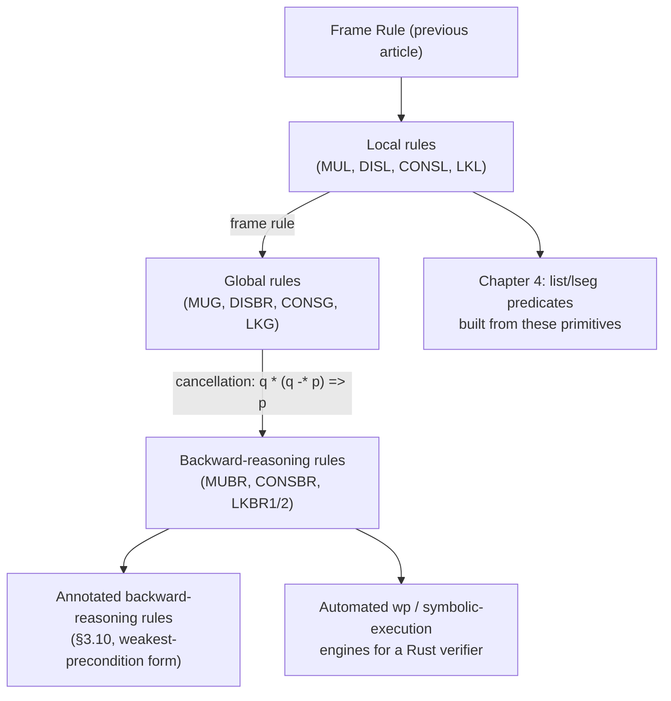

# Inference Rules for Heap-Manipulating Commands

[[book-guidelines|↩ Back to guidelines]]

## Why four commands need so many rules

[[Hoare-Logic-Foundations|Hoare Logic Foundations]] covered the classical Hoare rules — assignment, sequencing, `while`, the structural rules — all of which survive into separation logic essentially unchanged. Now come the commands that actually *are* separation logic's reason for existing: `cons` (allocation), `[e]` (lookup), `[e] := e'` (mutation), and `dispose e` (deallocation). And immediately something surprising happens: instead of one rule per command, the book gives **three kinds of rule per command** — local, global, and backward-reasoning — and then spends most of these four sections proving that the three forms are *interderivable*, i.e. equally expressive, not independently primitive.

Why bother with three equivalent presentations of the same fact? Because each form is optimized for a different use case, and this is worth internalizing as a general lesson about proof engineering, not just this book: **a single "most general" rule is not always the most usable one.** The local form is the cleanest to state and the easiest to prove sound directly from the operational semantics — it says the absolute minimum about the absolute minimum heap. The global form is what you'd actually reach for constructing a real proof, since it doesn't require you to first factor your assertion into "exactly the footprint" plus "the rest" by hand — the frame rule from [[The-Frame-Rule-and-Local-Reasoning|The Frame Rule and Local Reasoning]] does that factoring implicitly. The backward-reasoning form is what you want for *automated* precondition generation — given a fixed postcondition, it hands you the weakest precondition directly, no search required. If you're building an automated verifier, this triad is basically: (1) the rule you prove sound against the semantics once, (2) the rule a human prover uses in a hand derivation, (3) the rule your `wp`-generator actually implements.

## Mutation: the simplest case, and the template for the rest

$$\textbf{Local (MUL)}\qquad \{e \mapsto -\}\ [e] := e'\ \{e \mapsto e'\}$$

The tightest possible statement: given only that $e$ points to *something* (the underscore $-$ is an existentially-quantified placeholder — "there's some value there, we don't care which"), mutating it makes it point to $e'$, and the rule says nothing whatsoever about any other cell.

$$\textbf{Global (MUG)}\qquad \{(e \mapsto -) * r\}\ [e] := e'\ \{(e \mapsto e') * r\}$$

$$\textbf{Backward-reasoning (MUBR)}\qquad \{(e \mapsto -) * ((e \mapsto e') \mathbin{-\!*} p)\}\ [e] := e'\ \{p\}$$

(MUG) is just (MUL) with the frame rule applied, taking $r$ to be whatever else the surrounding proof needs. Going the other way — (MUL) from (MUG) — take $r$ to be $\mathrm{emp}$ and simplify; $\mathrm{emp}$ is the unit for $*$.

(MUBR) is the genuinely interesting one, because it's a template for *every* backward-reasoning rule in this system: it says "for **any** desired postcondition $p$, here is a precondition that guarantees it," derived by choosing $r$ in (MUG) to be $(e \mapsto e') \mathbin{-\!*} p$ — the separating implication expressing exactly "whatever, when combined disjointly with $e \mapsto e'$, gives you $p$" — and then applying the derived axiom schema $q * (q \mathbin{-\!*} p) \Rightarrow p$ from Chapter 2. This is precisely how you'd implement `wp` for a heap-mutating language: instead of computing forward from a fixed precondition, you compute backward from the postcondition you're trying to reach, using the separating implication as the "cancellation" operator that undoes a separating conjunction. If your compiler project needs symbolic execution or a Dijkstra-style `wp` transformer for pointer-manipulating code, (MUBR)'s derivation *is* the algorithm — mechanically apply $\mathbin{-\!*}$ to peel off one memory cell's worth of precondition at a time.

**Deallocation** is simpler still — since deallocation doesn't produce a nontrivial "remainder" fact the way lookup and allocation do, the global form doubles as the backward-reasoning form:

$$\textbf{Local (DISL)}\qquad \{e \mapsto -\}\ \mathrm{dispose}\ e\ \{\mathrm{emp}\}$$
$$\textbf{Global / backward (DISBR)}\qquad \{(e \mapsto -) * r\}\ \mathrm{dispose}\ e\ \{r\}$$

Same frame-rule relationship as mutation: (DISBR) is (DISL) framed with $r$; (DISL) is (DISBR) with $r = \mathrm{emp}$.

## Allocation and lookup: why they're harder

Mutation and deallocation don't change what variables denote — they only change the heap. Allocation and lookup are different: they're what the book calls **generalized assignment commands** — commands that perform some heap computation and *then* update a single variable in the store. This immediately breaks the ordinary assignment rule (AS), because that rule needs a syntactically legal expression to substitute, and `cons(1,2)` and `[y]` aren't expressions in this language's sense — they have side effects (allocation mutates the heap; lookup can abort), and the book's language deliberately keeps expressions heap-independent and side-effect-free precisely so assertions can use them freely (recall from [[Hoare-Logic-Foundations]] how much that property simplifies everything else). Trying to force `cons` through the assignment rule literally produces a syntactically illegal precondition: $\{\mathrm{cons}(1,2) = \mathrm{cons}(1,2)\}\ x := \mathrm{cons}(1,2)\ \{x = x\}$ — nonsense, since `cons(1,2)` can't appear inside an assertion. So allocation and lookup each need their **own** bespoke family of rules, built from scratch rather than inherited from (AS).

### Allocation: the nonoverwriting case first

The book's strategy — worth noting as a general proof-engineering move — is to first nail down the *easy* special case (where the variable being assigned has no "old value" anyone cares about), then generalize.

$$\textbf{Nonoverwriting local (CONSNOL)}\qquad \{\mathrm{emp}\}\ v := \mathrm{cons}(\vec e)\ \{v \mapsto \vec e\} \quad (v \notin \mathrm{FV}(\vec e))$$
$$\textbf{Nonoverwriting global (CONSNOG)}\qquad \{r\}\ v := \mathrm{cons}(\vec e)\ \{(v \mapsto \vec e) * r\} \quad (v \notin \mathrm{FV}(\vec e, r))$$

Straightforward: starting from nothing (or from $r$, framed in), allocating fresh cells at a new address $v$ gives you exactly a fresh record there. The restriction is that $v$ can't occur in $\vec e$ or $r$ — you're not allowed to overwrite $v$'s *old* value and then also refer to that old value, because there's no mechanism yet to remember it.

### Allocation: the general (overwriting) case, and *why* the naive local rule is too weak

Once $v$'s old value matters — e.g. `i := cons(3, i)`, prepending a cell that stores the *previous* value of `i` — you need to name that old value. The pattern used throughout the rest of the chapter is: **rename the old value to a fresh variable and existentially quantify it away.**

$$\textbf{Global (CONSG)}\qquad \{r\}\ v := \mathrm{cons}(\vec e)\ \{\exists v'.\ (v \mapsto \vec e\,') * r'\}$$

where $v'$ is fresh, $\vec e\,'$ and $r'$ denote $\vec e$ and $r$ with $v$ replaced by $v'$ (i.e. "as they were, before the assignment"). A concrete instance: $\{\mathrm{list}\ \alpha\ i\}\ i := \mathrm{cons}(3, i)\ \{\exists j.\ i \mapsto 3, j * \mathrm{list}\ \alpha\ j\}$ — the existential $j$ names *where the old list used to start*, now stored in the second field of the fresh cell.

Here's the subtlety the book takes real care over. You might expect the local rule to just be (CONSG) with $r = \mathrm{emp}$:

$$\{\mathrm{emp}\}\ v := \mathrm{cons}(\vec e)\ \{\exists v'.\ (v \mapsto \vec e\,')\}$$

This is sound — but *too weak to be useful*, and the book gives a sharp concrete counterexample: the instance $\{\mathrm{emp}\}\ i := \mathrm{cons}(3,i)\ \{\exists j.\ i \mapsto 3,j\}$ tells you nothing about what the second field's value $j$ *is* — in particular it doesn't connect $j$ back to the old value of $i$, which is exactly the fact you need to keep reasoning about the list you just extended. The existential quantifier, having erased $v$'s old identity entirely, threw away information the rest of the proof needs.

The actual local rule fixes this by keeping the old value nameable *without* existentially erasing it:

$$\textbf{Local (CONSL)}\qquad \{v = v' \wedge \mathrm{emp}\}\ v := \mathrm{cons}(\vec e)\ \{v \mapsto \vec e\,'\}$$

where $v'$ is a variable *distinct from* $v$ (crucially, not modified by the command), so its occurrences after the assignment still denote the pre-assignment value. Instance: $\{i = j \wedge \mathrm{emp}\}\ i := \mathrm{cons}(3,i)\ \{i \mapsto 3, j\}$ — now $j$'s value in the postcondition is legibly "the value $i$ had before." This is a small but important lesson in specification design that transfers directly to writing verification-condition generators: **an existential quantifier is a one-way door that discards an identity link** — sometimes that's exactly what you want (hiding an implementation detail), and sometimes (as here) it silently destroys the very fact the rest of the proof depends on. When you're designing a `wp`/`sp` transformer, watch for exactly this trap: don't quantify away a value if a later assertion needs to refer back to it.

$$\textbf{Backward-reasoning (CONSBR)}\qquad \{\forall v''.\ (v'' \mapsto \vec e) \mathbin{-\!*} p''\}\ v := \mathrm{cons}(\vec e)\ \{p\}$$

where $p'' = p/v \to v''$. The **universal** quantifier here (rather than existential) is the formal expression of allocation's **indeterminacy**: the address returned by `cons` is not fixed by the semantics — the rule must guarantee the postcondition *no matter which* fresh address the allocator happens to pick, hence "for all possible addresses $v''$, if a fresh record there implies $p''$...". The book gives a full semantic soundness proof of this rule directly from the operational semantics (unpacking $\forall$, then $\mathbin{-\!*}$, then matching against what `cons` actually does at runtime) — worth reading closely if you're implementing an allocator's specification in a real verifier, since it's the cleanest illustration in the whole book of how a *logical* quantifier ($\forall v''$) gets grounded in a *nondeterministic runtime choice* (which address `cons` happens to pick). This is the direct separation-logic analogue of a fresh-metavariable/fresh-name generation step in an elaborator: the elaborator's "any sufficiently fresh name works" convention and this rule's "any address not currently in the domain works" are the same freshness discipline, just at different layers.

The book also shows the chain (CONSNOG) → (CONSG) → (CONSL) → (CONSBR) are all interderivable, each direction using either the frame rule, or the equivalence

$$v := \mathrm{cons}(\vec e) \;\cong\; \mathrm{newvar}\ \hat v\ \mathrm{in}\ (\hat v := \mathrm{cons}(\vec e); v := \hat v) \tag{3.1}$$

— i.e. *any* generalized assignment can be decomposed into "do the effectful part into a fresh temporary, then plain-assign the temporary into the real target," which cleanly separates the two things that made allocation hard (heap effect; store update) into one nonoverwriting `cons` (heap effect only, easy) composed with one ordinary assignment (store update only, governed by the already-familiar (AS) rule). This decomposition pattern — "isolate the side-effecting part behind a temporary, then the rest is ordinary assignment" — is exactly the **A-normal-form / let-binding transformation** compilers use to sequence effects explicitly; (3.1) is separation logic's version of that same discipline.

### Lookup: the richest family, for "no obvious reason"

The book's own words: lookup "has the richest variety of inference rules… for no obvious reason." Structurally it mirrors allocation — nonoverwriting rules first, then local/global/backward-reasoning forms for the general case — but there are *two* backward-reasoning forms, because there are two different equivalent ways to phrase "the cell already has the value we're about to read."

$$\textbf{Nonoverwriting local (LKNOL)}\qquad \{e \mapsto v''\}\ v := [e]\ \{v = v'' \wedge (e \mapsto v)\} \quad(v \notin \mathrm{FV}(e))$$
$$\textbf{Nonoverwriting global (LKNOG)}\qquad \{\exists v''.\ (e \mapsto v'') * p''\}\ v := [e]\ \{(e \mapsto v) * p\}$$

An especially clean special case of (LKNOG), obtained by letting $v''$ *be* $v$ itself:

$$\{\exists v.\ (e \mapsto v) * p\}\ v := [e]\ \{(e \mapsto v) * p\}$$

which the book describes memorably: **"the action of the lookup command is to erase an existential quantifier."** If you chose your quantified variable's name with foresight (name it the same as the variable you're about to assign into), reading a value out of the heap is *syntactically* just deleting the $\exists$. Example instance: from $\exists j.\ i{+}1 \mapsto 3, j\ *\, \mathrm{list}\ \alpha\ j$, executing $j := [i{+}1]$ gives exactly $i{+}1 \mapsto 3, j * \mathrm{list}\ \alpha\ j$ — the same formula with the quantifier stripped. This is worth sitting with, because it's a genuinely elegant correspondence between an *operational* act (reading memory) and a *logical* act (existential elimination) — and it's the separation-logic mirror image of how a **unification algorithm eliminates an existential metavariable** by instantiating it to a discovered value: both operations replace "there exists some value satisfying these constraints" with "here concretely is that value," the moment enough information pins it down.

The general (overwriting) rules follow the same "rename-old-value, quantify" discipline as allocation, but now with *two* auxiliary variables — $v'$ for the value of $v$ before, $v''$ for the value read from the heap:

$$\textbf{Local (LKL)}\qquad \{v = v' \wedge (e \mapsto v'')\}\ v := [e]\ \{v = v'' \wedge (e' \mapsto v)\}$$

$$\textbf{Global (LKG)}\qquad \{\exists v''.\ (e \mapsto v'') * (r/v' \to v)\}\ v := [e]\ \{\exists v'.\ (e' \mapsto v) * (r/v'' \to v)\}$$

(with $v, v', v''$ pairwise distinct, $v', v'' \notin \mathrm{FV}(e)$, $v \notin \mathrm{FV}(r)$, and $e' = e/v \to v'$ — i.e. $e$ evaluated with the *old* value of $v$, since $e$ might itself mention $v$, as in `j := [j+1]`). A worked instance from the book: taking $v{=}j, e{=}j{+}1, v'{=}m, v''{=}k, r = (i{+}1 \mapsto m) * (k{+}1 \mapsto \mathrm{nil})$ gives

$$\{\exists k.\ i{+}1 \mapsto j * j{+}1 \mapsto k * k{+}1 \mapsto \mathrm{nil}\}\ j := [j{+}1]\ \{\exists m.\ i{+}1 \mapsto m * m{+}1\mapsto j * j{+}1 \mapsto \mathrm{nil}\}$$

— useful for exactly the kind of "walk a pointer chain, remembering where you came from" reasoning that list-traversal proofs need constantly.

Then two equivalent backward-reasoning forms:

$$\textbf{LKBR1}\qquad \{\exists v''.\ (e \mapsto v'') * ((e \mapsto v'') \mathbin{-\!*} p'')\}\ v := [e]\ \{p\}$$
$$\textbf{LKBR2}\qquad \{\exists v''.\ (e \hookrightarrow v'') \wedge p''\}\ v := [e]\ \{p\}$$

(LKBR1) is the direct analogue of (MUBR)'s $\mathbin{-\!*}$-based cancellation trick, adapted to a command that reads rather than writes. (LKBR2) is a syntactic shortcut using the abbreviation $e \hookrightarrow v''$ (roughly, "$e$ points to $v''$" as a pure fact usable alongside ordinary $\wedge$ rather than needing the full separating-implication machinery) — the book derives it from (LKBR1) using the axiom $(e \hookrightarrow e') \wedge p \Rightarrow (e \mapsto e') * ((e \mapsto e') \mathbin{-\!*} p)$, i.e. it's a genuine equivalent presentation, not a different rule. The book proves the full cycle (LKL) → (LKG) → (LKBR1) → (LKBR2) → (LKL) closed, establishing all four (plus the nonoverwriting forms) mutually derivable, exactly mirroring what it did for allocation.

```rust
// The "three forms, one primitive" pattern, expressed as a Rust interface:
// a checker only needs to implement the *local* rule against the semantics;
// global and backward-reasoning forms are then just applications of the
// frame rule / separating-implication cancellation lemma, already proved
// generic over any command.
trait HeapCommandRule {
    /// The tight, footprint-only rule -- the only one that needs a direct
    /// soundness proof against the operational semantics.
    fn local_rule(&self) -> Triple;

    /// Derived for free via the Frame Rule (see The-Frame-Rule-and-Local-Reasoning).
    fn global_rule(&self, r: &Assertion) -> Triple {
        apply_frame_rule(&self.local_rule(), r)
    }

    /// Derived for free via q * (q -* p) => p, instantiating r to a
    /// separating-implication "continuation" assertion.
    fn backward_reasoning_rule(&self, p: &Assertion) -> Triple {
        let continuation = self.local_rule().post.wand_to(p);
        self.global_rule(&continuation)
    }
}
```

## Annotated forms of the backward-reasoning rules

Section 3.10 packages the backward-reasoning rules as **annotation descriptions** — the notation $A \vdash \{p\}\,c\,\{q\}$ from [[Annotated-Specifications|Annotated Specifications]] that lets a proof-outline determine its own premisses. Because backward-reasoning rules are, by construction, computing the *weakest* precondition from a stated postcondition, their annotated forms need **no explicit precondition at all** — just the command and its target postcondition:

$$[e]{:=}e'\ \{p\}\ \vdash\ \{(e\mapsto -) * ((e \mapsto e') \mathbin{-\!*} p)\}\ [e]{:=}e'\ \{p\}$$
$$\mathrm{dispose}\ e\ \{r\}\ \vdash\ \{(e\mapsto -) * r\}\ \mathrm{dispose}\ e\ \{r\}$$
$$v := \mathrm{cons}(\vec e)\ \{p\}\ \vdash\ \{\forall v''.\ (v'' \mapsto \vec e) \mathbin{-\!*} p''\}\ v := \mathrm{cons}(\vec e)\ \{p\}$$
$$v := [e]\ \{p\}\ \vdash\ \{\exists v''.\ (e \mapsto v'')*((e\mapsto v'')\mathbin{-\!*}p'')\}\ v := [e]\ \{p\}$$

And because these *are* weakest preconditions, every other form (local, global, nonoverwriting) can be recovered from them by choosing a specific postcondition $p$ and discharging one verification condition via (SP). The book demonstrates this for mutation: take $p$ to be $e \mapsto e'$ itself in (MUBRan), note the resulting precondition simplifies (via the VC $(e\mapsto -) \Rightarrow (e\mapsto -)*((e\mapsto e')\mathbin{-\!*}(e\mapsto e'))$) down to exactly $e \mapsto -$ — recovering (MUL) as a *derived*, not primitive, fact. This closes the loop: everything in this article ultimately reduces to one weakest-precondition rule per command, plus the frame rule and the separating-implication cancellation lemma.

## Where this leads



This machinery is the load-bearing primitive layer for everything structural that follows: the list-segment predicates and mergesort proof of Chapter 4, the tree/dag predicates of Chapter 5, and the array reasoning built on [[The-Iterated-Separating-Conjunction|the iterated separating conjunction]] in Chapter 6 all reduce, at their leaves, to exactly these four commands' rules — nothing new is ever added at the command level again. For the compiler/verifier project specifically: the backward-reasoning forms here (MUBR, CONSBR, LKBR1/2) *are* the specification of a symbolic-execution engine's per-instruction transfer function over heap assertions — implement `wand`-cancellation correctly for these four cases and you have the pointer-manipulating core of a weakest-precondition generator; everything else (loops, procedures) layers Hoare-logic structural rules on top, unchanged from [[Hoare-Logic-Foundations]].
