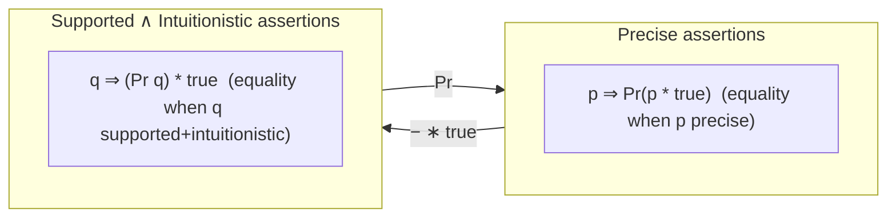

[[book-guidelines|↩ Back to guidelines]]

## Why classify assertions at all

[[Semantics-Of-Assertions|The previous article]] showed that $*$ only *semi*-distributes over $\wedge$ and $\forall$ in general — $(p_0 \wedge p_1) * q \Rightarrow (p_0 * q) \wedge (p_1 * q)$, but not conversely. That asymmetry is annoying: a program-verification proof constantly needs to *combine* facts about a shared sub-heap, and a one-directional law can't do that. Rather than accept the weaker laws forever, Reynolds identifies exactly which extra semantic property an assertion needs to have for the missing direction to become sound — and it turns out there isn't just one such property, there's a small taxonomy of them, each with a distinct role: **pure** (heap-independent), **strictly exact** (pins the heap exactly), **precise** (pins at most one sub-heap), **intuitionistic** (monotone under heap growth), and **supported** (has a canonical least witness sub-heap). This section is the payoff of doing the semantics properly first: every one of these classes is defined as a two-line property of $s, h \models p$, and every one of the extra axiom schemata they license is proved as a genuine meta-proof against that definition, not asserted by appeal to intuition.

**What breaks without this taxonomy:** without knowing an assertion is precise, you cannot soundly reason "I know $q$ holds for *some* sub-heap of $h$, therefore I know *which* sub-heap, therefore I can talk about `the rest of the heap'" — a move used constantly in list/tree/dag predicates later in the book (Chapters 4–5), where `list α i` needs to be precise for its very definition by structural induction to make sense as "there is a *unique* way to carve off one cons-cell."

## Pure assertions: where $*$ and $\wedge$ coincide

$p$ is **pure** iff its truth never depends on the heap: $s, h \models p$ iff $s, h' \models p$ for *all* $h, h'$. Syntactically, any assertion built without $\mathrm{emp}$, $\mapsto$, or $\hookrightarrow$ is pure (arithmetic facts about the store, essentially). When one or both operands of $*$ are pure, the multiplicative/additive distinction collapses:

$$p_0 \wedge p_1 \Rightarrow p_0 * p_1 \ \text{(when $p_0$ or $p_1$ pure)} \qquad p_0 * p_1 \Rightarrow p_0 \wedge p_1 \ \text{(when both pure)}$$
$$(p \wedge q) * r \Leftrightarrow (p * r) \wedge q \ \text{(when $q$ pure)} \qquad (p \mathbin{-\!*} q) \Rightarrow (p \Rightarrow q) \text{, and conversely when both pure}$$

The book calls the third schema "ubiquitous in proofs of programs" — and it is, because it's exactly how you smuggle a store-only fact (a loop bound, an index constraint, an ordering condition) *into* a separating conjunction without it interfering with the heap-splitting: $(p \wedge q) * r \Leftrightarrow (p * r) \wedge q$ lets $q$ "float free" of the split entirely.

## Strictly exact: the heap is uniquely determined

$p$ is **strictly exact** iff $s, h \models p$ and $s, h' \models p$ together force $h = h'$ — the assertion pins down *the entire heap*, not just part of it. $\mathrm{emp}$ and $e \mapsto e'$ are the primitive examples; strict exactness is preserved by $*$ and by $\wedge$ (when either side is strictly exact), and along implication (anything implying a strictly-exact assertion, when it's equivalent to it, is strictly exact too).

**Proposition 4** is the first real payoff: when $q$ is strictly exact, $((q * \mathrm{true}) \wedge p) \Rightarrow (q * (q \mathbin{-\!*} p))$ is valid. The proof is a clean instance of the meta-proof/formal-proof distinction from the previous article — it works directly from the satisfaction clauses: since $q$ is strictly exact, the sub-heap witnessing $q * \mathrm{true}$ is *forced* to coincide with the sub-heap witnessing $q$ inside $p$, so you can peel it off and glue the wand back on. Specializing $q$ to $e \mapsto e'$ recovers exactly the inference rule from the end of the previous section, $(e \hookrightarrow e') \wedge p \Rightarrow (e \mapsto e') * ((e \mapsto e') \mathbin{-\!*} p)$ — this is the general principle the earlier "carve out a known cell" rule was a special case of.

## Precise assertions: the workhorse property

**Precise** is the property that matters most for the rest of the book: $q$ is precise iff, for every $s$ and $h$, *at most one* sub-heap $h_0 \subseteq h$ satisfies $s, h_0 \models q$. (Strictly exact assertions are automatically precise — pinning the *whole* heap is a stronger condition than pinning at most one *sub*-heap of any given $h$.) Beyond $e \mapsto -$, the closure properties, and pointwise implications, the notes flag two forward references that matter for later chapters: `list α e` and `∃α. list α e` are precise, while `dag τ(i)` and `∃τ. dag τ(i)` are **not** — this single fact is the semantic reason lists admit a much simpler proof theory than dags throughout the rest of the notes (Chapter 4 versus Chapter 5).

The payoff is **Proposition 5**: when $q$ is precise, the semidistributive laws from before become full equivalences:

$$(p_0 * q) \wedge (p_1 * q) \Rightarrow (p_0 \wedge p_1) * q \qquad \forall x.\ (p * q) \Rightarrow (\forall x.\ p) * q \ \ (x \notin \mathrm{FV}(q))$$

The proof is worth internalizing because it's the template for *why* preciseness matters operationally: from $s, h \models (p_0 * q) \wedge (p_1 * q)$ you get two witnesses $h_0, h_1 \subseteq h$ satisfying $q$ — and because $q$ is precise, $h_0 = h_1$ is *forced*, so the "the rest of the heap satisfies $p_0$" and "the rest of the heap satisfies $p_1$" claims are automatically claims about the *same* rest, hence $p_0 \wedge p_1$. Impreciseness is exactly what breaks this: the counterexample in the text uses $q = (x \mapsto 10 \vee y \mapsto 20)$ (not precise — two different single-cell sub-heaps both satisfy it) to build a heap where $(x{\mapsto}10 * q) \wedge (y{\mapsto}20 * q)$ holds but $(x{\mapsto}10 \wedge y{\mapsto}20) * q$ does not.

### Grounding: precise assertions are the separation-logic analogue of *unique ownership*

If pure assertions are "shared, read-only facts," precise assertions are the ones that behave like a uniquely-owned Rust value: knowing $q$ holds tells you *exactly* which resource is being claimed, with no ambiguity about which sub-part of a larger structure it refers to. This is precisely the property a verifier needs before it can soundly *split off* a piece of a separation-logic heap state and reason about the remainder independently — which is exactly what frame inference (used by tools like Viper or Verus to automatically compute frame conditions) is doing under the hood: it is, in effect, searching for a precise sub-assertion of the current proof state to peel off before applying a Hoare rule.

```rust
// A "precise" claim: exactly which cell you're claiming ownership of
// is unambiguous, so the compiler (or verifier) can soundly compute
// "the rest" once this claim is granted.
struct Owned<'a> { cell: &'a mut i32 } // <-> e |-> e'  (precise, in fact strictly exact)

// An "imprecise" claim: "somewhere in this arena, a live i32 exists
// holding either 10 or 20" — you cannot subtract this from a larger
// heap and know unambiguously what's left, exactly as (x|->10 ∨ y|->20)
// cannot be soundly "split off" in the counterexample above.
fn holds_some_live_cell(arena: &Arena) -> bool { /* ... */ unimplemented!() }
```

## Intuitionistic assertions: monotone under growing the heap

$i$ is **intuitionistic** iff $h \subseteq h'$ and $s, h \models i$ together imply $s, h' \models i$ — truth is preserved as the heap *grows*. Pure assertions, $p * i$, $p \mathbin{-\!*} i$, $i \mathbin{-\!*} p$, $\wedge/\vee/\forall/\exists$ combinations of intuitionistic assertions, and `dag τ(e)` are all intuitionistic; so, as special cases, are $p * \mathrm{true}$, $\mathrm{true} \mathbin{-\!*} p$, and $e \hookrightarrow e'$ — the very abbreviation flagged as "not precise" in the first article turns out to be intuitionistic instead, and this is not a coincidence, as the next proposition shows.

$-* \mathrm{true}$ and $\mathrm{true} \mathbin{-\!*} -$ turn out to be a **Galois-connection-flavored pair of closure operators**: $p \Rightarrow p * \mathrm{true}$ and $\mathrm{true} \mathbin{-\!*} p \Rightarrow p$ hold for *all* $p$, while $i \Leftrightarrow (i * \mathrm{true})$ and $(\mathrm{true} \mathbin{-\!*} i) \Leftrightarrow i$ hold whenever $i$ is already intuitionistic. In words: $p * \mathrm{true}$ is the *strongest* intuitionistic assertion implied by (weaker than) $p$, and $\mathrm{true} \mathbin{-\!*} p$ is the *weakest* intuitionistic assertion that implies (stronger than) $p$ — these are exactly the "best classical approximation from below/above" operators a Galois connection between the classical and intuitionistic sub-lattices would give you, which is precisely the modal-translation trick Ishtiaq and O'Hearn use to define intuitionistic separation logic *inside* the classical one: define $\neg^i p \stackrel{\text{def}}{=} \mathrm{true} \mathbin{-\!*} \neg p$, and similarly for $\Rightarrow^i, \Leftrightarrow^i$, and you get a faithful embedding.

**What breaks without intuitionistic assertions:** a lot of "somewhere in the heap" reasoning (dags with sharing, `∃τ. dag τ(i)`) genuinely does *not* care about extra unrelated heap cells — it would be needlessly restrictive to force every dag-related assertion to be precise about the *entire* heap. Intuitionistic assertions give you a principled way to say "monotone under irrelevant heap growth" as a first-class semantic property, rather than manually padding every assertion with an explicit "$* \mathrm{true}$" and hoping you remembered to.

### Grounding: this is exactly a persistent/duplicable fact in a resource logic

In separation-logic-based verifiers like Iris, this exact class is called "persistent" propositions — facts that, once established, remain true no matter what else you own, and which (unlike ordinary resource-owning assertions) can be freely duplicated because they don't claim exclusive ownership of anything. The Rust analogue is a `&T` shared reference or a `Copy` fact: knowing "this arena contains *a* live cell with value 10" is a fact you can hold onto even after acquiring more resources, exactly as an intuitionistic assertion survives heap growth.

## Supported assertions: the intuitionistic mirror of precise

Here's the key structural insight the section builds toward: **no satisfiable assertion can be both precise and intuitionistic** — if it pinned a *unique* sub-heap, but also had to remain true under arbitrary growth, you'd need every super-heap to still witness that same unique minimal piece, which collapses the assertion to something trivial. So precise and intuitionistic are, in a real sense, orthogonal axes. This raises a sharp question: is there a class that plays precise's role *within* the intuitionistic world?

That's exactly what **supported** assertions are. $q$ is supported iff, whenever $h_0$ and $h_1$ are both sub-heaps of some common heap $h$ satisfying $q$, there is a *smallest common witness* $h_\emptyset \subseteq h_0, h_1$ also satisfying $q$ — equivalently (**Proposition 6**), for any $h$, the set $H = \{h_0 \subseteq h : s, h_0 \models q\}$, if nonempty, has a *least element*. This "has a canonical minimal witness" property is precisely what precise assertions give you for free (there's only one witness, so it's trivially least) — supported generalizes it to "possibly many witnesses, but a distinguished smallest one always exists," which is exactly the shape you need for an intuitionistic assertion (necessarily closed under many super-heaps) to still behave *as if* it had a unique canonical sub-heap.

Concrete examples pin down all four combinations:

| | precise | supported |
|---|---|---|
| $\mathrm{true}$, $x \hookrightarrow 10$, `dag τ(i)` | imprecise | intuitionistic + **supported** |
| $x \hookrightarrow 10 \vee y \hookrightarrow 10$, $\exists x.\, x \hookrightarrow 10$, $\neg\, \mathrm{emp}$ | imprecise | intuitionistic + **unsupported** |
| $\mathrm{emp} \vee x \mapsto 10$ | imprecise | non-intuitionistic + **supported** |
| $x \mapsto 10 \vee y \mapsto 10$, $\exists x.\ x \mapsto 10$ | imprecise | non-intuitionistic + **unsupported** |

**Proposition 7** is the payoff, and it exactly closes the gap left open by preciseness: when $p_0, p_1$ are intuitionistic and $q$ is supported, the same full-distributivity laws hold — $(p_0 * q) \wedge (p_1 * q) \Rightarrow (p_0 \wedge p_1) * q$, and similarly for $\forall$. The proof structure mirrors Proposition 5's exactly, except it uses the *least common witness* (guaranteed by supportedness) in place of the *unique* witness (guaranteed by preciseness) — the extra step being that since $p_0, p_1$ are intuitionistic, they remain true when you shrink from $h - h_0$ down to $h - h_\emptyset$ (a *bigger* leftover, since $h_\emptyset \subseteq h_0$), which is exactly where intuitionism's monotonicity does the work preciseness's uniqueness did before.

**Proposition 8** connects the two closure operators from this section directly: (1) every precise assertion is supported; (2) $q$ is supported iff $q * \mathrm{true}$ is supported. Combined with the earlier fact that $-\!*\mathrm{true}$ maps arbitrary assertions to intuitionistic ones and is idempotent on them, this gives the clean picture: **$- * \mathrm{true}$ maps precise assertions into supported-intuitionistic assertions**, faithfully.

## The precising operation: going back the other way

Having a map from precise to supported-intuitionistic, Yang's **precising operation** goes the other direction:

$$\mathrm{Pr}\, p \;\stackrel{\text{def}}{=}\; p \wedge \neg(p * \neg\, \mathrm{emp})$$

Read operationally: "$p$ holds, *and* there's no way to further shrink the heap and still satisfy $p$" — i.e., take the *minimal* witness. Worked examples make this concrete: $\mathrm{Pr}(\mathrm{true}) \Leftrightarrow \mathrm{emp}$ (the smallest heap satisfying $\mathrm{true}$ is the empty one), $\mathrm{Pr}(x \hookrightarrow 10) \Leftrightarrow x \mapsto 10$ (pins the exact single cell instead of allowing padding), and $\mathrm{Pr}(x \hookrightarrow 10 \wedge y \hookrightarrow 10)$ splits into a case analysis on whether $x = y$ — exactly the kind of aliasing case-split separation logic exists to make explicit rather than implicit.

**Proposition 9**: (1) if $p$ is supported, $\mathrm{Pr}\,p$ is precise; (2) if $p$ is precise, $\mathrm{Pr}\,p \Leftrightarrow p$ (it's already idempotent-fixed). So $\mathrm{Pr}$ maps supported assertions to precise ones and is an identity on the latter — the exact converse relationship to $- * \mathrm{true}$. **Proposition 10** then nails down the round-trip: $\mathrm{Pr}(p * \mathrm{true}) \Rightarrow p$ always, with equivalence when $p$ is precise; $(\mathrm{Pr}\,q) * \mathrm{true} \Rightarrow q$ when $q$ is intuitionistic, with equivalence exactly when $q$ is *also* supported.

Putting it together: **precise assertions and supported-intuitionistic assertions are isomorphic**, via $-\!*\mathrm{true}$ one way and $\mathrm{Pr}$ the other — a genuine correspondence, not just a one-directional embedding, established by a chain of meta-proofs each following the pattern "unwind the satisfaction clause for $*$, invoke the defining property of the relevant class, reassemble."



### Grounding: a Galois connection between two abstract domains

This precise ↔ supported-intuitionistic isomorphism is exactly a **Galois connection** between two lattices of assertions — the vocabulary your abstract-interpretation work will reuse constantly. $- * \mathrm{true}$ is the abstraction map (throw away exact ownership boundaries, keep only "this predicate holds of *some* sub-heap"), and $\mathrm{Pr}$ is the concretization/refinement map (recover the minimal witness). If you're designing an abstract domain for heap analysis (say, a shape-analysis abstraction over separation-logic predicates), this is a template worth imitating directly: pick your "precise" concrete domain, your "intuitionistic" abstract domain, and define your abstraction/concretization pair so that composing them one way is idempotent on the abstract side and the other way is idempotent (or a sound over-approximation) on the concrete side — exactly the shape Propositions 9–10 establish here.

```python
# A toy illustration: Pr and (- * true) as an abstraction/concretization pair
# over finite heaps, mirroring the Galois-connection shape above.
def star_true(p, all_addrs):
    """p * true: some sub-heap satisfies p, rest is unconstrained."""
    return lambda h: any(p(subheap) for subheap in all_subheaps(h))

def precising(p):
    """Pr p = p ∧ ¬(p * ¬emp): p holds, and no proper sub-heap also satisfies p."""
    def pr(h):
        if not p(h):
            return False
        return not any(p(h0) for h0 in proper_subheaps(h))
    return pr
```

## Where this leads

This taxonomy is not an academic exercise — it is the load-bearing vocabulary for every predicate defined later in the book. Lists (`list α i`, Chapter 4) are precise; dags (`dag τ(i)`, Chapter 5) are intuitionistic and supported but *not* precise, which is exactly why proving a dag-copying procedure correct needs the extra apparatus of [[Assertion-Variables|assertion variables]] (Chapter 5, §5.3) that lists never require. Every soundness proof for the frame rule and the mutation/lookup/allocation inference rules in [[Hoare-Triples-And-Specifications|Chapter 3]] silently relies on some assertion in the proof being precise enough to "peel off" cleanly. If you are formalizing a heap-manipulating program logic in a proof assistant, precise/intuitionistic/supported are exactly the predicate classes you'll want to define and prove closure properties for *before* writing a single Hoare rule — get this lattice wrong (e.g., try to make every heap assertion precise, or skip the supported class entirely) and dag-, dag-with-sharing-, or arena-shaped invariants become unstatable or unsound later.
