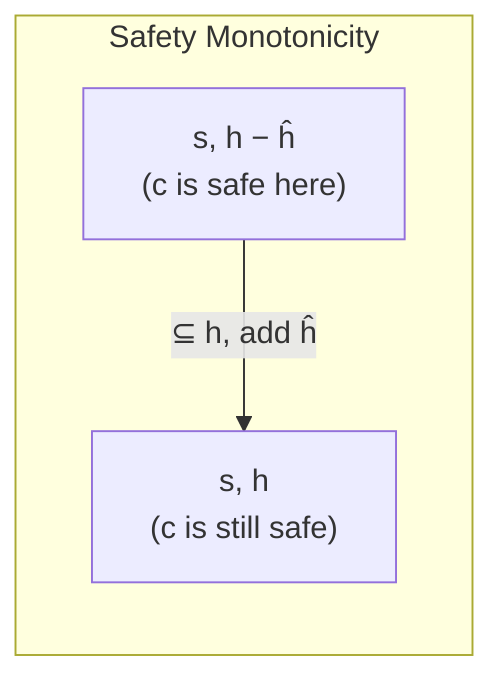
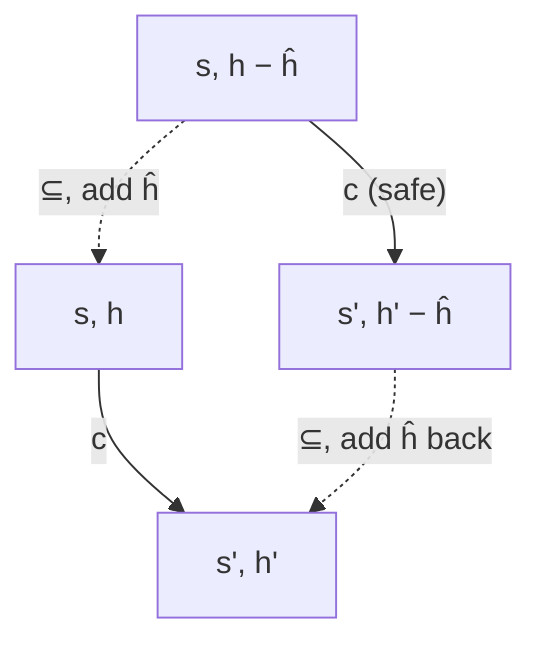
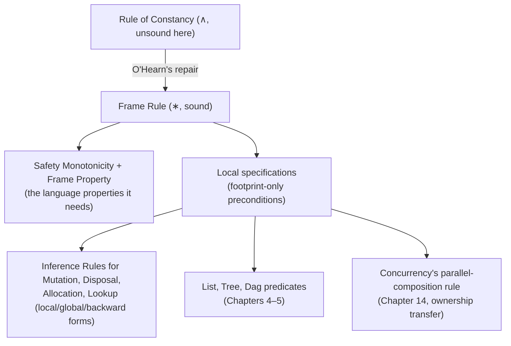

# The Frame Rule and Local Reasoning

[[book-guidelines|↩ Back to guidelines]]

## The motivating disaster: list reversal without separation logic

Before the frame rule, look at what its absence costs you. Section 1.1 opens with in-place list reversal:

$$\mathrm{LREV} \;\stackrel{\text{def}}{=}\; j := \mathrm{nil}; \ \mathrm{while}\ i \ne \mathrm{nil}\ \mathrm{do}\ (k := [i{+}1]; \, [i{+}1] := j; \, j := i; \, i := k).$$

The functional content of the invariant is simple enough: $i$ and $j$ are lists representing sequences $\alpha$ and $\beta$ with $\alpha_0^\dagger = \alpha^\dagger \cdot \beta$ (the reversal of the original list equals the reversal of what's left, concatenated onto what's been built so far). Written with classical conjunction, that's

$$\exists \alpha, \beta.\ \mathrm{list}\ \alpha\ i \wedge \mathrm{list}\ \beta\ j \wedge \alpha_0^\dagger = \alpha^\dagger \cdot \beta.$$

But this is **false as an invariant**, because ordinary $\wedge$ doesn't rule out $i$'s list and $j$'s list sharing cells — and if they do, the pointer-swapping in the loop body corrupts one while updating the other. So you must additionally assert non-sharing explicitly, via a reachability predicate:

$$\big(\exists \alpha,\beta.\ \mathrm{list}\ \alpha\ i \wedge \mathrm{list}\ \beta\ j \wedge \alpha_0^\dagger = \alpha^\dagger\cdot\beta\big) \wedge \big(\forall k.\ \mathrm{reachable}(i,k) \wedge \mathrm{reachable}(j,k) \Rightarrow k = \mathrm{nil}\big).$$

And if there's some *other* list $x$ elsewhere in the program that must survive untouched, you need a **third** clause ruling out sharing between $x$ and both $i$ and $j$. This scales additively-badly: every additional piece of live state the surrounding program cares about adds another non-aliasing clause, all of them second-order-ish reachability formulas that have nothing to do with what the loop actually *does*. The book calls this out directly: "it is evident that this form of reasoning scales poorly." This is precisely the pain that motivates **shape analysis and separation-logic-based static analyzers** (e.g. Infer) in real verification tooling — reachability-based non-aliasing side conditions are exactly what those tools are trying to avoid recomputing by hand.

## Separating conjunction as the fix, and the footprint it buys you

Replace $\wedge$ with the separating conjunction $*$:

$$\big(\exists \alpha, \beta.\ \mathrm{list}\ \alpha\ i * \mathrm{list}\ \beta\ j\big) \wedge \alpha_0^\dagger = \alpha^\dagger \cdot\beta.$$

Non-sharing is now **built into the connective**: $p * q$ is true of a heap exactly when that heap splits into two disjoint parts, one satisfying $p$, one satisfying $q$. You no longer need the reachability clause at all — disjointness is what $*$ *means*, not an extra thing you assert about it.

This buys you something much larger than a shorter formula. You can now state a genuinely **local** specification of the whole loop:

$$\{\mathrm{list}\ \alpha\ i\}\ \mathrm{LREV}\ \{\mathrm{list}\ \alpha^\dagger\ j\}.$$

The book is precise about what "local" buys you here: this specification asserts not only that LREV expects a list at $i$, but that *this list is the only addressable storage LREV's execution touches* — its **footprint**. Once you know that, extending the reasoning to a bigger program that also has some untouched list $k$ elsewhere doesn't require re-deriving anything about $k$ — you invoke a single generic inference rule and get

$$\{\mathrm{list}\ \alpha\ i * \mathrm{list}\ \gamma\ k\}\ \mathrm{LREV}\ \{\mathrm{list}\ \alpha^\dagger\ j * \mathrm{list}\ \gamma\ k\}$$

for free. That inference rule is the frame rule, and this substitution — one generic rule instead of re-deriving a bigger reachability invariant every time the surrounding context grows — **is** local reasoning. As the book puts it: "there is little need for local reasoning in proving toy examples. But it provides scalability that is critical for more complex programs." If you've done modular verification of anything — a type-checked function whose signature abstracts over what the caller's other state looks like — this is that same idea, specialized to heap footprints instead of types: a well-typed function doesn't need to know what type the caller's *other* variables have; a well-specified command shouldn't need to know what heap cells the caller's *other* data structures occupy.

## The frame rule, formally

$$\textbf{Frame Rule (FR)}\quad\frac{\{p\}\ c\ \{q\}}{\{p * r\}\ c\ \{q * r\}}\qquad\text{(no variable free in $r$ is modified by $c$)}$$

Read it as: take any proved local specification, and any assertion $r$ about a *disjoint* piece of the world that $c$ doesn't touch (neither its variables nor, implicitly, its heap cells, since $r$'s heap portion is asserted separate by $*$) — you may freely conjoin $r$ onto both sides, unchanged. It is, syntactically, almost identical to the (unsound) rule of constancy from [[Hoare-Logic-Foundations|Hoare Logic Foundations]] — same shape, same side condition on variables — with exactly one difference: $\wedge$ has become $*$. That one substitution is the entire fix. Recall the counterexample that broke the rule of constancy: $\{x \mapsto -\}\ [x]{:=}4\ \{x \mapsto 4\}$ extended by $y \mapsto 3$ under $\wedge$ was unsound because $x$ and $y$ could alias. Under the frame rule, the corresponding instance $\{(x \mapsto -) * (y \mapsto 3)\}\ [x]{:=}4\ \{(x \mapsto 4) * (y \mapsto 3)\}$ is not just sound — its precondition is **only satisfiable when $x \ne y$**, since $*$ demands disjoint cells. The rule doesn't dodge the aliasing problem; the connective's own semantics rules the dangerous case out before the rule is even invoked.

## Why it works: safety monotonicity and the frame property

The book doesn't just assert the frame rule is sound — it isolates exactly which properties of the *programming language* (not the logic) are load-bearing, because those properties can fail, and when they do, the frame rule breaks with them. This is worth taking seriously as an engineering lesson: **soundness of a proof rule about a language is not free-floating logic — it's a theorem about that language's operational semantics**, and if you change the semantics, you must re-derive it.

The book's own cautionary example: suppose you changed `dispose x` so that, instead of aborting when `x` isn't currently allocated, it silently behaves like `skip`. Then $\{\mathrm{emp}\}\ \mathrm{dispose}\ x\ \{\mathrm{emp}\}$ becomes valid (disposing nothing does nothing), and the frame rule would let you derive $\{\mathrm{emp} * (x \mapsto 10)\}\ \mathrm{dispose}\ x\ \{\mathrm{emp} * (x \mapsto 10)\}$ — i.e., since $\mathrm{emp}$ is a unit for $*$, $\{x \mapsto 10\}\ \mathrm{dispose}\ x\ \{x \mapsto 10\}$, which is flatly false: disposing $x$ *does* remove the cell. The bug isn't in the frame rule — it's that the modified semantics violates the property below that the frame rule silently depends on.

Two definitions set this up. A command $c$ is **safe** at a state $s,h$ if no execution of $c$ starting there aborts; it **must terminate normally** at $s,h$ if every execution terminates without aborting.

**Safety Monotonicity.** If $\hat h \subseteq h$ and $c$ is safe at $s, h - \hat h$, then $c$ is safe at $s, h$ (and similarly for must-terminate-normally). In words: giving a command *more* heap than it strictly needs can never make it fail — a command that only reads/writes its own footprint doesn't suddenly abort because there happen to be extra unrelated cells lying around.

**The Frame Property.** If $\hat h \subseteq h$, $c$ is safe at $s, h - \hat h$, and some execution starting at $s,h$ terminates in $s', h'$, then $\hat h \subseteq h'$ and there's a matching execution starting at $s, h-\hat h$ that terminates in $s', h' - \hat h$. In words: the extra heap $\hat h$ just rides along untouched — whatever the command actually does to *its own* footprint is identical whether or not $\hat h$ was present, and $\hat h$ itself survives verbatim into the output.





**Proposition 11** then reads: if the language satisfies both properties, the frame rule is sound (for both partial and total correctness). The proof is a clean instance of "unpack the separating conjunction, run the small proof on the small heap, glue the frame back on":

Assume $\{p\}\,c\,\{q\}$ is valid and $s,h \models p * r$. By the semantics of $*$, there's some $\hat h \subseteq h$ with $s, h-\hat h \models p$ and $s, \hat h \models r$. Since $\{p\}c\{q\}$ tells us $c$ is safe at $s, h-\hat h$, safety monotonicity lifts that to "$c$ is safe at $s,h$" — this discharges the "no abort" half of the goal triple immediately. Now, for any terminating execution from $s,h$ to $s',h'$: the frame property says $\hat h \subseteq h'$ and there's a matching execution from $s,h-\hat h$ to $s', h'-\hat h$; since $\{p\}c\{q\}$ holds and $s,h-\hat h \models p$, that gives $s', h'-\hat h \models q$. Finally, since $c$ doesn't modify any variable free in $r$ (the rule's side condition), the store component of $r$'s truth is preserved, so $s', \hat h \models r$ still. Combine $s',h'-\hat h \models q$ and $s', \hat h \models r$ via the semantics of $*$: $s', h' \models q * r$. Done.

Notice what did the actual work: the safety half needed *only* safety monotonicity; the postcondition half needed *only* the frame property. This decomposition is worth remembering if you ever have to prove frame-rule-style soundness for a *different* operational semantics (e.g. one with concurrency, or with a different allocator) — you re-derive these two properties for the new semantics, and the frame-rule proof itself is otherwise unchanged.

## Locality as a two-way street

The book states a subtler point right after introducing footprints: in a valid $\{p\}\,c\,\{q\}$, $p$ must assert every cell in $c$'s footprint is present (except cells $c$ freshly allocates) — that's the "the precondition is at least as big as what's touched" direction. **Locality** is the *converse*: every cell $p$ asserts is present actually belongs to the footprint — nothing extraneous is smuggled into the precondition. This two-way correspondence is exactly what licenses the frame rule's usefulness: if a specification's precondition were allowed to describe heap it doesn't need, framing extra state onto it would be adding assumptions the command never uses, defeating the whole point of a minimal, composable spec. In practice this is the discipline that makes "the footprint" a well-defined, minimal thing rather than "whatever happens to be mentioned" — the separation-logic analogue of a function's type signature naming exactly the arguments it uses, no more, no less.

## Connecting this to abstract interpretation and modular checking

If you're thinking about this from the compiler/verifier side rather than the pen-and-paper-proof side: the frame rule is precisely the theoretical justification for **modular / compositional program analysis**. A whole-program shape or points-to analysis that must track every cell in a huge heap for every command doesn't scale; a frame-rule-respecting analysis proves a small local fact about a command's footprint once, then *reuses* it unchanged across every calling context by literally conjoining ($*$-ing) in whatever else that context needs — no re-analysis. This is the separation-logic-based counterpart to summary-based interprocedural analysis in abstract interpretation: a procedure summary is reusable across call sites precisely because it doesn't encode facts about memory outside its own footprint, the same locality property this section formalizes for a single command. It's also the reason separation logic, rather than plain first-order predicate logic over a heap-as-array model, became the logic of choice for automated heap verifiers (Infra, Viper, Iris-derived tools): the frame rule gives you compositionality *by construction*, instead of needing to hand-derive a non-interference lemma for every pair of program fragments.

```rust
// The frame rule as a checker's derivation step: framing is *free* --
// it needs no re-verification of `cmd`, only a disjointness/side-condition
// check on the extra assertion `r`.
struct Triple {
    pre: Assertion,
    cmd: Command,
    post: Assertion,
}

fn apply_frame_rule(base: &Triple, r: &Assertion) -> Result<Triple, FrameError> {
    // Side condition: no variable free in r is modified by cmd.
    let modified = base.cmd.modified_vars();
    if !r.free_vars().is_disjoint(&modified) {
        return Err(FrameError::VariableCapturedByFrame);
    }
    // No re-verification of `base` needed -- this is the whole point.
    Ok(Triple {
        pre:  base.pre.separating_conjoin(r),
        cmd:  base.cmd.clone(),
        post: base.post.separating_conjoin(r),
    })
}
```

## Where this leads



Every heap-manipulating command from here on gets *three* forms of inference rule — local, global, and backward-reasoning — and the book proves them interderivable using exactly this rule (see [[Inference-Rules-for-Heap-Manipulating-Commands]]): you only ever need to establish the tight local rule by hand, and the frame rule manufactures every "global" variant automatically. Later, the entire theory of list/tree/dag predicates in Chapters 4–5 is designed so that recursive verification proceeds by repeatedly invoking the frame rule to combine a proof about one substructure with an untouched fact about the rest — and shared-variable concurrency's parallel rule in Chapter 14 is, structurally, the frame rule generalized to two processes running side by side, each getting exclusive ownership of its own separating-conjunction piece of the heap. If you're building the Rust verifier: this is arguably the single most load-bearing lemma in the entire toolchain — get the frame rule's soundness conditions encoded correctly once (as a property of *your* operational semantics, re-derived exactly as Proposition 11 does here), and every later verification rule that "just frames in the rest of the heap" inherits it for free, which is exactly the compositionality you want out of a trusted kernel.
