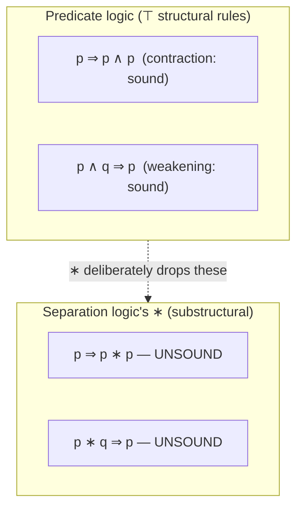

[[book-guidelines|↩ Back to guidelines]]

## The problem this language is built to solve

Ordinary Hoare logic describes *stores* — finite maps from variables to values. Once you add a mutable, aliasable *heap* to the picture (registers plus addressable memory, in Reynolds's low-level imperative language from §1.3), the assertion language of first-order predicate logic is still expressive enough to talk about the heap — you could always write "there exists a heap $h$ such that…" — but it is not *concise*. To say that two data structures don't interfere, classical logic forces you to write out an explicit non-aliasing condition: "for every cell reachable from `x`, it is not equal to any cell reachable from `y`." That condition grows with the size and shape of the structures involved, and it has to be threaded through every single command in a proof, because nothing in the logic tracks disjointness for you.

Separation logic's assertion language adds exactly one primitive idea to fix this: an assertion can describe *how the heap splits into disjoint parts*, and mean two different things about two different parts simultaneously. Once you can say that directly, "no aliasing between these two structures" stops being a side-condition you have to derive and becomes a *fact built into the shape of the assertion itself*.

## The four new assertion forms

Reynolds adds exactly four new syntactic forms to the assertion language, on top of the usual operators and quantifiers of predicate logic:

- $\mathrm{emp}$ — the heap is empty.
- $e \mapsto e'$ — the heap contains **exactly one cell**, at address $e$, holding value $e'$.
- $p_1 * p_2$ (**separating conjunction**) — the heap splits into two *disjoint* parts, one satisfying $p_1$, the other satisfying $p_2$.
- $p_1 \mathbin{-\!*} p_2$ (**separating implication**, read "magic wand") — if you *extend* the current heap with a disjoint part satisfying $p_1$, the extended heap satisfies $p_2$.

Everything else in the assertion language — quantifiers, $\wedge$, $\vee$, $\Rightarrow$ — behaves exactly as in ordinary predicate logic and simply "carries the heap along unchanged." The heap-specific work is concentrated entirely in these four forms.

**What breaks without $*$:** without separating conjunction, "$x$ points to a valid record and $y$ points to a valid record, and they don't overlap" has no compact expression — you'd need to universally quantify over all addresses and state a disjointness predicate by hand, for every pair of structures in every invariant. Separation logic pushes that bookkeeping into the *meaning* of $*$ itself, once, so it never needs to be restated.

### Grounding: separating conjunction is a disjoint-borrow split

If you've written Rust, you already have working intuition for this. `x 7→ e' ∗ y 7→ e''` is exactly the claim a Rust borrow-checker makes when you split a slice:

```rust
fn split_and_mutate(buf: &mut [i32], mid: usize) {
    // Before the split: one exclusive borrow of the whole buffer.
    let (left, right) = buf.split_at_mut(mid);
    // After: two *disjoint* exclusive borrows. The type system
    // guarantees left and right do not alias — this guarantee is
    // exactly what `p1 * p2` asserts about two sub-heaps.
    left[0] = 1;
    right[0] = 2;
}
```

`split_at_mut`'s soundness argument — "these two `&mut` slices cannot overlap, so mutating one cannot invalidate an invariant about the other" — is *precisely* the frame-preserving property that $*$ is designed to let you state as a logical formula instead of as a type-system guarantee baked into one specific API. Separation logic generalizes what `split_at_mut` does for one primitive (contiguous slices) to arbitrary heap shapes (linked structures, trees, dags) described by arbitrary assertions.

A quick Python sketch makes the *semantics* concrete without any type-system machinery — a heap is just a `dict`, and $*$ is a predicate about splitting that dict:

```python
def sat_sep_conj(h: dict, p1, p2) -> bool:
    """s, h |= p1 * p2  iff  h splits into disjoint h0, h1 with h0 |= p1, h1 |= p2."""
    keys = list(h.keys())
    # enumerate all ways to partition the domain into two disjoint parts
    from itertools import combinations
    for r in range(len(keys) + 1):
        for subset in combinations(keys, r):
            h0 = {k: h[k] for k in subset}
            h1 = {k: v for k, v in h.items() if k not in subset}
            if p1(h0) and p2(h1):
                return True
    return False
```

(This brute-force enumeration is obviously not how you'd implement a *checker* — Chapter 2's satisfaction relation gives the real inductive definition — but it pins down that $*$ is a statement about *some* [[Case-Studies-in-Program-Verification#Partition|partition]], not about a fixed one.)

## Abbreviations built from $\mapsto$ and $*$

The bare $e \mapsto e'$ is deliberately austere — one cell, one value — so the notes immediately layer three abbreviations on top of it:

$$e \mapsto - \;\stackrel{\text{def}}{=}\; \exists x_0.\ e \mapsto x_0 \quad (x_0 \text{ not free in } e)$$

"$e$ is an active (allocated) cell, whatever it holds" — you don't care about the value, only that the address is live.

$$e \hookrightarrow e' \;\stackrel{\text{def}}{=}\; e \mapsto e' * \mathrm{true}$$

"$e$ points to $e'$ *somewhere* in the heap" — unlike $\mapsto$, this does **not** pin down the whole heap; there can be arbitrary other cells around. This is the first hint of a distinction the notes promise to make precise in §2.3.3: $e \mapsto e'$ is a **precise** assertion (it fixes exactly which sub-heap it's talking about), while $e \hookrightarrow e'$ is not (the "$* \, \mathrm{true}$" pads it out with an unspecified rest-of-heap).

$$e \mapsto e_1, \ldots, e_n \;\stackrel{\text{def}}{=}\; e \mapsto e_1 * \cdots * e{+}n{-}1 \mapsto e_n$$

A multi-field record is just the separating conjunction of $n$ adjacent single-cell assertions — records aren't a new primitive, they're a *pattern* of $*$.

### What $\wedge$ versus $*$ actually distinguishes

The notes drive the distinction home with five variations on "$x$ and $y$ point to adjacent pairs containing 3 and each other":

| Assertion | Meaning |
|---|---|
| $x \mapsto 3, y$ | $x$'s record: cell holding 3, next cell holding $y$'s value |
| $y \mapsto 3, x$ | $y$'s record: cell holding 3, next cell holding $x$'s value |
| $x \mapsto 3, y * y \mapsto 3, x$ | **both**, on disjoint parts of the heap — two separate two-cell records |
| $x \mapsto 3, y \wedge y \mapsto 3, x$ | **both**, on the *same* heap — only possible if $x$ and $y$ denote the *same* address |
| $x \hookrightarrow 3, y \wedge y \hookrightarrow 3, x$ | either of the previous two, plus possibly unrelated extra cells |

This table is the cleanest illustration in the whole section of why ordinary conjunction cannot do $*$'s job: $\wedge$ demands the *same* heap satisfy both conjuncts, which silently forces aliasing whenever the two conjuncts describe non-identical addresses holding *compatible* data — exactly the kind of accidental aliasing separation logic exists to rule out or make explicit.

## Separating implication as "heap minus a part"

$p_1 \mathbin{-\!*} p_2$ is subtler because, unlike $*$, it does not decompose the *current* heap — it describes what would be true of a *hypothetically extended* heap. O'Hearn's example: if $p$ asserts that `x` points to a two-field record holding 3 and 4 (among other things), then

$$(x \mapsto 3, 4) \mathbin{-\!*} p$$

says: *the current heap is like the one $p$ describes, except that record is missing* — add a disjoint record at `x` holding 3, 4, and you'd get a heap satisfying $p$. Consequently

$$x \mapsto 1, 2 * \bigl((x \mapsto 3, 4) \mathbin{-\!*} p\bigr)$$

describes a heap holding a *different* record (1, 2) at `x`, plus that same "missing piece" — and mutating the two fields to 3 and 4 in place transforms this heap into one satisfying $p$:

$$\{x \mapsto 1, 2 * ((x \mapsto 3, 4) \mathbin{-\!*} p)\}\ [x] := 3;\ [x{+}1] := 4\ \{p\}$$

**What breaks without $\mathbin{-\!*}$:** you cannot state "this heap is $p$ with one specific piece temporarily removed" as a first-class assertion. That's exactly the shape of precondition backward-reasoning rules need (Chapter 3, §3.7–3.9): "the weakest precondition for a mutation to establish $q$ is: the cell exists, and if you replace its contents you'd get $q$" — which is literally $(e \mapsto -) * ((e \mapsto e') \mathbin{-\!*} q)$.

### Grounding: $\mathbin{-\!*}$ as a linear-logic-flavored function type

$\mathbin{-\!*}$ is the separation-logic cousin of linear implication $\multimap$ from linear logic, and this is not a coincidence — separation logic was recognized early on as an instance of the logic of bunched implications (BI), which pairs an additive (ordinary) and a multiplicative (separating) structure side by side. In Lean, you'd model this as a function that *consumes* a disjoint piece of a resource and produces the rest:

```lean
-- A heap is a finite partial map from addresses to values.
-- p1 -* p2, read operationally: "given any h0 disjoint from
-- my heap satisfying p1, extending my heap with h0 satisfies p2."
def wand (p1 p2 : Heap → Prop) : Heap → Prop :=
  fun h => ∀ h0, Disjoint h0 h → p1 h0 → p2 (h0.union h)
```

This is the same shape as a Rust closure that consumes a disjoint capability and hands back a bigger one — `FnOnce(DisjointPart) -> Combined` — which is exactly the intuition an elaborator-style resource-passing scheme (ownership transfer, capability-passing) would need to formalize: $\mathbin{-\!*}$ is what you reach for whenever a specification needs to say "this resource, once you're handed the missing complement."

## Axiom schemata: what $*$ preserves, and what it deliberately breaks

The ordinary rules of predicate calculus remain sound untouched. On top of them, $*$ obeys the laws you'd expect from a *commutative, associative* operation with a neutral element ($\mathrm{emp}$):

$$p_1 * p_2 \Leftrightarrow p_2 * p_1 \qquad (p_1 * p_2) * p_3 \Leftrightarrow p_1 * (p_2 * p_3) \qquad p * \mathrm{emp} \Leftrightarrow p$$

It distributes fully over $\vee$ and $\exists$, but only *semi*-distributes over $\wedge$ and $\forall$:

$$(p_1 \vee p_2) * q \Leftrightarrow (p_1 * q) \vee (p_2 * q) \qquad (\exists x.\ p_1) * p_2 \Leftrightarrow \exists x.\ (p_1 * p_2)$$
$$(p_1 \wedge p_2) * q \Rightarrow (p_1 * q) \wedge (p_2 * q) \qquad (\forall x.\ p_1) * p_2 \Rightarrow \forall x.\ (p_1 * p_2)$$

(Chapter 2 will show the reverse implications hold when one side is a *precise* assertion — the semidistributive laws sharpen into full distributive laws exactly under that extra hypothesis.) $*$ is also monotone with respect to implication, and adjoint to $\mathbin{-\!*}$ via **currying** and **decurrying**:

$$\frac{p_1 * p_2 \Rightarrow p_3}{p_1 \Rightarrow (p_2 \mathbin{-\!*} p_3)} \ (\text{currying}) \qquad\qquad \frac{p_1 \Rightarrow (p_2 \mathbin{-\!*} p_3)}{p_1 * p_2 \Rightarrow p_3} \ (\text{decurrying})$$

This adjunction is exactly the categorical relationship between a product and an exponential — $*$ is to $\mathbin{-\!*}$ as $\times$ is to $\to$ in a closed monoidal category, which is precisely how BI's proof theory is usually set up. If you've internalized currying for functions (`fn(A, B) -> C` is isomorphic to `fn(A) -> fn(B) -> C`), this is the same shape one level up, with "and disjointly" playing the role of the product.

## Unsoundness of contraction and weakening — separation logic is substructural

Here is the schema that most sharply separates $*$ from $\wedge$. For an operation called "conjunction," you'd expect:

$$p \Rightarrow p * p \quad \text{(Contraction)} \qquad\qquad p * q \Rightarrow p \quad \text{(Weakening)}$$

**Both fail.** Take $p = x \mapsto 1$ and $q = y \mapsto 2$. Then $p$ holds of a genuine single-cell heap, but $p * p$ holds of *no* heap at all (splitting a one-cell heap into two disjoint pieces each satisfying "$x \mapsto 1$" is impossible — you'd need two cells at address $x$). Symmetrically, $p * q$ holds of a genuine two-cell heap, but $p$ alone does not hold of any two-cell heap ($x \mapsto 1$ pins the domain down to exactly $\{x\}$).

This is exactly the failure mode that gives separation logic its name in the "substructural logics" family: contraction and weakening are the two structural rules that linear logic drops in order to force each hypothesis to be *used exactly once*. $*$ inherited that discipline. A resource asserted by $p$ can't be duplicated for free (no contraction) and can't be silently discarded (no weakening) — which is exactly what you want from an assertion that's supposed to track *ownership* of a specific, non-duplicable piece of the heap, rather than a duplicable fact about it.



### Grounding: this is why Rust's ownership model needed to exist

The Rust analogy from earlier is not decorative — it is the *same* substructural discipline, enforced at compile time instead of by a program logic:

- **No contraction** ↔ a value behind `&mut T` cannot be duplicated into two live `&mut T`s (the compiler rejects it).
- **No weakening** ↔ a value that must be dropped (has a non-trivial `Drop` impl, or is tracked as "must be consumed," as in a linear-types-style API) cannot be silently discarded.

```rust
fn contraction_fails(x: &mut i32) {
    let y = x; // moves/reborrows — cannot also keep using `x` as an
               // independent exclusive alias to the same cell
    // let z = x; // compile error: x already borrowed mutably as y
}
```

Separation logic's $*$ is what you get if you write that same discipline down as a formula instead of enforcing it with a borrow checker — the assertion language *is* a substructural type system for heap ownership, just expressed as logic rather than as types.

## Where this leads

This section fixes the *syntax and axioms* of the language; it deliberately postpones two things the notes flag explicitly: the precise, structurally-inductive *meaning* of $s, h \models p$ (Chapter 2, "[[Semantics-Of-Assertions|Semantics of Assertions]]"), and the classification of assertions like precise, strictly exact, intuitionistic, and supported (Chapter 2, "[[Special-Classes-Of-Assertions|Special Classes of Assertions]]") that make the semidistributive laws above sharpen into full distributive laws. Everything from here forward — the Hoare-triple specifications of Chapter 3, the frame rule, and the mutation/allocation/lookup inference rules — is built entirely out of the four forms introduced here ($\mathrm{emp}$, $\mapsto$, $*$, $\mathbin{-\!*}$) plus ordinary predicate logic. If you are building a Rust-based verifier with Hoare-triple or refinement-style contracts, this is the layer where you decide your assertion AST's shape: get the representation of $*$ and $\mathbin{-\!*}$ right here (as, e.g., a BI-flavored constraint language rather than bolting separating conjunction onto classical first-order logic as an afterthought), and the frame rule's soundness proof later becomes a straightforward consequence rather than a special case you have to hand-wire in.
