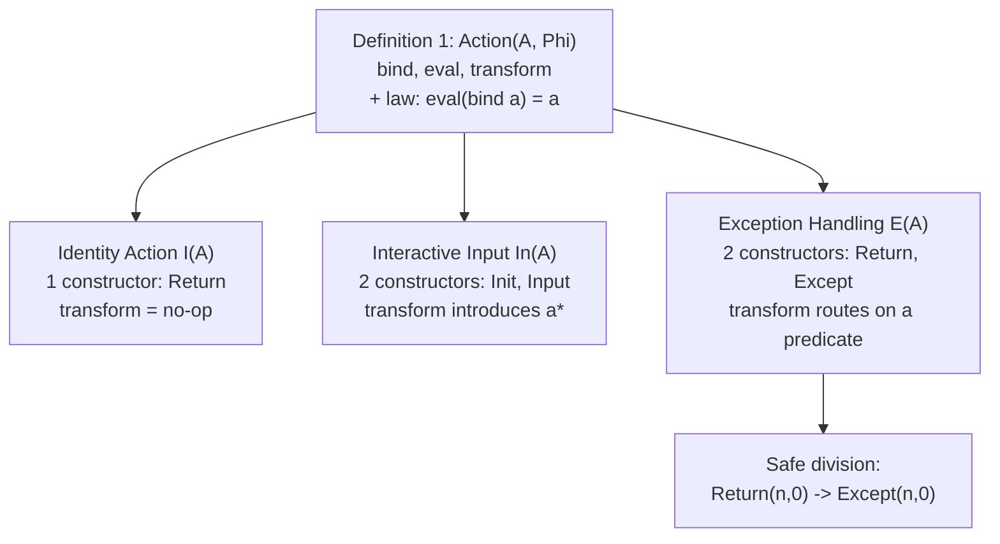

[[book-guidelines|↩ Back to guidelines]]

## The payoff chapter: cashing out Chapter 1's promise

[[Computational-Effects-and-Existing-Models|Chapter 1]] promised a model where "effectful actions are values in and of themselves" rather than passengers riding on top of ordinary values, built inside HoTT specifically for its isomorphism-invariant treatment of equality. Every other chapter has been infrastructure toward that goal — [[Type-Formers|type formers]] and [[Propositions-as-Types|propositions-as-types]] for the vocabulary, [[Equivalence-and-Univalence|Univalence]] for the invariance guarantee, [[Models-of-Computation|classical computability theory]] for the notion of computation being modeled, [[The-Coq-Proof-Assistant|Coq]] for the formalization vehicle. This chapter is where all of it converges into one concrete definition — the **action** type — and three worked instantiations.

## The design constraint: referential transparency, made precise

Before defining anything, the chapter states the property it's optimizing for. Given a type of effects $\Phi$, a program of type $A \to \Phi \to A$ should satisfy **referential transparency**: any input can be swapped for an equivalent value without changing the output, *provided* every $\varphi : \Phi$ fully captures the intended computational effect. This is a real design discipline, not automatic — most of the responsibility sits on however the effect type $\Phi$ gets defined for a given use case, not on the machinery consuming it. Once an action is defined correctly, though, it can be reused freely, the same way defining a datatype once lets you use it anywhere without re-deriving its properties.

Three requirements fall directly out of wanting this property, and each becomes one piece of Definition 1 below:

1. **A set of values $A$.** The book deliberately restricts to *sets* in the [[Equivalence-and-Univalence|technical HoTT sense]] — types whose identity types are themselves propositions, so equality collapses to reflexivity-only. This isn't incidental: it's what makes proving `eval(bind a) = a` tractable later — showing two elements of a set are equal only ever requires exhibiting `refl`, never the fuller apparatus of paths-with-structure.
2. **A type of effects $\Phi(A)$**, parameterized by $A$, whose elements represent every possible effect the action can induce — and crucially, this type must preserve $A$'s structure well enough that inserting an effect into an existing program doesn't disturb the surrounding computation. The book's own analogy: inserting an effect should behave like inserting a `print` statement mid-calculation — visible, but non-disruptive to the calculation's own logic.
3. **A way for an action to transform itself into another action** — modeling, e.g., a game's legal next move. Crucially, **only this transformation operation is permitted to modify the value $a$ bound inside an effect.** Binding and immediately evaluating $a$ must never itself change $a$ — since effects are meant to be first-class data, nothing is allowed to silently mutate that data except through an explicit, named transformation step.

## Definition 1: the action type

> Given a set $A$ and a type $\Phi(A)$ of potential effects parameterized by $A$, an **action** over $\Phi(A)$ comprises:
> - $\mathrm{bind} : A \to \Phi(A)$
> - $\mathrm{eval} : \Phi(A) \to A$
> - $\mathrm{transform} : \Phi(A) \to \Phi(A)$
> - the law: $\prod_{a:A} \mathrm{eval}(\mathrm{bind}\ a) = a$

Read the three functions by role, not just by signature: `bind` *lifts* an ordinary value into effect-space (analogous to a monad's `return`/`pure`); `eval` *extracts* a value back out of an effect (there is no monadic analogue that's always safe — this is deliberately stronger, and it's what lets the thesis treat effects as ordinary, inspectable data rather than an opaque wrapper); `transform` is the *only* place actual effectful behavior — mutation, I/O, exception-raising — is permitted to happen.

The **single law** is the whole axiomatic content of the definition, and it's worth being precise about exactly what it does and doesn't guarantee: it says that *binding a value and immediately evaluating it, with no transform in between*, is a no-op — round-tripping through `bind` then `eval` recovers exactly what you started with. It says **nothing** about what `transform` does; `transform` is free to represent genuinely effectful behavior. The law isolates "wrapping/unwrapping is safe" from "effects can do real work," which is precisely what makes the model both usable (you can always bind-then-eval safely) and expressive (transform still carries real computational content).

```rust
// The general shape, directly transliterated:
trait Action<A> {
    type Phi; // Φ(A)
    fn bind(a: A) -> Self::Phi;
    fn eval(phi: Self::Phi) -> A;
    fn transform(phi: Self::Phi) -> Self::Phi;
    // law (not enforceable by Rust's type system alone — would need
    // a proof obligation in a dependently-typed setting):
    // eval(bind(a)) == a for all a : A
}
```

```lean
-- The law is exactly what Lean would demand as a field of a structure,
-- the same "package a proof obligation into a record" move from
-- The-Coq-Proof-Assistant's `rat` example:
structure Action (A : Type) (Phi : Type) where
  bind      : A → Phi
  eval      : Phi → A
  transform : Phi → Phi
  eval_bind : ∀ a : A, eval (bind a) = a
```

## Proposition 2: lifting ordinary functions into effect-space

Immediately after the definition, the chapter proves the model is usable in practice, not just internally consistent: **any function $f : A \to A$ lifts to a function $f_{\Phi(A)} : \Phi(A) \to \Phi(A)$**, via

$$f_{\Phi(A)} :\equiv \lambda\varphi.\ \mathrm{bind}(f(\mathrm{eval}\ \varphi))$$

Read left to right: take an effect $\varphi$, `eval` it back to a plain value, apply the ordinary function $f$, then `bind` the result back into effect-space. This is the concrete mechanism promised in Chapter 1's "main" example — ordinary, effect-free functions can be composed *through* the effect layer without needing to be rewritten to know anything about $\Phi$. It's the action-type analogue of a monad's `fmap`/fmap-style functorial lift, arrived at directly from `bind` and `eval` rather than postulated as a separate primitive.

## Three instantiations, in increasing complexity

### The Identity Action: the "no effect" baseline

$I(A)$ is an inductive type with **one constructor**, $\mathrm{Return}\ a : I(A)$, and the obvious definitions: $\mathrm{bind}\ a :\equiv \mathrm{Return}\ a$, $\mathrm{eval}(\mathrm{Return}\ a) :\equiv a$, $\mathrm{transform}(\mathrm{Return}\ a) :\equiv \mathrm{Return}\ a$ (transform does literally nothing — that's the entire point of this action). Proposition 3 confirms the eval-bind law: $\mathrm{eval}(\mathrm{bind}\ a) \equiv \mathrm{eval}(\mathrm{Return}\ a) \equiv a$, so $a = a$ by reflexivity — trivial, but it's the sanity check that the definitional machinery actually produces the expected identity when nothing effectful is happening. A program $p : A \to I(A)$ just wraps a value for later use — the book's own framing is that this is useful as a recursion base case, or as the identity element when composing multiple actions.

```rust
enum Identity<A> { Return(A) }
fn bind<A>(a: A) -> Identity<A> { Identity::Return(a) }
fn eval<A>(phi: Identity<A>) -> A { match phi { Identity::Return(a) => a } }
fn transform<A>(phi: Identity<A>) -> Identity<A> { phi } // no-op
```

### Interactive Input: modeling a value that depends on the user

$\mathrm{In}(A)$ has **two constructors**: $\mathrm{Init}\ a$ (no input has occurred yet) and $\mathrm{Input}\ a$ (input has occurred). Definitions: $\mathrm{bind}\ a :\equiv \mathrm{Init}\ a$; $\mathrm{eval}$ extracts $a$ from either constructor; and, the interesting one, $\mathrm{transform}(\mathrm{Init}\ a) :\equiv \mathrm{Input}\ a^{*}$, $\mathrm{transform}(\mathrm{Input}\ a) :\equiv \mathrm{Input}\ a$ — where $a^{*}$, marked with an asterisk, signals that the value produced here may genuinely *differ* from the $a$ that went in, because it now reflects whatever the user actually typed.

**Why the eval-bind law still holds despite this apparent mutation:** the law only constrains bind-then-eval with *no transform step in between* — and `transform` is precisely the operation Definition 1 carved out as the sole place data is allowed to change. $a^*$ only ever shows up after a `transform`, never as a direct consequence of `bind` followed immediately by `eval`. The equational theory doesn't care what specific value $a^*$ turns out to be — only that it remains some element of $A$; user-dependence is captured by *leaving that value unspecified*, not by breaking the type's guarantees.

```rust
enum Input<A> { Init(A), Input(A) }
fn transform_input<A>(phi: Input<A>, user_provided: A) -> Input<A> {
    match phi {
        Input::Init(_a) => Input::Input(user_provided), // a* — genuinely new
        Input::Input(a) => Input::Input(a),
    }
}
```

### Exception Handling: routing "bad" values through a distinguished constructor

$E(A)$ also has two constructors: $\mathrm{Return}\ a$ (an unmodified, non-exceptional value) and $\mathrm{Except}\ a$ (a problematic value, standing in for a raised exception). `bind` and `eval` follow the same pattern as before. `transform`, though, is now genuinely **parameterized by which exception you're trying to catch** — the book gives the simplest possible implementation (identity: re-raise existing exceptions, pass everything else through unchanged) before working a concrete, non-trivial example: **safe division.**

For safe division, you `bind` the pair of operands $(n, m)$, then `transform` routes based on whether the divisor is zero:

$$\mathrm{transform}(\mathrm{Except}\ a) :\equiv \mathrm{Except}\ a$$
$$\mathrm{transform}(\mathrm{Return}\ (n, 0)) :\equiv \mathrm{Except}\ (n, 0)$$
$$\mathrm{transform}(\mathrm{Return}\ (n, m)) :\equiv \mathrm{Return}\ (n, m) \quad (m \neq 0)$$

The mechanism worth naming explicitly, since the book chose it deliberately: **`transform`, not `bind` or `eval`, does the exception-raising work.** `bind` and `eval` stay generic and effect-agnostic across every instantiation of the action type — all the exception-specific logic (what counts as "bad," what constructor to route to) lives entirely inside one function, `transform`, that's free to be redefined per use case without touching the rest of the action's shape.

```rust
enum Exc<A> { Return(A), Except(A) }

fn safe_div_transform(phi: Exc<(i64, i64)>) -> Exc<(i64, i64)> {
    match phi {
        Exc::Except(a) => Exc::Except(a),
        Exc::Return((n, 0)) => Exc::Except((n, 0)),
        Exc::Return((n, m)) => Exc::Return((n, m)),
    }
}
```



## Where this leads

This chapter is the thesis's actual contribution — everything before it was building toward exactly this definition and these three worked examples. The book's own Conclusion (Chapter 6) is candid that this is evidence, not proof: the examples show the action model *can* express identity, interactive I/O, and exceptions, but claims like completeness (does every "reasonable" effect fit this shape?) are explicitly left open. Appendix A's 3-state busy beaver, built with coinductive lists and a `Delay` type, is a related but separate exercise — modeling potentially-non-terminating Turing machines, connecting back to [[Computation-Within-HoTT|the step-indexing discussion]] rather than to the action type directly.

**Connection to the standing project:** the `bind`/`eval`/`transform` split with a single coherence law is a genuinely useful design pattern to borrow directly for how your compiler's own effect-tracking (I/O, mutation, partiality) interacts with refinement-type checking — `transform` is exactly where a Hoare-triple-style precondition/postcondition pair would attach (it's the only function permitted to change the underlying data, so it's the only function that needs a verification condition at all); `bind`/`eval` stay generic plumbing that never needs its own proof obligation beyond the one fixed law. This is a much leaner effect-tracking design than a full monad-transformer stack, and — given the standing project's emphasis on keeping the trusted kernel small — worth considering directly as a model for how effectful operations get represented in your IR: one coherence law to verify once, generically, rather than effect-specific soundness arguments repeated per effect.
