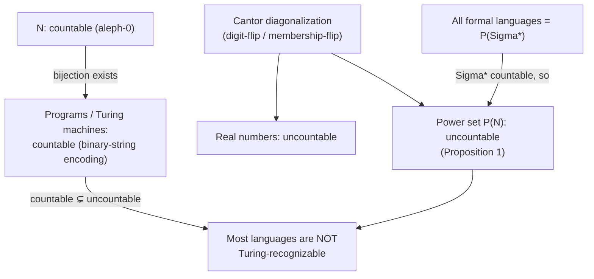

[[book-guidelines|↩ Back to guidelines]]

## Why a thesis about type theory needs to talk about infinity's sizes

[[Models-of-Computation|The previous article]] built the hierarchy of formal languages up to "recursively enumerable" — everything a Turing machine can conceivably recognize. The natural follow-up question, and the one this section answers, is: **is that everything?** Is every formal language Turing-recognizable, or are there languages that outrun computation itself? Answering this requires being precise about something that sounds intuitive but genuinely isn't: comparing the *sizes* of infinite sets. This section is a self-contained detour into that question, and it ends by proving — rigorously, not just gesturing at — that most formal languages are not Turing-recognizable. The tool doing all the work is **Cantor's diagonalization argument**, presented twice: once informally against the real numbers, once formally as a proof about power sets.

## Comparing infinite sets: bijections, not counting

You can't literally count an infinite set's elements, so "same size" needs a different definition: two sets are the same size if there's a **bijection** between them — a pairing where every element of one set has exactly one partner in the other, with none left over on either side. The book's example is deliberately counter-intuitive: $\mathbb{N}$ and $\mathbb{Z}$ are the *same size*, even though $\mathbb{Z}$ naively looks "twice as big" (it has all the negatives too). The pairing $0 \mapsto 0, 1 \mapsto 1, 2 \mapsto -1, 3 \mapsto 2, 4 \mapsto -2, \dots$ (zig-zagging outward) hits every integer exactly once, so the bijection exists, so the sets are equinumerous — infinite-set intuition from finite sets ("adding more elements makes it bigger") simply doesn't transfer.

$\mathbb{N}$ itself defines the smallest infinite size, $\aleph_0$, called **countable infinity**. Any set admitting a bijection with $\mathbb{N}$ is **countable**, no matter how it's dressed up. The book's motivating application: **the class of recursively-enumerable languages (i.e., the set of all possible Turing-machine programs) is countable.** The argument is almost too simple once you see it: every program, in any language, compiles down to a finite binary string, and a finite binary string just *is* a natural number in binary notation. Enumerating natural numbers therefore enumerates every possible program — $0 \mapsto$ "0", $1 \mapsto$ "1", $2 \mapsto$ "10", $3 \mapsto$ "11", and so on. This single fact is the whole engine behind the section's punchline: if the set of programs is only countably infinite, and something else turns out to be *strictly bigger* than countable, that something else cannot possibly be enumerated by programs — it's provably beyond the reach of computation.

## Cantor's diagonalization argument, informally: the reals outrun the naturals

Suppose, for contradiction, that you could list every real number between 0 and 1 against the naturals — $0 \mapsto 0.012345\ldots$, $1 \mapsto 0.123457\ldots$, $2 \mapsto 4.012245\ldots$, and so on, forever. **Diagonalization** builds a new real number guaranteed not to be anywhere on that list, by construction:

1. Take the $n$-th digit of the $n$-th listed real (the "diagonal" of the table).
2. Change that digit: to $5$ if it wasn't already $5$, to $4$ if it was. (The specific choice of 5/4 is arbitrary — the point is just to guarantee a change while dodging the $0.999\ldots = 1.000\ldots$ edge case.)

The resulting number **differs from every entry in the table in at least one digit** (the diagonal position where it was constructed to differ) — so it cannot equal any of them, yet it's a perfectly legitimate real number that was supposedly on the (claimed complete) list. Contradiction: no such complete enumeration can exist. The reals are strictly larger than the naturals.

```python
# The diagonalization construction, made concrete and finite:
# given a finite list of decimal strings, build a string differing
# from every list[i] at position i.
def diagonal(reals: list[str]) -> str:
    out = []
    for i, r in enumerate(reals):
        digit = r[i] if i < len(r) else '0'
        out.append('4' if digit == '5' else '5')
    return '0.' + ''.join(out)
```

This isn't a proof trick specific to real numbers — it's a *general technique* for showing "no bijection with $\mathbb{N}$ can exist," and the book immediately reuses the exact same mechanism, more formally, on power sets.

## The formal version: the power set of any countable set is uncountable

**Proposition 1.** *The power set of any countably infinite set is uncountable.*

*Proof (as given in the book, for $\mathcal{P}(\mathbb{N})$).* Suppose, for contradiction, that $\mathcal{P}(\mathbb{N})$ is countable — then its subsets can be listed as $N_0, N_1, N_2, \ldots$, one $N_i$ for every $i \in \mathbb{N}$. Construct a new set $M$ by diagonalizing against membership rather than against decimal digits:

$$M :\equiv \{\, i \in \mathbb{N} \mid i \notin N_i \,\}$$

$M$ is a subset of $\mathbb{N}$, so under the assumed enumeration, $M = N_j$ for some specific $j$. Now ask: is $j \in M$? By $M$'s own definition, $j \in M \iff j \notin N_j$. But $M = N_j$, so this says $j \in M \iff j \notin M$ — a direct contradiction. So the assumption (that $\mathcal{P}(\mathbb{N})$ is countable) must be false. $\blacksquare$

Notice the structural parallel to the real-numbers argument: both build an object (a number, a set) defined *specifically to disagree with the $i$-th listed item at position/index $i$* — that's diagonalization's essential shape, membership-flipping standing in for digit-flipping.

**Why this proof pattern should look familiar:** it's the same self-reference trap as Russell's paradox (the set of all sets that don't contain themselves) and the same trap [[Foundations-of-Homotopy-Type-Theory|the universe hierarchy]] was built specifically to block at the type-theoretic level. Diagonalization isn't an unrelated clever trick — it's the *general form* of the argument that also produces Russell's paradox and, as the next paragraph shows, the halting problem. All three are instances of "assume a complete self-referential enumeration exists, construct an object designed to contradict its own membership, derive a contradiction."

## The payoff: most formal languages are not Turing-recognizable

Put the two facts together:

- The set of all formal languages over a finite alphabet $\Sigma$ is exactly $\mathcal{P}(\Sigma^*)$ — the power set of the (countably infinite, per [[Models-of-Computation|the previous article's]] enumeration-by-binary-string argument) set of all finite strings $\Sigma^*$.
- By Proposition 1, $\mathcal{P}(\Sigma^*)$ is **uncountable**.
- But the set of Turing-recognizable languages can be placed in correspondence with $\mathbb{N}$ (one per program, by the same "programs are just numbers" argument as before) — so it's only **countable**.

A countable set cannot equal, or even cover, an uncountable one. **Therefore there must exist languages in $\mathcal{P}(\Sigma^*)$ that are not Turing-recognizable — and in fact, uncountably many of them.** This is the crux the whole section was building toward: it's not merely that *some particular* problem (like the halting problem) happens to be undecidable — the argument here shows that undecidable/unrecognizable problems vastly *outnumber* the decidable ones. Decidability is the exception, not the rule, among all logically possible languages.



## Where this leads

This result is what earns Section 3.3's (the next article's) opening move: since HoTT functions are always total, and the halting problem is exactly the kind of question this section's cardinality argument shows is unanswerable in general, reasoning about computation *inside* HoTT has to grapple with encoding partiality on top of a total-functions foundation — the type $\mathbb{1} = \mathbb{2}$ (an empty type, by the earlier $\top \neq \bot$ proof) is the book's own analogy for "the type representing a solution to the halting problem," i.e. provably uninhabited.

**Connection to the standing project:** this is the theoretical ceiling that any sound-and-complete verifier for a Turing-complete language must run into — it's not an engineering shortcoming that a CHC solver or abstract interpreter sometimes fails to terminate or returns "unknown"; Proposition 1's argument is a cardinality-level proof that *most* program properties are undecidable in principle, full stop. This is precisely why real verification toolchains lean on **CEGAR** (counterexample-guided abstraction refinement) and **abstract interpretation with widening** rather than a decision procedure: they're deliberately trading completeness for termination, because a genuinely complete decision procedure for arbitrary program properties over a Turing-complete language is provably impossible — not merely hard — by exactly the diagonalization argument developed here.
