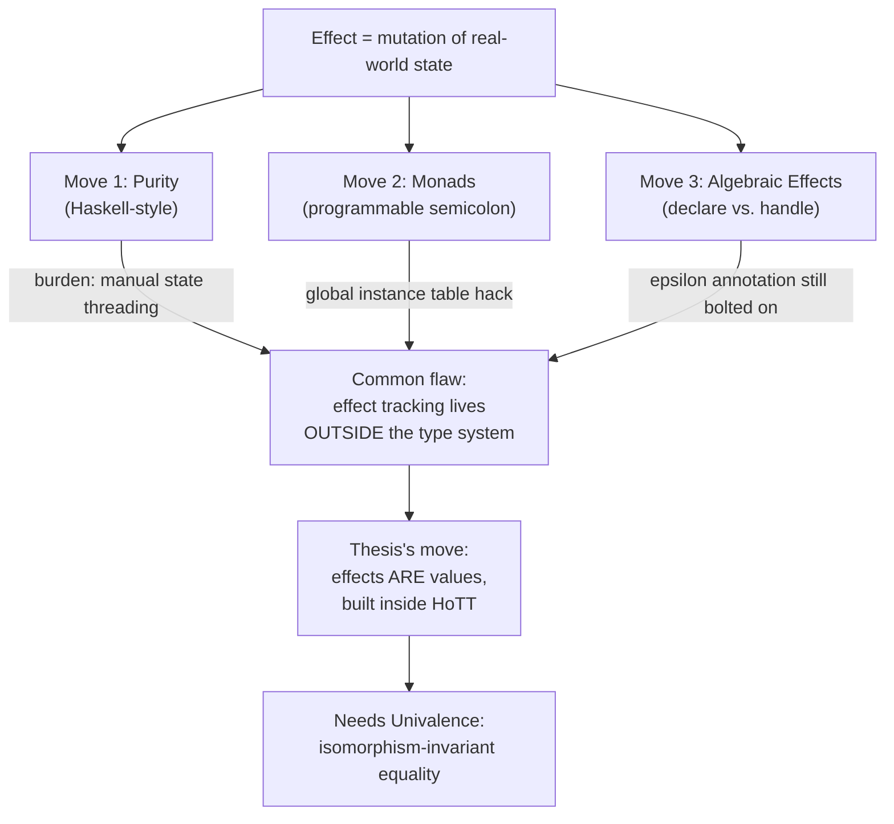

[[book-guidelines|↩ Back to guidelines]]

## What problem is even being described here?

Start from a fact every engineer already knows in their bones: almost no program is "just" a function from input to output. `add(2, 3)` computes 5, sure — but the moment you `printf` that value, you've touched the outside world. You've caused a **mutation of real-world state as a byproduct of computation**. That's the book's definition of a **computational effect**, and it's worth sitting with how broad it is: I/O, mutable variable assignment, looping constructs that depend on external state, thrown exceptions — all of it counts. A program that touches none of this is called **pure**, and pure programs are, in practice, rare. "hello, world" isn't pure. Almost nothing is pure.

If you've ever worked with a type signature like `int add(int, int)` in C, you already know the specific failure mode this chapter is building toward: **that signature is a lie of omission.** `add()` might genuinely just add two integers. Or it might also write to a log file, dereference a null pointer for fun, or — the book's own deadpan example — "fire the proverbial missiles." Nothing in `int add(int, int)` rules any of that out. The type system has told you about the *data* flowing through the function and said nothing whatsoever about the *effects* riding along with it. This is the load-bearing complaint the whole thesis exists to fix: **existing type systems are bad at making effects visible and checkable**, and each prior attempt to fix that (functional purity, monads, algebraic effects) makes a different trade-off. The thesis's own contribution — the "action" model in Chapter 5 — is best understood as: *what if effects were just ordinary values, checkable the same way any other type is checkable?* This chapter is the motivating tour of why that's not what anyone currently does.

## Move 1: functional purity — push effects to the edges

The first fix on offer is architectural, not type-theoretic: **functional programming** treats computation as function application rather than as a sequence of mutating statements. Instead of telling the machine *how* to mutate state step by step, you specify *what the output is*, given the input. Haskell is the book's running example, and it forces the issue by making effectful and non-effectful code syntactically distinct:

```haskell
add :: Integer -> Integer -> Integer
add x y = x + y
```

Compare this to the C snippet above. The Haskell signature makes an actual, checkable promise: this function maps two integers to an integer *and does nothing else*. If you want to print the result, you can't just tack a `printf` onto the end — you must hand the value off to something explicitly annotated as performing I/O.

**What breaks without this:** nothing type-checks against effect-freedom in C, so nothing stops `add()` from secretly mutating global state, and no caller can locally verify it doesn't. Haskell's discipline buys you a real guarantee — "this function is pure" is now a claim the compiler enforces, not a comment you hope is true.

**What this costs you:** the discipline is a burden precisely because effects are common. If a program needs a stack trace on error, the stack state has to be threaded through every call that might need it, "like a relay baton," as the book puts it. Same story for a running counter or any long-lived data structure — anything with a lifetime longer than one function call becomes explicit plumbing. Purity is achievable, but it pushes bookkeeping onto the programmer instead of the type system.

*Rust analogue:* this relay-baton problem is exactly what you feel the first time you try to write purely functional Rust without `RefCell`/`Rc` or a state-threading pattern — passing an accumulator explicitly through a recursive function instead of mutating a field is the same discipline, just visible in a language most engineers already know.

## Move 2: monads — a checked, composable way to carry effects

Eugenio Moggi's *Notions of Computation and Monads* is the book's second stop, and functionally it's a compromise: keep the safety of Move 1, but stop making the programmer manually thread effect-plumbing everywhere. **A monad, in the programmatic sense, is a pair of operations plus a well-defined construction method for producing its elements** — a way to build new types out of existing values, plus a way to compose functions that produce those new types. Because a monad generalizes "sequencing an effectful step after another," it earns the nickname **"programmable semicolon"**: in an imperative language, `;` says "do this, then that, sharing ambient state"; a monad's bind operation says the same thing, but the "ambient state" is now an explicit type parameter instead of an implicit assumption about the machine.

*Rust framing, since Rust doesn't have `do`-notation:* you already use this pattern constantly. `Option<T>`'s `?` operator and `and_then` *are* monadic bind for the "might not have a value" effect; `Result<T, E>`'s `?` is monadic bind for the "might fail" effect. Chaining `.and_then(...).and_then(...)` instead of manually matching on every intermediate `Option` is precisely the "programmable semicolon" idea — the sequencing logic (short-circuit on `None`/`Err`) is baked into the combinator once, instead of hand-written at every call site.

**Where monads fall short, from a type theorist's angle:** the book's specific complaint is that monads let you *step out* of the pure functional world in a disciplined way, but they don't say anything about the underlying type system's own structure — they're a design pattern bolted onto types, not a native feature of the type theory itself. Two concrete symptoms:

1. Haskell reaches for fairly heavyweight structures (typeclasses, `newtype` wrappers) where a type system with genuine dependent types might express the same guarantee more directly and more simply.
2. Because Haskell restricts a type to at most one typeclass instance, the compiler has to maintain a **global instance table** — itself an unfortunate compromise for a language whose entire pitch is avoiding shared mutable state. The mechanism meant to manage effects ends up needing a little bit of global, effect-adjacent state of its own.

## Move 3: algebraic effects — separate declaring an effect from handling it

**Algebraic effects**, introduced by Plotkin and Power (2002), are the third model, aimed at the case where monads get unwieldy — programs with *many* different effects stacked together get messy fast under the monad-transformer style of composition. The core idea: **separate effect declaration (describing the shape/context of the effect) from effect handling (supplying the actual semantics)**. This is structurally the same move as declaring a function's type signature before writing its body — except the "declaration" here is an algebraic data type, and it's parameterized by values pulled up from the underlying program.

Notationally, the book writes an algebraic-effects-style program as $A \to^{\epsilon} B$: a function from $A$ to $B$ that may additionally produce effect $\epsilon$. Its advantage over the monadic style is legibility at the type level — you can look at a signature and immediately tell whether a computation is effect-free (evaluating a bare integer never has a side effect) versus effect-bearing (an I/O handler applied to an integer is a different animal), without having to unpack a stack of monad transformers to find out.

*Rust framing:* this is close in spirit to an effect showing up as a distinct return type or trait bound rather than being buried inside a wrapper monad — think of the difference between `fn read() -> Result<String, IoError>` (the effect is *declared* right there in the signature) versus a hypothetical `IO<String>` monad where you'd have to trace through combinators to know what can happen. Algebraic effects generalize this to arbitrary user-defined effect declarations, with separately-swappable handlers — closer to Rust's trait-object-based dependency injection than to `Result`'s fixed two-case shape.

**Still not quite it:** even algebraic effects, per the book, "divorce the notion of effectful computation from the surrounding type system" — the effect annotation $\epsilon$ sits *alongside* the type discipline rather than being fully unified with it.

## The thesis's actual pitch: stop treating effects as riders on values

All three prior approaches share a structural assumption: an effect is something that *attaches to* or *rides along with* a value — a monad wraps it, algebraic effects annotate the arrow with it. The book's stated goal is to invert this: **treat effectful actions as values in and of themselves**, first-class citizens of the type system rather than passengers.

Concretely, imagine a function `main` meant to replace C's `main()`. It maps a `string` (source code) to *either* a `string` *or* an I/O action — and under this model, "an I/O action" isn't a special annotation bolted onto the arrow; it's just another possible value of the return type, exactly as ordinary as the `string` case. Composing `main` with another function to perform further computation on its input is then just... ordinary function composition. The cost the book is upfront about: you now have to decide, type-theoretically, what counts as an effect-value in the first place. The payoff is that a type checker gets real leverage — it can verify effect-related properties the same mechanical way it already verifies ordinary type correctness, because there's no longer a separate effect-tracking sublanguage to reason about.

**Why homotopy type theory specifically?** The book commits to building this model inside HoTT because of its distinctive treatment of equality — namely the **Univalence Axiom**, which identifies *identity of types* with *equivalence of types*. Practically, this gives:

- a formal basis for function extensionality (two functions that agree on all inputs are *equal*, not just "behave the same"), and
- the guarantee that a theory of effects built over this equality is **isomorphism-invariant** — if you swap one representation of a type for an equivalent one, your effect model doesn't silently break.

Neither guarantee is available for free in ordinary set-theoretic foundations, which is precisely why the book reaches for HoTT rather than staying inside a more familiar categorical (monad-based) setting. You don't need the formal apparatus of Chapters 2–5 yet to feel the shape of the argument: the earlier three models all patch effects on *after* the type system is fixed; this one wants effects to be inhabitants of that type system from the start, in a foundation where "equal" already means something strong enough to make that safe.



## Where this leads

This chapter sets up the entire thesis's motivation but defers all the machinery: Chapter 2 builds the HoTT apparatus (types-as-spaces, judgments, the identity type, and eventually the Univalence Axiom this chapter name-drops as the reason for choosing HoTT at all), Chapters 3–4 lay classical computation theory and [[The-Coq-Proof-Assistant|the Coq proof assistant]] as the formalization vehicle, and Chapter 5 finally cashes out this chapter's promise with the concrete **action** type — a `bind`/`eval`/`transform` triple satisfying a single coherence law, instantiated for identity, interactive input, and exception-handling effects. Every time you hit `bind` in Chapter 5, it's worth remembering it's being pitched as a *replacement* for exactly the monadic `bind` critiqued here — same name, deliberately, but now living inside a type theory whose equality is strong enough (via Univalence) to make the resulting effect-values isomorphism-invariant in a way Haskell's typeclass-based monads never promised to be.

**Connection to the standing project:** the through-line worth flagging for a dependent/refinement-type compiler project is less "adopt HoTT" and more the *diagnosis*: a checker that wants to reason about program correctness (Hoare triples, refinement contracts) needs effects to be visible to the type/constraint layer, not laundered through an ambient monad the constraint solver can't see into. Algebraic effects' "declare vs. handle" split is the closer cousin to how you'd want effect-carrying operations to interact with a constraint-generation pass (declaration site emits constraints; handler resolves them) — worth keeping in mind once verification conditions start needing to talk about I/O or partiality, not just pure arithmetic.
