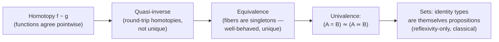

[[book-guidelines|↩ Back to guidelines]]

## The problem: "isomorphic" and "equal" are not the same word by accident

[[Propositions-as-Types|The previous article]] gave you the identity type $a = b$ as *propositional equality* between objects. But there's a harder question lurking: what does it mean for two entire *types* to be equal? In ordinary set theory the honest answer is "almost nothing, unless they're literally the same set" — $\mathbb{N}$ and $\mathbb{Z}$ are merely *isomorphic* (there's a bijection between them), never *equal*, and mathematicians spend a lot of energy being careful about that distinction, routinely writing "equal up to isomorphism" as a hedge. The **Univalence Axiom** is the thesis's stated reason for choosing HoTT as a foundation at all (recall [[Computational-Effects-and-Existing-Models|Chapter 1's]] pitch: isomorphism-invariance for a theory of effects) — so this article is where that promise finally gets cashed out. The book builds it in three stages: homotopy (equating functions), equivalence (a well-behaved notion of "same shape"), then univalence itself (identifying type-equality with type-equivalence).

## Stage 1 — Homotopy: equating functions the way identity types equate objects

Given two functions $f, g : \prod_{a:A} P\ a$ for a dependent type $P : A \to \mathcal{U}$, a **homotopy** $f \sim g$ has type

$$\prod_{a:A} (f\ a = g\ a)$$

— literally, "for every input, $f$ and $g$ produce equal outputs." This is doing for *functions* what the identity type did for objects: giving you a genuine type of proofs that two functions agree everywhere, rather than a bare metatheoretic assertion.

From homotopy, the book recovers a familiar notion first: two types $A, B : \mathcal{U}$ are **isomorphic** in the traditional sense if there exist $f : A \to B$ and $g : B \to A$ with $f \circ g \sim \mathrm{id}_B$ and $g \circ f \sim \mathrm{id}_A$. Packaging this triple — a function $g$ plus the two round-trip homotopies — is called a **quasi-inverse**. The book flags a subtlety worth taking seriously: in HoTT, the type of quasi-inverses for a given $f$ isn't guaranteed to have a *unique* inhabitant. Higher-dimensional structures can have many genuinely different, non-trivial homotopies witnessing the same round-trip — so "quasi-inverse" is not yet the well-behaved notion of equivalence the Univalence Axiom needs; it's a useful stepping stone that turns out to carry too much extra information.

## Stage 2 — Equivalence: fixing quasi-inverse via fibers

To get a notion of "same shape" that behaves properly (unique up to equality, not just "a possibly-many-shaped bundle of witnesses"), the book turns to fibers — recall from [[Foundations-of-Homotopy-Type-Theory|the foundations article]] that the fiber of $f : A \to B$ over $b$ collects every $a$ mapping to $b$. Restated as a $\Sigma$-type:

$$f^{-1}\ b :\equiv \sum_{a:A} \big((f\ a) = b\big)$$

A type $A$ is a **singleton** if it has an element $a$ that's equal to *every* other element of $A$:

$$\mathrm{singleton}\ A :\equiv \sum_{a:A}\prod_{b:A}(a = b)$$

Now the key definition: $f$ is an **equivalence** if every one of its fibers is a singleton —

$$\mathrm{equivalence}\ f :\equiv \prod_{a:A}\big(\mathrm{singleton}\ (f^{-1}\ a)\big)$$

In plain terms: $f : A \to B$ is an equivalence exactly when every $b : B$ has *exactly one* preimage in $A$ — not "at least one, possibly several non-canonically-equal ones" (as quasi-inverse allowed), but genuinely, provably one, up to identity. This is bijectivity, but stated entirely in terms of fibers and identity types rather than borrowed from set theory. The collection of all the ways $A$ and $B$ are equivalent is written $A \simeq B$ — deliberately parallel notation to $A = B$, the collection of ways $A$ and $B$ are *identified*. That parallel is not decoration; it's the whole setup for the axiom itself.

*Lean framing:* this is precisely `Equiv` (`≃`) in Lean/Mathlib — a bundled structure carrying a function, its inverse, and proofs of both round-trip identities, engineered to be well-behaved (via `Function.Bijective`-style uniqueness) in exactly the way the book's fiber-based definition guarantees. When Lean's elaborator needs to transport a term across a `≃`, it's using this exact machinery.

## Stage 3 — Univalence: making the parallel literal

Consider the canonical function

$$\mathrm{idToEq} : (A = B) \to (A \simeq B)$$

Given any proof that $A$ and $B$ are *identical* (a path between them as types), $\mathrm{idToEq}$ manufactures a proof that they're *equivalent*. This function always exists, trivially, by path induction — equal things are certainly equivalent. The **Univalence Axiom** asserts something much stronger: $\mathrm{idToEq}$ is itself an equivalence:

$$(A = B) \simeq (A \simeq B)$$

The book calls this "remarkable" for two concrete reasons, both worth holding onto precisely, because they're the two halves of what "isomorphism-invariance" cashes out to:

1. **It gives a formal license to treat equivalences as equalities.** The bijection between the naturals and the integers isn't merely a "handy function" you happen to be able to write down — under Univalence it *is* an equivalence, and by the axiom, equivalences and identities are interchangeable. Anything provable about $\mathbb{N}$ transports automatically to anything equivalent to $\mathbb{N}$, because they're now, formally, equal.
2. **It implies multiple, genuinely distinct proofs of identity can exist beyond reflexivity.** Once $(A = B) \simeq (A \simeq B)$ holds, every different way of exhibiting $A \simeq B$ (every different bijection) becomes a different path in $A = B$ — identity between types is no longer a single flat "yes/no," it has real internal structure, mirroring the earlier observation about homotopies not being unique.

This second point is what makes HoTT genuinely different from set theory rather than just notationally different: in set theory, "$A = B$" for sets is either trivially true (same set) or meaningless (different sets, at best isomorphic); in HoTT, $A = B$ is *itself a type*, potentially inhabited in many distinct ways, one per bijection.

## Sets: the special case where identity collapses back to reflexivity

Not every type needs this rich structure — sometimes you genuinely want the classical, flat behavior where there's exactly one way for two things to be equal. The book names this case explicitly: a type $A$ is a **set** if its elements are identified only by reflexivity, formalized using the $\mathrm{Prop}$ type from [[Propositions-as-Types|the previous article]]:

$$\mathrm{set}\ A :\equiv \prod_{a,b:A} \mathrm{Prop}\ (a = b)$$

— i.e., for every pair $a, b : A$, the identity type $a = b$ is itself a proposition (contractible when inhabited: at most one "shape" of proof). Under Univalence, this is a genuinely useful escape hatch: whenever you want ordinary, boring, unique-equality mathematics (the kind most working programmers already assume by default), you work inside a set, and you no longer have to hedge with "equal up to homotopy" the way naive HoTT prose otherwise would — homotopy and identity have already been shown equivalent, so within a set that equivalence is simply trivial and single-valued.

## Where this leads

Univalence is the axiom the entire thesis's foundational choice hangs on — [[Computational-Effects-and-Existing-Models|Chapter 1]] promised "isomorphism-invariance" for a theory of computational effects, and this is precisely the mechanism delivering it: any two isomorphic representations of an effectful computation become, under Univalence, *literally interchangeable* as far as any later proof is concerned. This resurfaces directly in Chapter 8's discussion of the open problem of a *computational* interpretation of Univalence (an axiom, not a computation rule — Coq and other proof assistants historically had to postulate it, at some cost to computability), and in Chapter 5, where the action type's eval-bind law is precisely the sort of statement whose invariance under Univalence is what makes it robust to swapping one concrete effect representation for an equivalent one.

**Connection to the standing project:** this is the mechanism underneath "type-level transport" — an elaborator that needs to move a term of type `P a` to type `P b` given a proof `a = b` is doing path induction (already covered), but when the equality is between *types themselves* rather than terms, Univalence is what licenses treating that transport as free and safe rather than a leap of faith. A refinement-type checker's own $A \simeq B$ machinery (e.g. two differently-phrased but logically-equivalent refinement predicates on the same base type) is exactly the equivalence-not-mere-isomorphism distinction drawn here — and the `set` definition is the formal justification for why most of the checker's *own* internal bookkeeping (contexts, substitutions, syntactic terms) can safely be treated with plain, boring, decidable equality: those are sets, in this precise technical sense, and don't need the full homotopical machinery to reason about correctly.
