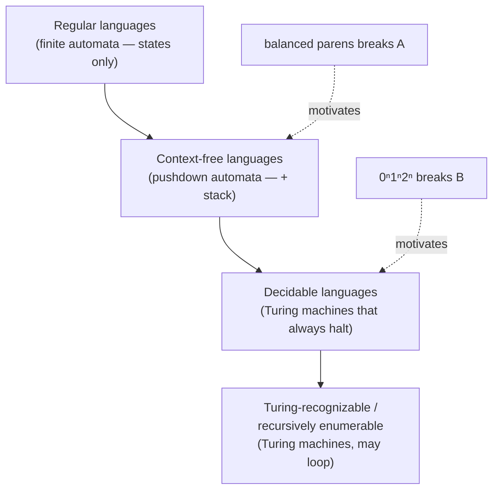

[[book-guidelines|↩ Back to guidelines]]

## Why the thesis takes this detour through classical computability theory

The thesis's real destination is a HoTT model of effects (Chapter 5), so it might seem odd that Chapter 3 spends ten pages on finite automata and Turing machines — material any computer science undergraduate already has. The reason is structural, not pedagogical filler: before you can ask "what does a computational effect look like as a type," you first need a precise, agreed-upon notion of "computation" itself, one rigorous enough to later be *encoded inside* a type theory (Section 3.3, and the next article's cardinality argument, both depend on the definitions built here). This article covers the classical hierarchy: finite automata, pushdown automata, and Turing machines, each strictly more powerful than the last, each solving a specific representational gap the previous machine couldn't close.

## Formal languages: the object being classified

A **formal language** is a set of symbols (an **alphabet**) paired with a set of strings over that alphabet. Example: alphabet $\{0,1\}$, language = every binary string with an even number of zeroes ($\epsilon$, the empty string, included — it has zero zeroes, which is even). Alphabets are always finite, though there's no upper bound on how large; binary is the default choice mostly because it mirrors how physical computers are built and keeps function definitions over the alphabet simple.

Different classes of formal languages correspond to different classes of **automata** — abstract machines that read a string symbol-by-symbol, transition between states, and end up accepting or rejecting. The rest of this article is the hierarchy of automata, each rung defined by *what memory structure* you bolt onto the previous rung.

## Rung 1 — Finite automata: state, no memory

A **finite automaton** is exactly the tuple $(Q, \Sigma, \delta, q_0, F)$:

- $Q$ — a finite set of states
- $\Sigma$ — the input alphabet
- $\delta : Q \times \Sigma \to Q$ — the transition function
- $q_0 \in Q$ — the start state
- $F \subseteq Q$ — the accept states

Computation starts at $q_0$, transitions on every symbol read, and **accepts** a string iff the machine lands in some state in $F$ after consuming the whole string. A **regular language** is any language recognized by some finite automaton — the set of strings with an even number of zeroes is one; so is the empty language $\emptyset$ (accepted by an automaton with no accept states — note $\emptyset \ne \varepsilon$: the empty *language* contains no strings at all, the empty *string* is a single, valid, zero-length string).

```rust
struct FiniteAutomaton<S: Eq + Copy> {
    start: S,
    accept: Vec<S>,
    delta: fn(S, char) -> S,
}

fn accepts<S: Eq + Copy>(fa: &FiniteAutomaton<S>, input: &str) -> bool {
    let mut state = fa.start;
    for c in input.chars() {
        state = (fa.delta)(state, c);
    }
    fa.accept.contains(&state)
}
```

**What breaks without more memory:** balanced parentheses. No finite automaton can accept `()(()(()))` while rejecting `(()))` — doing so requires *counting* open parens, and a finite automaton's entire state is bounded in advance (finitely many states), so it can't count arbitrarily high. This is the concrete failure mode that motivates the next rung — not an abstract "finite automata are weak" claim, but a specific language they provably cannot recognize.

## Rung 2 — Pushdown automata: add a stack

A **pushdown automaton** adds exactly one thing to a finite automaton: a stack. Formally $(Q, \Sigma, \Gamma, \delta, q_0, F)$ where $\Gamma$ is the stack alphabet and

$$\delta : Q \times (\Sigma \cup \{\varepsilon\}) \times (\Gamma \cup \{\varepsilon\}) \to \mathcal{P}(Q \times \Gamma)$$

Note the **power set** $\mathcal{P}(\cdot)$ in the codomain — pushdown automata, as defined here, are inherently **non-deterministic**: a given state can have several legal transitions, and the machine conceptually takes all of them "simultaneously" (think many-threaded speculative execution — the machine accepts if *any* thread reaches an accept state with the input consumed and the stack empty). This matters concretely: **non-deterministic pushdown automata are strictly more powerful than deterministic ones** (they accept a strict superset of languages) — a genuine departure from finite automata, where adding non-determinism buys you *no* extra power (any non-deterministic finite automaton has an equivalent deterministic one via the subset construction).

The balanced-parentheses machine works by pushing a marker for every `(` and popping one for every `)`, accepting only when input is exhausted, the stack is back to its base marker, and the machine is in an accept state.

```rust
fn balanced_parens(input: &str) -> bool {
    let mut stack = Vec::new();
    for c in input.chars() {
        match c {
            '(' => stack.push(c),
            ')' => if stack.pop().is_none() { return false },
            _ => {}
        }
    }
    stack.is_empty()
}
```

**Context-free languages** are exactly the class recognized by pushdown automata — they strictly contain the regular languages (a pushdown automaton that simply never touches its stack is just a finite automaton), and they're the backbone of programming-language syntax, which is exactly why context-free *grammars* are the standard tool for describing a language's parse structure.

**What breaks without more memory still:** the language $\{0^n1^n2^n \mid n \geq 0\}$ — matching zeroes to ones is a single counting task a stack handles fine, but matching *three* quantities simultaneously needs more than a single LIFO stack can track. This is the motivating failure for the final rung.

## Rung 3 — Turing machines: add an infinite tape

A **Turing machine** replaces the stack with an infinite, randomly-addressable tape, read and written by a head that moves left or right one cell per step. Formally $(Q, \Sigma, \Gamma, \gamma, \delta, q_0, q_{\text{accept}}, q_{\text{reject}})$ where $\gamma \in \Gamma \setminus \Sigma$ is a distinguished blank-cell symbol and

$$\delta : Q \times \Gamma \to Q \times \Gamma \times \{L, R\}$$

— read the current cell, write a new symbol, move the head, change state. Computation halts by entering $q_{\text{accept}}$ or $q_{\text{reject}}$; critically, **if it never enters either, it runs forever.** This is the property with no analogue in the earlier machines — a finite automaton or pushdown automaton always finishes once the input is consumed; a Turing machine might just keep going, and there's no bound on how long you have to wait to find out.

```rust
enum Move { Left, Right }
struct TuringMachine<S: Eq + Copy> {
    tape: Vec<char>,
    head: usize,
    state: S,
    delta: fn(S, char) -> (S, char, Move),
    accept: S,
    reject: S,
}
// A run may never terminate — there is no total `run` function
// that always returns a bool, only one that returns a bool *if it halts*.
```

This non-termination is exactly the "encoding partiality" problem the next article's Section 3.3 has to solve — a Turing machine's run function is fundamentally *partial*, and HoTT functions are, per [[Foundations-of-Homotopy-Type-Theory|the foundations article]], always total by construction. That tension is deferred to the closing synthesis below.

**The language hierarchy this produces**, precisely defined:

- **Decidable (recursive)** languages: a Turing machine that, for *every* input, halts in either accept or reject.
- **Turing-recognizable** languages: a Turing machine that accepts every string *in* the language, but may reject or loop forever on strings *not* in the language. (Every decidable language is Turing-recognizable; not every Turing-recognizable language is decidable.)
- **Recursively enumerable** languages: the umbrella term for everything a Turing machine can handle at all — this is, per the book, "as powerful as formal languages get, at least in the context of computation," since the Turing machine is definitionally what "computable" means.



## Where this leads

This hierarchy is the vocabulary [[Cardinality-and-Uncountability|the next article]] needs to state its central result — that there exist languages *beyond* even the recursively-enumerable class, i.e. beyond anything any Turing machine, and therefore anything computable, can recognize. It's also the direct setup for Chapter 3's own Section 3.3 ([[Computation-Within-HoTT|Computation Within HoTT]]), which asks what it means to encode a Turing machine — an inherently partial, potentially non-halting object — as a total, always-terminating HoTT function, and for Appendix A's concrete Coq implementation of a 3-state busy beaver.

**Connection to the standing project:** this ladder — states, then a stack, then random-access memory — is the same ladder a program-analysis or abstract-interpretation engine climbs when choosing an abstract domain: a finite-state abstraction (e.g. a simple taint lattice) buys decidability and termination for free; a pushdown/stack-aware abstraction (needed for e.g. precise call-stack-sensitive analysis) buys more precision at the cost of needing careful widening; full Turing-power (arbitrary recursive/looping program behavior) is exactly why a sound verifier can never fully automate termination checking and must fall back on abstraction, widening operators, or user-supplied ranking functions — this is the theoretical floor underneath why a CHC solver or abstract interpreter for a Turing-complete language must, provably, sometimes fail to terminate or fail to decide, not because of an engineering gap but because of the halting-problem-adjacent limits this article's machine hierarchy makes precise.
